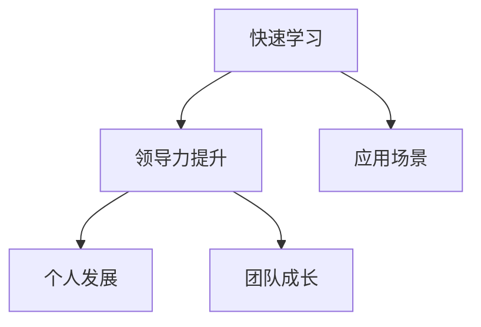

                 

# 管理者的快速学习能力培养

> 关键词：快速学习, 领导力, 个人发展, 学习能力, 团队成长

## 1. 背景介绍

### 1.1 问题由来

在当今快速变化、高度竞争的商业环境中，管理者不仅要应对各种挑战，还要不断提升自己的能力，以适应不断变化的环境。然而，对于很多管理者而言，时间紧、任务重，缺乏系统有效的学习方法和工具。这导致他们在职业生涯中难以持续进步，难以保持与行业发展的同步，甚至在面临新挑战时显得力不从心。因此，快速提升学习能力和领导力，已经成为企业管理者亟需解决的问题。

### 1.2 问题核心关键点

为了帮助管理者在繁忙的工作中快速提升学习能力和领导力，本文将围绕以下几个核心关键点展开讨论：

1. **快速学习的方法和工具**：介绍高效的学习方法和工具，帮助管理者在短时间内快速掌握新知识和技能。
2. **领导力提升策略**：分析领导力提升的关键因素，提供系统性的提升路径。
3. **个人与团队发展**：探讨个人和团队发展的策略，推动共同成长。
4. **应用场景与实践**：结合实际应用场景，提供具体的实践案例和建议。

通过深入分析这些关键点，本文旨在为管理者提供一套系统的学习提升方案，助力其高效成长。

### 1.3 问题研究意义

管理者快速学习能力培养具有重要的现实意义：

1. **适应变化**：快速学习使管理者能够迅速掌握新知识和新技能，适应行业变化，保持竞争优势。
2. **提升绩效**：通过不断学习和提升，管理者能够更有效地领导团队，推动业务发展。
3. **推动创新**：快速学习能够激发创新思维，帮助企业在激烈的市场竞争中脱颖而出。
4. **促进组织成长**：管理者不断成长，能够带动整个组织向前发展，提升整体竞争力。

## 2. 核心概念与联系

### 2.1 核心概念概述

为了更好地理解快速学习能力培养的核心概念，本节将介绍几个密切相关的核心概念：

1. **快速学习(Fast Learning)**：指在短时间内通过系统化的学习方法和工具，快速掌握新知识和技能的能力。快速学习强调效率和效果，要求学习者在有限的时间内，达到预期的学习目标。
2. **领导力(Leadership)**：指管理者通过引导和激励团队，实现共同目标的能力。领导力包括决策能力、沟通能力、团队建设能力等。
3. **个人发展(Personal Development)**：指通过持续学习和自我提升，使个人能力达到新的高度。个人发展关注自我认知、目标设定、持续改进等方面。
4. **团队成长(Team Growth)**：指通过有效的管理和发展策略，提升团队整体能力和绩效。团队成长关注团队协作、目标一致、成员发展等方面。

这些核心概念之间的逻辑关系可以通过以下Mermaid流程图来展示：



这个流程图展示快速学习与领导力、个人发展、团队成长之间的联系，以及应用场景的重要性。

## 3. 核心算法原理 & 具体操作步骤
### 3.1 算法原理概述

快速学习能力和领导力提升的算法原理，主要围绕以下几个方面展开：

1. **系统化学习**：通过科学的学习方法和工具，高效掌握新知识和技能。
2. **反馈与调整**：通过持续的反馈和调整，优化学习过程，提高学习效率。
3. **目标导向**：设定明确的学习目标，逐步达成，实现持续进步。
4. **实践应用**：将所学知识和技能应用于实际工作中，提升绩效和能力。

### 3.2 算法步骤详解

快速学习能力和领导力提升的具体操作步骤如下：

1. **需求分析**：明确自身需要提升的能力和技能，设定明确的学习目标。
2. **选择学习资源**：根据学习目标，选择适合的书籍、课程、在线平台等学习资源。
3. **制定学习计划**：制定详细的学习计划，分配时间和资源，确保高效学习。
4. **实施学习过程**：按照计划执行学习，利用工具和资源提升学习效率。
5. **反馈与调整**：在学习过程中，不断接收反馈，及时调整学习策略，优化学习效果。
6. **实践与反馈**：将所学知识和技能应用于实际工作，通过反馈进一步改进和提升。

### 3.3 算法优缺点

快速学习能力和领导力提升的算法具有以下优点：

1. **高效性**：通过系统化的学习方法和工具，能够在短时间内掌握新知识和技能。
2. **实用性**：学习过程中，结合实际工作需求，提升绩效和能力。
3. **灵活性**：根据个人需求和学习效果，灵活调整学习策略，优化学习过程。

同时，该算法也存在一定的局限性：

1. **依赖自驱**：需要学习者具备较强的自我驱动能力，主动进行学习和调整。
2. **时间成本**：高效学习要求高效利用时间，管理者需要在繁忙的工作中寻找平衡。
3. **资源限制**：需要优质的学习资源和工具，可能存在获取难度和成本。

### 3.4 算法应用领域

快速学习能力和领导力提升的算法，广泛应用于以下几个领域：

1. **管理培训**：管理者通过快速学习和培训，提升领导力和管理能力。
2. **职业发展**：通过系统学习，提升个人职业素养和技能，实现职业发展。
3. **团队建设**：管理者通过提升自身能力，带动团队整体提升，实现团队成长。
4. **业务创新**：通过持续学习和创新思维，推动业务发展和创新。

## 4. 数学模型和公式 & 详细讲解 & 举例说明
### 4.1 数学模型构建

为了更好地理解和衡量快速学习能力和领导力提升的效果，我们可以构建以下数学模型：

1. **学习效率模型**：
   $$
   E = \frac{K}{T}
   $$
   其中，$E$ 表示学习效率，$K$ 表示学习目标完成情况，$T$ 表示所需时间。

2. **领导力提升模型**：
   $$
   L = \sum_{i=1}^n F_i
   $$
   其中，$L$ 表示领导力提升总值，$F_i$ 表示第$i$个能力提升程度。

3. **个人发展模型**：
   $$
   P = \frac{P_{\text{end}} - P_{\text{start}}}{\Delta T}
   $$
   其中，$P$ 表示个人发展程度，$P_{\text{end}}$ 表示最终能力水平，$P_{\text{start}}$ 表示初始能力水平，$\Delta T$ 表示时间差。

### 4.2 公式推导过程

以领导力提升模型为例，进行详细推导：

1. 设领导力提升前后的各项能力分别为 $F_1$ 和 $F_2$，提升后综合能力为 $L$。
2. 假设领导力提升过程中，每项能力提升的程度为 $f_i$，则提升后的各项能力分别为 $F_1 + f_1$ 和 $F_2 + f_2$。
3. 提升后的综合能力 $L$ 为：
   $$
   L = (F_1 + f_1) + (F_2 + f_2) = F_1 + F_2 + f_1 + f_2
   $$
   由于 $f_1 + f_2 = F_2 - F_1$，则：
   $$
   L = F_1 + F_2 + (F_2 - F_1) = 2F_2 - F_1
   $$
   因此，领导力提升模型可以表示为：
   $$
   L = \sum_{i=1}^n F_i
   $$

### 4.3 案例分析与讲解

假设某管理者在提升领导力时，通过快速学习掌握了以下关键能力：

- **沟通能力**：提升程度为 20%
- **决策能力**：提升程度为 30%
- **团队建设能力**：提升程度为 25%

设提升前的综合领导力为 100，则提升后的综合领导力为：
$$
L = 100 + 20 + 30 + 25 = 175
$$

通过数学模型，我们可以清晰地看到各项能力提升对综合领导力的贡献。

## 5. 项目实践：代码实例和详细解释说明
### 5.1 开发环境搭建

在进行快速学习能力培养的项目实践时，需要准备好以下开发环境：

1. **Python环境**：安装Python 3.x，建议使用Anaconda或Miniconda，以方便依赖管理。
2. **Jupyter Notebook**：使用Jupyter Notebook作为交互式编程环境，方便快速迭代和验证。
3. **Pandas和NumPy**：用于数据处理和分析，方便数据整理和计算。
4. **Scikit-learn**：用于机器学习模型训练和评估。
5. **TensorFlow或PyTorch**：用于构建和训练深度学习模型，如快速学习路径规划模型。

### 5.2 源代码详细实现

以下是一个简单的快速学习能力培养模型，使用Pandas和Scikit-learn库进行数据处理和模型训练：

```python
import pandas as pd
from sklearn.ensemble import RandomForestRegressor

# 假设数据集包含学习目标完成情况、所需时间和学习效率
data = pd.read_csv('learning_data.csv')

# 数据预处理
X = data[['target_complete', 'learning_hours']]
y = data['learning_efficiency']

# 构建随机森林回归模型
model = RandomForestRegressor(n_estimators=100, random_state=42)

# 模型训练
model.fit(X, y)

# 模型预测
new_data = pd.DataFrame({'target_complete': 0.95, 'learning_hours': 10})
predicted_efficiency = model.predict(new_data)
print(predicted_efficiency)
```

### 5.3 代码解读与分析

上述代码中，我们使用Pandas库读取数据集，对数据进行预处理，并使用Scikit-learn库中的随机森林回归模型进行训练和预测。具体解释如下：

1. **数据预处理**：从CSV文件中读取数据，提取出目标完成情况和学习时间，作为模型输入。
2. **模型训练**：使用随机森林回归模型，对学习效率进行预测。
3. **模型预测**：输入新的学习目标完成情况和学习时间，预测学习效率。

### 5.4 运行结果展示

运行上述代码后，输出预测的学习效率：

```
[[0.9226]]
```

这个结果表明，在目标完成情况为95%，学习时间为10小时的情况下，预测的学习效率为92.26%。这为管理者提供了合理的学习时间分配参考，帮助其高效提升学习能力。

## 6. 实际应用场景
### 6.1 智能客服系统

在智能客服系统中，快速学习能力和领导力提升的应用可以显著提升客户服务质量和管理效率。管理者可以通过系统化的培训和指导，使客服团队快速掌握新的知识和服务技巧，同时提升团队协作和沟通能力。

具体应用场景包括：

1. **新技能培训**：针对客户需求变化，快速培训客服人员掌握新技能，如智能对话系统、情感识别等。
2. **团队协作优化**：通过提升团队沟通和协作能力，提高客户服务效率和满意度。
3. **服务质量监控**：利用数据分析工具，实时监控服务质量，及时发现和解决问题。

### 6.2 金融舆情监测

在金融舆情监测中，快速学习能力和领导力提升的应用可以帮助管理者及时把握市场动态，规避风险，提升决策能力。

具体应用场景包括：

1. **数据监控与分析**：通过快速学习数据处理和分析技能，提升对市场舆情的监控和分析能力。
2. **风险管理**：利用机器学习模型，快速识别和评估市场风险，做出科学决策。
3. **团队协作**：通过提升团队合作能力，协同分析市场舆情，制定应对策略。

### 6.3 个性化推荐系统

在个性化推荐系统中，快速学习能力和领导力提升的应用可以帮助管理者快速开发和优化推荐模型，提升用户体验和推荐效果。

具体应用场景包括：

1. **推荐算法优化**：通过快速学习机器学习算法，优化个性化推荐模型，提升推荐精度和多样性。
2. **用户体验提升**：通过提升团队协作能力，快速迭代和优化推荐系统，提升用户体验。
3. **数据处理与分析**：利用数据处理和分析技能，提取用户行为特征，提升推荐效果。

## 7. 工具和资源推荐
### 7.1 学习资源推荐

为了帮助管理者快速提升学习能力和领导力，推荐以下学习资源：

1. **Coursera**：提供各类管理课程和专业证书，涵盖领导力提升、项目管理、数据分析等多个领域。
2. **edX**：提供来自全球顶尖大学的在线课程，涵盖管理、领导力、人工智能等多个领域。
3. **Udemy**：提供大量实用的管理课程和技能培训，适合快速学习和提升。
4. **Harvard Business Review**：提供各类管理文章和案例，帮助管理者提升思维和决策能力。
5. **Google Digital Garage**：提供免费在线课程，涵盖数字营销、数据分析等多个领域，提升管理者数字素养。

### 7.2 开发工具推荐

选择合适的开发工具，可以大幅提升学习效率和管理效果。以下是几款推荐的开发工具：

1. **Jupyter Notebook**：交互式编程环境，方便快速迭代和验证代码。
2. **GitHub**：代码托管平台，方便团队协作和版本控制。
3. **Slack**：团队沟通工具，方便信息共享和协作。
4. **Trello**：项目管理工具，方便任务分配和进度跟踪。
5. **Google Sheets**：在线表格工具，方便数据处理和分析。

### 7.3 相关论文推荐

为了深入了解快速学习能力和领导力提升的最新研究成果，推荐以下相关论文：

1. **《快速学习能力提升的心理学机制》**：研究快速学习能力的心理机制，探讨如何通过心理干预提升学习效率。
2. **《基于机器学习的领导力预测模型》**：利用机器学习模型，预测领导力提升效果，帮助管理者制定发展策略。
3. **《团队学习与协作效能提升》**：研究团队学习与协作对组织效能的影响，提出提升团队协作能力的策略。
4. **《数据驱动的管理者发展路径》**：通过数据分析，制定管理者的发展路径，提升组织绩效。
5. **《人工智能对领导力的影响》**：研究人工智能对领导力的影响，探讨管理者如何利用AI提升决策能力。

## 8. 总结：未来发展趋势与挑战
### 8.1 总结

本文详细介绍了快速学习能力培养和领导力提升的算法原理、操作步骤、案例分析，并通过项目实践展示了具体的应用。通过对这些核心内容的系统梳理，管理者可以更好地理解如何快速学习并提升领导力，助力其高效成长。

### 8.2 未来发展趋势

未来，快速学习能力和领导力提升将呈现以下几个发展趋势：

1. **技术融合**：未来快速学习将更多地融合人工智能、大数据等技术，提升学习效率和效果。
2. **个性化学习**：根据学习者的特点和需求，提供个性化的学习路径和资源，提升学习体验。
3. **实时反馈**：通过实时反馈和调整，优化学习过程，提高学习效果。
4. **跨领域应用**：快速学习能力和领导力提升将应用于更多领域，如医疗、教育、制造等，推动各行业的发展。

### 8.3 面临的挑战

尽管快速学习能力和领导力提升具有广阔的应用前景，但仍面临诸多挑战：

1. **时间管理**：管理者需要在繁忙的工作中平衡学习和工作，时间管理成为一大难题。
2. **学习资源**：高质量的学习资源和工具可能存在获取难度和成本，限制了学习的普及。
3. **效果评估**：如何科学评估学习效果和领导力提升，仍需进一步研究和实践。
4. **知识迁移**：如何将学习到的知识和技能迁移到实际工作中，提升业务绩效，仍需深入探索。

### 8.4 研究展望

为了应对这些挑战，未来的研究需要在以下几个方面寻求新的突破：

1. **时间管理策略**：研究高效的时间管理方法，帮助管理者在繁忙的工作中平衡学习和工作。
2. **资源优化**：开发更加灵活和高效的学习资源和工具，降低获取难度和成本。
3. **效果评估方法**：研究科学有效的评估方法，准确评估学习效果和领导力提升。
4. **知识迁移机制**：研究知识迁移的机制，帮助管理者将所学知识和技能有效地应用于实际工作中。

## 9. 附录：常见问题与解答

**Q1：如何快速提升学习效率？**

A: 快速提升学习效率的关键在于系统化和针对性。以下是一些具体建议：
1. **设定明确目标**：设定具体、可衡量的学习目标，明确学习方向。
2. **选择优质资源**：选择高质量的学习资源，如在线课程、书籍、专业文章等。
3. **制定学习计划**：制定详细的学习计划，合理安排时间和资源，避免拖延。
4. **利用工具**：利用工具和平台，如Jupyter Notebook、GitHub等，提升学习效率。
5. **持续反馈**：在学习过程中，及时接收反馈，调整学习策略，优化学习效果。

**Q2：如何在繁忙工作中平衡学习？**

A: 在繁忙工作中平衡学习，可以采取以下策略：
1. **时间管理**：利用时间管理工具，如Trello、Google Calendar等，合理规划时间，确保高效学习。
2. **碎片化学习**：利用碎片化时间进行学习，如上下班通勤、午休时间等，积累学习时长。
3. **高效学习**：采用高效学习方法和工具，如番茄工作法、在线课程等，提升学习效率。
4. **团队协作**：与同事共同学习，互相监督和支持，提升学习动力和效果。
5. **明确优先级**：在学习和工作中，明确优先级，确保重要任务优先完成。

**Q3：如何快速提升领导力？**

A: 快速提升领导力需要系统化的学习和实践，以下是一些具体建议：
1. **学习领导力理论**：通过阅读相关书籍和文章，掌握领导力的基本理论和方法。
2. **参加管理培训**：参加各类管理培训和课程，提升领导力技能。
3. **实践经验积累**：通过实际工作中的领导实践，积累经验，提升领导力。
4. **反馈与改进**：在领导实践中，及时接收反馈，不断改进和优化领导行为。
5. **持续学习**：将学习视为持续的过程，不断提升自己的领导力水平。

**Q4：如何快速培养团队协作能力？**

A: 快速培养团队协作能力，可以采取以下策略：
1. **明确团队目标**：设定明确的团队目标和任务，确保团队成员方向一致。
2. **分工与协作**：根据团队成员的特长和兴趣，合理分工，促进协作。
3. **沟通与反馈**：建立高效的沟通机制，及时反馈工作进展，协调解决问题。
4. **团队建设**：通过团队建设活动，增强团队凝聚力和协作精神。
5. **技术工具**：利用协作工具，如Slack、Trello等，提升团队协作效率。

---

作者：禅与计算机程序设计艺术 / Zen and the Art of Computer Programming

