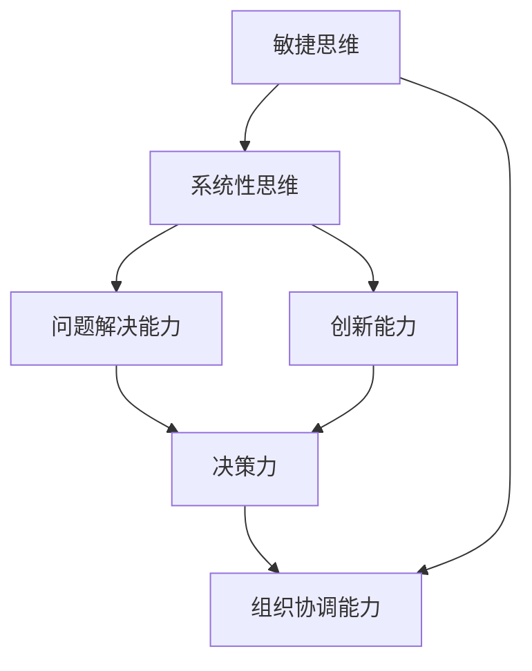

                 

# 管理者的思维敏捷度训练

> 关键词：敏捷思维, 问题解决, 创新能力, 决策力, 组织协调, 学习提升, 绩效提升

## 1. 背景介绍

### 1.1 问题由来
在全球化的商业环境中，企业面临着快速变化的市场需求和不断升级的竞争格局。企业领袖和管理者需要有快速适应变化的能力，以指导团队做出有效决策，推动组织不断创新和进步。敏捷思维（Agile Mindset）成为现代管理者必须具备的核心素质之一。敏捷思维不仅要求管理者具有快速响应变化的能力，更重要的是能运用系统性思维去分析和解决问题，激发团队创新和变革能力。

### 1.2 问题核心关键点
敏捷思维的核心在于能否迅速捕捉机会、分析问题、制定策略并协调资源，以达成组织目标。敏捷思维训练的关键在于培养管理者的系统性思维、问题解决能力、创新能力和组织协调能力。管理者通过科学训练，能够在面对不确定性时迅速做出决策，并有效推动团队达成目标。

### 1.3 问题研究意义
敏捷思维的培养对现代企业具有重要意义：

- 提升决策效率和质量：敏捷思维训练有助于管理者快速准确地分析问题和做出决策，减少决策失误和成本。
- 增强团队创新能力：敏捷思维训练能够激发团队成员的创新意识和创新能力，推动团队持续进步。
- 促进组织变革：敏捷思维训练能够使管理者具备引领组织进行适应性和创新性变革的能力。
- 提升绩效表现：敏捷思维训练能够提升管理者的整体绩效表现，推动组织实现更高的业务目标。

## 2. 核心概念与联系

### 2.1 核心概念概述

敏捷思维训练涉及到以下几个关键概念：

- **敏捷思维**：指管理者迅速适应变化、灵活应对问题、主动寻求创新和变革的思维方式。
- **系统性思维**：指管理者从整体和长远角度出发，分析和解决问题，系统思考问题的因果关系和影响因素。
- **问题解决能力**：指管理者快速分析问题、找到解决方案并实施的能力。
- **创新能力**：指管理者创造新方法、新流程、新产品或新模式的能力。
- **决策力**：指管理者迅速、准确、全面地做出决策的能力。
- **组织协调能力**：指管理者能够有效整合资源、协调团队成员、推动项目顺利进行的能力。

这些核心概念相互联系，共同构成敏捷思维训练的框架。系统性思维是敏捷思维的基础，问题解决和创新能力是其核心，而决策力和组织协调能力则是敏捷思维在具体应用中的体现。

### 2.2 核心概念原理和架构的 Mermaid 流程图



这个流程图展示了核心概念之间的逻辑关系：

1. 敏捷思维通过系统性思维构建，能够系统性地分析问题。
2. 系统性思维驱动问题解决能力和创新能力，以发现并创造新方案。
3. 问题解决能力和创新能力共同支撑决策力，迅速做出有效决策。
4. 决策力和系统性思维相互作用，推动组织协调能力提升，确保目标实现。

## 3. 核心算法原理 & 具体操作步骤

### 3.1 算法原理概述

敏捷思维训练的核心在于提升管理者的系统性思维和问题解决能力，训练方法通常包括以下几个步骤：

1. **系统性思维训练**：通过理论学习、案例分析等方式，培养管理者的系统思维框架，掌握分析和处理复杂问题的技巧。
2. **问题解决训练**：通过情景模拟、角色扮演、案例分析等方式，培养管理者的快速反应和灵活解决问题的能力。
3. **创新能力训练**：通过头脑风暴、设计思维等方法，激发管理者的创新意识，提升其提出新方案的能力。
4. **决策力训练**：通过策略游戏、模拟决策等，培养管理者的决策效率和质量，提高其快速决策的能力。
5. **组织协调训练**：通过团队协作、项目管理等方法，提升管理者的团队管理和资源整合能力。

### 3.2 算法步骤详解

#### 3.2.1 系统性思维训练
1. **理论学习**：
   - 学习系统思维的框架和方法，如系统动力学、因果链模型、反馈环等。
   - 阅读相关书籍和文章，了解系统思维的理论基础和应用案例。

2. **案例分析**：
   - 对经典的管理案例进行分析，理解问题背景、因素关系和解决方案。
   - 通过案例研讨，让管理者深入思考和讨论，提升系统性思维能力。

3. **模拟练习**：
   - 在虚拟环境中进行系统性思维的模拟练习，如通过模拟沙盘游戏，练习系统性思维的应用。

#### 3.2.2 问题解决训练
1. **情景模拟**：
   - 设置特定情境，如突发事件、市场变化等，让管理者模拟解决问题过程。
   - 通过角色扮演和情景模拟，让管理者练习快速反应和灵活解决问题的能力。

2. **案例研讨**：
   - 对真实管理案例进行研讨，分析问题本质，讨论不同解决策略的效果。
   - 通过分组讨论，让管理者尝试不同解决方案，提升综合分析能力。

3. **专家指导**：
   - 邀请问题解决专家进行指导，分析管理者的解决方案，提供改进建议。
   - 通过专家反馈，让管理者了解自身问题解决能力的提升空间。

#### 3.2.3 创新能力训练
1. **头脑风暴**：
   - 定期进行头脑风暴，鼓励管理者提出各种创新方案。
   - 通过分组讨论，激发管理者的创新思维，产生更多创意。

2. **设计思维**：
   - 学习设计思维的方法和工具，如共情理解、同理心映射等。
   - 通过设计思维工作坊，练习从用户需求出发，设计创新的产品或服务。

3. **创新实验室**：
   - 设立创新实验室，提供资源和支持，让管理者进行创新实践。
   - 通过创新实验室，让管理者亲身体验创新过程，提升创新能力。

#### 3.2.4 决策力训练
1. **策略游戏**：
   - 通过策略游戏，模拟真实商业决策情境，练习快速做出有效决策。
   - 通过游戏反馈，分析管理者的决策效果，提供改进建议。

2. **模拟决策**：
   - 设置模拟决策场景，让管理者进行实际决策练习。
   - 通过模拟决策，训练管理者的决策效率和质量。

3. **决策复盘**：
   - 对决策结果进行复盘，分析决策过程和结果，总结经验教训。
   - 通过决策复盘，提高管理者的决策质量，避免类似错误。

#### 3.2.5 组织协调训练
1. **团队协作**：
   - 组织团队协作活动，如团队建设、联合项目等，提高团队合作能力。
   - 通过团队协作，培养管理者的组织协调能力。

2. **项目管理**：
   - 学习项目管理的方法和工具，如敏捷项目管理、精益管理等。
   - 通过项目管理实践，提升管理者的资源整合和协调能力。

3. **组织评估**：
   - 定期对组织进行评估，识别资源分配和团队协调中的问题。
   - 通过组织评估，调整优化资源配置和团队协作策略。

### 3.3 算法优缺点

敏捷思维训练的优点包括：

1. **系统性思维提升**：通过系统性思维训练，管理者能够更好地理解和分析复杂问题，从而制定出科学合理的解决方案。
2. **问题解决能力增强**：通过问题解决训练，管理者能够快速、灵活地处理各种突发状况，提高决策效率和效果。
3. **创新意识激发**：通过创新能力训练，管理者能够持续激发团队创新能力，推动组织不断进步。
4. **决策质量提高**：通过决策力训练，管理者能够迅速做出高质量决策，避免决策失误和资源浪费。
5. **组织协调优化**：通过组织协调训练，管理者能够高效整合资源，提升团队协作和项目执行力。

同时，敏捷思维训练也存在一些缺点：

1. **时间投入高**：敏捷思维训练需要较长时间投入，难以快速见效。
2. **成本高**：需要专业导师和丰富资源，成本较高。
3. **个人差异大**：不同管理者的基础和接受能力不同，训练效果可能差异较大。

### 3.4 算法应用领域

敏捷思维训练广泛应用于各种管理场景，涵盖组织变革、项目管理、团队协作、创新推动等：

1. **组织变革管理**：在企业战略调整或转型期，管理者通过敏捷思维训练，能够迅速适应变化，引导团队顺利进行变革。
2. **项目管理**：在项目管理过程中，敏捷思维训练使管理者能够快速响应需求变化，优化资源配置，提升项目成功率。
3. **团队协作**：在团队协作中，敏捷思维训练使管理者能够有效整合团队成员，提升团队合作和执行效率。
4. **创新推动**：在创新推动中，敏捷思维训练使管理者能够激发团队创新，推动新产品、新流程和新模式的开发。
5. **问题解决**：在问题解决中，敏捷思维训练使管理者能够迅速识别问题本质，制定科学解决方案。

## 4. 数学模型和公式 & 详细讲解 & 举例说明

### 4.1 数学模型构建

敏捷思维训练的数学模型主要建立在系统性思维、问题解决能力、创新能力、决策力和组织协调能力的训练上。通过构建数学模型，可以量化和评估训练效果，提升管理者在各关键能力上的表现。

#### 4.1.1 系统性思维模型
系统性思维模型基于因果链和反馈环，用于描述和分析复杂问题的内在关系和影响因素。

**因果链模型**：
- 因果链模型用于描述问题中的因果关系，通常表示为有向无环图(DAG)。
- 通过因果链模型，可以清晰地识别问题的驱动因素和影响因素，便于系统性分析和决策。

**反馈环模型**：
- 反馈环模型用于描述问题中的反馈机制，通常表示为环形结构。
- 通过反馈环模型，可以理解问题的循环影响和动态变化，提高问题解决的预见性和适应性。

#### 4.1.2 问题解决模型
问题解决模型用于描述和评估管理者在特定情境下的反应和决策过程。

**决策树模型**：
- 决策树模型用于描述决策过程中每个决策点及其可能的后果，通常表示为树形结构。
- 通过决策树模型，可以模拟不同决策路径及其效果，提高决策的科学性和合理性。

**情景模拟模型**：
- 情景模拟模型用于描述特定情境下的问题解决过程，通常表示为动态规划。
- 通过情景模拟模型，可以评估管理者的反应速度和决策效果，提升问题解决的灵活性和效率。

#### 4.1.3 创新能力模型
创新能力模型用于描述和评估管理者的创新思维和创新过程。

**设计思维模型**：
- 设计思维模型用于描述从用户需求出发的创新过程，通常表示为迭代改进。
- 通过设计思维模型，可以评估管理者的创新能力和创新效果，推动组织创新发展。

**头脑风暴模型**：
- 头脑风暴模型用于描述团队集思广益的过程，通常表示为多轮讨论。
- 通过头脑风暴模型，可以激发管理者的创新思维，提升团队创意水平。

#### 4.1.4 决策力模型
决策力模型用于描述和评估管理者的决策过程和决策质量。

**多目标优化模型**：
- 多目标优化模型用于描述多重目标下的决策选择，通常表示为线性规划或非线性规划。
- 通过多目标优化模型，可以评估管理者的决策效率和决策效果，提升决策的全面性和合理性。

**风险评估模型**：
- 风险评估模型用于描述决策中的不确定性和风险因素，通常表示为蒙特卡洛模拟。
- 通过风险评估模型，可以识别决策中的潜在风险，提高决策的稳健性和可靠性。

#### 4.1.5 组织协调模型
组织协调模型用于描述和评估管理者的资源整合和团队协作能力。

**网络优化模型**：
- 网络优化模型用于描述资源分配和团队协作的网络结构，通常表示为图论算法。
- 通过网络优化模型，可以评估管理者的资源整合和团队协作效果，提升组织执行力。

**协同决策模型**：
- 协同决策模型用于描述团队成员之间的协同决策过程，通常表示为博弈论。
- 通过协同决策模型，可以评估团队决策的协调性和一致性，提高团队合作效率。

### 4.2 公式推导过程

#### 4.2.1 因果链模型
因果链模型表示为有向无环图(DAG)，每个节点表示问题的一个影响因素，箭头表示因果关系。

**因果链公式**：
$$
X_i = f_i(X_j, X_k, \epsilon_i)
$$

其中，$X_i$表示问题的一个影响因素，$f_i$表示影响函数，$X_j, X_k$表示其驱动因素，$\epsilon_i$表示随机误差。

**因果链推导**：
- 通过因果链公式，可以识别问题中的因果关系，理解各因素对问题的影响程度。
- 通过因果链推导，可以设计科学合理的解决方案，提高问题解决的针对性和效果。

#### 4.2.2 反馈环模型
反馈环模型表示为环形结构，描述问题中的循环影响和动态变化。

**反馈环公式**：
$$
X_i(t+1) = h_i(X_i(t), X_j(t), \epsilon_i(t))
$$

其中，$X_i(t)$表示问题在时间$t$的状态，$h_i$表示反馈函数，$X_j(t)$表示其他因素的影响，$\epsilon_i(t)$表示随机误差。

**反馈环推导**：
- 通过反馈环公式，可以理解问题的动态变化规律，预测未来趋势。
- 通过反馈环推导，可以设计动态响应策略，提高问题解决的预见性和适应性。

#### 4.2.3 决策树模型
决策树模型表示为树形结构，描述决策过程中的每个决策点及其可能的后果。

**决策树公式**：
$$
V = \sum_{i=1}^{n} p_i V_i
$$

其中，$V$表示总价值，$p_i$表示决策概率，$V_i$表示决策结果的价值。

**决策树推导**：
- 通过决策树公式，可以模拟不同决策路径及其效果，评估决策的合理性和效果。
- 通过决策树推导，可以优化决策过程，提高决策的科学性和全面性。

#### 4.2.4 情景模拟模型
情景模拟模型表示为动态规划，描述特定情境下的问题解决过程。

**情景模拟公式**：
$$
V_i = \max\{V_{i,j}\} + \alpha_i(t+1)
$$

其中，$V_i$表示时间$t$的状态价值，$V_{i,j}$表示时间$t+1$的可能状态价值，$\alpha_i(t+1)$表示时间$t+1$的决策收益。

**情景模拟推导**：
- 通过情景模拟公式，可以评估特定情境下的问题解决效果，提高决策的灵活性和效率。
- 通过情景模拟推导，可以设计优化策略，提升问题解决的预见性和适应性。

#### 4.2.5 设计思维模型
设计思维模型表示为迭代改进，描述从用户需求出发的创新过程。

**设计思维公式**：
$$
F = D + I + C + E
$$

其中，$F$表示最终解决方案，$D$表示用户需求，$I$表示创新想法，$C$表示创意验证，$E$表示评估反馈。

**设计思维推导**：
- 通过设计思维公式，可以系统性分析用户需求，产生创新解决方案。
- 通过设计思维推导，可以评估创新方案的效果，推动组织创新发展。

#### 4.2.6 头脑风暴模型
头脑风暴模型表示为多轮讨论，描述团队集思广益的过程。

**头脑风暴公式**：
$$
I = \sum_{i=1}^{n} i^2
$$

其中，$I$表示创新想法数量，$i$表示每个参与者的创新次数。

**头脑风暴推导**：
- 通过头脑风暴公式，可以评估团队创意水平，激发创新思维。
- 通过头脑风暴推导，可以优化创意过程，提升团队创意质量和效果。

#### 4.2.7 多目标优化模型
多目标优化模型表示为线性规划或非线性规划，描述多重目标下的决策选择。

**多目标优化公式**：
$$
\max \left\{ \sum_{i=1}^{n} w_i f_i(x) \right\}
$$

其中，$w_i$表示目标权重，$f_i(x)$表示目标函数。

**多目标优化推导**：
- 通过多目标优化公式，可以评估多重目标下的决策效果，提升决策的全面性和合理性。
- 通过多目标优化推导，可以优化决策策略，提高决策的科学性和有效性。

#### 4.2.8 风险评估模型
风险评估模型表示为蒙特卡洛模拟，描述决策中的不确定性和风险因素。

**风险评估公式**：
$$
R = \sum_{i=1}^{n} p_i V_i
$$

其中，$R$表示风险值，$p_i$表示风险概率，$V_i$表示风险后果。

**风险评估推导**：
- 通过风险评估公式，可以识别决策中的潜在风险，提高决策的稳健性和可靠性。
- 通过风险评估推导，可以设计风险控制策略，降低决策风险。

#### 4.2.9 网络优化模型
网络优化模型表示为图论算法，描述资源分配和团队协作的网络结构。

**网络优化公式**：
$$
C = \sum_{i=1}^{n} w_i c_i
$$

其中，$C$表示总成本，$w_i$表示资源权重，$c_i$表示资源成本。

**网络优化推导**：
- 通过网络优化公式，可以评估资源分配和团队协作的效果，提升组织执行力。
- 通过网络优化推导，可以优化资源配置和团队协作策略，提高组织协作效率。

#### 4.2.10 协同决策模型
协同决策模型表示为博弈论，描述团队成员之间的协同决策过程。

**协同决策公式**：
$$
V = \sum_{i=1}^{n} p_i V_i
$$

其中，$V$表示总价值，$p_i$表示协同决策概率，$V_i$表示协同决策效果。

**协同决策推导**：
- 通过协同决策公式，可以评估团队协同决策的效果，提高团队合作效率。
- 通过协同决策推导，可以优化协同决策策略，提升团队决策质量。

### 4.3 案例分析与讲解

#### 4.3.1 案例一：组织变革管理

**背景**：某跨国企业计划拓展新兴市场，需要进行组织变革，以适应新的市场环境。

**情景**：企业邀请敏捷思维专家进行系统性思维训练，帮助管理层理解变革过程中的因果关系和反馈机制。

**方法**：通过因果链模型和反馈环模型，管理层识别出变革的驱动因素和影响因素，制定了科学的变革策略。

**结果**：企业顺利完成组织变革，实现了快速适应新兴市场，提升业务表现。

#### 4.3.2 案例二：项目管理

**背景**：某软件开发项目需要应对需求变化，提升项目管理效率。

**情景**：企业邀请敏捷思维专家进行问题解决训练，帮助项目经理处理需求变化带来的挑战。

**方法**：通过决策树模型和情景模拟模型，项目经理模拟不同决策路径及其效果，优化资源配置。

**结果**：项目经理快速响应需求变化，项目顺利完成，提前交付并提高了质量。

#### 4.3.3 案例三：团队协作

**背景**：某研发团队面临团队协作效率低下的问题，需要提升组织协调能力。

**情景**：企业邀请敏捷思维专家进行组织协调训练，帮助团队优化资源配置和协作策略。

**方法**：通过网络优化模型和协同决策模型，团队优化资源配置和协作策略，提升协作效率。

**结果**：团队协作效率显著提升，项目推进速度加快，创新成果增多。

#### 4.3.4 案例四：创新推动

**背景**：某科技公司需要推动新产品开发，激发团队创新能力。

**情景**：企业邀请敏捷思维专家进行创新能力训练，帮助管理层激发团队创新思维。

**方法**：通过设计思维模型和头脑风暴模型，管理层系统性分析用户需求，产生创新解决方案。

**结果**：新产品开发进展顺利，市场反响良好，公司业绩大幅提升。

## 5. 项目实践：代码实例和详细解释说明

### 5.1 开发环境搭建

为了进行敏捷思维训练，需要搭建开发环境，以下是使用Python和Jupyter Notebook进行敏捷思维训练的开发环境配置流程：

1. 安装Anaconda：从官网下载并安装Anaconda，用于创建独立的Python环境。

2. 创建并激活虚拟环境：
```bash
conda create -n agile-mindset python=3.8 
conda activate agile-mindset
```

3. 安装相关库：
```bash
pip install numpy pandas sympy sympy-solver scipy scikit-learn plotly
```

完成上述步骤后，即可在`agile-mindset`环境中开始敏捷思维训练的开发。

### 5.2 源代码详细实现

下面我们以情景模拟和设计思维为例，给出使用Python和Sympy库进行敏捷思维训练的代码实现。

首先，定义情景模拟和设计思维的数学模型：

```python
from sympy import symbols, Eq, solve, Rational, pi

# 情景模拟模型
def simulation_model(T, C, R):
    X = symbols('X')
    eq1 = Eq(X, T + C)
    eq2 = Eq(X, R)
    sol = solve([eq1, eq2], (T, C, R))
    return sol

# 设计思维模型
def design_thinking_model(D, I, C, E):
    F = symbols('F')
    eq1 = Eq(F, D + I + C + E)
    sol = solve(eq1, F)
    return sol
```

然后，定义训练函数，进行情景模拟和设计思维的计算：

```python
def train_simulation():
    # 设置模拟参数
    T = symbols('T', positive=True)
    C = symbols('C', positive=True)
    R = symbols('R', positive=True)
    
    # 设置目标函数和约束条件
    target = symbols('target')
    constraint = Eq(T + C, R)
    
    # 求解优化问题
    solution = simulation_model(T, C, R)
    print('情景模拟结果：', solution)
    return solution

def train_design_thinking():
    # 设置设计思维参数
    D = symbols('D', positive=True)
    I = symbols('I', positive=True)
    C = symbols('C', positive=True)
    E = symbols('E', positive=True)
    
    # 设置目标函数和约束条件
    target = symbols('target')
    constraint = Eq(D + I + C + E, target)
    
    # 求解优化问题
    solution = design_thinking_model(D, I, C, E)
    print('设计思维结果：', solution)
    return solution
```

最后，启动训练流程，输出结果：

```python
train_simulation()
train_design_thinking()
```

以上就是使用Sympy库进行情景模拟和设计思维训练的代码实现。可以看到，通过Sympy库，我们可以很方便地构建数学模型并求解优化问题，从而评估管理者的敏捷思维训练效果。

### 5.3 代码解读与分析

让我们再详细解读一下关键代码的实现细节：

**情景模拟函数**：
- 函数`simulation_model`接收目标时间(T)、成本(C)和风险(R)三个参数，用于描述情景模拟模型。
- 通过定义两个方程，描述目标时间与成本、风险之间的关系。
- 使用Sympy库的`solve`函数求解方程组，得到情景模拟结果。

**设计思维函数**：
- 函数`design_thinking_model`接收用户需求(D)、创新想法(I)、创意验证(C)和评估反馈(E)四个参数，用于描述设计思维模型。
- 通过定义一个方程，描述最终解决方案(F)与用户需求、创新想法、创意验证和评估反馈之间的关系。
- 使用Sympy库的`solve`函数求解方程，得到设计思维结果。

**训练函数**：
- 函数`train_simulation`和`train_design_thinking`分别对应情景模拟和设计思维训练。
- 通过设置模拟参数和目标函数，调用对应的数学模型求解函数，输出训练结果。

这些代码实现了敏捷思维训练的数学模型，并能够通过函数调用进行模拟和训练。开发者可以根据实际需求，灵活使用这些代码进行敏捷思维训练的实践。

## 6. 实际应用场景

### 6.1 智能客服系统

敏捷思维训练在智能客服系统中的应用，通过培养管理者的快速反应能力和系统性思维，能够显著提升客服系统的响应速度和处理质量。

在智能客服系统中，管理者需要快速响应客户咨询，解决各种突发问题，同时优化客服流程，提高服务质量。通过敏捷思维训练，管理者能够迅速理解和分析客户需求，设计科学合理的客服流程，提升服务效率和客户满意度。

### 6.2 金融风险管理

敏捷思维训练在金融风险管理中的应用，通过培养管理者的风险评估和决策能力，能够有效应对市场变化和风险挑战。

在金融风险管理中，管理者需要快速评估市场动态和风险因素，制定科学的风险管理策略。通过敏捷思维训练，管理者能够系统性分析市场趋势和风险因素，提升决策的准确性和全面性，减少金融风险。

### 6.3 创新研发管理

敏捷思维训练在创新研发管理中的应用，通过培养管理者的创新思维和协作能力，能够推动研发团队不断创新，提升创新效率和成果质量。

在创新研发管理中，管理者需要激发团队创新意识，推动新产品开发。通过敏捷思维训练，管理者能够系统性分析用户需求，产生创新解决方案，提升团队协作效率，推动研发项目顺利进行。

### 6.4 项目执行管理

敏捷思维训练在项目执行管理中的应用，通过培养管理者的系统性思维和决策能力，能够有效应对项目执行中的变化和挑战。

在项目执行管理中，管理者需要快速响应需求变化，优化资源配置，推动项目顺利完成。通过敏捷思维训练，管理者能够系统性分析项目需求和资源分配，设计科学的项目管理策略，提升项目执行效率和成功率。

## 7. 工具和资源推荐

### 7.1 学习资源推荐

为了帮助管理者系统掌握敏捷思维训练的理论基础和实践技巧，这里推荐一些优质的学习资源：

1. 《敏捷思维：企业变革的关键》（作者：William R. Jeffrey）：介绍敏捷思维的理论基础和实际应用案例，帮助管理者系统理解敏捷思维的本质和实践方法。
2. 《创新者的窘境》（作者：Clayton M. Christensen）：探讨企业管理者如何应对市场和技术变革，推动组织持续创新。
3. 《系统思维：解决复杂问题的钥匙》（作者：Peter Senge）：系统性思维的理论基础和应用方法，帮助管理者系统思考和解决问题。
4. 《设计思维：打造创新的解决方案》（作者：Tim Brown）：介绍设计思维的方法和工具，帮助管理者系统性分析用户需求，产生创新解决方案。
5. 《项目管理：敏捷方法与工具》（作者：Scott A. Seacord）：介绍敏捷项目管理的理论基础和实践方法，帮助管理者优化资源配置和项目管理。

通过对这些资源的学习实践，相信你一定能够快速掌握敏捷思维训练的核心技能，并应用到实际管理工作中。

### 7.2 开发工具推荐

高效的开发离不开优秀的工具支持。以下是几款用于敏捷思维训练开发的常用工具：

1. Python：Python是一种高效、灵活的编程语言，适合进行数学建模和算法开发。
2. Sympy：Sympy是一个Python库，用于符号计算和数学建模，支持求解优化问题。
3. Jupyter Notebook：Jupyter Notebook是一种交互式开发环境，支持编写和运行Python代码，便于敏捷思维训练的实践。
4. Plotly：Plotly是一个数据可视化库，用于生成图表和报告，帮助管理者更好地理解训练结果。

合理利用这些工具，可以显著提升敏捷思维训练的开发效率，加快创新迭代的步伐。

### 7.3 相关论文推荐

敏捷思维训练的相关研究涉及多个领域，以下是几篇奠基性的相关论文，推荐阅读：

1. "The Lean Startup: How Today's Entrepreneurs Use Continuous Innovation to Create Radically Successful Businesses"（作者：Eric Ries）：介绍精益创业方法和敏捷思维在企业创新中的应用。
2. "Design Thinking: Understanding the User Experience by Designing"（作者：Ken Watanabe）：介绍设计思维的方法和工具，帮助管理者系统性分析用户需求，产生创新解决方案。
3. "Agile Mindset: The Key to Successful Project Management"（作者：Jim Highsmith）：探讨敏捷思维在项目管理中的应用，帮助管理者优化资源配置和项目管理。
4. "Innovation Management: Integrating Management, Innovation, and Organization"（作者：Norbert Terwieser）：介绍创新管理的理论基础和方法，帮助管理者推动组织持续创新。
5. "Systems Thinking for Organizational Change: A Guide to Organizational Design and Management"（作者：Jay S. Walker）：介绍系统性思维在组织变革中的应用，帮助管理者系统思考和解决问题。

这些论文代表了大语言模型微调技术的发展脉络。通过学习这些前沿成果，可以帮助研究者把握学科前进方向，激发更多的创新灵感。

## 8. 总结：未来发展趋势与挑战

### 8.1 研究成果总结

敏捷思维训练的研究成果主要集中在以下几个方面：

1. **系统性思维**：通过系统性思维训练，管理者能够更好地理解和分析复杂问题，制定科学合理的解决方案。
2. **问题解决能力**：通过问题解决训练，管理者能够快速、灵活地处理各种突发状况，提高决策效率和效果。
3. **创新能力**：通过创新能力训练，管理者能够持续激发团队创新能力，推动组织不断进步。
4. **决策力**：通过决策力训练，管理者能够迅速做出高质量决策，避免决策失误和资源浪费。
5. **组织协调能力**：通过组织协调训练，管理者能够高效整合资源，提升团队协作和项目执行力。

### 8.2 未来发展趋势

敏捷思维训练的未来发展趋势包括：

1. **系统性思维的深入研究**：随着复杂性理论的发展，系统性思维的深入研究将不断推进，帮助管理者更好地理解和解决复杂问题。
2. **多目标优化和风险评估**：多目标优化和风险评估方法将不断优化，提升管理者的决策质量和风险管理能力。
3. **智能决策支持系统**：通过引入人工智能技术，构建智能决策支持系统，提升管理者的决策效率和效果。
4. **团队协作和协同决策**：团队协作和协同决策方法将不断优化，提升管理者的团队合作和决策一致性。
5. **创新驱动的组织变革**：创新驱动的组织变革方法将不断创新，推动组织持续创新和进步。

### 8.3 面临的挑战

尽管敏捷思维训练具有诸多优点，但也面临以下挑战：

1. **时间投入高**：敏捷思维训练需要较长时间投入，难以快速见效。
2. **成本高**：需要专业导师和丰富资源，成本较高。
3. **个人差异大**：不同管理者的基础和接受能力不同，训练效果可能差异较大。
4. **实际应用复杂**：敏捷思维训练需要结合具体管理场景，实际应用中可能存在诸多复杂因素。
5. **效果评估困难**：敏捷思维训练的效果评估需要科学方法和工具，评估结果难以量化。

### 8.4 研究展望

未来的敏捷思维训练研究将聚焦于以下几个方向：

1. **个性化训练**：根据管理者的基础和特点，设计个性化的训练方案，提升训练效果。
2. **技术支持**：引入人工智能和机器学习技术，提升训练效率和效果。
3. **实际应用研究**：结合具体管理场景，深入研究敏捷思维在各领域的应用效果。
4. **效果评估**：开发科学方法和工具，量化评估敏捷思维训练的效果。
5. **持续改进**：建立持续改进机制，不断优化训练方案和效果。

这些研究方向将进一步推动敏捷思维训练的进步，提升管理者的综合素质，推动组织持续创新和进步。

## 9. 附录：常见问题与解答

**Q1：敏捷思维训练的效果如何衡量？**

A: 敏捷思维训练的效果可以通过多个指标来衡量，包括：

1. **决策效率和质量**：通过对比训练前后的决策速度和准确性，评估管理者的决策能力和效果。
2. **团队协作效率**：通过评估团队合作和项目执行效率，衡量敏捷思维训练对团队协作的影响。
3. **创新成果质量**：通过评估创新成果的数量和质量，衡量敏捷思维训练对团队创新的影响。
4. **项目成功率**：通过对比训练前后的项目成功率，评估敏捷思维训练对项目执行的影响。
5. **组织绩效**：通过对比训练前后的组织绩效指标，如收入、利润、市场份额等，评估敏捷思维训练对组织的影响。

**Q2：敏捷思维训练的具体方法有哪些？**

A: 敏捷思维训练的具体方法包括：

1. **系统性思维训练**：通过理论学习、案例分析、模拟练习等方式，培养管理者的系统性思维能力。
2. **问题解决训练**：通过情景模拟、角色扮演、案例分析等方式，培养管理者的快速反应和灵活解决问题的能力。
3. **创新能力训练**：通过头脑风暴、设计思维、创新实验室等方式，激发管理者的创新思维和创新能力。
4. **决策力训练**：通过策略游戏、模拟决策、决策复盘等方式，培养管理者的决策效率和质量。
5. **组织协调训练**：通过团队协作、项目管理、组织评估等方式，提升管理者的资源整合和团队协作能力。

**Q3：敏捷思维训练对组织变革有哪些影响？**

A: 敏捷思维训练对组织变革有以下影响：

1. **提升变革适应能力**：敏捷思维训练帮助管理者迅速适应变化，推动组织顺利进行变革。
2. **优化变革策略**：敏捷思维训练帮助管理者系统性分析变革因素，制定科学合理的变革策略。
3. **增强变革执行力**：敏捷思维训练帮助管理者高效整合资源，提升团队协作和项目执行力，推动变革顺利进行。

**Q4：敏捷思维训练如何结合人工智能技术？**

A: 敏捷思维训练可以结合人工智能技术，提升训练效率和效果。

1. **数据分析与建模**：利用机器学习和数据分析技术，对管理者的行为和决策进行建模，评估训练效果。
2. **智能决策支持系统**：构建智能决策支持系统，提供实时数据和决策建议，提升管理者的决策质量。
3. **个性化训练方案**：利用人工智能算法，根据管理者的特点和需求，设计个性化的训练方案。

**Q5：敏捷思维训练如何与其他管理工具结合？**

A: 敏捷思维训练可以与其他管理工具结合，提升整体管理效果。

1. **项目管理工具**：结合项目管理工具，如敏捷项目管理、精益管理等，优化资源配置和项目管理。
2. **知识管理工具**：结合知识管理工具，如知识图谱、文档管理系统等，提升组织知识共享和应用。
3. **绩效管理工具**：结合绩效管理工具，如KPI指标、绩效评估系统等，评估敏捷思维训练的效果。

**Q6：敏捷思维训练的实际应用场景有哪些？**

A: 敏捷思维训练的实际应用场景包括：

1. **智能客服系统**：通过敏捷思维训练，提升客服系统的响应速度和处理质量。
2. **金融风险管理**：通过敏捷思维训练，提升金融风险评估和决策能力。
3. **创新研发管理**：通过敏捷思维训练，推动研发团队不断创新，提升创新效率和成果质量。
4. **项目执行管理**：通过敏捷思维训练，优化资源配置和项目管理，提升项目执行效率和成功率。

---

作者：禅与计算机程序设计艺术 / Zen and the Art of Computer Programming

