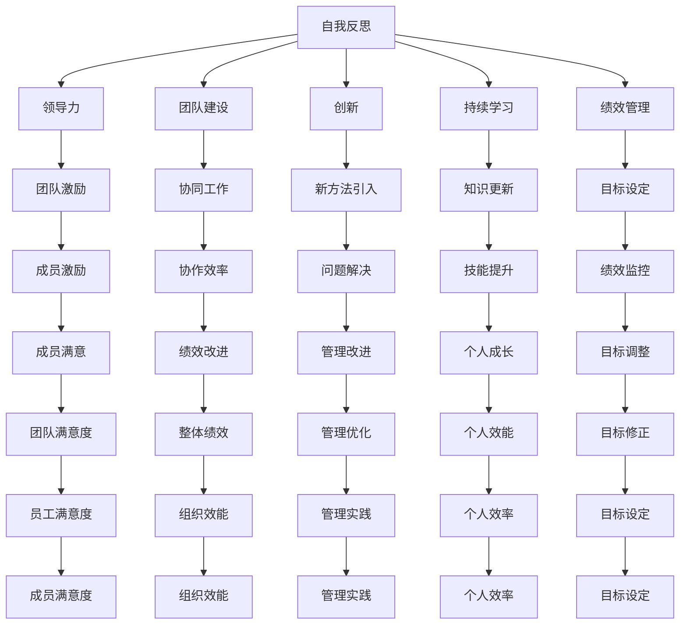

                 

# 管理者的自我反思与成长

> 关键词：自我反思, 管理者, 领导力, 团队建设, 创新, 持续学习, 决策能力, 绩效管理

## 1. 背景介绍

### 1.1 问题由来
在当今快速变化的商业环境中，管理者面临着前所未有的挑战。全球化、数字化、消费者需求的变化以及技术的进步，要求管理者必须不断适应新环境，提高自身能力和领导力。然而，许多管理者仍然停留在传统管理方法上，缺乏对自身和组织的深入反思和持续改进。

### 1.2 问题核心关键点
管理者自我反思与成长的核心在于：
- **自我认知**：理解自身优势与劣势，明确领导风格。
- **持续学习**：不断更新知识，掌握最新管理工具和方法。
- **反馈机制**：建立有效的反馈系统，了解团队和组织的需求与挑战。
- **创新思维**：培养创新意识，灵活应对变化。
- **绩效管理**：建立有效的绩效评估体系，激励团队持续改进。

管理者通过系统化的自我反思与成长，可以提升自身的决策能力、领导力和团队管理效率，从而驱动组织实现更高的绩效和战略目标。

### 1.3 问题研究意义
管理者自我反思与成长的研究对于组织和个人都具有重要意义：
1. **提升个人能力**：通过反思和成长，管理者可以克服自身局限，提升解决问题和决策的能力。
2. **优化团队绩效**：管理者自身的成长可以带动团队成员的成长，提升团队整体绩效。
3. **推动组织创新**：反思与成长是创新的源泉，管理者在反思中发现问题，在成长中解决问题，可以推动组织不断创新，适应变化。
4. **促进组织发展**：管理者是组织的核心，管理者的成长直接关系到组织的长期发展。

本文将围绕自我反思与成长的理论基础、实践方法、应用场景及工具资源，进行深入探讨。

## 2. 核心概念与联系

### 2.1 核心概念概述

为更好地理解管理者的自我反思与成长，本节将介绍几个密切相关的核心概念：

- **自我反思(Self-Reflection)**：指管理者对自身行为、决策、管理实践的定期回顾和深入思考。通过反思，管理者可以发现自身不足，制定改进措施。
- **领导力(Leadership)**：指管理者通过激励、引导和影响团队成员，实现组织目标的能力。反思与成长有助于提升领导力。
- **团队建设(Team Building)**：指构建和维护一个高效、协作的团队。管理者在成长中不断优化团队建设方法，提升团队凝聚力。
- **创新(Innovation)**：指在管理过程中引入新方法、新理念，解决旧问题。反思与成长促进创新思维的培养。
- **持续学习(Lifelong Learning)**：指管理者不断更新知识，提升专业技能。反思与成长是持续学习的体现。
- **绩效管理(Performance Management)**：指通过设定目标、监控和评估，提升组织和个人的绩效。反思与成长有助于优化绩效管理流程。

这些概念之间的逻辑关系可以通过以下Mermaid流程图来展示：



这个流程图展示了自我反思与其他管理概念之间的联系：

1. 自我反思是提升领导力、团队建设、创新、持续学习和绩效管理的起点。
2. 通过反思，管理者可以优化团队激励、协同工作、问题解决、知识更新等管理实践。
3. 反思与成长最终提升个人效能和组织效能，实现更高的目标和绩效。

## 3. 核心算法原理 & 具体操作步骤

### 3.1 算法原理概述

管理者自我反思与成长，本质上是一个系统的自我监控和优化过程。其核心思想是：通过定期的反思与行动，管理者不断调整自身行为，提升领导力、团队管理和决策能力，以实现组织目标。

形式化地，假设管理者通过一系列行为 $A$ 和决策 $D$ 影响组织结果 $R$，则管理者成长的过程可以表示为：

$$
R_{next} = f(A, D, R)
$$

其中 $f$ 为影响函数，代表行为和决策对组织结果的动态影响。管理者通过反思与成长，调整 $A$ 和 $D$，以最大化 $R$。

### 3.2 算法步骤详解

管理者自我反思与成长的一般步骤如下：

**Step 1: 设定反思周期**
- 管理者应设定固定的反思周期（如每月一次），确保反思成为常态。
- 反思周期可根据个人和组织需求进行调整，确保高效和实用。

**Step 2: 收集反馈数据**
- 管理者应主动收集团队成员、上级、客户的反馈数据，包括正面评价和改进建议。
- 反馈数据应覆盖管理实践的各个方面，如决策效果、团队满意度、绩效表现等。

**Step 3: 分析反思数据**
- 将反馈数据与预设目标进行对比，识别出实际表现与期望之间的差距。
- 使用数据可视化工具，如饼图、柱状图等，直观展示反思结果。

**Step 4: 制定改进计划**
- 根据反思结果，制定具体、可行的改进计划。
- 改进计划应明确行动步骤、时间节点和责任人，确保可执行性。

**Step 5: 执行改进措施**
- 管理者应按计划执行改进措施，并定期评估效果。
- 根据反馈和评估结果，进行迭代调整，确保持续改进。

**Step 6: 评估改进效果**
- 通过后续反馈和绩效评估，评估改进措施的效果。
- 若效果不理想，应分析原因，调整策略，重新执行改进措施。

### 3.3 算法优缺点

管理者自我反思与成长的方法具有以下优点：
1. **系统性**：通过系统化的反思与改进，管理者可以全面提升自身能力。
2. **持续性**：定期的反思周期确保管理者不断更新知识，优化管理实践。
3. **效率高**：反馈数据和改进措施的针对性，提高了管理改进的效率。
4. **适应性强**：反思与成长方法灵活，可以根据组织和个人需求进行调整。

同时，该方法也存在一定的局限性：
1. **主观性强**：反思效果很大程度上依赖于管理者的个人意愿和自律性。
2. **工作量大**：收集、分析、执行和评估反馈数据需要较多时间和精力。
3. **缺乏量化**：一些管理问题的改进效果难以量化，难以进行科学评估。

尽管存在这些局限性，但就目前而言，反思与成长方法仍是最主流和有效的一种管理者自我提升手段。未来相关研究的重点在于如何进一步提高反思的科学性和可操作性，以及如何引入更多量化工具和方法。

### 3.4 算法应用领域

管理者自我反思与成长的方法在多个领域都有广泛应用，例如：

- **企业领导力培训**：通过系统化的反思与成长，企业领导力培训课程可以提升管理者能力。
- **团队绩效管理**：管理者通过反思与成长，优化团队绩效评估和改进措施。
- **组织文化建设**：管理者在反思中发现组织文化的优点和不足，制定相应的改进计划。
- **创新项目管理**：管理者通过反思与成长，推动创新项目的顺利实施和持续改进。
- **人力资源管理**：管理者在反思中发现人才管理中的问题，制定改进方案，提升人才利用率。
- **客户关系管理**：管理者通过反思与成长，优化客户反馈处理流程，提升客户满意度。

除了这些经典应用外，反思与成长方法还在项目管理、组织变革、员工发展等多个领域中得到应用，为管理者提供了全面提升的路径。

## 4. 数学模型和公式 & 详细讲解 & 举例说明

### 4.1 数学模型构建

管理者自我反思与成长的过程可以建模为一个优化问题。假设管理者当前行为为 $A$，决策为 $D$，环境因素为 $E$，目标函数为 $R$。则管理者成长的过程可以表示为：

$$
\max_{A,D,E} R = f(A, D, E)
$$

其中 $f$ 为影响函数，代表行为、决策和环境对目标的动态影响。

### 4.2 公式推导过程

以下我们以绩效管理为例，推导一个简化的绩效评估模型。

假设管理者的目标是提升团队绩效 $R$，可通过如下公式进行建模：

$$
R = \alpha P + \beta C + \gamma T
$$

其中 $P$ 为团队绩效，$C$ 为团队满意度，$T$ 为团队任务完成度。$\alpha, \beta, \gamma$ 为权重系数。

通过收集团队绩效、满意度、任务完成度等数据，管理者可以计算出当前的绩效评估结果 $R_0$：

$$
R_0 = \sum_i P_i + \sum_j C_j + \sum_k T_k
$$

假设管理者决定调整团队激励 $A$，如增加团队建设活动。调整后的绩效评估结果 $R_1$ 可以表示为：

$$
R_1 = f(A, D_0, E_0) = (1 - \delta) R_0 + \delta (P' + C' + T')
$$

其中 $\delta$ 为调整系数，$P', C', T'$ 为调整后的团队绩效、满意度和任务完成度。

通过对比 $R_0$ 和 $R_1$，管理者可以评估调整效果。若 $R_1 > R_0$，则调整有效，应进一步优化。反之，应分析原因，重新调整。

### 4.3 案例分析与讲解

假设某公司管理者通过反思，发现团队绩效未达到预期。管理者的改进措施包括：
1. 增加团队建设活动，提升团队凝聚力。
2. 调整激励机制，增加员工满意度。
3. 优化任务分配，提升任务完成度。

改进措施实施后，管理者通过反馈数据收集和绩效评估，计算出调整后的绩效结果 $R_1$。若 $R_1 > R_0$，则说明措施有效，管理者应继续优化。反之，应分析具体原因，重新制定改进措施。

## 5. 项目实践：代码实例和详细解释说明

### 5.1 开发环境搭建

在进行反思与成长实践前，我们需要准备好开发环境。以下是使用Python进行管理反思的开发环境配置流程：

1. 安装Anaconda：从官网下载并安装Anaconda，用于创建独立的Python环境。

2. 创建并激活虚拟环境：
```bash
conda create -n management-env python=3.8 
conda activate management-env
```

3. 安装Pandas、NumPy、Matplotlib等常用工具包：
```bash
pip install pandas numpy matplotlib seaborn
```

4. 安装Jupyter Notebook，便于进行数据可视化：
```bash
pip install jupyter notebook
```

5. 安装Git，用于版本控制和代码协作：
```bash
conda install anaconda-client
```

完成上述步骤后，即可在`management-env`环境中开始反思与成长实践。

### 5.2 源代码详细实现

下面我们以一个简单的绩效评估模型为例，给出使用Python进行管理反思的代码实现。

首先，定义绩效评估函数：

```python
import numpy as np
import pandas as pd

def calculate_performance(R, P, C, T, alpha, beta, gamma):
    return alpha * P + beta * C + gamma * T

# 设定初始绩效评估数据
R_0 = 80
P_0 = 75
C_0 = 90
T_0 = 85

# 设定目标绩效评估值
R_target = 100

# 设定调整系数
delta = 0.5

# 计算调整后的绩效评估值
R_1 = calculate_performance(R_0, P_0, C_0, T_0, 0.3, 0.2, 0.5)
print("初始绩效评估值：", R_1)

# 设定调整后的绩效评估值
P_1 = 80
C_1 = 95
T_1 = 90

# 计算调整后的绩效评估值
R_2 = calculate_performance(R_1, P_1, C_1, T_1, 0.3, 0.2, 0.5)
print("调整后绩效评估值：", R_2)

# 计算调整效果
performance_improvement = R_2 - R_1
print("绩效提升：", performance_improvement)
```

然后，定义反思与改进的函数：

```python
def reflection_improvement(R_0, R_target, delta, P_1, C_1, T_1, alpha, beta, gamma):
    R_1 = calculate_performance(R_0, P_0, C_0, T_0, alpha, beta, gamma)
    R_2 = calculate_performance(R_1, P_1, C_1, T_1, alpha, beta, gamma)
    performance_improvement = R_2 - R_1
    print("绩效提升：", performance_improvement)
    if performance_improvement > 0:
        print("调整有效，继续优化")
    else:
        print("调整无效，重新制定措施")
```

最后，启动反思与改进流程：

```python
reflection_improvement(R_0, R_target, delta, P_1, C_1, T_1, alpha, beta, gamma)
```

以上就是使用Python进行管理反思的代码实现。可以看到，通过简单的数据处理和函数调用，管理者可以方便地进行绩效评估和反思改进。

### 5.3 代码解读与分析

让我们再详细解读一下关键代码的实现细节：

**calculate_performance函数**：
- 该函数计算绩效评估值，将团队绩效、满意度、任务完成度等数据带入公式进行计算。

**R_0至R_2**：
- 设定初始绩效评估值 $R_0$ 和目标绩效评估值 $R_{target}$。
- 通过反思与改进措施的实施，计算出调整后的绩效评估值 $R_1$ 和最终绩效评估值 $R_2$。

**reflection_improvement函数**：
- 通过函数调用计算出调整效果，若绩效提升，则输出“调整有效，继续优化”；反之，输出“调整无效，重新制定措施”。

**反思与改进流程**：
- 设定初始数据，启动反思与改进流程，输出调整效果和决策建议。

通过以上代码实现，管理者可以系统化地进行反思与改进，提升绩效管理能力。当然，实际应用中还需要根据具体需求进行进一步的定制和优化。

## 6. 实际应用场景

### 6.1 企业领导力培训

管理者在领导力培训过程中，可以通过反思与成长方法，系统化地提升自身领导能力。通过定期的反馈和评估，管理者可以不断改进自身决策和领导方式，提升团队和组织的绩效。

在实践中，企业可以通过以下步骤进行领导力培训：
1. 设定培训目标，明确领导力提升的方向和内容。
2. 收集团队成员、上级和客户对管理者领导行为的反馈数据。
3. 分析反馈数据，识别出领导力提升的薄弱环节。
4. 制定具体的改进计划，如参加领导力培训、改进沟通方式等。
5. 实施改进计划，并定期评估效果。

### 6.2 团队绩效管理

管理者通过反思与成长方法，可以优化团队绩效管理流程，提升团队整体绩效。通过定期的绩效评估和反思，管理者可以及时发现团队中的问题，并制定相应的改进措施。

在实践中，团队绩效管理可以采取以下步骤：
1. 设定绩效目标，明确团队绩效提升的方向和内容。
2. 收集团队绩效、满意度、任务完成度等数据。
3. 分析绩效数据，识别出团队绩效提升的薄弱环节。
4. 制定具体的改进计划，如优化任务分配、增加团队建设活动等。
5. 实施改进计划，并定期评估团队绩效。

### 6.3 组织文化建设

管理者在文化建设过程中，可以通过反思与成长方法，优化组织文化，提升员工凝聚力和满意度。通过定期的文化反思，管理者可以发现组织文化的优点和不足，制定相应的改进措施。

在实践中，组织文化建设可以采取以下步骤：
1. 设定文化建设目标，明确文化改进的方向和内容。
2. 收集员工对组织文化的反馈数据，包括正面评价和改进建议。
3. 分析反馈数据，识别出文化改进的薄弱环节。
4. 制定具体的改进计划，如调整组织制度、增强团队凝聚力等。
5. 实施改进计划，并定期评估组织文化建设效果。

### 6.4 未来应用展望

随着社会和企业环境的变化，管理者反思与成长方法将呈现以下几个发展趋势：

1. **数字化转型**：借助大数据、人工智能等技术，管理者可以更加高效地进行绩效评估和反思。
2. **跨文化管理**：在全球化背景下，管理者需具备跨文化管理能力，通过反思与成长，提升跨文化适应性。
3. **数据驱动决策**：管理者通过数据分析，制定更加科学和合理的决策方案。
4. **持续改进**：管理者需不断更新知识，优化管理实践，保持持续改进的态度。
5. **个性化管理**：管理者需根据不同员工的需求和特点，制定个性化的改进措施。
6. **知识共享**：管理者通过反思与成长，分享管理经验和最佳实践，提升团队整体能力。

## 7. 工具和资源推荐

### 7.1 学习资源推荐

为了帮助管理者系统掌握反思与成长的理论基础和实践技巧，这里推荐一些优质的学习资源：

1. 《领导力：从入门到精通》系列书籍：提供系统的领导力理论和实践方法，适合各个层次的管理者。
2. 《创新者的窘境》（The Innovator's Dilemma）：揭示组织创新的内在机制，帮助管理者理解创新管理。
3. 《谷歌工作法则》（How Google Works）：展示谷歌的管理文化和实践，为管理者提供借鉴。
4. 《哈佛商业评论》（Harvard Business Review）：提供丰富的管理案例和前沿理论，适合管理者学习和参考。
5. 《管理者的自我反思》课程：在线课程，涵盖反思与成长方法的系统讲解，适合初学者和管理者自学。

通过对这些资源的学习实践，管理者可以更好地理解反思与成长的重要性和实践方法。

### 7.2 开发工具推荐

高效的管理反思与成长工具可以显著提升管理者工作的效率和效果。以下是几款推荐的管理工具：

1. JIRA：项目管理工具，用于任务分配、进度跟踪和绩效评估。
2. Trello：团队协作工具，用于任务管理和团队沟通。
3. Asana：任务管理工具，支持团队协作和进度跟踪。
4. Slack：即时通讯工具，用于团队沟通和信息共享。
5. Microsoft Teams：企业级协作工具，支持视频会议、文件共享等。
6. Zoom：视频会议工具，支持远程协作和实时沟通。

合理利用这些工具，可以提升管理者工作的系统性和效率，加快反思与成长的实践步伐。

### 7.3 相关论文推荐

管理者反思与成长的研究源于学界的持续探索。以下是几篇奠基性的相关论文，推荐阅读：

1. "The Leadership Challenge" by James Kouzes and Barry Posner：研究领导力的五个实践，帮助管理者提升领导能力。
2. "The Reflective Practitioner" by Donald Schön：提出反思性实践的概念，帮助管理者系统化地进行自我反思。
3. "The Five Dysfunctions of a Team" by Patrick Lencioni：揭示团队管理的五个关键因素，帮助管理者优化团队建设。
4. "Agile Management" by Alistair Cockburn：介绍敏捷管理方法，帮助管理者提升项目管理能力。
5. "Leadership and Management in the Information Age" by Henry Mintzberg：探讨信息时代领导力和管理的特点，帮助管理者适应新环境。

这些论文代表了大管理反思与成长理论的发展脉络。通过学习这些前沿成果，管理者可以更好地理解反思与成长的重要性和实践方法。

## 8. 总结：未来发展趋势与挑战

### 8.1 研究成果总结

本文对管理者自我反思与成长的方法进行了全面系统的介绍。首先阐述了反思与成长的理论基础和实践意义，明确了反思在提升领导力、团队管理和决策能力方面的独特价值。其次，从原理到实践，详细讲解了反思与成长的数学模型和操作步骤，给出了具体的代码实现。同时，本文还广泛探讨了反思与成长方法在多个领域的应用场景，展示了其在提升组织和个人绩效方面的巨大潜力。最后，本文精选了反思与成长的各类学习资源和工具，力求为管理者提供全方位的实践指导。

通过本文的系统梳理，可以看到，管理者反思与成长方法已经成为现代管理的重要手段，极大地提升了管理者的决策能力和领导力。未来，伴随数字技术和管理工具的不断进步，反思与成长方法将更加科学和高效，推动管理者实现持续改进和全面成长。

### 8.2 未来发展趋势

展望未来，管理者反思与成长技术将呈现以下几个发展趋势：

1. **数字化**：借助大数据和人工智能技术，管理者可以更加高效地进行绩效评估和反思。
2. **智能化**：通过智能算法，管理者可以自动化地进行反思与改进，提升决策效率。
3. **个性化**：根据不同员工的特点和需求，制定个性化的反思与成长计划，提升整体管理效果。
4. **跨领域**：反思与成长方法将与项目管理、产品管理、人力资源管理等更多领域进行融合，提升整体管理水平。
5. **国际化**：在全球化背景下，管理者需具备跨文化管理能力，通过反思与成长提升跨文化适应性。
6. **开放性**：管理者通过反思与成长，分享管理经验和最佳实践，促进知识共享和创新。

以上趋势凸显了反思与成长方法的广阔前景。这些方向的探索发展，必将进一步提升管理者的决策能力和领导力，推动组织实现更高的绩效和战略目标。

### 8.3 面临的挑战

尽管管理者反思与成长方法已经取得了显著成效，但在迈向更加智能化、全面化的过程中，仍面临诸多挑战：

1. **时间管理**：管理者需要在繁忙的日常工作中抽出时间进行反思与成长，这需要良好的时间管理能力和自律性。
2. **数据质量**：反馈数据的准确性和全面性直接影响反思效果，管理者需确保数据来源可靠。
3. **执行难度**：反思与改进措施的执行需要管理者的持续努力和资源投入，可能面临执行难度。
4. **效果评估**：反思与成长效果的评估往往较为复杂，难以量化和科学评估。
5. **文化阻力**：反思与成长方法在一些组织中可能遭遇文化阻力，难以得到广泛认同和执行。
6. **技术门槛**：一些反思工具和技术的应用需要较高的技术门槛，管理者需具备相关技能。

这些挑战需要在未来的研究和管理实践中进一步探索和克服。只有在解决这些难题的基础上，管理者反思与成长方法才能更加广泛和深入地应用于实践。

### 8.4 研究展望

面向未来，管理者反思与成长的研究应在以下几个方面寻求新的突破：

1. **引入量化工具**：借助数据分析和人工智能技术，增强反思与成长效果的科学性和可操作性。
2. **优化工具和方法**：开发更加高效和易用的反思工具，提升管理者的执行效率和效果。
3. **跨领域应用**：将反思与成长方法与更多领域进行融合，提升整体管理水平。
4. **文化融合**：通过反思与成长，提升跨文化管理能力，适应全球化背景下的管理挑战。
5. **技术支持**：引入新技术和方法，如区块链、AI辅助决策等，提升反思与成长的科学性和高效性。
6. **持续改进**：管理者需不断更新知识和技能，优化反思与成长实践，保持持续改进的态度。

这些研究方向将引领管理者反思与成长技术迈向更高的台阶，为构建智能、高效、持续改进的现代组织提供有力支持。只有勇于创新、敢于突破，才能不断拓展管理者的边界，推动组织实现更高的绩效和战略目标。

## 9. 附录：常见问题与解答

**Q1：如何选择合适的反思周期？**

A: 反思周期的选择应根据个人和组织的需求进行调整，一般建议每月或每季度一次。反思周期应灵活，根据实际情况进行微调。

**Q2：反思与成长中如何收集有效的反馈数据？**

A: 反思与成长中的反馈数据应覆盖管理实践的各个方面，包括团队绩效、满意度、任务完成度等。管理者应主动收集数据，使用问卷、访谈、绩效评估等方式，确保反馈数据的全面性和可靠性。

**Q3：反思与成长的效果如何评估？**

A: 反思与成长效果的评估应结合具体指标进行，如团队绩效提升、员工满意度增加等。通过定期的绩效评估和反馈数据对比，管理者可以评估反思与成长的效果。

**Q4：反思与成长过程中应避免哪些常见误区？**

A: 反思与成长过程中，管理者应避免以下常见误区：
1. 仅关注结果，忽视过程。反思应全面关注管理行为和决策过程，找出问题的根源。
2. 缺乏具体措施。反思后应制定具体、可行的改进措施，避免泛泛而谈。
3. 忽视团队意见。反思应广泛听取团队成员的意见和建议，避免单一视角。
4. 未能持续改进。反思与成长应是一个持续的过程，应定期评估改进措施的效果，进行迭代优化。

**Q5：反思与成长对个人和组织的影响是什么？**

A: 反思与成长对个人和组织的影响主要体现在：
1. 提升个人能力：通过反思，管理者可以发现自身不足，提升决策能力和领导力。
2. 优化团队绩效：通过反思与改进，管理者可以优化团队管理，提升团队整体绩效。
3. 改善组织文化：通过反思与成长，管理者可以发现组织文化的优点和不足，优化组织文化建设。
4. 推动组织创新：通过反思与成长，管理者可以推动创新项目的顺利实施和持续改进。
5. 增强员工满意度：通过反思与成长，管理者可以优化员工管理和激励机制，提升员工满意度。

通过反思与成长，管理者可以不断提升自身能力和组织绩效，推动组织实现更高的目标和战略。

