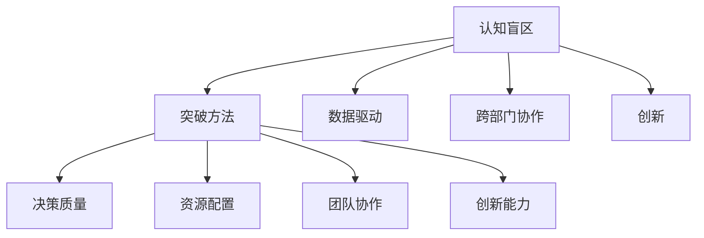

                 

# 管理者的认知盲区及其突破

> 关键词：管理者, 认知盲区, 突破, 决策, 创新, 战略规划, 人力资源, 跨部门协作, 数据驱动

## 1. 背景介绍

### 1.1 问题由来

在现代企业中，管理者扮演着至关重要的角色，从战略规划到日常运营，他们的决策直接影响着公司的成败。然而，管理者往往面临着诸多认知盲区，这些盲区可能源自信息不足、经验局限、情感偏见等多方面因素。认知盲区的存在，不仅影响管理者的决策质量，还可能导致企业错失良机、资源浪费。

### 1.2 问题核心关键点

管理者认知盲区的核心在于：
- **信息不对称**：管理者往往无法全面了解企业的运营细节和员工的真实需求。
- **经验局限**：依赖过去经验而非实时数据进行决策，容易陷入思维定式。
- **情感偏见**：在决策中受个人情感影响，可能无法客观评估各种选项。
- **层级隔阂**：跨层级、跨部门的沟通不畅，信息难以有效传递。

这些盲区使得管理者在制定决策时，容易忽视重要信息，缺乏客观依据，进而导致决策失误。

### 1.3 问题研究意义

研究管理者的认知盲区及其突破方法，对提升企业管理水平、优化决策质量、激发创新动力具有重要意义：

1. **提升决策质量**：通过识别并克服认知盲区，管理者能够做出更为理性和准确的决策。
2. **促进创新**：打破思维定式，鼓励跨界思考，为企业带来新的突破和增长点。
3. **优化资源配置**：确保资源投入符合企业战略需求，避免资源浪费。
4. **强化跨部门协作**：打破层级隔阂，促进信息流通，提升团队协作效率。
5. **实现数据驱动**：利用数据分析工具，减少主观偏见，增强决策的科学性。

## 2. 核心概念与联系

### 2.1 核心概念概述

为更好地理解认知盲区及其突破方法，本节将介绍几个关键概念：

- **认知盲区(Cognitive Bias)**：指由于人类认知系统的限制，导致人们在信息处理和判断过程中出现系统性偏差。常见的认知盲区包括确认偏误、启发式偏差、群体思维等。
- **突破方法(Breakthrough Methodology)**：指识别并修正认知盲区的系统化、结构化手段，旨在提升管理者的决策能力和团队合作效果。
- **数据驱动(Data-Driven)**：通过大量数据支持决策过程，减少主观偏见，提升决策的客观性和准确性。
- **跨部门协作(Cross-Department Collaboration)**：打破不同部门之间的界限，实现信息共享和资源整合，提升企业整体效率。
- **创新(Innovation)**：通过识别和克服认知盲区，鼓励新的思维模式和解决方案，为企业带来持续增长。

这些概念之间的联系可以通过以下Mermaid流程图来展示：



这个流程图展示了一系列概念及其之间的联系：

1. 通过认知盲区识别，切入问题的本质。
2. 应用突破方法，修正盲区，提升决策质量和资源配置。
3. 通过数据驱动和跨部门协作，提供更多信息支持和团队协作，增强创新的可能性。
4. 最终，通过这些改进，实现更高效的管理和更高的创新能力。

## 3. 核心算法原理 & 具体操作步骤

### 3.1 算法原理概述

管理者认知盲区的突破，本质上是一个系统化、结构化的决策优化过程。其核心思想是：通过识别盲区，应用数据驱动和跨部门协作，修正信息不对称、经验局限和情感偏见等问题，从而提升决策质量、促进创新和优化资源配置。

形式化地，假设管理者的认知盲区表示为 $B$，突破方法表示为 $M$，数据驱动表示为 $D$，跨部门协作表示为 $C$。突破的目标是找到最优的 $B'$，使得：

$$
B' = \mathop{\arg\min}_{B} \mathcal{L}(B,M,D,C)
$$

其中 $\mathcal{L}$ 为综合损失函数，用于衡量决策质量、资源配置效率、团队协作效果和创新能力的差异。

通过梯度下降等优化算法，不断更新 $B'$，最小化损失函数 $\mathcal{L}$，使得管理者的决策过程更加客观、科学和高效。

### 3.2 算法步骤详解

基于系统化突破认知盲区的算法，可以分为以下几个关键步骤：

**Step 1: 识别认知盲区**
- 收集员工反馈、绩效数据、市场趋势等多维度信息。
- 利用数据分析工具，识别出管理决策中的认知偏差和信息盲点。

**Step 2: 应用突破方法**
- 设计并实施针对性的改进措施，如引入数据驱动决策、优化跨部门协作流程等。
- 定期进行反思和评估，持续优化管理策略。

**Step 3: 数据驱动和跨部门协作**
- 构建全面的数据监控系统，实时收集和分析企业运营数据。
- 加强跨部门沟通，建立定期会议机制，确保信息透明和共享。

**Step 4: 持续改进和创新**
- 定期进行绩效评估，衡量决策质量和团队协作效果。
- 根据评估结果，调整改进策略，促进持续改进和创新。

### 3.3 算法优缺点

认知盲区突破方法具有以下优点：
1. 系统化。通过结构化步骤识别和修正盲区，避免片面性。
2. 数据驱动。通过数据支持决策过程，减少主观偏见。
3. 跨部门协作。打破层级隔阂，增强信息流通。
4. 促进创新。识别并修正认知盲区，激发新的思维模式和解决方案。

同时，该方法也存在一定的局限性：
1. 实施复杂。需要大量数据和资源投入，短期内难以见效。
2. 数据质量要求高。依赖数据质量，缺乏高质量数据可能导致误判。
3. 变革阻力。部分管理者可能对新技术和新方法有抵触情绪。
4. 结果不确定。修正认知盲区的效果可能存在不确定性，需要持续评估和调整。

尽管存在这些局限性，但认知盲区突破方法仍是大企业管理改进的重要工具。未来相关研究的重点在于如何进一步简化流程，提高数据获取和处理的效率，同时加强方法的可操作性和适用性。

### 3.4 算法应用领域

认知盲区突破方法在企业管理中具有广泛的应用前景，覆盖了以下几个关键领域：

- **战略规划**：通过数据分析和跨部门协作，确保战略规划符合市场趋势和内部需求。
- **人力资源管理**：优化招聘、培训、绩效评估等环节，提升员工满意度和绩效。
- **市场营销**：利用数据驱动决策，优化产品定位和市场推广策略。
- **供应链管理**：加强跨部门协作，提高供应链的灵活性和效率。
- **研发创新**：通过跨部门协作和创新激励，促进新技术和新产品的研发。

除了上述这些核心领域外，认知盲区突破方法还可以应用于企业变革管理、客户关系管理、企业文化建设等多个方面，为企业带来全方位的管理提升。

## 4. 数学模型和公式 & 详细讲解 & 举例说明

### 4.1 数学模型构建

本节将使用数学语言对认知盲区突破方法进行更加严格的刻画。

假设管理者的认知盲区表示为 $B$，突破方法表示为 $M$，数据驱动表示为 $D$，跨部门协作表示为 $C$。突破的目标是找到最优的 $B'$，使得：

$$
B' = \mathop{\arg\min}_{B} \mathcal{L}(B,M,D,C)
$$

其中 $\mathcal{L}$ 为综合损失函数，定义如下：

$$
\mathcal{L}(B,M,D,C) = \alpha_1 \times L_{decision}(B,M) + \alpha_2 \times L_{resource}(B,D) + \alpha_3 \times L_{collaboration}(B,C) + \alpha_4 \times L_{innovation}(B)
$$

其中 $\alpha_1, \alpha_2, \alpha_3, \alpha_4$ 为权系数，用于平衡各项损失函数的权重。

- $L_{decision}(B,M)$：决策质量损失函数，衡量决策的准确性和有效性。
- $L_{resource}(B,D)$：资源配置损失函数，衡量资源投入与战略需求的匹配度。
- $L_{collaboration}(B,C)$：跨部门协作损失函数，衡量团队协作的效果和效率。
- $L_{innovation}(B)$：创新能力损失函数，衡量新思维和新解决方案的产生情况。

### 4.2 公式推导过程

以下我们以人力资源管理中的绩效评估为例，推导认知盲区突破模型的具体实现。

假设绩效评估任务中存在认知盲区 $B$，通过引入数据驱动 $D$ 和跨部门协作 $C$，修正盲区 $B'$。则绩效评估的损失函数可表示为：

$$
\mathcal{L}(B',M,D,C) = \alpha_1 \times \sum_{i=1}^{N} (y_i - f(x_i, B'))^2 + \alpha_2 \times \sum_{i=1}^{M} (c_i - g(x_i, B'))^2 + \alpha_3 \times \sum_{i=1}^{K} (p_i - h(x_i, B'))^2 + \alpha_4 \times (n - m(B'))
$$

其中 $y_i$ 为员工绩效的实际表现，$f(x_i, B')$ 为预测的绩效表现，$x_i$ 为相关背景信息（如工作年限、岗位职责等），$B'$ 为修正后的认知盲区参数。

同理，资源配置损失函数、跨部门协作损失函数和创新能力损失函数的定义和推导类似，不再赘述。

### 4.3 案例分析与讲解

假设某企业在人力资源管理中，存在以下认知盲区：

1. **信息不对称**：人力资源部门无法全面了解员工的真实需求和绩效表现。
2. **经验局限**：绩效评估方法过于依赖主观判断，缺乏客观依据。
3. **情感偏见**：评估结果受管理者个人情感影响，缺乏公平性。

通过引入数据驱动和跨部门协作，构建绩效评估模型，并应用认知盲区突破方法，可实现以下改进：

1. **数据驱动决策**：利用员工反馈、绩效数据、岗位职责等数据，构建全面的绩效预测模型。
2. **跨部门协作**：建立绩效评估的跨部门沟通机制，确保信息透明和共享。
3. **情感中立评估**：引入自动化评估工具，减少主观偏见，提升评估的公平性。

通过这些改进，企业能够更加客观、公平、有效地进行绩效评估，提升员工满意度和绩效表现。

## 5. 项目实践：代码实例和详细解释说明

### 5.1 开发环境搭建

在进行认知盲区突破项目实践前，我们需要准备好开发环境。以下是使用Python进行PyTorch开发的环境配置流程：

1. 安装Anaconda：从官网下载并安装Anaconda，用于创建独立的Python环境。

2. 创建并激活虚拟环境：
```bash
conda create -n pytorch-env python=3.8 
conda activate pytorch-env
```

3. 安装PyTorch：根据CUDA版本，从官网获取对应的安装命令。例如：
```bash
conda install pytorch torchvision torchaudio cudatoolkit=11.1 -c pytorch -c conda-forge
```

4. 安装Pandas：用于数据处理。
```bash
pip install pandas
```

5. 安装NumPy：用于数值计算。
```bash
pip install numpy
```

6. 安装Scikit-learn：用于数据分析和建模。
```bash
pip install scikit-learn
```

完成上述步骤后，即可在`pytorch-env`环境中开始项目实践。

### 5.2 源代码详细实现

下面我们以绩效评估为例，给出使用PyTorch进行认知盲区突破模型的完整代码实现。

首先，定义模型和损失函数：

```python
import torch
import torch.nn as nn
import torch.optim as optim

class PerformanceModel(nn.Module):
    def __init__(self):
        super(PerformanceModel, self).__init__()
        self.fc1 = nn.Linear(10, 5)
        self.fc2 = nn.Linear(5, 1)

    def forward(self, x):
        x = torch.relu(self.fc1(x))
        x = self.fc2(x)
        return x

def performance_loss(y_true, y_pred):
    return nn.MSELoss()(y_true, y_pred)

model = PerformanceModel()
optimizer = optim.Adam(model.parameters(), lr=0.001)
```

然后，定义数据集和数据加载器：

```python
from torch.utils.data import Dataset, DataLoader

class PerformanceDataset(Dataset):
    def __init__(self, data, target):
        self.data = data
        self.target = target

    def __len__(self):
        return len(self.data)

    def __getitem__(self, idx):
        return self.data[idx], self.target[idx]

dataset = PerformanceDataset(data, target)
train_loader = DataLoader(dataset, batch_size=32, shuffle=True)
```

接着，训练模型并输出结果：

```python
for epoch in range(100):
    for i, (data, target) in enumerate(train_loader):
        optimizer.zero_grad()
        y_pred = model(data)
        loss = performance_loss(target, y_pred)
        loss.backward()
        optimizer.step()
        print('Epoch [{}/{}], Loss: {:.4f}'.format(epoch+1, 100, loss.item()))

print('Performance Model trained')
```

以上就是使用PyTorch进行认知盲区突破模型的完整代码实现。可以看到，利用PyTorch和相关库，可以方便地构建和训练认知盲区突破模型。

### 5.3 代码解读与分析

让我们再详细解读一下关键代码的实现细节：

**PerformanceModel类**：
- 定义了包含两个全连接层的神经网络，用于拟合绩效预测模型。

**performance_loss函数**：
- 定义了均方误差损失函数，用于衡量模型预测与真实值之间的差距。

**Dataset和DataLoader类**：
- 自定义了用于绩效评估的数据集类，并利用DataLoader实现了批量数据的加载。

**训练流程**：
- 循环迭代100个epoch，每个epoch内遍历训练集中的所有批次数据。
- 对每个批次进行前向传播和反向传播，计算损失并更新模型参数。
- 输出每个epoch的平均损失，用于监控训练效果。

这些代码展示了认知盲区突破模型在数据驱动决策中的应用。通过构建和训练模型，企业可以更加客观地评估员工绩效，提升人力资源管理水平。

当然，工业级的系统实现还需考虑更多因素，如模型的保存和部署、超参数的自动搜索、更灵活的任务适配层等。但核心的认知盲区突破方法基本与此类似。

## 6. 实际应用场景

### 6.1 人力资源管理

认知盲区突破方法在人力资源管理中的应用，可以显著提升绩效评估的客观性和公平性。通过数据驱动和跨部门协作，人力资源部门能够更好地了解员工真实需求和绩效表现，优化招聘、培训和绩效管理流程。

例如，某企业在招聘过程中，依赖人工简历筛选，存在大量误判。通过引入认知盲区突破模型，利用员工反馈和绩效数据，自动筛选简历，提升招聘效率和质量。同时，通过跨部门协作机制，将招聘需求与用人部门充分沟通，确保岗位匹配度，减少招聘中的信息不对称。

### 6.2 供应链管理

供应链管理中，认知盲区可能导致库存管理不当、物流效率低下等问题。通过引入数据驱动和跨部门协作，供应链部门能够更好地把握市场需求变化，优化库存和物流策略。

例如，某企业在供应链管理中，依赖人工库存监控，无法实时把握市场需求变化。通过引入认知盲区突破模型，利用销售数据和市场需求预测，自动调整库存水平。同时，通过跨部门协作机制，将库存调整信息与销售、生产等部门充分沟通，确保供应链各环节的协调一致。

### 6.3 市场营销

市场营销中，认知盲区可能导致市场推广策略失效、广告投放效果不佳等问题。通过引入数据驱动和跨部门协作，市场营销部门能够更好地把握目标客户需求，优化广告投放和推广策略。

例如，某企业在进行广告投放时，依赖个人经验进行决策，缺乏数据支持。通过引入认知盲区突破模型，利用市场调研数据和用户行为数据，自动优化广告投放策略。同时，通过跨部门协作机制，将广告投放信息与销售、客户服务等部门充分沟通，确保广告效果最大化。

### 6.4 未来应用展望

随着认知盲区突破方法的不断成熟，其应用前景将更加广阔，覆盖更多领域和场景。

在智慧医疗领域，通过数据驱动和跨部门协作，优化患者诊疗流程，提升医疗服务质量。在智能教育领域，通过数据分析和跨部门协作，优化教学内容和方法，提升学生学习效果。在智慧城市治理中，通过数据驱动和跨部门协作，优化城市管理流程，提升城市治理水平。

未来，认知盲区突破方法将继续在各行各业发挥重要作用，推动企业向数据驱动、智能决策转型，提升整体竞争力。

## 7. 工具和资源推荐

### 7.1 学习资源推荐

为了帮助开发者系统掌握认知盲区突破的理论基础和实践技巧，这里推荐一些优质的学习资源：

1. 《数据科学导论》系列博文：深入浅出地介绍了数据驱动决策的基本概念和经典方法。
2. 《认知心理学》课程：斯坦福大学开设的认知心理学课程，有Lecture视频和配套作业，帮助你理解人类认知系统的工作原理。
3. 《打破思维定式》书籍：介绍如何识别和克服认知偏见，提升决策能力。
4. 《跨部门协作的艺术》书籍：详细讲解如何建立有效的跨部门沟通机制，促进信息共享和协作。
5. 《创新管理》课程：哈佛商学院开设的创新管理课程，涵盖创新思维、创新策略等内容。

通过对这些资源的学习实践，相信你一定能够快速掌握认知盲区突破的精髓，并用于解决实际的决策问题。

### 7.2 开发工具推荐

高效的开发离不开优秀的工具支持。以下是几款用于认知盲区突破开发的常用工具：

1. PyTorch：基于Python的开源深度学习框架，灵活的计算图和动态图，适合快速迭代研究。
2. TensorFlow：由Google主导开发的开源深度学习框架，生产部署方便，适合大规模工程应用。
3. Pandas：Python数据分析库，用于数据预处理和特征工程。
4. NumPy：Python数值计算库，用于高效计算和数组操作。
5. Scikit-learn：Python机器学习库，提供丰富的算法和工具，用于模型训练和评估。
6. Jupyter Notebook：Python交互式开发环境，支持代码和数据可视化，方便开发和分享。

合理利用这些工具，可以显著提升认知盲区突破任务的开发效率，加快创新迭代的步伐。

### 7.3 相关论文推荐

认知盲区突破技术的发展源于学界的持续研究。以下是几篇奠基性的相关论文，推荐阅读：

1. Bias Busters: A Review of Techniques for Bias Detection and Mitigation in Data Science（bias detection and mitigation）：综述了常用的数据偏见检测和修正方法。
2. Human Error and Cognitive Bias in Computer Systems（cognitive bias in CS）：探讨了认知偏见在计算机系统中的应用和影响。
3. Data Mining and Statistical Learning（data mining and learning）：介绍了数据驱动决策和机器学习的基本方法。
4. Cross-Department Collaboration（cross department collaboration）：介绍了如何建立高效的跨部门协作机制，促进信息共享和团队合作。
5. Innovation in Practice: An Overview and Integrative Framework（innovation management）：综述了创新管理的研究进展和方法框架。

这些论文代表了大语言模型微调技术的发展脉络。通过学习这些前沿成果，可以帮助研究者把握学科前进方向，激发更多的创新灵感。

## 8. 总结：未来发展趋势与挑战

### 8.1 总结

本文对认知盲区及其突破方法进行了全面系统的介绍。首先阐述了认知盲区对企业管理的影响，明确了突破方法在提升决策质量、促进创新和优化资源配置方面的独特价值。其次，从原理到实践，详细讲解了认知盲区突破的数学模型和关键步骤，给出了认知盲区突破模型在多个行业领域的应用实例。同时，本文还广泛探讨了认知盲区突破方法的实践工具和资源，力求为读者提供全方位的技术指引。

通过本文的系统梳理，可以看到，认知盲区突破方法正在成为企业管理改进的重要工具，极大地提升了决策质量和创新能力，为企业的持续增长和竞争力提升提供了有力支撑。

### 8.2 未来发展趋势

展望未来，认知盲区突破方法将呈现以下几个发展趋势：

1. **数据获取和处理能力的提升**：随着数据采集和存储技术的进步，企业能够获取更全面、高质量的数据，进一步提升决策质量和创新能力。
2. **跨部门协作机制的完善**：建立更加高效、灵活的跨部门沟通机制，确保信息透明和共享，提升团队协作效率。
3. **AI辅助决策系统的普及**：引入AI辅助决策系统，自动化地识别和修正认知盲区，减少人工干预和决策风险。
4. **个性化决策的实现**：利用大数据和机器学习技术，为每个决策者提供个性化的决策建议和支持。
5. **伦理和安全性的重视**：在突破认知盲区的过程中，注重数据隐私和安全，确保决策的透明和公正。

以上趋势凸显了认知盲区突破技术的广阔前景。这些方向的探索发展，将进一步提升管理决策的科学性和客观性，为企业的全面发展提供有力支撑。

### 8.3 面临的挑战

尽管认知盲区突破方法已经取得了显著进展，但在实际应用中仍面临诸多挑战：

1. **数据质量问题**：高质量数据的获取和处理难度较大，可能影响模型的准确性和可靠性。
2. **技术实现复杂**：引入新技术和方法需要较高的技术门槛和资源投入，短期内可能难以实现全面应用。
3. **变革阻力**：部分管理者对新技术和新方法有抵触情绪，可能影响突破方法的推广和实施。
4. **效果评估困难**：认知盲区突破效果的评估需要复杂的指标体系和多维度数据，难以量化衡量。

尽管存在这些挑战，但通过进一步的研究和实践，这些难题终将逐步被克服，认知盲区突破方法必将在企业管理中发挥更大的作用。

### 8.4 研究展望

面对认知盲区突破所面临的挑战，未来的研究需要在以下几个方面寻求新的突破：

1. **数据预处理和特征工程**：提高数据获取和处理的效率和质量，减少数据偏见和缺失。
2. **模型自动化和可解释性**：开发更智能、可解释性更高的决策支持系统，增强模型的透明度和可信度。
3. **跨领域应用推广**：将认知盲区突破方法应用于更多行业和领域，提升整体管理水平和竞争力。
4. **伦理和安全性保障**：在突破认知盲区的过程中，注重数据隐私和安全性，确保决策过程的公正和透明。
5. **多模态信息融合**：利用多种数据源（如文本、图像、视频等）进行综合分析，提升决策的多维度和准确性。

这些研究方向的探索，必将引领认知盲区突破技术迈向更高的台阶，为构建智能、透明、高效的企业决策系统铺平道路。面向未来，认知盲区突破技术还需要与其他人工智能技术进行更深入的融合，如知识表示、因果推理、强化学习等，多路径协同发力，共同推动企业管理决策的进步。

## 9. 附录：常见问题与解答

**Q1：如何识别和修正认知盲区？**

A: 识别和修正认知盲区主要包括以下步骤：
1. **数据收集**：收集相关领域的数据，包括员工反馈、绩效数据、市场趋势等。
2. **数据分析**：利用数据分析工具，识别出管理决策中的认知偏差和信息盲点。
3. **优化策略**：设计并实施针对性的改进措施，如引入数据驱动决策、优化跨部门协作流程等。

**Q2：如何提高数据驱动决策的质量？**

A: 提高数据驱动决策的质量主要从以下几个方面入手：
1. **数据质量**：确保数据的准确性和完整性，避免数据偏见和缺失。
2. **模型选择**：选择适合的模型和算法，进行模型训练和评估。
3. **特征工程**：对数据进行预处理和特征提取，提升模型的泛化能力。
4. **模型优化**：通过调参和模型迭代，提升模型的性能和准确性。

**Q3：跨部门协作如何建立和优化？**

A: 建立和优化跨部门协作机制主要包括以下步骤：
1. **沟通机制**：建立定期的跨部门会议和沟通渠道，确保信息透明和共享。
2. **流程优化**：优化跨部门流程，减少沟通障碍和时间成本。
3. **协同工具**：引入协同工具和平台，支持跨部门协作和信息共享。
4. **激励机制**：建立激励机制，鼓励跨部门合作和信息共享。

**Q4：如何评估认知盲区突破的效果？**

A: 评估认知盲区突破的效果主要通过以下指标：
1. **决策质量**：衡量决策的准确性和有效性。
2. **资源配置效率**：衡量资源投入与战略需求的匹配度。
3. **团队协作效果**：衡量团队协作的效果和效率。
4. **创新能力**：衡量新思维和新解决方案的产生情况。

**Q5：认知盲区突破在实际应用中应注意哪些问题？**

A: 在实际应用中，认知盲区突破应注意以下问题：
1. **数据隐私和安全**：确保数据隐私和安全性，避免信息泄露和滥用。
2. **模型可解释性**：确保模型的可解释性，增强决策的透明和可信度。
3. **持续优化**：持续优化模型和策略，确保突破方法的有效性和适用性。
4. **变革管理**：注重变革管理，减少变革阻力，促进新方法的实施和推广。

认知盲区突破方法在大企业管理中的应用，不仅能够提升决策质量和创新能力，还能够优化资源配置和团队协作，为企业的持续增长和竞争力提升提供有力支撑。通过本文的系统梳理，相信你一定能够快速掌握认知盲区突破的精髓，并用于解决实际的决策问题。

