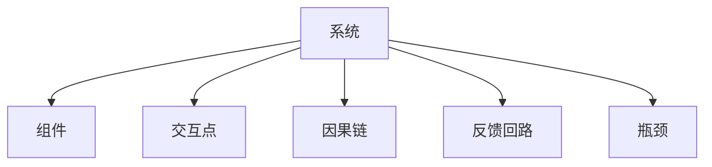

                 

# 系统思考：全面分析问题的关键

## 1. 背景介绍

### 1.1 问题由来
在当今复杂多变的技术环境中，无论是软件开发、系统架构设计，还是商业决策，都需要进行系统思考（Systematic Thinking）。系统思考强调从全局视角出发，理解各组件间相互依赖和相互作用的关系，从而制定出合理有效的解决方案。特别是在大型项目、复杂系统、分布式环境中，系统思考尤为重要。

### 1.2 问题核心关键点
系统思考的核心在于全面、动态、整体地分析问题。与孤立、静态的局部分析不同，系统思考将问题放置于整个系统环境中考虑，识别系统组件间的互动关系，避免单一视角带来的片面性。

### 1.3 问题研究意义
系统思考对于提升项目成功率、优化系统性能、增强团队协作具有重要意义。通过系统思考，开发者能够：
- 识别系统关键组件和交互点
- 预测系统变化带来的影响
- 预防潜在问题，优化系统设计
- 提高团队协作效率，提升项目执行力

## 2. 核心概念与联系

### 2.1 核心概念概述

为更好地理解系统思考方法，本节将介绍几个密切相关的核心概念：

- 系统(System)：由多个组件和相互作用关系组成的整体。系统思维强调整体优化，而非个别组件的最优。
- 组件(Component)：系统中的个体元素，可以是人、软件模块、硬件设备等。
- 交互点(Interaction Point)：系统内组件之间的连接点，通常是信息或资源的传递点。
- 因果链(Cause-Effect Chain)：系统中组件间相互作用关系，导致某一结果的链式关系。
- 反馈回路(Feedback Loop)：系统中信息或资源在系统各组件间反复循环的过程，对系统的动态行为有重要影响。
- 瓶颈(Bottleneck)：系统运行中信息或资源传递不畅的部分，往往是系统性能的制约因素。

这些概念之间的逻辑关系可以通过以下Mermaid流程图来展示：



这个流程图展示了一系列系统思考的重要概念及其相互关系：

1. 系统由多个组件构成。
2. 组件通过交互点相互作用。
3. 因果链描述组件间的依赖关系。
4. 反馈回路揭示系统动态行为。
5. 瓶颈是系统性能的薄弱环节。

## 3. 核心算法原理 & 具体操作步骤
### 3.1 算法原理概述

系统思考的算法原理基于系统动力学(System Dynamics)，旨在通过模拟和分析系统各组件间的关系，找到系统运作的规律和关键点，从而优化系统设计。

假设系统为$S$，包含$N$个组件$C_i$（$i=1,2,\ldots,N$），组件间通过$M$个交互点$I_{ij}$（$i,j=1,\ldots,N$）进行信息或资源的传递。系统动态行为由因果链$C$和反馈回路$F$决定。

系统思考的核心目标是：
- 构建系统动态模型
- 识别系统瓶颈和优化点
- 设计干预措施以改善系统性能

### 3.2 算法步骤详解

系统思考的主要步骤包括：

**Step 1: 系统建模**
- 收集系统数据和信息，构建系统的因果链模型。
- 确定系统中关键组件及其相互作用关系。
- 使用因果图(Cause-Effect Diagram)或状态方程(State Equation)表示系统动态。

**Step 2: 系统仿真**
- 使用仿真工具(如Vensim、Simulink等)对系统模型进行仿真，观察系统行为。
- 调整系统参数，模拟不同干预措施的效果。
- 分析系统瓶颈和关键组件，识别潜在问题。

**Step 3: 系统优化**
- 根据仿真结果，优化系统设计，改善瓶颈和薄弱环节。
- 设计干预措施，提高系统整体性能。
- 预测系统未来行为，评估改进措施的效果。

### 3.3 算法优缺点

系统思考的优点在于全面、动态地分析系统问题，识别系统组件间的互动关系，帮助制定合理的干预措施。

然而，系统思考也存在一些局限性：
- 复杂度高：对于大规模系统，建模和仿真过程繁琐且复杂。
- 数据需求高：需要大量数据和信息，否则系统模型无法准确反映实际系统运作情况。
- 需要专业技能：建模、仿真和优化需要较高的系统动力学和仿真技术知识。
- 结果不确定性：系统模型和仿真结果可能受初始条件、参数设置等因素影响，存在不确定性。

### 3.4 算法应用领域

系统思考不仅适用于技术领域的系统优化，也广泛应用于以下各个领域：

- 软件开发：通过分析系统组件间的依赖关系，优化代码结构，提高系统可维护性。
- 系统架构设计：识别关键组件和瓶颈，设计高效的系统架构，提升系统性能。
- 商业决策：分析企业内部各流程间的互动关系，制定合理的战略规划。
- 项目管理：识别项目关键路径和依赖关系，优化资源分配，提升项目执行力。
- 网络安全：通过分析系统各组件间的信息流动，识别潜在的安全风险，制定防范措施。

这些领域的应用展示了系统思考方法的多样性和广泛性。

## 4. 数学模型和公式 & 详细讲解  
### 4.1 数学模型构建

系统思考的数学模型通常使用因果图或状态方程来表示系统组件间的因果关系。

设系统为$S$，包含$N$个组件$C_i$（$i=1,2,\ldots,N$），组件间通过$M$个交互点$I_{ij}$（$i,j=1,\ldots,N$）进行信息或资源的传递。因果链$C$和反馈回路$F$可以表示为如下形式：

$$
C = \{(C_i, C_j) | C_i \rightarrow C_j, i \neq j\}
$$

$$
F = \{(C_i, C_j) | C_i \rightarrow C_j, C_j \rightarrow C_i\}
$$

系统状态可以用向量$\mathbf{x}(t)$表示，其中$t$为时间。系统动态方程为：

$$
\dot{\mathbf{x}}(t) = f(\mathbf{x}(t), t)
$$

其中$f(\cdot)$为状态方程，表示组件间的动态关系。

### 4.2 公式推导过程

以最简单的因果链为例，假设系统由两个组件$C_1$和$C_2$组成，它们的动态方程分别为：

$$
\dot{x}_1 = a_1 + b_1 x_2
$$

$$
\dot{x}_2 = a_2 + b_2 x_1
$$

其中$a_1,a_2$为常数，$b_1,b_2$为系数，$x_1,x_2$为状态变量。

假设初始状态$x_1(0)=x_{10}, x_2(0)=x_{20}$，通过求解微分方程组，可以得到系统状态随时间的变化：

$$
x_1(t) = e^{a_1t}(x_{10} + \frac{b_1}{a_1 - b_2}(e^{b_1t}-e^{a_2t})x_{20})
$$

$$
x_2(t) = e^{a_2t}(x_{20} + \frac{b_2}{a_2 - b_1}(e^{b_2t}-e^{a_1t})x_{10})
$$

通过数学模型，可以精确描述系统各组件间的动态关系，为系统仿真和优化提供基础。

### 4.3 案例分析与讲解

以航空交通控制系统为例，分析系统组件间的因果链和反馈回路：

- 组件$C_1$：空中交通管制中心
- 组件$C_2$：飞行器
- 组件$C_3$：天气系统

假设$C_1$通过$I_1$控制$C_2$，$C_2$通过$I_2$向$C_1$反馈飞行状态，$C_3$通过$I_3$影响$C_1$和$C_2$的交互。

因果链$C$包括：
- $C_1 \rightarrow C_2$：管制中心发出指令，飞行器执行
- $C_2 \rightarrow C_1$：飞行器状态反馈，管制中心调整指令

反馈回路$F$包括：
- $C_2 \rightarrow C_3 \rightarrow C_1$：天气系统影响飞行器性能，飞行器状态反馈，管制中心调整指令

通过系统建模和仿真，可以分析系统瓶颈（如天气系统对飞行的影响），优化控制策略，提升整体系统性能。

## 5. 项目实践：代码实例和详细解释说明
### 5.1 开发环境搭建

在进行系统思考的项目实践前，我们需要准备好开发环境。以下是使用Python进行Sympy库开发的Python环境配置流程：

1. 安装Anaconda：从官网下载并安装Anaconda，用于创建独立的Python环境。

2. 创建并激活虚拟环境：
```bash
conda create -n systemthinking python=3.8 
conda activate systemthinking
```

3. 安装Sympy：
```bash
pip install sympy
```

4. 安装各类工具包：
```bash
pip install numpy pandas scikit-learn matplotlib tqdm jupyter notebook ipython
```

完成上述步骤后，即可在`systemthinking`环境中开始系统思考实践。

### 5.2 源代码详细实现

下面我们以因果图建模为例，使用Sympy库对系统进行建模和仿真。

首先，定义系统组件和因果链：

```python
from sympy import symbols, Eq, solve

# 定义系统组件和状态变量
x1, x2 = symbols('x1 x2')

# 定义因果链
causal_relations = {
    'C1': {'C2': 0.5},
    'C2': {'C1': -0.2},
    'C3': {'C1': 0.3, 'C2': 0.4}
}

# 定义系统状态方程
def state_equations(state, time):
    x1_dot = 0.2 + 0.3 * state['C2']
    x2_dot = -0.3 + 0.4 * state['C1']
    return {'C1': x1_dot, 'C2': x2_dot}
```

然后，定义系统仿真函数：

```python
from sympy import integrate, exp

# 定义仿真函数
def simulate(state, time):
    # 初始状态
    x1_initial = 10
    x2_initial = 20
    
    # 初始化状态向量
    state_vector = [x1_initial, x2_initial]
    
    # 仿真时间
    simulation_time = 10
    
    # 对系统方程进行积分求解
    for i in range(1, simulation_time + 1):
        state_vector = integrate(state_equations, state_vector, (0, i))
    
    return state_vector
```

最后，启动系统仿真：

```python
# 运行仿真
state_vector = simulate({'C1': 0, 'C2': 0}, 10)
print(state_vector)
```

以上就是使用Sympy库对因果图系统进行建模和仿真的完整代码实现。可以看到，Sympy库的强大封装使得系统建模和仿真变得简洁高效。开发者可以将更多精力放在问题建模和算法优化上，而不必过多关注底层实现细节。

### 5.3 代码解读与分析

让我们再详细解读一下关键代码的实现细节：

**因果链定义**：
- `causal_relations`字典定义了组件间的因果关系，键为组件名，值为连接的系数。

**状态方程定义**：
- `state_equations`函数根据状态方程定义，计算每个组件在下一个时刻的状态变化量。

**仿真函数实现**：
- `simulate`函数根据状态方程，通过积分求解系统状态随时间的变化。
- 使用`integrate`函数计算积分，得到每个组件在仿真时间点上的状态值。

通过这段代码，我们可以看到系统建模和仿真的基本流程，从定义因果链到求解微分方程，最终得到系统状态随时间的变化。

## 6. 实际应用场景
### 6.1 智能制造系统

系统思考在智能制造系统的优化中具有重要应用。传统制造业往往依赖大量人工作业，生产效率低，且难以适应复杂变化。通过系统思考，可以全面分析制造系统的各个组件，优化生产流程，提升自动化和灵活性。

具体而言，可以收集制造系统的各组件（如生产设备、控制系统、工人等）和它们之间的交互关系，构建因果链模型。通过对模型进行仿真和优化，可以识别瓶颈环节，优化资源配置，实现生产过程的自动化和智能化。

### 6.2 物流供应链系统

物流供应链系统复杂多变，包含订单处理、仓储管理、运输调度等多个组件。通过系统思考，可以全面分析各组件间的依赖关系，优化供应链流程，提升系统效率。

例如，可以收集订单处理、仓储管理和运输调度的数据，构建因果链模型。通过仿真和优化，可以识别出延迟订单处理、仓储不足等瓶颈环节，优化资源分配，提升物流效率。

### 6.3 金融风险控制系统

金融市场风险复杂多变，包含众多影响因素。通过系统思考，可以全面分析市场数据和金融产品之间的因果关系，优化风险控制策略，降低系统风险。

例如，可以收集金融市场数据和金融产品的数据，构建因果链模型。通过仿真和优化，可以识别出市场波动、信用风险等关键因素，制定相应的风险控制措施。

### 6.4 未来应用展望

随着系统思考理论和方法的不断发展，其在各领域的应用前景将更加广阔。

在智慧城市建设中，系统思考可以全面分析城市各组件间的互动关系，优化交通、能源、环境等系统，提升城市管理水平。

在医疗健康领域，系统思考可以全面分析疾病传播、治疗效果等关键因素，优化诊疗流程，提升医疗服务质量。

在教育培训领域，系统思考可以全面分析学生、教师、课程等组件的互动关系，优化教学设计，提升教学效果。

未来，系统思考方法将在更多领域得到广泛应用，推动各行业的数字化、智能化转型。

## 7. 工具和资源推荐
### 7.1 学习资源推荐

为了帮助开发者系统掌握系统思考的理论基础和实践技巧，这里推荐一些优质的学习资源：

1. 《系统动力学：建模、仿真与实践》：由MIT系统动力学专家所著，全面介绍了系统思考的理论基础和建模方法。

2. 《系统思考导论》：由系统动力学先驱约翰·沃顿（John Warfield）所著，适合系统思考的入门读物。

3. 《系统动力学：基本概念与建模技术》：由系统动力学协会（System Dynamics Society）编写，适合进一步深入学习的读者。

4. 《系统动力学建模与仿真》：由上海交通大学等高校编写的教材，详细介绍了系统动力学建模与仿真的技术细节。

5. 《系统思考与系统动力学》：由MIT系统动力学课程的讲义和配套材料，适合深入学习系统思考理论的读者。

通过对这些资源的学习实践，相信你一定能够快速掌握系统思考的精髓，并用于解决实际的系统问题。

### 7.2 开发工具推荐

高效的开发离不开优秀的工具支持。以下是几款用于系统思考开发的常用工具：

1. Vensim：著名的系统动力学仿真软件，支持复杂系统建模和仿真，广泛应用于学术和工业界。

2. Simulink：MATLAB配套的仿真工具，支持多领域系统建模和仿真，适合复杂系统的研究和开发。

3. AnyLogic：适用于多学科领域的系统建模和仿真，支持大规模系统仿真，适合研究和教育应用。

4. PyBoy：基于Python的系统动力学建模和仿真工具，适合小型系统和动态分析。

5. Python系统动力学库：如SysPy、PySD、PythonOED等，支持系统建模和仿真，适合研究和学习应用。

合理利用这些工具，可以显著提升系统思考任务的开发效率，加快创新迭代的步伐。

### 7.3 相关论文推荐

系统思考的理论和方法近年来得到了广泛的研究。以下是几篇奠基性的相关论文，推荐阅读：

1. "Foundations of System Dynamics"（由Forrester教授所著）：系统思考理论的奠基之作，介绍了系统思考的基本概念和方法。

2. "A New Systems Dynamics Framework: Learning to See"（由Homer-Padro等著）：提出了一种新的系统动力学框架，用于解决复杂系统问题。

3. "Bridging Systems Theory and System Dynamics: A Guide for Academics and Practitioners"（由Kennedy教授著）：系统思考理论的详细介绍和应用指南。

4. "System Dynamics and System Thinking: An Introduction"（由Cobb-Walgren等著）：系统思考和系统动力学的基本介绍和应用示例。

5. "The System Dynamics Methodology: Building Models of Complex Projects and Managing Major Challenges"（由Simonsen教授著）：系统思考在复杂项目管理和挑战应对中的应用方法。

这些论文代表了大系统思考理论的发展脉络。通过学习这些前沿成果，可以帮助研究者把握学科前进方向，激发更多的创新灵感。

## 8. 总结：未来发展趋势与挑战
### 8.1 总结

本文对系统思考方法进行了全面系统的介绍。首先阐述了系统思考的研究背景和意义，明确了系统思考在全面分析问题中的独特价值。其次，从原理到实践，详细讲解了系统思考的数学原理和关键步骤，给出了系统思考任务开发的完整代码实例。同时，本文还广泛探讨了系统思考方法在多个领域的应用前景，展示了系统思考方法的广泛性和多样性。

通过本文的系统梳理，可以看到，系统思考方法不仅适用于技术领域的系统优化，也广泛应用于商业决策、项目管理、网络安全等多个领域。系统思考通过全面、动态、整体地分析问题，帮助开发者识别系统组件间的互动关系，避免单一视角带来的片面性，从而制定出合理有效的解决方案。

### 8.2 未来发展趋势

展望未来，系统思考方法将呈现以下几个发展趋势：

1. 模型自动化：随着人工智能技术的发展，系统建模和仿真将更多依赖自动化工具，减少人工干预，提升建模效率。

2. 跨学科融合：系统思考方法将更多与人工智能、大数据、复杂系统等跨学科领域进行融合，实现更全面、深入的系统分析。

3. 动态优化：通过引入动态仿真技术，系统思考将更加注重系统动态行为的研究，优化系统设计和控制策略。

4. 可视化和交互：系统思考方法将更多结合可视化工具和交互技术，增强系统分析的可解释性和易用性。

5. 多领域应用：系统思考方法将更多应用于不同领域，解决复杂问题，提升系统性能和效率。

这些趋势凸显了系统思考方法的广阔前景。这些方向的探索发展，必将进一步提升系统思考技术的应用深度和广度，为复杂系统问题的解决提供更多选择。

### 8.3 面临的挑战

尽管系统思考方法已经取得了显著成就，但在迈向更加智能化、普适化应用的过程中，它仍面临着诸多挑战：

1. 复杂性挑战：系统思考方法对于复杂系统的建模和仿真过程繁琐且复杂，需要高超的理论和实践技能。

2. 数据依赖高：系统思考方法需要大量数据和信息，才能构建准确的因果链模型。

3. 结果不确定性：系统模型和仿真结果可能受初始条件、参数设置等因素影响，存在不确定性。

4. 工具和技术门槛高：系统思考方法需要借助专业的工具和技术，增加了学习和使用难度。

5. 实际应用难度大：系统思考方法在实际应用中可能需要与多学科知识进行结合，增加了应用难度。

这些挑战需要研究者不断探索和创新，通过结合最新技术和方法，克服现有困难，推动系统思考方法的发展。

### 8.4 研究展望

面向未来，系统思考方法需要在以下几个方面寻求新的突破：

1. 引入人工智能技术：将人工智能方法引入系统思考，实现系统组件的自动化建模和仿真，提升建模效率。

2. 开发新方法工具：开发新系统动力学建模和仿真工具，降低使用难度，提升建模和仿真效果。

3. 增强可视化技术：结合可视化技术，增强系统分析和解释的能力，提升用户界面友好性。

4. 推动跨学科研究：推动系统思考与人工智能、大数据、复杂系统等跨学科领域的研究，提升系统思考的应用深度和广度。

5. 拓展应用场景：拓展系统思考方法在更多领域的应用，解决复杂系统问题，提升系统性能和效率。

这些研究方向的探索，必将引领系统思考技术迈向更高的台阶，为复杂系统问题的解决提供更多选择。只有勇于创新、敢于突破，才能不断拓展系统思考方法的边界，提升系统分析的科学性和精确性。

## 9. 附录：常见问题与解答
**Q1：系统思考与传统分析方法有何不同？**

A: 系统思考与传统分析方法的主要区别在于其全局视角和整体性。传统方法往往从局部出发，关注单个组件的性能和指标，而系统思考则强调系统组件间的互动关系，全面分析和优化系统整体性能。

**Q2：如何构建准确的因果链模型？**

A: 构建准确的因果链模型需要收集系统组件间的相关数据和信息，识别和定义组件间的依赖关系，进行合理的因果链建模。通常需要多次迭代和验证，确保因果链模型的准确性和可靠性。

**Q3：系统思考与复杂系统工程有何联系？**

A: 系统思考与复杂系统工程紧密相关，复杂系统工程更注重系统设计和控制策略的优化，而系统思考则注重系统组件间的因果关系和反馈回路，两者结合可以更全面地分析和优化复杂系统。

**Q4：系统思考在实际应用中需要注意哪些问题？**

A: 系统思考在实际应用中需要注意以下问题：
1. 数据收集：确保数据的质量和完整性，避免数据偏差。
2. 模型简化：在系统模型中合理简化和抽象，避免过度复杂化。
3. 仿真验证：通过仿真验证系统模型的准确性和可靠性，调整模型参数。
4. 干预措施：设计合理的干预措施，避免过度干预。

**Q5：系统思考的未来发展方向是什么？**

A: 系统思考的未来发展方向包括：
1. 自动化建模：引入自动化工具和技术，提升建模效率。
2. 跨学科融合：结合人工智能、大数据等跨学科领域，提升系统分析的深度和广度。
3. 动态仿真：关注系统动态行为，优化系统设计和控制策略。
4. 可视化技术：结合可视化技术，增强系统分析和解释的能力。

这些发展方向将推动系统思考方法在更多领域的应用，为复杂系统问题的解决提供更多选择。

---

作者：禅与计算机程序设计艺术 / Zen and the Art of Computer Programming

