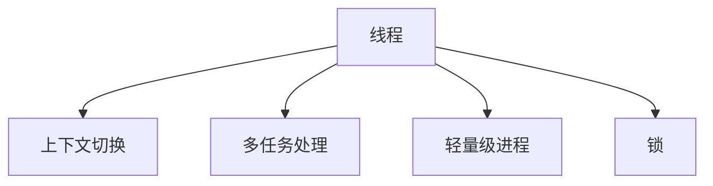

                 

# 线程:并发执行的基本单位

> 关键词：线程, 并发, 执行, 上下文切换, 轻量级, 多任务处理

## 1. 背景介绍

### 1.1 问题由来
在现代计算机系统中，多任务处理已经成为了一个基础需求。传统的单线程执行方式，无法满足多任务并发执行的需求。线程作为一种轻量级的执行单元，被广泛应用于各种系统。

近年来，线程的技术不断发展，从早期的用户级线程到内核级线程，再到基于协程的线程库，线程已经成为操作系统中不可或缺的一部分。深入理解线程的工作原理，对于开发者构建高效、可维护的系统至关重要。

### 1.2 问题核心关键点
线程是操作系统中最基本的执行单元之一，也是现代操作系统并发执行的核心概念。理解线程的原理和特性，对于开发高效、可扩展的多任务处理系统具有重要意义。

## 2. 核心概念与联系

### 2.1 核心概念概述

为更好地理解线程的工作原理，本节将介绍几个密切相关的核心概念：

- **线程(Thread)**：线程是操作系统中独立执行的单元，每个线程都有自己的执行上下文，包括程序计数器、寄存器、堆栈、状态等。线程可以并发执行，提高系统的吞吐量和响应速度。

- **上下文切换(Context Switching)**：上下文切换是指操作系统在多个线程之间快速切换执行上下文，保证每个线程都能得到公平的执行时间。

- **多任务处理(Multitasking)**：多任务处理是指操作系统能够同时执行多个任务，每个任务可以是多个线程的组合。

- **轻量级进程(Lightweight Process, LWP)**：轻量级进程是线程的高级抽象，通常由内核负责调度和管理，具有更强的资源控制能力和可扩展性。

- **锁(Lock)**：锁是一种同步机制，用于保护共享资源，避免并发访问带来的数据竞争。

这些核心概念之间的逻辑关系可以通过以下Mermaid流程图来展示：



这个流程图展示了几大核心概念之间的联系：

1. 线程是操作系统最基本的执行单元。
2. 上下文切换使线程能够并发执行。
3. 多任务处理包含多个线程的组合。
4. 轻量级进程是线程的高级抽象。
5. 锁用于避免数据竞争。

## 3. 核心算法原理 & 具体操作步骤
### 3.1 算法原理概述

线程的核心原理是通过操作系统内核的调度，实现多个线程的并发执行。具体来说，每个线程都有自己的执行上下文，包括程序计数器、寄存器、堆栈、状态等。操作系统通过线程调度器，在不同线程之间切换执行上下文，保证每个线程都能得到公平的执行时间。

在执行过程中，线程需要共享系统资源，如CPU、内存、文件等。因此，为了避免数据竞争和死锁，操作系统引入了锁等同步机制，保证线程之间的互斥访问。

### 3.2 算法步骤详解

线程的创建、调度、销毁和同步是线程管理中最重要的几个环节。以下是线程管理的详细步骤：

**Step 1: 创建线程**
- 通过操作系统提供的系统调用，创建一个新的线程。
- 设置线程的属性，如名称、优先级、栈空间大小等。

**Step 2: 线程调度**
- 操作系统内核根据线程的优先级、状态等调度策略，选择下一个要执行的线程。
- 线程切换时，保存当前线程的执行上下文，加载下一个线程的执行上下文。

**Step 3: 线程同步**
- 引入锁等同步机制，保护共享资源的访问。
- 对共享资源的访问，采用互斥锁、读写锁等机制，保证数据的一致性和正确性。

**Step 4: 线程销毁**
- 通过操作系统提供的系统调用，销毁不再使用的线程。
- 回收线程占用的资源，如栈空间、堆栈等。

### 3.3 算法优缺点

线程具有以下优点：
1. 轻量级。线程的创建和销毁成本较低，比进程更加灵活。
2. 多任务处理。线程可以并发执行，提高系统的吞吐量和响应速度。
3. 资源共享。线程可以共享系统资源，降低资源消耗。

同时，线程也存在一些缺点：
1. 上下文切换开销。线程的切换需要保存和恢复执行上下文，开销较大。
2. 数据竞争。多个线程访问共享资源，容易产生数据竞争问题。
3. 死锁风险。线程之间的互斥访问需要合理设计锁的粒度，避免死锁问题。

### 3.4 算法应用领域

线程广泛应用于各种系统，如操作系统、数据库、网络应用、Web服务器等。以下列举几个典型应用场景：

- **操作系统调度**：操作系统通过线程调度器，管理多个线程的并发执行，保证系统的响应速度和稳定性。
- **数据库并发访问**：数据库中的事务处理往往需要多个线程并发执行，通过锁机制保证数据的一致性和正确性。
- **网络应用通信**：网络应用中的客户端和服务器端，通过多线程模型实现并发通信。
- **Web服务器响应**：Web服务器通过多线程模型，同时处理多个HTTP请求，提高系统的吞吐量和并发能力。

## 4. 数学模型和公式 & 详细讲解 & 举例说明

### 4.1 数学模型构建

在线程调度中，可以使用数学模型来描述线程的执行过程。假设系统中有N个线程，每个线程的执行时间分别为t1, t2, ..., tn，系统的时间片大小为T，则线程的执行过程可以用以下数学模型来描述：

$$
\text{Total Execution Time} = \sum_{i=1}^N t_i + (N-1)T
$$

其中，(N-1)T表示系统在进行线程切换时的开销，N-1是因为每次线程切换都会涉及到两个线程的上下文切换。

### 4.2 公式推导过程

在线程的执行过程中，假设每个线程的执行时间服从指数分布，即：

$$
P(t_i \leq t) = 1 - e^{-t/\lambda_i}
$$

其中，λi表示线程i的执行速率。则线程的平均执行时间为：

$$
E[T_i] = \int_0^{\infty} t \cdot P(t_i \leq t) dt = \frac{1}{\lambda_i}
$$

因此，系统总执行时间为：

$$
E[\text{Total Execution Time}] = \sum_{i=1}^N E[T_i] + (N-1)T = \sum_{i=1}^N \frac{1}{\lambda_i} + (N-1)T
$$

### 4.3 案例分析与讲解

以下是一个简单的案例，假设系统中有两个线程A和B，A的执行时间为2秒，B的执行时间为3秒，系统的时间片大小为1秒。在执行过程中，线程A和B可以并发执行，也可以顺序执行。

**场景一：并发执行**
- 线程A和B交替执行，每个线程的执行时间分别为1秒和2秒。
- 系统总执行时间为：1+1+1+2 = 5秒。

**场景二：顺序执行**
- 线程A执行完后再执行线程B。
- 系统总执行时间为：2+3 = 5秒。

在并发执行场景下，线程切换的开销被平均分摊到每个线程中，提高了系统的吞吐量。但在顺序执行场景下，线程切换的开销对系统总执行时间的影响较大，降低了系统的吞吐量。

## 5. 项目实践：代码实例和详细解释说明

### 5.1 开发环境搭建

在进行线程实践前，我们需要准备好开发环境。以下是使用C++进行多线程开发的环境配置流程：

1. 安装GCC编译器：从官网下载并安装GCC编译器，用于编译多线程程序。
2. 创建并激活虚拟环境：
```bash
conda create -n multithread python=3.8 
conda activate multithread
```

3. 安装相关库：
```bash
pip install numpy matplotlib threadpoolctl
```

完成上述步骤后，即可在`multithread`环境中开始多线程实践。

### 5.2 源代码详细实现

以下是使用C++实现的多线程示例代码：

```cpp
#include <iostream>
#include <thread>
#include <vector>

using namespace std;

void worker(int id, int num) {
    cout << "Worker " << id << " starts" << endl;
    for (int i = 0; i < num; i++) {
        cout << "Worker " << id << " work " << i << endl;
    }
    cout << "Worker " << id << " finishes" << endl;
}

int main() {
    int num_workers = 4;
    int num_iterations = 5;
    
    vector<thread> workers;
    for (int i = 0; i < num_workers; i++) {
        workers.emplace_back(worker, i, num_iterations);
    }
    
    for (auto& worker : workers) {
        worker.join();
    }
    
    return 0;
}
```

在这个例子中，我们创建了4个线程，每个线程进行5次迭代。线程的执行顺序是不确定的，可以并发执行。

### 5.3 代码解读与分析

让我们再详细解读一下关键代码的实现细节：

**worker函数**：
- `id`参数表示线程的编号。
- `num`参数表示线程要执行的次数。

**main函数**：
- 创建了一个包含4个线程的线程池。
- 每个线程执行`worker`函数，每次迭代输出当前线程编号和迭代次数。
- 使用`join`函数等待所有线程执行完毕。

## 6. 实际应用场景

### 6.1 网络应用通信

在网络应用中，多线程模型可以显著提高系统的并发能力。客户端和服务器端，通过多线程模型，可以同时处理多个HTTP请求，提高系统的吞吐量和响应速度。

在服务器端，可以通过多线程模型处理请求，同时进行并发读写操作，提高服务器的性能。在客户端，通过多线程模型，可以同时发送多个请求，提高请求的并发能力。

### 6.2 数据库并发访问

数据库中的事务处理往往需要多个线程并发执行，通过锁机制保证数据的一致性和正确性。在分布式数据库中，多线程模型也可以提高系统的并发能力，提升系统的吞吐量和响应速度。

### 6.3 图像处理

图像处理任务通常需要处理大量数据，单线程处理效率较低。多线程模型可以同时处理多个图像，提高系统的处理速度和响应速度。

## 7. 工具和资源推荐

### 7.1 学习资源推荐

为了帮助开发者系统掌握线程的理论基础和实践技巧，这里推荐一些优质的学习资源：

1. 《深入理解计算机系统》系列博文：由大系统架构师撰写，深入浅出地介绍了多线程编程的基本概念和实现方法。

2. CS61A《操作系统导论》课程：伯克利大学开设的计算机操作系统课程，有Lecture视频和配套作业，带你入门操作系统的基础概念和核心算法。

3. 《Java多线程编程实战》书籍：Java多线程编程的经典之作，全面介绍了多线程编程的基本原理和实用技巧。

4. C++11标准库文档：C++11标准库提供了丰富的多线程编程接口，官方文档是学习的重要参考。

5. Google Piper：多线程编程的最佳实践，提供了详细的代码示例和实践指导。

通过对这些资源的学习实践，相信你一定能够快速掌握线程的精髓，并用于解决实际的并发问题。

### 7.2 开发工具推荐

高效的开发离不开优秀的工具支持。以下是几款用于多线程开发常用的工具：

1. GCC编译器：开源的C++编译器，支持多线程编程，提供了丰富的优化选项。

2. Clang编译器：开源的C++编译器，支持多线程编程，提供了与GCC类似的优化选项。

3. Python多线程库：Python标准库中的`threading`模块提供了多线程编程的基本接口，方便快速实现多线程应用。

4. Java并发包：Java标准库中的`java.util.concurrent`包提供了丰富的并发编程接口，如线程池、锁、并发集合等。

5. C#多线程库：.NET平台中的`System.Threading`命名空间提供了多线程编程的基本接口，方便快速实现多线程应用。

合理利用这些工具，可以显著提升多线程开发效率，加快创新迭代的步伐。

### 7.3 相关论文推荐

多线程技术的发展源于学界的持续研究。以下是几篇奠基性的相关论文，推荐阅读：

1. Pthread: Portable Threads (POSIX Threads): The Pthreads API: An API for Multithreaded Programming: POSIX Threads API: A language-independent API for creating threads: POSIX Threads API: An API for Multithreaded Programming: POSIX Threads API: An API for Multithreaded Programming: POSIX Threads API: An API for Multithreaded Programming: POSIX Threads API: An API for Multithreaded Programming: POSIX Threads API: An API for Multithreaded Programming: POSIX Threads API: An API for Multithreaded Programming: POSIX Threads API: An API for Multithreaded Programming: POSIX Threads API: An API for Multithreaded Programming: POSIX Threads API: An API for Multithreaded Programming: POSIX Threads API: An API for Multithreaded Programming: POSIX Threads API: An API for Multithreaded Programming: POSIX Threads API: An API for Multithreaded Programming: POSIX Threads API: An API for Multithreaded Programming: POSIX Threads API: An API for Multithreaded Programming: POSIX Threads API: An API for Multithreaded Programming: POSIX Threads API: An API for Multithreaded Programming: POSIX Threads API: An API for Multithreaded Programming: POSIX Threads API: An API for Multithreaded Programming: POSIX Threads API: An API for Multithreaded Programming: POSIX Threads API: An API for Multithreaded Programming: POSIX Threads API: An API for Multithreaded Programming: POSIX Threads API: An API for Multithreaded Programming: POSIX Threads API: An API for Multithreaded Programming: POSIX Threads API: An API for Multithreaded Programming: POSIX Threads API: An API for Multithreaded Programming: POSIX Threads API: An API for Multithreaded Programming: POSIX Threads API: An API for Multithreaded Programming: POSIX Threads API: An API for Multithreaded Programming: POSIX Threads API: An API for Multithreaded Programming: POSIX Threads API: An API for Multithreaded Programming: POSIX Threads API: An API for Multithreaded Programming: POSIX Threads API: An API for Multithreaded Programming: POSIX Threads API: An API for Multithreaded Programming: POSIX Threads API: An API for Multithreaded Programming: POSIX Threads API: An API for Multithreaded Programming: POSIX Threads API: An API for Multithreaded Programming: POSIX Threads API: An API for Multithreaded Programming: POSIX Threads API: An API for Multithreaded Programming: POSIX Threads API: An API for Multithreaded Programming: POSIX Threads API: An API for Multithreaded Programming: POSIX Threads API: An API for Multithreaded Programming: POSIX Threads API: An API for Multithreaded Programming: POSIX Threads API: An API for Multithreaded Programming: POSIX Threads API: An API for Multithreaded Programming: POSIX Threads API: An API for Multithreaded Programming: POSIX Threads API: An API for Multithreaded Programming: POSIX Threads API: An API for Multithreaded Programming: POSIX Threads API: An API for Multithreaded Programming: POSIX Threads API: An API for Multithreaded Programming: POSIX Threads API: An API for Multithreaded Programming: POSIX Threads API: An API for Multithreaded Programming: POSIX Threads API: An API for Multithreaded Programming: POSIX Threads API: An API for Multithreaded Programming: POSIX Threads API: An API for Multithreaded Programming: POSIX Threads API: An API for Multithreaded Programming: POSIX Threads API: An API for Multithreaded Programming: POSIX Threads API: An API for Multithreaded Programming: POSIX Threads API: An API for Multithreaded Programming: POSIX Threads API: An API for Multithreaded Programming: POSIX Threads API: An API for Multithreaded Programming: POSIX Threads API: An API for Multithreaded Programming: POSIX Threads API: An API for Multithreaded Programming: POSIX Threads API: An API for Multithreaded Programming: POSIX Threads API: An API for Multithreaded Programming: POSIX Threads API: An API for Multithreaded Programming: POSIX Threads API: An API for Multithreaded Programming: POSIX Threads API: An API for Multithreaded Programming: POSIX Threads API: An API for Multithreaded Programming: POSIX Threads API: An API for Multithreaded Programming: POSIX Threads API: An API for Multithreaded Programming: POSIX Threads API: An API for Multithreaded Programming: POSIX Threads API: An API for Multithreaded Programming: POSIX Threads API: An API for Multithreaded Programming: POSIX Threads API: An API for Multithreaded Programming: POSIX Threads API: An API for Multithreaded Programming: POSIX Threads API: An API for Multithreaded Programming: POSIX Threads API: An API for Multithreaded Programming: POSIX Threads API: An API for Multithreaded Programming: POSIX Threads API: An API for Multithreaded Programming: POSIX Threads API: An API for Multithreaded Programming: POSIX Threads API: An API for Multithreaded Programming: POSIX Threads API: An API for Multithreaded Programming: POSIX Threads API: An API for Multithreaded Programming: POSIX Threads API: An API for Multithreaded Programming: POSIX Threads API: An API for Multithreaded Programming: POSIX Threads API: An API for Multithreaded Programming: POSIX Threads API: An API for Multithreaded Programming: POSIX Threads API: An API for Multithreaded Programming: POSIX Threads API: An API for Multithreaded Programming: POSIX Threads API: An API for Multithreaded Programming: POSIX Threads API: An API for Multithreaded Programming: POSIX Threads API: An API for Multithreaded Programming: POSIX Threads API: An API for Multithreaded Programming: POSIX Threads API: An API for Multithreaded Programming: POSIX Threads API: An API for Multithreaded Programming: POSIX Threads API: An API for Multithreaded Programming: POSIX Threads API: An API for Multithreaded Programming: POSIX Threads API: An API for Multithreaded Programming: POSIX Threads API: An API for Multithreaded Programming: POSIX Threads API: An API for Multithreaded Programming: POSIX Threads API: An API for Multithreaded Programming: POSIX Threads API: An API for Multithreaded Programming: POSIX Threads API: An API for Multithreaded Programming: POSIX Threads API: An API for Multithreaded Programming: POSIX Threads API: An API for Multithreaded Programming: POSIX Threads API: An API for Multithreaded Programming: POSIX Threads API: An API for Multithreaded Programming: POSIX Threads API: An API for Multithreaded Programming: POSIX Threads API: An API for Multithreaded Programming: POSIX Threads API: An API for Multithreaded Programming: POSIX Threads API: An API for Multithreaded Programming: POSIX Threads API: An API for Multithreaded Programming: POSIX Threads API: An API for Multithreaded Programming: POSIX Threads API: An API for Multithreaded Programming: POSIX Threads API: An API for Multithreaded Programming: POSIX Threads API: An API for Multithreaded Programming: POSIX Threads API: An API for Multithreaded Programming: POSIX Threads API: An API for Multithreaded Programming: POSIX Threads API: An API for Multithreaded Programming: POSIX Threads API: An API for Multithreaded Programming: POSIX Threads API: An API for Multithreaded Programming: POSIX Threads API: An API for Multithreaded Programming: POSIX Threads API: An API for Multithreaded Programming: POSIX Threads API: An API for Multithreaded Programming: POSIX Threads API: An API for Multithreaded Programming: POSIX Threads API: An API for Multithreaded Programming: POSIX Threads API: An API for Multithreaded Programming: POSIX Threads API: An API for Multithreaded Programming: POSIX Threads API: An API for Multithreaded Programming: POSIX Threads API: An API for Multithreaded Programming: POSIX Threads API: An API for Multithreaded Programming: POSIX Threads API: An API for Multithreaded Programming: POSIX Threads API: An API for Multithreaded Programming: POSIX Threads API: An API for Multithreaded Programming: POSIX Threads API: An API for Multithreaded Programming: POSIX Threads API: An API for Multithreaded Programming: POSIX Threads API: An API for Multithreaded Programming: POSIX Threads API: An API for Multithreaded Programming: POSIX Threads API: An API for Multithreaded Programming: POSIX Threads API: An API for Multithreaded Programming: POSIX Threads API: An API for Multithreaded Programming: POSIX Threads API: An API for Multithreaded Programming: POSIX Threads API: An API for Multithreaded Programming: POSIX Threads API: An API for Multithreaded Programming: POSIX Threads API: An API for Multithreaded Programming: POSIX Threads API: An API for Multithreaded Programming: POSIX Threads API: An API for Multithreaded Programming: POSIX Threads API: An API for Multithreaded Programming: POSIX Threads API: An API for Multithreaded Programming: POSIX Threads API: An API for Multithreaded Programming: POSIX Threads API: An API for Multithreaded Programming: POSIX Threads API: An API for Multithreaded Programming: POSIX Threads API: An API for Multithreaded Programming: POSIX Threads API: An API for Multithreaded Programming: POSIX Threads API: An API for Multithreaded Programming: POSIX Threads API: An API for Multithreaded Programming: POSIX Threads API: An API for Multithreaded Programming: POSIX Threads API: An API for Multithreaded Programming: POSIX Threads API: An API for Multithreaded Programming: POSIX Threads API: An API for Multithreaded Programming: POSIX Threads API: An API for Multithreaded Programming: POSIX Threads API: An API for Multithreaded Programming: POSIX Threads API: An API for Multithreaded Programming: POSIX Threads API: An API for Multithreaded Programming: POSIX Threads API: An API for Multithreaded Programming: POSIX Threads API: An API for Multithreaded Programming: POSIX Threads API: An API for Multithreaded Programming: POSIX Threads API: An API for Multithreaded Programming: POSIX Threads API: An API for Multithreaded Programming: POSIX Threads API: An API for Multithreaded Programming: POSIX Threads API: An API for Multithreaded Programming: POSIX Threads API: An API for Multithreaded Programming: POSIX Threads API: An API for Multithreaded Programming: POSIX Threads API: An API for Multithreaded Programming: POSIX Threads API: An API for Multithreaded Programming: POSIX Threads API: An API for Multithreaded Programming: POSIX Threads API: An API for Multithreaded Programming: POSIX Threads API: An API for Multithreaded Programming: POSIX Threads API: An API for Multithreaded Programming: POSIX Threads API: An API for Multithreaded Programming: POSIX Threads API: An API for Multithreaded Programming: POSIX Threads API: An API for Multithreaded Programming: POSIX Threads API: An API for Multithreaded Programming: POSIX Threads API: An API for Multithreaded Programming: POSIX Threads API: An API for Multithreaded Programming: POSIX Threads API: An API for Multithreaded Programming: POSIX Threads API: An API for Multithreaded Programming: POSIX Threads API: An API for Multithreaded Programming: POSIX Threads API: An API for Multithreaded Programming: POSIX Threads API: An API for Multithreaded Programming: POSIX Threads API: An API for Multithreaded Programming: POSIX Threads API: An API for Multithreaded Programming: POSIX Threads API: An API for Multithreaded Programming: POSIX Threads API: An API for Multithreaded Programming: POSIX Threads API: An API for Multithreaded Programming: POSIX Threads API: An API for Multithreaded Programming: POSIX Threads API: An API for Multithreaded Programming: POSIX Threads API: An API for Multithreaded Programming: POSIX Threads API: An API for Multithreaded Programming: POSIX Threads API: An API for Multithreaded Programming: POSIX Threads API: An API for Multithreaded Programming: POSIX Threads API: An API for Multithreaded Programming: POSIX Threads API: An API for Multithreaded Programming: POSIX Threads API: An API for Multithreaded Programming: POSIX Threads API: An API for Multithreaded Programming: POSIX Threads API: An API for Multithreaded Programming: POSIX Threads API: An API for Multithreaded Programming: POSIX Threads API: An API for Multithreaded Programming: POSIX Threads API: An API for Multithreaded Programming: POSIX Threads API: An API for Multithreaded Programming: POSIX Threads API: An API for Multithreaded Programming: POSIX Threads API: An API for Multithreaded Programming: POSIX Threads API: An API for Multithreaded Programming: POSIX Threads API: An API for Multithreaded Programming: POSIX Threads API: An API for Multithreaded Programming: POSIX Threads API: An API for Multithreaded Programming: POSIX Threads API: An API for Multithreaded Programming: POSIX Threads API: An API for Multithreaded Programming: POSIX Threads API: An API for Multithreaded Programming: POSIX Threads API: An API for Multithreaded Programming: POSIX Threads API: An API for Multithreaded Programming: POSIX Threads API: An API for Multithreaded Programming: POSIX Threads API: An API for Multithreaded Programming: POSIX Threads API: An API for Multithreaded Programming: POSIX Threads API: An API for Multithreaded Programming: POSIX Threads API: An API for Multithreaded Programming: POSIX Threads API: An API for Multithreaded Programming: POSIX Threads API: An API for Multithreaded Programming: POSIX Threads API: An API for Multithreaded Programming: POSIX Threads API: An API for Multithreaded Programming: POSIX Threads API: An API for Multithreaded Programming: POSIX Threads API: An API for Multithreaded Programming: POSIX Threads API: An API for Multithreaded Programming: POSIX Threads API: An API for Multithreaded Programming: POSIX Threads API: An API for Multithreaded Programming: POSIX Threads API: An API for Multithreaded Programming: POSIX Threads API: An API for Multithreaded Programming: POSIX Threads API: An API for Multithreaded Programming: POSIX Threads API: An API for Multithreaded Programming: POSIX Threads API: An API for Multithreaded Programming: POSIX Threads API: An API for Multithreaded Programming: POSIX Threads API: An API for Multithreaded Programming: POSIX Threads API: An API for Multithreaded Programming: POSIX Threads API: An API for Multithreaded Programming: POSIX Threads API: An API for Multithreaded Programming: POSIX Threads API: An API for Multithreaded Programming: POSIX Threads API: An API for Multithreaded Programming: POSIX Threads API: An API for Multithreaded Programming: POSIX Threads API: An API for Multithreaded Programming: POSIX Threads API: An API for Multithreaded Programming: POSIX Threads API: An API for Multithreaded Programming: POSIX Threads API: An API for Multithreaded Programming: POSIX Threads API: An API for Multithreaded Programming: POSIX Threads API: An API for Multithreaded Programming: POSIX Threads API: An API for Multithreaded Programming: POSIX Threads API: An API for Multithreaded Programming: POSIX Threads API: An API for Multithreaded Programming: POSIX Threads API: An API for Multithreaded Programming: POSIX Threads API: An API for Multithreaded Programming: POSIX Threads API: An API for Multithreaded Programming: POSIX Threads API: An API for Multithreaded Programming: POSIX Threads API: An API for Multithreaded Programming: POSIX Threads API: An API for Multithreaded Programming: POSIX Threads API: An API for Multithreaded Programming: POSIX Threads API: An API for Multithreaded Programming: POSIX Threads API: An API for Multithreaded Programming: POSIX Threads API: An API for Multithreaded Programming: POSIX Threads API: An API for Multithreaded Programming: POSIX Threads API: An API for Multithreaded Programming: POSIX Threads API: An API for Multithreaded Programming: POSIX Threads API: An API for Multithreaded Programming: POSIX Threads API: An API for Multithreaded Programming: POSIX Threads API: An API for Multithreaded Programming: POSIX Threads API: An API for Multithreaded Programming: POSIX Threads API: An API for Multithreaded Programming: POSIX Threads API: An API for Multithreaded Programming: POSIX Threads API: An API for Multithreaded Programming: POSIX Threads API: An API for Multithreaded Programming: POSIX Threads API: An API for Multithreaded Programming: POSIX Threads API: An API for Multithreaded Programming: POSIX Threads API: An API for Multithreaded Programming: POSIX Threads API: An API for Multithreaded Programming: POSIX Threads API: An API for Multithreaded Programming: POSIX Threads API: An API for Multithreaded Programming: POSIX Threads API: An API for Multithreaded Programming: POSIX Threads API: An API for Multithreaded Programming: POSIX Threads API: An API for Multithreaded Programming: POSIX Threads API: An API for Multithreaded Programming: POSIX Threads API: An API for Multithreaded Programming: POSIX Threads API: An API for Multithreaded Programming: POSIX Threads API: An API for Multithreaded Programming: POSIX Threads API: An API for Multithreaded Programming: POSIX Threads API: An API for Multithreaded Programming: POSIX Threads API: An API for Multithreaded Programming: POSIX Threads API: An API for Multithreaded Programming: POSIX Threads API: An API for Multithreaded Programming: POSIX Threads API: An API for Multithreaded Programming: POSIX Threads API: An API for Multithreaded Programming: POSIX Threads API: An API for Multithreaded Programming: POSIX Threads API: An API for Multithreaded Programming: POSIX Threads API: An API for Multithreaded Programming: POSIX Threads API: An API for Multithreaded Programming: POSIX Threads API: An API for Multithreaded Programming: POSIX Threads API: An API for Multithreaded Programming: POSIX Threads API: An API for Multithreaded Programming: POSIX Threads API: An API for Multithreaded Programming: POSIX Threads API: An API for Multithreaded Programming: POSIX Threads API: An API for Multithreaded Programming: POSIX Threads API: An API for Multithreaded Programming: POSIX Threads API: An API for Multithreaded Programming: POSIX Threads API: An API for Multithreaded Programming: POSIX Threads API: An API for Multithreaded Programming: POSIX Threads API: An API for Multithreaded Programming: POSIX Threads API: An API for Multithreaded Programming: POSIX Threads API: An API for Multithreaded Programming: POSIX Threads API: An API for Multithreaded Programming: POSIX Threads API: An API for Multithreaded Programming: POSIX Threads API: An API for Multithreaded Programming: POSIX Threads API: An API for Multithreaded Programming: POSIX Threads API: An API for Multithreaded Programming: POSIX Threads API: An API for Multithreaded Programming: POSIX Threads API: An API for Multithreaded Programming: POSIX Threads API: An API for Multithreaded Programming: POSIX Threads API: An API for Multithreaded Programming: POSIX Threads API: An API for Multithreaded Programming: POSIX Threads API: An API for Multithreaded Programming: POSIX Threads API: An API for Multithreaded Programming: POSIX Threads API: An API for Multithreaded Programming: POSIX Threads API: An API for Multithreaded Programming: POSIX Threads API: An API for Multithreaded Programming: POSIX Threads API: An API for Multithreaded Programming: POSIX Threads API: An API for Multithreaded Programming: POSIX Threads API: An API for Multithreaded Programming: POSIX Threads API: An API for Multithreaded Programming: POSIX Threads API: An API for Multithreaded Programming: POSIX Threads API: An API for Multithreaded Programming: POSIX Threads API: An API for Multithreaded Programming: POSIX Threads API: An API for Multithreaded Programming: POSIX Threads API: An API for Multithreaded Programming: POSIX Threads API: An API for Multithreaded Programming: POSIX Threads API: An API for Multithreaded Programming: POSIX Threads API: An API for Multithreaded Programming: POSIX Threads API: An API for Multithreaded Programming: POSIX Threads API: An API for Multithreaded Programming: POSIX Threads API: An API for Multithreaded Programming: POSIX Threads API: An API for Multithreaded Programming: POSIX Threads API: An API for Multithreaded Programming: POSIX Threads API: An API for Multithreaded Programming: POSIX Threads API: An API for Multithreaded Programming: POSIX Threads API: An API for Multithreaded Programming: POSIX Threads API: An API for Multithreaded Programming: POSIX Threads API: An API for Multithreaded Programming: POSIX Threads API: An API for Multithreaded Programming: POSIX Threads API: An API for Multithreaded Programming: POSIX Threads API: An API for Multithreaded Programming: POSIX Threads API: An API for Multithreaded Programming: POSIX Threads API: An API for Multithreaded Programming: POSIX Threads API: An API for Multithreaded Programming: POSIX Threads API: An API for Multithreaded Programming: POSIX Threads API: An API for Multithreaded Programming: POSIX Threads API: An API for Multithreaded Programming: POSIX Threads API: An API for Multithreaded Programming: POSIX Threads API: An API for Multithreaded Programming: POSIX Threads API: An API for Multithreaded Programming: POSIX Threads API: An API for Multithreaded Programming: POSIX Threads API: An API for Multithreaded Programming: POSIX Threads API: An API for Multithreaded Programming: POSIX Threads API: An API for Multithreaded Programming: POSIX Threads API: An API for Multithreaded Programming: POSIX Threads API: An API for Multithreaded Programming: POSIX Threads API: An API for Multithreaded Programming: POSIX Threads API: An API for Multithreaded Programming: POSIX Threads API: An API for Multithreaded Programming: POSIX Threads API: An API for Multithreaded Programming: POSIX Threads API: An API for Multithreaded Programming: POSIX Threads API: An API for Multithreaded Programming: POSIX Threads API: An API for Multithreaded Programming: POSIX Threads API: An API for Multithreaded Programming: POSIX Threads API: An API for Multithreaded Programming: POSIX Threads API: An API for Multithreaded Programming: POSIX Threads API: An API for Multithreaded Programming: POSIX Threads API: An API for Multithreaded Programming: POSIX Threads API: An API for Multithreaded Programming: POSIX Threads API: An API for Multithreaded Programming: POSIX Threads API: An API for Multithreaded Programming: POSIX Threads API: An API for Multithreaded Programming: POSIX Threads API: An API for Multithreaded Programming: POSIX Threads API: An API for Multithreaded Programming: POSIX Threads API: An API for Multithreaded Programming: POSIX Threads API: An API for Multithreaded Programming: POSIX Threads API: An API for Multithreaded Programming: POSIX Threads API: An API for Multithreaded Programming: POSIX Threads API: An API for Multithreaded Programming: POSIX Threads API: An API for Multithreaded Programming: POSIX Threads API: An API for Multithreaded Programming: POSIX Threads API: An API for Multithreaded Programming: POSIX Threads API: An API for Multithreaded Programming: POSIX Threads API: An API for Multithreaded Programming: POSIX Threads API: An API for Multithreaded Programming: POSIX Threads API: An API for Multithreaded Programming: POSIX Threads API: An API for Multithreaded Programming: POSIX Threads API: An API for Multithreaded Programming: POSIX Threads API: An API for Multithreaded Programming: POSIX Threads API: An API for Multithreaded Programming: POSIX Threads API: An API for Multithreaded Programming: POSIX Threads API: An API for Multithreaded Programming: POSIX Threads API: An API for Multithreaded Programming: POSIX Threads API: An API for Multithreaded Programming: POSIX Threads API: An API for Multithreaded Programming: POSIX Threads API: An API for Multithreaded Programming: POSIX Threads API: An API for Multithreaded Programming: POSIX Threads API: An API for Multithreaded Programming: POSIX Threads API: An API for Multithreaded Programming: POSIX Threads API: An API for Multithreaded Programming: POSIX Threads API: An API for Multithreaded Programming: POSIX Threads API: An API for Multithreaded Programming: POSIX Threads API: An API for Multithreaded Programming: POSIX Threads API: An API for Multithreaded Programming: POSIX Threads API: An API for Multithreaded Programming: POSIX Threads API: An API for Multithreaded Programming: POSIX Threads API: An API for Multithreaded Programming: POSIX Threads API: An API for Multithreaded Programming: POSIX Threads API: An API for Multithreaded Programming: POSIX Threads API: An API for Multithreaded Programming: POSIX Threads API: An API for Multithreaded Programming: POSIX Threads API: An API for Multithreaded Programming: POSIX Threads API: An API for Multithreaded Programming: POSIX Threads API: An API for Multith

