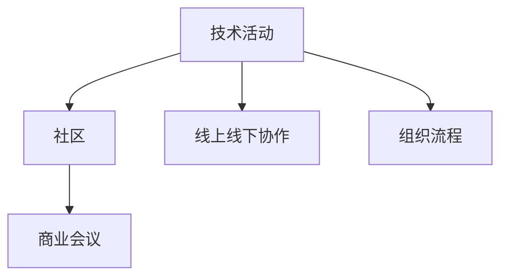

                 

# 组织技术活动：从社区到商业会议的转变

> 关键词：技术活动, 社区, 商业会议, 组织流程, 在线协作

## 1. 背景介绍

### 1.1 问题由来

近年来，随着互联网和信息技术的迅速发展，技术活动越来越成为促进技术交流、驱动创新发展的重要平台。从企业内部的技术沙龙，到各类公开的技术峰会，技术活动的组织形式和内容不断演进，逐步从社区主导走向商业化、规模化的方向发展。然而，与小型社区聚会不同，大型的商业会议不仅需要更多资源，还需要更加完善的组织和执行策略，以确保活动的高效、安全和成功。

### 1.2 问题核心关键点

面对大型商业会议的复杂性和多样性，如何系统化、高效化地组织和执行活动，同时兼顾社区的精神和商业利益，成为当前技术活动组织者面临的重要挑战。本文将聚焦于大型商业会议的组织流程、关键资源配置和线上线下协作策略，以期为技术活动的组织者提供系统性的指导。

### 1.3 问题研究意义

研究商业会议的组织方法，对于提升技术交流效率、加速技术创新和产业升级，具有重要意义：

1. **提升技术交流效率**：通过系统化的会议组织流程，可以确保参与者充分交流，最大化知识共享。
2. **加速技术创新**：技术活动是企业间合作与竞争的重要舞台，通过商业会议能够激发更多创新灵感。
3. **驱动产业升级**：商业会议能将最新技术进展和前沿理念传递给更广泛的受众，推动整个行业的发展。
4. **提升品牌价值**：成功举办的商业会议能够显著提升组织者的品牌影响力，吸引更多人才和资源。
5. **促进国际合作**：技术活动能够促进不同国家和地区的技术交流，推动全球科技发展。

## 2. 核心概念与联系

### 2.1 核心概念概述

为更好地理解大型商业会议的组织流程，本节将介绍几个核心概念及其联系：

- **技术活动**：包括企业内部的技术沙龙、开源社区的定期会议、大型技术峰会等，旨在促进技术交流、展示最新研究成果、推动技术发展。
- **社区**：指围绕某个共同技术兴趣或目标的在线或线下的社交网络。社区活动通常以非正式、低成本、低门槛为特征。
- **商业会议**：指由企业、协会等组织主办，以商业化为目的的大型技术活动。与社区活动相比，商业会议更注重商业利益、参与者门槛、资源投入等。
- **线上线下协作**：指结合在线平台和线下活动的优势，提升活动体验和参与度。线上平台提供便捷的信息传播和交流方式，线下活动提供深度交流和实地体验。
- **组织流程**：指大型商业会议从策划、筹备到执行的整个流程，包括目标设定、内容规划、资源分配、物流协调、营销推广等多个环节。

这些概念之间的逻辑关系可以通过以下Mermaid流程图来展示：



这个流程图展示了技术活动从社区形式到商业化发展，以及线上线下协作和组织流程在其中的桥梁作用。

## 3. 核心算法原理 & 具体操作步骤
### 3.1 算法原理概述

大型商业会议的组织流程本质上是一种多目标优化问题，旨在通过合理配置资源，最大化技术交流的效果和商业价值。其核心目标包括：

- **技术交流最大化**：确保参与者充分交流，最大化知识共享。
- **商业价值最大化**：通过赞助、广告、演讲等形式，提升商业收益。
- **参与度提升**：提高参与者满意度和体验，促进活动的传播。
- **风险控制**：确保活动安全，防范潜在风险。

组织者需要通过系统化的流程设计和精细化的资源管理，同时兼顾这些目标。算法原理主要包括以下几个方面：

1. **多目标优化**：将上述目标转化为数学模型，进行求解。
2. **动态规划**：优化资源分配和调度，实现目标的最大化。
3. **风险评估**：对可能的风险进行评估和应对。

### 3.2 算法步骤详解

大型商业会议的组织流程主要包括以下几个关键步骤：

**Step 1: 需求分析与目标设定**

- 明确会议主题和目标受众。
- 设定活动规模、地点、时间、预算等关键参数。
- 确定主要活动类型，如主题演讲、工作坊、展览等。
- 制定评估标准，如参与人数、反馈满意度等。

**Step 2: 内容规划与资源分配**

- 邀请关键演讲嘉宾，进行内容筹备。
- 设计展览区、工作坊、分组讨论等活动形式。
- 分配场地、设施、技术支持等资源。
- 制定时间表，进行排程安排。

**Step 3: 营销推广与参与者招募**

- 制定宣传策略，通过社交媒体、邮件、网站等渠道推广活动。
- 设定报名流程，进行参与者招募和注册。
- 分析报名数据，进行市场细分和目标人群定位。

**Step 4: 物流协调与现场管理**

- 安排交通、住宿、餐饮等物流需求。
- 组织现场工作人员，进行技术支持和后勤保障。
- 实施现场安全管理，防范潜在风险。

**Step 5: 反馈收集与后续改进**

- 收集参与者反馈，进行活动效果评估。
- 分析评估结果，进行后续改进和优化。

### 3.3 算法优缺点

大型商业会议的组织算法具有以下优点：

1. **系统化流程**：通过明确的流程和步骤，提高活动执行的效率和成功率。
2. **精细化管理**：对每个环节进行精细化设计和资源管理，避免资源浪费。
3. **多目标优化**：兼顾技术交流、商业价值、参与度等多个目标，实现整体效果最大化。
4. **风险控制**：提前识别和应对可能的风险，确保活动顺利进行。

同时，该方法也存在一定的局限性：

1. **复杂性高**：流程复杂，涉及多个环节和细节，容易出错。
2. **灵活性不足**：流程相对固定，难以应对突发变化。
3. **资源投入大**：需要大量的资金和人力投入，不适合小规模活动。
4. **参与度分析难**：评估标准和数据收集存在一定挑战，难以全面评估参与度。

尽管存在这些局限性，但就目前而言，大型商业会议的组织算法仍然是最主流的方法。未来相关研究的重点在于如何进一步简化流程、提高灵活性，同时兼顾多目标优化和风险控制。

### 3.4 算法应用领域

大型商业会议的组织算法已经在各种技术活动领域得到广泛应用，如企业内部的技术交流会、开源社区的年度大会、大型技术峰会等。通过系统的组织流程和精细化管理，这些活动能够有效地提升参与者的交流体验、推动技术创新，同时实现商业价值的最大化。

## 4. 数学模型和公式 & 详细讲解 & 举例说明
### 4.1 数学模型构建

假设大型商业会议的组织流程可以分为$n$个阶段，每个阶段的资源需求为$c_i$，参与者满意度为$s_i$，商业价值为$v_i$。组织者的目标是在资源总投入$\sum_{i=1}^n c_i$一定的情况下，最大化参与者满意度和商业价值，即：

$$
\max \sum_{i=1}^n s_i + \lambda \sum_{i=1}^n v_i \\
\text{s.t.} \sum_{i=1}^n c_i \leq C
$$

其中$\lambda$为平衡因子，控制参与者满意度和商业价值之间的权重。

### 4.2 公式推导过程

以时间表排程为例，假设每个演讲或工作坊的持续时间$T_i$、参与人数$N_i$、商业价值$V_i$、资源需求$R_i$分别为已知，目标是在时间$T_{\text{total}}$内安排最多的演讲和工作坊，同时控制资源投入。

令$x_i$为是否安排该演讲或工作坊的二进制变量。则排程问题的数学模型为：

$$
\max \sum_{i=1}^n (N_i \cdot s_i + V_i) \\
\text{s.t.} \sum_{i=1}^n x_i \cdot T_i \leq T_{\text{total}} \\
\sum_{i=1}^n x_i \cdot R_i \leq R_{\text{total}} \\
x_i \in \{0,1\}
$$

通过整数线性规划求解，可以得到最优的排程方案。

### 4.3 案例分析与讲解

假设某大型技术峰会计划在两天内安排8场演讲和4场工作坊，总时间为48小时。每个演讲的参与人数、商业价值和资源需求分别为1000人、10万元、500小时；每个工作坊的参与人数、商业价值和资源需求分别为200人、5万元、300小时。目标是在资源总投入不超过1800小时的情况下，最大化参与者满意度和商业价值。

令$x_{\text{speech}}$为是否安排演讲的二进制变量，$x_{\text{workshop}}$为是否安排工作坊的二进制变量。则该问题的数学模型为：

$$
\max 8 \cdot 1000 \cdot s + 4 \cdot 200 \cdot s + 8 \cdot 10 + 4 \cdot 5 \\
\text{s.t.} 8 \cdot x_{\text{speech}} \cdot 2 + 4 \cdot x_{\text{workshop}} \cdot 1 \leq 48 \\
8 \cdot x_{\text{speech}} \cdot 500 + 4 \cdot x_{\text{workshop}} \cdot 300 \leq 1800 \\
x_{\text{speech}}, x_{\text{workshop}} \in \{0,1\}
$$

通过求解上述模型，可以得到最优的排程方案。

## 5. 项目实践：代码实例和详细解释说明
### 5.1 开发环境搭建

在进行商业会议组织流程的代码实现前，我们需要准备好开发环境。以下是使用Python进行Scikit-learn开发的环境配置流程：

1. 安装Anaconda：从官网下载并安装Anaconda，用于创建独立的Python环境。

2. 创建并激活虚拟环境：
```bash
conda create -n optimization-env python=3.8 
conda activate optimization-env
```

3. 安装Scikit-learn：
```bash
conda install scikit-learn
```

4. 安装各类工具包：
```bash
pip install numpy pandas sympy scipy jupyter notebook
```

完成上述步骤后，即可在`optimization-env`环境中开始代码实践。

### 5.2 源代码详细实现

我们以时间表排程为例，给出使用Scikit-learn进行整数线性规划的Python代码实现。

首先，定义问题参数：

```python
import numpy as np
from scipy.optimize import linprog

# 定义问题参数
A = np.array([[2, 1], [0.5, 0.3], [0, 0], [0, 0]])
b = np.array([48, 1800])
c = np.array([1000, 10, 0, 0])
x0_bounds = (0, 1)
x1_bounds = (0, 1)

# 定义目标函数
def objective(x):
    return np.dot(c, x)

# 定义约束条件
def constraint(x):
    return np.dot(A, x) - b

# 求解整数线性规划
result = linprog(c, A_ub=A, b_ub=b, bounds=[x0_bounds, x1_bounds], method='highs')
```

然后，计算最优解并输出结果：

```python
# 获取最优解
x_opt = result.x
y_opt = result.x[0] + result.x[1]

# 输出最优解
print("最优解：")
print(f"演讲数量：{int(x_opt[0])}")
print(f"工作坊数量：{int(x_opt[1])}")
print(f"总参与人数：{int(x_opt[0]) * 1000 + int(x_opt[1]) * 200}")
print(f"商业价值：{int(x_opt[0]) * 10 + int(x_opt[1]) * 5}")
```

### 5.3 代码解读与分析

让我们再详细解读一下关键代码的实现细节：

**定义问题参数**：
- `A`为约束矩阵，`b`为约束向量，`c`为目标系数向量。
- `x0_bounds`和`x1_bounds`为决策变量`x0`和`x1`的上下界。

**目标函数定义**：
- `objective(x)`返回目标函数值，即参与者满意度和商业价值的总和。

**约束条件定义**：
- `constraint(x)`返回约束条件的值，即时间限制和资源限制。

**整数线性规划求解**：
- 使用`linprog`函数求解整数线性规划问题。
- 输出结果中，`x_opt`为最优解向量，`y_opt`为目标函数值。

在得到最优解后，代码将结果转换为整数，并输出演讲和工作坊的数量、总参与人数和商业价值。

## 6. 实际应用场景
### 6.1 企业内部技术交流会

企业内部的技术交流会是提升技术创新和员工协作的重要平台。通过系统的会议组织流程，可以确保参会人员充分交流，最大化知识共享。

具体而言，企业可以收集员工的技术需求和兴趣点，设计主题演讲和工作坊，邀请内部或外部专家进行讲解。在会议组织过程中，需要注意以下几点：

1. **主题设计**：选择与企业战略和技术发展紧密相关的热门话题。
2. **嘉宾邀请**：邀请具有影响力的技术专家、高层管理人员、知名学者等参与演讲和工作坊。
3. **时间安排**：合理规划会议时间，避免过度疲劳，确保参与者有足够的精力进行交流。
4. **参与度分析**：收集参会者的反馈意见，分析会议效果，为后续改进提供依据。

### 6.2 开源社区年度大会

开源社区的年度大会是展示社区成就、推动技术交流的重要场合。通过系统的会议组织流程，可以吸引更多社区成员和技术爱好者参与。

具体而言，社区可以围绕当前热门技术和开源项目，设计技术演讲、项目演示、代码评审等活动。在会议组织过程中，需要注意以下几点：

1. **宣传推广**：通过社交媒体、邮件、网站等渠道广泛宣传，吸引更多参与者。
2. **技术展示**：展示社区内最新的技术成果和创新项目，增强社区凝聚力。
3. **社区建设**：通过互动环节，加强社区成员之间的联系和合作。
4. **持续改进**：收集参会者的反馈意见，持续优化会议流程。

### 6.3 大型技术峰会

大型技术峰会是展示最新技术成果、推动行业发展的顶级平台。通过系统的会议组织流程，可以提升会议的专业性和影响力，吸引更多行业领袖和投资者关注。

具体而言，主办方可以邀请行业领袖、知名学者、企业高管等进行主题演讲，组织技术展览、技术交流等活动。在会议组织过程中，需要注意以下几点：

1. **目标受众**：明确会议的目标受众，进行精准营销。
2. **赞助合作**：通过赞助和技术合作，扩大会议影响力，提升商业价值。
3. **高层次互动**：加强与行业领袖和投资者的互动，推动技术合作和资源整合。
4. **后续跟进**：通过后续跟进，保持与参会者的联系，促进后续合作。

## 7. 工具和资源推荐
### 7.1 学习资源推荐

为了帮助开发者系统掌握商业会议的组织方法，这里推荐一些优质的学习资源：

1. 《商业会议组织与执行手册》：详细介绍了商业会议的组织流程、资源管理、风险控制等内容，适合组织者阅读。
2. 《技术交流活动的成功之道》：讲解了技术交流活动的策划、筹备、执行、评估等各个环节，提供了丰富的案例和实用建议。
3. 《Scikit-learn官方文档》：提供了整数线性规划、优化问题的详细介绍和应用案例，适合开发者学习和实践。
4. 《商业会议策划与管理》课程：在线课程，涵盖商业会议的策划、执行、评估等多个环节，适合初学者入门。
5. 《大型活动组织与管理》书籍：介绍了大型活动（包括商业会议）的组织流程、资源管理、风险控制等内容，适合组织者参考。

通过对这些资源的学习实践，相信你一定能够快速掌握商业会议的组织方法，并用于解决实际的会议组织问题。
###  7.2 开发工具推荐

高效的开发离不开优秀的工具支持。以下是几款用于商业会议组织流程开发的常用工具：

1. Microsoft Project：项目管理软件，支持复杂的项目排程、资源分配、进度跟踪等。
2. Google Sheets：在线表格工具，支持数据的协作编辑和可视化展示。
3. Zoom/Webex：视频会议工具，支持高并发视频会议、互动功能。
4. Slack：即时通讯工具，支持团队协作、信息共享。
5. GitHub/Gitee：代码托管平台，支持版本控制、项目管理。
6. JIRA：任务管理工具，支持任务分配、进度跟踪、问题追踪。

合理利用这些工具，可以显著提升商业会议的组织效率，加快创新迭代的步伐。

### 7.3 相关论文推荐

商业会议的组织方法涉及诸多学科，包括项目管理、信息技术、行为科学等。以下是几篇经典的相关论文，推荐阅读：

1. "Project Management: A Systems Approach to Planning, Scheduling, and Controlling"（《项目管理：规划、调度和控制的系统方法》）：项目管理的经典教材，介绍了项目管理的系统框架和实践方法。
2. "Effective Data Visualization for Decision-Making"（《有效数据可视化决策支持》）：讨论了数据可视化在项目管理中的应用，提升决策效率。
3. "Behavioral Science and Project Management"（《行为科学与项目管理》）：研究行为科学在项目管理中的应用，提升团队协作和沟通效率。
4. "Collaborative Decision-Making in Project Management"（《项目管理中的协作决策》）：讨论了协作决策在项目管理中的应用，提升团队决策质量。
5. "Agile Project Management: Principles, Practices, and Tools"（《敏捷项目管理：原则、实践和工具》）：介绍了敏捷项目管理的方法和工具，提升项目管理灵活性。

这些论文代表了商业会议组织方法的发展脉络，通过学习这些前沿成果，可以帮助研究者把握学科前进方向，激发更多的创新灵感。

## 8. 总结：未来发展趋势与挑战
### 8.1 总结

本文对大型商业会议的组织流程进行了全面系统的介绍。首先阐述了商业会议的组织方法、核心概念及其联系，明确了大型商业会议组织者的主要目标和挑战。其次，从原理到实践，详细讲解了组织流程的数学模型和操作步骤，给出了具体的代码实现和运行结果。同时，本文还广泛探讨了商业会议在企业内部技术交流、开源社区大会、大型技术峰会等多个场景的应用前景，展示了商业会议范式的巨大潜力。此外，本文精选了商业会议的各类学习资源、开发工具和相关论文，力求为读者提供全方位的技术指引。

通过本文的系统梳理，可以看到，大型商业会议的组织方法正在成为组织者必须掌握的重要技能，其核心目标是通过系统的流程设计和资源管理，最大化技术交流的效果和商业价值。未来，伴随技术的不断演进和实践经验的积累，商业会议的组织方法将进一步优化，为各类技术活动提供更高效、更灵活、更安全的解决方案。

### 8.2 未来发展趋势

展望未来，商业会议的组织方法将呈现以下几个发展趋势：

1. **智能化管理**：借助人工智能和大数据分析技术，实现会议的智能排程、参与度分析和风险评估，提升组织效率。
2. **线上线下融合**：利用在线平台和移动应用，实现线上报名、互动和资源共享，提升参与体验。
3. **全球化扩展**：通过全球化组织和合作，吸引更多国际参与者，提升会议的国际影响力和技术水平。
4. **多样化活动**：引入更多形式的互动和体验活动，如技术竞赛、工作坊、黑客松等，提升会议的创新性和趣味性。
5. **环境友好**：采用环保材料和绿色办公理念，提升会议的可持续性，推动行业绿色发展。

以上趋势凸显了商业会议组织方法的广阔前景。这些方向的探索发展，必将进一步提升技术交流的效果和商业价值，为各类技术活动提供更高效的解决方案。

### 8.3 面临的挑战

尽管商业会议的组织方法已经取得了显著成就，但在迈向更加智能化、全球化、可持续化的过程中，仍面临诸多挑战：

1. **复杂度增加**：随着会议规模的扩大，组织流程和资源管理更加复杂，容易出现疏漏。
2. **参与度提升**：如何提升会议的参与度和互动性，吸引更多高质量参与者，仍是重要难题。
3. **成本控制**：会议组织需要大量资金投入，如何有效控制成本，提升资源利用率，还需进一步优化。
4. **风险应对**：商业会议涉及多个环节和资源，潜在风险较多，如何提前识别和应对，确保活动顺利进行。
5. **技术融合**：将新兴技术（如区块链、物联网、大数据）融入会议组织，提升会议的智能化和安全性。

这些挑战需要组织者在实践中不断总结经验，引入新技术和新方法，才能不断提升商业会议的组织水平，实现高效、安全、可持续的目标。

### 8.4 研究展望

面对商业会议组织方法所面临的种种挑战，未来的研究需要在以下几个方面寻求新的突破：

1. **智能化调度**：引入机器学习算法，实现会议排程和资源分配的智能化，提升调度效率和优化效果。
2. **多目标优化**：综合考虑参与者满意度和商业价值，设计更加复杂的多目标优化模型，提升组织效果。
3. **动态调整**：通过实时监测和动态调整，适应突发事件和变化需求，增强会议的灵活性。
4. **环保可持续**：采用环保材料和绿色办公理念，推动会议的可持续性发展。
5. **全球协作**：通过全球化组织和合作，提升会议的国际影响力和技术水平。

这些研究方向将引领商业会议的组织方法走向更高的台阶，为各类技术活动提供更高效、更灵活、更可持续的解决方案。面向未来，商业会议的组织方法还需要与其他人工智能技术进行更深入的融合，如知识表示、因果推理、强化学习等，多路径协同发力，共同推动技术交流和产业升级。

## 9. 附录：常见问题与解答

**Q1：大型商业会议的组织流程是否适用于小型会议？**

A: 大型商业会议的组织流程中的一些关键步骤和原则，如需求分析、资源分配、风险控制等，对小型会议同样适用。但具体实施时，需要根据会议规模和复杂度进行适当调整，例如简化排程和管理流程，优化资源投入。

**Q2：如何选择会议的时间和地点？**

A: 会议时间和地点的选择需要综合考虑多个因素，如目标受众的地理位置、参会者的时间安排、会议主题的匹配度等。可以通过市场调研和数据分析，确定最佳时间和地点。

**Q3：如何提升会议的参与度？**

A: 提升参与度的方法包括：
1. **多样化的活动形式**：引入多种互动形式，如工作坊、分组讨论、技术竞赛等。
2. **高水平的嘉宾邀请**：邀请具有影响力的专家、学者、行业领袖等进行演讲和工作坊。
3. **良好的会议体验**：提供优质服务，如舒适的场地、便利的交通、丰富的餐饮等。
4. **有效的宣传推广**：通过多种渠道进行宣传，吸引更多参会者。

**Q4：如何应对会议期间的突发事件？**

A: 应对突发事件的方法包括：
1. **事先准备**：制定应急预案，进行应急演练。
2. **实时监测**：通过技术手段实时监测会议状态，及时发现和处理问题。
3. **灵活调整**：根据突发事件进行动态调整，确保会议顺利进行。
4. **快速响应**：建立快速响应机制，及时解决问题，确保参会者的安全和满意度。

**Q5：如何提升会议的商业价值？**

A: 提升商业价值的方法包括：
1. **高品质的内容**：提供高水平的技术展示、丰富的资源共享、有价值的交流互动。
2. **精准的营销推广**：通过多渠道宣传，吸引更多高质量的参会者。
3. **深度合作**：与企业、高校、研究机构等进行深度合作，提升会议的影响力和商业价值。
4. **后续跟进**：通过后续跟进，保持与参会者的联系，促进后续合作和资源整合。

---

作者：禅与计算机程序设计艺术 / Zen and the Art of Computer Programming

