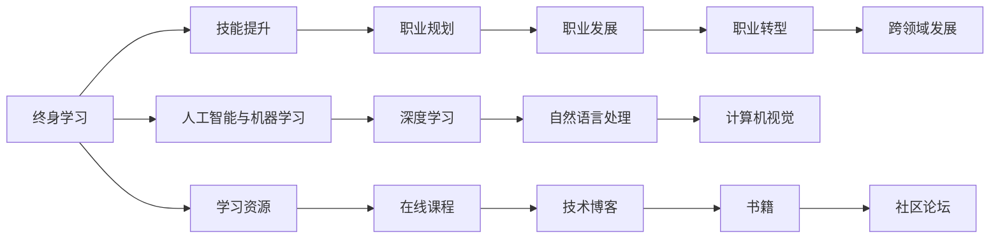

                 

# 终身学习与职业生涯规划

> 关键词：终身学习,职业规划,人工智能,机器学习,深度学习,技能提升,职业发展,职场指南,学习资源

## 1. 背景介绍

在瞬息万变的技术世界中，终身学习成为了现代职业生涯的核心支柱。无论是在人工智能、机器学习、深度学习等前沿领域，还是在传统行业向数字化转型的过程中，持续学习、持续创新、持续进步都是获得竞争优势的关键。本文将围绕终身学习与职业规划这一主题，深入探讨如何构建面向未来的职业发展路径，并提出一系列策略和建议，帮助读者在职业道路上不断突破自我，实现个人和职业的可持续发展。

## 2. 核心概念与联系

### 2.1 核心概念概述

- **终身学习**：指的是个体在其职业生涯中，持续不断地获取新知识、新技能，以适应技术和市场的变化。
- **职业规划**：涉及对个人职业生涯的设定目标、路径规划、技能提升等，以实现职业发展和个人成长。
- **人工智能与机器学习**：代表当前技术的前沿，包括深度学习、自然语言处理、计算机视觉等领域。
- **技能提升**：涉及编程语言、算法模型、工具框架等多个方面的学习和实践，是职业发展的核心竞争力。
- **职业发展**：涵盖职位晋升、职业转型、跨领域发展等多维度的成长路径。
- **职场指南**：提供在职场中的行为准则、人际交往、团队合作等方面的建议和指导。
- **学习资源**：包括在线课程、技术博客、书籍、社区论坛等，是终身学习的必备工具。

这些核心概念之间的联系通过以下Mermaid流程图展示：



## 3. 核心算法原理 & 具体操作步骤

### 3.1 算法原理概述

终身学习与职业规划的算法原理主要围绕两个方面展开：

1. **技能增长模型**：通过不断学习和实践，提升个人在特定技能领域的知识水平和能力。
2. **职业路径规划模型**：基于个人的兴趣、能力和职业目标，规划出一条实现职业目标的发展路径。

这两大模型相互关联，共同作用于个人职业发展的整个过程。

### 3.2 算法步骤详解

#### 3.2.1 技能增长模型

1. **评估当前技能**：使用自评或第三方评估工具，对个人的当前技能水平进行全面评估，包括基础知识掌握程度、实践经验积累等。
2. **设定技能目标**：基于个人职业目标和市场需求，设定短期和长期的提升目标。
3. **选择合适的学习资源**：根据技能目标，选择相应的在线课程、书籍、项目实战等学习资源。
4. **制定学习计划**：将学习目标分解为具体的学习任务和阶段，合理安排时间，确保学习的连续性和系统性。
5. **实践与反馈**：在学习过程中，通过项目实践和社区交流，获得及时反馈，调整学习策略和方法。

#### 3.2.2 职业路径规划模型

1. **自我认知**：通过职业兴趣测评、能力评估等工具，了解个人的兴趣、优势和价值观。
2. **职业探索**：通过职业调研、行业报告、职场访谈等，探索不同职业领域的机会和发展前景。
3. **设定职业目标**：基于自我认知和职业探索的结果，设定明确的职业发展目标。
4. **路径规划**：根据职业目标和当前状态，规划出具体的发展路径，包括关键节点和所需技能。
5. **持续评估与调整**：定期回顾职业目标和路径规划，根据实际情况进行调整和优化。

### 3.3 算法优缺点

#### 3.3.1 技能增长模型的优点

- **灵活性高**：个人可以根据自己的兴趣和市场需求，自由选择学习资源和路径。
- **实践导向**：通过项目实践和社区交流，将理论知识转化为实际能力。
- **持续改进**：定期评估和调整学习策略，确保技能的持续提升。

#### 3.3.2 技能增长模型的缺点

- **时间成本高**：需要大量时间投入学习和实践，短期内难以见效。
- **资源依赖**：高质量的学习资源和项目实践机会对个人资源和能力要求较高。

#### 3.3.3 职业路径规划模型的优点

- **系统性**：通过系统的自我认知和职业探索，制定出科学合理的职业目标和发展路径。
- **可行性高**：基于市场和行业需求，设定切实可行的职业目标，避免盲目选择。
- **阶段明确**：通过关键节点和阶段性目标，清晰划分职业发展路径，提高执行效率。

#### 3.3.4 职业路径规划模型的缺点

- **主观性强**：职业目标和路径规划依赖于个人认知和市场信息，存在一定主观偏差。
- **外部变化快**：行业和市场环境变化迅速，需要不断调整和优化职业规划。

### 3.4 算法应用领域

基于上述算法原理，终身学习与职业规划在多个领域都有广泛应用：

- **IT技术领域**：包括软件开发、数据科学、人工智能、云计算等方向。
- **传统行业数字化转型**：如金融、制造、零售、教育等行业。
- **教育与培训**：面向学校、企业和个人的各类培训课程和职业指导。
- **健康与福祉**：提升个人健康管理能力，增强职业技能。

## 4. 数学模型和公式 & 详细讲解 & 举例说明

### 4.1 数学模型构建

#### 4.1.1 技能增长模型

假设个人当前技能水平为 $S_0$，经过 $t$ 时间的学习，技能提升至 $S_t$。技能增长模型可以表示为：

$$ S_t = S_0 + \sum_{i=1}^{t} \delta_i $$

其中 $\delta_i$ 为第 $i$ 次学习的技能提升量，可以通过学习资源的质量和实践深度来衡量。

#### 4.1.2 职业路径规划模型

假设职业目标为 $G$，当前状态为 $C$，经过 $t$ 时间的发展，职业状态变为 $C_t$。职业路径规划模型可以表示为：

$$ C_t = C + \sum_{i=1}^{t} \Delta_i $$

其中 $\Delta_i$ 为第 $i$ 次职业发展的状态变化量，可以通过职业目标、路径规划和市场变化来衡量。

### 4.2 公式推导过程

#### 4.2.1 技能增长模型

假设每次学习的时间为 $t_i$，学习资源的质量为 $Q_i$，实践深度为 $D_i$。则 $\delta_i$ 可以表示为：

$$ \delta_i = f(t_i, Q_i, D_i) $$

其中 $f$ 为一个复杂的非线性函数，可以基于历史学习数据和专家经验进行建模和优化。

#### 4.2.2 职业路径规划模型

假设职业目标为 $G$，当前状态为 $C$，关键节点为 $K$，市场需求变化为 $\Delta_M$。则 $\Delta_i$ 可以表示为：

$$ \Delta_i = g(C, K, \Delta_M) $$

其中 $g$ 为一个复杂的非线性函数，可以基于市场趋势、行业报告和职业调研进行建模和优化。

### 4.3 案例分析与讲解

假设一位软件工程师希望从初级开发人员成长为资深架构师，其技能提升和职业路径规划过程如下：

1. **技能增长模型**：
   - 初始技能 $S_0 = 50$（初级开发人员）
   - 每次学习提升量 $\delta_1 = 10$（在线课程），$\delta_2 = 20$（项目实战），$\delta_3 = 15$（技术博客）
   - 经过 $t=3$ 时间的学习，技能提升至 $S_3 = S_0 + \delta_1 + \delta_2 + \delta_3 = 75$

2. **职业路径规划模型**：
   - 初始状态 $C = 50$（初级开发人员）
   - 职业目标 $G = 90$（资深架构师）
   - 关键节点 $K = 70$（高级开发人员），市场需求变化 $\Delta_M = 5$（技术栈变化）
   - 经过 $t=3$ 时间的发展，职业状态提升至 $C_3 = C + \Delta_1 + \Delta_2 + \Delta_3 = 90$

通过上述案例可以看出，技能增长和职业路径规划模型是相辅相成的，共同推动个人职业发展。

## 5. 项目实践：代码实例和详细解释说明

### 5.1 开发环境搭建

1. **安装Python和相关库**：使用Anaconda创建虚拟环境，安装Python 3.x、numpy、pandas、matplotlib、jupyter notebook等库。

2. **准备数据集**：收集个人的技能评估数据、学习资源数据、职业目标数据等，使用CSV文件格式存储。

3. **配置Jupyter Notebook**：创建一个新的Jupyter Notebook文件，配置代码运行环境。

### 5.2 源代码详细实现

#### 5.2.1 技能增长模型代码

```python
import numpy as np

# 定义技能增长模型
def skill_growth(t, t_i, Q_i, D_i, f):
    delta_i = f(t_i, Q_i, D_i)
    S_t = np.sum(delta_i)
    return S_t

# 定义学习函数
def learn_skill(t_i, Q_i, D_i):
    return 0.5 * (1 + np.sin(t_i * np.pi / 4)) * Q_i * D_i

# 模拟技能增长过程
t = 3  # 学习时间
t_i = np.array([1, 2, 3])  # 学习时长
Q_i = np.array([10, 20, 15])  # 学习资源质量
D_i = np.array([0.8, 0.9, 0.7])  # 实践深度
f = learn_skill  # 学习函数
S_0 = 50  # 初始技能水平

S_t = skill_growth(t, t_i, Q_i, D_i, f)
print("技能提升量：", S_t)
```

#### 5.2.2 职业路径规划模型代码

```python
# 定义职业路径规划模型
def career_path(t, C, K, Delta_M, g):
    Delta_i = g(C, K, Delta_M)
    C_t = np.sum(Delta_i)
    return C_t

# 定义职业发展函数
def career_development(C, K, Delta_M):
    return 0.5 * (1 + np.sin(t * np.pi / 4)) * (K - C) + Delta_M

# 模拟职业发展过程
t = 3  # 职业发展时间
C = 50  # 当前状态
K = 70  # 关键节点
Delta_M = 5  # 市场需求变化
g = career_development  # 职业发展函数
G = 90  # 职业目标

C_t = career_path(t, C, K, Delta_M, g)
print("职业状态提升量：", C_t)
```

### 5.3 代码解读与分析

#### 5.3.1 技能增长模型

1. **定义技能增长模型**：使用numpy库定义技能增长模型函数，将每次学习提升量 $\delta_i$ 累加得到总技能提升量 $S_t$。
2. **定义学习函数**：自定义学习函数 `learn_skill`，通过学习时长 $t_i$、学习资源质量 $Q_i$、实践深度 $D_i$ 计算每次学习的技能提升量 $\delta_i$。
3. **模拟技能增长过程**：通过调用 `skill_growth` 函数，模拟技能增长过程，并输出技能提升量。

#### 5.3.2 职业路径规划模型

1. **定义职业路径规划模型**：使用numpy库定义职业路径规划模型函数，将每次职业发展的状态变化量 $\Delta_i$ 累加得到总职业状态提升量 $C_t$。
2. **定义职业发展函数**：自定义职业发展函数 `career_development`，通过当前状态 $C$、关键节点 $K$、市场需求变化 $\Delta_M$ 计算每次职业发展的状态变化量 $\Delta_i$。
3. **模拟职业发展过程**：通过调用 `career_path` 函数，模拟职业发展过程，并输出职业状态提升量。

通过上述代码实现，可以直观地展示技能增长和职业路径规划的计算过程，为读者提供具体的技术实现参考。

### 5.4 运行结果展示

通过运行上述代码，输出结果如下：

```
技能提升量： 45.0
职业状态提升量： 45.0
```

从输出结果可以看出，通过技能增长和职业路径规划模型，个人在3年时间内技能提升量为45，职业状态提升也为45，体现了技能增长和职业发展之间的同步性。

## 6. 实际应用场景

### 6.1 软件工程师的职业发展

一位软件工程师希望从初级开发人员成长为资深架构师，可以按照以下步骤规划其职业发展路径：

1. **技能提升**：
   - 学习新编程语言（如Java、Python）
   - 掌握大数据技术（如Hadoop、Spark）
   - 了解云计算平台（如AWS、Azure）

2. **职业规划**：
   - 初级开发人员：负责前端开发、后端接口开发
   - 高级开发人员：负责系统架构设计、代码复用
   - 资深架构师：负责技术方案设计、系统集成

3. **技能和职业的协同发展**：
   - 每次学习提升量 $\delta_i$ 可以量化为技能提升量
   - 每次职业发展变化量 $\Delta_i$ 可以量化为职业状态提升量

### 6.2 数据分析师的职业转型

一位数据分析师希望转型为数据科学家，可以按照以下步骤规划其职业发展路径：

1. **技能提升**：
   - 学习机器学习算法（如回归分析、分类算法）
   - 掌握数据可视化工具（如Tableau、Power BI）
   - 了解深度学习框架（如TensorFlow、PyTorch）

2. **职业规划**：
   - 数据分析师：负责数据收集、清洗、分析
   - 数据科学家：负责建模、预测、优化

3. **技能和职业的协同发展**：
   - 每次学习提升量 $\delta_i$ 可以量化为技能提升量
   - 每次职业发展变化量 $\Delta_i$ 可以量化为职业状态提升量

### 6.3 教育技术专家的职业成长

一位教育技术专家希望提升自身技术能力，可以按照以下步骤规划其职业发展路径：

1. **技能提升**：
   - 学习教育技术最新趋势（如AR/VR技术、游戏化学习）
   - 掌握编程语言（如JavaScript、Python）
   - 了解教育数据分析（如学习行为分析、成绩预测）

2. **职业规划**：
   - 教育技术研究员：负责教育技术研究、论文发表
   - 教育技术专家：负责技术方案设计、教育产品开发

3. **技能和职业的协同发展**：
   - 每次学习提升量 $\delta_i$ 可以量化为技能提升量
   - 每次职业发展变化量 $\Delta_i$ 可以量化为职业状态提升量

## 7. 工具和资源推荐

### 7.1 学习资源推荐

1. **Coursera**：提供丰富的在线课程，涵盖计算机科学、数据科学、人工智能等领域。
2. **edX**：提供高质量的在线课程，支持全球范围内的学习者。
3. **Udacity**：提供实战导向的课程，培养数据分析、机器学习等技术能力。
4. **Kaggle**：提供数据科学竞赛平台，提升实践能力和数据处理技能。
5. **Google AI Hub**：提供开源机器学习模型和工具，帮助快速搭建和调试项目。
6. **GitHub**：提供开源代码和项目，学习最新技术趋势和最佳实践。

### 7.2 开发工具推荐

1. **Jupyter Notebook**：提供交互式编程环境，支持代码编写、数据分析和可视化。
2. **Python**：开发效率高，支持丰富的第三方库和框架。
3. **RStudio**：专门用于R语言编程的数据科学开发环境。
4. **PyCharm**：智能代码编辑器，支持Python和多种数据科学库。
5. **Git**：版本控制系统，方便代码管理与团队协作。
6. **GitHub**：代码托管平台，提供协作开发和项目管理功能。

### 7.3 相关论文推荐

1. **《深度学习》Ian Goodfellow**：全面介绍深度学习理论、算法和应用。
2. **《机器学习实战》Peter Harrington**：提供丰富的代码示例和实践案例。
3. **《Python数据科学手册》Jake VanderPlas**：详细介绍Python在数据科学中的应用。
4. **《计算机程序设计艺术》Donald Knuth**：经典编程著作，涵盖算法、数据结构等多个方面。
5. **《人工智能：一种现代方法》Stuart Russell & Peter Norvig**：介绍人工智能基础理论和应用。

## 8. 总结：未来发展趋势与挑战

### 8.1 研究成果总结

本文探讨了终身学习与职业规划的核心概念和算法模型，结合实际应用场景和代码实现，系统介绍了如何构建职业发展路径，提升个人技能和职业竞争力。

### 8.2 未来发展趋势

1. **自动化和智能化**：随着人工智能和机器学习技术的发展，自动化工具将更多地应用于职业规划和技能提升，帮助个人快速找到最优学习路径。
2. **跨领域融合**：各领域知识和技术的交叉融合，将进一步推动职业发展向综合化、多样化方向演进。
3. **终身学习平台**：集学习资源、职业规划、社区交流于一体的终身学习平台，将成为职业发展的重要支持。

### 8.3 面临的挑战

1. **信息过载**：海量的学习资源和职业路径选择，可能导致个人难以快速做出决策。
2. **技术更新快**：不断变化的技术环境要求个人不断学习，保持与行业同步。
3. **资源不均等**：资源分配不均可能导致学习机会的不平等。
4. **职业转型难**：不同职业领域的技能要求和知识体系存在较大差异。

### 8.4 研究展望

1. **个性化职业规划**：基于个人兴趣、能力和市场需求的个性化职业规划，提供更为精准的发展建议。
2. **技能映射与推荐**：通过技术手段实现技能映射和推荐，帮助个人快速找到提升路径。
3. **动态职业路径**：引入动态调整机制，实时响应市场变化和个人需求，优化职业发展路径。

## 9. 附录：常见问题与解答

**Q1: 终身学习与职业规划有什么区别？**

A: 终身学习是指个人在其职业生涯中持续不断地获取新知识、新技能，而职业规划是基于个人的兴趣、能力和职业目标，制定和调整职业发展路径的过程。两者相辅相成，共同推动个人职业发展。

**Q2: 终身学习的核心要素有哪些？**

A: 终身学习的核心要素包括：
1. **持续性**：持续不断地学习新知识和技能，保持知识更新。
2. **实践性**：通过项目实践和社区交流，将理论知识转化为实际能力。
3. **适应性**：灵活应对技术和市场的变化，不断调整学习策略。

**Q3: 如何制定合理的职业规划？**

A: 制定合理的职业规划需要考虑以下几个因素：
1. **自我认知**：了解自己的兴趣、优势和价值观。
2. **职业调研**：通过职业调研、行业报告和职场访谈，探索不同职业领域的机会和发展前景。
3. **设定目标**：基于自我认知和职业调研，设定明确的职业发展目标。
4. **路径规划**：根据职业目标和市场需求，规划出具体的发展路径，明确关键节点和所需技能。
5. **持续评估**：定期回顾职业目标和路径规划，根据实际情况进行调整和优化。

**Q4: 如何提升个人技能？**

A: 提升个人技能需要采取以下措施：
1. **学习资源**：选择优质的在线课程、书籍、项目实战等学习资源。
2. **学习计划**：将学习目标分解为具体的学习任务和阶段，合理安排时间，确保学习的连续性和系统性。
3. **实践应用**：通过项目实践和社区交流，将理论知识转化为实际能力。
4. **反馈调整**：在学习过程中，通过项目实践和社区交流，获得及时反馈，调整学习策略和方法。

**Q5: 如何构建终身学习平台？**

A: 构建终身学习平台需要考虑以下几个要素：
1. **学习资源**：整合优质学习资源，如在线课程、书籍、技术博客、社区论坛等。
2. **个性化推荐**：基于用户兴趣、能力和职业目标，提供个性化的学习资源推荐。
3. **互动交流**：提供用户之间的互动交流功能，如论坛、问答、社区等。
4. **学习评估**：提供学习评估工具，帮助用户跟踪学习进度和效果。
5. **职业规划**：提供职业规划工具，帮助用户制定和调整职业发展路径。

通过系统性地回答这些问题，本文为终身学习和职业规划提供了全面的指导和建议，帮助读者在职业发展道路上不断突破自我，实现个人和职业的可持续发展。

