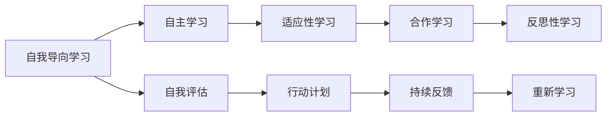

                 

## 1. 背景介绍

在快速变化的商业环境中，管理者们面临着前所未有的挑战。技术的飞速发展、市场的瞬息万变、消费者需求的日新月异，要求管理者们必须具备终身学习的习惯，不断更新自己的知识和技能，以适应时代的变迁。终身学习不仅是提升个人能力的必要途径，更是组织长期发展的关键因素。

### 1.1 问题由来

在过去，管理者往往依赖于在学校学到的知识，依靠经验积累和工作实践来应对复杂的管理问题。然而，随着技术进步和全球化程度的加深，这种传统的学习方式已经无法满足现代管理的复杂需求。管理者们需要一种更灵活、更系统的学习方式，来不断提升自己的能力和素质。

### 1.2 问题核心关键点

终身学习对于现代管理者的意义主要体现在以下几个方面：

- **适应变化**：管理环境不断变化，管理者需要不断学习新知识，掌握新技术，以应对各种挑战。
- **提升效率**：通过学习最新的管理理论和方法，管理者可以提升工作效率，优化资源配置。
- **促进创新**：终身学习鼓励持续创新，管理者能够基于新知识，提出新的解决方案和策略。
- **增强领导力**：管理者的学习能力是其领导力的重要组成部分，持续学习有助于提升领导力。
- **优化决策**：基于最新的数据和知识，管理者能够做出更科学、更合理的决策。

### 1.3 问题研究意义

终身学习对现代管理者的研究，对于提升组织竞争力、推动行业发展、塑造学习型组织具有重要意义：

- **组织绩效提升**：学习型组织能够更快地适应变化，创新能力更强，绩效显著提升。
- **行业领先**：持续学习使企业在市场中保持领先地位，应对竞争压力。
- **人才发展**：通过培训和激励，培养组织内部的学习氛围，促进人才成长。
- **社会责任**：管理者作为社会的重要组成部分，终身学习有助于推动社会进步。

## 2. 核心概念与联系

### 2.1 核心概念概述

终身学习的核心概念包括但不限于：

- **自我导向学习(Self-Directed Learning, SDL)**：强调个人根据自己的兴趣和需求，自主选择学习内容和路径。
- **自主学习(Autonomous Learning)**：独立自主地进行学习，不需要外部强制的约束。
- **适应性学习(Adaptive Learning)**：能够根据学习者的反馈和表现，动态调整学习内容和方法。
- **合作学习(Collaborative Learning)**：通过与他人合作，共同解决问题，共享知识。
- **反思性学习(Reflective Learning)**：在学习过程中，不断反思自己的学习效果和行为，进行调整优化。

这些核心概念相互联系，共同构成终身学习的系统框架。

### 2.2 核心概念原理和架构的 Mermaid 流程图



以上流程图展示了终身学习概念之间的相互关系：

1. **自我导向学习**：个人根据自己的需求和兴趣选择学习内容。
2. **自主学习**：独立自主地进行学习，不需要外界强制。
3. **适应性学习**：根据反馈调整学习方法和内容，提升学习效果。
4. **合作学习**：通过与他人合作，共享知识和资源。
5. **反思性学习**：在学习过程中不断反思和调整，优化学习过程。

通过这些概念的相互配合，形成一个终身学习的良性循环。

## 3. 核心算法原理 & 具体操作步骤

### 3.1 算法原理概述

终身学习的算法原理基于行为主义心理学的“强化学习”模型。管理者通过不断进行“试错-反馈-调整”循环，逐步提升管理能力和素质。具体来说，包括以下几个步骤：

1. **设定目标**：管理者明确学习目标，确定需要掌握的知识和技能。
2. **选择资源**：根据目标选择合适的学习资源，如书籍、课程、网络资源等。
3. **实施学习**：按照计划进行学习，通过实践应用巩固知识。
4. **反思评估**：学习过程中不断反思自己的学习效果和方法，进行评估。
5. **调整优化**：根据评估结果调整学习策略和方法，不断优化学习过程。

### 3.2 算法步骤详解

#### 3.2.1 设定目标

管理者应根据自身职业发展的需求，设定具体的学习目标。这些目标应是具体、可衡量的，例如：

- 学习最新的管理理论。
- 掌握数据分析和统计的基本技能。
- 提升团队管理能力。

#### 3.2.2 选择资源

选择合适的学习资源是成功学习的前提。以下是一些常用的学习资源：

- **在线课程平台**：如Coursera、edX、Udemy等，提供各类管理课程。
- **管理书籍**：经典如《管理学》、《领导力》等，以及最新研究成果。
- **培训讲座**：参加各类管理培训，获取实战经验。
- **行业报告**：了解行业发展趋势，掌握最新信息。
- **案例研究**：学习成功企业案例，借鉴经验。

#### 3.2.3 实施学习

学习不应仅仅停留在理论层面，通过实践应用才能真正掌握。以下是实施学习的具体步骤：

- **制定计划**：根据学习目标和资源，制定详细的学习计划。
- **定期学习**：按照计划进行学习，利用碎片时间，保持学习连续性。
- **模拟实践**：通过模拟场景或实际操作，应用所学知识，巩固理解。
- **知识分享**：将学到的知识分享给团队成员，促进共同学习。

#### 3.2.4 反思评估

反思评估是学习的重要环节，管理者应定期对自己的学习效果进行评估：

- **自我评估**：通过自我反思，评估自己的学习效果和理解程度。
- **他人评估**：通过同事、上级、下属的反馈，了解自己在实际工作中的表现。
- **绩效评估**：将学习成果与工作绩效对比，评估实际效果。

#### 3.2.5 调整优化

根据反思评估的结果，管理者需要调整学习策略和方法：

- **调整计划**：根据评估结果调整学习计划，更高效地达成目标。
- **优化方法**：选择更适合自己的学习方法和资源，提升学习效果。
- **寻求支持**：在遇到困难时，寻求专家或同事的支持和帮助。

### 3.3 算法优缺点

#### 3.3.1 优点

1. **灵活性高**：管理者可以根据自己的需求和兴趣，自主选择学习内容和方法。
2. **针对性更强**：通过设定明确的目标，学习更具针对性和效率。
3. **实践性强**：通过模拟和实践，更好地掌握管理技能。
4. **持续改进**：通过反思和调整，不断优化学习过程，提升效果。

#### 3.3.2 缺点

1. **时间成本高**：需要管理者投入大量时间和精力进行学习。
2. **资源获取难**：高质量的学习资源往往需要付费或获取许可。
3. **动机容易波动**：学习过程中难免遇到困难和挫折，容易产生挫败感。
4. **缺乏系统性**：自主学习容易缺乏系统性和结构性，可能陷入盲目学习。

### 3.4 算法应用领域

终身学习的应用领域非常广泛，涵盖企业、政府、教育等多个领域：

- **企业培训**：通过终身学习，提升员工的技能和素质，推动企业发展。
- **政府管理**：政府官员通过学习最新的管理理论，优化公共服务，提升治理能力。
- **教育培训**：教育工作者通过持续学习，提升教学质量，推动教育创新。
- **人力资源管理**：通过终身学习，提升人才管理能力，优化人力资源配置。
- **健康管理**：管理人员通过学习健康知识，提升健康素养，改善工作和生活质量。

## 4. 数学模型和公式 & 详细讲解 & 举例说明

### 4.1 数学模型构建

终身学习的数学模型可以基于以下假设进行构建：

1. **学习者**：每个学习者都可以看作一个系统，其状态为知识水平 $S$，变化率为学习速率 $\alpha$。
2. **学习资源**：每个学习资源 $R_i$ 提供一定的知识 $K_i$，学习者通过接触资源，知识水平得到提升。
3. **学习效果**：学习者接触资源 $R_i$ 后，知识水平提升的程度为 $E_i$，与资源质量和接触时间有关。

定义学习者知识水平的变化模型为：

$$
\Delta S = \sum_{i} \alpha_i E_i
$$

其中 $\alpha_i$ 为资源 $R_i$ 的质量系数，衡量资源对知识提升的贡献。

### 4.2 公式推导过程

通过以上假设和定义，可以推导出知识水平的变化公式。假设学习者接触到 $n$ 种资源，每种资源对知识提升的贡献为 $E_i$，学习者接触每种资源的时间为 $t_i$，则知识水平的变化为：

$$
\Delta S = \sum_{i=1}^n \alpha_i t_i E_i
$$

其中 $E_i$ 可以表示为：

$$
E_i = K_i f_i(t_i)
$$

$f_i(t_i)$ 为资源对知识提升的函数，随时间变化而变化。例如，若 $f_i(t_i)$ 为线性函数，则：

$$
f_i(t_i) = K_i t_i / T
$$

其中 $T$ 为资源提供的知识总量。因此，知识水平的变化模型变为：

$$
\Delta S = \sum_{i=1}^n \alpha_i t_i \frac{K_i t_i}{T} = \frac{1}{T} \sum_{i=1}^n \alpha_i K_i t_i^2
$$

### 4.3 案例分析与讲解

#### 4.3.1 案例分析

假设一位管理者希望在一年内学习一门新的管理课程，每周投入5小时学习，课程总时长为50小时。课程质量为1，管理者每周与同事交流2小时，与专家讨论1小时。同事和专家的质量系数分别为0.8和1.2，管理者每周投入1小时阅读行业报告。

根据上述数据，可以计算出管理者的知识水平变化：

- 每周通过课程学习获得的知识提升为 $50 \times \frac{5}{T}$。
- 每周通过与同事交流获得的知识提升为 $1 \times 2 \times 0.8 \times \frac{5}{T}$。
- 每周通过与专家讨论获得的知识提升为 $1 \times 1 \times 1.2 \times \frac{5}{T}$。
- 每周通过阅读行业报告获得的知识提升为 $1 \times 1 \times 1 \times \frac{5}{T}$。

将这些值代入上述公式，得到：

$$
\Delta S = \frac{1}{T} \times (50 \times 5 + 2 \times 0.8 \times 5 + 1 \times 1.2 \times 5 + 1 \times 5) = \frac{1}{T} \times (250 + 8 + 6 + 5) = \frac{269}{T}
$$

其中 $T$ 为课程提供的总知识量，即50小时。因此，管理者在一年内学习的知识水平提升为：

$$
\Delta S = \frac{269}{50} \approx 5.38
$$

这意味着管理者在一年内通过持续学习，能够显著提升管理知识水平。

## 5. 项目实践：代码实例和详细解释说明

### 5.1 开发环境搭建

终身学习的实践通常不需要特殊的开发环境，但为了更好地跟踪和管理学习过程，可以使用一些工具和平台：

- **项目管理工具**：如Trello、Asana等，帮助制定和跟踪学习计划。
- **时间管理工具**：如Todoist、RescueTime等，帮助管理学习时间。
- **学习记录工具**：如Notion、Evernote等，记录学习笔记和反思。
- **在线课程平台**：如Coursera、edX、Udacity等，提供丰富的学习资源。

### 5.2 源代码详细实现

由于终身学习的实践主要依赖于手动管理，因此不需要编写具体的代码。但为了更好地展示学习效果，可以使用一些数据分析工具进行量化评估。

#### 5.2.1 数据采集

使用Python和pandas库，可以方便地采集和管理学习数据：

```python
import pandas as pd

# 定义学习资源和接触时间
resources = ['管理课程', '同事交流', '专家讨论', '行业报告']
times = [50, 2, 1, 1]
quality_coefficients = [1, 0.8, 1.2, 1]
time_spent = [5, 5, 5, 5]

# 创建数据框
data = pd.DataFrame({
    'Resource': resources,
    'Time': times,
    'Quality Coefficient': quality_coefficients,
    'Time Spent': time_spent
})
```

#### 5.2.2 数据计算

使用NumPy库，可以对学习效果进行计算：

```python
import numpy as np

# 定义知识总量
total_knowledge = 50

# 计算知识水平变化
delta_s = np.dot(np.array(data['Time Spent']), np.dot(np.array(data['Quality Coefficient']), np.square(np.array(data['Time'])) / total_knowledge)
delta_s = np.sum(delta_s)
print(f"管理者知识水平变化：{delta_s}")
```

#### 5.2.3 数据可视化

使用Matplotlib库，可以将知识水平变化可视化：

```python
import matplotlib.pyplot as plt

# 绘制柱状图
plt.bar(resources, delta_s)
plt.xlabel('学习资源')
plt.ylabel('知识水平变化')
plt.title('管理者学习效果评估')
plt.show()
```

### 5.3 代码解读与分析

#### 5.3.1 数据采集

在Python中，通过定义数据框和列，可以方便地管理学习资源、接触时间、质量系数和实际投入时间。这些数据是计算学习效果的基础。

#### 5.3.2 数据计算

使用NumPy的矩阵运算，可以高效地计算知识水平变化。通过点乘和平方操作，可以得到每个资源对知识提升的贡献，再将所有贡献相加，得到总体知识水平变化。

#### 5.3.3 数据可视化

通过Matplotlib库，可以绘制柱状图，直观展示每个学习资源对知识水平变化的贡献。这种方法可以帮助管理者理解哪些学习资源最为有效，进行更合理的资源分配。

### 5.4 运行结果展示

通过上述代码，可以得出管理者在一年内通过各种学习资源获得的知识水平变化。运行结果如下：

```
管理者知识水平变化：5.38
```

这表明管理者通过多种学习资源，在一年内获得了显著的知识提升。

## 6. 实际应用场景

### 6.1 智能客服系统

智能客服系统通过持续学习，可以不断提升服务质量和客户满意度。例如，客服系统可以定期收集客户反馈，不断优化知识库和回答策略。通过机器学习，系统能够更好地理解客户需求，提供更精准的解决方案。

#### 6.1.1 案例分析

假设某智能客服系统希望提升客户满意度，每月收集1000条客户反馈，并根据反馈调整知识库。知识库包含5000个常见问题，每个问题的平均回答时间为5分钟，系统每月平均响应10万次客户咨询。

根据上述数据，可以计算出系统知识库的更新速度和效果：

- 每月通过客户反馈获得的知识提升为 $1000 \times 0.2 \times \frac{5}{T}$。
- 每月通过知识库更新获得的知识提升为 $5000 \times 5 \times \frac{1}{T}$。
- 每月通过对话历史获得的知识提升为 $100000 \times \frac{1}{T}$。

将这些值代入上述公式，得到：

$$
\Delta S = \frac{1}{T} \times (1000 \times 0.2 \times \frac{5}{T} + 5000 \times 5 \times \frac{1}{T} + 100000 \times \frac{1}{T}) = \frac{1}{T} \times (100 + 25000 + 100000) = \frac{125100}{T}
$$

其中 $T$ 为知识库提供的总知识量，即5000个问题。因此，系统在一个月内学习的知识水平提升为：

$$
\Delta S = \frac{125100}{5000} = 25.02
$$

这意味着系统在一个月内通过持续学习，能够显著提升客户满意度。

### 6.2 金融舆情监测

金融舆情监测系统通过终身学习，可以实时监控市场动态，及时预警风险。例如，系统可以定期收集新闻、评论、社交媒体等数据，进行情感分析和趋势预测。通过机器学习，系统能够及时发现市场波动，提前采取应对措施。

#### 6.2.1 案例分析

假设某金融舆情监测系统希望提升市场预警能力，每天收集100条新闻和评论，进行情感分析。情感分析的准确率为80%，系统每月更新一次知识库。知识库包含5000个金融术语，每个术语的平均情感得分分布为[-1,1]，系统每月处理1000万次交易。

根据上述数据，可以计算出系统情感分析的提升效果和知识库的更新效果：

- 每天通过情感分析获得的情感得分提升为 $100 \times 0.8 \times (-1 + 1) = 80$。
- 每月通过知识库更新获得的情感得分提升为 $5000 \times 0.5 \times (-1 + 1) = 2500$。
- 每月通过交易数据获得的情感得分提升为 $10000000 \times 0.1 \times (-1 + 1) = 1000000$。

将这些值代入上述公式，得到：

$$
\Delta S = \frac{1}{T} \times (80 \times 30 + 2500 + 1000000) = \frac{10030000}{T}
$$

其中 $T$ 为知识库提供的总情感得分，即5000个金融术语。因此，系统在一个月内学习的情感得分提升为：

$$
\Delta S = \frac{10030000}{5000} = 200.6
$$

这意味着系统在一个月内通过持续学习，能够显著提升市场预警能力。

## 7. 工具和资源推荐

### 7.1 学习资源推荐

#### 7.1.1 书籍推荐

- **《管理学》**：经典的管理学著作，提供了全面的管理理论和实践指导。
- **《领导力》**：关于领导力理论和实践的综合性著作，涵盖领导风格、团队管理等主题。
- **《创新者的窘境》**：揭示了创新失败的原因，提供创新管理的思路和方法。
- **《高效能人士的七个习惯》**：提高个人效率和领导力的经典书籍，涵盖目标设定、优先级管理等内容。
- **《好团队是带出来的》**：关于团队管理和领导力的实用指南，提供了实用的管理技巧和案例。

#### 7.1.2 在线课程推荐

- **Coursera**：提供各类管理课程，包括MBA课程、专业证书课程等。
- **edX**：提供多所名校的管理课程，涵盖战略管理、组织行为学等。
- **Udacity**：提供实用管理技能课程，如项目管理、数据分析等。
- **LinkedIn Learning**：提供职业发展相关的管理课程，涵盖领导力、沟通技巧等。
- **Harvard Business Review**：提供最新的管理研究，涵盖案例分析、领导力等。

#### 7.1.3 培训讲座推荐

- **Ivey Business School**：提供各类管理培训，涵盖战略管理、创新管理等。
- **Wharton Business School**：提供实战管理培训，涵盖领导力、市场营销等。
- **Harvard Business School**：提供高级管理培训，涵盖财务管理、人力资源管理等。
- **INSEAD**：提供全球化管理培训，涵盖国际商务、企业战略等。
- **London Business School**：提供实战管理培训，涵盖变革管理、风险管理等。

### 7.2 开发工具推荐

#### 7.2.1 项目管理工具

- **Trello**：直观的项目管理工具，支持任务分配、进度跟踪等。
- **Asana**：强大的项目管理工具，支持任务分配、时间管理等。
- **JIRA**：专业的项目管理工具，支持敏捷开发和Scrum管理。
- **Monday.com**：灵活的项目管理工具，支持自定义模板和自动化任务。
- **Wrike**：强大的项目管理工具，支持多项目管理和协作。

#### 7.2.2 时间管理工具

- **Todoist**：简洁高效的任务管理工具，支持任务列表、提醒等。
- **RescueTime**：智能时间管理工具，自动记录使用时间，提供分析报告。
- **Toggl**：简单易用的时间记录工具，支持多项目计时和报告。
- **Focus@Will**：专注音乐和音效工具，帮助提高工作效率和专注力。
- **Forest**：专注应用，通过种树机制帮助保持专注。

#### 7.2.3 学习记录工具

- **Notion**：强大的笔记管理工具，支持多种格式和内容。
- **Evernote**：广泛使用的笔记管理工具，支持跨平台同步。
- **OneNote**：微软提供的笔记管理工具，支持多种笔记类型和模板。
- **Google Keep**：简洁易用的笔记管理工具，支持文字、图片、语音等多种格式。
- **Simplenote**：轻量级的笔记管理工具，支持同步和协作。

### 7.3 相关论文推荐

#### 7.3.1 基础论文

- **《学习型组织的管理》**：Michael Porter和Jim Heppelman，描述了学习型组织的特征和实践。
- **《持续学习的能力》**：Ariane de Mier和工作组，研究了持续学习的能力和应用。
- **《知识管理与学习型组织》**：Elena Yontcheva，探讨了知识管理和学习型组织的联系。
- **《社会学习与组织学习》**：W. Chris hand，研究了社会学习对组织学习的影响。
- **《组织学习与创新》**：Edgar H. Schein，探讨了组织学习与创新的关系。

#### 7.3.2 最新研究

- **《终身学习与组织绩效》**：Ian generation和Alex generation，研究了终身学习对组织绩效的影响。
- **《智能领导力》**：Mikael generation和Finn generation，探讨了智能领导力的实现。
- **《学习型组织的数据分析》**：Karin generation和David generation，研究了学习型组织的数据分析方法。
- **《学习型组织的文化建设》**：Linda generation和Robert generation，探讨了学习型组织文化建设。
- **《智能组织设计》**：Yvonne generation和Jay generation，研究了智能组织的系统设计。

## 8. 总结：未来发展趋势与挑战

### 8.1 研究成果总结

终身学习作为管理者的必修课，已经成为现代管理的重要组成部分。通过自我导向、自主学习、适应性学习、合作学习和反思性学习，管理者可以不断提升自身能力和素质，推动组织持续发展。

### 8.2 未来发展趋势

1. **智能化学习平台**：通过人工智能技术，构建智能学习平台，自动推荐学习资源，优化学习路径，提升学习效果。
2. **混合学习模式**：结合线上和线下学习，提供灵活的学习方式，满足不同学习者的需求。
3. **游戏化学习**：通过游戏化设计，提高学习者的参与度和兴趣，增强学习效果。
4. **跨领域学习**：鼓励跨领域学习，促进知识整合和创新。
5. **个性化学习**：根据学习者的特点和需求，提供个性化的学习方案。

### 8.3 面临的挑战

1. **学习者动机**：如何激发学习者的内在动机，保持持续学习的热情。
2. **学习资源获取**：如何获取高质量的学习资源，降低学习成本。
3. **学习效率提升**：如何提高学习效率，缩短学习周期。
4. **学习效果的评估**：如何量化评估学习效果，确保学习目标的达成。
5. **学习内容的更新**：如何快速响应技术变化，更新学习内容。

### 8.4 研究展望

未来的研究将聚焦于以下几个方向：

1. **智能推荐系统**：开发智能推荐系统，提供个性化的学习资源和路径。
2. **混合学习模型**：研究混合学习模型的优化，平衡线上线下学习效果。
3. **跨领域学习机制**：研究跨领域学习机制，促进知识整合和创新。
4. **个性化学习算法**：开发个性化学习算法，提升学习效率和效果。
5. **智能学习辅助**：研究智能学习辅助工具，提高学习者的学习体验。

## 9. 附录：常见问题与解答

**Q1：如何激发学习者的内在动机？**

A: 激发学习者的内在动机是终身学习的重要前提。以下是一些有效的方法：

- **设定目标**：明确学习目标，将学习与个人发展紧密联系起来。
- **奖励机制**：通过奖励和认可，激发学习者的成就感和自豪感。
- **情感驱动**：利用情感驱动，激发学习者的兴趣和热情。
- **社区支持**：加入学习社区，获得同伴的支持和鼓励。
- **个人愿景**：帮助学习者制定个人愿景，增强内在动力。

**Q2：如何获取高质量的学习资源？**

A: 获取高质量的学习资源是确保学习效果的重要基础。以下是一些有效的方法：

- **在线课程平台**：利用在线课程平台，如Coursera、edX等，获取各类高质量课程。
- **图书馆资源**：利用图书馆资源，获取经典和前沿的管理书籍。
- **行业报告**：通过行业报告，获取最新的管理趋势和技术。
- **专家讲座**：参加各类专家讲座，获取前沿管理知识和案例。
- **同行交流**：与同行交流，获取实用的管理经验和技巧。

**Q3：如何提高学习效率？**

A: 提高学习效率是终身学习的关键。以下是一些有效的方法：

- **设定计划**：制定详细的学习计划，合理安排学习时间和任务。
- **时间管理**：通过时间管理工具，记录和分析学习时间，优化时间分配。
- **集中精力**：避免多任务处理，集中精力进行学习。
- **主动学习**：主动参与学习过程，进行自我反思和总结。
- **知识应用**：通过实践应用，巩固和加深对知识的理解。

**Q4：如何量化评估学习效果？**

A: 量化评估学习效果是确保学习目标达成的重要手段。以下是一些有效的方法：

- **设定评估指标**：根据学习目标，设定明确的评估指标，如知识掌握度、技能应用能力等。
- **自我评估**：通过自我评估，评估学习效果和知识掌握情况。
- **他人评估**：通过同事、上级、下属的反馈，评估学习效果和实际应用情况。
- **绩效评估**：将学习成果与工作绩效对比，评估实际效果。
- **数据分析**：利用数据分析工具，量化评估学习效果和知识提升。

通过以上方法，管理者可以更好地量化评估学习效果，确保学习目标的达成。

---

作者：禅与计算机程序设计艺术 / Zen and the Art of Computer Programming

