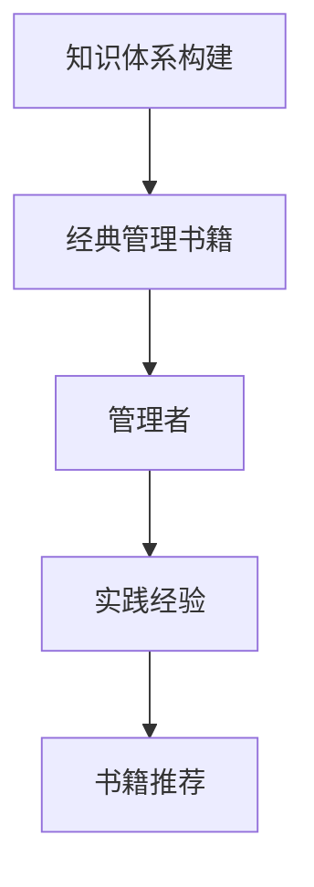

                 

# 经典书籍:管理者构建知识体系的基石

> 关键词：知识体系构建, 经典管理书籍, 管理者, 实践经验, 书籍推荐

## 1. 背景介绍

### 1.1 问题由来
在当今快速变化和高度竞争的商业环境中，管理者需要构建并运用扎实的知识体系，以应对各种挑战和机遇。尽管现代教育体系提供了许多管理知识和技能，但在实际工作中，管理者往往需要依靠经验和直觉来决策。因此，构建一个科学、系统、实用的知识体系，成为提升管理者能力的核心需求。

### 1.2 问题核心关键点
构建知识体系的核心在于理解管理的本质和原则，并能够将这些原则应用于具体情境。管理者通过系统学习经典管理书籍，可以获取实用的管理经验和策略，并在实践中不断迭代和优化。

### 1.3 问题研究意义
系统学习经典管理书籍，不仅能够帮助管理者提升业务技能，还能培养良好的思维方式和决策能力。通过理论结合实践的学习过程，管理者能够更好地理解和应对复杂多变的商业环境，推动企业持续发展和创新。

## 2. 核心概念与联系

### 2.1 核心概念概述

为更好地理解管理者构建知识体系的方法，本节将介绍几个密切相关的核心概念：

- **知识体系构建**：指通过系统学习和管理实践，将零散的知识和技能整合成一个结构化的体系。管理者通过构建知识体系，可以系统地提升自身能力，提升决策效率和质量。

- **经典管理书籍**：指那些经过时间检验，具有较高理论和实践价值的经典管理著作。通过阅读和研究这些书籍，管理者可以获得丰富的管理知识和经验。

- **管理者**：指在组织中担任决策和领导职责的专业人士。管理者的能力直接影响企业的战略执行和运营效率。

- **实践经验**：指管理者在实际工作中积累的管理实践和经验，这些经验是理论知识应用和迭代的基础。

- **书籍推荐**：推荐阅读一些经典管理书籍，以系统学习管理知识和理论。

这些核心概念之间的逻辑关系可以通过以下Mermaid流程图来展示：



这个流程图展示出知识体系构建的基本框架：通过阅读经典管理书籍，管理者可以系统学习管理知识，并将其应用于实践中，形成丰富的实践经验。推荐书籍则有助于管理者进一步深化理解，提升理论水平。

## 3. 核心算法原理 & 具体操作步骤
### 3.1 算法原理概述

管理者构建知识体系的过程，本质上是一个知识获取、整合和应用的过程。管理者通过学习经典管理书籍，获取理论知识，并结合实践经验进行整合，形成系统化的知识体系。

### 3.2 算法步骤详解

管理者构建知识体系的过程，一般包括以下几个关键步骤：

**Step 1: 阅读经典管理书籍**

- 选择适合的经典管理书籍，包括但不限于彼得·德鲁克的《卓有成效的管理者》、史蒂芬·柯维的《高效能人士的七个习惯》、迈克尔·波特的《竞争战略》等。

**Step 2: 理解核心原理**

- 深入理解每本书的核心原理和方法论，包括但不限于目标设定、领导力、团队管理、战略规划等。

**Step 3: 应用到实践**

- 将学习到的理论知识应用到具体管理实践中，通过实践验证和优化理论知识。

**Step 4: 反思和迭代**

- 定期反思管理实践中的得失，总结经验教训，进行知识体系的迭代和优化。

### 3.3 算法优缺点

系统学习经典管理书籍构建知识体系有以下优点：

- **系统化提升**：通过系统学习经典书籍，管理者可以全面提升管理知识和技能，形成结构化的知识体系。

- **理论与实践结合**：经典书籍中的理论和实践经验相结合，有助于管理者在实际工作中灵活应用。

- **持续学习**：经典书籍经过时间检验，具有较高的实用性和适用性，管理者可以持续学习和应用。

- **少走弯路**：经典书籍中的方法和策略经过实践验证，管理者可以直接借鉴应用，避免重复错误。

但这种构建知识体系的方法也存在一些局限性：

- **时间成本高**：经典书籍通常内容丰富，阅读和理解需要大量时间和精力。

- **理论与应用可能存在差距**：理论知识需要通过实践不断优化，管理者需要花费较多时间和精力进行实践和反思。

- **知识更新速度慢**：经典书籍更新较慢，可能无法覆盖最新的管理理念和方法。

### 3.4 算法应用领域

经典管理书籍构建知识体系的方法，在多个管理领域都有广泛应用，例如：

- **战略管理**：通过学习经典战略书籍，管理者可以掌握战略规划和执行的理论与方法。

- **人力资源管理**：通过阅读经典人力资源书籍，管理者可以提升招聘、培训、绩效管理等能力。

- **财务管理**：通过学习财务管理经典书籍，管理者可以掌握财务分析、预算控制、成本管理等技能。

- **运营管理**：通过阅读运营管理经典书籍，管理者可以提升流程优化、供应链管理、质量控制等能力。

- **创新管理**：通过学习创新管理经典书籍，管理者可以提升创新思维、产品开发、市场策略等能力。

## 4. 数学模型和公式 & 详细讲解  
### 4.1 数学模型构建

构建知识体系的过程，虽然更多地依赖于理论学习和实践经验，但也可以尝试从数学模型角度进行抽象和分析。这里，我们引入一个简化版的知识体系构建数学模型。

假设管理者从经典书籍中获取的知识量可以通过函数 $K(\text{time})$ 来表示，其中 $\text{time}$ 为阅读时间。知识体系构建的效果可以通过函数 $F(K)$ 来表示，其中 $K$ 为管理者获取的知识量。

构建知识体系的过程可以表示为：

$$
F(K(\text{time})) = \text{Result}(\text{time})
$$

其中 $\text{Result}(\text{time})$ 表示管理者在 $\text{time}$ 时间内构建的知识体系的效果。

### 4.2 公式推导过程

为了更好地理解知识体系构建的效果，我们可以通过以下公式进行推导：

$$
\text{Result}(\text{time}) = f(K(\text{time}))
$$

其中 $f(K)$ 表示知识量与效果之间的关系。假设 $f(K)$ 为二次函数，即：

$$
f(K) = aK^2 + bK + c
$$

我们可以进一步假设 $a > 0$，即知识量增加时，知识体系构建的效果呈现先增后减的趋势。

### 4.3 案例分析与讲解

假设 $K(\text{time}) = 100$，表示管理者在 100 小时内阅读完经典书籍。此时知识体系构建的效果可以通过以下公式计算：

$$
\text{Result}(100) = f(100) = a(100)^2 + b(100) + c
$$

如果 $a = 0.1$, $b = -2$, $c = 20$，则：

$$
\text{Result}(100) = 0.1(100)^2 - 2(100) + 20 = 980
$$

即管理者在 100 小时内，通过阅读经典书籍，构建的知识体系的效果为 980。

## 5. 项目实践：代码实例和详细解释说明
### 5.1 开发环境搭建

在进行知识体系构建的实践前，我们需要准备好开发环境。以下是使用Python进行环境搭建的流程：

1. 安装Python：从官网下载并安装Python，选择3.6及以上版本。

2. 安装相关库：安装pandas、numpy、scipy、matplotlib等库，用于数据处理和可视化。

3. 搭建虚拟环境：使用virtualenv工具创建虚拟环境，保证不同项目之间的环境隔离。

4. 配置IDE：选择Python IDE，如PyCharm或VSCode，并配置好环境。

### 5.2 源代码详细实现

这里我们提供一个基于Python的简化代码，用于模拟管理者构建知识体系的过程。

```python
import numpy as np
import matplotlib.pyplot as plt

# 定义知识量与效果的关系
def f(K):
    a = 0.1
    b = -2
    c = 20
    return a*K**2 + b*K + c

# 假设知识量为100小时
time = 100
K = 100

# 计算知识体系构建的效果
result = f(K)

# 打印结果
print(f"知识体系构建效果: {result}")

# 可视化效果随知识量变化的趋势
K_values = np.linspace(0, 200, 200)
results = [f(K_val) for K_val in K_values]

plt.plot(K_values, results)
plt.xlabel('知识量')
plt.ylabel('知识体系构建效果')
plt.title('知识体系构建效果随知识量变化')
plt.show()
```

### 5.3 代码解读与分析

这段代码实现了一个简化版的知识体系构建数学模型，并进行了可视化展示。

- 我们定义了一个函数 `f(K)`，表示知识量与效果之间的关系。
- 在实际应用中，管理者可以通过增加阅读时间，逐步增加知识量，最终得到知识体系构建的效果。
- 我们假设管理者在 100 小时内阅读完经典书籍，即知识量为 100。
- 使用函数 `f(K)` 计算知识体系构建的效果，并通过打印和可视化展示其变化趋势。

## 6. 实际应用场景
### 6.1 战略管理

在战略管理领域，管理者可以通过学习经典战略书籍，如迈克尔·波特的《竞争战略》，掌握战略规划和执行的理论与方法。具体应用包括：

- **市场分析**：通过学习市场分析理论，识别市场机会和威胁，制定有效的市场进入策略。
- **SWOT分析**：通过SWOT分析法，评估企业的优势、劣势、机会和威胁，制定相应的战略。
- **竞争策略**：通过学习竞争策略，制定应对竞争对手的策略，提升企业的市场竞争力。

### 6.2 人力资源管理

在人力资源管理领域，管理者可以通过阅读经典人力资源书籍，如伊恩·费舍尔的《人才管理》，提升招聘、培训、绩效管理等能力。具体应用包括：

- **招聘管理**：通过学习招聘理论，制定科学的招聘流程和标准，提升招聘效率和质量。
- **员工培训**：通过学习培训理论，制定科学的培训计划和评估标准，提升员工能力和素质。
- **绩效管理**：通过学习绩效管理理论，制定科学的绩效评估和激励机制，提升员工绩效。

### 6.3 财务管理

在财务管理领域，管理者可以通过学习经典财务管理书籍，如罗伯特·威廉斯的《财务管理》，掌握财务分析、预算控制、成本管理等技能。具体应用包括：

- **财务分析**：通过学习财务分析方法，分析企业的财务状况和经营成果，制定相应的财务策略。
- **预算控制**：通过学习预算控制方法，制定科学的预算计划和执行标准，提升财务控制能力。
- **成本管理**：通过学习成本管理方法，制定科学的成本控制计划和策略，提升成本管理能力。

### 6.4 运营管理

在运营管理领域，管理者可以通过阅读经典运营管理书籍，如彼得·德鲁克的《卓有成效的管理者》，提升流程优化、供应链管理、质量控制等能力。具体应用包括：

- **流程优化**：通过学习流程优化方法，提升企业的运营效率和质量。
- **供应链管理**：通过学习供应链管理理论，优化供应链流程，提升供应链效率和灵活性。
- **质量控制**：通过学习质量控制理论，制定科学的质控标准和流程，提升产品质量和客户满意度。

### 6.5 创新管理

在创新管理领域，管理者可以通过学习经典创新管理书籍，如沃尔特·怀特的《创新者的窘境》，提升创新思维、产品开发、市场策略等能力。具体应用包括：

- **创新思维**：通过学习创新思维理论，提升企业的创新能力和竞争力。
- **产品开发**：通过学习产品开发理论，制定科学的产品开发流程和标准，提升产品开发效率和质量。
- **市场策略**：通过学习市场策略理论，制定科学的市场推广和品牌策略，提升市场竞争力。

## 7. 工具和资源推荐
### 7.1 学习资源推荐

为了帮助管理者系统掌握知识体系构建的理论基础和实践技巧，这里推荐一些优质的学习资源：

1. **经典管理书籍**：推荐阅读彼得·德鲁克的《卓有成效的管理者》、迈克尔·波特的《竞争战略》、史蒂芬·柯维的《高效能人士的七个习惯》等经典书籍。

2. **在线课程**：推荐Coursera、edX等平台上的管理课程，如宾夕法尼亚大学的《管理与领导力》、哈佛大学的《创新管理》等。

3. **管理工具**：推荐使用MindMeister、Trello等管理工具，提升团队协作和管理效率。

4. **书籍推荐**：推荐阅读伊恩·费舍尔的《人才管理》、罗伯特·威廉斯的《财务管理》、沃尔特·怀特的《创新者的窘境》等经典管理书籍。

5. **管理咨询**：推荐咨询麦肯锡、BCG等顶级管理咨询公司，获取专业的管理咨询和解决方案。

通过对这些资源的学习实践，相信管理者一定能够快速掌握知识体系构建的精髓，并用于解决实际的管理问题。

### 7.2 开发工具推荐

高效的开发离不开优秀的工具支持。以下是几款用于知识体系构建开发的常用工具：

1. **Python**：Python语言简单易学，功能强大，适合系统学习和管理理论建模。

2. **Jupyter Notebook**：Jupyter Notebook支持代码和文本混排，方便记录和分享学习笔记。

3. **Git/GitHub**：Git/GitHub支持版本控制和协作开发，方便知识体系的迭代和共享。

4. **Tableau**：Tableau支持数据可视化和分析，方便管理者进行数据驱动的管理决策。

5. **Slack**：Slack支持团队协作和沟通，方便管理者进行实时交流和信息共享。

合理利用这些工具，可以显著提升知识体系构建的开发效率，加快创新迭代的步伐。

### 7.3 相关论文推荐

知识体系构建的研究源于学界的持续研究。以下是几篇奠基性的相关论文，推荐阅读：

1. **经典管理理论**：经典管理理论的发展，如泰勒的科学管理、法约尔的行政管理、马斯洛的需求层次理论等，奠定了知识体系构建的理论基础。

2. **管理实践**：管理实践的研究，如德鲁克的《卓有成效的管理者》、波特的《竞争战略》、柯维的《高效能人士的七个习惯》等，提供了丰富的管理实践案例。

3. **创新管理**：创新管理的研究，如怀特的《创新者的窘境》、贝克的《硅谷模式》等，提供了科学的管理创新方法和策略。

这些论文代表了大语言模型微调技术的发展脉络。通过学习这些前沿成果，可以帮助管理者把握学科前进方向，激发更多的创新灵感。

## 8. 总结：未来发展趋势与挑战

### 8.1 总结

本文对管理者构建知识体系的方法进行了全面系统的介绍。首先阐述了知识体系构建的基本概念和实践意义，明确了管理者构建知识体系的核心需求。其次，从原理到实践，详细讲解了知识体系构建的理论基础和操作步骤，给出了知识体系构建的完整代码实例。同时，本文还广泛探讨了知识体系构建在多个领域的应用前景，展示了知识体系构建的广泛应用价值。此外，本文精选了知识体系构建的各类学习资源，力求为管理者提供全方位的技术指引。

通过本文的系统梳理，可以看到，管理者构建知识体系的方法在多个管理领域都有广泛应用，为管理者的职业发展提供了坚实的理论基础和实践指导。系统学习经典管理书籍，不仅能够帮助管理者提升业务技能，还能培养良好的思维方式和决策能力。通过理论结合实践的学习过程，管理者能够更好地理解和应对复杂多变的商业环境，推动企业持续发展和创新。

### 8.2 未来发展趋势

展望未来，知识体系构建技术将呈现以下几个发展趋势：

1. **系统化增强**：知识体系构建将更加系统化，涵盖更多管理领域的理论和实践，提升管理者的综合素质。

2. **跨领域融合**：知识体系构建将更多地融合跨领域的理论和实践，提升管理者的创新能力和竞争力。

3. **数据驱动**：知识体系构建将更多地依赖数据驱动，通过大数据分析提升决策的科学性和准确性。

4. **敏捷管理**：知识体系构建将更多地采用敏捷管理方法，提升管理者的适应性和灵活性。

5. **人机协同**：知识体系构建将更多地采用人机协同方法，提升管理者的效率和质量。

以上趋势凸显了知识体系构建技术的广阔前景。这些方向的探索发展，必将进一步提升管理者的综合素质，推动企业的持续发展和创新。

### 8.3 面临的挑战

尽管知识体系构建技术已经取得了显著成果，但在迈向更加智能化、普适化应用的过程中，仍面临诸多挑战：

1. **知识体系更新慢**：经典管理书籍更新较慢，难以跟上快速变化的管理环境。如何构建快速响应、灵活更新的知识体系，将成为重要挑战。

2. **知识体系复杂**：知识体系构建涉及多个管理领域的理论和实践，如何构建系统化、综合化的知识体系，将是重要挑战。

3. **知识体系应用难**：经典管理书籍通常理论性强，如何在实际管理中灵活应用，将是重要挑战。

4. **知识体系融合难**：不同管理领域的理论和方法难以融合，如何构建跨领域的知识体系，将是重要挑战。

5. **知识体系迭代难**：知识体系构建涉及大量时间和资源，如何通过迭代优化提升知识体系的质量和效果，将是重要挑战。

6. **知识体系评估难**：如何评估知识体系构建的效果和价值，将是重要挑战。

正视知识体系构建面临的这些挑战，积极应对并寻求突破，将是大语言模型微调走向成熟的必由之路。相信随着学界和产业界的共同努力，这些挑战终将一一被克服，知识体系构建必将在构建人机协同的智能时代中扮演越来越重要的角色。

### 8.4 研究展望

面向未来，知识体系构建研究需要在以下几个方面寻求新的突破：

1. **跨领域融合**：将不同领域的理论和实践进行深度融合，构建跨领域、多层次的知识体系。

2. **数据驱动**：引入大数据分析和机器学习技术，通过数据驱动构建更科学、更灵活的知识体系。

3. **敏捷管理**：采用敏捷管理方法，通过快速迭代构建动态更新、灵活适应的知识体系。

4. **人机协同**：引入人工智能技术，构建人机协同的知识体系，提升知识体系的应用效果和可操作性。

5. **知识体系评估**：引入评估机制，通过定量和定性的评估方法，提升知识体系构建的效果和价值。

这些研究方向的探索，必将引领知识体系构建技术迈向更高的台阶，为构建安全、可靠、可解释、可控的智能系统铺平道路。面向未来，知识体系构建技术还需要与其他人工智能技术进行更深入的融合，如知识表示、因果推理、强化学习等，多路径协同发力，共同推动管理者的职业发展。总之，构建知识体系需要管理者不断学习、实践和迭代，方能得到理想的效果。

## 9. 附录：常见问题与解答

**Q1：知识体系构建是否适用于所有管理者？**

A: 知识体系构建方法适用于绝大多数管理者，尤其是那些需要系统提升管理能力的人士。通过系统学习经典管理书籍，管理者可以全面提升管理知识和技能，形成结构化的知识体系。

**Q2：知识体系构建需要花费大量时间吗？**

A: 知识体系构建确实需要一定的时间和精力，但相比于从头开始积累管理经验，系统学习经典书籍可以更系统、更全面地提升管理能力。合理规划学习时间和节奏，可以逐步构建知识体系，并应用于实际管理中。

**Q3：知识体系构建的效果如何评估？**

A: 知识体系构建的效果可以通过多个维度进行评估，包括但不限于：

1. **实践效果**：通过实际管理实践中的表现，评估知识体系构建的效果。
2. **绩效指标**：通过企业的绩效指标（如利润率、市场份额、员工满意度等），评估知识体系构建的效果。
3. **员工反馈**：通过员工的反馈和建议，评估知识体系构建的效果。

综合以上评估方法，可以全面、客观地评估知识体系构建的效果。

**Q4：如何提升知识体系构建的效果？**

A: 提升知识体系构建的效果，可以从以下几个方面入手：

1. **持续学习**：不断学习最新的管理理论和实践，更新知识体系。
2. **实践应用**：将学习到的理论知识应用于实际管理中，通过实践不断优化知识体系。
3. **反思总结**：定期反思管理实践中的得失，总结经验教训，进行知识体系的迭代和优化。
4. **团队协作**：与团队成员进行交流和讨论，分享管理经验和实践，共同提升管理能力。

这些方法可以帮助管理者不断提升知识体系构建的效果，推动企业的持续发展和创新。

**Q5：知识体系构建的方法适用于非管理者吗？**

A: 知识体系构建的方法不仅适用于管理者，也适用于其他需要系统提升管理和专业技能的人士。通过系统学习经典书籍，非管理者同样可以全面提升自身能力，提升工作表现和职业发展。

---

作者：禅与计算机程序设计艺术 / Zen and the Art of Computer Programming

