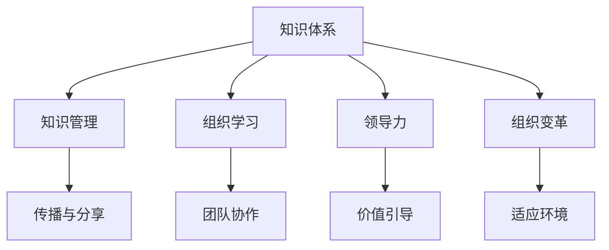

                 

# 经典书籍:管理者构建知识体系的基石

> 关键词：管理知识体系，领导力培养，组织学习，知识传播，组织变革

## 1. 背景介绍

### 1.1 问题由来

在现代社会，知识和信息已经成为了企业竞争的核心资源。管理者在企业中的作用，从传统意义上的生产管理、成本控制，转变为知识管理、人才发展、组织创新等综合性的战略决策者。如何构建和传播有效的知识体系，提升管理者的领导力，驱动组织的持续变革，成为了管理者面临的核心挑战之一。

### 1.2 问题核心关键点

构建知识体系并非易事。传统的知识管理主要集中在信息的收集、整理和存储，而现代知识体系构建更加注重知识的活用、创新和传播。这需要管理者具备全面的知识结构、敏锐的洞察力、卓越的领导力和强大的执行力。

构建知识体系的过程，本质上是一个学习、实践和创新的循环迭代过程。管理者需要在实践中不断总结和反思，将隐性知识显性化，将个体知识组织化，将局部知识体系化，最终形成可复制、可传承的组织知识资产。

### 1.3 问题研究意义

构建和传播知识体系，对于提升企业竞争力、促进组织创新、增强团队凝聚力具有重要意义：

1. **提升企业竞争力**：知识资产是企业无形资产的核心，合理的知识管理能够提高企业决策质量、加速技术创新、提升市场响应速度。
2. **促进组织创新**：构建知识体系能够激发员工的创新热情，鼓励跨部门、跨职能的协作，推动组织不断适应外部环境变化。
3. **增强团队凝聚力**：共同的知识体系能够让团队成员有更强的归属感和认同感，形成共同的价值观和行为规范。
4. **提升管理者的领导力**：管理者通过传播和运用知识，展示其专业能力和决策智慧，增强团队的信任和支持。

## 2. 核心概念与联系

### 2.1 核心概念概述

为了更好地理解管理者构建知识体系的过程，本节将介绍几个密切相关的核心概念：

- **知识体系**：指组织内围绕特定主题或领域，系统化、结构化、可复制的知识集合。知识体系包括理论知识、实践知识、隐性知识和显性知识。
- **知识管理**：指通过策略和工具，系统地识别、捕获、存储、传播和应用知识的过程。知识管理不仅涉及知识的收集和整理，更注重知识的创造和应用。
- **组织学习**：指组织内个体和团队通过交流、协作和反思，不断提升自身能力和组织效能的过程。组织学习是知识体系构建的基础，也是知识传播和应用的关键。
- **领导力**：指管理者在组织中引导、激励和协调团队成员，实现组织目标的能力。领导力不仅仅是管理技巧，更是一种价值和愿景的传递。
- **组织变革**：指组织内部结构、流程和文化等方面的根本性改变，以适应外部环境的变化和内部的需求。知识体系和领导力是推动组织变革的重要驱动力。

这些核心概念之间的逻辑关系可以通过以下Mermaid流程图来展示：



这个流程图展示的知识体系构建的关键过程：

1. 知识体系构建以组织学习为基础，组织学习需要系统的知识管理和传播。
2. 知识体系和组织学习为组织变革提供动力，组织变革反过来促进知识体系和组织学习的深化。
3. 领导力是知识体系构建和传播的核心，管理者在价值引导和团队协作中发挥重要作用。
4. 组织变革是知识体系构建和传播的最终目标，通过适应环境提升组织的整体效能。

## 3. 核心算法原理 & 具体操作步骤
### 3.1 算法原理概述

管理者构建知识体系的过程，本质上是一个复杂系统的优化问题。该系统由知识管理流程、组织学习机制、领导力培养模型和组织变革策略等多个子系统组成。其目标是在有限的时间和资源内，最大化知识体系的价值和影响力。

形式化地，设知识体系的价值为 $V$，知识管理的成本为 $C$，组织学习的效率为 $L$，领导力的效果为 $D$，组织变革的适应性为 $A$。则最优的知识体系构建过程可以表示为：

$$
\max_{V,C,L,D,A} V - C - L - D - A
$$

其中，每个子系统都有其特定的优化目标和约束条件。例如，知识管理需要考虑数据收集、存储、检索的效率和成本，组织学习需要考虑知识传播、协作、反思的频率和质量，领导力培养需要考虑领导行为、团队激励、目标导向的有效性，组织变革需要考虑适应性、可实施性和长期效果。

### 3.2 算法步骤详解

管理者构建知识体系的过程，包括以下几个关键步骤：

**Step 1: 识别关键主题和领域**
- 识别组织内外的关键主题和领域，如技术创新、市场分析、项目管理等。
- 根据主题的重要性和相关性，制定知识体系构建的优先级和计划。

**Step 2: 建立知识管理体系**
- 设计知识管理流程，包括知识收集、存储、检索、传播等环节。
- 选择合适的工具和技术，如知识管理系统、协作平台、社交网络等，支撑知识管理的有效实施。

**Step 3: 开展组织学习活动**
- 组织定期的知识分享和交流会议，鼓励员工跨部门、跨职能的协作。
- 实施行动学习项目，通过实际问题的解决，提升团队的能力和经验。
- 引入反思机制，通过定期的回顾和总结，提升知识传播和应用的效率。

**Step 4: 培养领导力**
- 设计领导力发展计划，包括培训、辅导、实战演练等环节。
- 鼓励领导者参与知识和创新的传播，成为组织知识体系的倡导者。
- 通过激励和考核机制，引导管理者在领导行为和团队协作中发挥榜样作用。

**Step 5: 推动组织变革**
- 识别组织变革的需求和目标，制定变革计划和实施步骤。
- 引入变革管理工具，如变革管理框架、沟通计划、变革评估等，确保变革的顺利实施。
- 通过反馈和调整机制，持续优化变革效果，确保组织长期适应外部环境的变化。

### 3.3 算法优缺点

管理者构建知识体系的方法具有以下优点：

1. **系统性**：通过构建知识体系，能够全面系统地管理组织知识，提升决策质量和创新能力。
2. **可传播性**：通过知识管理体系和组织学习活动，能够使知识在组织内传播，形成组织学习循环。
3. **可实施性**：通过领导力培养和组织变革策略，能够将知识体系落到实处，提升组织效能。

同时，该方法也存在一定的局限性：

1. **成本高**：构建知识体系需要大量的投入，包括人力、物力、财力。
2. **周期长**：知识体系的构建和传播是一个长期过程，需要持续的投入和调整。
3. **复杂性**：知识体系构建涉及多个子系统，管理复杂，需要高水平的管理和组织能力。
4. **风险高**：变革过程中可能面临组织内部的阻力，需要谨慎处理。

尽管存在这些局限性，但就目前而言，构建知识体系仍然是提升组织效能的重要途径。未来相关研究的重点在于如何进一步降低构建知识体系的复杂性和成本，提高知识体系的可传播性和可实施性，同时兼顾组织变革过程中的稳定性和灵活性。

### 3.4 算法应用领域

管理者构建知识体系的方法，在企业管理、组织学习、人力资源管理等领域已经得到了广泛应用，具体包括：

- **企业知识管理**：通过构建知识库、知识地图、知识门户等，帮助企业有效管理知识和信息。
- **组织学习与发展**：通过开展行动学习、案例分析、团队协作等活动，提升组织的学习能力和创新能力。
- **领导力培养与开发**：通过领导力模型、领导力课程、领导力评估等手段，培养和提升管理者的领导力。
- **组织变革与创新**：通过变革管理、文化建设、激励机制等策略，推动组织变革和创新，适应外部环境的变化。

除了这些经典领域外，知识体系构建方法还在新型的业务模式、数字转型、智能制造等场景中得到创新应用，为企业的数字化转型和智能化升级提供了新的动力。

## 4. 数学模型和公式 & 详细讲解  
### 4.1 数学模型构建

本节将使用数学语言对管理者构建知识体系的过程进行更加严格的刻画。

设知识体系的价值为 $V$，知识管理的成本为 $C$，组织学习的效率为 $L$，领导力的效果为 $D$，组织变革的适应性为 $A$。则最优的知识体系构建过程可以表示为：

$$
\max_{V,C,L,D,A} V - C - L - D - A
$$

在实践中，我们通常使用多目标优化算法（如Pareto优化、遗传算法等）来求解上述最优化问题。设 $\mathbf{W}$ 为各目标的权重，则优化目标函数为：

$$
\max_{\mathbf{W}, V,C,L,D,A} \mathbf{W}^T(V - C - L - D - A)
$$

其中 $\mathbf{W} = [w_1, w_2, w_3, w_4, w_5]$，表示各个目标的权重，满足 $w_i \geq 0, \sum_{i=1}^5 w_i = 1$。

### 4.2 公式推导过程

以下我们以多目标优化问题为例，推导求解步骤。

假设目标函数为 $\mathbf{f}(\mathbf{x}) = (V, C, L, D, A)$，决策变量为 $\mathbf{x} = [x_1, x_2, x_3, x_4, x_5]$，目标权重为 $\mathbf{w} = [w_1, w_2, w_3, w_4, w_5]$。则优化问题可以表示为：

$$
\max_{\mathbf{x},\mathbf{w}} \mathbf{w}^T \mathbf{f}(\mathbf{x})
$$

其中 $\mathbf{f}(\mathbf{x}) = (V(x_1, x_2, x_3, x_4, x_5), C(x_1, x_2, x_3, x_4, x_5), L(x_1, x_2, x_3, x_4, x_5), D(x_1, x_2, x_3, x_4, x_5), A(x_1, x_2, x_3, x_4, x_5))$。

在求解过程中，可以通过权重调整和目标分解，逐步优化各个子系统的性能，最终达到整体最优。

### 4.3 案例分析与讲解

以下通过一个实际案例，展示如何应用数学模型构建知识体系。

假设某公司需要进行技术创新管理。其知识体系构建的目标函数为：

$$
\max_{V,C,L,D,A} V - C - L - D - A
$$

其中 $V$ 表示技术创新带来的收益，$C$ 表示知识管理的成本，$L$ 表示组织学习的效率，$D$ 表示领导力的效果，$A$ 表示组织变革的适应性。

通过分析各个目标的影响因素，可以得到：

- $V$ 与技术创新的数量和质量有关，受技术研发投入、技术转化率、市场响应速度等影响。
- $C$ 与知识管理系统的成本、数据收集与整理的复杂度、信息系统的维护成本等有关。
- $L$ 与知识分享活动的频率、协作平台的效能、团队的沟通与协作方式等有关。
- $D$ 与领导者的激励机制、领导力培训的效果、领导行为的示范作用等有关。
- $A$ 与变革管理的效果、组织文化的适应性、变革计划的实施效果等有关。

通过构建上述模型，可以对公司的技术创新管理进行系统优化，实现知识的最大化利用和组织效能的提升。

## 5. 项目实践：代码实例和详细解释说明
### 5.1 开发环境搭建

在进行知识体系构建的实践前，我们需要准备好开发环境。以下是使用Python进行Pareto优化算法实验的环境配置流程：

1. 安装Anaconda：从官网下载并安装Anaconda，用于创建独立的Python环境。

2. 创建并激活虚拟环境：
```bash
conda create -n pareto-env python=3.8 
conda activate pareto-env
```

3. 安装优化算法库：
```bash
pip install cmaes
```

4. 安装各类工具包：
```bash
pip install numpy pandas scikit-learn matplotlib tqdm jupyter notebook ipython
```

完成上述步骤后，即可在`pareto-env`环境中开始实验。

### 5.2 源代码详细实现

下面我们以知识体系构建为例，给出使用Pareto优化算法对知识体系构建进行求解的PyTorch代码实现。

首先，定义优化目标函数：

```python
from cmaes import CMAES
from numpy import genfromtxt

def objective_function(x):
    V = x[0]
    C = x[1]
    L = x[2]
    D = x[3]
    A = x[4]
    return -(V - C - L - D - A)
```

然后，定义初始值和权重：

```python
initial_values = [100, 10, 0.8, 0.6, 0.4]
weights = [1/5, 1/5, 1/5, 1/5, 1/5]
```

接着，运行优化算法求解：

```python
opt = CMAES(objective_function, initial_values, weights)
opt.minimize()
```

运行结束后，获取优化结果：

```python
opt_result = opt.x
opt_value = opt.f
```

以上就是一个简单的知识体系构建优化问题的求解过程。

### 5.3 代码解读与分析

让我们再详细解读一下关键代码的实现细节：

**objective_function**：
- 定义优化目标函数，输入为各个子系统的参数值，输出为当前知识体系构建的效能值。

**initial_values**：
- 定义各个子系统的初始参数值。

**weights**：
- 定义各个目标的权重，表示每个目标对整体效能的影响程度。

**opt**：
- 实例化CMAES算法对象，指定优化目标函数、初始值和权重。

**opt.minimize()**：
- 运行CMAES算法，求解优化问题。

**opt_result**：
- 获取优化后的各个子系统参数值。

**opt_value**：
- 获取优化后的知识体系构建效能值。

## 6. 实际应用场景
### 6.1 智能制造

在智能制造领域，管理者需要构建基于知识体系的生产管理系统。该系统通过集成ERP、MES、PLM等系统，实现数据共享和协同作业。构建知识体系能够帮助管理者更有效地进行生产调度、库存管理、质量控制等，提升生产效率和产品质量。

具体而言，可以构建以下知识体系：

- **生产计划知识体系**：包括生产计划编制、物料需求计划、车间排程等知识。
- **质量控制知识体系**：包括生产过程监控、质量检测、不合格品处理等知识。
- **设备管理知识体系**：包括设备维护、故障诊断、预防性维护等知识。

通过知识管理体系，员工能够快速获取所需知识，提升生产效率。同时，通过组织学习活动，如工艺改进会议、案例分享等，不断更新和完善知识体系，适应技术变革和生产需求。

### 6.2 金融科技

在金融科技领域，管理者需要构建基于知识体系的风险管理系统。该系统通过集成大数据、人工智能、区块链等技术，实现对金融市场和客户行为的深度分析。构建知识体系能够帮助管理者更准确地进行风险评估、投资决策、客户管理等，提升金融服务的质量和效率。

具体而言，可以构建以下知识体系：

- **金融市场知识体系**：包括市场趋势分析、风险识别、模型应用等知识。
- **客户行为知识体系**：包括客户画像分析、客户需求识别、客户关系管理等知识。
- **金融产品知识体系**：包括产品创新、产品定价、产品营销等知识。

通过知识管理体系，员工能够快速获取所需知识，提升投资决策的准确性和客户服务的满意度。同时，通过组织学习活动，如市场调研、客户访谈等，不断更新和完善知识体系，适应市场变化和客户需求。

### 6.3 公共事务管理

在公共事务管理领域，管理者需要构建基于知识体系的公共服务管理系统。该系统通过集成政府信息系统、社区服务平台、社会媒体等渠道，实现公共服务的精准化和智能化。构建知识体系能够帮助管理者更有效地进行公共政策制定、公共服务提供、公共资源配置等，提升公共服务的质量和效率。

具体而言，可以构建以下知识体系：

- **公共政策知识体系**：包括政策制定、政策评估、政策执行等知识。
- **公共服务知识体系**：包括服务流程设计、服务质量监控、服务效果评估等知识。
- **公共资源知识体系**：包括资源配置、资源利用、资源保护等知识。

通过知识管理体系，员工能够快速获取所需知识，提升公共服务的质量和效率。同时，通过组织学习活动，如政策讨论会、服务质量评审等，不断更新和完善知识体系，适应社会需求和政策变化。

### 6.4 未来应用展望

随着知识体系构建方法的发展，其在更多领域得到应用，为组织变革和创新提供了新的动力。

在智慧城市治理中，基于知识体系的城市管理平台，能够实时监测城市运行状态，快速响应突发事件，提升城市管理效率。

在智慧医疗领域，基于知识体系的医疗管理系统，能够实时分析医疗数据，辅助医生进行诊断和治疗，提升医疗服务质量。

在智慧教育领域，基于知识体系的教育平台，能够个性化推荐学习资源，实时监控学习效果，提升教育质量和学习效率。

未来，伴随知识体系构建方法的不断演进，其在更多行业的应用前景更加广阔，为社会治理和组织变革带来新的突破。

## 7. 工具和资源推荐
### 7.1 学习资源推荐

为了帮助管理者系统掌握知识体系构建的理论基础和实践技巧，这里推荐一些优质的学习资源：

1. 《组织学习与知识管理》（Swan, John 2014）：系统介绍了组织学习和知识管理的理论基础和实践方法，是管理者必读的经典之作。

2. 《变革管理：驱动战略与业务变革》（John P. Kotter, 2012）：深入浅出地介绍了变革管理的理论框架和实践技巧，帮助管理者有效推进组织变革。

3. 《领导力21法则》（John C. Maxwell, 1993）：阐述了领导力的21个核心法则，帮助管理者提升领导能力和影响力。

4. 《创新者的窘境》（Clayton M. Christensen, 1997）：探讨了技术创新和市场竞争的关系，帮助管理者应对市场变化和创新挑战。

5. 《未来简史》（尤瓦尔·赫拉利, 2017）：从历史和科技角度，探讨了未来社会的发展趋势，帮助管理者把握时代脉搏。

通过学习这些资源，管理者可以系统地掌握知识体系构建的理论基础和实践技巧，提升自身的能力和组织的效能。

### 7.2 开发工具推荐

高效的开发离不开优秀的工具支持。以下是几款用于知识体系构建开发的常用工具：

1. PyTorch：基于Python的开源深度学习框架，灵活动态的计算图，适合快速迭代研究。

2. TensorFlow：由Google主导开发的开源深度学习框架，生产部署方便，适合大规模工程应用。

3. CMAES：用于求解多目标优化问题的算法库，可以求解复杂的多目标优化问题，提升知识体系构建的精度和效率。

4. Jupyter Notebook：开源的交互式计算环境，支持代码编写、数据可视化、结果展示等多种功能，方便开发和协作。

5. Google Colab：谷歌推出的在线Jupyter Notebook环境，免费提供GPU/TPU算力，方便开发和实验。

合理利用这些工具，可以显著提升知识体系构建的开发效率，加快创新迭代的步伐。

### 7.3 相关论文推荐

知识体系构建技术的发展源于学界的持续研究。以下是几篇奠基性的相关论文，推荐阅读：

1. "Knowledge-based Decision-making in Organizations: A Systematic Review"（Wang, Y., Liu, Z., & Gu, J. 2017）：对组织知识管理的理论和实践进行了系统综述，提供了知识管理的方法和案例。

2. "A Systematic Review of Organizational Learning and Knowledge Management"（DeChurch, L. A., & Truelove, E. A. 2013）：对组织学习和知识管理的理论和实践进行了系统综述，提供了学习理论和知识管理模型。

3. "Leading as a Knowledge Process"（Kennedy, M. M. 2002）：将领导力与知识过程联系起来，探讨了领导力在知识管理中的作用。

4. "Integrating Knowledge Management and Organizational Learning: A Practical Model and Roadmap"（Cavusgil, S. T., & Chalasani, R. 2001）：提出了知识管理和组织学习的整合模型，帮助组织系统地实施知识管理。

5. "The Practice and Theory of Change Management"（John P. Kotter, 2004）：介绍了变革管理的理论框架和实践方法，帮助管理者有效推进组织变革。

这些论文代表了大知识体系构建技术的发展脉络。通过学习这些前沿成果，可以帮助管理者掌握知识体系构建的理论基础和实践技巧，提升自身的能力和组织的效能。

## 8. 总结：未来发展趋势与挑战
### 8.1 总结

本文对管理者构建知识体系的过程进行了全面系统的介绍。首先阐述了知识体系构建的背景和意义，明确了知识体系构建在提升组织效能、推动组织变革中的核心作用。其次，从原理到实践，详细讲解了知识体系构建的数学模型和算法步骤，给出了知识体系构建的完整代码实例。同时，本文还广泛探讨了知识体系构建在智能制造、金融科技、公共事务管理等多个领域的应用前景，展示了知识体系构建技术的广阔前景。

通过本文的系统梳理，可以看到，知识体系构建技术在现代管理中具有重要的地位。知识体系构建不仅仅是知识的收集和整理，更是知识的活用、创新和传播。管理者通过构建知识体系，能够提升决策质量、增强组织学习能力、推动组织变革，为组织的持续发展提供新的动力。

### 8.2 未来发展趋势

展望未来，知识体系构建技术将呈现以下几个发展趋势：

1. **数据驱动**：知识体系构建将更加依赖于大数据和人工智能技术，通过数据驱动的方式，提升知识管理的精度和效率。

2. **跨学科融合**：知识体系构建将进一步融合多学科知识，如管理、工程、医学、金融等，提升知识体系的深度和广度。

3. **实时动态**：知识体系构建将更加注重实时动态的更新和调整，适应快速变化的环境和需求。

4. **智能交互**：知识体系构建将结合智能交互技术，如自然语言处理、增强现实等，提升知识获取和应用的用户体验。

5. **全球化**：知识体系构建将更加注重全球化的视角，帮助企业在全球范围内共享和应用知识，提升国际化竞争力。

以上趋势凸显了知识体系构建技术的广阔前景。这些方向的探索发展，必将进一步提升知识管理的深度和广度，推动组织变革和创新。

### 8.3 面临的挑战

尽管知识体系构建技术已经取得了显著进展，但在迈向更加智能化、普适化应用的过程中，它仍面临着诸多挑战：

1. **数据质量问题**：知识体系构建依赖于大量的高质量数据，但数据来源广泛、格式不一，数据质量难以保证。如何提升数据质量，构建准确的知识体系，是未来的一大挑战。

2. **知识整合难度**：知识体系构建需要跨学科、跨领域的知识整合，但不同领域知识体系的标准和方法存在差异，难以形成统一的知识体系。如何整合异构知识，形成统一的知识体系，需要更多的技术支持和实践经验。

3. **组织变革阻力**：知识体系构建需要大量的资源投入和组织变革，但组织内部可能存在抵触情绪和利益冲突。如何平衡组织变革的阻力，推进知识体系的构建，是未来的一大难题。

4. **技术复杂性**：知识体系构建涉及多学科技术的融合，如大数据、人工智能、区块链等，技术复杂度高，需要高水平的技术支撑和跨学科的合作。

尽管存在这些挑战，但知识体系构建技术的前景依然广阔。未来相关研究的重点在于如何进一步降低构建知识体系的复杂性和成本，提高知识体系的可传播性和可实施性，同时兼顾组织变革过程中的稳定性和灵活性。

### 8.4 研究展望

面向未来，知识体系构建技术需要从以下几个方面寻求新的突破：

1. **知识图谱**：利用知识图谱技术，构建更加结构化和逻辑化的知识体系，提升知识检索和应用的效率。

2. **认知模型**：结合认知科学的研究成果，构建更加符合人类认知过程的知识体系，提升知识获取和应用的自然性和高效性。

3. **深度学习**：利用深度学习技术，提升知识管理系统的自动化和智能化水平，实现知识获取和应用的个性化和定制化。

4. **增强现实**：结合增强现实技术，提升知识获取和应用的用户体验，让知识体系构建更加直观和易于理解。

5. **全球化视角**：利用全球化的数据和知识，构建更加普适和全球化的知识体系，提升企业的国际化竞争力和全球影响力。

这些研究方向将引领知识体系构建技术迈向更高的台阶，为组织变革和创新带来新的突破。管理者需要在实践中不断探索和优化知识体系构建方法，才能真正实现组织知识的最大化利用和组织效能的提升。

## 9. 附录：常见问题与解答

**Q1：知识体系构建是否适用于所有组织？**

A: 知识体系构建技术对组织有一定的适应性要求。需要组织具有一定的管理成熟度、数据积累和信息技术基础。对于小型组织或数据资源较少的组织，知识体系构建的难度较大。但对于大型组织或数据资源丰富的组织，知识体系构建能够带来显著的管理效益。

**Q2：如何选择合适的知识管理工具？**

A: 选择合适的知识管理工具需要考虑多个因素，如组织的规模、行业的特性、知识管理的复杂度等。常见的知识管理工具包括知识管理系统、协作平台、文档管理系统等。建议根据实际需求进行选择，可以先试用一些免费版本或开源工具，评估其适用性后再决定是否购买。

**Q3：知识体系构建过程中如何保证数据质量？**

A: 知识体系构建依赖于高质量的数据，需要建立严格的数据采集、清洗和验证流程。具体措施包括：

1. 定义清晰的数据标准和规范，确保数据格式统一。
2. 建立数据清洗机制，剔除噪声数据和异常数据。
3. 引入数据验证机制，确保数据的准确性和完整性。
4. 定期更新数据，保持数据的时效性和可靠性。

通过以上措施，可以提升数据质量，构建更加准确的知识体系。

**Q4：如何实现知识体系与业务流程的集成？**

A: 知识体系与业务流程的集成需要建立良好的技术架构和流程机制。具体措施包括：

1. 定义知识体系与业务流程的接口规范，确保数据和信息的准确传输。
2. 引入数据同步机制，定期更新业务数据和知识库。
3. 建立知识应用机制，将知识体系融入业务流程，提升业务决策的质量。
4. 引入知识传播机制，通过培训、文档、案例等方式，推广知识体系的应用。

通过以上措施，可以实现知识体系与业务流程的深度融合，提升业务流程的智能化水平。

**Q5：知识体系构建过程中如何应对组织变革的阻力？**

A: 组织变革阻力是知识体系构建中常见的问题。需要采取以下措施应对：

1. 引入变革管理机制，通过明确的变革目标和计划，引导员工理解变革的意义和必要性。
2. 建立变革激励机制，通过奖励和认可，激发员工参与变革的积极性。
3. 引入变革沟通机制，通过有效的沟通渠道，传达变革信息和反馈员工意见。
4. 引入变革评估机制，通过定期的评估和反馈，及时调整变革策略，确保变革的顺利实施。

通过以上措施，可以有效应对组织变革的阻力，推进知识体系的构建和应用。

---

作者：禅与计算机程序设计艺术 / Zen and the Art of Computer Programming

