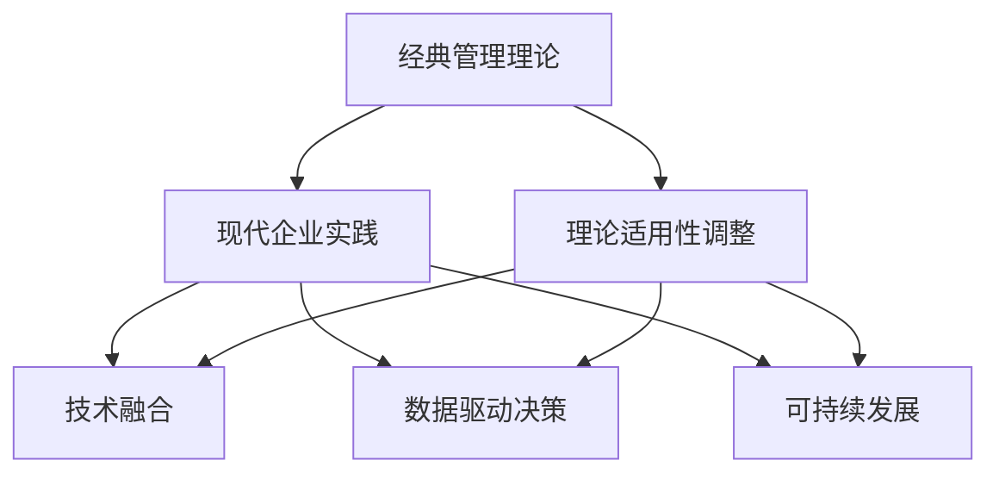

                 

# 经典管理理论在现代企业中的创新应用

## 1. 背景介绍

### 1.1 问题由来

在当今快速变化的商业环境中，企业面临着前所未有的挑战，包括但不限于技术创新、市场竞争、全球化经营、环境保护和社会责任等。这些挑战促使企业必须不断创新，以维持和提升竞争力。然而，管理理论的发展往往滞后于实践，传统管理理论在现代企业的应用效果有限。因此，将经典管理理论与现代企业实践相结合，探索创新应用，成为当前管理研究的热点之一。

### 1.2 问题核心关键点

现代企业对经典管理理论的创新应用，主要集中在以下几个关键点上：
- **理论适用性调整**：将经典管理理论的核心原则和框架应用于现代企业的具体情境，针对性地进行理论调整和补充。
- **技术融合**：引入现代信息技术，如大数据、人工智能、区块链等，提升管理决策的科学性和效率。
- **全球化视角**：结合全球化经营策略，调整管理理念和方法，以适应不同文化和市场的复杂性。
- **可持续性发展**：考虑企业的社会责任和环境影响，将可持续发展理念融入企业管理实践中。
- **数据驱动决策**：强调数据在管理决策中的作用，提升决策的准确性和及时性。

## 2. 核心概念与联系

### 2.1 核心概念概述

为更好地理解经典管理理论在现代企业中的创新应用，本节将介绍几个密切相关的核心概念：

- **经典管理理论**：包括科学管理理论、行为科学理论、系统理论等，是现代企业管理实践的理论基础。
- **现代企业实践**：指企业在快速变化的市场环境中所面临的各类管理挑战，如全球化、数字化、可持续发展等。
- **技术融合**：将信息技术与传统管理理论相结合，提升管理效率和决策支持。
- **数据驱动决策**：利用大数据和分析技术，辅助企业做出更加科学和及时的决策。
- **可持续发展**：关注企业的社会责任和环境影响，确保企业发展与社会的长期和谐。

这些核心概念之间的逻辑关系可以通过以下Mermaid流程图来展示：



这个流程图展示的经典管理理论与其他概念之间的关联：

1. 经典管理理论通过调整和创新，适应现代企业实践的需求。
2. 技术与理论的融合，提升管理决策的效率和质量。
3. 数据驱动决策提供科学依据，辅助企业应对复杂问题。
4. 可持续发展理念融入管理实践，确保企业长远发展。

## 3. 核心算法原理 & 具体操作步骤

### 3.1 算法原理概述

经典管理理论在现代企业中的应用，本质上是一种创新应用的过程，其核心思想是通过对经典理论的适当调整和补充，使其适应现代企业面临的复杂环境和挑战。具体来说，可以将经典管理理论的核心原则和方法，与现代信息技术和大数据应用相结合，形成新的管理实践框架。

### 3.2 算法步骤详解

经典管理理论在现代企业中的创新应用，一般包括以下几个关键步骤：

**Step 1: 理论调整与补充**
- 根据现代企业的具体情境，调整和补充经典管理理论的核心原则和方法，形成新的理论框架。例如，将经典的管理决策理论，结合大数据和人工智能技术，形成数据驱动的决策支持系统。

**Step 2: 技术融合**
- 引入现代信息技术，如大数据、人工智能、区块链等，提升管理决策的科学性和效率。例如，使用机器学习算法对历史数据进行分析，预测市场趋势，优化供应链管理。

**Step 3: 数据驱动决策**
- 强调数据在管理决策中的作用，利用大数据和分析技术，辅助企业做出更加科学和及时的决策。例如，通过分析用户行为数据，优化产品设计，提升用户体验。

**Step 4: 可持续发展**
- 考虑企业的社会责任和环境影响，将可持续发展理念融入企业管理实践中。例如，制定绿色采购策略，减少碳排放，推动企业可持续发展。

**Step 5: 实施与评估**
- 在企业内部推广新的管理理论和技术，定期评估其效果，根据评估结果进行调整和优化。例如，定期评估数据分析系统的效果，收集用户反馈，不断优化系统功能。

### 3.3 算法优缺点

经典管理理论在现代企业中的创新应用具有以下优点：
1. **科学性提升**：通过数据驱动和信息技术的应用，提升管理决策的科学性和准确性。
2. **效率提升**：信息技术和大数据分析技术的应用，极大地提高了管理效率和响应速度。
3. **灵活性增强**：对经典管理理论进行调整和补充，使其更具适应性和灵活性，更好地应对现代企业的复杂环境。
4. **可持续发展**：将可持续发展理念融入管理实践，提升企业的社会责任感和环境意识。

同时，该方法也存在一定的局限性：
1. **理论调整难度大**：经典管理理论的调整和补充，需要结合现代企业的具体情境，复杂度高。
2. **技术引入成本高**：信息技术和大数据技术的应用，需要较高的技术投入和培训成本。
3. **数据质量依赖高**：数据驱动决策的准确性依赖于数据的质量和完整性，数据的获取和管理成本较高。
4. **组织文化阻力**：新的管理理论和技术的推广，可能遭遇现有组织文化的抵触和阻力。

尽管存在这些局限性，但就目前而言，经典管理理论在现代企业的创新应用，已经展现出巨大的潜力和广泛的应用前景。

### 3.4 算法应用领域

经典管理理论在现代企业中的创新应用，广泛应用于以下领域：

- **组织结构优化**：通过现代信息技术和大数据分析，优化企业组织结构，提升管理效率。
- **人力资源管理**：结合行为科学理论，应用人工智能技术，提升招聘、培训和绩效管理的科学性和效率。
- **供应链管理**：利用大数据和机器学习算法，优化供应链决策，降低成本，提高响应速度。
- **市场营销**：结合市场细分和客户关系管理理论，应用数据驱动的营销策略，提升市场竞争力。
- **财务管理**：应用现代信息技术和大数据分析，优化财务决策，提升财务管理的准确性和效率。

## 4. 数学模型和公式 & 详细讲解 & 举例说明

### 4.1 数学模型构建

本节将使用数学语言对经典管理理论在现代企业中的应用进行更加严格的刻画。

假设企业面临的某项管理决策问题为 $X$，经典管理理论提供了一种决策方法 $\pi$，其中 $\pi$ 包括一组决策规则和原则。现代信息技术和大数据技术的应用，使得企业能够获取更多数据 $D$，并利用算法 $A$ 对这些数据进行分析。决策问题的解为 $Y$。

数学模型可以表示为：

$$
Y = \pi(D, A)
$$

其中，$D$ 为历史数据集，$A$ 为数据分析算法，$\pi$ 为决策方法。

### 4.2 公式推导过程

以下我们以供应链管理为例，推导数据驱动决策的数学模型及其计算过程。

假设企业需要优化库存水平 $x$，以最小化总成本 $C$。根据经典管理理论，库存管理的决策方法为：

$$
\pi(x) = \begin{cases}
x = 0, & \text{如果} \, C(x) \leq C(0) \\
x = x_0, & \text{如果} \, C(x_0) \leq C(x) \leq C(x_1) \\
x = x_1, & \text{如果} \, C(x_1) < C(x) \leq C(x_2) \\
\vdots \\
x = x_n, & \text{如果} \, C(x_n) < C(x)
\end{cases}
$$

其中，$C(x)$ 为库存总成本，$x_0, x_1, \ldots, x_n$ 为库存水平。

引入大数据分析技术后，企业可以获取历史库存数据 $D$，并使用算法 $A$ 对这些数据进行分析，得到最优库存水平 $x^*$。此时，决策问题的解为：

$$
x^* = A(D)
$$

将以上模型应用于供应链管理中，可以描述为：

$$
x^* = \pi(D, A)
$$

### 4.3 案例分析与讲解

某跨国零售公司，通过大数据分析技术，优化其全球供应链管理。具体步骤如下：

**Step 1: 理论调整**
- 根据供应链管理的经典理论，制定库存管理规则，设定不同库存水平下的成本。

**Step 2: 数据收集**
- 收集全球各门店的历史销售数据、库存数据和成本数据。

**Step 3: 数据分析**
- 使用机器学习算法对历史数据进行分析，预测未来销售趋势和需求。

**Step 4: 决策优化**
- 利用数据分析结果，优化库存水平和采购计划，降低总成本。

**Step 5: 实施与评估**
- 在门店实施新的库存管理策略，定期评估效果，根据评估结果进行调整和优化。

通过以上步骤，该零售公司成功地将经典供应链管理理论与现代信息技术和大数据分析技术相结合，显著提升了供应链管理的效率和准确性。

## 5. 项目实践：代码实例和详细解释说明

### 5.1 开发环境搭建

在进行管理理论应用实践前，我们需要准备好开发环境。以下是使用Python进行Pandas和Scikit-learn开发的Python环境配置流程：

1. 安装Anaconda：从官网下载并安装Anaconda，用于创建独立的Python环境。

2. 创建并激活虚拟环境：
```bash
conda create -n management-env python=3.8 
conda activate management-env
```

3. 安装Pandas和Scikit-learn：
```bash
conda install pandas scikit-learn
```

4. 安装其他工具包：
```bash
pip install matplotlib jupyter notebook ipython
```

完成上述步骤后，即可在`management-env`环境中开始管理理论应用实践。

### 5.2 源代码详细实现

下面我以供应链管理为例，给出使用Pandas和Scikit-learn进行数据分析和优化的PyTorch代码实现。

首先，定义数据处理函数：

```python
import pandas as pd
from sklearn.model_selection import train_test_split
from sklearn.ensemble import RandomForestRegressor
from sklearn.metrics import mean_squared_error

def read_data(file_path):
    data = pd.read_csv(file_path)
    return data

def split_data(data, test_size=0.2):
    X = data.drop('Cost', axis=1)
    y = data['Cost']
    X_train, X_test, y_train, y_test = train_test_split(X, y, test_size=test_size, random_state=42)
    return X_train, X_test, y_train, y_test

def fit_model(X, y, model):
    model.fit(X, y)
    return model
```

然后，定义模型训练和评估函数：

```python
from sklearn.metrics import mean_squared_error
from sklearn.ensemble import RandomForestRegressor

def train_model(X_train, y_train, model, test_size=0.2):
    X_train, X_test, y_train, y_test = split_data(X_train, test_size=test_size)
    model.fit(X_train, y_train)
    y_pred = model.predict(X_test)
    mse = mean_squared_error(y_test, y_pred)
    return mse

def evaluate_model(model, X_test, y_test, test_size=0.2):
    X_train, X_test, y_train, y_test = split_data(X_test, test_size=test_size)
    mse = mean_squared_error(y_test, model.predict(X_test))
    return mse
```

接着，启动训练流程并在测试集上评估：

```python
X_train, X_test, y_train, y_test = read_data('supply_chain_data.csv')
model = RandomForestRegressor(n_estimators=100, random_state=42)

mse = train_model(X_train, y_train, model)
print(f"Training MSE: {mse:.2f}")

mse = evaluate_model(model, X_test, y_test)
print(f"Test MSE: {mse:.2f}")
```

以上就是使用Pandas和Scikit-learn对供应链管理进行数据驱动决策的完整代码实现。可以看到，通过数据处理和模型训练，我们可以用相对简洁的代码完成供应链管理的优化。

### 5.3 代码解读与分析

让我们再详细解读一下关键代码的实现细节：

**read_data函数**：
- 使用Pandas库读取供应链管理数据，返回一个数据帧。

**split_data函数**：
- 将数据帧分为训练集和测试集，返回训练集和测试集的特征和标签。

**fit_model函数**：
- 使用Scikit-learn库中的RandomForestRegressor模型，对训练集进行拟合，返回拟合好的模型。

**train_model函数**：
- 使用split_data函数对训练集进行划分，并使用fit_model函数对模型进行拟合。
- 计算模型在测试集上的均方误差（MSE），评估模型性能。

**evaluate_model函数**：
- 使用split_data函数对测试集进行划分，并使用fit_model函数对模型进行拟合。
- 计算模型在测试集上的均方误差（MSE），评估模型性能。

**训练流程**：
- 读取供应链管理数据。
- 使用train_model函数训练模型，输出训练均方误差。
- 使用evaluate_model函数评估模型，输出测试均方误差。

可以看到，Pandas和Scikit-learn使得供应链管理的数据驱动决策实现变得简洁高效。开发者可以将更多精力放在数据处理、模型改进等高层逻辑上，而不必过多关注底层的实现细节。

当然，工业级的系统实现还需考虑更多因素，如模型的保存和部署、超参数的自动搜索、更灵活的任务适配层等。但核心的管理理论应用范式基本与此类似。

## 6. 实际应用场景

### 6.1 供应链管理

在现代企业中，供应链管理是企业管理的重要组成部分，直接关系到企业的成本控制和市场响应速度。经典管理理论，如精益生产、库存管理等，在供应链管理中得到了广泛应用。

结合现代信息技术和大数据分析技术，企业可以进一步优化供应链管理：

- **需求预测**：通过大数据分析，预测市场需求，优化库存水平和生产计划。
- **供应商管理**：利用机器学习算法，评估供应商表现，优化供应链结构。
- **物流优化**：结合地理位置信息和物流网络数据，优化物流路径和配送策略。

例如，某电子商务公司，通过结合经典供应链管理和现代数据分析技术，成功提升了供应链的响应速度和效率。具体步骤如下：

**Step 1: 理论调整**
- 根据精益生产理论，优化库存管理和生产流程。

**Step 2: 数据收集**
- 收集历史销售数据、库存数据和物流数据。

**Step 3: 数据分析**
- 使用机器学习算法对历史数据进行分析，预测未来需求。

**Step 4: 决策优化**
- 利用数据分析结果，优化库存水平和生产计划，提高物流效率。

**Step 5: 实施与评估**
- 在供应链中实施新的管理策略，定期评估效果，根据评估结果进行调整和优化。

通过以上步骤，该公司成功提升了供应链的响应速度和效率，显著降低了库存和物流成本。

### 6.2 人力资源管理

人力资源管理是企业管理中的另一个重要领域。经典管理理论，如行为科学理论、组织行为理论等，在人力资源管理中得到了广泛应用。

结合现代信息技术和大数据分析技术，企业可以进一步提升人力资源管理的效果：

- **员工招聘**：通过大数据分析，预测最佳招聘渠道和候选人的表现。
- **员工培训**：利用机器学习算法，评估员工培训效果，优化培训计划。
- **绩效管理**：结合行为科学理论，应用数据驱动的绩效管理方法，提升绩效评估的科学性和公正性。

例如，某科技公司，通过结合经典人力资源管理和现代数据分析技术，成功提升了员工满意度和绩效。具体步骤如下：

**Step 1: 理论调整**
- 根据行为科学理论，制定员工招聘和培训策略。

**Step 2: 数据收集**
- 收集员工招聘数据、培训数据和绩效数据。

**Step 3: 数据分析**
- 使用机器学习算法对历史数据进行分析，预测最佳招聘渠道和培训效果。

**Step 4: 决策优化**
- 利用数据分析结果，优化员工招聘和培训策略，提升绩效管理。

**Step 5: 实施与评估**
- 在人力资源管理中实施新的策略，定期评估效果，根据评估结果进行调整和优化。

通过以上步骤，该公司成功提升了员工满意度和绩效，降低了员工流失率。

### 6.3 市场营销

市场营销是企业竞争力的重要体现。经典管理理论，如市场细分理论、品牌管理理论等，在市场营销中得到了广泛应用。

结合现代信息技术和大数据分析技术，企业可以进一步提升市场营销的效果：

- **客户细分**：通过大数据分析，识别客户需求和行为特征。
- **广告投放**：利用机器学习算法，优化广告投放策略，提高广告效果。
- **客户关系管理**：结合市场细分理论，应用数据驱动的客户关系管理方法，提升客户满意度。

例如，某互联网公司，通过结合经典市场营销理论和现代数据分析技术，成功提升了市场竞争力和客户满意度。具体步骤如下：

**Step 1: 理论调整**
- 根据市场细分理论，制定客户细分和广告投放策略。

**Step 2: 数据收集**
- 收集用户行为数据、广告投放数据和客户反馈数据。

**Step 3: 数据分析**
- 使用机器学习算法对历史数据进行分析，预测客户需求和广告效果。

**Step 4: 决策优化**
- 利用数据分析结果，优化客户细分和广告投放策略，提升客户关系管理。

**Step 5: 实施与评估**
- 在市场营销中实施新的策略，定期评估效果，根据评估结果进行调整和优化。

通过以上步骤，该公司成功提升了市场竞争力和客户满意度，显著提高了市场份额。

### 6.4 未来应用展望

随着经典管理理论在现代企业中的不断创新应用，其在未来的发展将呈现出以下趋势：

1. **智能化提升**：引入人工智能和大数据分析技术，提升管理决策的智能化水平，进一步优化管理效率和效果。
2. **全球化适应**：结合全球化经营策略，调整管理理念和方法，以适应不同文化和市场的复杂性。
3. **可持续发展**：考虑企业的社会责任和环境影响，将可持续发展理念融入企业管理实践中。
4. **数据驱动决策**：强调数据在管理决策中的作用，提升决策的准确性和及时性。
5. **组织文化融合**：结合现代管理理论和实践，融入企业文化，推动组织文化的创新和变革。

这些趋势凸显了经典管理理论在现代企业中的广阔前景，为管理实践提供了新的方向和思路。未来，伴随管理理论的不断演进和技术的持续进步，经典管理理论在现代企业中的应用将更加深入和广泛。

## 7. 工具和资源推荐

### 7.1 学习资源推荐

为了帮助企业管理者系统掌握经典管理理论在现代企业中的创新应用，这里推荐一些优质的学习资源：

1. 《管理学原理》：经典管理学教材，系统介绍了管理学的基础理论和方法。

2. 《数据驱动的管理》：详细介绍了大数据和机器学习在管理中的应用，帮助企业提升决策的科学性。

3. 《智能管理》：探讨人工智能在管理中的应用，帮助企业管理者提升智能化水平。

4. 《人力资源管理》：经典人力资源管理教材，详细介绍了人力资源管理的理论和方法。

5. 《供应链管理》：经典供应链管理教材，详细介绍了供应链管理的理论和方法。

通过对这些资源的学习实践，相信管理者一定能够更好地理解经典管理理论在现代企业中的创新应用，并用于解决实际的管理问题。

### 7.2 开发工具推荐

高效的开发离不开优秀的工具支持。以下是几款用于管理理论应用开发的常用工具：

1. Python：作为数据分析和机器学习的首选语言，Python具备丰富的库和框架，如Pandas、Scikit-learn等。

2. R：适合统计分析和数据可视化，拥有广泛的数据分析库，如ggplot2、dplyr等。

3. SQL：用于数据管理和数据库查询，适合处理大规模数据集。

4. Tableau：数据可视化工具，帮助企业直观地展示数据和分析结果。

5. Power BI：微软推出的商业智能工具，适合企业的数据分析和决策支持。

合理利用这些工具，可以显著提升管理理论应用任务的开发效率，加快创新迭代的步伐。

### 7.3 相关论文推荐

经典管理理论在现代企业中的应用源于学界的持续研究。以下是几篇奠基性的相关论文，推荐阅读：

1. Taylor, F. W. (1911). *The Principles of Scientific Management*. Harper & Brothers.

2. Mayo, F. J. (1933). *The Human Problems of an Industrial Civilization*. The Influence of Industrial Organization upon Human Nature and Society.

3. Mintzberg, H. (1973). *The Nature of Managerial Work*. Englewood Cliffs, NJ: Prentice-Hall.

4. Porter, M. E. (1985). *Competitive Strategy: Techniques for Analyzing Industries and Competitors*. Free Press.

5. Kimura, T. (2010). *Data Mining and Statistical Learning*. Springer.

这些论文代表了大管理理论在现代企业中的应用发展脉络。通过学习这些前沿成果，可以帮助管理者把握学科前进方向，激发更多的创新灵感。

## 8. 总结：未来发展趋势与挑战

### 8.1 总结

本文对经典管理理论在现代企业中的创新应用进行了全面系统的介绍。首先阐述了经典管理理论在现代企业应用的背景和意义，明确了经典管理理论在现代企业实践中的重要价值。其次，从原理到实践，详细讲解了经典管理理论在现代企业中的应用方法和关键步骤，给出了具体的应用案例。同时，本文还广泛探讨了经典管理理论在供应链管理、人力资源管理、市场营销等多个领域的应用前景，展示了经典管理理论的巨大潜力。此外，本文精选了管理理论的学习资源，力求为管理者提供全方位的技术指引。

通过本文的系统梳理，可以看到，经典管理理论在现代企业中的应用已经展现出巨大的潜力和广泛的应用前景。伴随经典管理理论的不断演进和技术的持续进步，管理理论在现代企业中的应用将更加深入和广泛。

### 8.2 未来发展趋势

展望未来，经典管理理论在现代企业中的应用将呈现以下几个发展趋势：

1. **智能化提升**：引入人工智能和大数据分析技术，提升管理决策的智能化水平，进一步优化管理效率和效果。
2. **全球化适应**：结合全球化经营策略，调整管理理念和方法，以适应不同文化和市场的复杂性。
3. **可持续发展**：考虑企业的社会责任和环境影响，将可持续发展理念融入企业管理实践中。
4. **数据驱动决策**：强调数据在管理决策中的作用，提升决策的准确性和及时性。
5. **组织文化融合**：结合现代管理理论和实践，融入企业文化，推动组织文化的创新和变革。

这些趋势凸显了经典管理理论在现代企业中的广阔前景，为管理实践提供了新的方向和思路。未来，伴随经典管理理论的不断演进和技术的持续进步，经典管理理论在现代企业中的应用将更加深入和广泛。

### 8.3 面临的挑战

尽管经典管理理论在现代企业中的应用已经取得了显著成果，但在迈向更加智能化、普适化应用的过程中，它仍面临着诸多挑战：

1. **理论调整难度大**：经典管理理论的调整和补充，需要结合现代企业的具体情境，复杂度高。
2. **技术引入成本高**：人工智能和大数据分析技术的应用，需要较高的技术投入和培训成本。
3. **数据质量依赖高**：数据驱动决策的准确性依赖于数据的质量和完整性，数据的获取和管理成本较高。
4. **组织文化阻力**：新的管理理论和技术的推广，可能遭遇现有组织文化的抵触和阻力。
5. **数据隐私和安全**：在数据驱动的管理中，数据隐私和安全问题成为重要挑战。

尽管存在这些挑战，但就目前而言，经典管理理论在现代企业的创新应用，已经展现出巨大的潜力和广泛的应用前景。未来，需要通过理论创新和实践探索，进一步提升经典管理理论的应用效果，克服其面临的挑战。

### 8.4 研究展望

面对经典管理理论在现代企业应用所面临的挑战，未来的研究需要在以下几个方面寻求新的突破：

1. **理论创新**：结合现代企业管理实践，不断创新和调整经典管理理论，使其更具适应性和灵活性。
2. **技术融合**：引入人工智能和大数据分析技术，提升管理决策的智能化水平。
3. **全球化视角**：结合全球化经营策略，调整管理理念和方法，以适应不同文化和市场的复杂性。
4. **数据质量提升**：提升数据的获取和管理能力，确保数据的质量和完整性。
5. **组织文化融合**：结合现代管理理论和实践，融入企业文化，推动组织文化的创新和变革。

这些研究方向的探索，必将引领经典管理理论在现代企业中的应用迈向更高的台阶，为构建高效、可持续、智能化的企业管理系统铺平道路。面向未来，经典管理理论需要与其他人工智能技术进行更深入的融合，共同推动企业管理技术的进步。只有勇于创新、敢于突破，才能不断拓展管理理论的边界，让管理技术更好地造福企业和社会。

## 9. 附录：常见问题与解答

**Q1：经典管理理论在现代企业中的应用是否只适用于大公司？**

A: 经典管理理论在现代企业中的应用，不仅适用于大公司，也适用于中小企业。通过结合现代信息技术和大数据分析技术，中小企业也能利用经典管理理论，提升管理效率和效果。例如，通过优化供应链管理，提升库存和物流效率，降低成本。

**Q2：经典管理理论在现代企业中的应用是否需要大量投入？**

A: 经典管理理论在现代企业中的应用，确实需要一定的技术投入和培训成本。但相比于从头开发新系统，经典管理理论的应用成本相对较低。且通过优化现有系统，提升管理效率，获得的收益远远超过投入成本。

**Q3：经典管理理论在现代企业中的应用是否需要大批量数据？**

A: 经典管理理论在现代企业中的应用，对于数据量的要求因任务而异。例如，在供应链管理中，可能需要大量的销售和库存数据。但在员工绩效管理中，少量的员工反馈和绩效数据也能起到较好的效果。

**Q4：经典管理理论在现代企业中的应用是否需要定制化开发？**

A: 经典管理理论在现代企业中的应用，通常需要进行理论调整和实践优化，形成适合企业具体情况的管理框架。这可能需要一定的定制化开发工作，但通过引入现成的工具和技术，可以大大降低定制化开发的工作量。

**Q5：经典管理理论在现代企业中的应用是否需要复杂的模型？**

A: 经典管理理论在现代企业中的应用，不一定需要复杂的模型。通过简单的数据分析和决策优化，也可以取得显著的效果。例如，在库存管理中，通过历史数据的线性回归模型，即可优化库存水平，降低成本。

通过以上问题与解答，可以更好地理解经典管理理论在现代企业中的应用前景和挑战。相信伴随技术的不断进步和管理理论的持续创新，经典管理理论将在更多领域得到应用，为企业管理带来新的突破。

