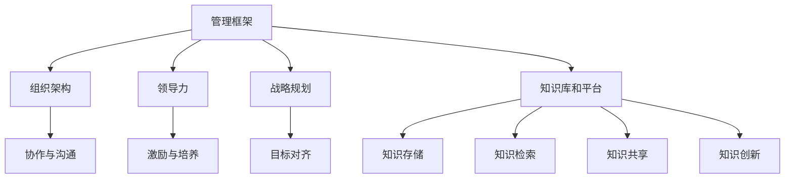

                 

# 经典著作:管理者构筑知识体系

> 关键词：管理框架,知识体系,组织架构,领导力,战略规划

## 1. 背景介绍

### 1.1 问题由来
在全球化、数字化时代，企业面临复杂多变的外部环境，如何构建高效的知识管理体系成为管理者面临的重要课题。传统的线性组织结构和管理方法，难以适应信息流通和知识共享的迅速发展。管理者需要构筑一套全面、系统、动态的知识体系，驱动企业持续创新和竞争优势。

### 1.2 问题核心关键点
构筑知识管理体系的核心在于：
1. 建立明确的管理框架，规范知识的获取、存储、共享和应用流程。
2. 设计合理的组织架构，确保知识在组织内部的流动和整合。
3. 培养领导力，推动知识分享和创新文化的形成。
4. 实施战略规划，将知识管理与企业战略目标紧密结合。

## 2. 核心概念与联系

### 2.1 核心概念概述

为更好地理解管理者构筑知识体系的方法，本节将介绍几个密切相关的核心概念：

- **管理框架**：指企业知识管理的基础架构，包括知识分类、编码、索引等标准化工作，以及知识管理系统的建设和管理。
- **组织架构**：指企业内部不同层级、不同部门的知识流动和协作关系，如扁平化、模块化、网络化等。
- **领导力**：指管理者在知识管理中的引导和协调作用，包括战略思考、变革推动、知识分享等。
- **战略规划**：指企业将知识管理与业务战略相结合，通过知识资产的开发和应用，实现长期发展目标。
- **知识库和平台**：指支持知识存储、检索、共享和创新的信息技术系统，如数据库、文档管理系统、知识管理软件等。

这些核心概念之间的逻辑关系可以通过以下Mermaid流程图来展示：



这个流程图展示了一系列知识管理体系的关键组件及其相互作用：

1. 管理框架为知识管理提供标准和规范。
2. 组织架构保障知识在企业内部流动。
3. 领导力驱动知识分享和创新。
4. 战略规划将知识管理与企业目标结合。
5. 知识库和平台提供知识存储和应用的技术支持。

这些组件共同构成了知识管理体系的骨架，确保企业能够系统地管理和应用知识资源。

## 3. 核心算法原理 & 具体操作步骤

### 3.1 算法原理概述

管理者构筑知识体系的过程，本质上是通过一系列标准化、制度化、技术化的手段，推动知识在企业内部的有效流动和应用。这一过程涉及多个环节，包括知识分类、编码、存储、检索、共享和创新。

具体而言，知识管理体系的建立包括以下几个关键步骤：

1. **知识分类和编码**：将知识按主题、类型、层次等标准进行分类，并转化为易于检索和应用的格式。
2. **知识存储和管理**：将分类编码后的知识存储在统一的知识库或平台上，确保知识的集中管理和方便访问。
3. **知识检索与共享**：建立便捷的检索系统，支持用户快速找到所需知识，并实现知识的共享和复用。
4. **知识应用和创新**：将知识转化为业务决策、产品创新等实践，推动企业的发展。

### 3.2 算法步骤详解

**Step 1: 建立知识分类和编码体系**

- **知识分类**：将知识按主题、业务领域、部门等标准进行分类，如市场分析、技术研发、客户服务等。
- **知识编码**：将分类后的知识转化为结构化的格式，如关键词、标签、元数据等，便于检索和应用。

**Step 2: 选择知识存储和管理平台**

- **选择工具**：选择合适的知识管理软件，如SharePoint、Confluence、KnowledgeNet等。
- **配置和部署**：在选定的平台上配置和管理知识库，确保数据的完整性和安全性。

**Step 3: 建立知识检索与共享机制**

- **检索系统**：使用搜索引擎技术实现快速检索，支持全文搜索、关键字搜索、分类搜索等。
- **共享机制**：建立权限控制和共享策略，确保知识的公开和透明，同时保护敏感信息。

**Step 4: 推动知识应用和创新**

- **业务应用**：将知识应用于业务决策、产品研发、客户服务等，提升企业的业务水平。
- **知识创新**：鼓励员工分享创新成果，建立知识创新的激励机制，推动企业持续进步。

### 3.3 算法优缺点

构筑知识管理体系的方法具有以下优点：
1. 系统性：通过标准化、制度化的手段，确保知识的全面、系统管理。
2. 高效性：通过技术手段提高知识检索和共享的效率，促进知识的快速应用。
3. 灵活性：可根据业务需求调整知识分类和编码，适应企业的动态变化。

同时，该方法也存在一些局限性：
1. 实施成本高：知识管理系统的建设和管理需要大量资源投入。
2. 用户接受度低：知识管理系统的复杂性和使用门槛可能影响员工的接受度和使用率。
3. 知识分散：跨部门、跨层级的数据整合和应用可能面临协调难题。
4. 安全风险：知识库中存储的大量敏感信息，可能存在数据泄露的风险。

尽管存在这些局限性，但知识管理体系的构建仍然是大企业管理和发展的重要基础，能够显著提升企业的竞争力。

### 3.4 算法应用领域

知识管理体系的应用领域非常广泛，包括但不限于：

- **研发创新**：推动技术研发过程中的知识共享和创新。
- **市场分析**：通过市场数据和信息，辅助企业制定战略决策。
- **客户服务**：提高客户服务质量和效率，提升客户满意度。
- **员工培训**：通过知识库和在线课程，支持员工学习和职业发展。
- **风险管理**：通过知识共享和分析，降低企业运营风险。
- **知识传承**：确保企业知识和经验的有效传承和利用。

这些领域都需要系统、规范的知识管理体系，以支撑企业的持续发展和创新。

## 4. 数学模型和公式 & 详细讲解  
### 4.1 数学模型构建

本节将使用数学语言对知识管理体系的构建过程进行更加严格的刻画。

设知识库中共有 $N$ 个知识项，知识项 $i$ 的分类为 $C_i$，编码信息为 $E_i$，存储在知识库中，知识库的检索系统为 $I$，知识应用系统为 $A$。则知识管理体系的构建可以表示为：

- 知识分类和编码：$C_i = f_i(E_i)$
- 知识存储和管理：$S_i = I(C_i, E_i)$
- 知识检索与共享：$A_i = I(S_i)$
- 知识应用和创新：$A_i = A(A_i, C_i)$

其中 $f_i$ 为知识编码函数，$S_i$ 为知识存储系统中的存储位置，$A_i$ 为知识应用后的结果。

### 4.2 公式推导过程

假设知识分类和编码的过程是线性的，可以表示为：

$$
C_i = w_1 E_{i1} + w_2 E_{i2} + ... + w_n E_{in} + b
$$

其中 $w$ 和 $b$ 为分类模型的权重和偏置，$E_{ij}$ 为编码信息的第 $j$ 个特征。

知识存储和管理的过程可以表示为：

$$
S_i = h(C_i, E_i)
$$

其中 $h$ 为存储函数，将分类编码后的信息 $C_i$ 和 $E_i$ 转化为知识库中的存储位置。

知识检索与共享的过程可以表示为：

$$
A_i = m(I(S_i))
$$

其中 $m$ 为检索函数，将知识库中的 $S_i$ 转化为知识应用系统中的 $A_i$。

知识应用和创新的过程可以表示为：

$$
A_i = k(A_i, C_i)
$$

其中 $k$ 为知识应用函数，将检索出的 $A_i$ 和 $C_i$ 转化为应用结果。

### 4.3 案例分析与讲解

以研发创新为例，可以进一步细化知识管理体系的构建过程。

1. **知识分类和编码**：
   - **分类**：将技术文档、专利、研究报告等按业务领域分类，如技术开发、市场需求分析、产品设计等。
   - **编码**：使用关键词、标签、分类编码等手段对分类后的信息进行编码。

2. **知识存储和管理**：
   - **存储**：将分类编码后的信息存储在公司的知识库中，如Confluence、SharePoint等。
   - **管理**：定期更新和维护知识库，确保数据的完整性和时效性。

3. **知识检索与共享**：
   - **检索**：使用关键词、标签等快速检索所需知识，支持全文搜索、分类搜索等。
   - **共享**：建立权限控制机制，确保知识在团队内自由共享和访问。

4. **知识应用和创新**：
   - **应用**：在项目研发过程中，引用知识库中的信息，辅助技术研发和产品设计。
   - **创新**：鼓励员工分享创新成果，建立知识创新的激励机制。

以上案例展示了知识管理体系在研发创新中的应用，通过系统化、标准化的管理手段，大大提升了研发团队的协作效率和创新能力。

## 5. 项目实践：代码实例和详细解释说明
### 5.1 开发环境搭建

在进行知识管理体系开发前，我们需要准备好开发环境。以下是使用Python进行知识管理系统的环境配置流程：

1. 安装Python：从官网下载并安装Python，确保版本稳定。
2. 安装数据库系统：如MySQL、PostgreSQL等，用于存储和管理知识数据。
3. 安装Web框架：如Flask、Django等，用于搭建知识管理系统的Web界面。
4. 安装搜索引擎：如Elasticsearch、Solr等，用于实现知识检索功能。

完成上述步骤后，即可在开发环境中开始知识管理体系的实践。

### 5.2 源代码详细实现

这里以使用Elasticsearch作为搜索引擎的知识管理系统为例，进行代码实现。

首先，定义知识管理系统的数据模型：

```python
from elasticsearch import Elasticsearch

class KnowledgeItem:
    def __init__(self, id, title, content, category, tags):
        self.id = id
        self.title = title
        self.content = content
        self.category = category
        self.tags = tags

# 创建Elasticsearch连接
es = Elasticsearch([{'host': 'localhost', 'port': 9200}])
```

然后，定义知识检索函数：

```python
def search_knowledge(keyword):
    query = {
        'query': {
            'match': {'title': keyword}
        }
    }
    results = es.search(index='knowledge', body=query)
    return results['hits']['hits']
```

接着，定义知识共享函数：

```python
def share_knowledge(kitem, user):
    # 更新知识项的共享用户列表
    kitem['shared_by'] = user
    # 将知识项推送到协作平台
    collaboration_platform.notify(kitem)
```

最后，启动知识管理系统并测试：

```python
# 初始化知识库
knowledge_base = []

# 添加知识项
knowledge_base.append(KnowledgeItem('1', '知识分类', '知识分类是指将知识按一定标准进行分类，以便于管理和检索。', '分类', ['知识管理', '标准化']))
knowledge_base.append(KnowledgeItem('2', '知识编码', '知识编码是将分类后的知识转化为易于检索的格式，如关键词、标签等。', '编码', ['知识管理', '标准化']))
# 测试检索和共享
search_results = search_knowledge('知识分类')
for kitem in search_results:
    share_knowledge(kitem, 'user123')
```

以上就是使用Elasticsearch实现知识管理系统的完整代码实现。可以看到，利用Python和Elasticsearch，我们可以构建一个便捷的知识检索和共享系统。

### 5.3 代码解读与分析

让我们再详细解读一下关键代码的实现细节：

**KnowledgeItem类**：
- `__init__`方法：初始化知识项的基本信息，包括ID、标题、内容、分类、标签等。

**Elasticsearch连接**：
- `es`变量：建立与Elasticsearch服务器的连接。

**搜索函数search_knowledge**：
- 定义查询条件，使用`match`查询匹配标题字段中包含关键字的内容。
- 发送查询请求，获取检索结果，并返回搜索结果列表。

**共享函数share_knowledge**：
- 更新知识项的共享用户列表，记录哪些用户已经分享了该知识项。
- 将知识项推送到协作平台，如Slack、Teams等，实现知识共享和协作。

**初始化知识库和测试代码**：
- 定义两个知识项，分别表示知识分类和知识编码。
- 通过搜索和共享函数，测试知识检索和共享功能的实现。

可以看到，知识管理体系的开发需要涉及多个模块和组件，如数据模型、搜索引擎、协作平台等。合理利用现有工具和技术，可以显著提高开发效率。

## 6. 实际应用场景
### 6.1 研发创新

在研发创新过程中，知识管理体系可以显著提升团队的协作效率和创新能力。通过知识分类和编码，研发人员可以快速找到所需的技术文档、专利和研究报告，减少搜索时间。知识共享机制可以加速知识在团队内部的传播，促进知识创新和实践。

具体而言，研发团队可以在知识库中检索相关领域的知识，辅助技术设计和产品开发。同时，团队成员可以自由分享自己的研究成果和经验，构建知识创新生态，提升研发团队的整体水平。

### 6.2 市场分析

在市场分析过程中，知识管理体系可以辅助企业进行竞争情报和市场趋势的判断。通过检索和分析大量的市场数据，企业可以了解行业动态、客户需求和技术趋势，制定更科学的市场策略。

具体而言，市场分析师可以定期从知识库中检索相关的市场分析报告和数据，汇总整理后提供给管理层，辅助战略决策。同时，分析师可以记录和共享自己的分析成果，提高团队的协作效率和知识共享度。

### 6.3 客户服务

在客户服务过程中，知识管理体系可以提升服务质量和效率，增强客户满意度。通过检索和共享客户服务相关的知识，客服人员可以快速找到常见问题和解决方案，提高服务响应速度和准确率。

具体而言，客服团队可以建立客户服务知识库，记录常见问题和解决方案。同时，客户可以通过知识库搜索相关信息，自助解决问题，减少对客服的依赖。

### 6.4 未来应用展望

随着知识管理体系的不断演进，其在企业中的应用前景将更加广阔。

在智慧办公领域，知识管理体系可以与协同工具、邮件系统等整合，形成一体化的知识管理和办公平台，提升办公效率和质量。

在数字制造领域，知识管理体系可以辅助设计、生产和运维过程，推动工业4.0的数字化转型。

在教育培训领域，知识管理体系可以支持在线学习、课程开发和教育评估，促进教育资源的优化配置。

此外，在医疗健康、环境保护、金融保险等众多领域，知识管理体系也将发挥重要作用，推动相关行业的数字化和智能化发展。

## 7. 工具和资源推荐
### 7.1 学习资源推荐

为了帮助管理者系统掌握知识管理体系的构建方法，这里推荐一些优质的学习资源：

1. 《知识管理：系统化思考与方法论》：系统介绍了知识管理体系的理论基础和实践方法，适合管理者和知识管理人员阅读。
2. 《构建知识型组织》：结合实际案例，探讨如何通过知识管理驱动组织变革和创新，推荐给企业管理者和HR人员。
3. Coursera《数据科学与决策制定》课程：由麻省理工学院开设，介绍了数据驱动的知识管理和决策制定方法，适合数据科学家和知识管理者学习。
4. Knowledge Sharing Best Practices：Ian H781发布的知识分享最佳实践指南，提供了详细的操作方法，适合企业实践参考。

通过对这些资源的学习实践，相信管理者一定能够掌握知识管理体系的精髓，构建高效的知识管理平台。

### 7.2 开发工具推荐

高效的开发离不开优秀的工具支持。以下是几款用于知识管理系统开发的常用工具：

1. Elasticsearch：开源搜索引擎，支持全文检索、分类检索等多种搜索方式，是知识检索系统的常用工具。
2. Confluence：协作平台，支持知识库的创建、管理和共享，是企业知识管理的首选工具。
3. JIRA：项目管理工具，支持任务分配、进度跟踪、问题管理等功能，与知识管理平台无缝集成。
4. SharePoint：微软的文档管理系统，支持文档共享、版本控制、权限管理等功能，适合企业文档管理。
5. GitHub：代码托管平台，支持版本控制、协作开发、项目管理等功能，适合代码库和文档库的统一管理。

合理利用这些工具，可以显著提升知识管理系统的开发效率，加速知识管理的落地应用。

### 7.3 相关论文推荐

知识管理体系的研究已经积累了丰富的成果，以下是几篇代表性的论文，推荐阅读：

1. "Knowledge Management Systems: Concepts, Issues, and Tools"（《知识管理系统：概念、问题和工具》）：由Dennis G. Cunningham等人撰写，系统介绍了知识管理系统的理论框架和实践方法。
2. "Organizational Learning and Knowledge Management"（《组织学习与知识管理》）：由Edgar H. Schein等人撰写，探讨了组织学习与知识管理的紧密联系，适合企业战略管理者和知识管理专家阅读。
3. "Building a Knowledge Sharing Culture"（《构建知识分享文化》）：由Tom Kirkman等人撰写，提供了详细的知识分享策略和方法，适合企业管理者实践参考。
4. "Organizational Knowledge Management: A Model for Business Strategy"（《组织知识管理：业务战略模型》）：由Phillip E. Boring等人撰写，介绍了知识管理与企业战略结合的方法，适合企业高层管理者阅读。

这些论文代表了知识管理体系的研究进展，通过学习这些前沿成果，可以帮助管理者更好地构建知识管理平台，推动企业知识资产的开发和应用。

## 8. 总结：未来发展趋势与挑战

### 8.1 总结

本文对管理者构筑知识管理体系的方法进行了全面系统的介绍。首先阐述了知识管理体系构建的背景和意义，明确了知识管理在企业管理和发展中的重要价值。其次，从原理到实践，详细讲解了知识管理体系的构建过程，给出了知识管理体系开发的完整代码实例。同时，本文还探讨了知识管理体系在多个行业领域的应用前景，展示了知识管理体系的巨大潜力。此外，本文精选了知识管理体系的各类学习资源，力求为管理者提供全方位的指导。

通过本文的系统梳理，可以看到，知识管理体系的构建是企业管理和发展的重要基础，能够显著提升企业的竞争力。未来，随着知识管理体系的不断演进和创新，知识管理必将在企业中发挥更大的作用，推动企业的持续发展和创新。

### 8.2 未来发展趋势

展望未来，知识管理体系的发展趋势如下：

1. 智能化：引入人工智能和机器学习技术，提高知识检索和推荐系统的智能化水平，实现更精准的知识服务。
2. 可视化：通过数据可视化技术，展示知识管理和应用的效果，增强管理者和用户的直观感受。
3. 跨平台：知识管理体系与各类办公和协作平台深度集成，提升知识管理的便捷性和应用范围。
4. 自适应：根据用户的行为和偏好，自适应地推荐知识资源，提高知识管理的个性化和精准度。
5. 动态化：知识管理体系能够动态地跟踪和更新知识库，保持知识的时效性和完整性。
6. 社交化：通过知识社区和协作平台，促进知识的社交分享和交流，构建知识创新生态。

以上趋势凸显了知识管理体系的发展方向，通过智能化、可视化、跨平台、自适应、动态化、社交化等手段，知识管理体系必将在企业管理中发挥更大的作用，推动企业的持续发展和创新。

### 8.3 面临的挑战

尽管知识管理体系已经取得了瞩目成就，但在迈向更加智能化、普适化应用的过程中，它仍面临诸多挑战：

1. 数据质量瓶颈：知识管理体系需要高质量、规范化的数据输入，但在实际应用中，数据收集和标注成本较高，难以获得理想的输入数据。
2. 用户参与度低：知识管理系统的复杂性和使用门槛可能影响用户的接受度和使用率，需要加强培训和激励。
3. 知识孤岛：不同部门和层级的数据整合和应用可能面临协调难题，需要统一的知识管理标准和流程。
4. 安全风险：知识库中存储的大量敏感信息，可能存在数据泄露的风险，需要建立严格的安全控制机制。

尽管存在这些挑战，但知识管理体系的构建仍然是大企业管理和发展的重要基础，能够显著提升企业的竞争力。未来，通过技术创新和管理改进，这些挑战终将一一被克服，知识管理必将在企业中发挥更大的作用，推动企业的持续发展和创新。

### 8.4 研究展望

面向未来，知识管理体系的研究可以从以下几个方向寻求新的突破：

1. 探索知识管理与人工智能的结合。引入人工智能技术，如机器学习、自然语言处理等，提升知识管理的智能化水平。
2. 研究知识管理与区块链的结合。利用区块链技术，建立知识共享和协作的信任机制，保障知识资产的安全性和透明性。
3. 开发知识管理的新平台和新工具。探索虚拟现实、增强现实等新平台，以及新兴技术如低代码开发等新工具，提升知识管理的便捷性和可扩展性。
4. 推动知识管理的全球化。借鉴国际先进的经验和方法，推动知识管理在全球范围内的应用和推广。
5. 研究知识管理与大数据的结合。通过大数据技术，分析和挖掘知识资产的价值，为决策制定提供支持。

这些研究方向和技术的探索，必将引领知识管理体系向更高层次发展，为企业管理和创新提供新的动力。

## 9. 附录：常见问题与解答

**Q1: 知识管理体系的实施成本高吗？**

A: 知识管理体系的实施成本确实较高，主要体现在系统建设、数据收集、用户培训等方面。但是，通过系统的长期应用，能够显著提升企业的知识管理水平和业务效率，实现成本效益平衡。

**Q2: 知识管理体系对用户的使用门槛高吗？**

A: 知识管理体系的使用门槛相对较高，尤其是在开始阶段。但是，通过系统的不断优化和改进，以及对用户的持续培训和激励，用户的使用体验会逐渐提升，知识管理系统的应用率也会逐步提高。

**Q3: 知识管理体系的协作效果如何？**

A: 知识管理体系通过统一的编码和分类体系，确保了知识的共享和协作。通过协作平台的集成，知识管理和协作可以无缝结合，大大提升了团队协作效率和创新能力。

**Q3: 知识管理体系的安全性如何？**

A: 知识管理体系的安全性可以通过建立严格的数据访问控制和权限管理机制来保障。同时，引入加密技术和备份策略，可以有效防止数据泄露和丢失。

总之，知识管理体系的构建需要综合考虑成本、用户体验、协作效果和安全风险等因素，通过合理的规划和实施，可以构建高效的知识管理体系，推动企业的持续发展和创新。

---

作者：禅与计算机程序设计艺术 / Zen and the Art of Computer Programming

