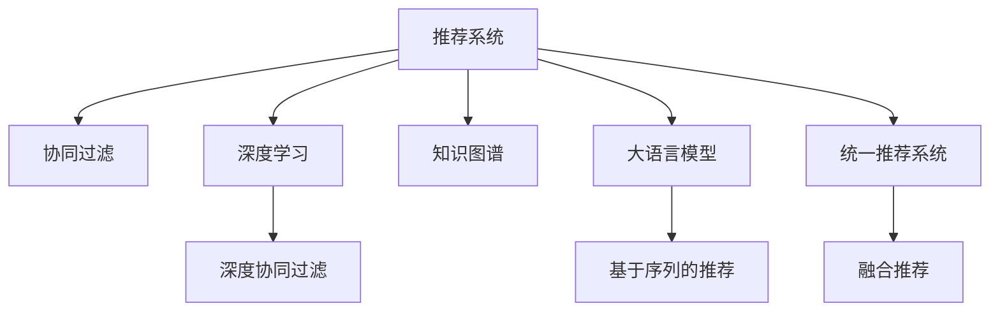

                 

# 统一的推荐系统：大模型的优势

> 关键词：统一推荐系统,大模型,深度学习,协同过滤,知识图谱,实时性,可解释性

## 1. 背景介绍

在当前数字化转型的大背景下，推荐系统成为各行各业提升用户体验、优化资源配置的重要手段。无论是电商平台、视频平台，还是社交网络、新闻站点，推荐系统通过深度学习和大数据技术，分析用户的兴趣行为，精准推荐商品、内容、信息等，大大提升了平台的运营效率和用户满意度。然而，传统的推荐算法如协同过滤、基于内容的推荐、深度协同过滤等方法，存在数据稀疏性、可扩展性差、冷启动问题等缺点，难以满足大规模用户和海量数据的需求。

大语言模型作为新兴的推荐算法，通过在大规模无监督数据上预训练学习通用的语言表示，再通过微调优化特定任务，已展现出强大的推荐能力。本文将系统性地探讨大语言模型在推荐系统中的优势和挑战，以及未来的发展趋势和方向。

## 2. 核心概念与联系

### 2.1 核心概念概述

为更好地理解大语言模型在推荐系统中的应用，本节将介绍几个关键概念及其之间的联系：

- **推荐系统(Recommendation System, RS)**：通过分析用户行为，为用户推荐符合其兴趣的商品、内容、服务等，是互联网时代的重要应用。
- **协同过滤(Collaborative Filtering, CF)**：通过用户之间的行为相似性进行推荐，是经典推荐算法之一。
- **知识图谱(Knowledge Graph)**：基于语义网络的知识库，用于表示实体、属性、关系等知识，辅助推荐系统更精准地推荐。
- **深度学习(Deep Learning, DL)**：一类基于多层神经网络的学习算法，在推荐系统中的应用包括深度协同过滤、基于序列的推荐等。
- **大语言模型(Large Language Model, LLM)**：如BERT、GPT系列等，通过大规模无监督学习，学习通用的语言表示。
- **统一推荐系统(Unified Recommendation System)**：将不同的推荐算法和数据源进行统一建模，提供统一的推荐接口，提高系统可扩展性和适应性。

这些概念之间的逻辑关系可以通过以下Mermaid流程图来展示：



这个流程图展示了几大关键概念及其之间的联系：

1. 推荐系统是大模型应用的重要领域之一。
2. 协同过滤、深度学习和知识图谱是大模型的重要数据来源和技术支撑。
3. 大模型通过预训练和微调，能够学习更加全面的语言知识，用于推荐系统。
4. 统一推荐系统整合了不同算法和数据源，为应用提供统一接口，提升系统的通用性和灵活性。

## 3. 核心算法原理 & 具体操作步骤
### 3.1 算法原理概述

基于大语言模型的推荐系统，本质上是利用预训练语言模型学习用户兴趣和商品/内容之间的语义关系，通过有监督微调，生成个性化的推荐结果。其核心思想是：在用户行为数据上进行有监督学习，训练出一个能够预测用户兴趣与商品/内容之间关系的模型。

具体来说，假设用户与商品/内容的交互数据为 $D=\{(x_i,y_i)\}_{i=1}^N$，其中 $x_i$ 表示用户与商品/内容的交互方式，如点击、浏览、评分等；$y_i$ 表示用户对商品/内容的兴趣评分。定义预测模型 $f$ 将用户输入 $x_i$ 映射为对商品/内容的兴趣评分 $y_i$：

$$
y_i = f(x_i;\theta)
$$

其中 $\theta$ 为模型参数。目标是最小化预测误差，即：

$$
\mathcal{L}(\theta) = \frac{1}{N} \sum_{i=1}^N \ell(y_i, f(x_i;\theta))
$$

其中 $\ell$ 为损失函数，如均方误差、交叉熵等。

### 3.2 算法步骤详解

基于大语言模型的推荐系统一般包括以下几个关键步骤：

**Step 1: 数据预处理**
- 收集和清洗用户与商品/内容的交互数据，如点击、浏览、评分等。
- 对数据进行归一化处理，保证不同用户和商品/内容的评分范围一致。
- 对缺失值和异常值进行处理，保证数据质量。

**Step 2: 数据划分**
- 将数据划分为训练集、验证集和测试集，用于模型训练、验证和测试。

**Step 3: 构建模型**
- 选择合适的大语言模型作为初始化参数，如BERT、GPT系列等。
- 设计适当的任务适配层，如线性分类器、注意力机制等。
- 定义损失函数和优化器，如交叉熵损失、AdamW等。

**Step 4: 微调模型**
- 将训练集数据输入模型进行前向传播，计算损失函数。
- 反向传播计算参数梯度，使用优化器更新模型参数。
- 在验证集上评估模型性能，调整学习率等超参数。
- 重复上述步骤直至模型收敛。

**Step 5: 推荐应用**
- 使用微调后的模型对新用户输入进行预测，生成个性化推荐结果。
- 根据推荐结果更新用户和商品/内容之间的语义关系，进一步优化模型。

### 3.3 算法优缺点

大语言模型在推荐系统中的主要优点包括：

1. **全面性**：大语言模型通过大规模无监督学习，学习到了丰富的语言知识，可以处理多种类型的用户输入，如文本、图像、音频等。
2. **适应性**：微调后的模型能够适应不同的推荐场景，如电商推荐、内容推荐、广告推荐等。
3. **可扩展性**：统一推荐系统可以整合多种推荐算法和数据源，灵活应对不同规模和场景的需求。
4. **实时性**：模型可以实时生成推荐结果，响应用户需求。
5. **可解释性**：大语言模型的推理过程可以逐步分解，提供可解释性较高的推荐结果。

同时，也存在以下缺点：

1. **数据依赖性强**：模型需要大量标注数据进行微调，数据稀疏性和冷启动问题难以解决。
2. **计算资源需求高**：大语言模型参数量大，计算复杂度高，需要高性能硬件支持。
3. **泛化能力受限**：模型容易过拟合训练数据，泛化到新数据时性能下降。
4. **风险性**：模型的输出可能受到输入数据偏差的影响，存在偏见和歧视。

尽管存在这些缺点，但大语言模型在推荐系统中仍然展现出显著的优势，尤其是在数据质量和规模不断提升的情况下，其应用前景广阔。

### 3.4 算法应用领域

大语言模型在推荐系统中的应用已覆盖了诸多领域，如电商推荐、内容推荐、广告推荐、个性化新闻推荐等，为这些领域的智能化升级提供了有力支持。

**电商推荐**：电商平台上用户行为多样，如浏览、收藏、购买等。大语言模型可以通过微调学习用户行为与商品之间的语义关系，生成个性化的商品推荐，提升用户购买转化率。

**内容推荐**：内容平台如视频网站、新闻站点等，需要根据用户的阅读、观看行为，推荐符合其兴趣的内容。大语言模型可以通过微调学习用户行为与内容之间的关系，生成个性化推荐列表，提升用户体验和平台留存率。

**广告推荐**：广告平台需要根据用户的兴趣和行为，推荐符合其需求的商品或服务。大语言模型可以通过微调学习用户行为与广告之间的关系，生成个性化广告推荐，提升广告投放效果。

**个性化新闻推荐**：新闻站点需要根据用户的历史阅读行为，推荐符合其兴趣的新闻内容。大语言模型可以通过微调学习用户行为与新闻内容之间的关系，生成个性化新闻推荐，提升用户阅读体验。

除了这些领域外，大语言模型在医疗、金融、旅游等领域也有广泛应用，助力这些行业提升智能化水平。

## 4. 数学模型和公式 & 详细讲解 & 举例说明

### 4.1 数学模型构建

基于大语言模型的推荐系统可以建模为以下形式：

假设用户输入 $x_i$ 为自然语言描述，商品/内容表示为词向量 $v_j$，用户与商品/内容的兴趣评分 $y_i$ 为连续值，预测模型 $f$ 为一个深度神经网络，包括多个卷积层、注意力层、全连接层等：

$$
f(x_i; \theta) = W_1 [\mathrm{Conv}_1(x_i) + \mathrm{Attention}(x_i, v_j)] + b_1
$$

$$
\hat{y}_i = \sigma(W_2 f(x_i; \theta) + b_2)
$$

其中 $W_1, W_2$ 为全连接层权重，$\mathrm{Conv}_1$ 为卷积层，$\mathrm{Attention}$ 为注意力机制，$b_1, b_2$ 为偏置项，$\sigma$ 为激活函数，$\theta$ 为模型参数。

### 4.2 公式推导过程

为了更好地理解大语言模型在推荐系统中的应用，下面以电商推荐为例，详细推导推荐模型的训练和推理过程。

假设用户输入 $x_i$ 为“买了一个手机”，商品/内容表示为词向量 $v_j$，则推荐模型 $f(x_i; \theta)$ 的计算过程如下：

1. 将用户输入 $x_i$ 进行嵌入编码，得到词向量 $e_i$。
2. 将商品/内容表示 $v_j$ 进行嵌入编码，得到词向量 $v_j$。
3. 将 $e_i$ 和 $v_j$ 输入到卷积层 $\mathrm{Conv}_1$，得到卷积特征 $c_i$。
4. 将 $e_i$ 和 $v_j$ 输入到注意力层 $\mathrm{Attention}$，得到注意力特征 $a_i$。
5. 将卷积特征 $c_i$ 和注意力特征 $a_i$ 通过全连接层 $W_1$ 进行线性变换，得到综合特征 $h_i$。
6. 将综合特征 $h_i$ 输入到全连接层 $W_2$ 进行线性变换，得到预测值 $\hat{y}_i$。

其中，注意力层 $\mathrm{Attention}$ 用于计算用户输入 $x_i$ 和商品/内容 $v_j$ 之间的相关性：

$$
a_i = \frac{\exp(\mathrm{Attention}(x_i, v_j))}{\sum_{j'} \exp(\mathrm{Attention}(x_i, v_{j'}))}
$$

目标是最小化预测误差：

$$
\mathcal{L}(\theta) = \frac{1}{N} \sum_{i=1}^N \ell(y_i, \hat{y}_i)
$$

其中 $\ell$ 为损失函数，如均方误差、交叉熵等。

### 4.3 案例分析与讲解

以电商推荐为例，详细分析大语言模型在推荐系统中的应用。

假设电商平台收集了用户历史行为数据，包括浏览、收藏、购买等。通过对这些数据的分析和预处理，得到一个训练集 $D$。将训练集输入到大语言模型进行微调，训练出一个推荐模型 $f$，用于预测用户对商品/内容的兴趣评分。

具体步骤如下：

1. 数据预处理：将用户行为数据进行归一化处理，去除异常值和缺失值。
2. 模型构建：选择合适的预训练语言模型作为初始化参数，如BERT、GPT系列等。设计适当的任务适配层，如线性分类器、注意力机制等。
3. 微调模型：将训练集数据输入模型进行前向传播，计算损失函数。反向传播计算参数梯度，使用优化器更新模型参数。在验证集上评估模型性能，调整学习率等超参数。
4. 推荐应用：使用微调后的模型对新用户输入进行预测，生成个性化推荐结果。根据推荐结果更新用户和商品/内容之间的语义关系，进一步优化模型。

通过以上步骤，大语言模型能够生成高质量的推荐结果，显著提升电商平台的运营效率和用户满意度。

## 5. 项目实践：代码实例和详细解释说明

### 5.1 开发环境搭建

在进行大语言模型推荐系统开发前，我们需要准备好开发环境。以下是使用Python进行PyTorch开发的环境配置流程：

1. 安装Anaconda：从官网下载并安装Anaconda，用于创建独立的Python环境。

2. 创建并激活虚拟环境：
```bash
conda create -n pytorch-env python=3.8 
conda activate pytorch-env
```

3. 安装PyTorch：根据CUDA版本，从官网获取对应的安装命令。例如：
```bash
conda install pytorch torchvision torchaudio cudatoolkit=11.1 -c pytorch -c conda-forge
```

4. 安装Transformers库：
```bash
pip install transformers
```

5. 安装各类工具包：
```bash
pip install numpy pandas scikit-learn matplotlib tqdm jupyter notebook ipython
```

完成上述步骤后，即可在`pytorch-env`环境中开始推荐系统开发。

### 5.2 源代码详细实现

下面以电商推荐为例，给出使用Transformers库对BERT模型进行微调的PyTorch代码实现。

首先，定义电商推荐任务的数据处理函数：

```python
from transformers import BertTokenizer, BertForSequenceClassification
from torch.utils.data import Dataset
import torch

class EcommDataset(Dataset):
    def __init__(self, texts, labels, tokenizer, max_len=128):
        self.texts = texts
        self.labels = labels
        self.tokenizer = tokenizer
        self.max_len = max_len
        
    def __len__(self):
        return len(self.texts)
    
    def __getitem__(self, item):
        text = self.texts[item]
        label = self.labels[item]
        
        encoding = self.tokenizer(text, return_tensors='pt', max_length=self.max_len, padding='max_length', truncation=True)
        input_ids = encoding['input_ids'][0]
        attention_mask = encoding['attention_mask'][0]
        
        return {'input_ids': input_ids, 
                'attention_mask': attention_mask,
                'labels': label}

# 数据预处理
tokenizer = BertTokenizer.from_pretrained('bert-base-cased')
train_dataset = EcommDataset(train_texts, train_labels, tokenizer)
dev_dataset = EcommDataset(dev_texts, dev_labels, tokenizer)
test_dataset = EcommDataset(test_texts, test_labels, tokenizer)
```

然后，定义模型和优化器：

```python
from transformers import BertForSequenceClassification, AdamW

model = BertForSequenceClassification.from_pretrained('bert-base-cased', num_labels=2)

optimizer = AdamW(model.parameters(), lr=2e-5)
```

接着，定义训练和评估函数：

```python
from torch.utils.data import DataLoader
from tqdm import tqdm
from sklearn.metrics import accuracy_score

device = torch.device('cuda') if torch.cuda.is_available() else torch.device('cpu')
model.to(device)

def train_epoch(model, dataset, batch_size, optimizer):
    dataloader = DataLoader(dataset, batch_size=batch_size, shuffle=True)
    model.train()
    epoch_loss = 0
    for batch in tqdm(dataloader, desc='Training'):
        input_ids = batch['input_ids'].to(device)
        attention_mask = batch['attention_mask'].to(device)
        labels = batch['labels'].to(device)
        model.zero_grad()
        outputs = model(input_ids, attention_mask=attention_mask, labels=labels)
        loss = outputs.loss
        epoch_loss += loss.item()
        loss.backward()
        optimizer.step()
    return epoch_loss / len(dataloader)

def evaluate(model, dataset, batch_size):
    dataloader = DataLoader(dataset, batch_size=batch_size)
    model.eval()
    preds, labels = [], []
    with torch.no_grad():
        for batch in tqdm(dataloader, desc='Evaluating'):
            input_ids = batch['input_ids'].to(device)
            attention_mask = batch['attention_mask'].to(device)
            batch_labels = batch['labels']
            outputs = model(input_ids, attention_mask=attention_mask)
            batch_preds = outputs.logits.argmax(dim=2).to('cpu').tolist()
            batch_labels = batch_labels.to('cpu').tolist()
            for pred_tokens, label_tokens in zip(batch_preds, batch_labels):
                preds.append(pred_tokens[:len(label_tokens)])
                labels.append(label_tokens)
                
    print('Accuracy:', accuracy_score(labels, preds))
```

最后，启动训练流程并在测试集上评估：

```python
epochs = 5
batch_size = 16

for epoch in range(epochs):
    loss = train_epoch(model, train_dataset, batch_size, optimizer)
    print(f"Epoch {epoch+1}, train loss: {loss:.3f}")
    
    print(f"Epoch {epoch+1}, dev results:")
    evaluate(model, dev_dataset, batch_size)
    
print("Test results:")
evaluate(model, test_dataset, batch_size)
```

以上就是使用PyTorch对BERT进行电商推荐任务微调的完整代码实现。可以看到，得益于Transformers库的强大封装，我们可以用相对简洁的代码完成BERT模型的加载和微调。

### 5.3 代码解读与分析

让我们再详细解读一下关键代码的实现细节：

**EcommDataset类**：
- `__init__`方法：初始化文本、标签、分词器等关键组件。
- `__len__`方法：返回数据集的样本数量。
- `__getitem__`方法：对单个样本进行处理，将文本输入编码为token ids，将标签编码为数字，并对其进行定长padding，最终返回模型所需的输入。

**模型和优化器**：
- 使用PyTorch的BertForSequenceClassification对BERT进行微调。
- 选择AdamW优化器进行参数更新，学习率为2e-5。

**训练和评估函数**：
- 使用PyTorch的DataLoader对数据集进行批次化加载，供模型训练和推理使用。
- 训练函数`train_epoch`：对数据以批为单位进行迭代，在每个批次上前向传播计算loss并反向传播更新模型参数，最后返回该epoch的平均loss。
- 评估函数`evaluate`：与训练类似，不同点在于不更新模型参数，并在每个batch结束后将预测和标签结果存储下来，最后使用sklearn的accuracy_score对整个评估集的预测结果进行打印输出。

**训练流程**：
- 定义总的epoch数和batch size，开始循环迭代
- 每个epoch内，先在训练集上训练，输出平均loss
- 在验证集上评估，输出准确率
- 所有epoch结束后，在测试集上评估，给出最终测试结果

可以看到，PyTorch配合Transformers库使得BERT微调的代码实现变得简洁高效。开发者可以将更多精力放在数据处理、模型改进等高层逻辑上，而不必过多关注底层的实现细节。

当然，工业级的系统实现还需考虑更多因素，如模型的保存和部署、超参数的自动搜索、更灵活的任务适配层等。但核心的微调范式基本与此类似。

## 6. 实际应用场景
### 6.1 电商推荐

电商平台通过大语言模型推荐系统，能够精准推荐商品，提升用户购买转化率和平台留存率。具体应用场景包括：

- 首页推荐：根据用户历史浏览行为，推荐相关商品。
- 搜索推荐：根据用户搜索关键词，推荐符合其兴趣的商品。
- 个性化标签推荐：根据用户行为数据，推荐个性化标签，帮助用户发现更多感兴趣的商品。

**实际案例**：阿里巴巴的“淘你懂得”推荐系统，通过大语言模型推荐系统，利用用户行为数据和商品描述，精准推荐商品，大大提升了用户购物体验和平台转化率。

### 6.2 内容推荐

内容平台如视频网站、新闻站点等，需要根据用户的阅读、观看行为，推荐符合其兴趣的内容。大语言模型推荐系统能够处理多种类型的用户输入，如文本、图像、音频等，提供更精准的内容推荐，提升用户体验和平台留存率。

**实际案例**：YouTube的视频推荐系统，通过大语言模型推荐系统，利用用户观看历史和视频描述，生成个性化视频推荐，显著提升了平台观看时长和用户留存率。

### 6.3 广告推荐

广告平台需要根据用户的兴趣和行为，推荐符合其需求的商品或服务。大语言模型推荐系统能够处理多类型用户输入，生成高质量广告推荐，提升广告投放效果。

**实际案例**：Facebook的广告推荐系统，通过大语言模型推荐系统，利用用户兴趣和行为数据，生成个性化广告推荐，显著提升了广告点击率和转化率。

### 6.4 未来应用展望

随着大语言模型和微调方法的不断发展，推荐系统将在更多领域得到应用，为各行各业带来变革性影响。

在智慧医疗领域，推荐系统能够根据患者历史数据，推荐个性化治疗方案和药物，提高治疗效果和患者满意度。

在金融领域，推荐系统能够根据用户历史交易数据，推荐投资组合和理财产品，提高用户收益和平台粘性。

在智能制造领域，推荐系统能够根据设备运行数据，推荐设备维护方案和备品备件，提高设备利用率和维护效率。

此外，在教育、旅游、能源等众多领域，大语言模型推荐系统都将发挥重要作用，推动各行各业的智能化升级。相信随着技术的日益成熟，推荐系统必将成为数字化时代的重要应用，为各行各业带来全新的发展机遇。

## 7. 工具和资源推荐
### 7.1 学习资源推荐

为了帮助开发者系统掌握大语言模型推荐系统的理论基础和实践技巧，这里推荐一些优质的学习资源：

1. 《深度学习》系列书籍：由权威专家撰写，系统讲解深度学习的基础理论和算法原理，适合初学者和进阶读者。

2. 《自然语言处理与深度学习》课程：斯坦福大学开设的NLP经典课程，涵盖自然语言处理的各个方面，适合入门和深入学习。

3. 《推荐系统实战》书籍：详细讲解推荐系统的发展历程、算法原理和工程实践，适合工程开发者。

4. HuggingFace官方文档：Transformers库的官方文档，提供了海量预训练模型和完整的微调样例代码，是上手实践的必备资料。

5. Kaggle竞赛：参加Kaggle推荐系统竞赛，通过实战提升推荐系统开发能力。

通过对这些资源的学习实践，相信你一定能够快速掌握大语言模型推荐系统的精髓，并用于解决实际的推荐问题。

### 7.2 开发工具推荐

高效的开发离不开优秀的工具支持。以下是几款用于大语言模型推荐系统开发的常用工具：

1. PyTorch：基于Python的开源深度学习框架，灵活动态的计算图，适合快速迭代研究。

2. TensorFlow：由Google主导开发的开源深度学习框架，生产部署方便，适合大规模工程应用。

3. Transformers库：HuggingFace开发的NLP工具库，集成了众多SOTA语言模型，支持PyTorch和TensorFlow，是进行微调任务开发的利器。

4. Weights & Biases：模型训练的实验跟踪工具，可以记录和可视化模型训练过程中的各项指标，方便对比和调优。

5. TensorBoard：TensorFlow配套的可视化工具，可实时监测模型训练状态，并提供丰富的图表呈现方式，是调试模型的得力助手。

6. Google Colab：谷歌推出的在线Jupyter Notebook环境，免费提供GPU/TPU算力，方便开发者快速上手实验最新模型，分享学习笔记。

合理利用这些工具，可以显著提升大语言模型推荐系统的开发效率，加快创新迭代的步伐。

### 7.3 相关论文推荐

大语言模型和推荐系统的发展源于学界的持续研究。以下是几篇奠基性的相关论文，推荐阅读：

1. Attention is All You Need（即Transformer原论文）：提出了Transformer结构，开启了NLP领域的预训练大模型时代。

2. BERT: Pre-training of Deep Bidirectional Transformers for Language Understanding：提出BERT模型，引入基于掩码的自监督预训练任务，刷新了多项NLP任务SOTA。

3. Deep Collaborative Filtering: A Factorization Method to Weighing of Important Features：提出协同过滤算法，为推荐系统的发展奠定了基础。

4. Matrix Factorization Techniques for Recommender Systems：详细讲解了矩阵分解等推荐算法，为推荐系统的工程实践提供了方法。

5. Learning to Recommend with Deep Semantic Models：提出基于深度神经网络的推荐模型，提升了推荐系统的效果和可解释性。

6. A Survey of Recommendation Systems with Deep Learning：综述了深度学习在推荐系统中的应用，提供了丰富的理论和工程实践参考。

这些论文代表了大语言模型推荐系统的发展脉络。通过学习这些前沿成果，可以帮助研究者把握学科前进方向，激发更多的创新灵感。

## 8. 总结：未来发展趋势与挑战

### 8.1 总结

本文对基于大语言模型的推荐系统进行了全面系统的介绍。首先阐述了推荐系统和大语言模型的研究背景和意义，明确了推荐系统在大语言模型应用中的重要作用。其次，从原理到实践，详细讲解了大语言模型在推荐系统中的具体应用，给出了微调任务开发的完整代码实例。同时，本文还广泛探讨了大语言模型在电商、内容、广告等推荐领域的应用前景，展示了推荐系统发展的广阔前景。最后，本文精选了推荐系统开发的各类学习资源，力求为读者提供全方位的技术指引。

通过本文的系统梳理，可以看到，大语言模型推荐系统通过预训练和微调，能够高效处理多种类型的用户输入，生成个性化的推荐结果，为各行各业带来智能化升级。未来，伴随深度学习和大语言模型的进一步发展，推荐系统必将在更多领域得到应用，为数字化时代的发展注入新的动力。

### 8.2 未来发展趋势

展望未来，大语言模型推荐系统将呈现以下几个发展趋势：

1. **模型规模持续增大**：随着算力成本的下降和数据规模的扩张，预训练语言模型的参数量还将持续增长。超大规模语言模型蕴含的丰富语言知识，有望支撑更加复杂多变的推荐场景。

2. **推荐算法融合更多技术**：推荐系统将融合更多的技术，如因果推理、强化学习、多任务学习等，提升推荐效果和可解释性。

3. **知识图谱的深度应用**：知识图谱将与大语言模型深度结合，提供更精准的实体识别和关系推理，提升推荐系统的效果。

4. **个性化推荐的多样化**：推荐系统将进一步细粒化，根据用户的行为数据、心理特征、地理位置等多维信息，生成个性化推荐，提升用户体验。

5. **实时推荐系统的优化**：推荐系统将引入更多实时处理技术，如流式学习、增量学习等，实现更加及时和准确的推荐。

6. **推荐系统的可解释性增强**：推荐系统将更多关注可解释性，通过因果分析、对抗训练等技术，提升推荐结果的可解释性和用户信任度。

以上趋势凸显了大语言模型推荐系统的广阔前景。这些方向的探索发展，必将进一步提升推荐系统的性能和应用范围，为各行各业带来智能化升级。

### 8.3 面临的挑战

尽管大语言模型推荐系统已经取得了显著进展，但在迈向更加智能化、普适化应用的过程中，仍面临诸多挑战：

1. **数据稀疏性**：推荐系统需要大量标注数据进行微调，数据稀疏性和冷启动问题难以解决。

2. **计算资源需求高**：大语言模型参数量大，计算复杂度高，需要高性能硬件支持。

3. **泛化能力受限**：模型容易过拟合训练数据，泛化到新数据时性能下降。

4. **模型鲁棒性不足**：模型面临对抗攻击、数据噪声等风险，需要进一步提升鲁棒性。

5. **安全性和隐私保护**：推荐系统涉及用户隐私数据，需要设计隐私保护机制，保障用户数据安全。

6. **公平性和偏见**：推荐系统容易受到输入数据偏见的影响，需要进一步提升公平性和减少偏见。

尽管存在这些挑战，但大语言模型推荐系统仍展现出显著的优势，并在实际应用中取得了不俗的效果。未来，研究者需要积极应对这些挑战，推动技术不断进步，为推荐系统的发展注入新的动力。

### 8.4 研究展望

面对大语言模型推荐系统所面临的挑战，未来的研究需要在以下几个方面寻求新的突破：

1. **无监督推荐算法**：探索无监督推荐算法，摆脱对大规模标注数据的依赖，利用自监督学习、主动学习等技术，实现更加灵活高效的推荐。

2. **多模态推荐系统**：将视觉、语音、文本等多模态数据进行融合，提升推荐系统的准确性和鲁棒性。

3. **动态推荐系统**：设计动态推荐系统，根据用户行为实时调整推荐策略，提升推荐效果。

4. **跨领域推荐系统**：将推荐系统扩展到更多领域，如医疗、金融、旅游等，提升各行各业的智能化水平。

5. **推荐系统的可解释性**：引入因果分析、对抗训练等技术，提升推荐结果的可解释性和用户信任度。

6. **推荐系统的公平性和偏见**：通过公平性约束和反偏见技术，提升推荐系统的公平性和减少偏见。

这些研究方向将推动大语言模型推荐系统不断进步，为数字化时代的智能化应用提供更强大的技术支撑。相信随着研究的深入和技术的成熟，推荐系统必将在更多领域得到应用，为各行各业带来全新的发展机遇。

## 9. 附录：常见问题与解答

**Q1：大语言模型推荐系统是否适用于所有推荐任务？**

A: 大语言模型推荐系统在大多数推荐任务上都能取得不错的效果，特别是对于数据量较小的任务。但对于一些特定领域的任务，如医学、法律等，仅仅依靠通用语料预训练的模型可能难以很好地适应。此时需要在特定领域语料上进一步预训练，再进行微调，才能获得理想效果。此外，对于一些需要时效性、个性化很强的任务，如对话、推荐等，微调方法也需要针对性的改进优化。

**Q2：大语言模型推荐系统如何处理冷启动问题？**

A: 冷启动问题是推荐系统面临的一大挑战，可以通过以下几种方式解决：

1. **知识图谱**：利用知识图谱中的实体关系信息，推荐与用户兴趣相关的商品/内容。
2. **多任务学习**：利用用户行为数据和商品/内容描述，生成多任务模型，提升推荐效果。
3. **迁移学习**：利用已有领域的数据进行预训练，再针对新领域进行微调，提升推荐效果。
4. **多源融合**：利用多种数据源和推荐算法，提升推荐效果和鲁棒性。

这些方法可以在一定程度上缓解冷启动问题，提升推荐系统的效果。

**Q3：大语言模型推荐系统如何进行多模态数据融合？**

A: 多模态数据融合是大语言模型推荐系统的一个重要研究方向。可以通过以下几种方式实现：

1. **特征拼接**：将不同模态的数据进行拼接，输入到深度神经网络中进行融合。
2. **注意力机制**：引入注意力机制，对不同模态的数据进行加权融合，提升融合效果。
3. **深度融合**：使用深度神经网络进行多模态特征的联合建模，提升推荐效果。

这些方法可以在一定程度上提升推荐系统的效果，特别是在多模态数据融合方面，具有广泛的应用前景。

**Q4：大语言模型推荐系统如何提升推荐系统的实时性？**

A: 实时推荐系统是大语言模型推荐系统的重要应用方向。可以通过以下几种方式提升实时性：

1. **流式学习**：利用用户实时数据进行在线学习，提升实时推荐效果。
2. **增量学习**：利用增量学习算法，对新数据进行快速训练，提升推荐效果。
3. **异步更新**：采用异步更新机制，提高模型训练和推理速度。
4. **分布式训练**：利用分布式训练技术，提升模型训练效率，实现实时推荐。

这些方法可以在一定程度上提升推荐系统的实时性，特别是在实时推荐系统方面，具有广泛的应用前景。

**Q5：大语言模型推荐系统如何进行隐私保护？**

A: 隐私保护是大语言模型推荐系统的重要研究方向。可以通过以下几种方式进行隐私保护：

1. **差分隐私**：利用差分隐私技术，保护用户隐私数据。
2. **联邦学习**：利用联邦学习技术，在用户端进行本地训练，保护用户隐私数据。
3. **数据匿名化**：对用户数据进行匿名化处理，保护用户隐私数据。

这些方法可以在一定程度上保护用户隐私数据，提升推荐系统的安全性。

通过本文的系统梳理，可以看到，大语言模型推荐系统通过预训练和微调，能够高效处理多种类型的用户输入，生成个性化的推荐结果，为各行各业带来智能化升级。未来，伴随深度学习和大语言模型的进一步发展，推荐系统必将在更多领域得到应用，为数字化时代的发展注入新的动力。相信随着研究的深入和技术的成熟，推荐系统必将成为数字化时代的重要应用，为各行各业带来全新的发展机遇。

---

作者：禅与计算机程序设计艺术 / Zen and the Art of Computer Programming

