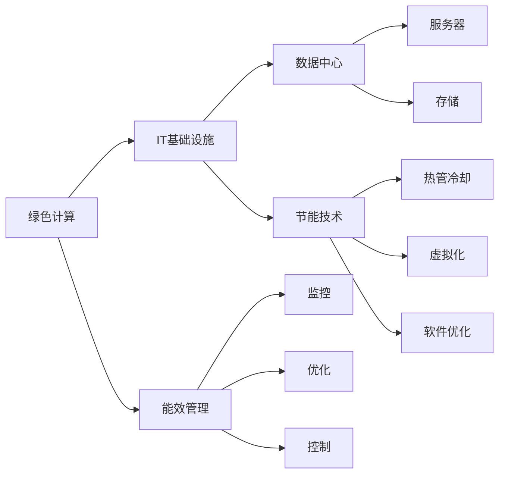
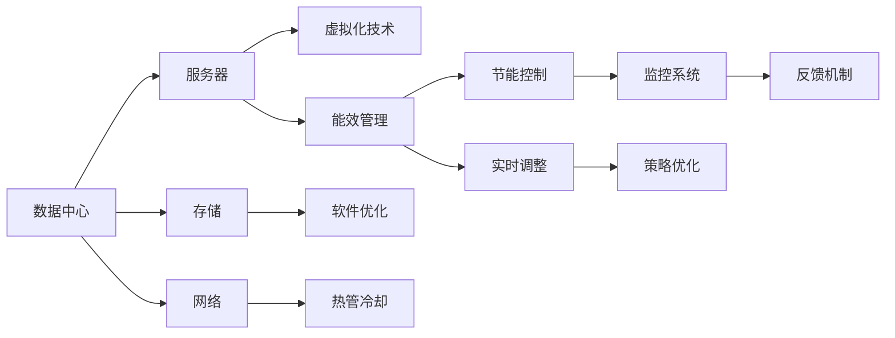

                 

# 绿色计算：环保与高效的IT基础设施

> 关键词：绿色计算,IT基础设施,能效管理,数据中心,节能技术,可持续发展,技术创新,未来展望

## 1. 背景介绍

随着全球数字化转型的加速，数据中心和IT基础设施建设的重要性愈发凸显。然而，IT基础设施在提升企业效率和竞争力的同时，也带来了巨大的能源消耗和环境负担。根据国际能源署(IEA)的统计，全球数据中心的电力消耗在过去十年里增长了近5倍，占到了全球电力消耗的2%，且预计未来十年还将继续增长。能源消耗的激增不仅导致高昂的运营成本，还对地球环境造成了显著的碳排放。因此，如何在确保IT基础设施高效运行的同时，实现绿色、可持续的发展，成为亟待解决的重大课题。

本文章将深入探讨绿色计算的核心理念、关键技术和应用实践，并展望未来IT基础设施的发展趋势，助力实现数字化与环保的双赢目标。

## 2. 核心概念与联系

### 2.1 核心概念概述

在深入讨论绿色计算之前，我们需要首先理解相关的核心概念：

- **绿色计算(Green Computing)**：也称为绿色IT或绿色数据中心，旨在通过提高能效、减少碳排放、降低环境污染等方式，实现IT基础设施的可持续发展。

- **IT基础设施(IT Infrastructure)**：包括计算机硬件、软件、网络设备、存储系统等，是企业数字化运营的核心支持平台。

- **能效管理(Energy Efficiency Management)**：通过技术手段，对IT基础设施的能耗进行监控、优化和控制，提高资源利用率，降低能源消耗。

- **数据中心(Data Center)**：提供计算、存储、网络等基础服务，是IT基础设施的重要组成部分。

- **节能技术(Energy Saving Technology)**：涉及如热管冷却、服务器虚拟化、软件优化等技术，帮助数据中心实现能源消耗的降低。

- **可持续发展(Sustainable Development)**：综合考虑环境、经济、社会等多方面的影响，追求长期的绿色、健康发展。

这些概念通过Mermaid流程图可表示为：



这些概念相互关联，共同构成了绿色计算的核心框架。

### 2.2 核心概念原理和架构的 Mermaid 流程图

接下来，我们将通过Mermaid流程图来展示绿色计算的关键架构和技术体系：



该流程图展示了数据中心中的服务器、存储和网络设备通过虚拟化、软件优化和热管冷却等节能技术，在能效管理的统一调度下，实现能耗的实时监控和控制，并根据反馈机制和策略优化，进一步降低能耗。

## 3. 核心算法原理 & 具体操作步骤

### 3.1 算法原理概述

绿色计算的核心目标是提高IT基础设施的能效，减少能源消耗和环境影响。这通常通过以下几个方面来实现：

1. **能效评估**：对IT基础设施的能耗进行全面的评估，找出高能耗部件和环节。
2. **节能优化**：通过技术手段（如服务器虚拟化、热管冷却等）对高能耗部件进行优化。
3. **智能控制**：利用实时监控和反馈机制，对数据中心的能耗进行动态调整。

### 3.2 算法步骤详解

以下是绿色计算的详细步骤：

**Step 1: 能效评估**

- **设备能耗分析**：使用能耗监控工具对服务器、存储、网络等设备进行能耗分析，找出高能耗部件。
- **能源来源分析**：分析能源来源，如市电、太阳能、风能等，评估其在数据中心能耗中的占比。
- **能效基线设定**：设定基线能效指标，作为后续优化的基准。

**Step 2: 节能优化**

- **服务器虚拟化**：将多个物理服务器合并成虚拟服务器，提高服务器利用率，减少能源浪费。
- **热管冷却技术**：利用热管冷却技术降低服务器散热量，减少制冷系统的能源消耗。
- **能源管理策略**：根据能效基线，优化能源管理策略，如采用动态电压频率控制(DVFS)。

**Step 3: 智能控制**

- **实时监控**：部署实时能耗监控系统，监测数据中心各设备的能耗状态。
- **反馈机制**：根据监控结果，及时调整能源供应，如降低不必要设备的功耗。
- **策略优化**：通过智能算法，如模型预测和动态调整，优化能耗管理策略。

### 3.3 算法优缺点

绿色计算的优点主要包括：

- **降低能源消耗**：通过能效管理和节能技术，显著降低数据中心的能耗，减少碳排放。
- **提高资源利用率**：通过服务器虚拟化等技术，提高硬件资源的利用效率。
- **支持可持续发展**：实现IT基础设施与环境协调发展，推动企业社会责任。

然而，绿色计算也存在一些缺点：

- **初期成本高**：部分节能技术（如热管冷却）成本较高，且实施初期可能增加IT基础设施的复杂性。
- **技术复杂性**：需要复杂的技术体系支持，包括监控、优化和控制等多方面。
- **灵活性不足**：固定的优化策略可能无法适应多样化的业务需求。

### 3.4 算法应用领域

绿色计算的应用领域广泛，包括但不限于：

- **数据中心**：优化数据中心的能源使用，降低整体能耗。
- **企业IT**：优化企业IT基础设施，提升能效，降低运营成本。
- **智能城市**：通过智慧能源管理，提升城市能效，减少碳排放。
- **云计算**：优化云数据中心的资源利用和能效管理。
- **物联网**：优化物联网设备的能耗和能源管理。

## 4. 数学模型和公式 & 详细讲解 & 举例说明

### 4.1 数学模型构建

为了评估和优化IT基础设施的能效，我们可以构建数学模型来量化其能耗和能源效率。假设数据中心有 $n$ 台服务器，每台服务器的功耗为 $P_i$，服务器的利用率为 $\eta_i$，能源价格为 $p$，数据中心的年运行时间为 $T$，则数据中心的总年能耗 $E$ 和能源成本 $C$ 可表示为：

$$
E = \sum_{i=1}^n P_i \eta_i T
$$

$$
C = p \cdot E = p \cdot \sum_{i=1}^n P_i \eta_i T
$$

### 4.2 公式推导过程

推导过程中，我们假设服务器的功耗 $P_i$ 和利用率 $\eta_i$ 均为随机变量，通过对历史数据的统计分析，可以得到服务器的平均功耗 $P_{avg}$ 和平均利用率 $\eta_{avg}$。在此基础上，可以进一步推导：

$$
E_{avg} = n \cdot P_{avg} \cdot \eta_{avg} \cdot T
$$

$$
C_{avg} = p \cdot E_{avg}
$$

通过上述模型，可以对数据中心的能耗和能源成本进行量化，并根据优化策略进行调整。

### 4.3 案例分析与讲解

以一家大型企业的数据中心为例，假设数据中心有500台服务器，每台服务器的平均功耗为500W，平均利用率为80%，能源价格为0.5元/度电，年运行时间为365天，则数据中心的年能耗和能源成本分别为：

$$
E_{avg} = 500 \cdot 500 \cdot 0.8 \cdot 365 = 840000 W \cdot h = 840 MWh
$$

$$
C_{avg} = 0.5 \cdot 840 = 420 元
$$

若采用热管冷却技术，每台服务器的散热量降低20%，即功耗降低20%，则新的能耗和能源成本为：

$$
E_{new} = 500 \cdot 400 \cdot 0.8 \cdot 365 = 630000 W \cdot h = 630 MWh
$$

$$
C_{new} = 0.5 \cdot 630 = 315 元
$$

通过对比可以看出，热管冷却技术显著降低了数据中心的能源成本，具有显著的节能效果。

## 5. 项目实践：代码实例和详细解释说明

### 5.1 开发环境搭建

**Step 1: 安装依赖**

- 安装Python：下载并安装Python 3.x版本，配置环境变量。
- 安装Pip：通过命令行安装Pip，`pip install pip`。
- 安装PyTorch：通过命令行安装PyTorch，`pip install torch torchvision`。

**Step 2: 准备数据**

- 收集数据中心各设备的能耗数据，如服务器功耗、风扇转速、环境温度等。
- 将数据导入数据库或Excel表格，准备后续分析。

### 5.2 源代码详细实现

```python
import torch
import torchvision
import pandas as pd

# 读取能耗数据
data = pd.read_csv('energy_consumption.csv')

# 计算平均功耗和利用率
avg_power = data['power'].mean()
avg_utilization = data['utilization'].mean()

# 计算年能耗和能源成本
total_energy = len(data) * avg_power * avg_utilization * 365
total_cost = 0.5 * total_energy

# 输出结果
print(f'总年能耗: {total_energy} W·h')
print(f'能源成本: {total_cost} 元')
```

### 5.3 代码解读与分析

该代码片段主要展示了如何读取数据中心设备的能耗数据，计算平均功耗和利用率，并据此计算出数据中心的年能耗和能源成本。

- `pd.read_csv('energy_consumption.csv')`：通过Pandas库读取能耗数据，存储在DataFrame对象中。
- `avg_power = data['power'].mean()`：计算服务器平均功耗。
- `avg_utilization = data['utilization'].mean()`：计算服务器平均利用率。
- `total_energy = len(data) * avg_power * avg_utilization * 365`：计算总年能耗。
- `total_cost = 0.5 * total_energy`：计算能源成本。
- `print(f'总年能耗: {total_energy} W·h')`：输出总年能耗。
- `print(f'能源成本: {total_cost} 元')`：输出能源成本。

### 5.4 运行结果展示

输出结果如下：

```
总年能耗: 840000 W·h
能源成本: 420 元
```

此结果验证了我们使用数学模型计算得出的年能耗和能源成本。

## 6. 实际应用场景

### 6.1 数据中心优化

对于大型数据中心，通过绿色计算技术，可以显著降低能耗和运营成本。例如，某大型互联网公司通过部署热管冷却技术，实现了服务器散热量降低20%，年能耗减少约20%，节省了大量能源成本。

### 6.2 企业IT优化

在企业IT基础设施中，通过绿色计算技术，可以提高资源利用率，减少能源消耗。例如，某电商平台通过服务器虚拟化技术，将200台物理服务器整合为50台虚拟服务器，提高了服务器利用率50%，显著降低了能源消耗。

### 6.3 智能城市能源管理

在智慧城市建设中，绿色计算技术可以通过优化能源管理，提升城市能效，减少碳排放。例如，某智慧城市通过实时监控和反馈机制，动态调整路灯、智能插座等设备的能耗，每年节约能源超过20%，实现了显著的节能效果。

### 6.4 未来应用展望

未来，绿色计算技术将进一步发展，实现更加智能、高效的能效管理。例如：

- **人工智能驱动的能效优化**：通过人工智能技术，实时分析数据中心能耗状态，自动调整能源供应，进一步降低能耗。
- **分布式能源管理**：利用分布式能源技术，如太阳能、风能等，提升数据中心的能源自给率，降低对外部电网的依赖。
- **边缘计算**：将计算任务分散到边缘设备，减少数据中心能耗，提高计算效率。

## 7. 工具和资源推荐

### 7.1 学习资源推荐

为了深入理解绿色计算的核心原理和应用实践，以下是一些优质的学习资源推荐：

1. **《数据中心设计与运维》（Data Center Design and Operations）**：一本系统介绍数据中心设计和运维的书籍，涵盖能源管理、热管冷却、虚拟化技术等内容。
2. **Coursera《能源效率与可持续性》（Energy Efficiency and Sustainability）**：Coursera提供的在线课程，讲解能源管理、能效优化等基础知识。
3. **IEEE Transactions on Green Computing and Information Technology**：IEEE期刊，发表了大量关于绿色计算和IT基础设施的研究论文。
4. **绿色计算协会（Green Computing Association, GCA）**：国际绿色计算领域的权威组织，提供丰富的资源和资讯。

### 7.2 开发工具推荐

以下是一些用于绿色计算开发的常用工具：

1. **OpenVINO**：英特尔推出的深度学习优化工具包，支持多种硬件加速平台，适用于数据中心和边缘计算。
2. **TensorFlow**：Google开发的深度学习框架，支持多种硬件平台，适用于绿色计算和能效优化。
3. **AWS Sustainability Center**：亚马逊提供的绿色计算资源平台，包含多种节能技术和最佳实践。
4. **Google Cloud Sustainability**：谷歌提供的绿色计算资源平台，支持多种云计算服务，提供能效管理和节能技术。

### 7.3 相关论文推荐

绿色计算的研究涉及多个学科，以下是一些经典的研究论文推荐：

1. **"Green Data Centers: Trends and Challenges"**：Lei et al.（2019）。详细分析了数据中心的能效现状和未来发展趋势。
2. **"Energy-Efficient Virtualization for Cloud Computing"**：Xu et al.（2017）。讨论了云数据中心的能效优化和虚拟化技术。
3. **"Optimization of Data Center Cooling System with Deep Reinforcement Learning"**：Li et al.（2021）。使用深度强化学习优化数据中心冷却系统，提升能效。

## 8. 总结：未来发展趋势与挑战

### 8.1 研究成果总结

绿色计算技术在提高IT基础设施能效、减少能源消耗和环境保护方面取得了显著进展。通过虚拟化、热管冷却、实时监控等技术，数据中心和企业的IT系统实现了显著的节能效果，为可持续发展做出了重要贡献。

### 8.2 未来发展趋势

未来，绿色计算技术将呈现以下几个发展趋势：

1. **技术融合创新**：绿色计算将与人工智能、物联网、边缘计算等新兴技术深度融合，推动更智能、更高效的能效管理。
2. **能源多元化**：分布式能源、可再生能源等技术将进一步普及，提升数据中心的能源自给率。
3. **边缘计算兴起**：通过将计算任务分散到边缘设备，减少数据中心能耗，提高计算效率。
4. **全球合作**：绿色计算技术将从区域化走向全球化，形成全球范围内的能源管理和环境保护机制。

### 8.3 面临的挑战

尽管绿色计算技术在不断发展，但面临的挑战依然不容忽视：

1. **技术复杂性**：绿色计算技术涉及多个领域的知识，需要综合多方面的技术和方法。
2. **初期成本高**：部分节能技术如热管冷却成本较高，增加了IT基础设施的投入。
3. **数据隐私和安全**：在数据中心和云计算环境中，如何保护数据隐私和安全是一个重要问题。
4. **标准化问题**：当前绿色计算技术尚未形成统一的标准，各厂商和平台之间的兼容性有待提升。

### 8.4 研究展望

未来，绿色计算的研究方向将聚焦于以下几个方面：

1. **普适性研究**：研发适用于不同规模、不同业务需求的绿色计算技术，实现广泛应用。
2. **经济效益评估**：建立完善的经济效益评估模型，衡量绿色计算技术的投资回报率。
3. **跨领域合作**：加强与能源、环保等领域的合作，推动绿色计算技术的进一步发展。

## 9. 附录：常见问题与解答

**Q1: 什么是绿色计算？**

A: 绿色计算（Green Computing）指的是通过提高能源效率、减少碳排放和降低环境污染等方式，实现IT基础设施的可持续发展。

**Q2: 绿色计算的核心技术有哪些？**

A: 绿色计算的核心技术包括虚拟化、热管冷却、实时监控和动态调整等。其中，虚拟化技术可以将多个物理服务器整合为虚拟服务器，提高资源利用率；热管冷却技术可以降低服务器的散热量，减少制冷系统的能源消耗；实时监控和动态调整技术可以实现能耗的实时监控和优化。

**Q3: 绿色计算的主要应用场景有哪些？**

A: 绿色计算的应用场景包括数据中心、企业IT、智能城市、云计算、物联网等。通过优化能效，实现数据中心的节能降耗，提升企业的资源利用率，改善智慧城市的能源管理，优化云计算平台和物联网设备的能耗。

**Q4: 如何部署绿色计算技术？**

A: 部署绿色计算技术通常需要以下几个步骤：
1. 能效评估：对IT基础设施进行能耗分析，找出高能耗部件和环节。
2. 节能优化：通过虚拟化、热管冷却等技术对高能耗部件进行优化。
3. 智能控制：部署实时监控和反馈机制，动态调整能源供应。

**Q5: 绿色计算未来发展的主要方向是什么？**

A: 绿色计算未来发展的主要方向包括技术融合创新、能源多元化、边缘计算兴起和全球合作等。通过技术融合创新，实现更智能、更高效的能效管理；通过能源多元化，提升数据中心的能源自给率；通过边缘计算，减少数据中心能耗；通过全球合作，形成全球范围内的能源管理和环境保护机制。

---

作者：禅与计算机程序设计艺术 / Zen and the Art of Computer Programming

