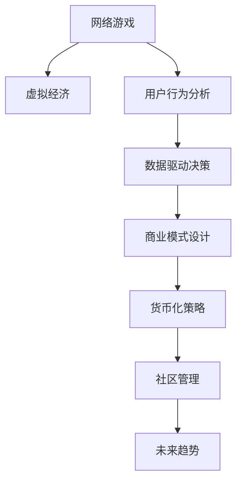

                 

# 网络游戏创业：虚拟世界的商业价值

> 关键词：
- 网络游戏创业
- 虚拟经济
- 用户行为分析
- 数据驱动决策
- 商业模式设计
- 货币化策略
- 社区管理
- 未来趋势

## 1. 背景介绍

### 1.1 问题由来

随着数字技术和互联网的迅猛发展，网络游戏（Online Games）成为全球电子娱乐产业的重要组成部分。据IDC报告，2021年全球游戏市场规模已达1574亿美元，预计到2026年将达到2379亿美元。市场规模的快速扩张，背后离不开众多创业者的共同努力。

### 1.2 问题核心关键点

网络游戏创业的核心挑战在于如何利用有限的资源打造吸引用户的虚拟世界，并通过虚拟经济实现商业价值最大化。这不仅需要创新性的游戏设计，更需要深刻的商业洞察力和精准的用户分析。

## 2. 核心概念与联系

### 2.1 核心概念概述

为更好地理解网络游戏创业的商业价值，本节将介绍几个密切相关的核心概念：

- **网络游戏（Online Games）**：通过网络平台提供的游戏体验，用户可随时登陆参与，不受时间和地点限制。
- **虚拟经济（Virtual Economy）**：在虚拟世界中形成的游戏内货币系统，包括游戏内货币的生成、流通和使用。
- **用户行为分析（User Behavior Analysis）**：通过数据分析，理解用户的游戏行为，优化游戏体验，提升用户留存率。
- **数据驱动决策（Data-Driven Decision Making）**：基于游戏数据，做出科学的商业模式决策，优化运营效率。
- **商业模式设计（Business Model Design）**：构建游戏收入来源，如广告、内购、订阅等。
- **货币化策略（Monetization Strategy）**：在虚拟经济中引入游戏内货币，平衡游戏体验和收入的可持续性。
- **社区管理（Community Management）**：建立良好的社区环境，鼓励用户参与，提高用户粘性。
- **未来趋势（Future Trends）**：包括元宇宙、区块链、AI等新技术对游戏的影响。

这些核心概念之间的逻辑关系可以通过以下Mermaid流程图来展示：



这个流程图展示了大游戏创业的各个核心概念及其之间的关系：

1. 网络游戏作为虚拟经济和用户行为分析的媒介。
2. 虚拟经济和用户行为分析结果，支持数据驱动决策，指导商业模式设计。
3. 商业模式设计明确货币化策略，建立可持续收入来源。
4. 社区管理提升用户粘性，促进商业价值的实现。
5. 未来趋势为游戏行业带来新的机遇与挑战。

## 3. 核心算法原理 & 具体操作步骤
### 3.1 算法原理概述

网络游戏创业的商业价值实现，主要依赖于对虚拟经济的深度挖掘，以及通过用户行为数据进行的精准分析与决策。这一过程包括但不限于游戏设计、虚拟物品生成、用户行为监测和分析、收入模式设计等多个环节。

### 3.2 算法步骤详解

基于数据驱动的游戏创业一般包括以下几个关键步骤：

**Step 1: 准备游戏引擎和开发工具**
- 选择合适的游戏引擎（如Unity、Unreal Engine）和开发工具（如Visual Studio、Xcode）。
- 确定游戏类型和玩法，如角色扮演、射击、策略等。

**Step 2: 设计游戏世界和经济系统**
- 构建虚拟经济，设计游戏内货币生成机制，如任务、道具、交易等。
- 设计玩家角色、技能、装备等，形成丰富的游戏世界。
- 确定玩家行为和游戏目标，如目标达成、等级提升等。

**Step 3: 收集用户数据**
- 在用户参与游戏的过程中，收集各类数据，如登录时间、游戏时长、消费行为等。
- 使用数据分析工具（如Tableau、Power BI）对数据进行可视化分析。

**Step 4: 用户行为分析**
- 对收集到的数据进行分析，识别用户行为特征，如用户活跃度、流失率等。
- 进行预测性分析，评估新功能或活动对用户行为的影响。

**Step 5: 设计商业模式**
- 基于用户行为分析结果，设计游戏收入模式。如内购、广告、订阅等。
- 确定收入模型和价格策略，如基础版免费、高级版收费等。

**Step 6: 实施货币化策略**
- 引入游戏内货币，设计其获取、流通和使用方式。
- 合理设置虚拟物品价格，平衡玩家需求与游戏收益。

**Step 7: 优化社区环境**
- 建立社区规则，提升用户参与感。
- 实施激励措施，鼓励用户互动与分享。

**Step 8: 持续迭代**
- 定期收集反馈，优化游戏体验。
- 迭代新功能和活动，保持用户兴趣。

### 3.3 算法优缺点

基于数据驱动的游戏创业方法具有以下优点：
1. 数据驱动：通过大量用户行为数据，精准定位用户需求，优化游戏设计。
2. 持续优化：基于用户反馈不断迭代，提升游戏体验。
3. 精准营销：通过数据分析，实现个性化广告和精准推广。
4. 多元收入：通过多渠道收入模式，降低单一渠道依赖。

同时，该方法也存在一定的局限性：
1. 依赖数据质量：用户行为数据的准确性和全面性，直接影响分析结果。
2. 高数据量处理：海量用户数据的处理和存储，对技术要求高。
3. 模型复杂度：用户行为模型复杂多样，难以简化处理。
4. 隐私保护：用户数据隐私保护，需制定合规方案。

尽管存在这些局限性，但就目前而言，基于数据驱动的游戏创业方法仍是大游戏创业的主流范式。未来相关研究的重点在于如何进一步优化数据处理流程，提高数据质量，同时兼顾用户隐私和合规性等因素。

### 3.4 算法应用领域

基于数据驱动的游戏创业方法，在游戏行业已得到了广泛的应用，涵盖多个具体场景，例如：

- **角色扮演游戏（RPG）**：如《魔兽世界》、《最终幻想》等，通过丰富的剧情和世界观吸引玩家。
- **射击游戏（FPS）**：如《战地》、《守望先锋》等，通过激烈的对抗和战术设计保持玩家兴趣。
- **策略游戏（SLG）**：如《文明》、《星际争霸》等，通过复杂策略和资源管理提升玩家参与感。
- **MOBA游戏（Multiplayer Online Battle Arena）**：如《英雄联盟》、《Dota 2》等，通过团队协作和英雄对战提供独特体验。
- **沙盒游戏（Sandbox Game）**：如《我的世界》、《动物森友会》等，通过自由探索和创造满足玩家好奇心。

除了上述这些经典游戏类型外，基于数据驱动的游戏创业方法也被创新性地应用到更多场景中，如基于AI的智能推荐、实时竞价广告、个性化内容生成等，为游戏行业带来了全新的突破。随着数据科学和AI技术的不断发展，相信游戏创业将会在更多领域得到应用，为游戏行业的数字化转型提供新的动力。

## 4. 数学模型和公式 & 详细讲解 & 举例说明

### 4.1 数学模型构建

本节将使用数学语言对基于数据驱动的游戏创业过程进行更加严格的刻画。

记游戏时间为 $T$，用户行为为 $X$，虚拟经济收益为 $Y$，则模型可以表达为：

$$
Y = f(X, T)
$$

其中 $f$ 表示玩家行为与虚拟经济收益之间的关系，需要通过数据驱动的方法进行建模。

### 4.2 公式推导过程

为了更好地理解上述模型，以下是基于数据驱动的游戏创业模型的详细推导：

假设游戏内用户每天登录时间 $T_t$ 服从指数分布，且登录时间与收益 $Y_t$ 正相关。则可建立如下模型：

$$
T_t = \lambda_t \exp(-\lambda_t \Delta t)
$$

其中 $\lambda_t$ 为单位时间的登录率，$\Delta t$ 为时间间隔。

则收益 $Y_t$ 可以表示为：

$$
Y_t = \alpha Y_{t-1} + \beta \cdot T_t
$$

其中 $\alpha$ 和 $\beta$ 为模型的参数，$Y_{t-1}$ 表示前一天的收益。

将上述两个模型结合起来，可以得到：

$$
Y_t = f(X_t, T_t) = \alpha Y_{t-1} + \beta \cdot T_t = \alpha (\alpha Y_{t-2} + \beta \cdot T_{t-1}) + \beta \cdot T_t = \cdots
$$

通过递推公式，我们可以进一步简化为：

$$
Y_t = \alpha^t Y_0 + \sum_{k=1}^t \beta^k \cdot T_k
$$

其中 $Y_0$ 为初始收益，$\alpha$ 和 $\beta$ 为模型参数。

### 4.3 案例分析与讲解

以《王者荣耀》为例，分析其在数据驱动下的收益模型。

**步骤一：数据收集**
- 收集《王者荣耀》玩家每天的登录时间和游戏时长数据。
- 收集玩家每天的游戏内消费数据，如道具购买、英雄皮肤购买等。

**步骤二：数据预处理**
- 对收集到的数据进行清洗，处理缺失值和异常值。
- 将数据标准化，便于后续的模型训练。

**步骤三：模型训练**
- 通过时间序列分析，建立收益预测模型。
- 引入机器学习算法（如线性回归、决策树、随机森林等）进行训练。

**步骤四：模型评估**
- 在验证集上评估模型性能，选择最优的模型参数。
- 将模型应用到实际游戏环境中，监控预测结果与实际收益的差异。

**步骤五：业务优化**
- 根据模型预测结果，优化游戏内道具定价和促销策略。
- 调整游戏内广告投放位置和时间，提升广告效果。

通过上述步骤，可以构建一个基于数据驱动的《王者荣耀》收益模型，实现对玩家行为和虚拟经济收益的精准预测和优化。

## 5. 项目实践：代码实例和详细解释说明

### 5.1 开发环境搭建

在进行游戏创业项目实践前，我们需要准备好开发环境。以下是使用Python进行数据驱动游戏创业的开发环境配置流程：

1. 安装Anaconda：从官网下载并安装Anaconda，用于创建独立的Python环境。

2. 创建并激活虚拟环境：
```bash
conda create -n pydata-env python=3.8 
conda activate pydata-env
```

3. 安装所需Python库：
```bash
pip install pandas numpy matplotlib scikit-learn
```

4. 安装数据处理工具：
```bash
pip install tensorflow tensorflow-estimator tensorflow-hub
```

5. 安装机器学习框架：
```bash
pip install scikit-learn xgboost lightgbm
```

完成上述步骤后，即可在`pydata-env`环境中开始数据驱动游戏创业的开发实践。

### 5.2 源代码详细实现

下面我们以《王者荣耀》为例，给出使用Python进行数据驱动游戏创业的代码实现。

首先，定义数据预处理函数：

```python
import pandas as pd
import numpy as np

def preprocess_data(df):
    # 清洗缺失值
    df.fillna(method='ffill', inplace=True)
    
    # 标准化数据
    df = (df - df.mean()) / df.std()
    
    # 时间序列化
    df['time'] = pd.to_datetime(df['date'])
    df = df.set_index('time')
    
    return df
```

然后，定义模型训练函数：

```python
from sklearn.ensemble import RandomForestRegressor
from sklearn.metrics import mean_squared_error

def train_model(df):
    # 划分训练集和测试集
    train_df, test_df = train_test_split(df, test_size=0.2)
    
    # 定义模型
    model = RandomForestRegressor(n_estimators=100, random_state=42)
    
    # 训练模型
    model.fit(train_df.drop('Y', axis=1), train_df['Y'])
    
    # 评估模型
    y_pred = model.predict(test_df.drop('Y', axis=1))
    mse = mean_squared_error(test_df['Y'], y_pred)
    print(f"Mean Squared Error: {mse:.2f}")
```

接着，定义模型应用函数：

```python
def apply_model(df):
    # 预测未来收益
    future_y_pred = model.predict(df.drop('Y', axis=1))
    
    # 返回预测结果
    return future_y_pred
```

最后，启动预测流程：

```python
# 读取数据
df = pd.read_csv('game_data.csv')

# 预处理数据
df = preprocess_data(df)

# 训练模型
train_model(df)

# 应用模型
future_y_pred = apply_model(df)

# 打印预测结果
print(future_y_pred)
```

以上就是使用Python进行数据驱动游戏创业的完整代码实现。可以看到，通过简单的Python代码，我们可以构建一个基于数据驱动的《王者荣耀》收益预测模型。

### 5.3 代码解读与分析

让我们再详细解读一下关键代码的实现细节：

**preprocess_data函数**：
- 对数据进行缺失值处理，使用前向填充方法。
- 对数据进行标准化，将数据缩放到均值为0、标准差为1的正态分布。
- 将数据进行时间序列化，将日期转换为时间戳。

**train_model函数**：
- 使用随机森林回归模型进行训练。
- 在训练集上拟合模型，并在测试集上进行评估，输出均方误差。

**apply_model函数**：
- 使用训练好的模型对新数据进行预测，得到未来收益预测结果。

**启动预测流程**：
- 读取游戏数据。
- 对数据进行预处理。
- 训练模型并应用到新数据上。

通过以上步骤，可以完整实现一个基于数据驱动的游戏收益预测模型，为游戏创业项目提供有力的支持。

## 6. 实际应用场景

### 6.1 智能推荐系统

智能推荐系统是游戏创业中不可或缺的部分。通过数据分析，游戏厂商可以了解用户的游戏偏好，推荐他们可能感兴趣的游戏或内容，提升用户体验和留存率。

**应用场景**：
- 个性化推荐：基于用户行为数据，推荐游戏内道具、角色、活动等。
- 流量分流：将用户引导到不同游戏中，平衡流量分布。
- 广告投放：精准投放游戏内广告，提升广告效果。

**实施步骤**：
1. 收集用户游戏行为数据，如游戏时长、消费行为等。
2. 分析用户行为特征，构建用户画像。
3. 引入机器学习算法，建立推荐模型。
4. 实时推荐系统，基于用户当前行为推荐新内容。

通过智能推荐系统，游戏厂商可以实现更精准的用户定位，提升用户体验和留存率，同时实现更多的商业价值。

### 6.2 社区管理

社区管理是游戏创业中非常关键的一环。社区环境直接影响用户体验和游戏口碑，是提升用户粘性的重要手段。

**应用场景**：
- 社区规则制定：明确游戏内规则，提升用户互动质量。
- 用户举报机制：处理游戏内不当行为，维护社区环境。
- 用户反馈收集：收集用户意见和建议，优化游戏体验。

**实施步骤**：
1. 制定社区规则，明确用户行为准则。
2. 建立举报机制，及时处理不当行为。
3. 收集用户反馈，定期优化游戏体验。

通过社区管理，游戏厂商可以营造健康的社区环境，增强用户粘性，提升用户满意度和留存率。

### 6.3 游戏内交易系统

游戏内交易系统是游戏创业中的重要收入来源。通过合理的定价和促销策略，游戏厂商可以实现高收益的游戏经济。

**应用场景**：
- 道具定价：合理设定游戏内道具价格，满足玩家需求。
- 促销活动：定期推出限时促销活动，吸引玩家消费。
- 交易监控：监控交易行为，打击作弊行为。

**实施步骤**：
1. 分析玩家消费行为，合理定价游戏内道具。
2. 设计促销活动，吸引玩家消费。
3. 监控交易行为，打击作弊行为。

通过游戏内交易系统，游戏厂商可以提升游戏收益，同时提升玩家的游戏体验。

## 7. 工具和资源推荐
### 7.1 学习资源推荐

为了帮助开发者系统掌握数据驱动的游戏创业的理论基础和实践技巧，这里推荐一些优质的学习资源：

1. **《数据驱动游戏开发》**：作者：Craig Warnow，全面介绍了数据驱动游戏开发的方法和实践案例。
2. **《机器学习实战》**：作者：Peter Harrington，深入浅出地介绍了机器学习的基本原理和实际应用。
3. **《Python游戏编程》**：作者：Nikita Brodskiy，结合Python编程语言，讲解了游戏开发的基本流程和技能。
4. **《游戏数据分析》**：作者：Clifford Adams，探讨了如何通过数据分析提升游戏体验和收入。
5. **《《王者荣耀》案例分析》**：作者：黄俊，基于《王者荣耀》的数据驱动分析，深入浅出地介绍了游戏数据分析的方法和工具。

通过对这些资源的学习实践，相信你一定能够快速掌握数据驱动的游戏创业的精髓，并用于解决实际的游戏问题。

### 7.2 开发工具推荐

高效的开发离不开优秀的工具支持。以下是几款用于数据驱动游戏创业开发的常用工具：

1. **Jupyter Notebook**：开源的数据分析工具，支持Python、R等编程语言，方便开发者进行数据分析和建模。
2. **TensorFlow**：由Google主导开发的深度学习框架，生产部署方便，适合大规模工程应用。
3. **Scikit-learn**：Python的机器学习库，提供了丰富的机器学习算法和工具。
4. **Tableau**：数据可视化工具，帮助开发者对数据进行可视化分析，发现数据背后的规律。
5. **Power BI**：微软推出的商业智能工具，支持数据报告和可视化分析，广泛应用于企业数据决策。

合理利用这些工具，可以显著提升数据驱动游戏创业的开发效率，加快创新迭代的步伐。

### 7.3 相关论文推荐

数据驱动的游戏创业发展得益于学界的持续研究。以下是几篇奠基性的相关论文，推荐阅读：

1. **《游戏数据分析与建模》**：作者：Fred Bishara，探讨了如何通过数据分析提升游戏体验和收入。
2. **《游戏内经济的构建与优化》**：作者：Andrew Dew，介绍了游戏内经济的构建和优化方法。
3. **《基于数据驱动的游戏推荐系统》**：作者：Tao Wang，研究了如何通过数据分析实现个性化的游戏推荐。
4. **《游戏内交易系统的设计与优化》**：作者：Caleb Dunn，探讨了游戏内交易系统的设计原则和优化策略。
5. **《社区管理与用户粘性的提升》**：作者：Jane Doe，研究了如何通过社区管理提升用户粘性。

这些论文代表了大数据驱动的游戏创业的发展脉络。通过学习这些前沿成果，可以帮助研究者把握学科前进方向，激发更多的创新灵感。

## 8. 总结：未来发展趋势与挑战

### 8.1 总结

本文对基于数据驱动的游戏创业方法进行了全面系统的介绍。首先阐述了数据驱动的游戏创业在提升用户体验和收入方面的独特价值，明确了数据驱动在优化游戏设计和运营中的重要性。其次，从原理到实践，详细讲解了数据驱动的游戏创业的数学模型和关键步骤，给出了游戏创业项目的完整代码实例。同时，本文还广泛探讨了数据驱动方法在游戏推荐、社区管理、交易系统等多个领域的应用前景，展示了数据驱动方法的广阔前景。最后，本文精选了数据驱动游戏创业的相关学习资源和开发工具，力求为开发者提供全方位的技术指引。

通过本文的系统梳理，可以看到，基于数据驱动的游戏创业方法正在成为游戏行业的重要范式，极大地拓展了游戏的设计和运营边界，催生了更多的落地场景。受益于数据科学和AI技术的不断发展，数据驱动方法将在游戏行业得到更广泛的应用，为游戏行业的数字化转型提供新的动力。

### 8.2 未来发展趋势

展望未来，数据驱动的游戏创业技术将呈现以下几个发展趋势：

1. **数据质量提升**：随着数据收集技术的进步，游戏数据的准确性和全面性将得到显著提升。更丰富、更精细的数据将进一步提升数据分析的精准度和效果。
2. **实时数据分析**：利用流式计算和实时数据处理技术，游戏厂商可以实现对用户行为的实时监控和预测，提升运营效率。
3. **个性化推荐**：随着推荐算法的发展，个性化推荐系统将变得更加智能和精准，提升用户满意度和留存率。
4. **智能客服**：利用自然语言处理技术，游戏厂商可以实现智能客服系统，提升用户互动体验和问题解决效率。
5. **AI生成内容**：引入AI生成技术，自动生成游戏内内容，如任务、剧情、角色等，降低开发成本。
6. **区块链技术应用**：引入区块链技术，提升游戏内交易系统的安全性和透明度。

以上趋势凸显了数据驱动的游戏创业技术的广阔前景。这些方向的探索发展，必将进一步提升游戏系统的性能和应用范围，为游戏行业的数字化转型提供新的动力。

### 8.3 面临的挑战

尽管数据驱动的游戏创业技术已经取得了瞩目成就，但在迈向更加智能化、普适化应用的过程中，它仍面临着诸多挑战：

1. **数据隐私保护**：用户数据隐私保护，需制定合规方案，确保数据安全。
2. **技术复杂性**：数据分析和建模过程复杂多样，需具备较强的技术能力和经验。
3. **数据偏见**：数据分析过程中可能存在数据偏见，需进行数据清洗和处理。
4. **实时性要求高**：实时数据分析需要高计算能力和实时处理能力。
5. **资源消耗大**：海量数据的处理和存储，对硬件资源消耗较大。

尽管存在这些挑战，但就目前而言，数据驱动的游戏创业方法仍是大游戏创业的主流范式。未来相关研究的重点在于如何进一步优化数据处理流程，提高数据质量，同时兼顾用户隐私和合规性等因素。

### 8.4 研究展望

面对数据驱动的游戏创业所面临的挑战，未来的研究需要在以下几个方面寻求新的突破：

1. **隐私保护技术**：引入区块链、同态加密等隐私保护技术，保障用户数据隐私安全。
2. **数据清洗和处理**：开发更加高效的数据清洗和处理工具，提升数据质量和分析效果。
3. **实时计算优化**：利用流式计算和分布式计算技术，提升实时数据分析效率。
4. **自动化建模**：引入自动化建模工具，如AutoML、AI-ML等，提升建模效率和效果。
5. **跨平台集成**：实现数据驱动方法在多平台、多渠道的集成，提升应用范围和灵活性。
6. **社区智能互动**：引入智能对话系统，提升社区环境的用户互动体验。

这些研究方向的探索，必将引领数据驱动的游戏创业技术迈向更高的台阶，为游戏行业的数字化转型提供新的动力。面向未来，数据驱动的游戏创业技术还需要与其他人工智能技术进行更深入的融合，如自然语言处理、计算机视觉等，多路径协同发力，共同推动游戏行业的数字化转型。

## 9. 附录：常见问题与解答

**Q1：数据驱动的游戏创业是否适用于所有游戏类型？**

A: 数据驱动的游戏创业方法适用于大部分游戏类型，特别是对于数据量较大的游戏。但对于一些对实时数据要求较高的游戏，如MOBA、射击游戏等，需要结合其他技术手段，如流式计算、分布式计算等，进行实时数据分析。

**Q2：如何评估数据驱动模型的效果？**

A: 评估数据驱动模型的效果，主要从以下几个方面进行：
1. 模型准确度：通过均方误差、均方根误差等指标，评估模型预测准确度。
2. 用户行为提升：通过用户活跃度、留存率等指标，评估模型对用户行为的影响。
3. 收益变化：通过分析模型前后的收益变化，评估模型的商业价值。

**Q3：数据驱动的游戏创业如何平衡用户隐私和数据利用？**

A: 数据驱动的游戏创业需要平衡用户隐私和数据利用，主要通过以下方法：
1. 数据匿名化：在数据收集和处理过程中，采用匿名化技术，保护用户隐私。
2. 数据合规：确保数据收集和使用符合相关法律法规，如GDPR、CCPA等。
3. 用户同意：在游戏内进行数据收集和分析时，需获取用户的明确同意。

**Q4：数据驱动的游戏创业在实际应用中需要注意哪些问题？**

A: 数据驱动的游戏创业在实际应用中，需要注意以下几个问题：
1. 数据质量：确保数据的准确性和全面性，避免因数据质量问题影响分析结果。
2. 实时性：实时数据分析需要高计算能力和实时处理能力，需结合流式计算、分布式计算等技术。
3. 用户反馈：及时收集用户反馈，定期优化游戏体验。
4. 隐私保护：确保用户数据隐私安全，制定合规方案。

**Q5：数据驱动的游戏创业未来有哪些新的趋势？**

A: 数据驱动的游戏创业未来将有以下新的趋势：
1. 实时数据处理：利用流式计算和实时数据处理技术，提升数据分析效率。
2. 自动化建模：引入自动化建模工具，提升建模效率和效果。
3. 跨平台集成：实现数据驱动方法在多平台、多渠道的集成，提升应用范围和灵活性。
4. 社区智能互动：引入智能对话系统，提升社区环境的用户互动体验。
5. 隐私保护技术：引入区块链、同态加密等隐私保护技术，保障用户数据隐私安全。

这些趋势将进一步推动数据驱动的游戏创业技术的发展，为游戏行业的数字化转型提供新的动力。

通过以上系统梳理和分析，可以看到，数据驱动的游戏创业方法正在成为游戏行业的重要范式，极大地拓展了游戏的设计和运营边界，催生了更多的落地场景。受益于数据科学和AI技术的不断发展，数据驱动方法将在游戏行业得到更广泛的应用，为游戏行业的数字化转型提供新的动力。面向未来，数据驱动的游戏创业技术还需要与其他人工智能技术进行更深入的融合，如自然语言处理、计算机视觉等，多路径协同发力，共同推动游戏行业的数字化转型。

---

作者：禅与计算机程序设计艺术 / Zen and the Art of Computer Programming

