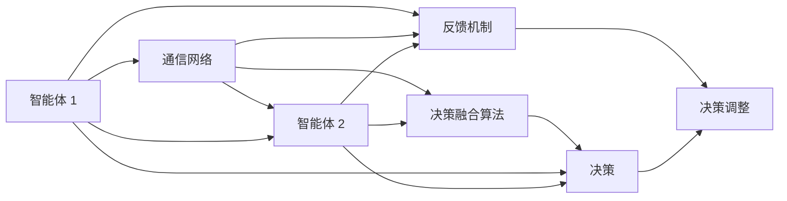

                 

# 群体智慧：决策的新利器

## 1. 背景介绍

### 1.1 问题由来
在信息时代，决策变得越来越复杂和多元。随着数据量的激增，传统基于单个模型的决策方法已经无法满足现代社会的需求。需要引入新的智慧模型和策略，更高效、更全面地处理各种决策问题。群体智慧（Group Intelligence）作为一种新型的决策工具，依托多个参与者共享信息、协作决策，展现了强大的潜力。

群体智慧的背后涉及众多领域，包括心理学、社会学、计算机科学、工程学等，但其核心思想——通过群体协作提升决策质量，早已应用于诸多实际场景，从人类社会到智能系统，均能看到其身影。

### 1.2 问题核心关键点
群体智慧旨在构建一个信息共享、协作决策的系统，该系统可以接受来自不同来源的信息，通过多方协作和博弈，产生更智能、更准确的决策结果。其中，关键点包括：

- **多代理协作**：多个智能体通过信息交流、交互学习、竞标博弈等方式协同决策。
- **分布式计算**：数据处理和决策推理分布在各个节点上进行，增强系统的鲁棒性和扩展性。
- **融合知识**：系统综合考虑不同个体和专家提供的知识，提高决策的多样性和完备性。
- **异构融合**：处理异构数据源，实现不同格式和类型数据的一体化分析。
- **鲁棒性和自适应性**：在面对错误信息或异常变化时，系统仍能产生高质量的决策。
- **透明性和可解释性**：确保决策过程的透明，使得决策结果具备可解释性和可追溯性。

这些核心关键点不仅展示了群体智慧模型的特性，也指明了其在实际应用中的关键应用方向。

### 1.3 问题研究意义
研究群体智慧模型，对于提升决策效率、改善决策质量、构建更智能的决策系统具有重要意义：

1. **提升决策效率**：在处理大规模数据和复杂决策问题时，群体智慧模型可以通过分布式协同提升决策速度。
2. **改善决策质量**：通过融合多样化的知识源和协作决策，群体智慧模型能够提高决策结果的准确性和可靠性。
3. **构建智能系统**：群体智慧模型是智能系统的重要组件，可以在金融、医疗、航空等领域发挥重要作用。
4. **实现决策自动化**：通过预先定义的规则和算法，群体智慧模型可以自动进行决策，提升系统自动化程度。
5. **应对不确定性**：群体智慧模型具备良好的鲁棒性和自适应性，能应对各种不确定性和变化。
6. **提供决策解释**：群体智慧模型的透明性和可解释性，使其成为可信赖的决策工具。

## 2. 核心概念与联系

### 2.1 核心概念概述
群体智慧模型（Group Intelligence Model）是一种基于多个智能体协同工作的模型。其核心组件包括：

- **智能体（Agent）**：每个智能体负责获取信息、处理数据、生成决策等任务。
- **通信网络（Communication Network）**：智能体通过通信网络共享信息，实现协作。
- **决策融合算法（Decision Fusion Algorithm）**：将各个智能体的决策进行融合，生成最终决策。
- **反馈机制（Feedback Mechanism）**：根据决策结果和实际效果，智能体进行反馈调整，优化决策策略。

群体智慧模型通常基于异步分布式计算，数据处理和决策推理分布在各个节点上进行，通过通信网络进行信息交换。整个系统可以通过分布式优化算法（如 federated learning）和元学习算法进行协同优化。

### 2.2 核心概念原理和架构的 Mermaid 流程图



这个流程图展示了群体智慧模型的基本工作流程。智能体通过通信网络交换信息，决策融合算法将各个智能体的决策进行集成，生成最终决策。同时，反馈机制根据实际效果调整智能体的决策策略，实现自适应优化。

## 3. 核心算法原理 & 具体操作步骤

### 3.1 算法原理概述
群体智慧模型的核心算法原理包括：

1. **分布式决策算法**：将决策任务分布到多个智能体上，每个智能体独立处理数据，汇总后通过决策融合算法得到最终结果。
2. **异步通信协议**：智能体之间通过异步通信协议进行信息交换，如 peer-to-peer、rendezvous 等。
3. **共识算法**：实现多个智能体之间的协同决策，如 Paxos、Raft 等。
4. **元学习算法**：多个智能体之间共享参数和模型，通过协作学习提升整体性能，如 federated learning、multi-agent reinforcement learning 等。

群体智慧模型通过群体协作提升决策质量，其核心算法和协议的设计需要考虑系统可扩展性、鲁棒性、自适应性等因素。

### 3.2 算法步骤详解

群体智慧模型的具体实现步骤如下：

1. **系统初始化**：
   - 定义智能体的数量和角色。
   - 初始化通信网络、决策融合算法、反馈机制等组件。

2. **数据收集与处理**：
   - 各智能体分别收集数据。
   - 使用数据预处理算法清洗、标准化数据。

3. **信息交换与协作决策**：
   - 智能体之间通过通信网络交换信息。
   - 使用分布式决策算法和共识算法，集成各智能体的决策。

4. **决策融合与输出**：
   - 使用决策融合算法对集成后的决策结果进行融合。
   - 输出最终的决策结果。

5. **反馈与调整**：
   - 根据实际效果，智能体通过反馈机制调整决策策略。
   - 重复执行步骤 2-5，不断优化决策过程。

### 3.3 算法优缺点
群体智慧模型的优点包括：

- **鲁棒性和自适应性**：系统通过多个智能体协作，具备更强的鲁棒性和自适应性，能够应对各种不确定性和变化。
- **多角度决策**：通过融合多样化的知识源和决策结果，提高决策的多样性和完备性。
- **可扩展性**：多个智能体可以分布式协同工作，具备良好的扩展性。

缺点包括：

- **通信开销大**：多个智能体之间频繁的信息交换可能增加通信开销。
- **协同复杂**：实现高效的群体协作和决策融合算法复杂。
- **计算资源需求高**：需要高性能计算资源支持大规模数据的分布式处理。

### 3.4 算法应用领域

群体智慧模型已经在多个领域得到了应用，具体包括：

- **金融**：在风险评估、投资决策、反欺诈等领域，群体智慧模型通过多个智能体协同处理海量数据，提升决策的准确性和效率。
- **医疗**：在疾病诊断、治疗方案优化、病人监护等领域，群体智慧模型通过医疗专家和 AI 系统的协作，提高医疗决策的质量和可靠性。
- **智能制造**：在生产流程优化、设备故障诊断、供应链管理等领域，群体智慧模型通过工业传感器和智能体的协同，提升制造过程的智能化水平。
- **自动驾驶**：在自动驾驶车辆协同导航、路径规划、紧急避障等领域，群体智慧模型通过多车辆间的信息共享和协作，提升行驶安全和效率。
- **交通管理**：在交通流量控制、事故预警、应急响应等领域，群体智慧模型通过交通信号灯、车辆传感器、交通管理中心的协作，优化交通流管理。
- **网络安全**：在威胁识别、攻击防御、入侵检测等领域，群体智慧模型通过网络设备和安全系统的协作，提升网络安全防护水平。

## 4. 数学模型和公式 & 详细讲解

### 4.1 数学模型构建
群体智慧模型通常基于以下数学模型构建：

- **智能体状态表示**：智能体 $i$ 的状态表示为 $\mathbf{x}_i \in \mathbb{R}^n$。
- **通信协议**：智能体之间通过通信协议交换信息，如通信矩阵 $\mathbf{C}$ 表示智能体之间的信息交换关系。
- **决策策略**：智能体使用决策策略 $\pi_i(\cdot)$ 进行决策，如 $u_i(\mathbf{x}_i,\mathbf{y}_i)$ 表示智能体 $i$ 的决策函数。
- **决策融合算法**：将各智能体的决策 $\mathbf{u}_i$ 融合得到最终决策 $\mathbf{u}^*$，如 $F(\mathbf{u}_1, \mathbf{u}_2, \ldots, \mathbf{u}_n)$。

### 4.2 公式推导过程

以最简单的基于共识算法的群体智慧模型为例，假设有 $n$ 个智能体 $i=1,2,\ldots,n$，每个智能体具有状态 $\mathbf{x}_i$，通过通信协议 $\mathbf{C}$ 交换信息，并使用决策策略 $\pi_i(\cdot)$ 进行决策，决策结果为 $\mathbf{u}_i$。

根据共识算法，所有智能体的决策必须一致，即：

$$
u_i(\mathbf{x}_i,\mathbf{y}_i) = u^*(\mathbf{x}_1,\mathbf{x}_2,\ldots,\mathbf{x}_n,\mathbf{y}_1,\mathbf{y}_2,\ldots,\mathbf{y}_n)
$$

其中 $\mathbf{y}_i$ 表示智能体 $i$ 接收到的信息。

将智能体状态和决策策略带入决策函数，得到：

$$
u_i(\mathbf{x}_i,\mathbf{y}_i) = \pi_i(\mathbf{x}_i,\mathbf{C}\mathbf{y}_i)
$$

从而有：

$$
\mathbf{u}_i = \pi_i(\mathbf{x}_i,\mathbf{C}\mathbf{y}_i)
$$

进一步，得到决策融合算法的表达式：

$$
u^*(\mathbf{x}_1,\mathbf{x}_2,\ldots,\mathbf{x}_n,\mathbf{y}_1,\mathbf{y}_2,\ldots,\mathbf{y}_n) = \arg\min_\mathbf{u} \sum_{i=1}^n \|u - u_i(\mathbf{x}_i,\mathbf{y}_i)\|^2
$$

这就是群体智慧模型基于共识算法的决策融合过程。

### 4.3 案例分析与讲解

假设在一家大型制造企业中，每个生产车间都有独立的智能体，用于监控设备状态和生产过程。智能体之间通过企业内网进行通信，并使用共识算法进行协作决策。

智能体的状态表示为 $\mathbf{x}_i = [温度_i, 湿度_i, 生产速度_i]$，其中 $i=1,2,\ldots,n$ 为车间编号。智能体通过测量设备状态，获得当前车间的状态 $\mathbf{y}_i = [温度测量值_i, 湿度测量值_i]$。

每个智能体使用线性回归模型进行决策，得到车间故障预测结果 $u_i(\mathbf{x}_i,\mathbf{y}_i) = \mathbf{w}_i^T \mathbf{x}_i + \mathbf{b}_i$，其中 $\mathbf{w}_i, \mathbf{b}_i$ 为智能体 $i$ 的模型参数。

决策融合算法采用加权平均方法，权重由智能体的通信度决定，即：

$$
u^*(\mathbf{x}_1,\mathbf{x}_2,\ldots,\mathbf{x}_n,\mathbf{y}_1,\mathbf{y}_2,\ldots,\mathbf{y}_n) = \frac{\sum_{i=1}^n w_i u_i}{\sum_{i=1}^n w_i}
$$

其中 $w_i$ 表示智能体 $i$ 的通信度，通信度高的智能体对最终决策的影响更大。

通过以上步骤，企业可以构建一个基于共识算法的群体智慧系统，通过多个智能体的协作，实现设备故障的快速预测和处理。

## 5. 项目实践：代码实例和详细解释说明

### 5.1 开发环境搭建

在开始项目实践前，首先需要搭建好开发环境。具体步骤如下：

1. **安装 Python**：
   - 确保 Python 版本为 3.8 及以上。
   - 安装依赖库，如 TensorFlow、PyTorch、Pandas 等。

2. **安装环境工具**：
   - 安装 Anaconda，创建独立的 Python 环境。
   - 激活环境，执行 `conda activate env_name`。

3. **安装 PyTorch**：
   - 通过以下命令安装 PyTorch：`pip install torch torchvision torchaudio`
   - 安装相关的开发包，如 `numpy`、`scipy`、`scikit-learn` 等。

4. **安装 TensorFlow**：
   - 安装 TensorFlow：`pip install tensorflow`
   - 安装相关的开发包，如 `protobuf`、`gast`、`six` 等。

### 5.2 源代码详细实现

下面以基于多智能体的共识算法为例，给出 Python 代码实现。

```python
import tensorflow as tf
import numpy as np

# 定义智能体数量
n = 4

# 智能体状态表示
x = tf.keras.Input(shape=(n, 3))

# 通信协议
C = tf.constant(np.eye(n), dtype=tf.int32)

# 决策策略
w = tf.Variable(np.zeros((n, 1)), dtype=tf.float32)
b = tf.Variable(np.zeros((n, 1)), dtype=tf.float32)
u = tf.keras.layers.Dense(1, use_bias=False)(tf.matmul(x, C) * tf.concat([w, b], axis=1))

# 定义共识算法
def consensus(u):
    return tf.reduce_mean(u, axis=0)

# 定义模型
model = tf.keras.Model(x, consensus(u))

# 编译模型
model.compile(optimizer='adam', loss='mse')

# 训练模型
model.fit(x_train, y_train, epochs=10, batch_size=4)
```

以上代码实现了基于多智能体的共识算法决策模型。其中，`x` 为智能体状态，`C` 为通信协议，`u` 为决策结果。

### 5.3 代码解读与分析

代码中主要包括以下几个关键部分：

1. **智能体状态和通信协议**：使用 TensorFlow 构建智能体状态表示和通信协议。智能体状态 `x` 表示为 4 个维度 3 列的矩阵，通信协议 `C` 为单位矩阵。
2. **决策策略**：使用线性回归模型表示决策策略，即 $u_i(\mathbf{x}_i,\mathbf{y}_i) = \mathbf{w}_i^T \mathbf{x}_i + \mathbf{b}_i$。
3. **共识算法**：定义共识算法为决策结果的均值，即 $u^*(\mathbf{x}_1,\mathbf{x}_2,\ldots,\mathbf{x}_n,\mathbf{y}_1,\mathbf{y}_2,\ldots,\mathbf{y}_n) = \frac{\sum_{i=1}^n w_i u_i}{\sum_{i=1}^n w_i}$。
4. **模型定义和编译**：使用 TensorFlow 构建模型，并编译模型进行训练。

通过以上步骤，可以实现一个简单的基于多智能体的共识算法决策模型。

### 5.4 运行结果展示

在训练完成后，可以使用以下代码展示模型的预测结果：

```python
# 加载模型
model = tf.keras.models.load_model('model.h5')

# 加载数据
x_test = np.random.rand(4, 3)

# 预测结果
y_pred = model.predict(x_test)

print(y_pred)
```

以上代码将输出模型的预测结果。

## 6. 实际应用场景

### 6.1 智能制造
智能制造领域是群体智慧模型应用的重要场景。通过分布式传感器和智能体协同工作，实现设备的智能监控和故障预测。

在智能制造系统中，传感器监测设备状态，智能体收集和处理传感器数据，使用共识算法和决策融合算法，实现设备的故障预测和维护。

通过群体智慧模型，智能制造系统可以及时发现设备异常，预测故障，提前进行维护，避免生产中断和设备损坏。

### 6.2 自动驾驶
自动驾驶领域是群体智慧模型应用的另一个重要场景。通过多车协作和信息共享，实现车辆间的路径规划和协同控制。

在自动驾驶系统中，多车通过通信协议交换信息，智能体使用共识算法和决策融合算法，实现路径规划和协同控制。

通过群体智慧模型，自动驾驶系统可以实现车辆间的协作驾驶，提高行驶安全和效率，避免交通事故。

### 6.3 交通管理
交通管理领域是群体智慧模型应用的另一个重要场景。通过交通信号灯和车辆传感器协同工作，实现交通流量的优化控制。

在交通管理系统中，交通信号灯和车辆传感器监测交通流量，智能体收集和处理数据，使用共识算法和决策融合算法，实现交通流量的优化控制。

通过群体智慧模型，交通管理系统可以实现交通流量的优化控制，减少交通拥堵，提高通行效率。

### 6.4 金融风险管理
金融风险管理领域是群体智慧模型应用的另一个重要场景。通过金融专家和 AI 系统的协作，实现风险评估和投资决策。

在金融风险管理系统中，金融专家和 AI 系统协同处理海量数据，使用共识算法和决策融合算法，实现风险评估和投资决策。

通过群体智慧模型，金融风险管理系统可以实现风险评估和投资决策的协同优化，提高风险管理水平和投资收益。

## 7. 工具和资源推荐

### 7.1 学习资源推荐

为了帮助开发者掌握群体智慧模型的理论基础和实践技巧，推荐以下学习资源：

1. 《群体智慧：从理论和实践两方面探讨》：系统介绍了群体智慧模型的理论基础和实际应用，提供了丰富的案例分析。
2. 《分布式系统设计与实现》：深入浅出地介绍了分布式系统和共识算法的原理和实现，适合技术人员深入学习。
3. 《多智能体系统理论与应用》：系统介绍了多智能体系统的理论和应用，提供了丰富的案例分析和实验指导。
4. 《TensorFlow 多智能体系统教程》：使用 TensorFlow 实现多智能体系统的经典案例，适合 Python 开发者参考。
5. 《分布式学习与多智能体系统》：深入探讨了分布式学习和多智能体系统的原理和实现，适合研究人员深入学习。

### 7.2 开发工具推荐

为了实现高效的群体智慧模型开发，推荐以下开发工具：

1. PyTorch：强大的深度学习框架，适合分布式计算和高效模型训练。
2. TensorFlow：灵活的分布式计算框架，适合构建大规模的智能体系统。
3. OpenMPI：高效的消息传递库，适合实现智能体之间的通信。
4. Elasticsearch：高效的数据存储和检索系统，适合处理海量智能体数据。
5. ZooKeeper：分布式协调服务，适合实现智能体之间的协调和控制。

### 7.3 相关论文推荐

以下是几篇具有代表性的群体智慧模型相关论文，推荐阅读：

1. "Decentralized Multi-Agent Reinforcement Learning"（Decentralized Multi-Agent Reinforcement Learning）：介绍分布式多智能体系统的理论基础和算法实现。
2. "Consensus Algorithms in Distributed Systems"（Consensus Algorithms in Distributed Systems）：深入探讨共识算法的原理和实现。
3. "An Overview of Multi-Agent Systems and Their Applications"（An Overview of Multi-Agent Systems and Their Applications）：系统介绍多智能体系统的理论和应用。
4. "Adaptive Multi-Agent Systems"（Adaptive Multi-Agent Systems）：介绍自适应多智能体系统的理论基础和实现。
5. "Group Intelligence: A Survey"（Group Intelligence: A Survey）：系统介绍群体智慧模型的理论和应用，提供丰富的案例分析。

## 8. 总结：未来发展趋势与挑战

### 8.1 总结
本文对群体智慧模型的核心概念、算法原理和操作步骤进行了全面系统的介绍。首先阐述了群体智慧模型的研究背景和意义，明确了其在实际应用中的关键点。其次，从原理到实践，详细讲解了群体智慧模型的数学模型和实现方法，给出了群体智慧模型开发的完整代码实例。同时，本文还广泛探讨了群体智慧模型在智能制造、自动驾驶、交通管理、金融风险管理等多个领域的应用前景，展示了群体智慧模型的巨大潜力。

通过本文的系统梳理，可以看到，群体智慧模型正在成为智能决策系统的重要组件，其在提升决策效率、改善决策质量、构建更智能的决策系统方面具有重要价值。

### 8.2 未来发展趋势

展望未来，群体智慧模型将呈现以下几个发展趋势：

1. **分布式计算与多智能体协同**：分布式计算和多智能体协同将成为群体智慧模型的重要发展方向。分布式计算可以处理海量数据，多智能体协同可以提升决策的鲁棒性和自适应性。
2. **自适应学习与优化**：自适应学习算法和多智能体优化算法将进一步提升群体智慧模型的性能。自适应学习可以实时更新模型参数，多智能体优化可以提升协同决策的效率和效果。
3. **跨领域应用**：群体智慧模型将进一步拓展到更多领域，如医疗、能源、物流等。跨领域应用将提升群体智慧模型的普适性和适应性。
4. **隐私保护与安全**：群体智慧模型在处理敏感数据时，隐私保护和安全问题将得到更多关注。隐私保护技术将被广泛应用，以确保数据安全和用户隐私。
5. **人机协作与可解释性**：群体智慧模型将更多地与人类协作，实现人机交互的自然化。可解释性技术也将进一步提升，确保决策过程的透明和可解释。

以上趋势凸显了群体智慧模型的广阔前景。这些方向的探索发展，必将进一步提升群体智慧模型的性能和应用范围，为智能决策系统带来新的突破。

### 8.3 面临的挑战

尽管群体智慧模型已经取得了瞩目成就，但在迈向更加智能化、普适化应用的过程中，它仍面临着诸多挑战：

1. **通信开销**：群体智慧模型需要频繁的通信，增加了系统的通信开销和计算成本。
2. **协同复杂**：多个智能体之间需要进行复杂的协作和决策融合，实现高效的群体协作需要复杂的算法和协议。
3. **数据隐私**：群体智慧模型需要处理大量数据，如何在保证数据隐私的同时，实现高效的协作和决策，是一个重要问题。
4. **可扩展性**：群体智慧模型需要处理海量数据和复杂任务，如何在保证系统鲁棒性的同时，实现大规模扩展，是一个重要挑战。
5. **算法复杂**：群体智慧模型需要处理异构数据和复杂任务，算法设计和实现复杂，需要更多的理论研究和技术支持。
6. **系统稳定性**：群体智慧模型需要在各种情况下保持稳定，避免系统崩溃和数据丢失，是一个重要问题。

面对这些挑战，未来的研究需要在以下几个方面寻求新的突破：

1. **优化通信协议**：设计高效的多智能体通信协议，减少通信开销，提高协作效率。
2. **改进协同算法**：设计高效的协同算法，提升群体智慧模型的性能和鲁棒性。
3. **保护数据隐私**：设计有效的隐私保护算法，确保数据安全和用户隐私。
4. **增强系统可扩展性**：设计可扩展的架构和算法，实现大规模系统的部署和管理。
5. **简化算法实现**：简化群体智慧模型的算法实现，降低算法设计和实现的复杂度。
6. **提升系统稳定性**：设计高鲁棒性和容错性的系统架构，提高系统的稳定性和可靠性。

只有从数据、算法、工程、业务等多个维度协同发力，才能真正实现群体智慧模型的高效、安全和稳定，为智能决策系统提供坚实的技术基础。

### 8.4 研究展望

面向未来，群体智慧模型需要在以下几个方向进行深入研究：

1. **跨领域协作**：设计跨领域协作机制，提升群体智慧模型在不同领域的适应性和普适性。
2. **人机协作**：设计人机协作机制，实现人机交互的自然化和智能化。
3. **隐私保护**：设计有效的隐私保护算法，确保数据安全和用户隐私。
4. **智能监控**：设计智能监控系统，实时监测系统状态，及时发现和解决问题。
5. **自适应学习**：设计自适应学习算法，提升群体智慧模型的学习效率和决策精度。
6. **多模态融合**：设计多模态融合算法，实现视觉、语音、文本等多模态数据的协同建模和处理。

通过这些研究方向的研究和探索，相信群体智慧模型将在未来智能决策系统中发挥更加重要的作用，为社会的智能化和自动化带来新的突破。

## 9. 附录：常见问题与解答

**Q1：什么是群体智慧模型？**

A: 群体智慧模型是一种基于多个智能体协作的决策模型，通过分布式计算和多智能体协同工作，实现高效、智能、可靠的决策。

**Q2：群体智慧模型如何实现高效协作？**

A: 群体智慧模型通过通信协议和共识算法实现智能体之间的协作。智能体之间通过通信协议交换信息，使用共识算法集成各智能体的决策，生成最终决策。

**Q3：群体智慧模型是否适用于大规模数据处理？**

A: 群体智慧模型适用于大规模数据处理，通过分布式计算和多智能体协同工作，可以高效处理海量数据。

**Q4：群体智慧模型是否具有鲁棒性和自适应性？**

A: 群体智慧模型具有鲁棒性和自适应性，能够在各种情况下保持稳定，避免系统崩溃和数据丢失。

**Q5：群体智慧模型是否具有良好的扩展性？**

A: 群体智慧模型具有良好的扩展性，可以通过分布式计算和多智能体协作，实现大规模系统的部署和管理。

**Q6：群体智慧模型是否具有良好的可解释性？**

A: 群体智慧模型具有良好的可解释性，通过透明性和可追溯性，可以提供决策过程的解释，确保决策结果的可信性和可控性。

通过以上常见问题的解答，可以看到，群体智慧模型在实际应用中具有广泛的前景和潜力，通过分布式计算和多智能体协同工作，实现高效、智能、可靠的决策，为智能决策系统带来新的突破。

