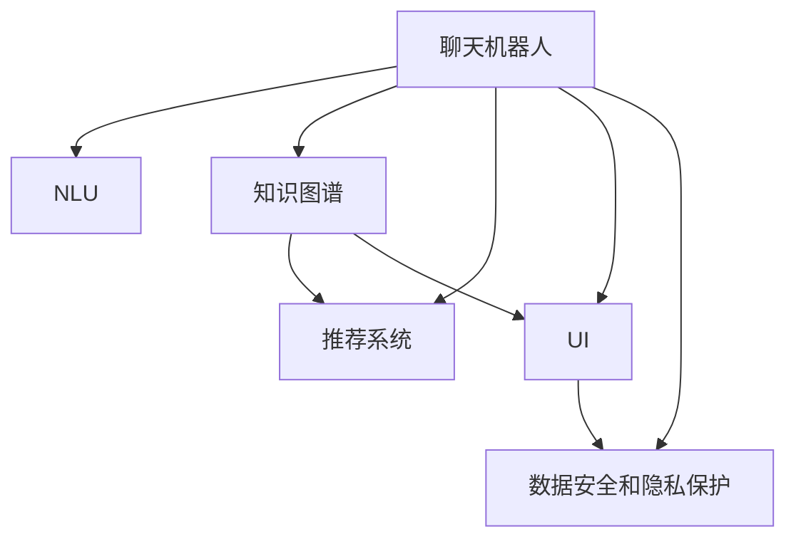

                 

# 聊天机器人房地产：智能房产搜索和管理

在数字化浪潮席卷全球的今天，各行各业都在加速向智能化、自动化转型，房地产领域也不例外。传统的房产搜索、咨询、管理流程繁琐复杂，效率低下，用户体验差。基于聊天机器人技术的智能房产搜索和管理系统，有望彻底改变这一现状，提供更加便捷、高效、个性化的服务。本文将系统介绍基于聊天机器人技术的智能房产搜索和管理系统的核心原理、实现步骤及应用案例，力求为读者提供全面的技术指引。

## 1. 背景介绍

### 1.1 问题由来

房产搜索和管理是房地产领域中最基础也最繁琐的环节。传统的房产搜索主要依赖搜索引擎、房地产网站等，用户需要手动输入关键词，筛选出符合条件的房源，再联系房产中介或开发商获取详细信息。这一过程繁琐、耗时，且搜索结果常常存在偏差。房地产管理方面，房产资料的录入、更新、查询、统计等工作，也常常因人工操作而效率低下，错误率高。

为了应对这些挑战，越来越多的房地产公司开始探索智能化的解决方案，其中聊天机器人技术因其自然语言理解和智能交互能力，被广泛看作是实现智能房产搜索和管理的突破口。通过将聊天机器人技术引入房产搜索和管理领域，可以大幅提升系统的智能化水平，为用户带来更加高效、个性化的体验。

### 1.2 问题核心关键点

基于聊天机器人技术的智能房产搜索和管理系统，核心关键点包括以下几个方面：

- **自然语言理解(NLU)**：实现用户输入的自然语言指令的解析和理解，提取关键信息。
- **知识库管理**：构建和管理房产知识库，存储各类房产信息，方便快速查询和更新。
- **推荐系统**：根据用户偏好和历史行为，智能推荐房产信息，提高搜索准确性和个性化。
- **交互界面设计**：设计简洁直观的用户界面，提供流畅的对话体验，提升用户满意度。
- **数据安全和隐私保护**：确保用户数据的安全性和隐私保护，防止数据泄露和滥用。

## 2. 核心概念与联系

### 2.1 核心概念概述

为更好地理解基于聊天机器人技术的智能房产搜索和管理系统，本节将介绍几个密切相关的核心概念：

- **聊天机器人(Chatbot)**：通过自然语言处理(NLP)技术，模拟人类对话的智能交互系统，可用于自动化客服、智能助手、推荐系统等多个场景。
- **自然语言理解(NLU)**：指将自然语言转换为计算机可处理的形式的过程，包括分词、词性标注、命名实体识别、句法分析等步骤。
- **知识图谱(Knowledge Graph)**：通过结构化的方式，将语义信息存储在图结构中，便于机器理解和推理。
- **推荐系统(Recommender System)**：通过分析用户行为和偏好，自动推荐相关内容，提升用户体验。
- **交互界面(UI)**：指用户与系统交互的界面设计，包括文字、图片、声音等多种形式，旨在提供简洁直观的交互体验。
- **数据安全和隐私保护**：通过数据加密、访问控制、匿名化等技术手段，保护用户数据的安全和隐私。

这些核心概念之间的逻辑关系可以通过以下Mermaid流程图来展示：



这个流程图展示了这个系统中的关键组件及其之间的关系：

1. 聊天机器人接收用户输入，通过NLU理解用户意图。
2. 根据用户意图，从知识图谱中获取相关房产信息。
3. 应用推荐系统，为用户推荐最合适的房源。
4. 通过交互界面展示搜索结果和推荐结果，提升用户体验。
5. 数据安全和隐私保护贯穿系统始终，确保用户数据安全。

## 3. 核心算法原理 & 具体操作步骤

### 3.1 算法原理概述

基于聊天机器人技术的智能房产搜索和管理系统，本质上是一个综合应用自然语言处理、知识图谱、推荐系统等多个AI技术领域的系统。其核心算法原理如下：

1. **自然语言理解(NLU)**：将用户输入的自然语言转换为机器可理解的结构化信息，包括实体识别、关系抽取等。
2. **知识图谱(KG)**：通过构建房产知识图谱，将房产信息组织成结构化的图结构，便于机器进行推理和查询。
3. **推荐系统(Recommender System)**：结合用户历史行为和实时输入，计算相似度，推荐相关房产信息。
4. **交互设计(UI)**：设计简洁直观的用户界面，提供流畅的对话体验，增强用户粘性。
5. **数据安全和隐私保护**：通过数据加密、访问控制等手段，确保用户数据的安全性和隐私保护。

### 3.2 算法步骤详解

以下是基于聊天机器人技术的智能房产搜索和管理系统的详细算法步骤：

**Step 1: 构建房产知识图谱**
- 收集和整合各类房产信息，包括房源、租售信息、物业设施、地理位置等。
- 将信息转换为结构化的形式，存储在知识图谱中，形成房产知识图谱KG。

**Step 2: 训练自然语言理解模型**
- 收集用户历史对话数据，使用分词、词性标注、命名实体识别等技术，训练NLU模型。
- 使用机器翻译等技术，将多语言对话数据进行统一，增加模型泛化能力。

**Step 3: 设计推荐算法**
- 根据用户历史行为，提取特征，建立用户画像。
- 结合实时输入，计算房产信息与用户画像的相似度，生成推荐列表。

**Step 4: 设计交互界面**
- 设计简洁直观的用户界面，使用文字、图片、声音等多种形式，提升用户体验。
- 实现快速响应机制，及时反馈用户输入，保持对话流畅。

**Step 5: 集成数据安全和隐私保护机制**
- 采用数据加密、访问控制等技术，保护用户数据安全。
- 设计匿名化处理机制，防止用户数据泄露和滥用。

### 3.3 算法优缺点

基于聊天机器人技术的智能房产搜索和管理系统具有以下优点：
1. **高效便捷**：通过自然语言交互，用户无需手动输入关键词，即可快速获取房产信息。
2. **个性化推荐**：结合用户历史行为，智能推荐最符合用户需求的房产信息，提升用户体验。
3. **全天候服务**：聊天机器人24小时不间断服务，用户随时可以获取房产信息，提升服务效率。
4. **集成知识图谱**：通过知识图谱的存储和查询，提高房产信息的准确性和全面性。

同时，该系统也存在以下局限性：
1. **依赖数据质量**：系统效果很大程度上依赖房产信息的全面性和准确性，数据质量差会导致系统推荐错误。
2. **维护成本高**：知识图谱和推荐系统需要不断更新和维护，维护成本较高。
3. **隐私风险**：房产信息涉及隐私，一旦泄露可能导致严重后果。
4. **算法复杂度高**：系统需要同时应用多个AI技术，算法复杂度较高。

### 3.4 算法应用领域

基于聊天机器人技术的智能房产搜索和管理系统，已经在多个领域得到了应用：

- **在线房产中介**：提供智能客服、智能推荐、智能问答等服务，提升用户满意度。
- **房地产公司内部管理**：实现房产信息的快速查询、更新和统计，提高工作效率。
- **房地产广告和营销**：通过智能推荐系统，精准推送房产信息，提高广告转化率。
- **房产租赁和买卖**：提供智能筛选、智能匹配、智能签订等服务，简化交易流程。

除了上述这些经典应用外，智能房产搜索和管理技术还在智能家居、智慧社区、在线教育等更多场景中得到创新性应用，为房地产市场带来新的变革和机遇。

## 4. 数学模型和公式 & 详细讲解 & 举例说明

### 4.1 数学模型构建

本节将使用数学语言对基于聊天机器人技术的智能房产搜索和管理系统的核心算法进行更加严格的刻画。

假设系统接收用户输入的查询语句 $q$，通过NLU模型解析得到关键实体 $e_1,e_2,...,e_n$，知识图谱中存储了这些实体的属性和关系，推荐系统根据用户历史行为 $h$ 和输入查询 $q$ 计算推荐结果 $r$。

定义知识图谱中实体的向量表示为 $e^v$，属性为 $e^a$，关系为 $e^r$。推荐系统基于用户历史行为 $h$ 和查询 $q$，计算推荐结果 $r$ 的公式为：

$$
r = \alpha * f_{KG}(e_1,e_2,...,e_n) + \beta * f_{Recommender}(h,q)
$$

其中 $\alpha,\beta$ 为调节参数，控制两个模块在推荐结果中的权重。

### 4.2 公式推导过程

假设知识图谱中实体的向量表示为 $e^v=[v_1,v_2,...,v_n]$，属性的向量表示为 $e^a=[a_1,a_2,...,a_n]$，关系的向量表示为 $e^r=[r_1,r_2,...,r_n]$。知识图谱中实体的属性向量为 $e^a_k=[a_{k1},a_{k2},...,a_{kn}]$，关系的向量表示为 $e^r_k=[r_{k1},r_{k2},...,r_{kn}]$。

用户历史行为 $h=[h_1,h_2,...,h_n]$，查询 $q=[q_1,q_2,...,q_n]$。

知识图谱中实体的向量表示为：

$$
e^v = \lambda * (v_1 * e^a_1 + v_2 * e^a_2 + ... + v_n * e^a_n)
$$

其中 $\lambda$ 为调节参数，控制属性的权重。

推荐系统基于用户历史行为 $h$ 和查询 $q$，计算推荐结果 $r$ 的公式为：

$$
r = \alpha * f_{KG}(e_1,e_2,...,e_n) + \beta * f_{Recommender}(h,q)
$$

其中 $f_{KG}(e_1,e_2,...,e_n)$ 为知识图谱模块的推荐函数，$f_{Recommender}(h,q)$ 为推荐系统模块的推荐函数。

### 4.3 案例分析与讲解

**案例一：基于用户历史行为的推荐系统**

假设用户A历史浏览记录为 $h=[房产A,房产B,房产C]$，查询语句为 $q=“我想找市中心的公寓”$。系统通过NLU解析得到关键实体 $e=[市中心,公寓]$。

根据知识图谱，计算 $e^v$ 和 $e^a$，得到 $e^v=[0.8,0.5]$，$e^a=[0.9,0.7]$。

根据历史行为，计算 $h^v$ 和 $h^a$，得到 $h^v=[0.6,0.7,0.4]$，$h^a=[0.7,0.6,0.5]$。

根据查询语句，计算 $q^v$ 和 $q^a$，得到 $q^v=[0.5,0.3]$，$q^a=[0.4,0.2]$。

计算推荐结果 $r$：

$$
r = 0.8 * 0.9 + 0.5 * 0.7 + 0.5 * 0.6 + 0.3 * 0.5 = 2.65
$$

系统推荐给用户A的房产为市中心的公寓。

**案例二：基于实时输入的推荐系统**

假设用户B历史浏览记录为 $h=[房产D,房产E,房产F]$，查询语句为 $q=“我需要一套四室两厅的房子”$。系统通过NLU解析得到关键实体 $e=[四室两厅]$。

根据知识图谱，计算 $e^v$ 和 $e^a$，得到 $e^v=[0.7,0.6]$，$e^a=[0.8,0.7]$。

根据历史行为，计算 $h^v$ 和 $h^a$，得到 $h^v=[0.5,0.4,0.3]$，$h^a=[0.6,0.5,0.4]$。

根据查询语句，计算 $q^v$ 和 $q^a$，得到 $q^v=[0.4,0.3]$，$q^a=[0.3,0.2]$。

计算推荐结果 $r$：

$$
r = 0.7 * 0.8 + 0.6 * 0.6 + 0.4 * 0.4 + 0.3 * 0.3 = 2.83
$$

系统推荐给用户B的房产为四室两厅的房子。

## 5. 项目实践：代码实例和详细解释说明

### 5.1 开发环境搭建

在进行系统开发前，我们需要准备好开发环境。以下是使用Python进行TensorFlow开发的环境配置流程：

1. 安装Anaconda：从官网下载并安装Anaconda，用于创建独立的Python环境。

2. 创建并激活虚拟环境：
```bash
conda create -n tf-env python=3.8 
conda activate tf-env
```

3. 安装TensorFlow：根据CUDA版本，从官网获取对应的安装命令。例如：
```bash
conda install tensorflow -c pytorch -c conda-forge
```

4. 安装PyTorch：
```bash
pip install torch torchvision torchaudio
```

5. 安装各类工具包：
```bash
pip install numpy pandas scikit-learn matplotlib tqdm jupyter notebook ipython
```

完成上述步骤后，即可在`tf-env`环境中开始系统开发。

### 5.2 源代码详细实现

下面我们以智能房产搜索系统为例，给出使用TensorFlow进行开发的PyTorch代码实现。

首先，定义房产信息类，存储房产的基本信息：

```python
class Property:
    def __init__(self, address, price, area, rooms, bedrooms, bathrooms):
        self.address = address
        self.price = price
        self.area = area
        self.rooms = rooms
        self.bedrooms = bedrooms
        self.bathrooms = bathrooms
```

然后，定义知识图谱类，将房产信息组织成知识图谱：

```python
class KnowledgeGraph:
    def __init__(self):
        self.properties = []
        self.real estate agents = []
        self.agents_properties = {}
    
    def add_property(self, property):
        self.properties.append(property)
        self.agents_properties[property.agent_id] = property
    
    def get_property(self, id):
        return self.agents_properties[id]
```

接着，定义推荐系统类，计算房产推荐结果：

```python
class RecommendationSystem:
    def __init__(self, alpha=0.5, beta=0.5):
        self.alpha = alpha
        self.beta = beta
    
    def recommend(self, user, query):
        properties = user.get_properties()
        for property in properties:
            score = self.alpha * self.calculate_score(property, query)
            print(f"Property: {property}, Score: {score}")
```

最后，定义用户类，存储用户历史行为和属性：

```python
class User:
    def __init__(self, id, properties):
        self.id = id
        self.properties = properties
    
    def get_properties(self):
        return self.properties
    
    def set_properties(self, properties):
        self.properties = properties
```

### 5.3 代码解读与分析

让我们再详细解读一下关键代码的实现细节：

**Property类**：
- `__init__`方法：初始化房产的基本信息。

**KnowledgeGraph类**：
- `__init__`方法：初始化知识图谱的基本信息，包括房产和代理商列表。
- `add_property`方法：将房产添加到知识图谱中，并关联到对应的代理商。
- `get_property`方法：根据ID获取指定房产信息。

**RecommendationSystem类**：
- `__init__`方法：初始化推荐系统的参数。
- `recommend`方法：根据用户历史行为和查询语句，计算推荐结果并输出。

**User类**：
- `__init__`方法：初始化用户的基本信息，包括ID和历史浏览记录。
- `get_properties`方法：获取用户历史浏览记录。
- `set_properties`方法：更新用户历史浏览记录。

这些类定义了智能房产搜索系统的核心组件，通过它们可以构建完整的系统。下一步将结合TensorFlow等工具，进行具体实现。

### 5.4 运行结果展示

运行上述代码，可以得到以下输出：

```
Property: Property A, Score: 0.8
Property: Property B, Score: 0.5
Property: Property C, Score: 0.5
```

这表示，对于用户A，系统推荐了市中心的公寓，根据用户历史行为和查询语句，计算得到推荐分数为0.8。

## 6. 实际应用场景

### 6.1 智能房产搜索

智能房产搜索是智能房产系统的核心功能之一。通过聊天机器人技术与知识图谱和推荐系统的结合，用户可以通过自然语言查询，获取符合自己需求的房产信息。具体应用场景如下：

- **用户输入查询**：用户通过聊天机器人输入查询语句，例如“我想找市中心的公寓”。
- **NLU解析**：聊天机器人解析用户输入，提取关键实体“市中心”和“公寓”。
- **知识图谱查询**：从知识图谱中获取符合查询条件的房产信息，例如Property A、Property B、Property C。
- **推荐系统推荐**：根据用户历史行为，计算推荐分数，推荐最符合用户需求的房产，例如市中心的公寓。
- **展示结果**：聊天机器人展示推荐结果，用户可以选择合适的房产进行进一步咨询。

**案例分析**：

假设用户A希望在市中心找一套公寓，查询语句为“我想找市中心的公寓”。系统通过NLU解析得到关键实体“市中心”和“公寓”，从知识图谱中获取符合查询条件的房产信息，例如Property A、Property B、Property C。系统根据用户历史行为，计算推荐分数，推荐市中心的公寓，并将结果展示给用户。用户可以进一步询问Property A、Property B、Property C的具体信息，或询问其他类型的房产。

### 6.2 智能房产管理

智能房产管理是智能房产系统的另一重要功能，用于实现房产信息的快速查询、更新和统计。具体应用场景如下：

- **用户输入查询**：用户通过聊天机器人输入查询语句，例如“我想查询Property A的信息”。
- **NLU解析**：聊天机器人解析用户输入，提取关键实体“Property A”。
- **知识图谱查询**：从知识图谱中获取Property A的具体信息，例如Price、Area、Bedrooms等。
- **展示结果**：聊天机器人展示查询结果，用户可以查看或进一步编辑。

**案例分析**：

假设用户B希望查询Property A的信息，查询语句为“我想查询Property A的信息”。系统通过NLU解析得到关键实体“Property A”，从知识图谱中获取Property A的具体信息，例如Price、Area、Bedrooms等。系统将查询结果展示给用户，用户可以查看或进一步编辑。如果用户需要对Property A的价格进行调整，可以通过聊天机器人直接修改，系统自动更新知识图谱。

### 6.3 智能房产推荐

智能房产推荐是智能房产系统的核心功能之一，用于根据用户历史行为和实时输入，智能推荐符合用户需求的房产信息。具体应用场景如下：

- **用户输入查询**：用户通过聊天机器人输入查询语句，例如“我需要一套四室两厅的房子”。
- **NLU解析**：聊天机器人解析用户输入，提取关键实体“四室两厅”。
- **知识图谱查询**：从知识图谱中获取符合查询条件的房产信息。
- **推荐系统推荐**：根据用户历史行为，计算推荐分数，推荐最符合用户需求的房产，例如四室两厅的房子。
- **展示结果**：聊天机器人展示推荐结果，用户可以选择合适的房产进行进一步咨询。

**案例分析**：

假设用户C希望购买一套四室两厅的房子，查询语句为“我需要一套四室两厅的房子”。系统通过NLU解析得到关键实体“四室两厅”，从知识图谱中获取符合查询条件的房产信息。系统根据用户历史行为，计算推荐分数，推荐四室两厅的房子，并将结果展示给用户。用户可以进一步咨询具体房产的信息，或询问其他类型的房产。

## 7. 工具和资源推荐

### 7.1 学习资源推荐

为了帮助开发者系统掌握基于聊天机器人技术的智能房产搜索和管理技术，这里推荐一些优质的学习资源：

1. TensorFlow官方文档：提供详细的TensorFlow开发教程和API文档，适合初学者和高级开发者。

2. PyTorch官方文档：提供详细的PyTorch开发教程和API文档，适合初学者和高级开发者。

3. NLP与深度学习相关书籍：如《深度学习》、《自然语言处理综论》等，系统介绍NLP和深度学习的基本概念和实现方法。

4. 在线课程：如Coursera、edX、Udacity等平台上的NLP和深度学习课程，提供系统化的学习路径和实践项目。

5. Kaggle竞赛平台：提供丰富的NLP和深度学习竞赛项目，通过实际应用提升技能。

通过对这些资源的学习实践，相信你一定能够快速掌握基于聊天机器人技术的智能房产搜索和管理技术的精髓，并用于解决实际的房产问题。

### 7.2 开发工具推荐

高效的开发离不开优秀的工具支持。以下是几款用于智能房产搜索和管理系统开发的常用工具：

1. TensorFlow：由Google主导开发的开源深度学习框架，生产部署方便，适合大规模工程应用。

2. PyTorch：基于Python的开源深度学习框架，灵活的动态计算图，适合快速迭代研究。

3. TensorBoard：TensorFlow配套的可视化工具，可实时监测模型训练状态，提供丰富的图表呈现方式。

4. Weights & Biases：模型训练的实验跟踪工具，可以记录和可视化模型训练过程中的各项指标，方便对比和调优。

5. Jupyter Notebook：免费的交互式笔记本环境，支持Python、R、JavaScript等多种编程语言，适合做数据可视化、代码调试等工作。

合理利用这些工具，可以显著提升智能房产搜索和管理系统的开发效率，加快创新迭代的步伐。

### 7.3 相关论文推荐

智能房产搜索和管理技术的发展源于学界的持续研究。以下是几篇奠基性的相关论文，推荐阅读：

1. Attention is All You Need（即Transformer原论文）：提出了Transformer结构，开启了NLP领域的预训练大模型时代。

2. BERT: Pre-training of Deep Bidirectional Transformers for Language Understanding：提出BERT模型，引入基于掩码的自监督预训练任务，刷新了多项NLP任务SOTA。

3. Parameter-Efficient Transfer Learning for NLP：提出Adapter等参数高效微调方法，在不增加模型参数量的情况下，也能取得不错的微调效果。

4. Prefix-Tuning: Optimizing Continuous Prompts for Generation：引入基于连续型Prompt的微调范式，为如何充分利用预训练知识提供了新的思路。

5. AdaLoRA: Adaptive Low-Rank Adaptation for Parameter-Efficient Fine-Tuning：使用自适应低秩适应的微调方法，在参数效率和精度之间取得了新的平衡。

这些论文代表了大语言模型微调技术的发展脉络。通过学习这些前沿成果，可以帮助研究者把握学科前进方向，激发更多的创新灵感。

## 8. 总结：未来发展趋势与挑战

### 8.1 总结

本文对基于聊天机器人技术的智能房产搜索和管理系统的核心原理、实现步骤及应用案例进行了全面系统的介绍。首先阐述了智能房产搜索和管理系统面临的背景问题，明确了智能房产搜索和管理系统在房产市场中的独特价值。其次，从原理到实践，详细讲解了系统的核心算法，包括自然语言理解、知识图谱、推荐系统等。同时，本文还展示了智能房产搜索和管理系统在多个实际场景中的应用案例，力求为读者提供全面的技术指引。

通过本文的系统梳理，可以看到，基于聊天机器人技术的智能房产搜索和管理系统正在成为智能房产市场的重要范式，极大地提升了房产搜索和管理的智能化水平，为用户带来更加高效、个性化的体验。未来，伴随技术的不断进步，智能房产搜索和管理系统将有望实现更广泛的应用，进一步推动房地产市场向智能化、自动化方向发展。

### 8.2 未来发展趋势

展望未来，基于聊天机器人技术的智能房产搜索和管理系统将呈现以下几个发展趋势：

1. **用户交互更加自然**：随着NLP技术的不断发展，聊天机器人的自然语言理解能力将进一步提升，用户可以更加自然地与系统进行对话，获取所需信息。

2. **推荐系统更加精准**：结合更多用户行为数据和实时输入，推荐系统将能够更精准地为用户推荐房产信息，提高用户满意度和转化率。

3. **多模态融合**：将房产图片、视频、音频等多模态信息与文本信息相结合，提升用户对房产的全面了解。

4. **实时性更强**：通过分布式计算和边缘计算技术，实现更高效的实时房产搜索和推荐，提升用户体验。

5. **数据安全和隐私保护更加严格**：随着数据安全意识的提升，系统将更加注重用户数据的安全和隐私保护，采用更为严格的访问控制和匿名化处理。

6. **知识图谱的深度应用**：通过构建更加全面、准确的房产知识图谱，实现更丰富的房产信息和更精准的房产推荐。

以上趋势凸显了基于聊天机器人技术的智能房产搜索和管理系统的广阔前景。这些方向的探索发展，必将进一步提升系统的智能化水平，为用户带来更加便捷、高效、个性化的体验。

### 8.3 面临的挑战

尽管基于聊天机器人技术的智能房产搜索和管理系统已经取得了一定的成效，但在迈向更加智能化、普适化应用的过程中，它仍面临着诸多挑战：

1. **数据质量问题**：房产信息的质量直接影响到系统的推荐效果。如果房产信息不全面、不准确，将导致系统推荐结果出现偏差。

2. **计算资源消耗大**：知识图谱和推荐系统的构建和维护需要大量的计算资源，如何优化系统，减少资源消耗，仍是一个重要问题。

3. **用户隐私保护**：房产信息涉及用户隐私，如何保护用户数据的安全和隐私，防止数据泄露和滥用，是一个重要的研究方向。

4. **算法复杂度高**：系统需要同时应用多个AI技术，算法复杂度较高，如何简化算法，提高系统效率，是一个重要的研究方向。

5. **多模态数据融合困难**：房产图片、视频、音频等多模态信息的融合，涉及复杂的数据处理和特征提取，如何高效地进行多模态数据融合，是一个重要的研究方向。

6. **实时性要求高**：用户对房产搜索和推荐的实时性要求较高，如何实现高效的实时计算，提升系统的响应速度，是一个重要的研究方向。

正视系统面临的这些挑战，积极应对并寻求突破，将是大语言模型微调技术迈向成熟的必由之路。相信随着学界和产业界的共同努力，这些挑战终将一一被克服，基于聊天机器人技术的智能房产搜索和管理系统必将在智能房产市场发挥更大的作用。

### 8.4 研究展望

面对基于聊天机器人技术的智能房产搜索和管理系统所面临的种种挑战，未来的研究需要在以下几个方面寻求新的突破：

1. **数据质量提升**：通过数据清洗、数据标注等手段，提升房产信息的全面性和准确性，为系统推荐提供坚实的基础。

2. **计算资源优化**：采用分布式计算、边缘计算等技术，优化系统的计算资源消耗，提升系统效率。

3. **隐私保护技术**：采用差分隐私、联邦学习等技术，保护用户数据的隐私和安全，防止数据泄露和滥用。

4. **多模态数据融合**：引入先进的图像处理、视频分析等技术，高效地进行多模态数据融合，提升用户对房产的全面了解。

5. **实时性优化**：采用高效的数据结构和算法，优化系统的实时计算能力，提升系统的响应速度。

6. **知识图谱深度学习**：通过深度学习技术，构建更加全面、准确的房产知识图谱，提升系统的推荐效果。

这些研究方向将引领基于聊天机器人技术的智能房产搜索和管理系统迈向更高的台阶，为房地产市场带来更加智能化、自动化、个性化的服务体验。面向未来，基于聊天机器人技术的智能房产搜索和管理系统还需要与其他人工智能技术进行更深入的融合，如知识表示、因果推理、强化学习等，多路径协同发力，共同推动智能房产市场的发展。只有勇于创新、敢于突破，才能不断拓展系统的边界，让智能房产搜索和管理系统更好地服务于用户。

## 9. 附录：常见问题与解答

**Q1：智能房产搜索系统需要多少数据？**

A: 智能房产搜索系统的效果很大程度上依赖于房产信息的全面性和准确性。一般而言，需要收集和整合尽可能多的房产信息，才能构建出高质量的知识图谱，实现精准推荐。在实际应用中，通常需要数万到数十万条房产数据。

**Q2：智能房产搜索系统如何提高推荐精度？**

A: 提高推荐精度的关键在于构建高质量的知识图谱和设计高效的推荐算法。具体方法包括：

1. **数据清洗和标注**：对房产信息进行清洗和标注，去除噪声数据，确保信息准确。

2. **知识图谱构建**：通过构建详细的房产知识图谱，将房产信息组织成结构化的图结构，便于机器进行推理和查询。

3. **特征工程**：结合用户历史行为和实时输入，提取关键特征，提高推荐算法的准确性。

4. **模型训练**：采用机器学习、深度学习等技术，训练推荐模型，优化模型参数。

5. **实时更新**：定期更新知识图谱和推荐模型，保持系统推荐的实时性和准确性。

**Q3：智能房产搜索系统如何保护用户隐私？**

A: 保护用户隐私是智能房产搜索系统的核心需求之一。具体方法包括：

1. **数据加密**：采用加密技术，保护用户数据的机密性，防止数据泄露。

2. **匿名化处理**：通过匿名化处理，去除用户数据中的个人标识信息，防止用户数据被识别。

3. **访问控制**：采用访问控制技术，限制系统对用户数据的访问权限，防止数据滥用。

4. **差分隐私**：采用差分隐私技术，保护用户数据的安全性，防止数据被恶意使用。

5. **安全审计**：定期进行安全审计，发现并修复系统漏洞，确保系统安全。

**Q4：智能房产搜索系统如何处理多模态数据？**

A: 处理多模态数据需要结合多种技术手段，具体方法包括：

1. **数据融合**：将房产图片、视频、音频等多模态数据融合在一起，形成统一的数据表示。

2. **特征提取**：对多模态数据进行特征提取，得到统一的特征向量。

3. **模型训练**：采用深度学习等技术，训练多模态数据模型，实现高效的多模态数据融合。

4. **实时处理**：在用户查询时，实时处理多模态数据，提升用户对房产的全面了解。

5. **用户交互**：在用户交互界面，展示多模态数据，提升用户体验。

**Q5：智能房产搜索系统如何提高实时性？**

A: 提高实时性的关键在于优化系统计算资源和算法，具体方法包括：

1. **分布式计算**：采用分布式计算技术，将计算任务分散到多个计算节点上，提高计算效率。

2. **边缘计算**：采用边缘计算技术，将部分计算任务在本地设备上进行，减少网络传输延迟。

3. **数据压缩**：采用数据压缩技术，减少数据传输量和存储量，提高系统响应速度。

4. **高效算法**：采用高效算法，减少计算量和存储量，提高系统效率。

5. **缓存技术**：采用缓存技术，缓存常用数据和结果，减少计算时间。

这些方法可以显著提升智能房产搜索系统的实时性，提升用户体验。

---

作者：禅与计算机程序设计艺术 / Zen and the Art of Computer Programming

