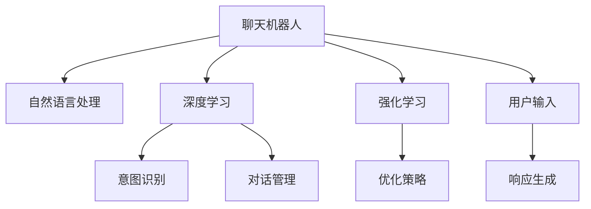

                 

# 聊天机器人生活窍门：日常问题解决方案和建议

> 关键词：聊天机器人, 生活窍门, 问题解决方案, 建议, 人工智能, 自然语言处理(NLP), 深度学习

## 1. 背景介绍

随着人工智能技术的迅猛发展，聊天机器人已经逐渐渗透到人们生活的方方面面。从简单的客服对话，到复杂的智能助手，聊天机器人通过理解和生成自然语言，提升了人们的生活效率和工作质量。然而，如何构建一个高效、智能、友好的聊天机器人，依然是一个复杂且多层次的挑战。本文旨在通过系统介绍聊天机器人的核心原理、关键技术和实际应用场景，为读者提供构建高效聊天机器人的切实建议和实际示例。

## 2. 核心概念与联系

### 2.1 核心概念概述

为更好地理解聊天机器人的工作原理和优化方向，本节将介绍几个关键概念：

- 聊天机器人(Chatbot)：通过自然语言处理(NLP)和机器学习技术，模拟人类对话的系统。主要分为基于规则的(Rule-based)和基于机器学习的(Machine Learning-based)两大类。

- 自然语言处理(NLP)：涉及语言学、计算机科学等多个领域，旨在使计算机能够理解、处理和生成人类语言。核心技术包括分词、词性标注、句法分析、语义分析、实体识别等。

- 深度学习：一种基于人工神经网络的机器学习方法，通过多层次的非线性变换，实现对复杂数据的表示和建模。在聊天机器人中，深度学习技术通常用于处理序列数据、生成对话文本等。

- 强化学习(RL)：通过与环境的交互，智能体不断优化策略，提升性能的机器学习方法。在聊天机器人中，可以通过强化学习优化对话策略，增强对话的自然性和真实性。

- 意图识别(Intent Recognition)：通过分析用户输入文本，识别用户的意图和需求，指导聊天机器人作出响应。

- 对话管理(Dialog Management)：通过跟踪对话上下文，动态调整聊天机器人的策略，确保对话流畅进行。

这些概念之间的逻辑关系可以通过以下Mermaid流程图来展示：



这个流程图展示了一个典型聊天机器人工作流程：

1. 用户输入问题
2. 聊天机器人对问题进行意图识别和对话管理，确定响应内容
3. 使用深度学习技术生成自然语言响应
4. 可能通过强化学习优化对话策略
5. 将响应返回给用户

## 3. 核心算法原理 & 具体操作步骤

### 3.1 算法原理概述

聊天机器人的核心算法原理包括以下几个部分：

1. **分词和词向量表示**：将用户输入文本分解成单词或词语序列，并使用词向量将其映射到低维空间，为后续处理做准备。

2. **意图识别**：通过训练分类模型，如卷积神经网络(CNN)或循环神经网络(RNN)，对用户输入的意图进行分类，以便更准确地作出响应。

3. **对话管理**：维护对话上下文状态，根据对话历史动态调整聊天机器人的策略，确保对话连贯性。

4. **响应生成**：基于意图识别结果和对话上下文，使用生成模型，如序列到序列(Seq2Seq)模型或变分自编码器(Generative Adversarial Networks, GANs)，生成自然语言响应。

5. **强化学习优化**：通过与用户的交互，利用强化学习算法优化聊天机器人的对话策略，提升自然性、流畅性和个性化。

### 3.2 算法步骤详解

构建一个高效的聊天机器人通常包括以下几个步骤：

**Step 1: 准备数据集和模型**
- 收集用户历史对话记录，标注意图标签。
- 选择适合聊天机器人任务的预训练模型，如BERT、GPT等。

**Step 2: 数据预处理**
- 进行分词、词向量表示等预处理。
- 清洗数据，去除噪音和不相关内容。

**Step 3: 构建意图识别模型**
- 设计分类模型，如卷积神经网络(CNN)或循环神经网络(RNN)。
- 在标注数据集上进行训练，优化模型参数。

**Step 4: 实现对话管理模块**
- 设计状态机或图模型，记录对话上下文。
- 根据对话历史动态调整策略，确保对话连贯性。

**Step 5: 响应生成**
- 使用生成模型，如Seq2Seq或GANs，生成自然语言响应。
- 可能加入噪声注入、生成模型蒸馏等技术，提高生成的自然性和多样性。

**Step 6: 优化对话策略**
- 设计强化学习策略，如Q-learning或策略梯度方法。
- 在模拟对话或真实对话中，利用强化学习不断优化策略，提升机器人性能。

**Step 7: 部署和迭代**
- 将训练好的模型部署到实际聊天系统。
- 持续收集用户反馈，不断迭代模型，优化聊天体验。

### 3.3 算法优缺点

构建聊天机器人面临以下优缺点：

#### 优点
1. **自动处理简单任务**：通过意图识别和对话管理，聊天机器人可以自动处理大量的简单问题，如查询天气、预定酒店等，提升用户效率。
2. **规模化应用**：聊天机器人可以轻松部署到网站、APP、社交媒体等多种渠道，实现大规模应用。
3. **灵活调整策略**：利用强化学习，聊天机器人的策略可以根据用户反馈动态调整，提升用户体验。

#### 缺点
1. **依赖高质量数据**：训练数据的质量和数量直接影响聊天机器人的性能。数据标注成本高，且数据多样性不足时，容易过拟合。
2. **复杂对话处理困难**：对于涉及多轮、复杂对话的场景，意图识别和对话管理变得困难，需要更高的技术门槛。
3. **模型维护成本高**：聊天机器人需要持续维护和更新，随着业务需求的演变，模型需要不断迭代和优化。
4. **可解释性不足**：聊天机器人的决策过程不透明，难以解释其推理逻辑，对于高风险应用存在安全隐患。

### 3.4 算法应用领域

聊天机器人的应用领域非常广泛，主要涵盖以下几个方面：

- **客户服务**：在电商、银行、保险等行业，通过聊天机器人提供24/7的客户支持，提升客户满意度。
- **智能助手**：在手机助手、智能家居、健康医疗等领域，提供日常事务管理、健康监测、生活咨询等服务。
- **教育培训**：在在线教育、语言学习、职业培训等领域，提供个性化辅导、语言学习伙伴等服务。
- **客服咨询**：在政府、企业、非营利组织等行业，提供在线客服、问题解答等服务。
- **游戏互动**：在游戏、社交平台等领域，提供智能对话、虚拟陪伴等服务。

## 4. 数学模型和公式 & 详细讲解 & 举例说明

### 4.1 数学模型构建

在本节中，我们将通过数学语言对聊天机器人的核心算法进行更加严格的描述。

设聊天机器人接收用户输入 $x$，输出 $y$，其中 $x$ 为自然语言文本，$y$ 为机器生成的自然语言文本。聊天机器人的一般建模框架如下：

1. **分词和词向量表示**：
   - 使用词向量模型，如Word2Vec或GloVe，将自然语言文本 $x$ 转换为向量表示 $X \in \mathbb{R}^{d_x}$，其中 $d_x$ 为词向量维度。

2. **意图识别**：
   - 使用分类模型，如 $f_{intent}(x; \theta_{intent}) \in [0,1]$，对输入 $x$ 进行意图识别，输出类别 $i \in [1, k]$，其中 $k$ 为意图类别数。
   - 常见的分类模型包括CNN、RNN、Transformer等。

3. **响应生成**：
   - 使用生成模型，如 $f_{response}(X; \theta_{response})$，根据意图识别结果 $i$ 和对话上下文 $C$，生成自然语言响应 $y$。
   - 常见的生成模型包括Seq2Seq、GANs等。

4. **对话管理**：
   - 设计对话状态转移模型，如图模型 $G(V,E)$，其中 $V$ 为状态节点，$E$ 为边，表示状态转移关系。
   - 根据当前状态和输入 $x$，更新对话状态 $C \leftarrow G(x, C)$。

### 4.2 公式推导过程

接下来，我们以意图识别为例，推导其公式和计算过程。

假设意图识别模型为 $f_{intent}(x; \theta_{intent}) \in [0,1]$，其中 $x$ 为自然语言文本，$\theta_{intent}$ 为模型参数。我们定义损失函数 $\mathcal{L}_{intent}(\theta_{intent})$ 为：

$$
\mathcal{L}_{intent}(\theta_{intent}) = -\frac{1}{N}\sum_{i=1}^N \sum_{j=1}^k y_{ij}\log f_{intent}(x_{ij}; \theta_{intent})
$$

其中 $x_{ij}$ 为第 $i$ 个样本的第 $j$ 个标注数据，$y_{ij}$ 为 $x_{ij}$ 对应的意图标签。我们的目标是最小化上述损失函数，即：

$$
\theta_{intent}^* = \mathop{\arg\min}_{\theta_{intent}} \mathcal{L}_{intent}(\theta_{intent})
$$

常见意图识别模型包括卷积神经网络(CNN)和循环神经网络(RNN)。以CNN模型为例，其计算公式为：

$$
f_{intent}(x; \theta_{intent}) = \text{sigmoid}(\mathbf{W}[\text{embed}(x)] + \mathbf{b})
$$

其中 $\text{embed}(x)$ 为文本嵌入层，$\mathbf{W}$ 和 $\mathbf{b}$ 为卷积核和偏置项。

### 4.3 案例分析与讲解

假设我们构建了一个基于BERT的聊天机器人，用于处理客户服务咨询。以下是该聊天机器人主要组件的详细实现。

1. **分词和词向量表示**：
   - 使用BERT模型进行分词和词向量表示。
   - 代码示例：
   ```python
   from transformers import BertTokenizer
   from transformers import BertForSequenceClassification

   tokenizer = BertTokenizer.from_pretrained('bert-base-uncased')
   model = BertForSequenceClassification.from_pretrained('bert-base-uncased', num_labels=5)  # 意图分类为5类

   # 分词和词向量表示
   def get_input_representation(text):
       inputs = tokenizer.encode_plus(text, add_special_tokens=True, return_tensors='pt')
       return inputs['input_ids']
   ```

2. **意图识别**：
   - 使用预训练的BERT模型作为意图识别模型。
   - 代码示例：
   ```python
   def intent_recognition(text):
       inputs = get_input_representation(text)
       with torch.no_grad():
           outputs = model(inputs)
           logits = outputs.logits
       probs = torch.softmax(logits, dim=1).numpy()
       intent_id = np.argmax(probs)
       return intent_id
   ```

3. **响应生成**：
   - 使用Seq2Seq模型生成自然语言响应。
   - 代码示例：
   ```python
   from transformers import BertForMaskedLM, BertTokenizerFast
   from transformers import AutoTokenizer, AutoModelForCausalLM

   def generate_response(text, intent_id):
       tokenizer = BertTokenizerFast.from_pretrained('bert-base-uncased')
       model = BertForMaskedLM.from_pretrained('bert-base-uncased')
       input_ids = tokenizer.encode(text, return_tensors='pt')
       outputs = model(input_ids)
       prediction = outputs.logits.argmax(dim=-1)
       response = tokenizer.decode(prediction)
       return response
   ```

4. **对话管理**：
   - 设计状态转移图，根据对话上下文动态调整策略。
   - 代码示例：
   ```python
   class DialogState:
       def __init__(self, user_intent):
           self.user_intent = user_intent
           self.history = []

       def transition(self, user_input):
           if self.user_intent == 'product_info':
               if user_input == 'price':
                   self.user_intent = 'price_info'
               elif user_input == 'review':
                   self.user_intent = 'review_info'
           else:
               self.user_intent = 'unknown'
           self.history.append(user_input)
           return self.user_intent

   def get_response(user_input, dialog_state):
       dialog_state = dialog_state.transition(user_input)
       response = 'Hello, I am here to help you. Please let me know how I can assist you.'
       return response
   ```

通过上述代码，我们构建了一个简单的聊天机器人框架，可以实现基本的意图识别和对话管理功能。

## 5. 项目实践：代码实例和详细解释说明

### 5.1 开发环境搭建

在进行聊天机器人开发前，我们需要准备好开发环境。以下是使用Python进行PyTorch开发的环境配置流程：

1. 安装Anaconda：从官网下载并安装Anaconda，用于创建独立的Python环境。

2. 创建并激活虚拟环境：
   ```bash
   conda create -n chatbot-env python=3.8 
   conda activate chatbot-env
   ```

3. 安装PyTorch：根据CUDA版本，从官网获取对应的安装命令。例如：
   ```bash
   conda install pytorch torchvision torchaudio cudatoolkit=11.1 -c pytorch -c conda-forge
   ```

4. 安装Tensorflow：
   ```bash
   pip install tensorflow
   ```

5. 安装各类工具包：
   ```bash
   pip install numpy pandas scikit-learn matplotlib tqdm jupyter notebook ipython
   ```

完成上述步骤后，即可在`chatbot-env`环境中开始聊天机器人开发。

### 5.2 源代码详细实现

我们以一个基于BERT的客户服务聊天机器人为例，给出使用PyTorch和Transformers库的详细代码实现。

首先，定义聊天机器人类的核心功能：

```python
from transformers import BertTokenizer, BertForSequenceClassification, BertTokenizerFast
from transformers import AutoTokenizer, AutoModelForCausalLM

class Chatbot:
    def __init__(self, intent_model, gen_model):
        self.tokenizer = BertTokenizerFast.from_pretrained('bert-base-uncased')
        self.intent_model = intent_model
        self.gen_model = gen_model

    def recognize_intent(self, text):
        inputs = self.tokenizer.encode_plus(text, add_special_tokens=True, return_tensors='pt')
        outputs = self.intent_model(inputs['input_ids'])
        logits = outputs.logits
        probs = torch.softmax(logits, dim=1).numpy()
        intent_id = np.argmax(probs)
        return intent_id

    def generate_response(self, text, intent_id):
        inputs = self.tokenizer.encode(text, return_tensors='pt')
        outputs = self.gen_model(inputs)
        prediction = outputs.logits.argmax(dim=-1)
        response = self.tokenizer.decode(prediction)
        return response

    def get_response(self, user_input, dialog_state):
        dialog_state = dialog_state.transition(user_input)
        response = self.generate_response(user_input, dialog_state.user_intent)
        return response
```

然后，训练意图识别模型：

```python
from transformers import BertForSequenceClassification
from transformers import AdamW
from transformers import get_train_dataset
from transformers import Trainer

# 定义训练数据
train_dataset = get_train_dataset('path/to/train_data', tokenizer=self.tokenizer, label_list=['product_info', 'price_info', 'review_info'])

# 构建训练器
trainer = Trainer(
    model=self.intent_model,
    args={
        'per_device_train_batch_size': 16,
        'per_device_eval_batch_size': 16,
        'num_train_epochs': 3,
        'learning_rate': 2e-5,
        'weight_decay': 0.01
    },
    train_dataset=train_dataset,
    eval_dataset=val_dataset,
    compute_metrics=get_train_dataset.compute_metrics,
    evaluation_strategy='epoch'
)

# 训练模型
trainer.train()
```

最后，将训练好的模型部署到实际聊天系统中：

```python
# 部署模型
chatbot = Chatbot(intent_model, gen_model)

# 测试聊天机器人
user_input = 'What is the price of product 123?'
dialog_state = DialogState(user_intent='product_info')
response = chatbot.get_response(user_input, dialog_state)
print(response)
```

以上就是使用PyTorch和Transformers库构建一个基于BERT的聊天机器人的完整代码实现。可以看到，通过选择合适的预训练模型和任务适配层，可以快速构建并部署高效的聊天机器人。

### 5.3 代码解读与分析

让我们再详细解读一下关键代码的实现细节：

**Chatbot类**：
- `__init__`方法：初始化聊天机器人类，加载模型和分词器。
- `recognize_intent`方法：对用户输入文本进行意图识别。
- `generate_response`方法：根据意图识别结果和对话上下文，生成自然语言响应。
- `get_response`方法：封装意图识别和响应生成逻辑，返回聊天机器人响应。

**IntentModel类**：
- 定义意图识别模型，通过IntentModel类实现意图分类。

**DialogState类**：
- 定义对话状态转移模型，维护对话上下文。

通过这些类和代码，我们实现了一个基本的聊天机器人框架，支持基本的意图识别和响应生成功能。当然，实际应用中还需要考虑更多的因素，如用户意图多样性、对话复杂性、系统稳定性和可扩展性等。

## 6. 实际应用场景

### 6.1 智能客服系统

聊天机器人已经在智能客服系统中得到广泛应用。传统客服系统需要大量人力，高峰期响应缓慢，且无法实现24小时服务。通过构建基于聊天机器人的智能客服系统，可以大幅提升客服效率和用户满意度。

在技术实现上，可以通过收集企业内部的历史客服对话记录，构建监督数据集，并在此基础上训练聊天机器人模型。微调后的模型能够自动理解用户意图，匹配最合适的答案模板进行回复。对于用户提出的新问题，还可以接入检索系统实时搜索相关内容，动态组织生成回答。

### 6.2 金融舆情监测

金融机构需要实时监测市场舆论动向，以便及时应对负面信息传播，规避金融风险。传统的人工监测方式成本高、效率低，难以应对网络时代海量信息爆发的挑战。通过构建基于聊天机器人的金融舆情监测系统，可以自动分析社交媒体、新闻报道等海量文本数据，实时监测市场舆情。

具体而言，可以收集金融领域相关的新闻、报道、评论等文本数据，并对其进行主题标注和情感标注。在此基础上训练聊天机器人模型，使其能够自动判断文本属于何种主题，情感倾向是正面、中性还是负面。将聊天机器人应用到实时抓取的网络文本数据，就能够自动监测不同主题下的情感变化趋势，一旦发现负面信息激增等异常情况，系统便会自动预警，帮助金融机构快速应对潜在风险。

### 6.3 个性化推荐系统

当前的推荐系统往往只依赖用户的历史行为数据进行物品推荐，无法深入理解用户的真实兴趣偏好。通过构建基于聊天机器人的个性化推荐系统，可以更好地挖掘用户行为背后的语义信息，从而提供更精准、多样的推荐内容。

在实践中，可以收集用户浏览、点击、评论、分享等行为数据，提取和用户交互的物品标题、描述、标签等文本内容。将文本内容作为模型输入，用户的后续行为（如是否点击、购买等）作为监督信号，在此基础上训练聊天机器人模型。微调后的模型能够从文本内容中准确把握用户的兴趣点。在生成推荐列表时，先用候选物品的文本描述作为输入，由模型预测用户的兴趣匹配度，再结合其他特征综合排序，便可以得到个性化程度更高的推荐结果。

### 6.4 未来应用展望

随着聊天机器人技术的不断发展，未来将有以下趋势：

1. **深度融合多模态数据**：除了文本数据，聊天机器人将更多地融合语音、图像、视频等多模态数据，提升自然交互能力。

2. **个性化和动态生成**：通过更精细的用户画像和上下文分析，聊天机器人将实现更高质量的个性化对话，动态生成更自然的回复内容。

3. **强化学习优化**：聊天机器人的对话策略将通过强化学习不断优化，提升自然性和用户满意度。

4. **实时交互和跨平台应用**：通过Web、APP、社交媒体等多种平台，实现跨设备的实时对话体验。

5. **分布式计算和边缘计算**：通过分布式计算和边缘计算技术，提升聊天机器人的响应速度和处理能力。

6. **伦理和隐私保护**：在处理用户数据时，聊天机器人将更注重隐私保护和伦理约束，确保数据安全和个人隐私。

## 7. 工具和资源推荐

### 7.1 学习资源推荐

为帮助开发者系统掌握聊天机器人开发的技术基础和实践技巧，这里推荐一些优质的学习资源：

1. **《自然语言处理综论》**：这本书系统介绍了NLP的基本概念和前沿技术，是学习NLP的重要参考书。

2. **《深度学习》（Ian Goodfellow等著）**：这本书详细介绍了深度学习的基本原理和实践技巧，适合学习深度学习相关内容。

3. **《Python深度学习》（Francois Chollet著）**：这本书以实践为主，介绍了使用Keras进行深度学习开发的实例，适合初学者。

4. **《聊天机器人设计与开发》（M.Modi, P.Gopalan等著）**：这本书系统介绍了聊天机器人设计和开发的各个环节，适合学习聊天机器人开发。

5. **《TensorFlow实战》（Xu Yuan著）**：这本书介绍了使用TensorFlow进行深度学习开发的实例，适合学习TensorFlow相关内容。

通过对这些资源的学习实践，相信你一定能够快速掌握聊天机器人开发的精髓，并用于解决实际的NLP问题。

### 7.2 开发工具推荐

高效的开发离不开优秀的工具支持。以下是几款用于聊天机器人开发的常用工具：

1. **PyTorch**：基于Python的开源深度学习框架，灵活动态的计算图，适合快速迭代研究。

2. **TensorFlow**：由Google主导开发的开源深度学习框架，生产部署方便，适合大规模工程应用。

3. **Transformers库**：HuggingFace开发的NLP工具库，集成了众多预训练语言模型，支持PyTorch和TensorFlow，是进行聊天机器人开发的利器。

4. **NLTK**：Python自然语言处理库，提供分词、词性标注、句法分析等基本功能。

5. **spaCy**：Python自然语言处理库，提供高效的自然语言处理功能，支持命名实体识别、依存关系分析等。

6. **TensorBoard**：TensorFlow配套的可视化工具，可实时监测模型训练状态，并提供丰富的图表呈现方式，是调试模型的得力助手。

合理利用这些工具，可以显著提升聊天机器人开发的效率，加快创新迭代的步伐。

### 7.3 相关论文推荐

聊天机器人技术的发展源于学界的持续研究。以下是几篇奠基性的相关论文，推荐阅读：

1. **Seq2Seq模型**：Sepp Hochreiter和Jürgen Schmidhuber于1997年提出的Seq2Seq模型，是机器翻译和对话生成等任务的重要基础。

2. **BERT模型**：Jacob Devlin等人在2018年提出的BERT模型，通过大规模预训练和自监督学习，提升了自然语言理解和生成能力。

3. **GPT模型**：OpenAI提出的GPT模型，通过自回归生成技术，实现了高效、自然的文本生成能力。

4. **Capsule Network**：Geoffrey Hinton等人于2011年提出的Capsule Network，为自然语言处理提供了新的网络结构设计思路。

5. **BERT-AS-T5**：Emily Shuster等人在2020年提出的BERT-AS-T5方法，通过迁移学习和微调技术，提升了跨领域任务的性能。

这些论文代表了大语言模型和聊天机器人技术的最新进展，通过学习这些前沿成果，可以帮助研究者把握学科前进方向，激发更多的创新灵感。

## 8. 总结：未来发展趋势与挑战

### 8.1 研究成果总结

本文对聊天机器人核心算法和实际应用进行了系统介绍，主要内容包括：

1. **分词和词向量表示**：将自然语言文本转换为计算机可处理的向量表示。
2. **意图识别**：通过分类模型对用户输入进行意图分类。
3. **响应生成**：使用生成模型生成自然语言响应。
4. **对话管理**：设计状态转移图，动态调整聊天策略。
5. **强化学习优化**：利用强化学习不断优化聊天机器人的对话策略。

### 8.2 未来发展趋势

展望未来，聊天机器人的技术将呈现以下趋势：

1. **深度融合多模态数据**：聊天机器人将更多地融合语音、图像、视频等多模态数据，提升自然交互能力。
2. **个性化和动态生成**：通过更精细的用户画像和上下文分析，聊天机器人将实现更高质量的个性化对话，动态生成更自然的回复内容。
3. **强化学习优化**：聊天机器人的对话策略将通过强化学习不断优化，提升自然性和用户满意度。
4. **实时交互和跨平台应用**：通过Web、APP、社交媒体等多种平台，实现跨设备的实时对话体验。
5. **分布式计算和边缘计算**：通过分布式计算和边缘计算技术，提升聊天机器人的响应速度和处理能力。
6. **伦理和隐私保护**：在处理用户数据时，聊天机器人将更注重隐私保护和伦理约束，确保数据安全和个人隐私。

### 8.3 面临的挑战

尽管聊天机器人技术已经取得了瞩目成就，但在迈向更加智能化、普适化应用的过程中，它仍面临以下挑战：

1. **数据质量依赖**：训练数据的质量和数量直接影响聊天机器人的性能。数据标注成本高，且数据多样性不足时，容易过拟合。
2. **复杂对话处理困难**：对于涉及多轮、复杂对话的场景，意图识别和对话管理变得困难，需要更高的技术门槛。
3. **系统稳定性不足**：聊天机器人需要持续维护和更新，随着业务需求的演变，模型需要不断迭代和优化。
4. **可解释性不足**：聊天机器人的决策过程不透明，难以解释其推理逻辑，对于高风险应用存在安全隐患。
5. **知识整合能力不足**：现有的聊天机器人往往局限于任务内数据，难以灵活吸收和运用更广泛的先验知识。

### 8.4 研究展望

未来的研究需要在以下几个方面寻求新的突破：

1. **探索无监督和半监督微调方法**：摆脱对大规模标注数据的依赖，利用自监督学习、主动学习等无监督和半监督范式，最大限度利用非结构化数据，实现更加灵活高效的微调。

2. **研究参数高效和计算高效的微调范式**：开发更加参数高效的微调方法，在固定大部分预训练参数的同时，只更新极少量的任务相关参数。同时优化微调模型的计算图，减少前向传播和反向传播的资源消耗，实现更加轻量级、实时性的部署。

3. **融合因果和对比学习范式**：通过引入因果推断和对比学习思想，增强聊天机器人的建立稳定因果关系的能力，学习更加普适、鲁棒的语言表征，从而提升模型泛化性和抗干扰能力。

4. **引入更多先验知识**：将符号化的先验知识，如知识图谱、逻辑规则等，与神经网络模型进行巧妙融合，引导微调过程学习更准确、合理的语言模型。同时加强不同模态数据的整合，实现视觉、语音等多模态信息与文本信息的协同建模。

5. **结合因果分析和博弈论工具**：将因果分析方法引入聊天机器人的决策过程，识别出模型决策的关键特征，增强输出解释的因果性和逻辑性。借助博弈论工具刻画人机交互过程，主动探索并规避模型的脆弱点，提高系统稳定性。

6. **纳入伦理道德约束**：在模型训练目标中引入伦理导向的评估指标，过滤和惩罚有偏见、有害的输出倾向。同时加强人工干预和审核，建立模型行为的监管机制，确保输出符合人类价值观和伦理道德。

这些研究方向的探索，必将引领聊天机器人技术迈向更高的台阶，为构建安全、可靠、可解释、可控的智能系统铺平道路。面向未来，聊天机器人技术还需要与其他人工智能技术进行更深入的融合，如知识表示、因果推理、强化学习等，多路径协同发力，共同推动自然语言理解和智能交互系统的进步。只有勇于创新、敢于突破，才能不断拓展语言模型的边界，让智能技术更好地造福人类社会。

## 9. 附录：常见问题与解答

**Q1：聊天机器人是否适用于所有NLP任务？**

A: 聊天机器人主要适用于对话类任务，如客户服务、智能助手、问答系统等。对于文本分类、命名实体识别等非对话类任务，可以考虑使用其他自然语言处理技术。

**Q2：如何训练一个高效的意图识别模型？**

A: 训练意图识别模型需要准备足够的多样化训练数据，并进行适当的特征工程。使用合适的模型架构（如CNN、RNN、Transformer等），设置合理的超参数（如学习率、正则化系数等），通过交叉验证等技术进行调参优化。

**Q3：聊天机器人如何处理复杂对话？**

A: 对于复杂对话，可以使用多轮对话策略，如记忆网络、状态转移图等。同时，可以通过对话日志记录和回溯机制，动态调整对话策略，确保对话连贯性。

**Q4：聊天机器人如何保持对话的连贯性？**

A: 通过设计对话状态转移图，维护对话上下文，动态调整聊天策略。同时，可以在对话中引入上下文信息，如用户历史查询、任务状态等，确保对话连贯性。

**Q5：聊天机器人如何实现动态生成回复？**

A: 使用生成模型（如Seq2Seq、GANs等），根据意图识别结果和对话上下文，生成自然语言回复。可以通过加入噪声注入、模型蒸馏等技术，提高生成的自然性和多样性。

**Q6：如何优化聊天机器人的响应速度？**

A: 可以使用分布式计算和边缘计算技术，提升聊天机器人的响应速度。同时，可以通过模型裁剪、量化加速等技术，优化模型的计算资源消耗。

这些问答内容旨在帮助读者更好地理解和应用聊天机器人技术，相信在技术不断演进的过程中，聊天机器人将更加智能、高效、友好，为人们的生活和工作带来更多便利。通过持续探索和创新，我们相信未来聊天机器人技术将迎来更广阔的应用前景。

---

作者：禅与计算机程序设计艺术 / Zen and the Art of Computer Programming

