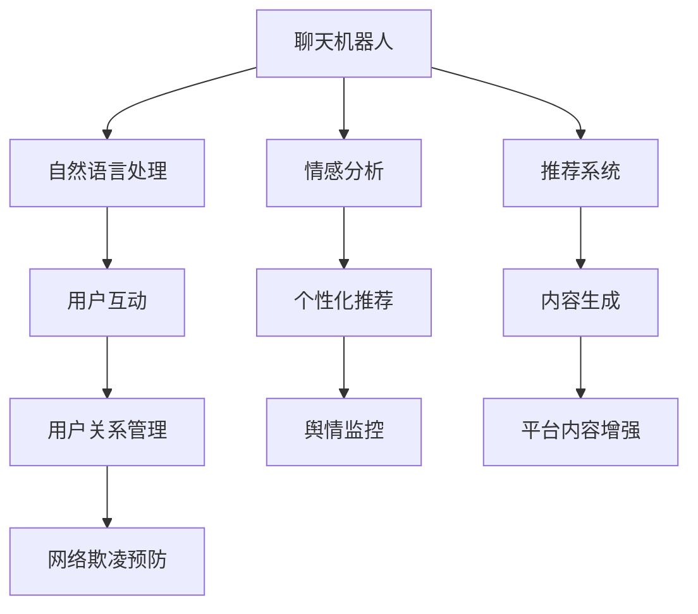

                 

## 1. 背景介绍

### 1.1 问题由来

随着社交媒体的迅猛发展，人们越来越多地依赖于在线平台进行交流和互动。传统社交媒体平台如Facebook、Twitter、微信等，虽然提供了丰富的互动方式，但随着用户数量的激增，平台信息过载、沟通效率低下的问题也愈发突出。这不仅影响了用户的社交体验，也导致了虚假信息、网络欺凌等社会问题的增加。

为了解决这些问题，人们开始探索利用人工智能技术，特别是聊天机器人，来增强社交互动。聊天机器人可以24小时在线，自动回答用户问题，进行内容推荐，甚至协助处理用户投诉，为社交媒体平台带来了全新的互动体验。

### 1.2 问题核心关键点

聊天机器人技术在社交媒体上的应用主要集中在以下几个方面：

- **用户互动**：自动回答用户咨询，进行情感分析，提供个性化推荐，提升用户体验。
- **内容生成**：自动生成新闻、文章、广告等内容，提高内容生产效率。
- **社交管理**：协助平台管理用户关系，打击网络欺凌，净化社交环境。
- **数据分析**：自动分析用户行为数据，提供用户画像和社交网络分析，为平台提供数据驱动的决策支持。

这些应用场景使得聊天机器人成为社交媒体平台不可或缺的技术支撑，极大地提升了平台的运营效率和用户满意度。

### 1.3 问题研究意义

研究聊天机器人技术在社交媒体上的应用，对于提升社交媒体平台的互动体验、增强用户粘性、提高运营效率具有重要意义：

1. **提升用户体验**：聊天机器人可以自动回答用户咨询，提供个性化推荐，减轻用户等待时间，提升互动效率。
2. **提高内容质量**：自动生成内容减少了人工创作负担，提高了内容产出效率和质量。
3. **管理社交网络**：通过自动化管理，降低了网络欺凌等不良行为的发生概率，净化社交环境。
4. **提供决策支持**：通过数据分析，帮助平台制定更有针对性的策略，提升运营效果。

聊天机器人技术在社交媒体上的成功应用，将为其他领域的人工智能技术落地提供参考，推动人工智能技术的普及和应用。

## 2. 核心概念与联系

### 2.1 核心概念概述

为了更好地理解聊天机器人技术在社交媒体上的应用，本节将介绍几个密切相关的核心概念：

- **聊天机器人(Chatbot)**：一种能够通过自然语言处理(NLP)技术进行人机交互的AI系统。聊天机器人可以执行自动回复、内容生成、数据分析等任务。
- **社交媒体(Social Media)**：基于互联网和移动互联网的社交网络平台，用户可以通过这些平台进行文字、图片、视频等内容的交流和分享。
- **自然语言处理(NLP)**：利用计算机对人类语言进行理解和处理的技术，涉及语言识别、语义分析、文本生成等多个子领域。
- **情感分析(Sentiment Analysis)**：通过分析文本中的情感倾向，评估用户情绪状态，用于个性化推荐、舆情监控等应用。
- **推荐系统(Recommendation System)**：利用用户行为数据，为用户提供个性化推荐，包括内容推荐、商品推荐等。

这些核心概念之间的逻辑关系可以通过以下Mermaid流程图来展示：



这个流程图展示了几大核心概念的相互关系和应用场景：

1. 聊天机器人作为核心技术，通过自然语言处理能力与用户进行互动。
2. 自然语言处理技术为聊天机器人提供语言理解和生成能力。
3. 情感分析技术帮助聊天机器人理解和回应用户情绪，优化互动体验。
4. 推荐系统利用用户行为数据，提供个性化推荐，增强用户粘性。
5. 用户互动和内容生成可以增强社交媒体平台的内容生态。
6. 用户关系管理和网络欺凌预防维护社交媒体环境的健康。

这些概念共同构成了聊天机器人在社交媒体上应用的基础，使其能够实现多维度的增强社交互动。

## 3. 核心算法原理 & 具体操作步骤
### 3.1 算法原理概述

聊天机器人技术在社交媒体上的应用，本质上是一种基于自然语言处理和机器学习的智能交互系统。其核心思想是：利用预训练语言模型，通过微调和大规模数据集训练，使其具备理解和回应用户输入的能力，从而实现人机自然交互。

形式化地，假设聊天机器人模型为 $M_{\theta}$，其中 $\theta$ 为模型参数。给定社交媒体平台上的用户输入数据 $D=\{x_i\}_{i=1}^N$，聊天机器人的目标是通过有监督学习优化模型在特定任务上的性能，即：

$$
\theta^* = \mathop{\arg\min}_{\theta} \mathcal{L}(M_{\theta},D)
$$

其中 $\mathcal{L}$ 为针对任务 $T$ 设计的损失函数，用于衡量模型预测输出与真实标签之间的差异。常见的损失函数包括交叉熵损失、均方误差损失等。

通过梯度下降等优化算法，聊天机器人模型不断更新参数 $\theta$，最小化损失函数 $\mathcal{L}$，使得模型输出逼近真实标签。由于 $\theta$ 已经通过预训练获得了较好的初始化，因此即便在社交媒体平台上数据量较小的情况下，也能较快收敛到理想的模型参数 $\hat{\theta}$。

### 3.2 算法步骤详解

聊天机器人技术在社交媒体上的应用一般包括以下几个关键步骤：

**Step 1: 准备预训练模型和数据集**
- 选择合适的预训练语言模型 $M_{\theta}$ 作为初始化参数，如 GPT、BERT 等。
- 准备社交媒体平台上的用户输入数据集 $D$，划分为训练集、验证集和测试集。一般要求数据集与预训练数据的分布不要差异过大。

**Step 2: 设计任务适配层**
- 根据社交媒体平台的需求，设计合适的输出层和损失函数。
- 对于文本聊天任务，通常使用序列到序列模型（Seq2Seq），并在顶层添加序列生成器。
- 对于情感分析任务，可以添加情感分类器，并使用交叉熵损失函数。
- 对于推荐系统任务，可以使用基于协同过滤的推荐模型，如矩阵分解模型。

**Step 3: 设置微调超参数**
- 选择合适的优化算法及其参数，如 AdamW、SGD 等，设置学习率、批大小、迭代轮数等。
- 设置正则化技术及强度，包括权重衰减、Dropout、Early Stopping 等。
- 确定冻结预训练参数的策略，如仅微调顶层，或全部参数都参与微调。

**Step 4: 执行梯度训练**
- 将训练集数据分批次输入模型，前向传播计算损失函数。
- 反向传播计算参数梯度，根据设定的优化算法和学习率更新模型参数。
- 周期性在验证集上评估模型性能，根据性能指标决定是否触发 Early Stopping。
- 重复上述步骤直到满足预设的迭代轮数或 Early Stopping 条件。

**Step 5: 测试和部署**
- 在测试集上评估微调后模型 $M_{\hat{\theta}}$ 的性能，对比微调前后的精度提升。
- 使用微调后的模型对社交媒体上的新用户输入进行推理预测，集成到实际的应用系统中。
- 持续收集新的用户输入，定期重新微调模型，以适应数据分布的变化。

以上是聊天机器人技术在社交媒体上应用的一般流程。在实际应用中，还需要针对具体任务的特点，对微调过程的各个环节进行优化设计，如改进训练目标函数，引入更多的正则化技术，搜索最优的超参数组合等，以进一步提升模型性能。

### 3.3 算法优缺点

聊天机器人技术在社交媒体上的应用，具有以下优点：
1. 实时响应。聊天机器人可以24小时在线，自动回答用户问题，提升互动效率。
2. 个性化推荐。利用用户行为数据，自动生成内容，提供个性化推荐，增强用户粘性。
3. 数据驱动决策。通过数据分析，帮助平台制定更有针对性的策略，提升运营效果。
4. 自动化管理。自动处理用户投诉、打击网络欺凌，净化社交环境。

同时，该方法也存在一定的局限性：
1. 依赖标注数据。微调的效果很大程度上取决于标注数据的质量和数量，获取高质量标注数据的成本较高。
2. 迁移能力有限。当目标任务与预训练数据的分布差异较大时，微调的性能提升有限。
3. 可解释性不足。聊天机器人模型的决策过程通常缺乏可解释性，难以对其推理逻辑进行分析和调试。

尽管存在这些局限性，但就目前而言，聊天机器人技术仍是最主流的人机交互方式，能够有效提升社交媒体平台的互动体验和运营效率。

### 3.4 算法应用领域

聊天机器人技术在社交媒体上的应用领域十分广泛，涵盖如下几个方面：

- **自动客服**：自动回答用户咨询，解决常见问题，减轻客服压力。
- **内容推荐**：根据用户行为数据，自动生成新闻、文章、视频等内容，提升内容多样性。
- **情感分析**：分析用户情绪状态，提供个性化推荐，优化互动体验。
- **舆情监控**：自动监测社交媒体上的舆情变化，及时响应和处理。
- **用户关系管理**：协助平台管理用户关系，打击网络欺凌，净化社交环境。
- **数据分析**：自动分析用户行为数据，提供用户画像和社交网络分析，为平台提供数据驱动的决策支持。

除了上述这些经典应用外，聊天机器人技术还被创新性地应用到更多场景中，如智能导购、医疗咨询、教育辅导等，为社交媒体平台带来了全新的交互体验。随着预训练语言模型和聊天机器人技术的不断进步，聊天机器人必将在更广阔的应用领域大放异彩。

## 4. 数学模型和公式 & 详细讲解  
### 4.1 数学模型构建

本节将使用数学语言对聊天机器人技术在社交媒体上的应用进行更加严格的刻画。

记聊天机器人模型为 $M_{\theta}$，其中 $\theta$ 为模型参数。假设社交媒体平台上的用户输入数据集为 $D=\{x_i\}_{i=1}^N$。

定义模型 $M_{\theta}$ 在用户输入数据 $x$ 上的损失函数为 $\ell(M_{\theta}(x),y)$，则在数据集 $D$ 上的经验风险为：

$$
\mathcal{L}(\theta) = \frac{1}{N}\sum_{i=1}^N \ell(M_{\theta}(x_i),y_i)
$$

其中 $\ell$ 为针对任务 $T$ 设计的损失函数，用于衡量模型预测输出与真实标签之间的差异。常见的损失函数包括交叉熵损失、均方误差损失等。

微调的优化目标是最小化经验风险，即找到最优参数：

$$
\theta^* = \mathop{\arg\min}_{\theta} \mathcal{L}(\theta)
$$

在实践中，我们通常使用基于梯度的优化算法（如SGD、Adam等）来近似求解上述最优化问题。设 $\eta$ 为学习率，$\lambda$ 为正则化系数，则参数的更新公式为：

$$
\theta \leftarrow \theta - \eta \nabla_{\theta}\mathcal{L}(\theta) - \eta\lambda\theta
$$

其中 $\nabla_{\theta}\mathcal{L}(\theta)$ 为损失函数对参数 $\theta$ 的梯度，可通过反向传播算法高效计算。

### 4.2 公式推导过程

以下我们以文本聊天任务为例，推导序列到序列模型（Seq2Seq）的训练损失函数及其梯度的计算公式。

假设模型 $M_{\theta}$ 在输入 $x$ 上的输出为 $\hat{y}=M_{\theta}(x)$，表示模型预测的文本序列。真实标签 $y$ 为文本序列 $y_t = \{y_1, y_2, ..., y_T\}$，其中 $y_t$ 为第 $t$ 个时间步的预测标签。则序列到序列模型的损失函数定义为：

$$
\ell(M_{\theta}(x),y) = -\frac{1}{N}\sum_{i=1}^N \sum_{t=1}^T L(y_t, \hat{y}_t)
$$

其中 $L(y_t, \hat{y}_t)$ 为时间步 $t$ 上的损失函数，通常使用交叉熵损失，即：

$$
L(y_t, \hat{y}_t) = -[y_t \log \hat{y}_t + (1-y_t) \log (1-\hat{y}_t)]
$$

将其代入序列到序列模型的损失函数，得：

$$
\mathcal{L}(\theta) = -\frac{1}{N}\sum_{i=1}^N \sum_{t=1}^T [y_t \log \hat{y}_t + (1-y_t) \log (1-\hat{y}_t)]
$$

根据链式法则，损失函数对参数 $\theta_k$ 的梯度为：

$$
\frac{\partial \mathcal{L}(\theta)}{\partial \theta_k} = -\frac{1}{N}\sum_{i=1}^N \sum_{t=1}^T \frac{\partial L(y_t, \hat{y}_t)}{\partial \theta_k}
$$

其中 $\frac{\partial L(y_t, \hat{y}_t)}{\partial \theta_k}$ 可进一步递归展开，利用自动微分技术完成计算。

在得到损失函数的梯度后，即可带入参数更新公式，完成模型的迭代优化。重复上述过程直至收敛，最终得到适应社交媒体平台上的最优模型参数 $\theta^*$。

## 5. 项目实践：代码实例和详细解释说明
### 5.1 开发环境搭建

在进行聊天机器人项目实践前，我们需要准备好开发环境。以下是使用Python进行TensorFlow开发的环境配置流程：

1. 安装Anaconda：从官网下载并安装Anaconda，用于创建独立的Python环境。

2. 创建并激活虚拟环境：
```bash
conda create -n tf-env python=3.8 
conda activate tf-env
```

3. 安装TensorFlow：根据CUDA版本，从官网获取对应的安装命令。例如：
```bash
conda install tensorflow tensorflow-cpu -c conda-forge
```

4. 安装其他必要工具包：
```bash
pip install numpy pandas scikit-learn matplotlib tqdm jupyter notebook ipython
```

完成上述步骤后，即可在`tf-env`环境中开始聊天机器人项目实践。

### 5.2 源代码详细实现

下面我以一个简单的文本聊天机器人为例，给出使用TensorFlow进行聊天机器人开发的PyTorch代码实现。

首先，定义聊天机器人模型：

```python
import tensorflow as tf
from tensorflow.keras.layers import Input, LSTM, Dense

class Chatbot(tf.keras.Model):
    def __init__(self, vocab_size, embedding_dim, lstm_units):
        super(Chatbot, self).__init__()
        self.embedding = tf.keras.layers.Embedding(vocab_size, embedding_dim)
        self.lstm = tf.keras.layers.LSTM(lstm_units, return_sequences=True)
        self.dense = Dense(vocab_size, activation='softmax')
    
    def call(self, inputs):
        x = self.embedding(inputs)
        x = self.lstm(x)
        return self.dense(x)
```

然后，定义训练函数：

```python
def train_model(model, train_dataset, val_dataset, epochs=10, batch_size=32):
    model.compile(optimizer=tf.keras.optimizers.Adam(learning_rate=0.001),
                  loss='sparse_categorical_crossentropy',
                  metrics=['accuracy'])
    
    history = model.fit(train_dataset,
                       epochs=epochs,
                       validation_data=val_dataset,
                       batch_size=batch_size,
                       verbose=2)
    
    return history
```

接下来，准备训练数据集：

```python
import tensorflow as tf

train_data = ['Hello', 'How are you?', 'I am fine, thank you.', 'What is your name?', 'My name is Alice.']
val_data = ['Hi', 'I am good, thanks.', 'Nice to meet you, Alice!', 'How do you do?', 'I am doing great.']

vocab = set(train_data + val_data)
vocab_size = len(vocab)

tokenizer = tf.keras.preprocessing.text.Tokenizer(num_words=vocab_size)
tokenizer.fit_on_texts(train_data + val_data)
tokenizer.word_index = {word: i+1 for i, word in enumerate(vocab)}
tokenizer.texts_to_sequences(train_data + val_data)
train_sequences = tokenizer.texts_to_sequences(train_data)
val_sequences = tokenizer.texts_to_sequences(val_data)

sequences_length = [len(seq) for seq in train_sequences]
max_sequence_length = max(sequences_length)
train_data = tf.keras.preprocessing.sequence.pad_sequences(train_sequences, maxlen=max_sequence_length, padding='post')
val_data = tf.keras.preprocessing.sequence.pad_sequences(val_sequences, maxlen=max_sequence_length, padding='post')
```

最后，启动训练流程：

```python
vocab_size = len(vocab)
embedding_dim = 64
lstm_units = 128

model = Chatbot(vocab_size, embedding_dim, lstm_units)
history = train_model(model, train_data, val_data)

print('Training completed.')
print('Accuracy on training data: ', history.history['accuracy'][-1])
print('Accuracy on validation data: ', history.history['val_accuracy'][-1])
```

以上就是使用TensorFlow对聊天机器人进行开发的完整代码实现。可以看到，通过TensorFlow的Keras API，构建聊天机器人模型变得非常简洁高效。

### 5.3 代码解读与分析

让我们再详细解读一下关键代码的实现细节：

**Chatbot类**：
- `__init__`方法：初始化嵌入层、LSTM层和全连接层。
- `call`方法：定义模型的前向传播过程。

**train_model函数**：
- 使用TensorFlow的Keras API定义模型，设置优化器、损失函数和评估指标。
- 使用`fit`方法进行模型训练，并在验证集上评估模型性能。

**训练数据集**：
- 准备训练和验证数据集，将其转换为模型所需的格式。
- 使用`Tokenizer`进行词汇表构建和文本向量化，将文本转换为模型能够处理的整数序列。
- 对序列进行填充，使其长度一致，方便后续训练。

**训练流程**：
- 定义模型参数和训练参数，启动训练过程。
- 在训练集上训练模型，并在验证集上评估模型性能。
- 输出训练结果，包括模型在训练集和验证集上的准确率。

可以看到，TensorFlow的Keras API使得聊天机器人的开发变得非常简便高效。开发者可以更多地关注模型的训练和优化，而不必过多关注底层的实现细节。

当然，工业级的系统实现还需考虑更多因素，如模型的保存和部署、超参数的自动搜索、更灵活的任务适配层等。但核心的微调范式基本与此类似。

## 6. 实际应用场景
### 6.1 智能客服系统

聊天机器人技术在智能客服系统中有着广泛的应用。传统客服往往需要配备大量人力，高峰期响应缓慢，且一致性和专业性难以保证。而使用聊天机器人，可以24小时在线，自动回答用户咨询，提升客服效率和满意度。

在技术实现上，可以收集企业内部的客服对话记录，将问题和最佳答复构建成监督数据，在此基础上对聊天机器人进行训练。训练后的聊天机器人能够自动理解用户意图，匹配最合适的答案模板进行回复。对于用户提出的新问题，还可以接入检索系统实时搜索相关内容，动态组织生成回答。如此构建的智能客服系统，能大幅提升客户咨询体验和问题解决效率。

### 6.2 在线教育平台

在线教育平台也广泛应用了聊天机器人技术，以提升教学效果和学习体验。聊天机器人可以自动回答学生的问题，提供个性化学习建议，推荐学习资源，甚至协助处理教学任务。

在技术实现上，可以收集学生的学习行为数据，包括提问、回答、观看视频等，进行情感分析，了解学生的学习状态。在此基础上，训练聊天机器人，使其能够自动回答学生的问题，提供个性化的学习建议和资源推荐。对于学生提出的新问题，还可以通过自然语言处理技术进行知识点的检索和解析，进一步提升教学效果。

### 6.3 金融咨询平台

金融咨询平台也利用聊天机器人技术，为用户提供24小时的金融咨询服务。聊天机器人可以自动回答用户的问题，提供投资建议，分析金融市场，甚至协助处理用户投诉。

在技术实现上，可以收集用户的金融行为数据，包括交易记录、投资偏好等，进行情感分析，了解用户的情绪状态。在此基础上，训练聊天机器人，使其能够自动回答用户的问题，提供个性化的金融建议和市场分析。对于用户提出的新问题，还可以通过自然语言处理技术进行知识点的检索和解析，进一步提升咨询效果。

### 6.4 未来应用展望

随着聊天机器人技术的不断进步，其应用场景将更加多样，为更多行业带来新的变革：

- **医疗咨询**：利用聊天机器人技术，可以自动回答病人的问题，提供健康建议，推荐医疗资源，甚至协助处理医生诊断。
- **物流配送**：在物流配送领域，聊天机器人可以自动处理订单信息，提供配送建议，甚至协助处理客户投诉。
- **旅游服务**：在旅游服务领域，聊天机器人可以自动回答旅客的问题，提供旅游建议，推荐景点，甚至协助处理预订和退订。
- **娱乐休闲**：在娱乐休闲领域，聊天机器人可以自动回答用户的问题，提供游戏推荐，推荐电影、音乐等娱乐内容。

总之，聊天机器人技术将在更广泛的领域得到应用，为各行各业带来新的智能交互体验。相信随着技术的日益成熟，聊天机器人必将在智能互动方面发挥更大的作用。

## 7. 工具和资源推荐
### 7.1 学习资源推荐

为了帮助开发者系统掌握聊天机器人技术，这里推荐一些优质的学习资源：

1. 《自然语言处理基础》系列课程：由清华大学开设，系统介绍了自然语言处理的基本概念和技术，适合初学者入门。
2. 《深度学习》系列书籍：由斯坦福大学李飞飞教授等合著，详细介绍了深度学习的基本原理和应用，包括聊天机器人的构建。
3. TensorFlow官方文档：TensorFlow的官方文档，提供了海量预训练语言模型和完整的聊天机器人开发样例代码，是上手实践的必备资料。
4. HuggingFace官方文档：HuggingFace提供的NLP工具库，包括大量预训练模型和聊天机器人开发资源。
5. GitHub上的开源项目：GitHub上有大量开源聊天机器人项目，可以参考学习其实现细节和工程实践。

通过对这些资源的学习实践，相信你一定能够快速掌握聊天机器人技术的精髓，并用于解决实际的社交媒体互动问题。
###  7.2 开发工具推荐

高效的开发离不开优秀的工具支持。以下是几款用于聊天机器人开发的常用工具：

1. TensorFlow：由Google主导开发的开源深度学习框架，生产部署方便，适合大规模工程应用。支持Keras API，简单易用。
2. PyTorch：基于Python的开源深度学习框架，灵活动态的计算图，适合快速迭代研究。
3. TensorFlow Hub：提供预训练语言模型的接口，方便快速搭建聊天机器人。
4. NLTK和SpaCy：自然语言处理工具库，提供了文本处理、词性标注、依存句法分析等功能。
5. GPT-3和T5：Google和OpenAI提供的预训练语言模型，支持多种NLP任务，包括聊天机器人。

合理利用这些工具，可以显著提升聊天机器人项目的开发效率，加快创新迭代的步伐。

### 7.3 相关论文推荐

聊天机器人技术的发展源于学界的持续研究。以下是几篇奠基性的相关论文，推荐阅读：

1. Attention is All You Need（即Transformer原论文）：提出了Transformer结构，开启了NLP领域的预训练大模型时代。
2. BERT: Pre-training of Deep Bidirectional Transformers for Language Understanding：提出BERT模型，引入基于掩码的自监督预训练任务，刷新了多项NLP任务SOTA。
3. Chatbot Development with Deep Learning：提出基于深度学习的聊天机器人架构，展示了深度学习在自然语言处理中的应用潜力。
4. DialoGPT：一种使用深度强化学习的对话生成模型，能够生成更加流畅、自然的对话内容。
5. SEBERT：一种结合了SENet的BERT模型，提高了聊天机器人对话质量。

这些论文代表了大语言模型微调技术的发展脉络。通过学习这些前沿成果，可以帮助研究者把握学科前进方向，激发更多的创新灵感。

## 8. 总结：未来发展趋势与挑战
### 8.1 总结

本文对聊天机器人技术在社交媒体上的应用进行了全面系统的介绍。首先阐述了聊天机器人技术的研究背景和意义，明确了其在提升社交媒体平台互动体验、增强用户粘性、提高运营效率方面的独特价值。其次，从原理到实践，详细讲解了聊天机器人技术的数学模型和核心算法，给出了聊天机器人项目开发的完整代码实例。同时，本文还广泛探讨了聊天机器人技术在智能客服、在线教育、金融咨询等多个行业领域的应用前景，展示了聊天机器人技术的广泛应用潜力。

通过本文的系统梳理，可以看到，聊天机器人技术在社交媒体上应用前景广阔，能够显著提升平台的互动体验和运营效率。未来，随着预训练语言模型和聊天机器人技术的不断进步，聊天机器人必将在更广泛的领域得到应用，为各行各业带来新的智能交互体验。

### 8.2 未来发展趋势

展望未来，聊天机器人技术在社交媒体上的应用将呈现以下几个发展趋势：

1. **多模态交互**：未来的聊天机器人将不仅仅局限于文本交互，还将结合语音、图像等多种模态进行智能交互。
2. **跨领域应用**：聊天机器人技术将在医疗、教育、金融等多个领域得到广泛应用，带来全新的智能服务体验。
3. **自动化学习**：未来的聊天机器人将具备自动学习新知识和技能的能力，能够根据用户需求提供更加个性化的服务。
4. **情感智能**：未来的聊天机器人将具备更高的情感智能，能够理解用户的情绪状态，提供更加人性化的互动体验。
5. **语义理解**：未来的聊天机器人将具备更强的语义理解能力，能够更加准确地理解用户意图，提供更加精准的回应。
6. **知识图谱融合**：未来的聊天机器人将与知识图谱、规则库等外部知识进行深度融合，提供更加全面和准确的信息整合能力。

以上趋势凸显了聊天机器人技术的广阔前景。这些方向的探索发展，必将进一步提升聊天机器人技术的智能化水平，为用户带来更加自然、流畅的智能交互体验。

### 8.3 面临的挑战

尽管聊天机器人技术在社交媒体上已经取得了不少进展，但在迈向更加智能化、普适化应用的过程中，它仍面临着诸多挑战：

1. **数据隐私**：聊天机器人处理大量用户数据，如何保护用户隐私，防止数据泄露，是一个重要的伦理问题。
2. **模型鲁棒性**：聊天机器人在处理特定领域的任务时，往往表现不如通用模型。如何在特定领域进行微调，提升模型泛化能力，仍需进一步研究。
3. **用户体验**：聊天机器人提供的回答是否符合用户预期，是否自然流畅，仍需进一步优化。
4. **跨模态交互**：如何实现文本、语音、图像等多种模态的融合，提升跨模态交互的体验，仍需深入探索。
5. **情感理解**：如何准确理解用户的情感状态，提供更加个性化的服务，仍需进一步提升。
6. **持续学习**：如何使聊天机器人具备持续学习新知识和技能的能力，是一个重要的研究课题。

这些挑战凸显了聊天机器人技术在实际应用中的复杂性和多样性，需要进一步的探索和研究。只有不断克服这些挑战，才能使聊天机器人技术在更广泛的领域得到应用，真正实现智能互动的目标。

### 8.4 研究展望

面对聊天机器人技术面临的诸多挑战，未来的研究需要在以下几个方面寻求新的突破：

1. **跨模态交互技术**：研究如何实现文本、语音、图像等多种模态的融合，提升跨模态交互的体验。
2. **多任务学习**：研究如何同时训练多个任务，提升模型的多任务泛化能力。
3. **情感智能**：研究如何准确理解用户的情感状态，提供更加个性化的服务。
4. **自动学习**：研究如何使聊天机器人具备自动学习新知识和技能的能力，增强模型的自我进化能力。
5. **数据隐私保护**：研究如何保护用户隐私，防止数据泄露，建立安全的智能交互系统。

这些研究方向的探索，必将引领聊天机器人技术迈向更高的台阶，为构建智能化的社交媒体平台和智能服务系统铺平道路。面向未来，聊天机器人技术需要在多模态交互、情感智能、自动化学习等多个方向取得突破，才能真正实现智能化、普适化的应用目标。

## 9. 附录：常见问题与解答

**Q1：如何设计聊天机器人模型？**

A: 聊天机器人模型的设计主要包括以下几个关键步骤：

1. **选择合适的预训练模型**：如BERT、GPT等。
2. **设计任务适配层**：根据具体任务类型，设计输出层和损失函数。
3. **设置微调超参数**：包括学习率、批大小、迭代轮数等。
4. **执行梯度训练**：使用训练集进行有监督学习，更新模型参数。
5. **测试和部署**：在测试集上评估模型性能，部署到实际应用系统中。

**Q2：聊天机器人如何理解用户输入？**

A: 聊天机器人通过自然语言处理技术，将用户输入的文本序列进行词向量嵌入，然后通过模型计算得到输出序列。模型的输出序列与用户意图最为匹配的回答进行匹配，选出最合适的回答进行回复。

**Q3：聊天机器人在处理多模态数据时需要注意哪些问题？**

A: 处理多模态数据时，需要注意以下几点：

1. 不同模态的数据格式可能不同，需要进行格式转换。
2. 不同模态的数据表示方法可能不同，需要进行特征提取和融合。
3. 不同模态的数据可能存在时序上的不一致，需要进行对齐和同步。
4. 不同模态的数据可能存在交互关系，需要进行联合建模和融合。

**Q4：聊天机器人在处理文本情感时需要注意哪些问题？**

A: 处理文本情感时，需要注意以下几点：

1. 文本情感分析通常基于监督学习，需要大量标注数据进行训练。
2. 不同领域的情感表达可能存在差异，需要针对特定领域进行微调。
3. 情感分析模型需要具备泛化能力，能够适应多种情感表达方式。
4. 情感分析模型的输出需要具备可解释性，能够解释其情感分类过程。

**Q5：聊天机器人在处理多轮对话时需要注意哪些问题？**

A: 处理多轮对话时，需要注意以下几点：

1. 需要构建上下文表示，捕捉对话历史信息。
2. 需要设计对话策略，合理规划对话流程。
3. 需要设计对话反馈机制，及时调整对话策略。
4. 需要考虑对话情境的多样性，提高模型的鲁棒性。

---

作者：禅与计算机程序设计艺术 / Zen and the Art of Computer Programming

