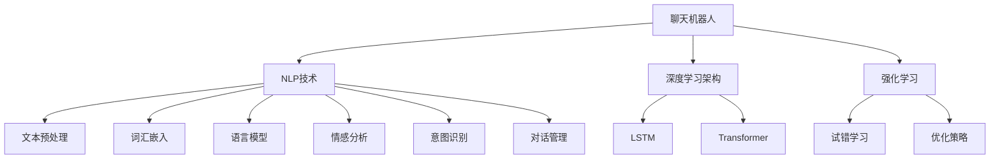

                 

# 聊天机器人科学和探索：数据分析和理论

> 关键词：聊天机器人,数据分析,深度学习,自然语言处理,对话系统,强化学习

## 1. 背景介绍

### 1.1 问题由来

随着人工智能技术的飞速发展，聊天机器人（Chatbot）已经成为智能交互的重要形式，广泛应用在客户服务、在线咨询、智能家居、教育培训等多个领域。然而，如何构建高效、智能、具备强互动性和逻辑推理能力的聊天机器人，依然是人工智能领域的一大挑战。

传统聊天机器人主要依赖规则和模板，无法处理复杂多变的情境，无法与人类自然地进行交互。为了克服这些限制，研究者们转向基于深度学习的方法，特别是以自然语言处理（NLP）为基础的聊天机器人技术。近年来，预训练语言模型（如GPT-3、BERT等）的应用，使得构建具备强大语义理解和生成能力的聊天机器人成为可能。

### 1.2 问题核心关键点

聊天机器人的核心在于其能够自然地进行语言理解与生成，与用户进行交互。基于深度学习的聊天机器人主要包括以下核心关键点：

1. **自然语言处理（NLP）**：理解和生成自然语言的能力，是聊天机器人的基础。NLP技术包括文本预处理、词汇嵌入、语言模型、情感分析、意图识别、对话管理等。
2. **深度学习架构**：如循环神经网络（RNN）、长短时记忆网络（LSTM）、变换器（Transformer）等，用于语言模型的构建。
3. **强化学习（RL）**：通过用户交互反馈不断优化模型，实现更加智能的对话系统。
4. **数据驱动**：大规模无标签数据和标注数据（如对话数据集、用户反馈等）的训练，是构建高效聊天机器人的关键。

## 2. 核心概念与联系

### 2.1 核心概念概述

为更好地理解聊天机器人技术，本节将介绍几个密切相关的核心概念：

- **聊天机器人（Chatbot）**：能够模拟人类对话过程，自动进行自然语言交互的程序或系统。聊天机器人可以是基于规则的、基于模板的，也可以基于深度学习的。
- **自然语言处理（NLP）**：处理和分析自然语言的能力，包括文本预处理、分词、词向量、句法分析、语义分析等。
- **深度学习架构（如RNN、LSTM、Transformer等）**：构建聊天机器人的关键技术，用于处理序列数据、捕捉语言中的长期依赖关系。
- **强化学习（RL）**：通过试错学习和优化策略，使聊天机器人能够在与用户交互的过程中不断学习，提升对话质量。
- **数据驱动**：通过大量标注数据和无标签数据训练，提高聊天机器人的泛化能力和鲁棒性。

这些核心概念之间的逻辑关系可以通过以下Mermaid流程图来展示：



这个流程图展示了这个领域中各个核心概念及其之间的关系：

1. 聊天机器人通过NLP技术进行语言理解与生成。
2. 深度学习架构，特别是LSTM和Transformer，是构建聊天机器人的关键。
3. 强化学习通过用户交互反馈不断优化聊天机器人的对话策略。
4. 数据驱动使得聊天机器人在大量数据下逐渐提升其理解和生成能力。

## 3. 核心算法原理 & 具体操作步骤
### 3.1 算法原理概述

基于深度学习的聊天机器人主要通过以下步骤构建：

1. **数据准备**：收集和预处理对话数据，包括用户输入和系统回复，构建标注数据集。
2. **模型构建**：选择适合的深度学习架构，如LSTM、RNN、Transformer等，构建语言模型。
3. **模型训练**：在标注数据集上进行监督学习，最小化损失函数，训练语言模型。
4. **对话管理**：设计对话管理策略，处理对话状态转换和上下文信息。
5. **测试与部署**：在测试集上评估模型性能，部署到实际应用中。

### 3.2 算法步骤详解

以下将详细介绍聊天机器人技术中的核心算法步骤：

#### 数据准备

**步骤1: 数据收集与清洗**
收集用户与聊天机器人的对话记录，并进行清洗。去除无关噪音，如标点符号、格式化信息等，提取有用的文本信息。

**步骤2: 数据标注**
标注对话数据，将用户输入和系统回复转换为序列。可以使用自动标注工具，如Seq2Seq工具，也可以手动标注。

**步骤3: 数据预处理**
对标注好的数据进行预处理，包括分词、词向量转换、padding、truncation等。确保所有输入序列的长度一致。

#### 模型构建

**步骤1: 选择架构**
选择适合的深度学习架构。如使用LSTM处理序列数据，或使用Transformer捕捉长期依赖关系。

**步骤2: 设计损失函数**
根据任务类型设计合适的损失函数。例如，对于问答系统，可以使用交叉熵损失函数；对于对话系统，可以使用BLEU、ROUGE等评价指标。

**步骤3: 构建模型**
构建基于选择的架构的模型。例如，使用LSTM的模型结构，或使用Transformer的编码器-解码器结构。

#### 模型训练

**步骤1: 选择优化器**
选择合适的优化器，如Adam、SGD等，设置学习率、批大小、迭代轮数等。

**步骤2: 训练模型**
在标注数据集上进行前向传播和反向传播，最小化损失函数。可以使用梯度下降算法，如Adam、SGD等。

**步骤3: 调整模型**
根据损失函数调整模型参数，优化模型性能。

#### 对话管理

**步骤1: 状态管理**
设计对话状态管理策略，处理对话状态转换和上下文信息。

**步骤2: 意图识别**
使用意图识别模型，识别用户的意图。例如，使用逻辑回归、支持向量机（SVM）等模型。

**步骤3: 上下文管理**
使用上下文管理策略，保存和更新对话上下文信息。

#### 测试与部署

**步骤1: 测试模型**
在测试集上评估模型性能，例如使用BLEU、ROUGE等评价指标。

**步骤2: 部署模型**
将训练好的模型部署到实际应用中，如客户服务系统、在线咨询等。

### 3.3 算法优缺点

基于深度学习的聊天机器人技术具有以下优点：

1. **高效**：在大量数据上进行训练，能够快速生成高质量的对话内容。
2. **鲁棒性强**：能够处理复杂多变的情境，适应不同领域的对话场景。
3. **自动优化**：通过强化学习不断优化模型，提升对话质量。
4. **适应性强**：能够实时适应新的对话场景，适应不同用户的对话风格。

同时，该方法也存在以下缺点：

1. **数据依赖**：依赖大量的标注数据和无标签数据进行训练，数据获取成本较高。
2. **计算资源消耗大**：大规模语言模型的训练需要大量的计算资源和时间。
3. **鲁棒性不足**：面对新领域的数据，模型的泛化性能可能较差。
4. **可解释性不足**：模型的决策过程缺乏可解释性，难以调试和优化。

尽管存在这些局限性，但基于深度学习的聊天机器人技术仍然是大规模应用的主要方向，特别是在自然语言理解和生成能力上。

### 3.4 算法应用领域

基于深度学习的聊天机器人技术在多个领域都有广泛应用，例如：

1. **客户服务**：如智能客服、虚拟助手、语音助手等。
2. **在线咨询**：如在线医疗咨询、在线教育、金融咨询等。
3. **教育培训**：如智能教育系统、虚拟教师等。
4. **智能家居**：如智能音箱、智能设备对话等。
5. **智能游戏**：如NPC对话、智能语音助手等。

除了上述这些经典应用场景外，聊天机器人技术还在智能导航、旅游服务、电商客服等多个领域得到应用，为各行各业带来了智能化的新体验。

## 4. 数学模型和公式 & 详细讲解  
### 4.1 数学模型构建

以下将通过数学语言，对聊天机器人技术中的核心算法进行更加严格的刻画。

假设聊天机器人模型为 $M(x,y)$，其中 $x$ 为输入序列，$y$ 为输出序列。在对话管理中，$x$ 包括用户的输入，$y$ 包括系统回复。假设模型在训练集 $D=\{(x_i,y_i)\}_{i=1}^N$ 上进行监督学习，最小化经验风险 $\mathcal{L}(\theta)$。

数学模型构建步骤如下：

1. **模型参数化**：将聊天机器人模型 $M$ 表示为参数 $\theta$ 的函数。
2. **损失函数**：根据对话任务设计合适的损失函数，如交叉熵损失、BLEU分数等。
3. **优化算法**：使用梯度下降算法等优化算法，最小化损失函数。
4. **模型评估**：在测试集上评估模型性能，如BLEU、ROUGE等。

### 4.2 公式推导过程

以下是聊天机器人技术中常见的一些公式推导，以交叉熵损失函数为例：

假设聊天机器人模型为 $M_{\theta}(x) \rightarrow y$，其中 $x$ 为输入序列，$y$ 为输出序列。模型的预测输出为 $\hat{y}$，真实输出为 $y$。

交叉熵损失函数定义为：

$$
\ell(M_{\theta}(x),y) = -\sum_{i=1}^n y_i\log \hat{y}_i
$$

其中 $y_i$ 为真实序列中的第 $i$ 个词，$\hat{y}_i$ 为模型预测的第 $i$ 个词的概率。

在对话管理中，通常使用BLEU分数作为评估指标，BLEU分数的计算公式为：

$$
BLEU = \frac{1}{n}\sum_{i=1}^n \frac{\text{BLEU}_i}{\text{Cand}_i}
$$

其中 $\text{BLEU}_i$ 为模型预测的第 $i$ 个词与真实词的匹配度，$\text{Cand}_i$ 为模型的所有候选词。

### 4.3 案例分析与讲解

#### 案例1: 基于LSTM的聊天机器人

LSTM是一种常用的深度学习架构，特别适用于处理序列数据。以下是一个基于LSTM的聊天机器人模型的案例：

**输入**：用户输入序列，如 $x_1, x_2, x_3, \ldots, x_n$。

**输出**：模型预测的对话回复序列，如 $y_1, y_2, y_3, \ldots, y_n$。

LSTM模型通过记忆细胞（Memory Cell）和门控机制（Gating Mechanism）来处理序列数据。以下是一个简单的LSTM模型的公式推导：

$$
\begin{align*}
\text{遗忘门} \ \sigma &= \text{sigmoid}(W_fx_t + U_fh_{t-1} + b_f) \\
\text{输入门} \ \sigma &= \text{sigmoid}(W_ix_t + U_ih_{t-1} + b_i) \\
\text{输出门} \ \sigma &= \text{sigmoid}(W_ox_t + U_oh_{t-1} + b_o) \\
\text{新记忆} \ \sigma &= \text{tanh}(W_cx_t + U_ch_{t-1} + b_c) \\
h_t &= \text{forget gate} \cdot h_{t-1} + \text{input gate} \cdot \text{new memory} \\
\end{align*}
$$

其中，$W$ 和 $U$ 为权重矩阵，$h_t$ 为记忆细胞状态，$b$ 为偏置项。

## 5. 项目实践：代码实例和详细解释说明
### 5.1 开发环境搭建

在进行聊天机器人开发前，我们需要准备好开发环境。以下是使用Python进行TensorFlow开发的环境配置流程：

1. 安装Anaconda：从官网下载并安装Anaconda，用于创建独立的Python环境。

2. 创建并激活虚拟环境：
```bash
conda create -n tf-env python=3.8 
conda activate tf-env
```

3. 安装TensorFlow：根据CUDA版本，从官网获取对应的安装命令。例如：
```bash
conda install tensorflow
```

4. 安装TensorFlow Addons：用于增强TensorFlow的功能，例如LSTM、Transformer等。

```bash
conda install tensorflow-io-gcp
```

5. 安装各类工具包：
```bash
pip install numpy pandas scikit-learn matplotlib tqdm jupyter notebook ipython
```

完成上述步骤后，即可在`tf-env`环境中开始聊天机器人项目的开发。

### 5.2 源代码详细实现

下面我们以基于LSTM的聊天机器人为例，给出使用TensorFlow对聊天机器人进行训练的Python代码实现。

首先，定义聊天机器人模型：

```python
import tensorflow as tf
from tensorflow.keras.models import Sequential
from tensorflow.keras.layers import LSTM, Dense, Dropout

# 定义模型架构
model = Sequential([
    LSTM(128, input_shape=(seq_len,), return_sequences=True),
    Dropout(0.2),
    LSTM(128),
    Dropout(0.2),
    Dense(128, activation='relu'),
    Dropout(0.2),
    Dense(1, activation='sigmoid')
])

# 编译模型
model.compile(loss='binary_crossentropy', optimizer='adam', metrics=['accuracy'])

# 训练模型
model.fit(x_train, y_train, batch_size=32, epochs=10, validation_data=(x_val, y_val))
```

然后，定义数据处理函数：

```python
import numpy as np

# 将文本转换为数字序列
def text_to_sequence(text):
    sequence = []
    for word in text.split():
        sequence.append(word_to_index[word])
    return np.array(sequence)

# 将数字序列转换为模型输入
def sequence_to_text(sequence):
    words = []
    for i in sequence:
        words.append(index_to_word[i])
    return ' '.join(words)

# 定义数据预处理函数
def preprocess(texts, seq_len=128):
    sequences = [text_to_sequence(text) for text in texts]
    sequences = [seq[:seq_len] for seq in sequences]
    sequences = [seq + [0] * (seq_len - len(seq)) for seq in sequences]
    return np.array(sequences), np.array(sequences)

# 加载数据集
def load_data():
    with open('data.txt', 'r') as f:
        data = f.readlines()
    texts, labels = [], []
    for line in data:
        line = line.strip().split('\t')
        text = line[0]
        label = int(line[1])
        texts.append(text)
        labels.append(label)
    x_train, y_train = preprocess(texts, seq_len=128)
    x_val, y_val = preprocess(texts, seq_len=128)[1:128]
    return x_train, y_train, x_val, y_val
```

最后，启动训练流程并在测试集上评估：

```python
x_train, y_train, x_val, y_val = load_data()

# 训练模型
model.fit(x_train, y_train, batch_size=32, epochs=10, validation_data=(x_val, y_val))

# 测试模型
test_sequences, _ = preprocess(['Hello world!'])
test_output = model.predict(test_sequences)
print(sequence_to_text(test_output))
```

以上就是使用TensorFlow对基于LSTM的聊天机器人进行训练的完整代码实现。可以看到，TensorFlow提供了强大的模型构建和训练功能，使得开发过程简洁高效。

### 5.3 代码解读与分析

让我们再详细解读一下关键代码的实现细节：

**LSTM模型架构**：
- 使用Sequential模型，依次添加LSTM层、Dropout层、Dense层等，构建一个简单的聊天机器人模型。
- LSTM层设置128个神经元，输入形状为seq_len，即输入序列的长度。
- Dropout层用于防止过拟合。

**数据预处理函数**：
- 将文本转换为数字序列，通过word_to_index字典将单词映射为数字。
- 将数字序列转换为模型输入，通过index_to_word字典将数字映射为单词。
- 将文本序列截断为固定长度seq_len，不足的部分补0。

**加载数据集**：
- 从数据文件中加载数据，并将其分割为训练集和验证集。
- 对文本进行预处理，将文本转换为模型输入。

**训练和评估**：
- 使用fit方法进行模型训练，设置batch_size和epochs。
- 在训练过程中使用validation_data参数进行验证集评估。
- 在测试集上使用predict方法进行预测，并输出结果。

可以看出，TensorFlow的简洁API和高效计算图使得聊天机器人的开发变得更加高效和易于理解。开发者可以根据具体需求，使用TensorFlow的高级功能进一步优化模型性能。

## 6. 实际应用场景
### 6.1 客户服务

基于深度学习的聊天机器人可以广泛应用于客户服务领域。传统的客服方式往往需要大量人力，高峰期响应缓慢，且人工客服的效率和质量难以保证。通过构建高效的聊天机器人，可以提供7x24小时不间断服务，快速响应客户咨询，提升客户满意度。

在实际应用中，可以通过对话数据进行微调，使聊天机器人能够理解客户的问题，并提供准确的回复。例如，使用基于BERT的聊天机器人，可以在较少的标注数据上训练，并取得不错的效果。通过引入强化学习技术，聊天机器人还可以根据用户反馈不断优化回答策略，提升对话质量。

### 6.2 在线咨询

在线咨询是聊天机器人技术的另一个重要应用场景。用户可以通过聊天机器人进行医疗咨询、教育咨询、金融咨询等。例如，在医疗咨询中，聊天机器人可以根据用户描述的症状，给出初步的诊断建议，并提供就医指导。

在实际应用中，可以通过多轮对话数据进行训练，使聊天机器人能够理解用户的意图，并提供个性化建议。例如，使用基于GPT的聊天机器人，可以在大量的对话数据上训练，并取得更好的效果。通过引入上下文管理策略，聊天机器人可以保存和更新对话上下文信息，提供连贯的对话体验。

### 6.3 教育培训

聊天机器人技术也可以应用于教育培训领域。例如，虚拟教师可以根据学生的提问，提供个性化的教学建议。通过构建基于LSTM的聊天机器人，可以理解学生的回答，并给出相应的反馈和建议。

在实际应用中，可以通过多轮对话数据进行训练，使聊天机器人能够理解学生的意图，并提供个性化的教学建议。例如，使用基于LSTM的聊天机器人，可以在大量的对话数据上训练，并取得更好的效果。通过引入意图识别技术，聊天机器人可以识别学生的意图，并提供针对性的建议。

### 6.4 未来应用展望

随着深度学习技术的发展，聊天机器人技术将迎来更多的创新应用。以下列举一些未来的应用展望：

1. **多模态聊天机器人**：结合语音、图像、视频等多模态信息，构建更加智能的聊天机器人。例如，使用基于Transformer的模型，可以处理语音和文本信息，提升对话的互动性和自然性。
2. **交互式教学**：通过聊天机器人技术，构建交互式教学系统。例如，使用基于BERT的聊天机器人，可以理解学生的回答，并给出个性化的反馈和建议。
3. **情感分析**：通过聊天机器人技术，进行情感分析，了解用户的情绪状态。例如，使用基于LSTM的聊天机器人，可以分析用户的情感倾向，提供相应的支持。
4. **智能问答**：通过聊天机器人技术，构建智能问答系统。例如，使用基于GPT的聊天机器人，可以理解用户的提问，并提供准确的答案。
5. **个性化推荐**：通过聊天机器人技术，进行个性化推荐。例如，使用基于LSTM的聊天机器人，可以根据用户的兴趣，推荐相关的内容和商品。

## 7. 工具和资源推荐
### 7.1 学习资源推荐

为了帮助开发者系统掌握聊天机器人技术，这里推荐一些优质的学习资源：

1. 《深度学习实战》系列书籍：由深度学习专家撰写，详细介绍深度学习基础和实战应用，包括聊天机器人技术。
2. 《自然语言处理入门》课程：斯坦福大学开设的NLP入门课程，介绍NLP基础知识和经典模型。
3. 《TensorFlow实战》书籍：TensorFlow官方文档，详细介绍TensorFlow的使用方法和最佳实践。
4. 《LSTM网络理论与实践》论文：LSTM网络的经典论文，详细介绍了LSTM的结构和训练方法。
5. 《GPT-3技术手册》文档：OpenAI的GPT-3技术手册，详细介绍GPT-3的原理和使用方法。

通过对这些资源的学习实践，相信你一定能够快速掌握聊天机器人技术的精髓，并用于解决实际的NLP问题。
### 7.2 开发工具推荐

高效的开发离不开优秀的工具支持。以下是几款用于聊天机器人开发的常用工具：

1. TensorFlow：由Google主导开发的深度学习框架，生产部署方便，适合大规模工程应用。
2. PyTorch：基于Python的开源深度学习框架，灵活性高，适合快速迭代研究。
3. Keras：基于TensorFlow和Theano的高级API，使用简单，适合快速原型开发。
4. TensorBoard：TensorFlow配套的可视化工具，可实时监测模型训练状态，并提供丰富的图表呈现方式。
5. Weights & Biases：模型训练的实验跟踪工具，可以记录和可视化模型训练过程中的各项指标，方便对比和调优。

合理利用这些工具，可以显著提升聊天机器人开发的效率，加快创新迭代的步伐。

### 7.3 相关论文推荐

聊天机器人技术的发展源于学界的持续研究。以下是几篇奠基性的相关论文，推荐阅读：

1. Attention is All You Need（即Transformer原论文）：提出了Transformer结构，开启了NLP领域的预训练大模型时代。
2. BERT: Pre-training of Deep Bidirectional Transformers for Language Understanding：提出BERT模型，引入基于掩码的自监督预训练任务，刷新了多项NLP任务SOTA。
3. Deep Reinforcement Learning for Dialogue Systems：提出基于强化学习的对话系统，通过用户反馈不断优化模型。
4. Conversational Generative Adversarial Nets（C-GAN）：提出基于生成对抗网络（GAN）的对话生成模型，提升对话自然性。
5. SOKAL: A Framework for Formal Language Validation in Dialogue Systems：提出基于符号验证的对话系统，提升对话模型的逻辑性和准确性。

这些论文代表了大语言模型微调技术的发展脉络。通过学习这些前沿成果，可以帮助研究者把握学科前进方向，激发更多的创新灵感。

## 8. 总结：未来发展趋势与挑战
### 8.1 总结

本文对基于深度学习的聊天机器人技术进行了全面系统的介绍。首先阐述了聊天机器人技术的背景和意义，明确了深度学习在构建智能对话系统中的重要作用。其次，从原理到实践，详细讲解了深度学习架构、优化算法、对话管理等核心算法，并给出了具体的代码实现。同时，本文还广泛探讨了聊天机器人在客户服务、在线咨询、教育培训等多个领域的应用前景，展示了聊天机器人技术的广阔应用前景。最后，本文精选了聊天机器人技术的各类学习资源，力求为读者提供全方位的技术指引。

通过本文的系统梳理，可以看到，基于深度学习的聊天机器人技术正在成为NLP领域的重要方向，极大地提升了对话系统的智能化水平。得益于深度学习架构和优化算法的不断进步，聊天机器人技术将变得更加高效和智能，为各行各业带来更加便捷、高效、智能的交互体验。

### 8.2 未来发展趋势

展望未来，聊天机器人技术将呈现以下几个发展趋势：

1. **多模态融合**：结合语音、图像、视频等多模态信息，构建更加智能的聊天机器人。例如，使用基于Transformer的模型，可以处理语音和文本信息，提升对话的互动性和自然性。
2. **个性化推荐**：通过聊天机器人技术，进行个性化推荐。例如，使用基于LSTM的聊天机器人，可以根据用户的兴趣，推荐相关的内容和商品。
3. **情感分析**：通过聊天机器人技术，进行情感分析，了解用户的情绪状态。例如，使用基于LSTM的聊天机器人，可以分析用户的情感倾向，提供相应的支持。
4. **智能问答**：通过聊天机器人技术，构建智能问答系统。例如，使用基于GPT的聊天机器人，可以理解用户的提问，并提供准确的答案。
5. **交互式教学**：通过聊天机器人技术，构建交互式教学系统。例如，使用基于BERT的聊天机器人，可以理解学生的回答，并给出个性化的反馈和建议。

以上趋势凸显了聊天机器人技术在自然语言处理和智能交互领域的广阔前景。这些方向的探索发展，必将进一步提升聊天机器人的智能化水平，为构建人机协同的智能系统铺平道路。

### 8.3 面临的挑战

尽管聊天机器人技术已经取得了显著进展，但在迈向更加智能化、普适化应用的过程中，它仍面临诸多挑战：

1. **数据依赖**：依赖大量的标注数据和无标签数据进行训练，数据获取成本较高。如何进一步降低数据需求，利用更多的非结构化数据进行训练，将是未来的研究方向。
2. **鲁棒性不足**：面对新领域的数据，模型的泛化性能可能较差。如何提高聊天机器人的鲁棒性，避免灾难性遗忘，还需要更多理论和实践的积累。
3. **推理效率有待提高**：大规模语言模型虽然精度高，但在实际部署时往往面临推理速度慢、内存占用大等效率问题。如何优化模型结构，提升推理速度，优化资源占用，将是重要的优化方向。
4. **可解释性亟需加强**：当前聊天机器人缺乏可解释性，难以解释其内部工作机制和决策逻辑。对于高风险应用，算法的可解释性和可审计性尤为重要。
5. **安全性有待保障**：预训练语言模型难免会学习到有偏见、有害的信息，通过聊天机器人传递到下游任务，产生误导性、歧视性的输出，给实际应用带来安全隐患。

正视聊天机器人面临的这些挑战，积极应对并寻求突破，将是大语言模型微调走向成熟的必由之路。相信随着学界和产业界的共同努力，这些挑战终将一一被克服，聊天机器人技术必将在构建智能系统方面发挥更大的作用。

### 8.4 研究展望

未来，聊天机器人技术需要在以下几个方面进行进一步研究：

1. **探索无监督和半监督学习范式**：摆脱对大规模标注数据的依赖，利用自监督学习、主动学习等无监督和半监督范式，最大限度利用非结构化数据，实现更加灵活高效的训练。
2. **研究参数高效和计算高效的微调范式**：开发更加参数高效的微调方法，在固定大部分预训练参数的同时，只更新极少量的任务相关参数。同时优化聊天机器人的计算图，减少前向传播和反向传播的资源消耗，实现更加轻量级、实时性的部署。
3. **引入因果分析和博弈论工具**：将因果分析方法引入聊天机器人，识别出模型决策的关键特征，增强输出解释的因果性和逻辑性。借助博弈论工具刻画人机交互过程，主动探索并规避模型的脆弱点，提高系统稳定性。
4. **纳入伦理道德约束**：在模型训练目标中引入伦理导向的评估指标，过滤和惩罚有偏见、有害的输出倾向。同时加强人工干预和审核，建立模型行为的监管机制，确保输出符合人类价值观和伦理道德。
5. **开发多领域通用模型**：构建能够适应多个领域的通用聊天机器人模型，提升模型的泛化能力和鲁棒性。

这些研究方向的探索，必将引领聊天机器人技术迈向更高的台阶，为构建安全、可靠、可解释、可控的智能系统铺平道路。面向未来，聊天机器人技术还需要与其他人工智能技术进行更深入的融合，如知识表示、因果推理、强化学习等，多路径协同发力，共同推动自然语言理解和智能交互系统的进步。只有勇于创新、敢于突破，才能不断拓展语言模型的边界，让智能技术更好地造福人类社会。

## 9. 附录：常见问题与解答

**Q1：聊天机器人如何构建对话管理策略？**

A: 构建对话管理策略是聊天机器人技术中的关键环节。以下是几种常用的对话管理策略：

1. **状态机**：通过定义状态转移规则，实现对话状态的转换。例如，定义开始、问答、结束等状态，根据用户输入自动切换状态。
2. **意图识别**：使用意图识别模型，识别用户的意图。例如，使用逻辑回归、支持向量机（SVM）等模型。
3. **上下文管理**：使用上下文管理策略，保存和更新对话上下文信息。例如，使用LSTM等记忆细胞，保存对话历史信息。
4. **知识库**：引入知识库，保存和更新对话相关的知识。例如，使用规则库、符号库等，提高对话的自然性和准确性。

**Q2：如何优化聊天机器人的推理速度？**

A: 优化聊天机器人的推理速度是提升其应用效率的关键。以下是几种常用的优化方法：

1. **模型裁剪**：去除不必要的层和参数，减小模型尺寸，加快推理速度。例如，使用TensorFlow Lite等轻量级框架，优化模型的推理速度。
2. **量化加速**：将浮点模型转为定点模型，压缩存储空间，提高计算效率。例如，使用TensorFlow Quantization等工具，进行模型的量化加速。
3. **模型并行**：使用模型并行技术，提升模型的推理效率。例如，使用TensorFlow Model Parallelism，进行模型的并行计算。
4. **剪枝和稀疏化**：使用剪枝和稀疏化技术，减小模型的计算量和存储空间。例如，使用TensorFlow Model Compression等工具，进行模型的剪枝和稀疏化。

**Q3：如何提高聊天机器人的可解释性？**

A: 提高聊天机器人的可解释性是确保其安全性和可信度的重要手段。以下是几种常用的可解释性方法：

1. **模型可视化和解释**：使用模型可视化和解释工具，查看模型的内部工作机制和决策逻辑。例如，使用TensorBoard等工具，进行模型的可视化和解释。
2. **规则库和符号库**：引入规则库和符号库，增强模型的可解释性。例如，使用符号验证和规则验证技术，提高模型的逻辑性和可解释性。
3. **模型训练目标**：在模型训练目标中引入伦理导向的评估指标，过滤和惩罚有偏见、有害的输出倾向。例如，使用Robustness Check等工具，进行模型的鲁棒性验证。

**Q4：如何构建高效的客户服务聊天机器人？**

A: 构建高效的客户服务聊天机器人需要考虑以下关键点：

1. **数据收集与清洗**：收集和预处理客户服务对话记录，去除无关噪音，提取有用的文本信息。
2. **模型构建与训练**：选择合适的深度学习架构，如LSTM、Transformer等，构建语言模型。在标注数据集上进行监督学习，最小化损失函数，训练语言模型。
3. **对话管理与上下文管理**：设计对话管理策略，处理对话状态转换和上下文信息。保存和更新对话上下文信息，提供连贯的对话体验。
4. **用户反馈与优化**：通过用户反馈不断优化聊天机器人，提升对话质量。例如，使用强化学习技术，根据用户反馈优化回答策略。

**Q5：如何在低资源环境下构建高效的聊天机器人？**

A: 在低资源环境下构建高效的聊天机器人需要考虑以下关键点：

1. **轻量级框架**：选择轻量级深度学习框架，如TensorFlow Lite、TensorFlow.js等，优化模型的推理速度和资源占用。
2. **模型裁剪和量化**：使用模型裁剪和量化技术，减小模型的计算量和存储空间。例如，使用TensorFlow Quantization等工具，进行模型的量化加速。
3. **本地部署**：在低资源环境下，采用本地部署的方式，优化模型的运行效率。例如，使用模型本地化技术，优化模型的资源占用。
4. **边缘计算**：在低资源环境下，使用边缘计算技术，提升模型的推理效率。例如，使用TensorFlow Mobile等工具，进行模型的边缘计算。

---

作者：禅与计算机程序设计艺术 / Zen and the Art of Computer Programming

