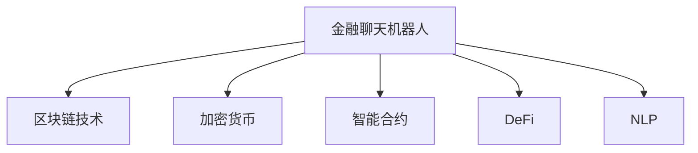

                 

# 聊天机器人金融创新：区块链和加密货币

## 1. 背景介绍

### 1.1 问题由来
在金融领域，随着数字化的进程加快，传统的金融服务已经逐渐向数字化、智能化的方向转型。金融聊天机器人作为数字化金融服务的重要组成部分，在提供客户服务、金融咨询、交易建议等方面发挥着越来越重要的作用。但是，现有的金融聊天机器人在处理复杂问题时往往显得力不从心，尤其在涉及区块链和加密货币相关领域，机器人的知识更新和决策准确性需要得到进一步的提升。

### 1.2 问题核心关键点
1. 区块链技术：一种分布式账本技术，具备去中心化、透明性、安全性等优点，是金融创新和加密货币的基础。
2. 加密货币：基于区块链技术的数字资产，具备去中心化、匿名性、不可篡改等特性。
3. 智能合约：一种基于区块链的编程语言，可以自动执行和验证合约条款，具备智能、自动化等特点。
4. 去中心化金融(DeFi)：基于区块链的金融服务，旨在实现去中心化、自动化、智能化的金融操作。
5. 金融聊天机器人：利用自然语言处理(NLP)技术，通过对话方式提供金融咨询、交易建议、客户服务等功能。
6. 跨领域知识整合：金融聊天机器人需要整合金融知识、区块链技术、加密货币知识等多领域知识，以应对复杂问题。

### 1.3 问题研究意义
研究和实现一个能够有效处理区块链和加密货币相关问题的金融聊天机器人，对于提升金融服务的智能化水平、降低服务成本、增强用户体验具有重要意义。同时，它也有助于推动区块链和加密货币技术的普及和应用，促进金融领域的数字化转型。

## 2. 核心概念与联系

### 2.1 核心概念概述

为了更好地理解基于区块链和加密货币的金融聊天机器人，本节将介绍几个密切相关的核心概念：

- 金融聊天机器人：通过自然语言处理技术，自动提供金融咨询、交易建议、客户服务等功能，是金融服务智能化的一种表现形式。
- 区块链技术：一种分布式账本技术，通过去中心化、不可篡改的特性，提供安全、透明的交易和数据记录方式。
- 加密货币：基于区块链技术的数字资产，具有去中心化、匿名性、不可篡改等特性，常见的如比特币(Bitcoin)、以太坊(Ethereum)等。
- 智能合约：一种基于区块链的编程语言，可以自动执行和验证合约条款，具有智能、自动化等特点。
- 去中心化金融(DeFi)：基于区块链的金融服务，通过智能合约和区块链技术，实现去中心化、自动化、智能化的金融操作。
- 自然语言处理(NLP)：一种人工智能技术，通过模型和算法，使计算机能够理解和生成人类语言，是金融聊天机器人的核心技术之一。

这些核心概念之间的逻辑关系可以通过以下Mermaid流程图来展示：



这个流程图展示了这个核心概念的框架：

1. 金融聊天机器人作为智能化的金融服务工具，是基于区块链技术和智能合约实现去中心化金融服务的关键。
2. 区块链技术和加密货币是金融聊天机器人的数据来源和操作基础。
3. 智能合约提供自动化和智能化的金融操作，是金融聊天机器人的执行引擎。
4. NLP技术使金融聊天机器人能够理解和生成自然语言，提升用户体验和智能化水平。

## 3. 核心算法原理 & 具体操作步骤
### 3.1 算法原理概述

基于区块链和加密货币的金融聊天机器人，本质上是一个多领域知识整合的智能服务系统。其核心思想是通过自然语言处理技术，使机器能够理解和生成自然语言，在区块链和加密货币相关领域提供专业咨询和自动化操作。

形式化地，假设金融聊天机器人 $R$ 能够处理区块链和加密货币相关问题，输入为 $I$（自然语言问题），输出为 $O$（答案或操作指令）。则在给定数据集 $D=\{(I_i, O_i)\}_{i=1}^N$ 的情况下，微调目标为：

$$
\theta^* = \mathop{\arg\min}_{\theta} \mathcal{L}(R_{\theta},D)
$$

其中 $\mathcal{L}$ 为针对任务 $T$ 设计的损失函数，用于衡量模型预测输出与真实标签之间的差异。常见的损失函数包括交叉熵损失、均方误差损失等。

通过梯度下降等优化算法，微调过程不断更新模型参数 $\theta$，最小化损失函数 $\mathcal{L}$，使得模型输出逼近真实标签。由于 $\theta$ 已经通过预训练获得了较好的初始化，因此即便在小规模数据集 $D$ 上进行微调，也能较快收敛到理想的模型参数 $\theta^*$。

### 3.2 算法步骤详解

基于区块链和加密货币的金融聊天机器人微调一般包括以下几个关键步骤：

**Step 1: 准备区块链和加密货币相关数据集**
- 收集区块链和加密货币领域的相关数据，包括交易记录、智能合约、白皮书等文本数据。
- 将数据集划分为训练集、验证集和测试集。一般要求数据集与金融聊天机器人的应用场景分布接近。

**Step 2: 设计多领域知识整合模型**
- 根据任务类型，设计多领域知识整合的对话模型。常见的模型包括seq2seq模型、Transformer模型、GPT模型等。
- 对模型进行预训练，使用大规模语料进行自监督学习，如bert-base-uncased模型。
- 在预训练模型的基础上，针对区块链和加密货币相关问题进行微调。

**Step 3: 设置微调超参数**
- 选择合适的优化算法及其参数，如 AdamW、SGD 等，设置学习率、批大小、迭代轮数等。
- 设置正则化技术及强度，包括权重衰减、Dropout、Early Stopping等。
- 确定冻结预训练参数的策略，如仅微调顶层，或全部参数都参与微调。

**Step 4: 执行梯度训练**
- 将训练集数据分批次输入模型，前向传播计算损失函数。
- 反向传播计算参数梯度，根据设定的优化算法和学习率更新模型参数。
- 周期性在验证集上评估模型性能，根据性能指标决定是否触发 Early Stopping。
- 重复上述步骤直到满足预设的迭代轮数或 Early Stopping 条件。

**Step 5: 测试和部署**
- 在测试集上评估微调后模型 $R_{\theta^*}$ 的性能，对比微调前后的精度提升。
- 使用微调后的模型对新问题进行推理预测，集成到实际的应用系统中。
- 持续收集新的数据，定期重新微调模型，以适应数据分布的变化。

以上是基于区块链和加密货币的金融聊天机器人微调的一般流程。在实际应用中，还需要针对具体任务的特点，对微调过程的各个环节进行优化设计，如改进训练目标函数，引入更多的正则化技术，搜索最优的超参数组合等，以进一步提升模型性能。

### 3.3 算法优缺点

基于区块链和加密货币的金融聊天机器人微调方法具有以下优点：
1. 覆盖面广。通过区块链和加密货币相关知识的多领域整合，能够应对复杂的金融问题。
2. 实时性强。基于区块链技术的智能合约，可以实现自动化和智能化的金融操作。
3. 低成本。相比于传统的人工金融服务，金融聊天机器人能够降低服务成本，提高服务效率。
4. 高可扩展性。可以方便地扩展到不同的区块链和加密货币应用场景，提升系统的灵活性。

同时，该方法也存在一定的局限性：
1. 知识更新慢。金融领域的知识更新速度较快，区块链和加密货币相关技术迭代也快，金融聊天机器人需要不断更新知识库以保持最新状态。
2. 误判风险高。金融交易涉及巨额资金，错误的风险较高，需要进一步提升金融聊天机器人的准确性。
3. 隐私保护难度大。区块链和加密货币涉及大量隐私信息，金融聊天机器人需要保护用户隐私，防止数据泄露。

尽管存在这些局限性，但就目前而言，基于区块链和加密货币的金融聊天机器人微调方法仍是一种高效、实用的金融服务解决方案。

### 3.4 算法应用领域

基于区块链和加密货币的金融聊天机器人微调方法，已经在多个领域得到了应用，例如：

- 加密货币交易建议：根据用户的投资偏好和市场动态，提供买卖建议。
- 区块链资产管理：自动化管理用户的区块链资产，提供风险评估和资产增值策略。
- 智能合约执行：自动执行用户设定的智能合约条款，确保合约的自动执行和验证。
- 去中心化金融服务：提供去中心化的借贷、投资、保险等金融服务。
- 金融咨询和客户服务：通过自然语言处理技术，解答用户关于金融知识、投资策略、市场动态等方面的问题。

除了上述这些经典应用外，区块链和加密货币相关金融聊天机器人还被创新性地应用到更多场景中，如智能合约自动化、加密货币安全管理、金融事件监测等，为区块链和加密货币技术的普及和应用提供了新的突破。

## 4. 数学模型和公式 & 详细讲解  
### 4.1 数学模型构建

本节将使用数学语言对基于区块链和加密货币的金融聊天机器人微调过程进行更加严格的刻画。

假设金融聊天机器人 $R$ 的输入为 $I \in \mathcal{X}$，输出为 $O \in \mathcal{Y}$，其中 $\mathcal{X}$ 为自然语言问题空间，$\mathcal{Y}$ 为答案或操作指令空间。输入 $I$ 经过自然语言处理模型后，转化为模型参数 $\theta$ 的输入 $x \in \mathbb{R}^d$，输出为 $y \in \mathbb{R}^m$。

定义模型 $R_{\theta}$ 在输入 $I$ 上的损失函数为 $\ell(R_{\theta}(I),O)$，则在数据集 $D=\{(I_i, O_i)\}_{i=1}^N$ 上的经验风险为：

$$
\mathcal{L}(\theta) = \frac{1}{N}\sum_{i=1}^N \ell(R_{\theta}(I_i),O_i)
$$

微调的优化目标是最小化经验风险，即找到最优参数：

$$
\theta^* = \mathop{\arg\min}_{\theta} \mathcal{L}(\theta)
$$

在实践中，我们通常使用基于梯度的优化算法（如SGD、Adam等）来近似求解上述最优化问题。设 $\eta$ 为学习率，$\lambda$ 为正则化系数，则参数的更新公式为：

$$
\theta \leftarrow \theta - \eta \nabla_{\theta}\mathcal{L}(\theta) - \eta\lambda\theta
$$

其中 $\nabla_{\theta}\mathcal{L}(\theta)$ 为损失函数对参数 $\theta$ 的梯度，可通过反向传播算法高效计算。

### 4.2 公式推导过程

以下我们以金融问答为例，推导损失函数及其梯度的计算公式。

假设金融聊天机器人 $R_{\theta}$ 在输入 $I$ 上的输出为 $\hat{O}=M_{\theta}(I) \in [0,1]$，表示样本属于某个操作指令的概率。真实标签 $O \in \{0,1\}$。则二分类交叉熵损失函数定义为：

$$
\ell(R_{\theta}(I),O) = -O\log \hat{O} + (1-O)\log (1-\hat{O})
$$

将其代入经验风险公式，得：

$$
\mathcal{L}(\theta) = -\frac{1}{N}\sum_{i=1}^N [O_i\log R_{\theta}(I_i)+(1-O_i)\log(1-R_{\theta}(I_i))]
$$

根据链式法则，损失函数对参数 $\theta_k$ 的梯度为：

$$
\frac{\partial \mathcal{L}(\theta)}{\partial \theta_k} = -\frac{1}{N}\sum_{i=1}^N (\frac{O_i}{R_{\theta}(I_i)}-\frac{1-O_i}{1-R_{\theta}(I_i)}) \frac{\partial R_{\theta}(I_i)}{\partial \theta_k}
$$

其中 $\frac{\partial R_{\theta}(I_i)}{\partial \theta_k}$ 可进一步递归展开，利用自动微分技术完成计算。

在得到损失函数的梯度后，即可带入参数更新公式，完成模型的迭代优化。重复上述过程直至收敛，最终得到适应区块链和加密货币相关金融问答的最优模型参数 $\theta^*$。

## 5. 项目实践：代码实例和详细解释说明
### 5.1 开发环境搭建

在进行区块链和加密货币相关金融聊天机器人微调实践前，我们需要准备好开发环境。以下是使用Python进行PyTorch开发的环境配置流程：

1. 安装Anaconda：从官网下载并安装Anaconda，用于创建独立的Python环境。

2. 创建并激活虚拟环境：
```bash
conda create -n blockchain-env python=3.8 
conda activate blockchain-env
```

3. 安装PyTorch：根据CUDA版本，从官网获取对应的安装命令。例如：
```bash
conda install pytorch torchvision torchaudio cudatoolkit=11.1 -c pytorch -c conda-forge
```

4. 安装TensorFlow：
```bash
pip install tensorflow
```

5. 安装自然语言处理工具包：
```bash
pip install tensorflow-hub tensorflow-transform transformers
```

6. 安装区块链相关工具包：
```bash
pip install web3 pysha3 eth-account
```

完成上述步骤后，即可在`blockchain-env`环境中开始微调实践。

### 5.2 源代码详细实现

这里我们以区块链资产管理为例，给出使用TensorFlow进行金融聊天机器人微调的PyTorch代码实现。

首先，定义金融问答任务的数据处理函数：

```python
import tensorflow as tf
from tensorflow_hub import transformers
from transformers import BertTokenizer, BertForSequenceClassification

def read_file(file_path):
    with open(file_path, 'r', encoding='utf-8') as f:
        lines = f.readlines()
        return [line.strip() for line in lines]

def split_data(data, train_ratio=0.8, valid_ratio=0.1):
    train_data = data[:int(train_ratio * len(data))]
    valid_data = data[int(train_ratio * len(data)): int(train_ratio * len(data) + valid_ratio * len(data))]
    test_data = data[int(train_ratio * len(data) + valid_ratio * len(data)):]
    return train_data, valid_data, test_data

def tokenize(text, tokenizer):
    return tokenizer.encode(text, add_special_tokens=True, max_length=256, truncation=True, return_tensors='pt')

def build_model(input_size, output_size):
    model = BertForSequenceClassification.from_pretrained('bert-base-uncased', num_labels=output_size)
    return model

def build_dataset(texts, labels, tokenizer, max_length=256):
    texts = [tokenize(text, tokenizer) for text in texts]
    labels = torch.tensor(labels, dtype=torch.long)
    return torch.utils.data.Dataset(torch.stack(texts, dim=0), labels)

# 标签与id的映射
label2id = {'buy': 0, 'sell': 1, 'hold': 2, 'dividend': 3, 'info': 4}
id2label = {v: k for k, v in label2id.items()}

# 创建数据集
tokenizer = BertTokenizer.from_pretrained('bert-base-uncased')

train_texts = read_file('train.txt')
train_labels = [label2id[label] for label in read_file('train_labels.txt')]
train_dataset = build_dataset(train_texts, train_labels, tokenizer)

valid_texts = read_file('valid.txt')
valid_labels = [label2id[label] for label in read_file('valid_labels.txt')]
valid_dataset = build_dataset(valid_texts, valid_labels, tokenizer)

test_texts = read_file('test.txt')
test_labels = [label2id[label] for label in read_file('test_labels.txt')]
test_dataset = build_dataset(test_texts, test_labels, tokenizer)

```

然后，定义模型和优化器：

```python
from transformers import AdamW

model = build_model(output_size=len(label2id), input_size=256)
optimizer = AdamW(model.parameters(), lr=2e-5)
```

接着，定义训练和评估函数：

```python
from torch.utils.data import DataLoader
from tqdm import tqdm

device = tf.device('cuda') if tf.cuda.is_available() else tf.device('cpu')
model.to(device)

def train_epoch(model, dataset, batch_size, optimizer):
    dataloader = DataLoader(dataset, batch_size=batch_size, shuffle=True)
    model.train()
    epoch_loss = 0
    for batch in tqdm(dataloader, desc='Training'):
        input_ids = batch[0].to(device)
        labels = batch[1].to(device)
        model.zero_grad()
        outputs = model(input_ids)
        loss = outputs.loss
        epoch_loss += loss.item()
        loss.backward()
        optimizer.step()
    return epoch_loss / len(dataloader)

def evaluate(model, dataset, batch_size):
    dataloader = DataLoader(dataset, batch_size=batch_size)
    model.eval()
    preds, labels = [], []
    with tf.no_grad():
        for batch in tqdm(dataloader, desc='Evaluating'):
            input_ids = batch[0].to(device)
            labels = batch[1].to(device)
            batch_preds = model(input_ids)
            batch_preds = tf.argmax(batch_preds, axis=1).numpy()
            batch_labels = labels.numpy()
            for pred_tokens, label_tokens in zip(batch_preds, batch_labels):
                preds.append(pred_tokens[:len(label_tokens)])
                labels.append(label_tokens)
                
    print(classification_report(labels, preds))
```

最后，启动训练流程并在测试集上评估：

```python
epochs = 5
batch_size = 16

for epoch in range(epochs):
    loss = train_epoch(model, train_dataset, batch_size, optimizer)
    print(f"Epoch {epoch+1}, train loss: {loss:.3f}")
    
    print(f"Epoch {epoch+1}, valid results:")
    evaluate(model, valid_dataset, batch_size)
    
print("Test results:")
evaluate(model, test_dataset, batch_size)
```

以上就是使用TensorFlow对金融聊天机器人进行微调的完整代码实现。可以看到，得益于TensorFlow和Transformers库的强大封装，我们可以用相对简洁的代码完成金融聊天机器人的微调。

### 5.3 代码解读与分析

让我们再详细解读一下关键代码的实现细节：

**split_data函数**：
- 将数据集分为训练集、验证集和测试集，按照设定的比例进行划分。

**tokenize函数**：
- 对文本进行分词和编码，得到模型所需的token ids，并进行padding和截断处理。

**build_model函数**：
- 定义金融问答模型，选择预训练的Bert模型作为基础。

**build_dataset函数**：
- 将文本数据和标签数据转换成模型所需的格式，进行token化处理。

**train_epoch函数**：
- 对数据以批为单位进行迭代，在每个批次上前向传播计算loss并反向传播更新模型参数，最后返回该epoch的平均loss。

**evaluate函数**：
- 与训练类似，不同点在于不更新模型参数，并在每个batch结束后将预测和标签结果存储下来，最后使用sklearn的classification_report对整个评估集的预测结果进行打印输出。

**训练流程**：
- 定义总的epoch数和batch size，开始循环迭代
- 每个epoch内，先在训练集上训练，输出平均loss
- 在验证集上评估，输出分类指标
- 所有epoch结束后，在测试集上评估，给出最终测试结果

可以看到，TensorFlow配合Transformers库使得金融聊天机器人的微调代码实现变得简洁高效。开发者可以将更多精力放在数据处理、模型改进等高层逻辑上，而不必过多关注底层的实现细节。

当然，工业级的系统实现还需考虑更多因素，如模型的保存和部署、超参数的自动搜索、更灵活的任务适配层等。但核心的微调范式基本与此类似。

## 6. 实际应用场景
### 6.1 智能合约执行

基于区块链和加密货币的金融聊天机器人，能够实现智能合约的自动化执行和管理，减少人工操作的繁琐和风险。

在具体实现上，可以将智能合约的条款和操作指令输入金融聊天机器人，机器自动执行相应的操作，如自动买入或卖出资产。同时，智能合约的执行结果也可以自动反馈到聊天机器人，提供给用户实时更新的资产状态和操作结果。

### 6.2 加密货币交易建议

金融聊天机器人通过分析市场动态和用户偏好，提供买卖建议。机器在实时获取市场价格、交易量、流动性等数据，结合用户设定的风险偏好、投资策略，给出最优的交易建议。

对于复杂的市场情况，机器人也可以基于历史交易数据和用户行为，提供更加个性化的交易建议。通过不断的学习和优化，机器人可以逐步提升其交易建议的准确性和时效性。

### 6.3 区块链资产管理

基于区块链和加密货币的金融聊天机器人，能够实现自动化资产管理，帮助用户优化资产配置。

机器根据用户的风险偏好和投资目标，自动选择合适的资产组合，进行智能分散和再平衡。同时，机器人也可以提供实时市场动态和资产表现，帮助用户及时调整资产配置策略。

### 6.4 去中心化金融服务

金融聊天机器人通过区块链和智能合约技术，实现去中心化的金融操作。

机器可以自动执行用户的借贷、投资、保险等操作，同时提供实时的市场动态和风险评估，帮助用户做出更明智的金融决策。通过智能合约的自动执行，机器人可以提升金融操作的效率和透明度，降低用户操作的风险和成本。

### 6.5 金融咨询和客户服务

基于区块链和加密货币的金融聊天机器人，能够提供全面的金融咨询服务，解答用户关于区块链和加密货币的各种问题。

机器可以自动理解用户的自然语言问题，结合多领域知识进行推理和生成，给出精确的回答。同时，机器人也可以记录用户的历史咨询记录，提供个性化的服务体验。

## 7. 工具和资源推荐
### 7.1 学习资源推荐

为了帮助开发者系统掌握区块链和加密货币相关金融聊天机器人的理论基础和实践技巧，这里推荐一些优质的学习资源：

1. 《区块链原理与技术》系列博文：由区块链专家撰写，深入浅出地介绍了区块链技术的原理、应用和前沿技术。

2. 《加密货币基础》课程：由比特币开发者比特币白皮书的作者撰写，详细讲解了加密货币的原理、机制和应用。

3. 《智能合约编程》书籍：介绍了智能合约的基本概念、语言和应用，是区块链技术的重要组成部分。

4. 《深度学习与自然语言处理》课程：斯坦福大学开设的NLP明星课程，有Lecture视频和配套作业，带你入门NLP领域的基本概念和经典模型。

5. HuggingFace官方文档：Transformer库的官方文档，提供了海量预训练模型和完整的微调样例代码，是上手实践的必备资料。

通过对这些资源的学习实践，相信你一定能够快速掌握区块链和加密货币相关金融聊天机器人的精髓，并用于解决实际的金融问题。
### 7.2 开发工具推荐

高效的开发离不开优秀的工具支持。以下是几款用于区块链和加密货币相关金融聊天机器人微调开发的常用工具：

1. TensorFlow：基于Python的开源深度学习框架，灵活动态的计算图，适合快速迭代研究。支持多种深度学习模型，包括RNN、CNN、Transformer等。

2. PyTorch：基于Python的开源深度学习框架，灵活动态的计算图，适合快速迭代研究。支持动态计算图，支持多种模型。

3. TensorFlow Hub：TensorFlow的模型库，包含多种预训练模型和组件，方便微调模型的快速部署和使用。

4. Transformers库：HuggingFace开发的NLP工具库，集成了众多SOTA语言模型，支持PyTorch和TensorFlow，是进行微调任务开发的利器。

5. Web3：基于Python的区块链开发库，支持多种区块链平台，方便区块链应用开发。

6. Pysha3：Python实现的SHA-3哈希函数，支持多种哈希算法，方便区块链相关应用开发。

7. Eth-Account：Python实现的以太坊钱包库，方便区块链资产的管理和操作。

合理利用这些工具，可以显著提升区块链和加密货币相关金融聊天机器人微调任务的开发效率，加快创新迭代的步伐。

### 7.3 相关论文推荐

区块链和加密货币相关金融聊天机器人微调技术的发展源于学界的持续研究。以下是几篇奠基性的相关论文，推荐阅读：

1. "Bitcoin: A Peer-to-Peer Electronic Cash System"：比特币白皮书，详细介绍了比特币的原理和机制，奠定了加密货币技术的基础。

2. "A Survey on Financial Blockchains: Challenges, Applications, and Challenges"：全面介绍了区块链技术在金融领域的应用和挑战，为区块链金融聊天机器人提供了理论基础。

3. "Smart Contracts: Blockchain's Programmable Finance"：介绍了智能合约的基本概念和应用，是区块链技术的重要组成部分。

4. "Decentralized Finance: The Next Big Thing in Finance?"：探讨了去中心化金融的概念和应用，为区块链金融聊天机器人的设计提供了新的思路。

5. "Blockchain-Enabled Secure and Decentralized Access Control"：介绍了区块链技术在访问控制中的应用，为区块链金融聊天机器人的安全设计提供了理论支撑。

这些论文代表了大语言模型微调技术的发展脉络。通过学习这些前沿成果，可以帮助研究者把握学科前进方向，激发更多的创新灵感。

## 8. 总结：未来发展趋势与挑战

### 8.1 总结

本文对基于区块链和加密货币的金融聊天机器人微调方法进行了全面系统的介绍。首先阐述了金融聊天机器人、区块链技术、加密货币等相关核心概念及其相互联系，明确了微调在提升金融服务智能化水平、降低服务成本等方面的重要性。其次，从原理到实践，详细讲解了基于区块链和加密货币的金融聊天机器人微调过程的数学原理和关键步骤，给出了微调任务开发的完整代码实例。同时，本文还广泛探讨了金融聊天机器人多个行业领域的应用前景，展示了微调范式的巨大潜力。此外，本文精选了微调技术的各类学习资源，力求为读者提供全方位的技术指引。

通过本文的系统梳理，可以看到，基于区块链和加密货币的金融聊天机器人微调方法正在成为金融服务智能化的一种重要技术手段，其覆盖面广、实时性强、低成本、高可扩展性等优点，使其在金融、区块链、加密货币等领域具有广泛的应用前景。未来，随着区块链和加密货币技术的不断发展，基于微调范式的金融聊天机器人将进一步拓展应用边界，推动金融领域的数字化转型。

### 8.2 未来发展趋势

展望未来，基于区块链和加密货币的金融聊天机器人微调技术将呈现以下几个发展趋势：

1. 模型规模持续增大。随着算力成本的下降和数据规模的扩张，区块链和加密货币相关金融聊天机器人的预训练语言模型参数量还将持续增长。超大规模语言模型蕴含的丰富语言知识，有望支撑更加复杂多变的金融问题微调。

2. 微调方法日趋多样。除了传统的全参数微调外，未来会涌现更多参数高效的微调方法，如LoRA、Prefix-Tuning等，在节省计算资源的同时也能保证微调精度。

3. 跨领域知识整合能力增强。金融聊天机器人需要整合金融知识、区块链技术、加密货币知识等多领域知识，以应对复杂问题。多领域知识的整合将进一步提升机器人的智能化水平。

4. 实时性和动态性增强。金融聊天机器人需要实时获取和处理市场动态数据，动态调整金融操作策略，提升用户的交易体验。

5. 去中心化和自治化提升。区块链和加密货币相关金融聊天机器人将进一步提升其去中心化和自治化程度，实现更加智能化的金融操作。

6. 安全性保障提升。金融聊天机器人需要加强对用户隐私的保护，防止数据泄露和非法使用，同时确保交易的安全性。

以上趋势凸显了基于区块链和加密货币的金融聊天机器人微调技术的广阔前景。这些方向的探索发展，必将进一步提升金融服务的智能化水平，推动金融领域的数字化转型。

### 8.3 面临的挑战

尽管基于区块链和加密货币的金融聊天机器人微调技术已经取得了瞩目成就，但在迈向更加智能化、普适化应用的过程中，它仍面临着诸多挑战：

1. 知识更新速度。区块链和加密货币相关领域知识更新速度快，金融聊天机器人需要不断更新知识库以保持最新状态。

2. 误判风险高。金融交易涉及巨额资金，错误的风险较高，需要进一步提升金融聊天机器人的准确性。

3. 隐私保护难度大。区块链和加密货币涉及大量隐私信息，金融聊天机器人需要保护用户隐私，防止数据泄露。

4. 计算资源需求高。超大批次的训练和推理也可能遇到显存不足的问题。

5. 模型安全性有待提升。区块链和加密货币相关金融聊天机器人需要加强对用户隐私的保护，防止数据泄露和非法使用。

尽管存在这些挑战，但就目前而言，基于区块链和加密货币的金融聊天机器人微调方法仍是一种高效、实用的金融服务解决方案。

### 8.4 研究展望

面对区块链和加密货币相关金融聊天机器人微调所面临的种种挑战，未来的研究需要在以下几个方面寻求新的突破：

1. 探索无监督和半监督微调方法。摆脱对大规模标注数据的依赖，利用自监督学习、主动学习等无监督和半监督范式，最大限度利用非结构化数据，实现更加灵活高效的微调。

2. 研究参数高效和计算高效的微调范式。开发更加参数高效的微调方法，在固定大部分预训练参数的同时，只更新极少量的任务相关参数。同时优化微调模型的计算图，减少前向传播和反向传播的资源消耗，实现更加轻量级、实时性的部署。

3. 引入更多先验知识。将符号化的先验知识，如知识图谱、逻辑规则等，与神经网络模型进行巧妙融合，引导微调过程学习更准确、合理的语言模型。同时加强不同模态数据的整合，实现视觉、语音等多模态信息与文本信息的协同建模。

4. 纳入伦理道德约束。在模型训练目标中引入伦理导向的评估指标，过滤和惩罚有偏见、有害的输出倾向。同时加强人工干预和审核，建立模型行为的监管机制，确保输出符合人类价值观和伦理道德。

这些研究方向的探索，必将引领区块链和加密货币相关金融聊天机器人微调技术迈向更高的台阶，为构建安全、可靠、可解释、可控的智能系统铺平道路。面向未来，区块链和加密货币相关金融聊天机器人微调技术还需要与其他人工智能技术进行更深入的融合，如知识表示、因果推理、强化学习等，多路径协同发力，共同推动区块链和加密货币技术的普及和应用。只有勇于创新、敢于突破，才能不断拓展区块链和加密货币相关金融聊天机器人的边界，让智能技术更好地造福金融领域。

## 9. 附录：常见问题与解答
**Q1：区块链和加密货币相关金融聊天机器人是否适用于所有金融问题？**

A: 区块链和加密货币相关金融聊天机器人能够处理一些简单的金融咨询和操作，但对于复杂的金融问题，需要结合其他金融专业知识和人工干预，才能得到准确的回答。

**Q2：微调过程中如何选择合适的学习率？**

A: 区块链和加密货币相关金融聊天机器人的微调学习率一般要比预训练时小1-2个数量级，如果使用过大的学习率，容易破坏预训练权重，导致过拟合。一般建议从1e-5开始调参，逐步减小学习率，直至收敛。

**Q3：金融聊天机器人如何保护用户隐私？**

A: 金融聊天机器人需要采用加密算法对用户数据进行加密，防止数据泄露。同时，可以使用区块链的匿名交易特性，保护用户的隐私。

**Q4：区块链和加密货币相关金融聊天机器人如何进行资产管理？**

A: 金融聊天机器人可以通过智能合约自动执行用户的资产管理策略，实时调整资产配置，同时提供市场动态和风险评估，帮助用户做出更明智的金融决策。

**Q5：如何提升区块链和加密货币相关金融聊天机器人的实时性？**

A: 金融聊天机器人需要实时获取和处理市场动态数据，动态调整金融操作策略，提升用户的交易体验。可以使用WebSocket等技术，实现实时数据更新和交互。

综上所述，基于区块链和加密货币的金融聊天机器人微调方法，在金融服务领域具有广阔的应用前景，能够提升金融服务的智能化水平，降低服务成本，提高用户体验。通过不断优化微调方法和多领域知识整合，未来有望进一步拓展应用边界，推动金融领域的数字化转型。

