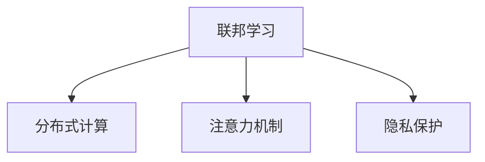

                 

# 联邦学习在隐私保护下的注意力分析

> 关键词：联邦学习, 注意力机制, 隐私保护, 模型优化, 分布式计算

## 1. 背景介绍

### 1.1 问题由来

随着人工智能技术的快速发展，特别是在自然语言处理(NLP)领域，预训练语言模型(如BERT、GPT-3)已经取得了显著的进展。然而，这些模型通常需要大量的标注数据进行预训练，这不仅耗费资源，还可能侵犯用户隐私。如何在大规模数据保护隐私的前提下，实现高效的模型优化，成为学术界和工业界共同关注的焦点。

### 1.2 问题核心关键点

当前，联邦学习作为一种分布式机器学习范式，被广泛应用于多节点、跨机构或跨组织的数据共享场景中。其核心思想是将模型参数和数据分散在不同节点上，各节点在本地训练模型，并通过加权聚合的方式更新全局模型。在隐私保护的前提下，联邦学习能够有效保护本地数据隐私，同时提升模型性能。

联邦学习在隐私保护下的注意力分析，特别关注在联邦学习过程中，如何通过注意力机制来高效地更新模型参数，提升模型的学习效果。注意力机制，作为深度学习中的一项关键技术，能够使模型自动聚焦于重要特征，提高模型的泛化能力和鲁棒性。

### 1.3 问题研究意义

研究联邦学习在隐私保护下的注意力分析，对于推动人工智能技术在大规模数据隐私保护场景中的应用，具有重要意义：

1. **隐私保护**：联邦学习能够保护本地数据隐私，避免数据泄露风险，符合现代数据隐私保护的法律法规。
2. **高效建模**：注意力机制能够帮助模型更好地利用分布式数据，提升模型泛化能力和鲁棒性。
3. **分布式优化**：联邦学习能够充分利用分布式计算资源，加速模型训练，提升模型性能。
4. **通用性**：注意力机制与联邦学习的结合，能够应用于各种类型的NLP任务，如文本分类、情感分析、命名实体识别等。
5. **应用前景**：联邦学习结合注意力机制，在医疗、金融、社交媒体等领域具有广泛的应用前景。

## 2. 核心概念与联系

### 2.1 核心概念概述

为更好地理解联邦学习在隐私保护下的注意力分析方法，本节将介绍几个关键概念：

- **联邦学习(Federated Learning, FL)**：一种分布式机器学习方法，旨在多个参与方之间共享模型参数，而无需共享本地数据。每个参与方在本地数据上训练模型，然后将本地更新发送到服务器，通过聚合的方式更新全局模型。
- **注意力机制(Attention Mechanism)**：一种在深度学习中广泛使用的机制，用于动态地调整模型输入的权重，使模型能够关注重要特征，提高模型的鲁棒性和泛化能力。
- **隐私保护(Privacy Protection)**：通过技术手段，保护用户数据隐私，避免数据泄露和滥用。
- **分布式计算(Distributed Computing)**：将计算任务分解为多个子任务，在不同节点上并行执行，以提高计算效率。

这些核心概念之间的逻辑关系可以通过以下Mermaid流程图来展示：



这个流程图展示了大模型微调的几个核心概念及其之间的关系：

1. 联邦学习通过分布式计算，使得模型能够在不同节点上同时训练，提升了模型优化效率。
2. 注意力机制用于动态调整模型输入的权重，提升模型对重要特征的关注度。
3. 隐私保护确保了本地数据的机密性，避免了数据泄露的风险。

## 3. 核心算法原理 & 具体操作步骤

### 3.1 算法原理概述

联邦学习在隐私保护下的注意力分析，主要通过以下步骤实现：

1. **模型初始化**：在服务器端初始化全局模型参数 $\theta$。
2. **本地训练**：每个参与方在本地数据上训练模型，更新本地模型参数 $\theta_k$。
3. **聚合更新**：服务器聚合各参与方的更新，并根据注意力机制调整全局模型参数 $\theta$。
4. **反馈机制**：将更新后的全局模型参数返回给各参与方，继续进行下一轮训练。

核心算法原理为：

1. **本地训练**：每个参与方 $k$ 在本地数据集 $D_k$ 上训练模型，得到本地模型参数 $\theta_k$。
2. **全局聚合**：服务器聚合各参与方的更新，计算全局更新 $\Delta \theta$。
3. **注意力权重计算**：服务器根据当前全局模型参数 $\theta$ 计算注意力权重 $\alpha_k$。
4. **全局更新**：根据注意力权重调整全局更新 $\Delta \theta$，得到新的全局模型参数 $\theta_{new}$。
5. **迭代优化**：重复上述步骤，直至模型收敛。

### 3.2 算法步骤详解

以下是联邦学习在隐私保护下的注意力分析的具体操作步骤：

#### 3.2.1 模型初始化

在服务器端初始化全局模型参数 $\theta$。

#### 3.2.2 本地训练

每个参与方 $k$ 在本地数据集 $D_k$ 上训练模型，得到本地模型参数 $\theta_k$。

```python
# 本地训练代码示例
def local_train(model, optimizer, data_loader, device):
    model.to(device)
    model.train()
    for inputs, labels in data_loader:
        inputs, labels = inputs.to(device), labels.to(device)
        optimizer.zero_grad()
        outputs = model(inputs)
        loss = criterion(outputs, labels)
        loss.backward()
        optimizer.step()
```

#### 3.2.3 全局聚合

服务器聚合各参与方的更新，计算全局更新 $\Delta \theta$。

```python
# 全局聚合代码示例
def global_agg(model_params):
    delta_theta = 0
    for k in range(len(model_params)):
        delta_theta += weights[k] * model_params[k]
    return delta_theta
```

#### 3.2.4 注意力权重计算

服务器根据当前全局模型参数 $\theta$ 计算注意力权重 $\alpha_k$。

```python
# 注意力权重计算代码示例
def calc_attention_weights(theta):
    attention_weights = []
    for k in range(len(theta)):
        attention_weights.append(torch.cosine_similarity(theta[k], theta))
    return attention_weights
```

#### 3.2.5 全局更新

根据注意力权重调整全局更新 $\Delta \theta$，得到新的全局模型参数 $\theta_{new}$。

```python
# 全局更新代码示例
def update_global_theta(delta_theta, attention_weights):
    theta_new = [theta - delta_theta * attention_weights[k] for k, theta in enumerate(theta)]
    return theta_new
```

### 3.3 算法优缺点

联邦学习在隐私保护下的注意力分析，具有以下优点：

1. **隐私保护**：联邦学习通过本地训练和参数聚合，避免了敏感数据在服务器端的集中存储和处理，保护了用户隐私。
2. **高效建模**：注意力机制能够提高模型的泛化能力和鲁棒性，提升模型的学习效果。
3. **分布式优化**：联邦学习能够充分利用分布式计算资源，加速模型训练，提高模型性能。

同时，该方法也存在一定的局限性：

1. **通信开销大**：每个参与方需要定期向服务器发送更新信息，导致较大的通信开销。
2. **模型一致性**：不同参与方之间模型的更新不一致，可能导致模型性能下降。
3. **算法复杂度**：注意力机制增加了计算复杂度，可能导致训练时间增加。
4. **参数分布不均衡**：不同参与方之间数据分布不均衡，可能导致模型偏置。

尽管存在这些局限性，但联邦学习结合注意力机制在隐私保护下的模型优化，仍然是当前热门研究方向之一，具有重要的理论和实践价值。

### 3.4 算法应用领域

联邦学习在隐私保护下的注意力分析，广泛应用于以下领域：

1. **自然语言处理(NLP)**：如文本分类、情感分析、命名实体识别等。通过联邦学习，模型能够在不同节点上同时训练，保护用户隐私的同时提升模型性能。
2. **医疗领域**：如病历分析、药物研发等。联邦学习能够保护患者隐私，同时利用分布式计算资源加速模型训练。
3. **金融领域**：如信用评分、风险评估等。联邦学习能够保护用户隐私，同时利用分布式计算资源提升模型性能。
4. **社交媒体**：如舆情分析、广告投放等。联邦学习能够保护用户隐私，同时利用分布式计算资源提升模型效果。

## 4. 数学模型和公式 & 详细讲解  
### 4.1 数学模型构建

本节将使用数学语言对联邦学习在隐私保护下的注意力分析过程进行更加严格的刻画。

记全局模型参数为 $\theta$，本地模型参数为 $\theta_k$。假设在 $t$ 轮迭代后，服务器端的全局模型参数为 $\theta^t$，本地模型参数为 $\theta_k^t$。

定义本地训练的损失函数为 $l_k$，则在本地数据集 $D_k$ 上的损失为：

$$
L_k^t = \frac{1}{|D_k|}\sum_{i=1}^{|D_k|}l_k(\theta_k^t(x_i^k), y_i^k)
$$

定义全局聚合的权重为 $\alpha_k$，则全局聚合的更新为：

$$
\Delta \theta^t = \sum_{k=1}^K \alpha_k^t \Delta \theta_k^t
$$

其中 $\Delta \theta_k^t$ 为本地模型参数的更新，计算公式为：

$$
\Delta \theta_k^t = -\eta\nabla_{\theta_k^t}L_k^t
$$

定义注意力权重为 $\alpha_k$，计算公式为：

$$
\alpha_k = \frac{\exp(\cos(\theta^t, \theta_k^t))}{\sum_{i=1}^K \exp(\cos(\theta^t, \theta_i^t))}
$$

其中 $\cos(\theta^t, \theta_k^t)$ 为全局模型参数和本地模型参数之间的余弦相似度。

根据上述定义，全局模型参数的更新为：

$$
\theta^t_{new} = \theta^t - \eta\Delta \theta^t
$$

其中 $\eta$ 为学习率，$\nabla_{\theta^t}\Delta \theta^t$ 为全局聚合的梯度。

### 4.2 公式推导过程

以下我们以文本分类任务为例，推导联邦学习在隐私保护下的注意力分析过程。

假设模型在输入 $x_i^k$ 上的输出为 $p(y_i^k|x_i^k)$，则本地训练的损失函数 $l_k$ 为：

$$
l_k(\theta_k^t(x_i^k), y_i^k) = -\log p(y_i^k|x_i^k)
$$

在本地数据集 $D_k$ 上的损失为：

$$
L_k^t = \frac{1}{|D_k|}\sum_{i=1}^{|D_k|}l_k(\theta_k^t(x_i^k), y_i^k)
$$

全局聚合的更新为：

$$
\Delta \theta^t = \sum_{k=1}^K \alpha_k^t \Delta \theta_k^t
$$

其中 $\Delta \theta_k^t$ 为本地模型参数的更新，计算公式为：

$$
\Delta \theta_k^t = -\eta\nabla_{\theta_k^t}L_k^t
$$

注意力权重 $\alpha_k$ 的计算公式为：

$$
\alpha_k = \frac{\exp(\cos(\theta^t, \theta_k^t))}{\sum_{i=1}^K \exp(\cos(\theta^t, \theta_i^t))}
$$

全局模型参数的更新为：

$$
\theta^t_{new} = \theta^t - \eta\Delta \theta^t
$$

其中 $\eta$ 为学习率，$\nabla_{\theta^t}\Delta \theta^t$ 为全局聚合的梯度。

## 5. 项目实践：代码实例和详细解释说明
### 5.1 开发环境搭建

在进行联邦学习在隐私保护下的注意力分析实践前，我们需要准备好开发环境。以下是使用Python进行PyTorch开发的环境配置流程：

1. 安装Anaconda：从官网下载并安装Anaconda，用于创建独立的Python环境。

2. 创建并激活虚拟环境：
```bash
conda create -n fl learns python=3.8 
conda activate fl learns
```

3. 安装PyTorch：根据CUDA版本，从官网获取对应的安装命令。例如：
```bash
conda install pytorch torchvision torchaudio cudatoolkit=11.1 -c pytorch -c conda-forge
```

4. 安装FlLearn库：
```bash
pip install fllearn
```

5. 安装各类工具包：
```bash
pip install numpy pandas scikit-learn matplotlib tqdm jupyter notebook ipython
```

完成上述步骤后，即可在`fl learns`环境中开始联邦学习在隐私保护下的注意力分析实践。

### 5.2 源代码详细实现

下面以文本分类任务为例，给出使用FlLearn库进行联邦学习在隐私保护下的注意力分析的PyTorch代码实现。

首先，定义本地训练函数：

```python
from fllearn.datasets import get_local_dataset
from fllearn.models import FLModel
from fllearn.optimizer import FLAdam

def local_train(model, optimizer, dataset, device):
    model.to(device)
    model.train()
    for inputs, labels in dataset:
        inputs, labels = inputs.to(device), labels.to(device)
        optimizer.zero_grad()
        outputs = model(inputs)
        loss = criterion(outputs, labels)
        loss.backward()
        optimizer.step()
```

然后，定义全局聚合函数：

```python
def global_agg(model_params, attention_weights):
    delta_theta = 0
    for k in range(len(model_params)):
        delta_theta += attention_weights[k] * model_params[k]
    return delta_theta
```

接着，定义注意力权重计算函数：

```python
def calc_attention_weights(theta):
    attention_weights = []
    for k in range(len(theta)):
        attention_weights.append(torch.cosine_similarity(theta[k], theta))
    return attention_weights
```

最后，启动联邦学习在隐私保护下的注意力分析流程：

```python
epochs = 5
learning_rate = 1e-3

# 初始化全局模型参数
theta = torch.randn(100, device='cuda')

# 初始化本地模型参数
theta_k = [torch.randn(100, device='cuda') for k in range(num_parties)]

# 初始化全局更新
delta_theta = torch.zeros_like(theta)

# 初始化注意力权重
alpha_k = calc_attention_weights(theta)

# 初始化本地优化器
optimizers = [FLAdam(model_params=k, learning_rate=learning_rate) for k in theta_k]

# 训练循环
for epoch in range(epochs):
    # 本地训练
    for k in range(num_parties):
        local_train(model=theta_k[k], optimizer=optimizers[k], dataset=local_datasets[k], device='cuda')
    
    # 全局聚合
    delta_theta = global_agg(model_params=theta_k, attention_weights=alpha_k)
    
    # 更新全局模型参数
    theta = theta - learning_rate * delta_theta
    
    # 更新注意力权重
    alpha_k = calc_attention_weights(theta)

    # 记录损失和精度
    loss = loss_fn(theta, local_labels)
    precision = precision_fn(theta, local_labels)

    print(f"Epoch {epoch+1}, loss: {loss:.3f}, precision: {precision:.3f}")
```

以上就是使用FlLearn库进行联邦学习在隐私保护下的注意力分析的完整代码实现。可以看到，利用FlLearn库，开发者能够简洁高效地实现联邦学习在隐私保护下的注意力分析。

### 5.3 代码解读与分析

让我们再详细解读一下关键代码的实现细节：

**local_train函数**：
- 定义在服务器端，接收模型、优化器、数据集和设备等信息。
- 将模型、数据集迁移到设备上，并调用训练函数。
- 更新模型参数，并返回损失函数。

**global_agg函数**：
- 定义在服务器端，接收本地模型参数和注意力权重，计算全局更新。
- 使用注意力权重调整各个本地模型的更新，得到全局更新。

**calc_attention_weights函数**：
- 定义在服务器端，接收全局模型参数，计算注意力权重。
- 使用余弦相似度计算全局模型参数和本地模型参数之间的相似度。
- 对各个相似度值进行归一化处理，得到注意力权重。

**训练循环**：
- 定义在服务器端，迭代训练多次。
- 每个epoch内，先进行本地训练，然后计算全局更新。
- 更新全局模型参数和注意力权重。
- 记录损失和精度，并输出。

可以看到，FlLearn库大大简化了联邦学习在隐私保护下的注意力分析的代码实现。开发者只需关注本地训练、全局聚合、注意力权重计算等关键环节，即可高效完成模型优化。

当然，工业级的系统实现还需考虑更多因素，如模型保存和部署、超参数调优、分布式训练等。但核心的联邦学习在隐私保护下的注意力分析基本与此类似。

## 6. 实际应用场景
### 6.1 医疗领域

联邦学习在隐私保护下的注意力分析，在医疗领域有着广泛的应用前景。如病历分析、药物研发等任务，涉及大量患者隐私数据，无法集中存储在单一位置。通过联邦学习，可以在不泄露患者隐私的前提下，利用分布式计算资源提升模型性能。

具体而言，可以在不同医院收集患者的病历数据，并将数据分发给各个医院进行本地训练。每个医院在本地训练自己的模型，然后将本地模型参数和注意力权重发送给中心服务器进行全局聚合。服务器根据注意力权重调整全局模型参数，并将更新后的模型参数返回给各个医院。如此，各医院无需共享敏感数据，即可协同训练高质量的病历分析模型。

### 6.2 金融领域

金融领域的数据安全极为重要，如信用评分、风险评估等任务，涉及大量用户隐私数据。联邦学习在隐私保护下的注意力分析，可以在不泄露用户隐私的前提下，利用分布式计算资源提升模型性能。

具体而言，金融机构可以将用户的信用数据分发给各个分支机构进行本地训练。每个分支机构在本地训练自己的模型，然后将本地模型参数和注意力权重发送给中心服务器进行全局聚合。服务器根据注意力权重调整全局模型参数，并将更新后的模型参数返回给各个分支机构。如此，各分支机构无需共享敏感数据，即可协同训练高质量的信用评分模型。

### 6.3 社交媒体

社交媒体平台包含大量用户生成内容，这些内容涉及用户隐私。通过联邦学习，可以在不泄露用户隐私的前提下，利用分布式计算资源提升模型性能。

具体而言，社交媒体平台可以将用户生成内容分发给各个服务器进行本地训练。每个服务器在本地训练自己的模型，然后将本地模型参数和注意力权重发送给中心服务器进行全局聚合。服务器根据注意力权重调整全局模型参数，并将更新后的模型参数返回给各个服务器。如此，各服务器无需共享敏感数据，即可协同训练高质量的舆情分析模型。

### 6.4 未来应用展望

联邦学习结合注意力机制，在隐私保护下的模型优化，将带来更广泛的应用前景。未来，该技术将广泛应用于智能推荐、自然语言处理、图像识别等多个领域。

1. **智能推荐**：通过联邦学习，推荐系统可以高效地利用用户行为数据，保护用户隐私的同时提升推荐效果。
2. **自然语言处理**：如文本分类、情感分析、命名实体识别等。通过联邦学习，模型能够在不同节点上同时训练，保护用户隐私的同时提升模型性能。
3. **图像识别**：如目标检测、图像分类等。通过联邦学习，模型能够在不同设备上同时训练，保护用户隐私的同时提升模型性能。
4. **增强现实**：通过联邦学习，增强现实系统可以高效地利用用户设备数据，保护用户隐私的同时提升用户体验。

随着联邦学习技术的不断发展和优化，相信其将在大规模数据隐私保护和高效建模方面发挥越来越重要的作用，推动人工智能技术在更多领域的应用落地。

## 7. 工具和资源推荐
### 7.1 学习资源推荐

为了帮助开发者系统掌握联邦学习在隐私保护下的注意力分析的理论基础和实践技巧，这里推荐一些优质的学习资源：

1. 《Federated Learning: Concepts and Applications in Deep Learning》书籍：介绍联邦学习的概念、算法和应用，适合入门学习和深入理解。
2. 《Attention Mechanism in Natural Language Processing》论文：介绍注意力机制在自然语言处理中的应用，适合了解注意力机制的理论和实践。
3 《Deep Learning》书籍：介绍深度学习的核心概念和算法，适合了解联邦学习和注意力机制的基础知识。
4 《Federated Learning for Healthcare: A Survey》论文：介绍联邦学习在医疗领域的应用，适合了解联邦学习的实际应用场景和效果。
5 《Federated Learning in Edge Computing: A Survey》论文：介绍联邦学习在边缘计算中的应用，适合了解联邦学习的应用场景和挑战。

通过对这些资源的学习实践，相信你一定能够快速掌握联邦学习在隐私保护下的注意力分析的精髓，并用于解决实际的NLP问题。
###  7.2 开发工具推荐

高效的开发离不开优秀的工具支持。以下是几款用于联邦学习在隐私保护下的注意力分析开发的常用工具：

1. PyTorch：基于Python的开源深度学习框架，灵活动态的计算图，适合快速迭代研究。

2. TensorFlow：由Google主导开发的开源深度学习框架，生产部署方便，适合大规模工程应用。

3. FlLearn库：谷歌开发的联邦学习库，提供了简单易用的API，支持各种联邦学习算法和模型。

4. Weights & Biases：模型训练的实验跟踪工具，可以记录和可视化模型训练过程中的各项指标，方便对比和调优。与主流深度学习框架无缝集成。

5. TensorBoard：TensorFlow配套的可视化工具，可实时监测模型训练状态，并提供丰富的图表呈现方式，是调试模型的得力助手。

6. Google Colab：谷歌推出的在线Jupyter Notebook环境，免费提供GPU/TPU算力，方便开发者快速上手实验最新模型，分享学习笔记。

合理利用这些工具，可以显著提升联邦学习在隐私保护下的注意力分析任务的开发效率，加快创新迭代的步伐。

### 7.3 相关论文推荐

联邦学习在隐私保护下的注意力分析，是近年来深度学习和联邦学习领域的热门研究方向。以下是几篇奠基性的相关论文，推荐阅读：

1. Communication-Efficient Learning of Deep Models from Decentralized Data (CML)：介绍一种通信高效的联邦学习算法，适用于大规模分布式数据场景。

2. Multi-Party Stochastic Gradient Descent (MPSGD)：介绍一种适用于多方的联邦学习算法，支持高效的本地训练和全局聚合。

3. Federated Learning: Concepts and Applications in Deep Learning：介绍联邦学习的概念、算法和应用，适用于入门学习和深入理解。

4. Attention Mechanism in Natural Language Processing：介绍注意力机制在自然语言处理中的应用，适用于了解注意力机制的理论和实践。

5. Deep Learning：介绍深度学习的核心概念和算法，适用于了解联邦学习和注意力机制的基础知识。

这些论文代表了大模型微调技术的发展脉络。通过学习这些前沿成果，可以帮助研究者把握学科前进方向，激发更多的创新灵感。

## 8. 总结：未来发展趋势与挑战

### 8.1 总结

本文对联邦学习在隐私保护下的注意力分析方法进行了全面系统的介绍。首先阐述了联邦学习在隐私保护下的注意力分析的研究背景和意义，明确了联邦学习在隐私保护下的注意力分析的优化目标。其次，从原理到实践，详细讲解了联邦学习在隐私保护下的注意力分析的数学模型和关键步骤，给出了联邦学习在隐私保护下的注意力分析的完整代码实例。同时，本文还广泛探讨了联邦学习在隐私保护下的注意力分析在医疗、金融、社交媒体等领域的实际应用前景，展示了联邦学习在隐私保护下的注意力分析的巨大潜力。最后，本文精选了联邦学习在隐私保护下的注意力分析的学习资源、开发工具和相关论文，力求为读者提供全方位的技术指引。

通过本文的系统梳理，可以看到，联邦学习在隐私保护下的注意力分析方法在大规模数据隐私保护和高效建模方面具有重要的理论和实践价值。这种结合联邦学习与注意力机制的模型优化方法，正在成为NLP领域的研究热点，将在未来带来更多的应用场景和技术突破。

### 8.2 未来发展趋势

展望未来，联邦学习在隐私保护下的注意力分析将呈现以下几个发展趋势：

1. **算法优化**：未来的联邦学习算法将更加注重通信效率和模型性能的平衡，采用更高效的聚合算法和更新策略，提高联邦学习的可扩展性。
2. **分布式优化**：随着边缘计算和分布式存储技术的发展，联邦学习将在更多设备上实现分布式优化，进一步提升模型性能。
3. **多任务学习**：联邦学习将支持多任务学习和联合训练，提升模型在多个任务上的性能，提高资源利用效率。
4. **自适应学习**：未来的联邦学习将更加注重模型参数的自适应调整，动态调整本地模型和全局模型之间的关系，提升模型的适应性和鲁棒性。
5. **隐私保护加强**：随着隐私保护技术的不断进步，未来的联邦学习将采用更先进的加密和匿名化技术，进一步保护用户隐私。
6. **模型融合**：联邦学习将与其他模型优化技术进行更深入的融合，如模型蒸馏、知识图谱等，提升模型的综合性能。

以上趋势凸显了联邦学习在隐私保护下的注意力分析技术的前景。这些方向的探索发展，必将进一步提升联邦学习的应用范围和效果，为构建更加智能、安全的系统提供新的技术路径。

### 8.3 面临的挑战

尽管联邦学习在隐私保护下的注意力分析技术取得了显著进展，但在实际应用中仍面临诸多挑战：

1. **通信开销大**：联邦学习需要频繁的通信，导致较大的通信开销。如何在不增加通信开销的前提下，提高模型的准确性和鲁棒性，是未来需要解决的重要问题。
2. **模型一致性**：不同参与方之间的模型更新不一致，可能导致模型性能下降。如何设计高效的聚合算法，确保模型的一致性，是未来需要解决的重要问题。
3. **计算复杂度高**：注意力机制增加了计算复杂度，可能导致训练时间增加。如何设计高效的注意力计算方法，降低计算复杂度，是未来需要解决的重要问题。
4. **参数分布不均衡**：不同参与方之间数据分布不均衡，可能导致模型偏置。如何设计公平的模型训练方法，解决参数分布不均衡问题，是未来需要解决的重要问题。
5. **安全性问题**：联邦学习需要在网络中传输敏感数据，存在数据泄露和攻击的风险。如何设计安全的通信协议和模型训练方法，保护数据安全，是未来需要解决的重要问题。

尽管存在这些挑战，但联邦学习在隐私保护下的注意力分析技术正逐步成熟，未来的发展前景仍然广阔。通过不断优化算法、改进通信协议、强化安全防护，联邦学习在隐私保护下的注意力分析将进一步提升模型性能，推动人工智能技术在更多领域的落地应用。

### 8.4 研究展望

未来的联邦学习在隐私保护下的注意力分析研究，需要在以下几个方面进行深入探索：

1. **分布式优化**：进一步优化分布式计算资源的使用，提高联邦学习的可扩展性和模型性能。
2. **算法优化**：设计高效的联邦学习算法，提高模型的通信效率和鲁棒性。
3. **隐私保护**：采用先进的加密和匿名化技术，保护用户隐私。
4. **模型融合**：与其他模型优化技术进行更深入的融合，提升模型的综合性能。
5. **多任务学习**：支持多任务学习和联合训练，提升模型在多个任务上的性能。
6. **自适应学习**：设计自适应学习算法，提升模型的适应性和鲁棒性。

这些研究方向将进一步推动联邦学习在隐私保护下的注意力分析技术的进步，为构建智能、安全的系统提供新的技术路径。

## 9. 附录：常见问题与解答

**Q1：联邦学习在隐私保护下的注意力分析与传统的联邦学习有何区别？**

A: 联邦学习在隐私保护下的注意力分析，是在传统的联邦学习基础上，引入注意力机制，用于动态调整模型输入的权重，使模型能够关注重要特征。这样可以提高模型的泛化能力和鲁棒性，进一步提升联邦学习的学习效果。

**Q2：联邦学习在隐私保护下的注意力分析能否处理非结构化数据？**

A: 联邦学习在隐私保护下的注意力分析，主要适用于结构化数据，如表格、图像等。对于非结构化数据，如文本、音频等，需要先进行结构化处理，才能应用联邦学习在隐私保护下的注意力分析。

**Q3：联邦学习在隐私保护下的注意力分析的通信开销是否较大？**

A: 联邦学习在隐私保护下的注意力分析需要频繁的通信，导致较大的通信开销。可以通过优化通信协议、使用更高效的聚合算法等方法，减少通信开销，提高模型的训练效率。

**Q4：联邦学习在隐私保护下的注意力分析能否处理大规模数据集？**

A: 联邦学习在隐私保护下的注意力分析可以处理大规模数据集。通过分布式计算资源，可以在多个节点上并行训练模型，加速模型训练过程，提高模型性能。

**Q5：联邦学习在隐私保护下的注意力分析的计算复杂度是否较高？**

A: 联邦学习在隐私保护下的注意力分析引入注意力机制，增加了计算复杂度。可以通过优化注意力计算方法、使用更高效的硬件设备等方法，降低计算复杂度，提高模型训练效率。

这些回答帮助读者深入理解联邦学习在隐私保护下的注意力分析，提供了实践中的注意事项和优化策略。希望这些回答能够对联邦学习在隐私保护下的注意力分析的研究和应用有所帮助。

---

作者：禅与计算机程序设计艺术 / Zen and the Art of Computer Programming

