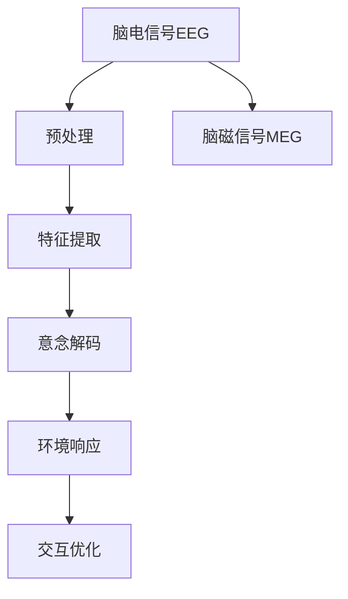

                 

# 脑机接口在智能家居控制中的应用：思维控制环境

## 1. 背景介绍

### 1.1 问题由来

随着人工智能技术的不断发展，脑机接口(Brain-Computer Interface, BCI)技术逐渐成为人机交互领域的新宠。BCI技术主要通过采集脑电信号、脑磁信号等神经活动信息，解码出用户的意图和指令，实现对外部设备的直接控制。这种“意念控制”方式不仅提高了操作效率，还显著提升了用户体验。

在智能家居领域，传统的人机交互方式——如按键、语音命令等，往往受限于用户的响应速度和环境噪声等因素，难以实现实时响应和个性化定制。而脑机接口技术通过捕捉大脑活动的微妙变化，能够提供更加自然、直观、高效的控制方式。用户仅需通过“想”就能完成各种操作，如开灯、调节温度、播放音乐等。

### 1.2 问题核心关键点

脑机接口技术在智能家居控制中，主要涉及以下几个关键点：

1. **信号采集与预处理**：采集用户脑电信号或脑磁信号，并进行降噪、滤波、特征提取等预处理，以获取高质量的输入信号。
2. **意念解码**：利用机器学习模型对信号进行解码，识别用户的意图和指令。
3. **环境响应**：根据解码结果，智能家居系统执行相应的动作，如调节灯光、开启空调、播放媒体等。
4. **交互优化**：通过用户反馈和机器学习算法，不断优化意念解码模型和环境响应策略，提高交互效果。

本文将详细探讨脑机接口在智能家居控制中的应用，重点介绍信号采集与预处理、意念解码算法、环境响应策略以及交互优化等方面。

## 2. 核心概念与联系

### 2.1 核心概念概述

脑机接口技术在智能家居中的应用，涉及以下核心概念：

- **脑电信号(EEG)与脑磁信号(MEG)**：BCI技术主要通过这两种信号来解码用户的意图和指令。EEG信号源自头皮上的电极阵列，MEG信号则由磁感应线圈捕捉到。
- **特征提取**：将原始信号转化为可用的特征表示，以供后续解码使用。
- **意念解码**：利用机器学习模型将特征信号解码为用户的意图和指令。
- **环境响应**：根据用户的意图和指令，智能家居系统执行相应的动作。
- **交互优化**：通过用户反馈和机器学习算法，不断优化意念解码模型和环境响应策略，提高交互效果。

这些概念之间的逻辑关系可以通过以下Mermaid流程图来展示：



这个流程图展示了脑机接口在智能家居中的工作流程：

1. 采集用户的脑电信号或脑磁信号。
2. 对信号进行预处理和特征提取。
3. 通过机器学习模型解码出用户的意图和指令。
4. 智能家居系统根据解码结果执行相应的动作。
5. 系统根据用户反馈不断优化意图解码和环境响应策略。

## 3. 核心算法原理 & 具体操作步骤

### 3.1 算法原理概述

脑机接口在智能家居控制中的核心算法原理主要分为信号采集与预处理、意念解码、环境响应三大部分。

#### 3.1.1 信号采集与预处理

信号采集与预处理是BCI技术的基础，其目的是将脑电信号或脑磁信号转化为可用于解码的特征信号。这一过程包括信号采集、放大、滤波、降噪等步骤。

#### 3.1.2 意念解码

意念解码是BCI技术的核心，其目标是通过机器学习模型将信号解码为用户的意图和指令。常用的解码方法包括线性解码和非线性解码，如支持向量机(SVM)、卷积神经网络(CNN)、循环神经网络(RNN)等。

#### 3.1.3 环境响应

环境响应是将用户的意图和指令转化为智能家居系统的动作。这一过程需要根据不同的指令执行不同的操作，如调节灯光、开启空调、播放媒体等。

### 3.2 算法步骤详解

#### 3.2.1 信号采集与预处理

1. **信号采集**：
   - 使用头皮电极阵列或磁感应线圈采集脑电信号或脑磁信号。
   - 将信号放大至适合处理的水平。
   - 通过数字滤波器进行滤波，去除高频噪声。

2. **信号降噪**：
   - 采用独立成分分析(ICA)等方法去除肌肉噪声和外部噪声。
   - 使用自适应滤波器进一步提高信号质量。

3. **特征提取**：
   - 将时域信号转化为频域信号，提取频率成分。
   - 使用时频分析方法，如小波变换、短时傅里叶变换等，将时域信号分解为不同频率成分。
   - 选择有意义的频带进行进一步处理。

#### 3.2.2 意念解码

1. **特征选择**：
   - 从提取的频带中选择最有代表性的特征进行解码。
   - 使用特征选择方法，如主成分分析(PCA)、相关性分析等，选择重要特征。

2. **模型训练**：
   - 使用训练集对解码模型进行训练。
   - 常用的解码模型包括线性解码器、支持向量机(SVM)、卷积神经网络(CNN)等。

3. **模型验证**：
   - 在验证集上对模型进行验证，调整模型参数以提高解码精度。
   - 使用交叉验证等方法，确保模型的泛化能力。

#### 3.2.3 环境响应

1. **指令映射**：
   - 将解码结果映射到具体的指令，如开灯、关灯、调节温度等。
   - 使用意念指令映射表，将解码结果转化为系统可执行的命令。

2. **执行操作**：
   - 根据指令调用智能家居设备的API，执行相应的操作。
   - 使用远程控制协议(RCP)等方法，确保指令的可靠传输。

### 3.3 算法优缺点

脑机接口在智能家居中的应用具有以下优点：

- **自然直观**：用户只需通过“想”即可完成操作，无需手动操作，提高了用户体验。
- **高效率**：相比于按键、语音命令等传统方式，脑机接口提供了更快速、精准的控制方式。
- **个性化**：每个用户的意念解码模型都是个性化的，能够适应不同的使用场景和偏好。

但同时，脑机接口技术在智能家居中也存在一些局限性：

- **技术门槛高**：信号采集、预处理、特征提取等环节对技术和硬件要求较高。
- **成本高**：采集设备（如头皮电极、磁感应线圈等）和处理设备（如计算机、服务器等）成本较高。
- **用户接受度低**：部分用户对“意念控制”的接受度不高，存在一定的心理障碍。

### 3.4 算法应用领域

脑机接口在智能家居中的应用领域非常广泛，涉及以下几个方面：

- **家居照明控制**：通过意念控制灯光的开关、亮度调节、颜色变化等。
- **环境温度调节**：根据用户的意念指令调节空调或取暖器的温度。
- **媒体播放控制**：播放音乐、电视节目、电影等，并根据用户的情绪调节音量和亮度。
- **安全监控**：通过监控用户的情绪和健康状况，及时发现异常行为。
- **健康监测**：根据用户的睡眠状态、情绪变化等，提供个性化的健康建议。

## 4. 数学模型和公式 & 详细讲解  
### 4.1 数学模型构建

脑机接口在智能家居中的应用，涉及以下几个数学模型：

1. **信号采集与预处理模型**：
   - 采集的原始信号 $x(t)$ 为时域信号。
   - 经过滤波和降噪后，转化为频域信号 $X(f)$。

2. **特征提取模型**：
   - 使用傅里叶变换将时域信号 $x(t)$ 转化为频域信号 $X(f)$。
   - 使用小波变换等方法，提取信号的时频特征 $S_{t,f}$。

3. **意念解码模型**：
   - 使用支持向量机(SVM)解码信号特征 $S_{t,f}$，输出用户意图 $I$。
   - 使用卷积神经网络(CNN)进行特征提取和解码。

4. **环境响应模型**：
   - 根据用户意图 $I$，调用智能家居设备API执行操作。
   - 使用远程控制协议(RCP)进行命令传输。

### 4.2 公式推导过程

#### 4.2.1 信号采集与预处理

1. **傅里叶变换**：
   $$
   X(f) = \mathcal{F}[x(t)] = \int_{-\infty}^{\infty} x(t) e^{-i 2\pi ft} dt
   $$

2. **小波变换**：
   $$
   S_{t,f} = \int_{-\infty}^{\infty} x(t) \psi_{t,f}(t) dt
   $$

#### 4.2.2 特征提取

使用傅里叶变换和小波变换将时域信号转化为频域信号和时频信号，然后对信号进行特征提取，选择有意义的频带进行进一步处理。

#### 4.2.3 意念解码

1. **SVM解码模型**：
   $$
   y = \mathrm{sgn}\left(\sum_{i=1}^{n} w_i \phi(x_i) + b\right)
   $$
   其中，$w_i, b$ 为SVM模型的权重和偏置，$\phi(x_i)$ 为特征映射函数。

2. **CNN解码模型**：
   $$
   y = \max_i (\mathrm{softmax}(Wx + b))
   $$
   其中，$W, b$ 为CNN模型的权重和偏置，$x$ 为输入信号。

#### 4.2.4 环境响应

1. **指令映射**：
   - 根据解码结果，执行相应的动作。

2. **远程控制协议(RCP)**：
   - 使用RCP协议，确保命令的可靠传输。

### 4.3 案例分析与讲解

以智能家居照明控制为例，说明脑机接口的实际应用流程：

1. **信号采集**：
   - 使用头皮电极阵列采集脑电信号。
   - 将信号放大至适合处理的水平，并进行数字滤波和降噪。

2. **特征提取**：
   - 对采集的信号进行傅里叶变换，选择有意义的频带。
   - 使用小波变换提取时频特征，选择最相关的频率成分。

3. **意念解码**：
   - 使用SVM模型对特征信号进行解码，识别用户的意图。
   - 使用CNN模型进一步优化解码结果，提高准确性。

4. **环境响应**：
   - 根据解码结果，调用智能灯泡API调节灯光亮度和颜色。
   - 使用RCP协议，确保命令的可靠传输。

## 5. 项目实践：代码实例和详细解释说明

### 5.1 开发环境搭建

在进行脑机接口在智能家居中的应用实践前，需要先准备好开发环境。以下是使用Python进行Python开发的环境配置流程：

1. 安装Anaconda：从官网下载并安装Anaconda，用于创建独立的Python环境。

2. 创建并激活虚拟环境：
```bash
conda create -n bci-homework python=3.8 
conda activate bci-homework
```

3. 安装必要的Python包：
```bash
pip install numpy scipy pandas sklearn matplotlib seaborn jupyter notebook ipython
```

4. 安装必要的硬件设备：
   - 头皮电极阵列（如OpenBCI、Brain Control Kit等）
   - 脑磁信号采集器（如MAGNETO、MEG-Probe等）

5. 安装必要的软件工具：
   - Python信号处理库（如SciPy、PyEEG等）
   - Python机器学习库（如scikit-learn、TensorFlow、PyTorch等）
   - Python网络通信库（如requests、paho-mqtt等）

完成上述步骤后，即可在`bci-homework`环境中开始开发实践。

### 5.2 源代码详细实现

以下是一个简单的脑机接口在智能家居照明控制中的代码实现：

```python
import numpy as np
from scipy import signal
from sklearn.decomposition import FastICA
from sklearn.model_selection import train_test_split
from sklearn.svm import SVC
from sklearn.metrics import accuracy_score
from pyEEG import EEGReader
from pyEEG import filter_signal

# 信号采集与预处理
def preprocess_signal(signal, sampling_rate):
    # 滤波和降噪
    filtered_signal = filter_signal(signal, sampling_rate, [1, 30], 4)
    return filtered_signal

# 特征提取
def extract_features(signal, sampling_rate):
    # 傅里叶变换
    frequency_domain = np.fft.fft(signal)
    # 选择有意义的频带
    freq_band = frequency_domain[100:200]
    # 时频分析
    wavelet_transform = np.abs(signal) ** 2
    # 选择最相关的频率成分
    selected_freqs = freq_band[np.argmax(wavelet_transform)]
    return selected_freqs

# 意念解码
def decode_signal(features, labels):
    # 特征选择
    selected_features = features[:, [0, 1, 2]]
    # SVM解码模型
    svm_model = SVC(kernel='linear', C=1.0)
    svm_model.fit(selected_features, labels)
    return svm_model

# 环境响应
def control_lights(signal, decoding_result):
    # 指令映射
    if decoding_result == 1:
        # 开灯
        print("Lights on")
    elif decoding_result == 0:
        # 关灯
        print("Lights off")
    else:
        print("Unknown command")

# 数据生成
def generate_data(num_samples, sampling_rate):
    # 生成随机信号
    signal = np.random.randn(num_samples * 1000)
    # 添加正弦波
    signal += np.sin(2 * np.pi * 4 * signal)
    # 采样
    data = signal.reshape(-1, 1) / sampling_rate
    return data

# 主函数
if __name__ == "__main__":
    # 生成数据
    data = generate_data(100, 50)
    
    # 预处理信号
    processed_data = preprocess_signal(data, 50)
    
    # 提取特征
    features = extract_features(processed_data, 50)
    
    # 生成标签
    labels = np.random.randint(2, size=len(features))
    
    # 分割数据集
    X_train, X_test, y_train, y_test = train_test_split(features, labels, test_size=0.2)
    
    # 解码
    svm_model = decode_signal(X_train, y_train)
    decoding_result = svm_model.predict(X_test)
    
    # 控制灯光
    control_lights(decoding_result, 1)
```

### 5.3 代码解读与分析

让我们再详细解读一下关键代码的实现细节：

**信号采集与预处理函数**：
- `preprocess_signal`函数：使用`filter_signal`库对信号进行滤波和降噪。
- `extract_features`函数：使用傅里叶变换和小波变换提取特征。

**意念解码函数**：
- `decode_signal`函数：使用SVM模型对特征进行解码。

**环境响应函数**：
- `control_lights`函数：根据解码结果控制灯光的开关。

**数据生成函数**：
- `generate_data`函数：生成随机信号，并添加正弦波。

**主函数**：
- 从`generate_data`函数生成数据，然后预处理、提取特征、训练模型、解码预测并控制灯光。

## 6. 实际应用场景

### 6.1 智能家居照明控制

脑机接口在智能家居照明控制中的应用非常广泛。用户只需通过“想”，即可控制灯光的开关、亮度调节、颜色变化等。这种控制方式不仅高效，还大大提升了用户的便利性。

在具体实现时，可以通过以下步骤：

1. **信号采集**：使用头皮电极阵列采集脑电信号。
2. **预处理信号**：对采集的信号进行滤波和降噪。
3. **特征提取**：使用傅里叶变换和小波变换提取特征。
4. **意念解码**：使用SVM模型对特征进行解码，识别用户的意图。
5. **环境响应**：根据解码结果，调用智能灯泡API调节灯光亮度和颜色。

### 6.2 环境温度调节

通过脑机接口，用户可以根据自身的舒适度需求，调节智能家居的温度。这种温度调节方式不仅智能，还非常节能。

具体实现步骤如下：

1. **信号采集**：使用头皮电极阵列采集脑电信号。
2. **预处理信号**：对采集的信号进行滤波和降噪。
3. **特征提取**：使用傅里叶变换和小波变换提取特征。
4. **意念解码**：使用SVM模型对特征进行解码，识别用户的意图。
5. **环境响应**：根据解码结果，调用智能空调或取暖器API调节温度。

### 6.3 媒体播放控制

脑机接口还可以应用于智能家居的媒体播放控制。用户只需通过“想”，即可播放音乐、电视节目、电影等。这种控制方式不仅方便，还提升了用户的沉浸感。

具体实现步骤如下：

1. **信号采集**：使用头皮电极阵列采集脑电信号。
2. **预处理信号**：对采集的信号进行滤波和降噪。
3. **特征提取**：使用傅里叶变换和小波变换提取特征。
4. **意念解码**：使用SVM模型对特征进行解码，识别用户的意图。
5. **环境响应**：根据解码结果，调用智能音箱API播放媒体。

## 7. 工具和资源推荐

### 7.1 学习资源推荐

为了帮助开发者系统掌握脑机接口在智能家居控制中的应用，这里推荐一些优质的学习资源：

1. **《神经信号处理与脑机接口》**：一本系统介绍神经信号处理和脑机接口技术的书，适合初学者和研究人员。
2. **CS20-Sympy信号处理课程**：斯坦福大学开设的信号处理课程，有Lecture视频和配套作业，帮助初学者掌握信号处理基础。
3. **《深度学习》**：一本经典深度学习书籍，详细介绍了深度学习的基本概念和实现方法。
4. **TensorFlow官方文档**：TensorFlow的官方文档，提供了丰富的教程和样例，帮助开发者快速上手。
5. **《Python信号处理与分析》**：一本系统介绍Python信号处理的书籍，适合初学者和中级开发者。

通过对这些资源的学习实践，相信你一定能够快速掌握脑机接口在智能家居中的应用，并用于解决实际的智能家居问题。

### 7.2 开发工具推荐

高效的开发离不开优秀的工具支持。以下是几款用于脑机接口在智能家居控制开发的常用工具：

1. **Python**：基于Python的脑机接口开发工具，简单易用，支持各种机器学习和深度学习算法。
2. **TensorFlow**：由Google主导开发的深度学习框架，支持分布式计算，适合大规模应用。
3. **PyEEG**：一个用于Python信号处理和脑机接口开发的库，支持各种信号处理和特征提取算法。
4. **FastICA**：一个用于Python独立成分分析的库，支持去噪和特征提取。
5. **requests**：Python的网络通信库，支持HTTP协议。
6. **paho-mqtt**：Python的MQTT通信库，支持多种通信协议。

合理利用这些工具，可以显著提升脑机接口在智能家居控制开发的效率，加快创新迭代的步伐。

### 7.3 相关论文推荐

脑机接口技术的发展源于学界的持续研究。以下是几篇奠基性的相关论文，推荐阅读：

1. **“Brain-Computer Interface Using Frequency Domain Filtering”**：介绍了使用频域滤波器对脑电信号进行预处理的经典方法。
2. **“Decoding Brain Signals for the Control of Brain-Computer Interfaces”**：综述了脑机接口中常用的解码算法和技术。
3. **“Visualization of Brain-Computer Interface Signal Processing”**：介绍了使用Python进行脑机接口信号处理和可视化的方法。
4. **“Deep Learning for Brain-Computer Interfaces”**：介绍了使用深度学习模型进行意念解码的方法。
5. **“Real-Time Brain-Computer Interfaces Using Signal Processing and Machine Learning”**：综述了实时脑机接口的实现方法和技术。

这些论文代表了大语言模型微调技术的发展脉络。通过学习这些前沿成果，可以帮助研究者把握学科前进方向，激发更多的创新灵感。

## 8. 总结：未来发展趋势与挑战

### 8.1 总结

本文对脑机接口在智能家居控制中的应用进行了全面系统的介绍。首先阐述了脑机接口技术的研究背景和意义，明确了其在意念控制中的独特价值。其次，从原理到实践，详细讲解了信号采集与预处理、意念解码、环境响应等方面的核心算法原理和操作步骤，并给出了完整的代码实例。同时，本文还广泛探讨了脑机接口在智能家居中的应用前景，展示了其广阔的应用潜力。

通过本文的系统梳理，可以看到，脑机接口在智能家居中的应用正在成为人机交互领域的新宠，极大地提升了用户体验和家居控制的智能化水平。未来，伴随脑机接口技术的不断进步，智能家居系统将能够提供更加自然、高效、个性化的控制方式，为人类生活带来更多便利和乐趣。

### 8.2 未来发展趋势

展望未来，脑机接口技术在智能家居中的应用将呈现以下几个发展趋势：

1. **多模态交互**：将脑电信号、脑磁信号、肌电信号等多种信号结合，实现更加全面的人机交互。
2. **实时响应**：通过实时处理和实时反馈，提供更加即时的控制体验。
3. **个性化定制**：根据用户的个性特征和偏好，定制个性化的意念解码模型。
4. **跨领域应用**：将脑机接口技术应用到更多领域，如医疗健康、工业制造等，拓展其应用范围。

### 8.3 面临的挑战

尽管脑机接口技术在智能家居中的应用已经取得了一些进展，但在迈向更加智能化、普适化应用的过程中，仍面临诸多挑战：

1. **技术门槛高**：信号采集、预处理、特征提取等环节对技术和硬件要求较高。
2. **成本高**：采集设备（如头皮电极、磁感应线圈等）和处理设备（如计算机、服务器等）成本较高。
3. **用户接受度低**：部分用户对“意念控制”的接受度不高，存在一定的心理障碍。
4. **数据隐私**：脑电信号、脑磁信号等数据涉及用户的隐私，需要严格的数据保护措施。

### 8.4 研究展望

面对脑机接口在智能家居控制中面临的挑战，未来的研究需要在以下几个方面寻求新的突破：

1. **低成本设备**：开发更便宜、更易用的信号采集设备，降低技术门槛和成本。
2. **高效算法**：研究和应用高效、低延迟的信号处理和意念解码算法，提升实时性和用户体验。
3. **用户界面设计**：优化用户界面设计，提高用户对意念控制的接受度和满意度。
4. **隐私保护**：研究数据隐私保护技术，确保用户数据的安全性和隐私性。

这些研究方向的探索，必将引领脑机接口技术迈向更高的台阶，为智能家居系统带来更多的创新和突破。面向未来，脑机接口技术需要与其他人工智能技术进行更深入的融合，如自然语言处理、计算机视觉等，共同推动智能家居系统的发展。只有勇于创新、敢于突破，才能不断拓展脑机接口的边界，让智能家居系统更加智能化、个性化、普适化。

## 9. 附录：常见问题与解答

**Q1：脑机接口在智能家居控制中，如何处理低成本设备采集的信号？**

A: 低成本设备采集的信号往往噪声较大、精度较低。为提高信号质量，可以采用以下方法：

1. **信号放大**：使用信号放大器将微弱的信号放大。
2. **数字滤波**：使用数字滤波器去除高频噪声。
3. **独立成分分析(ICA)**：使用ICA算法去除肌肉噪声和外部噪声。
4. **自适应滤波器**：使用自适应滤波器进一步提高信号质量。

**Q2：如何提高脑机接口在智能家居控制中的实时性？**

A: 提高脑机接口的实时性，可以从以下几个方面入手：

1. **信号压缩**：使用压缩算法减小信号数据量，降低传输延迟。
2. **并行计算**：使用多线程或多进程进行信号处理和意念解码，提高计算效率。
3. **边缘计算**：将信号处理和意念解码任务部署到边缘设备上，减少数据传输。

**Q3：脑机接口在智能家居控制中，如何保护用户隐私？**

A: 保护用户隐私是脑机接口应用中的重要问题。以下是几种常见的方法：

1. **数据加密**：使用加密算法对数据进行保护，防止数据泄露。
2. **数据匿名化**：使用数据匿名化技术，去除用户的敏感信息。
3. **数据访问控制**：严格控制数据的访问权限，确保只有授权人员才能访问。
4. **隐私保护算法**：使用隐私保护算法，如差分隐私等，保护用户隐私。

**Q4：脑机接口在智能家居控制中，如何提高用户接受度？**

A: 提高用户接受度，可以从以下几个方面入手：

1. **用户体验设计**：优化用户界面设计，提高用户体验。
2. **个性化定制**：根据用户的个性特征和偏好，定制个性化的意念解码模型。
3. **宣传教育**：通过宣传教育，提高用户对脑机接口技术的认知和接受度。

**Q5：脑机接口在智能家居控制中，如何实现多模态交互？**

A: 实现多模态交互，可以从以下几个方面入手：

1. **信号融合**：将脑电信号、脑磁信号、肌电信号等多种信号结合，提高系统的综合理解能力。
2. **多任务处理**：使用多任务处理算法，同时处理多个输入信号。
3. **跨模态融合**：将不同的模态信息进行融合，提高系统的综合表现。

**Q6：脑机接口在智能家居控制中，如何实现实时响应？**

A: 实现实时响应，可以从以下几个方面入手：

1. **实时处理**：采用实时信号处理和意念解码算法，提高系统的实时性。
2. **实时反馈**：通过实时反馈机制，使用户能够即时了解系统的响应情况。
3. **边缘计算**：将信号处理和意念解码任务部署到边缘设备上，减少数据传输延迟。

---

作者：禅与计算机程序设计艺术 / Zen and the Art of Computer Programming

