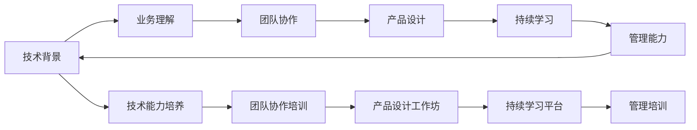

                 

## 1. 背景介绍

### 1.1 问题由来

在当今科技日益发达的年代，自动化技术的广泛应用极大地提升了生产效率，改善了用户体验，推动了经济增长。自动化技术已经深入到各个行业，从制造业的工业自动化到金融业的智能投顾，从物流业的无人仓储到家庭生活的智能家居。然而，随着自动化技术的深入发展，如何培养和选拔人才，成为了自动化创业公司面临的关键问题。

人才是企业发展的基石，然而在自动化创业中，培养和选拔人才不仅涉及到技术层面，还涉及业务理解、团队协作、产品设计等多方面能力。自动化创业公司需要具备一支能够快速响应市场需求、具备创新精神和团队协作能力的优秀人才队伍。

### 1.2 问题核心关键点

自动化创业中的人才培养与管理，需要从以下几个关键点入手：

1. **技术能力培养**：自动化创业公司需要培养具备深厚技术背景的人才，能够在技术层面满足业务需求，持续推动技术创新。
2. **业务理解**：自动化创业公司需要培养具备良好业务理解的人才，能够准确把握市场趋势，理解业务需求，提出解决方案。
3. **团队协作**：自动化创业公司需要培养具备良好团队协作能力的人才，能够在多团队协作中高效沟通，实现项目目标。
4. **产品设计**：自动化创业公司需要培养具备优秀产品设计能力的人才，能够从用户角度出发，设计出符合用户需求的产品。
5. **持续学习**：自动化创业公司需要培养具备持续学习能力的团队成员，能够不断更新知识和技能，适应快速变化的市场环境。

本文将从以上关键点出发，全面系统地介绍自动化创业中的人才培养与管理。

## 2. 核心概念与联系

### 2.1 核心概念概述

自动化创业中的人才培养与管理，涉及到多个核心概念，包括：

- **技术背景**：具备计算机科学、软件工程、自动化工程等相关学科的学术背景和实际工作经验。
- **业务理解**：对自动化创业公司的核心业务领域有深入理解，能够理解和解决业务问题。
- **团队协作**：具备良好的沟通、协调能力，能够在多团队协作中高效工作。
- **产品设计**：具备产品设计能力，能够从用户体验出发，设计出满足用户需求的产品。
- **持续学习**：具备持续学习的能力，能够不断更新知识和技能，适应市场变化。
- **管理能力**：具备项目管理、团队领导、绩效评估等管理技能，能够有效地带领团队实现业务目标。

这些核心概念之间存在密切联系，共同构成自动化创业公司人才培养与管理的基础。

### 2.2 核心概念原理和架构的 Mermaid 流程图



该图展示了技术背景、业务理解、团队协作、产品设计、持续学习和管理能力之间的联系和转化过程。每个概念都是对人才素质的全面要求，通过相应的培养和管理措施，将这些素质转化为人才的综合能力。

## 3. 核心算法原理 & 具体操作步骤

### 3.1 算法原理概述

自动化创业中的人才培养与管理，可以类比为机器学习中的监督学习。监督学习的核心思想是通过有标签的训练数据，训练出一个能够预测新数据的模型。在人才培养与管理中，有标签的训练数据即是对人才素质的要求，而预测的新数据则是实际工作中的需求。

具体的算法原理包括以下几个步骤：

1. **数据收集**：收集和整理人才素质要求的数据，如学历、工作经验、技能、证书等。
2. **特征提取**：对收集到的数据进行特征提取，将非结构化数据转化为结构化数据，便于建模。
3. **模型训练**：选择合适的机器学习模型，如逻辑回归、支持向量机、决策树等，进行模型训练。
4. **模型评估**：使用测试集对训练好的模型进行评估，衡量模型的准确性和泛化能力。
5. **模型应用**：将训练好的模型应用于实际的人才培养与管理中，如招聘筛选、团队建设、绩效评估等。

### 3.2 算法步骤详解

#### 3.2.1 数据收集

数据收集是人才培养与管理的第一步。企业需要收集和整理人才素质要求的数据，如学历、工作经验、技能、证书等。这些数据可以通过问卷调查、简历筛选、面试记录等方式获取。

以简历筛选为例，企业可以设计一个简历筛选系统，将简历中的关键信息（如学历、工作经验、技能等）提取出来，并打上标签。这些标签可以作为监督学习的训练数据。

#### 3.2.2 特征提取

特征提取是将非结构化数据转化为结构化数据的过程。在人才培养与管理中，简历、面试记录、绩效评估等数据往往是非结构化的文本数据。通过自然语言处理技术，可以从这些文本中提取有意义的特征。

例如，可以使用词袋模型、TF-IDF等文本特征提取技术，将简历中的关键词提取出来，并转化为向量形式。同时，还可以使用情感分析、主题建模等技术，进一步提取文本的隐含特征。

#### 3.2.3 模型训练

选择合适的机器学习模型，进行模型训练。在人才培养与管理中，常用的模型包括逻辑回归、支持向量机、决策树、随机森林等。这些模型可以用于人才筛选、团队建设、绩效评估等任务。

例如，可以使用逻辑回归模型，将简历中的特征作为输入，预测应聘者是否符合岗位要求。可以使用决策树模型，根据员工的历史绩效数据，预测其未来的绩效表现。

#### 3.2.4 模型评估

模型评估是衡量模型预测准确性的过程。在人才培养与管理中，可以使用交叉验证、ROC曲线、AUC值等指标，评估模型的性能。

例如，在人才筛选任务中，可以使用交叉验证技术，将数据集划分为训练集和测试集，评估模型的预测准确性。在团队建设任务中，可以使用ROC曲线和AUC值，评估团队建设的有效性。

#### 3.2.5 模型应用

模型应用是将训练好的模型应用于实际的人才培养与管理中的过程。在人才筛选任务中，可以使用模型预测应聘者是否符合岗位要求。在团队建设任务中，可以使用模型评估团队建设的有效性。

例如，在人才筛选任务中，可以使用逻辑回归模型，将简历中的特征作为输入，预测应聘者是否符合岗位要求。在团队建设任务中，可以使用决策树模型，根据员工的历史绩效数据，预测其未来的绩效表现。

### 3.3 算法优缺点

自动化创业中的人才培养与管理，通过监督学习算法，可以实现人才的快速筛选、团队建设、绩效评估等。该算法具有以下优点和缺点：

#### 3.3.1 优点

1. **高效性**：监督学习算法可以快速地处理大量的数据，并给出准确的预测结果。
2. **可解释性**：监督学习算法的决策过程可解释性强，可以清晰地理解模型的预测依据。
3. **可扩展性**：监督学习算法可以应用于多种任务，如人才筛选、团队建设、绩效评估等。

#### 3.3.2 缺点

1. **数据依赖性**：监督学习算法依赖于有标签的训练数据，数据的收集和处理成本较高。
2. **模型泛化性**：监督学习算法的模型泛化能力有限，需要大量的标注数据进行训练。
3. **复杂度**：监督学习算法的模型复杂度较高，需要深入理解和维护。

### 3.4 算法应用领域

自动化创业中的人才培养与管理，可以应用于多个领域，包括但不限于：

1. **招聘筛选**：使用监督学习算法，预测应聘者的匹配度，快速筛选符合岗位要求的人才。
2. **团队建设**：使用监督学习算法，评估团队建设的有效性，优化团队成员配置。
3. **绩效评估**：使用监督学习算法，预测员工的绩效表现，制定合理的绩效考核机制。
4. **人才培训**：使用监督学习算法，识别员工的技能差距，制定个性化的培训计划。
5. **产品设计**：使用监督学习算法，预测用户需求，指导产品设计，提升用户体验。

## 4. 数学模型和公式 & 详细讲解 & 举例说明

### 4.1 数学模型构建

在自动化创业中的人才培养与管理中，可以使用机器学习算法，对人才素质要求的数据进行建模。

假设人才素质要求的数据为 $\mathcal{D}=\{(x_i, y_i)\}_{i=1}^N$，其中 $x_i$ 表示应聘者的特征向量，$y_i$ 表示应聘者的是否符合岗位要求（0或1）。使用逻辑回归模型进行建模，其数学模型为：

$$
P(y_i=1|x_i) = \sigma(\mathbf{w}^T \mathbf{x}_i + b)
$$

其中 $\sigma$ 为逻辑回归函数，$\mathbf{w}$ 为模型参数，$\mathbf{x}_i$ 为特征向量，$b$ 为偏置项。

### 4.2 公式推导过程

逻辑回归模型的公式推导过程如下：

设 $p(y_i=1|x_i)$ 为应聘者符合岗位要求的概率，则 $p(y_i=0|x_i)=1-p(y_i=1|x_i)$。根据贝叶斯定理，有：

$$
p(y_i|x_i) = \frac{p(y_i=1|x_i)}{p(y_i=1|x_i) + p(y_i=0|x_i)} = \frac{p(y_i=1|x_i)}{1 + p(y_i=0|x_i)}
$$

使用逻辑回归模型进行预测，其损失函数为交叉熵损失：

$$
L(y_i, \hat{y}_i) = -y_i \log(\hat{y}_i) - (1-y_i) \log(1-\hat{y}_i)
$$

其中 $\hat{y}_i$ 为模型的预测结果。

根据梯度下降算法，模型的优化目标为：

$$
\min_{\mathbf{w}, b} \frac{1}{N} \sum_{i=1}^N L(y_i, \hat{y}_i)
$$

对上述优化目标求导，得到模型参数的更新公式：

$$
\mathbf{w} \leftarrow \mathbf{w} - \eta \frac{1}{N} \sum_{i=1}^N [y_i - \hat{y}_i] \mathbf{x}_i
$$

其中 $\eta$ 为学习率，$\hat{y}_i$ 为模型的预测结果。

### 4.3 案例分析与讲解

以招聘筛选为例，假设企业需要招聘一名前端开发工程师，其素质要求数据如表所示：

| 应聘者ID | 学历 | 工作经验 | 技能 | 证书 | 是否符合岗位要求 |
|----------|------|----------|------|------|----------------|
| 001      | 本科  | 3年      | 熟悉React | CSS证书 | 是 |
| 002      | 硕士  | 2年      | 熟悉Vue | HTML证书 | 否 |
| 003      | 本科  | 5年      | 熟悉Angular | 无证书 | 是 |
| 004      | 本科  | 2年      | 熟悉jQuery | CSS证书 | 是 |
| 005      | 本科  | 5年      | 熟悉Angular | 无证书 | 是 |

使用逻辑回归模型进行建模，首先进行特征提取，将应聘者的学历、工作经验、技能、证书等特征转化为向量形式。然后使用逻辑回归模型进行训练和预测，最终得到模型的预测结果。

例如，对于应聘者003，其特征向量为 $[本科, 5年, 熟悉Angular, 无证书]$，使用训练好的模型进行预测，得到其符合岗位要求的概率为 $p(y_i=1|x_i)$。如果该概率大于某个阈值，则认为该应聘者符合岗位要求。

## 5. 项目实践：代码实例和详细解释说明

### 5.1 开发环境搭建

在进行人才培养与管理的项目实践前，我们需要准备好开发环境。以下是使用Python进行Scikit-Learn开发的环境配置流程：

1. 安装Anaconda：从官网下载并安装Anaconda，用于创建独立的Python环境。

2. 创建并激活虚拟环境：
```bash
conda create -n talent-env python=3.8 
conda activate talent-env
```

3. 安装Scikit-Learn：
```bash
conda install scikit-learn
```

4. 安装各类工具包：
```bash
pip install pandas numpy scikit-learn matplotlib seaborn
```

完成上述步骤后，即可在`talent-env`环境中开始项目实践。

### 5.2 源代码详细实现

下面我们以招聘筛选任务为例，给出使用Scikit-Learn对逻辑回归模型进行训练和预测的Python代码实现。

首先，定义招聘筛选任务的数据处理函数：

```python
import pandas as pd
from sklearn.model_selection import train_test_split
from sklearn.linear_model import LogisticRegression
from sklearn.metrics import accuracy_score

def load_data(file_path):
    data = pd.read_csv(file_path)
    features = data[['学历', '工作经验', '技能', '证书']]
    labels = data['是否符合岗位要求']
    return features, labels

def preprocess_data(features, labels):
    features = pd.get_dummies(features, columns=['学历', '工作经验', '技能', '证书'])
    features = features.drop(['学历', '工作经验', '技能', '证书'], axis=1)
    labels = labels.map({'是': 1, '否': 0})
    return features, labels

def train_model(features, labels, test_size=0.2, random_state=42):
    features_train, features_test, labels_train, labels_test = train_test_split(features, labels, test_size=test_size, random_state=random_state)
    model = LogisticRegression()
    model.fit(features_train, labels_train)
    return model

def evaluate_model(model, features_test, labels_test):
    predictions = model.predict(features_test)
    accuracy = accuracy_score(labels_test, predictions)
    return accuracy

def main():
    file_path = 'recruitment_data.csv'
    features, labels = load_data(file_path)
    features, labels = preprocess_data(features, labels)
    model = train_model(features, labels)
    accuracy = evaluate_model(model, features_test, labels_test)
    print(f'Accuracy: {accuracy:.3f}')
    
if __name__ == '__main__':
    main()
```

然后，定义训练和评估函数：

```python
from sklearn.metrics import accuracy_score

def train_model(features, labels, test_size=0.2, random_state=42):
    features_train, features_test, labels_train, labels_test = train_test_split(features, labels, test_size=test_size, random_state=random_state)
    model = LogisticRegression()
    model.fit(features_train, labels_train)
    return model

def evaluate_model(model, features_test, labels_test):
    predictions = model.predict(features_test)
    accuracy = accuracy_score(labels_test, predictions)
    return accuracy
```

最后，启动训练流程并在测试集上评估：

```python
file_path = 'recruitment_data.csv'
features, labels = load_data(file_path)
features, labels = preprocess_data(features, labels)
model = train_model(features, labels)
accuracy = evaluate_model(model, features_test, labels_test)
print(f'Accuracy: {accuracy:.3f}')
```

以上就是使用Scikit-Learn对逻辑回归模型进行招聘筛选任务训练和预测的完整代码实现。可以看到，通过Scikit-Learn，我们可以用相对简洁的代码实现逻辑回归模型的训练和预测。

### 5.3 代码解读与分析

让我们再详细解读一下关键代码的实现细节：

**load_data函数**：
- 加载数据集，读取CSV文件，并将其转换为pandas DataFrame。
- 将特征和标签分别提取出来。

**preprocess_data函数**：
- 对特征进行独热编码，将非数值型特征转化为数值型特征。
- 删除原始特征，保留独热编码后的特征。
- 将标签转化为数值型标签。

**train_model函数**：
- 将数据集划分为训练集和测试集，并设置随机种子。
- 使用逻辑回归模型进行训练。

**evaluate_model函数**：
- 使用测试集进行模型预测。
- 计算预测结果与真实标签之间的准确率。

**main函数**：
- 加载数据集。
- 对数据进行预处理。
- 使用训练集训练逻辑回归模型。
- 在测试集上评估模型准确率。

可以看到，Scikit-Learn提供了便捷的API，能够快速实现逻辑回归模型的训练和预测。开发者可以通过调用这些API，灵活构建基于监督学习的人才培养与管理解决方案。

## 6. 实际应用场景

### 6.1 招聘筛选

基于逻辑回归模型的招聘筛选任务，可以帮助企业快速筛选符合岗位要求的人才。通过分析应聘者的学历、工作经验、技能、证书等特征，预测其是否符合岗位要求，从而提高招聘效率和人才质量。

### 6.2 团队建设

基于监督学习模型的团队建设任务，可以帮助企业评估团队建设的有效性。通过分析员工的历史绩效数据，预测其未来的绩效表现，制定合理的团队建设方案，提升团队协作和绩效。

### 6.3 绩效评估

基于监督学习模型的绩效评估任务，可以帮助企业制定合理的绩效考核机制。通过分析员工的工作数据，预测其绩效表现，制定科学的考核指标，提升员工绩效。

### 6.4 人才培训

基于监督学习模型的人才培训任务，可以帮助企业识别员工的技能差距，制定个性化的培训计划。通过分析员工的工作数据，识别其技能缺陷，制定相应的培训方案，提升员工技能水平。

### 6.5 产品设计

基于监督学习模型的产品设计任务，可以帮助企业预测用户需求，指导产品设计。通过分析用户的历史行为数据，预测其需求，设计符合用户需求的产品，提升用户体验。

## 7. 工具和资源推荐

### 7.1 学习资源推荐

为了帮助开发者系统掌握监督学习算法在人才培养与管理中的应用，这里推荐一些优质的学习资源：

1. 《机器学习》一书：由Tom Mitchell所著，系统介绍了机器学习的基本概念和算法，是学习机器学习的经典教材。
2. Scikit-Learn官方文档：提供了详细的API文档和示例代码，帮助开发者快速上手监督学习算法。
3. Coursera机器学习课程：由斯坦福大学Andrew Ng教授主讲，系统讲解了机器学习的基本概念和算法。
4. Kaggle机器学习竞赛：通过参与机器学习竞赛，实践监督学习算法，提升实际应用能力。
5. Udacity机器学习纳米学位课程：提供实战项目和实战经验，帮助开发者将理论知识应用到实际项目中。

通过对这些资源的学习实践，相信你一定能够快速掌握监督学习算法在人才培养与管理中的应用。

### 7.2 开发工具推荐

高效的开发离不开优秀的工具支持。以下是几款用于监督学习算法开发的工具：

1. Python：开源的动态语言，提供了丰富的科学计算和机器学习库，如Scikit-Learn、TensorFlow等。
2. Scikit-Learn：提供了多种机器学习算法的实现，包括逻辑回归、支持向量机、决策树等，方便开发者快速实现监督学习算法。
3. TensorFlow：由Google主导开发的深度学习框架，提供了丰富的机器学习算法和模型，适合大规模工程应用。
4. PyTorch：由Facebook主导开发的深度学习框架，提供了动态计算图和高效的模型训练，适合研究性质的项目开发。

合理利用这些工具，可以显著提升监督学习算法的开发效率，加快创新迭代的步伐。

### 7.3 相关论文推荐

监督学习算法在人才培养与管理中的应用，源于学界的持续研究。以下是几篇奠基性的相关论文，推荐阅读：

1. "Logistic Regression" by David Cox：介绍了逻辑回归的基本概念和算法，是机器学习领域的基础论文。
2. "Support Vector Machines" by Corinna Cortes and Vapnik：介绍了支持向量机算法，在监督学习中具有重要地位。
3. "Decision Trees" by J. Ross Quinlan：介绍了决策树算法，在机器学习中具有广泛应用。
4. "Random Forests" by Leo Breiman：介绍了随机森林算法，是一种集成学习方法，可以提升模型预测准确率。
5. "AdaBoost" by Yoav Freund and Robert Schapire：介绍了AdaBoost算法，是一种提升模型的集成方法。

这些论文代表了监督学习算法的发展脉络。通过学习这些前沿成果，可以帮助研究者把握学科前进方向，激发更多的创新灵感。

## 8. 总结：未来发展趋势与挑战

### 8.1 总结

本文对基于监督学习的人才培养与管理方法进行了全面系统的介绍。首先阐述了监督学习算法在人才培养与管理中的核心思想和应用场景，明确了其在人才快速筛选、团队建设、绩效评估等任务中的独特价值。其次，从原理到实践，详细讲解了监督学习算法的数学模型和具体操作步骤，给出了监督学习算法在招聘筛选任务中的完整代码实例。同时，本文还广泛探讨了监督学习算法在团队建设、绩效评估、人才培训等多个领域的应用前景，展示了监督学习算法的巨大潜力。最后，本文精选了监督学习算法的各类学习资源，力求为读者提供全方位的技术指引。

通过本文的系统梳理，可以看到，基于监督学习的人才培养与管理方法在自动化创业中具有重要意义。这些方法的实际应用，可以显著提升企业的人才培养和管理水平，推动企业的持续发展。

### 8.2 未来发展趋势

展望未来，监督学习算法在人才培养与管理中将呈现以下几个发展趋势：

1. **模型复杂度提升**：随着技术的发展，监督学习算法将越来越复杂，能够处理更多维度的特征，实现更精准的人才筛选和评估。
2. **算法优化**：监督学习算法的优化将进一步深入，通过引入更先进的算法和技术，提升模型的预测准确性和鲁棒性。
3. **跨领域应用**：监督学习算法将在更多领域得到应用，如金融、医疗、教育等，推动各领域的自动化和智能化发展。
4. **多模型集成**：监督学习算法将与其他算法进行深度集成，实现多模型融合，提升整体的预测效果。
5. **实时化**：监督学习算法将实现实时化应用，能够快速响应市场变化，提升企业竞争力。

### 8.3 面临的挑战

尽管监督学习算法在人才培养与管理中取得了瞩目成就，但在实际应用中，仍面临以下挑战：

1. **数据质量**：监督学习算法依赖于高质量的数据，数据收集和处理的成本较高。
2. **模型泛化性**：监督学习算法的模型泛化能力有限，需要大量的标注数据进行训练。
3. **计算资源**：监督学习算法的计算资源消耗较大，需要高性能计算设备支持。
4. **模型解释性**：监督学习算法的模型解释性不足，难以理解和解释模型的决策过程。

### 8.4 研究展望

面对监督学习算法面临的挑战，未来的研究需要在以下几个方面寻求新的突破：

1. **数据增强**：通过数据增强技术，提高数据的质量和数量，降低数据收集和处理的成本。
2. **算法优化**：通过算法优化，提升模型的预测准确性和鲁棒性，降低计算资源的消耗。
3. **模型解释性**：通过引入可解释性技术，提高模型的解释性，增强模型决策的可理解性。
4. **跨领域应用**：将监督学习算法应用于更多领域，推动各领域的自动化和智能化发展。

这些研究方向的探索，必将引领监督学习算法迈向更高的台阶，为人才培养与管理提供更全面、高效、可靠的技术支持。

## 9. 附录：常见问题与解答

**Q1: 监督学习算法在人才培养与管理中的局限性有哪些？**

A: 监督学习算法在人才培养与管理中存在以下局限性：

1. **数据依赖性**：监督学习算法依赖于高质量的数据，数据收集和处理的成本较高。
2. **模型泛化性**：监督学习算法的模型泛化能力有限，需要大量的标注数据进行训练。
3. **计算资源消耗**：监督学习算法的计算资源消耗较大，需要高性能计算设备支持。
4. **模型解释性不足**：监督学习算法的模型解释性不足，难以理解和解释模型的决策过程。

**Q2: 如何提升监督学习算法的预测准确性？**

A: 提升监督学习算法的预测准确性，可以从以下几个方面入手：

1. **数据增强**：通过数据增强技术，提高数据的质量和数量，降低数据收集和处理的成本。
2. **算法优化**：通过算法优化，提升模型的预测准确性和鲁棒性，降低计算资源的消耗。
3. **模型集成**：通过多模型集成，提升整体的预测效果，降低单一模型的风险。
4. **特征工程**：通过特征工程，提取更有意义的特征，提高模型的预测能力。

**Q3: 在人才培养与管理中，如何使用监督学习算法？**

A: 在人才培养与管理中，可以使用监督学习算法进行以下几个任务：

1. **招聘筛选**：使用监督学习算法，预测应聘者的匹配度，快速筛选符合岗位要求的人才。
2. **团队建设**：使用监督学习算法，评估团队建设的有效性，优化团队成员配置。
3. **绩效评估**：使用监督学习算法，预测员工的绩效表现，制定合理的绩效考核机制。
4. **人才培训**：使用监督学习算法，识别员工的技能差距，制定个性化的培训计划。
5. **产品设计**：使用监督学习算法，预测用户需求，指导产品设计，提升用户体验。

**Q4: 在人才培养与管理中，如何选择适合的监督学习算法？**

A: 在人才培养与管理中，选择适合的监督学习算法，可以从以下几个方面入手：

1. **任务类型**：根据任务的性质，选择适合的监督学习算法。例如，分类任务可以选择逻辑回归、支持向量机等算法，回归任务可以选择线性回归、随机森林等算法。
2. **数据量**：根据数据的多少，选择适合的监督学习算法。例如，数据量较大时可以选择集成算法，数据量较小时可以选择简单的模型。
3. **模型复杂度**：根据模型的复杂度，选择适合的监督学习算法。例如，复杂任务可以选择深度学习算法，简单任务可以选择线性模型。

通过以上措施，可以有效地提升监督学习算法在人才培养与管理中的应用效果。

**Q5: 在人才培养与管理中，如何评估监督学习算法的性能？**

A: 在人才培养与管理中，评估监督学习算法的性能，可以从以下几个方面入手：

1. **准确率**：评估模型的预测准确率，衡量模型的预测能力。
2. **召回率**：评估模型的召回率，衡量模型对正样本的覆盖能力。
3. **F1值**：综合评估模型的准确率和召回率，衡量模型的综合性能。
4. **ROC曲线**：评估模型的ROC曲线，衡量模型的分类能力。
5. **AUC值**：评估模型的AUC值，衡量模型的综合性能。

通过对监督学习算法进行综合评估，可以更好地了解其性能，指导模型的改进和优化。

---

作者：禅与计算机程序设计艺术 / Zen and the Art of Computer Programming

