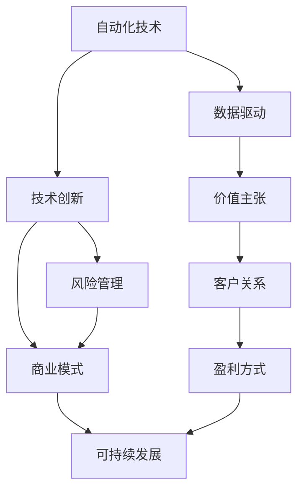

                 

# 自动化创业中的可持续发展策略

> 关键词：自动化创业, 可持续发展, 技术创新, 风险管理, 商业模式, 数据驱动

## 1. 背景介绍

### 1.1 问题由来

随着自动化技术的迅猛发展和普及，越来越多的企业开始探索通过自动化技术驱动创业。然而，自动化技术在带来高效便捷的同时，也带来了诸多挑战，如技术风险、成本控制、市场竞争等。如何平衡自动化技术带来的短期利益与长期可持续发展，成为自动化创业中必须面对的重要课题。

### 1.2 问题核心关键点

自动化创业的可持续性，关键在于如何有效利用技术创新，同时避免技术风险，实现成本控制和市场竞争优势。这需要从技术选型、市场定位、商业模式、风险管理等多个维度进行全面考量。

### 1.3 问题研究意义

研究自动化创业中的可持续发展策略，对于企业成功运用自动化技术，实现长期稳定发展具有重要意义：

1. **降低技术风险**：合理选择和配置技术，避免盲目投资，减少技术失败的概率。
2. **控制成本**：优化技术栈，降低运维成本，实现高效资源利用。
3. **增强竞争力**：通过技术创新提升产品和服务质量，在市场竞争中脱颖而出。
4. **实现可持续增长**：建立可持续的商业模式，确保企业长期盈利。

## 2. 核心概念与联系

### 2.1 核心概念概述

为更好地理解自动化创业的可持续发展策略，本节将介绍几个密切相关的核心概念：

- **自动化技术(Automation Technology)**：通过软件和硬件技术实现各种业务流程的自动化，以提升效率、降低成本。
- **可持续发展(Sustainable Development)**：在满足当前需求的同时，保护环境，不损害后代满足需求的能力。
- **技术创新(Technological Innovation)**：利用新技术和新方法，改进现有产品或服务，创造出新的商业模式。
- **风险管理(Risk Management)**：识别、评估、控制和监控可能影响项目成功的风险。
- **商业模式(Business Model)**：企业运作的基本经济结构，包括价值主张、客户关系、盈利方式等。
- **数据驱动(Data-Driven)**：通过数据分析和挖掘，驱动业务决策和创新。

这些核心概念之间的逻辑关系可以通过以下Mermaid流程图来展示：



这个流程图展示了一些核心概念之间的联系：

1. 自动化技术通过技术创新得以持续改进，从而实现更高效的自动化解决方案。
2. 风险管理帮助识别技术创新可能带来的风险，确保技术投资的有效性。
3. 商业模式在技术创新的基础上，结合风险管理，实现可持续的增长和盈利。
4. 数据驱动为自动化技术提供决策依据，帮助企业洞察市场趋势和客户需求。
5. 持续发展战略贯穿于技术创新、风险管理、商业模式、数据驱动等各个环节。

这些概念共同构成了自动化创业的可持续发展框架，为企业提供了一个全面的指导。

## 3. 核心算法原理 & 具体操作步骤
### 3.1 算法原理概述

自动化创业中的可持续发展策略，本质上是一个多维度、多目标优化的过程。其核心思想是：通过技术创新和数据驱动，实现自动化技术的优化配置和高效应用，同时确保企业的可持续发展和风险控制。

形式化地，假设企业有多个自动化技术选择，每个技术的效用函数为 $U_i$，风险函数为 $R_i$，成本函数为 $C_i$，可持续发展目标函数为 $S$。企业需要找到最优的技术组合 $T^*$，使得：

$$
\begin{align*}
T^* &= \mathop{\arg\max}_{T} U^T(T) \\
    &\text{s.t.} R^T(T) \leq R_{max}, \\
    &\quad C^T(T) \leq C_{max}, \\
    &\quad S^T(T) \geq S_{min}
\end{align*}
$$

其中 $T$ 为技术组合，$U^T(T)$ 为效用总和，$R^T(T)$ 为风险总和，$C^T(T)$ 为成本总和，$S^T(T)$ 为可持续发展目标总和，$R_{max}, C_{max}, S_{min}$ 分别为风险、成本和可持续发展的限制阈值。

### 3.2 算法步骤详解

自动化创业的可持续发展策略实施过程，一般包括以下几个关键步骤：

**Step 1: 评估技术选择**

- 对可行的自动化技术进行全面评估，包括技术成熟度、应用范围、市场趋势、技术风险等。
- 收集和分析历史数据，评估技术的潜在收益和风险。

**Step 2: 设定目标和限制**

- 根据企业战略和市场需求，设定自动化技术的总体目标和具体指标。
- 确定可持续发展目标，如环境保护、社会责任、经济效益等。
- 确定风险和成本的容忍度，避免过度投资或风险过高的决策。

**Step 3: 制定技术创新策略**

- 根据技术评估结果和目标设定，选择最适合的技术组合。
- 制定技术创新路线图，明确技术应用的时间表和优先级。

**Step 4: 风险管理与监控**

- 建立风险评估模型，识别可能影响项目成功的风险因素。
- 实施风险控制策略，如风险分担、风险转移等。
- 定期监控风险状况，及时调整策略。

**Step 5: 商业模式设计与优化**

- 基于技术创新和风险管理，设计可持续的商业模式。
- 定义价值主张、客户关系和盈利方式，确保商业模式的可持续性。
- 不断优化商业模式，适应市场变化和技术进步。

**Step 6: 可持续发展评估**

- 定期评估技术应用效果，确保可持续发展目标的实现。
- 收集和分析反馈数据，调整和优化技术组合和商业策略。

### 3.3 算法优缺点

自动化创业中的可持续发展策略，具有以下优点：

1. **全面性**：从技术创新、风险管理、商业模式、数据驱动等多个维度进行综合考量，确保战略的全面性和系统性。
2. **适应性**：能够根据市场和技术的变化，动态调整战略和策略，保持竞争力。
3. **透明性**：通过数据驱动和风险管理，提高决策过程的透明度和可解释性。

同时，该策略也存在一定的局限性：

1. **复杂性**：涉及多个维度和多种因素，实施过程复杂。
2. **资源消耗**：数据收集、风险评估、技术评估等需要大量资源和人力投入。
3. **实施难度**：需要企业具备较强的战略规划和执行能力。

尽管存在这些局限性，但就目前而言，这种多维度、多目标优化的策略仍是实现自动化创业可持续发展的重要方法。

### 3.4 算法应用领域

自动化创业中的可持续发展策略，广泛应用于各类行业的自动化转型和创新实践中，如：

- **制造业**：通过自动化技术提高生产效率，降低成本，同时关注环境影响和员工健康。
- **零售业**：利用自动化技术优化库存管理、客户服务，提升用户体验，同时确保供应链的可持续性。
- **金融业**：应用自动化技术提升金融服务的效率和安全性，同时关注数据隐私和公平性。
- **医疗健康**：通过自动化技术改进诊断和治疗流程，提高医疗服务质量，同时关注数据安全和个人隐私。
- **农业**：利用自动化技术提高农业生产效率，减少资源消耗，同时确保农业的可持续性和生态保护。

此外，自动化创业中的可持续发展策略，还可以应用于智慧城市、教育、政府服务等多个领域，推动各行业的数字化转型和可持续发展。

## 4. 数学模型和公式 & 详细讲解 & 举例说明
### 4.1 数学模型构建

本节将使用数学语言对自动化创业中的可持续发展策略进行更加严格的刻画。

假设企业有 $n$ 种自动化技术选择，每种技术 $i$ 的效用函数为 $U_i$，风险函数为 $R_i$，成本函数为 $C_i$，可持续发展目标函数为 $S_i$。企业的总体目标和限制条件如上所述。

定义技术组合 $T$ 的效用函数为 $U(T)=\sum_{i=1}^{n}U_i$，风险函数为 $R(T)=\sum_{i=1}^{n}R_i$，成本函数为 $C(T)=\sum_{i=1}^{n}C_i$，可持续发展目标函数为 $S(T)=\sum_{i=1}^{n}S_i$。

企业需要找到最优的技术组合 $T^*$，使得：

$$
T^* = \mathop{\arg\max}_{T} U^T(T) \\
\text{s.t.} R^T(T) \leq R_{max}, \\
\quad C^T(T) \leq C_{max}, \\
\quad S^T(T) \geq S_{min}
$$

### 4.2 公式推导过程

以下我们以制造业为例，推导优化模型及其求解方法。

假设企业有 $n$ 种自动化技术，每种技术的效用、风险和成本函数分别为 $U_i$、$R_i$ 和 $C_i$。企业的总体目标和限制条件为：

$$
\begin{align*}
\max_{T} & \sum_{i=1}^{n}U_i \\
\text{s.t.} & \sum_{i=1}^{n}R_i \leq R_{max}, \\
& \sum_{i=1}^{n}C_i \leq C_{max}, \\
& \sum_{i=1}^{n}S_i \geq S_{min}
\end{align*}
$$

设 $\alpha$ 为效用权重，$\beta$ 为风险权重，$\gamma$ 为成本权重，$\delta$ 为可持续发展目标权重，则优化目标可以表示为：

$$
\begin{align*}
\max_{T} & \alpha \sum_{i=1}^{n}U_i + \beta \sum_{i=1}^{n}R_i + \gamma \sum_{i=1}^{n}C_i + \delta \sum_{i=1}^{n}S_i \\
\text{s.t.} & \sum_{i=1}^{n}R_i \leq R_{max}, \\
& \sum_{i=1}^{n}C_i \leq C_{max}, \\
& \sum_{i=1}^{n}S_i \geq S_{min}
\end{align*}
$$

令 $W = [\alpha, \beta, \gamma, \delta]$ 为权重向量，则优化模型可以表示为：

$$
\max_{T} W^T U(T) \\
\text{s.t.} W^T R(T) \leq W^T R_{max}, \\
W^T C(T) \leq W^T C_{max}, \\
W^T S(T) \geq W^T S_{min}
$$

通过引入决策变量 $x_i \in \{0, 1\}$，表示技术 $i$ 是否被选中，优化模型进一步转化为：

$$
\max_{x} W^T \sum_{i=1}^{n}U_i x_i \\
\text{s.t.} W^T \sum_{i=1}^{n}R_i x_i \leq W^T R_{max}, \\
W^T \sum_{i=1}^{n}C_i x_i \leq W^T C_{max}, \\
W^T \sum_{i=1}^{n}S_i x_i \geq W^T S_{min}
$$

### 4.3 案例分析与讲解

以制造业自动化转型为例，分析企业的可持续发展决策过程。

假设某制造企业有三种自动化技术选择，每种技术的效用、风险和成本函数如下：

| 技术 | 效用 | 风险 | 成本 |
| --- | --- | --- | --- |
| 技术A | 200 | 10 | 100 |
| 技术B | 150 | 8 | 80 |
| 技术C | 120 | 6 | 60 |

企业的目标和限制条件如下：

| 目标 | 上限 |
| --- | --- |
| 风险总和 | 20 |
| 成本总和 | 200 |
| 可持续发展目标总和 | 30 |

假设企业的权重向量为 $W = [0.7, 0.2, 0.1, 0.1]$，则优化模型可以表示为：

$$
\max_{x} 0.7 \times 200 + 0.2 \times 10 + 0.1 \times 100 + 0.1 \times 150 \\
\text{s.t.} 0.7 \times 10 + 0.2 \times 8 + 0.1 \times 6 \leq 20, \\
0.7 \times 100 + 0.2 \times 80 + 0.1 \times 60 \leq 200, \\
0.7 \times 30 + 0.2 \times 0 + 0.1 \times 0 \geq 30
$$

将问题转化为线性规划问题，可以求解出最优的技术组合 $T^*$ 为 $x_A = 1, x_B = 0, x_C = 0$，即选择技术A，放弃技术B和C。

此案例展示了如何使用数学模型进行自动化创业中的可持续发展决策，通过权衡技术效用、风险、成本和可持续发展目标，实现最优技术组合选择。

## 5. 项目实践：代码实例和详细解释说明
### 5.1 开发环境搭建

在进行可持续发展策略的实践前，我们需要准备好开发环境。以下是使用Python进行线性规划优化的环境配置流程：

1. 安装Anaconda：从官网下载并安装Anaconda，用于创建独立的Python环境。

2. 创建并激活虚拟环境：
```bash
conda create -n linear-programming python=3.8 
conda activate linear-programming
```

3. 安装PuLP库：
```bash
pip install pulp
```

4. 安装其他必要的工具包：
```bash
pip install numpy pandas scipy sympy
```

完成上述步骤后，即可在`linear-programming`环境中开始项目实践。

### 5.2 源代码详细实现

下面我们以制造业自动化转型为例，给出使用PuLP库进行线性规划优化的PyTorch代码实现。

首先，定义优化模型和约束条件：

```python
from pulp import LpProblem, LpVariable, LpMaximize, lpSum, LpMinimize, LpBinary

def model():
    problem = LpProblem("AutomationOptimization", LpMaximize)
    
    # 定义决策变量
    x = [LpVariable(i, binary=True) for i in range(1, 4)]
    
    # 定义目标函数
    problem += lpSum([0.7 * 200 * x[i] + 0.2 * 10 * x[i] + 0.1 * 100 * x[i] + 0.1 * 150 * x[i] for i in range(1, 4)])
    
    # 定义约束条件
    problem += lpSum([0.7 * 10 * x[i] + 0.2 * 8 * x[i] + 0.1 * 6 * x[i] for i in range(1, 4)]) <= 20
    problem += lpSum([0.7 * 100 * x[i] + 0.2 * 80 * x[i] + 0.1 * 60 * x[i] for i in range(1, 4)]) <= 200
    problem += lpSum([0.7 * 30 * x[i] + 0.2 * 0 * x[i] + 0.1 * 0 * x[i] for i in range(1, 4)]) >= 30
    
    return problem
```

然后，求解优化模型并输出结果：

```python
problem = model()
problem.solve()

if problem.status == 1:
    print(f"最优解：{problem.objective}，技术选择：{[x[i].varValue for i in range(1, 4)]}")
else:
    print("无解")
```

以上就是使用PuLP库进行线性规划优化的完整代码实现。可以看到，通过定义优化目标和约束条件，使用PuLP库求解线性规划问题，即可得到最优的技术组合选择。

### 5.3 代码解读与分析

让我们再详细解读一下关键代码的实现细节：

**定义决策变量**：
- 使用`LpVariable`定义决策变量 $x_i$，并指定其类型为二进制变量，表示技术 $i$ 是否被选中。

**目标函数**：
- 使用`lpSum`计算目标函数 $W^T U(T)$，并加入权重向量 $W$。

**约束条件**：
- 使用`lpSum`计算风险、成本和可持续发展目标的约束条件，并分别加入相应的上限值。

**求解问题**：
- 创建`LpProblem`实例，设置优化类型为最大值，并调用`solve`方法求解。
- 根据求解状态，输出最优解和对应的技术选择。

**PuLP库优势**：
- PuLP库提供了简洁易用的API，支持各种线性规划模型的定义和求解。
- 可以方便地将优化问题转化为线性规划问题，求解效率高。

当然，工业级的系统实现还需考虑更多因素，如模型的保存和部署、超参数的自动搜索、更灵活的约束条件等。但核心的线性规划优化方法基本与此类似。

## 6. 实际应用场景
### 6.1 智能制造系统

基于自动化创业中的可持续发展策略，智能制造系统可以通过自动化技术提升生产效率和产品质量，同时实现节能减排和环境友好。

在技术实现上，可以收集企业的生产数据，建立自动化技术的效果评估模型，衡量不同技术的节能减排效果和生产效率提升。在优化模型中，引入可持续发展目标，如碳排放、能耗等，优先选择对环境影响最小的技术方案。通过优化模型的求解，企业可以确定最优的技术组合，实现智能制造系统的可持续发展。

### 6.2 物流配送平台

自动化创业中的可持续发展策略，在物流配送平台中的应用也具有重要意义。通过自动化技术，如无人机配送、自动化仓储等，可以提高配送效率，降低运营成本。但同时，也需要注意自动化系统对环境的影响，如无人机噪音、电池回收等。

在优化模型中，引入环境影响、能源消耗等约束条件，优先选择对环境影响最小的技术方案。通过优化模型的求解，物流配送平台可以选择最优的技术组合，实现绿色物流和可持续发展。

### 6.3 金融科技企业

金融科技企业通过自动化技术可以提升交易效率和风险管理能力，但同时也面临着数据安全、用户隐私等挑战。在优化模型中，引入数据安全、用户隐私等约束条件，优先选择对数据安全、用户隐私影响最小的技术方案。通过优化模型的求解，金融科技企业可以选择最优的技术组合，实现安全、高效、可持续的发展。

### 6.4 未来应用展望

随着自动化技术的发展和应用场景的拓展，基于可持续发展策略的技术优化方法将具有更广泛的应用前景。

在智慧城市建设中，通过自动化技术提升城市管理效率，同时考虑交通流量、环境污染等可持续发展目标，实现城市运行的智能化和绿色化。

在智能农业中，通过自动化技术提高农业生产效率，同时考虑土地资源、水资源等约束条件，实现农业的可持续发展。

在智慧医疗中，通过自动化技术优化医疗服务流程，同时考虑数据安全、隐私保护等约束条件，实现医疗服务的智能化和可持终续发展。

## 7. 工具和资源推荐
### 7.1 学习资源推荐

为了帮助开发者系统掌握自动化创业中的可持续发展策略的理论基础和实践技巧，这里推荐一些优质的学习资源：

1. 《运筹学与最优化》系列教材：介绍了线性规划、整数规划、动态规划等经典优化算法，是理论学习的重要参考。

2. 《运筹学与最优化》在线课程：Coursera等平台提供的多变量优化课程，涵盖各种优化算法和实际应用案例。

3. PuLP官方文档：提供了丰富的API文档和示例代码，帮助开发者快速上手线性规划问题求解。

4 《运筹学与最优化》实战项目：GitHub上的实战项目，涵盖优化模型构建、求解和应用，适合实践练习。

5 《自动化创业中的可持续发展策略》博客：系列技术博客，详细讲解自动化创业中的可持续发展策略，包括数学建模、优化算法和实际案例。

通过对这些资源的学习实践，相信你一定能够快速掌握自动化创业中的可持续发展策略，并用于解决实际的业务问题。

### 7.2 开发工具推荐

高效的开发离不开优秀的工具支持。以下是几款用于自动化创业中的可持续发展策略开发的常用工具：

1. PuLP：用于解决各种线性规划、整数规划和混合整数规划问题，支持多目标优化。

2. Gurobi：商业级优化求解器，支持各种复杂优化模型求解，适合大规模复杂问题。

3. Scipy：用于数值计算和科学计算的Python库，提供了各种优化算法和工具。

4. Matplotlib：用于绘制各种图表和可视化分析，帮助理解优化结果。

5. Seaborn：基于Matplotlib的高级可视化库，提供了更丰富的数据可视化功能。

6. Jupyter Notebook：开源的交互式计算环境，支持代码编写、数据处理和结果展示。

合理利用这些工具，可以显著提升自动化创业中的可持续发展策略的开发效率，加快创新迭代的步伐。

### 7.3 相关论文推荐

自动化创业中的可持续发展策略研究源于学界的持续研究。以下是几篇奠基性的相关论文，推荐阅读：

1. Operations Research：运筹学基础，介绍各种优化算法和实际应用。

2. Engineering Optimization：工程优化方法，涵盖各种优化技术在实际工程中的应用。

3. Linear Programming and Network Flows：线性规划基础，介绍线性规划的数学模型和求解方法。

4 《自动化创业中的可持续发展策略》：作者系统介绍自动化创业中的可持续发展策略的理论基础和实践技巧。

5. Sustainable Manufacturing：可持续制造的优化模型和方法，探讨如何通过优化提升制造系统的可持续性。

这些论文代表了大语言模型微调技术的发展脉络。通过学习这些前沿成果，可以帮助研究者把握学科前进方向，激发更多的创新灵感。

## 8. 总结：未来发展趋势与挑战
### 8.1 总结

本文对自动化创业中的可持续发展策略进行了全面系统的介绍。首先阐述了自动化创业的背景和意义，明确了可持续发展策略在自动化技术优化中的重要性。其次，从原理到实践，详细讲解了可持续发展策略的数学建模和求解方法，给出了代码实例和详细解释。同时，本文还广泛探讨了可持续发展策略在智能制造、物流配送、金融科技等诸多行业领域的应用前景，展示了其广泛的应用价值。此外，本文精选了可持续发展策略的学习资源、开发工具和相关论文，力求为读者提供全方位的技术指引。

通过本文的系统梳理，可以看到，自动化创业中的可持续发展策略正在成为自动化技术优化中的重要手段，极大地拓展了自动化技术的应用边界，为企业的长期稳定发展提供了有力保障。未来，伴随技术的不断演进，可持续发展策略必将在自动化创业中发挥更加重要的作用。

### 8.2 未来发展趋势

展望未来，自动化创业中的可持续发展策略将呈现以下几个发展趋势：

1. **技术融合加速**：自动化创业中的可持续发展策略将与大数据、物联网、人工智能等前沿技术深度融合，提升决策的准确性和智能化水平。

2. **多目标优化优化**：未来的优化模型将更加注重多目标优化，同时考虑经济效益、环境影响、社会责任等多个目标，实现更全面的可持续发展。

3. **持续优化与学习**：随着数据和技术的不断发展，优化模型将具备持续学习的能力，不断优化决策策略，适应新的市场需求和技术趋势。

4. **用户参与与反馈**：未来的优化模型将引入用户参与和反馈机制，通过用户行为数据，优化决策过程，提升用户体验和满意度。

5. **模型透明与可解释**：优化模型将更加注重透明性和可解释性，通过可视化工具和解释方法，帮助企业理解决策依据和结果，提高决策的科学性和可信度。

以上趋势凸显了自动化创业中的可持续发展策略的广阔前景。这些方向的探索发展，必将进一步提升自动化技术的优化效果，为企业的长期稳定发展提供有力支持。

### 8.3 面临的挑战

尽管自动化创业中的可持续发展策略已经取得了显著成就，但在迈向更加智能化、普适化应用的过程中，仍面临诸多挑战：

1. **数据获取难度**：获取高质量的数据是优化模型的基础，但数据收集和处理需要投入大量资源和人力，具有一定难度。

2. **算法复杂性**：多目标优化问题的求解复杂度较高，需要高效算法和强大计算资源支持。

3. **模型泛化能力**：优化模型需要具备良好的泛化能力，能够适应不同场景和变化的数据。

4. **模型实时性**：优化模型的求解过程需要满足实时性要求，适用于快速决策和实时调整。

5. **模型透明性**：优化模型的决策过程需要具有较高的透明性和可解释性，帮助企业理解决策依据。

这些挑战需要通过技术创新和实践经验的积累，逐步克服，以实现更高效的可持续发展决策。

### 8.4 研究展望

面对自动化创业中的可持续发展策略所面临的挑战，未来的研究需要在以下几个方面寻求新的突破：

1. **多目标优化算法**：开发更高效的多目标优化算法，提升模型的求解效率和精度。

2. **模型压缩与加速**：通过模型压缩和加速技术，降低优化模型的资源消耗和计算成本。

3. **模型透明性与可解释性**：研究模型透明性和可解释性方法，提高决策过程的透明性和可信度。

4. **实时优化与学习**：开发实时优化和学习算法，支持动态调整和持续优化。

5. **跨领域应用**：将优化模型应用于更多行业和领域，提升各行业的智能化水平。

这些研究方向的探索，必将引领自动化创业中的可持续发展策略迈向更高的台阶，为企业的长期稳定发展提供有力保障。

## 9. 附录：常见问题与解答

**Q1：自动化创业中的可持续发展策略如何与其他技术结合？**

A: 自动化创业中的可持续发展策略可以通过与其他技术结合，提升决策的全面性和智能化水平。例如，结合大数据分析，优化数据采集和处理流程，提升决策的准确性。结合人工智能技术，进行智能预测和决策，实现更高效的自动化系统。结合物联网技术，实现设备互联和数据实时采集，支持实时优化。

**Q2：自动化创业中的可持续发展策略是否需要引入外部数据？**

A: 自动化创业中的可持续发展策略需要引入外部数据进行优化决策。外部数据如市场数据、环境数据、用户数据等，可以提供更多的决策依据，帮助企业制定更科学的优化策略。但同时需要注意数据的质量和隐私问题，确保数据使用的合法性和安全性。

**Q3：自动化创业中的可持续发展策略是否需要定期更新？**

A: 自动化创业中的可持续发展策略需要定期更新，以适应市场和技术的变化。例如，市场需求、技术趋势、环境政策等可能发生变化，优化模型需要定期评估和调整，以保持决策的科学性和适用性。

**Q4：自动化创业中的可持续发展策略如何处理不确定性？**

A: 自动化创业中的可持续发展策略需要处理不确定性，以保证决策的稳健性和鲁棒性。可以通过引入鲁棒优化技术，增加决策模型的鲁棒性，防止因不确定性导致的不良结果。

**Q5：自动化创业中的可持续发展策略如何评估和优化模型效果？**

A: 自动化创业中的可持续发展策略需要定期评估和优化模型效果，以确保决策的科学性和有效性。可以使用多种评估指标，如经济效益、环境影响、用户体验等，对模型效果进行综合评估。根据评估结果，优化模型参数和结构，提升决策效果。

通过本文的系统梳理，可以看到，自动化创业中的可持续发展策略正在成为企业成功运用自动化技术的重要手段，极大地拓展了自动化技术的应用边界，为企业的长期稳定发展提供了有力保障。未来，伴随技术的不断演进，可持续发展策略必将在自动化创业中发挥更加重要的作用。

---

作者：禅与计算机程序设计艺术 / Zen and the Art of Computer Programming

