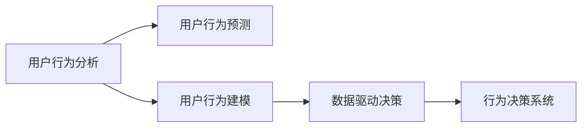
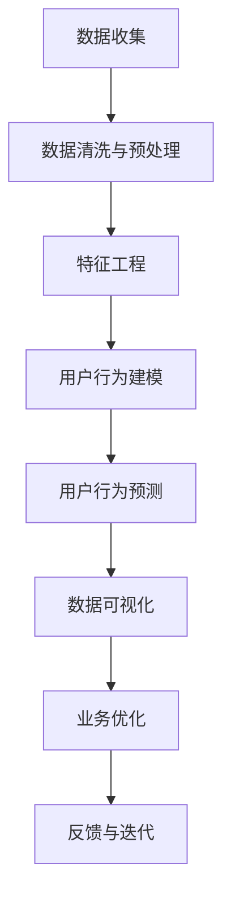

                 

# 自动化创业中的用户行为分析

> 关键词：自动化创业, 用户行为分析, 用户行为预测, 用户行为建模, 数据驱动决策, 行为决策系统

## 1. 背景介绍

随着科技的飞速发展，自动化创业成为了一种新的商业模式。它通过利用先进的算法和工具，结合大数据和人工智能，实现自动化流程和智能决策，为用户提供高效、便捷的服务。在自动化创业中，用户行为分析（User Behavior Analysis）是一个至关重要的环节。它不仅能帮助企业了解用户的真实需求和行为模式，还能预测用户行为，优化用户体验，从而提升企业的竞争力和市场份额。

本文将深入探讨自动化创业中用户行为分析的核心概念、算法原理、具体操作步骤，以及其应用领域、数学模型和公式推导过程，最后给出项目实践和实际应用场景的案例，并提出未来发展趋势和挑战。

## 2. 核心概念与联系

### 2.1 核心概念概述

为了更好地理解用户行为分析，我们先介绍几个核心概念：

- **用户行为分析**：通过收集和分析用户在产品或服务上的行为数据，了解用户需求和行为模式，从而提升用户体验和业务绩效。
- **用户行为预测**：利用机器学习算法，根据历史用户行为数据，预测未来用户行为，为企业制定更精准的市场策略。
- **用户行为建模**：使用数学模型和算法，描述用户行为特征，建立用户行为与产品性能之间的关联关系。
- **数据驱动决策**：基于数据和分析结果，制定业务策略和运营方案，提升决策效率和效果。
- **行为决策系统**：将用户行为分析与人工智能算法结合，构建智能化的决策支持系统，自动化地进行用户行为分析和预测。

这些概念之间的关系可以用以下的Mermaid流程图表示：



这个流程图展示了用户行为分析从数据收集到预测和决策的全过程。

### 2.2 核心概念原理和架构的 Mermaid 流程图



这个图表展示了用户行为分析的主要流程和架构：数据收集、数据清洗与预处理、特征工程、用户行为建模、用户行为预测、数据可视化、业务优化和反馈与迭代。

## 3. 核心算法原理 & 具体操作步骤

### 3.1 算法原理概述

用户行为分析的算法原理主要基于统计学和机器学习理论，通过对用户行为数据的建模和分析，揭示用户需求和行为规律。常见的算法包括：

- **回归分析**：利用历史数据预测用户行为，建立用户行为与目标变量之间的线性或非线性关系。
- **分类算法**：根据用户行为数据，将用户分为不同的群体，实现用户分群和个性化推荐。
- **聚类算法**：通过相似性度量，将用户分为若干组，发现用户行为中的内在规律。
- **关联规则算法**：分析用户行为序列中的频繁项集，发现用户行为之间的关联关系。
- **深度学习算法**：利用神经网络模型，建立端到端的行为预测和分析模型。

### 3.2 算法步骤详解

一个完整的用户行为分析流程包括以下几个关键步骤：

**Step 1: 数据收集与清洗**

- **数据收集**：从产品使用日志、网站访问日志、用户反馈等渠道收集用户行为数据。
- **数据清洗与预处理**：去除缺失值、异常值和噪音数据，进行数据归一化和特征提取。

**Step 2: 特征工程**

- **特征选择**：从原始数据中选择最有用的特征，如用户ID、行为时间、设备信息等。
- **特征变换**：对特征进行标准化、归一化、编码等变换，提高模型训练效率。

**Step 3: 用户行为建模**

- **建立模型**：选择合适的算法，如线性回归、决策树、随机森林等，建立用户行为模型。
- **模型训练**：使用历史用户行为数据训练模型，调整模型参数，提高模型性能。

**Step 4: 用户行为预测**

- **模型评估**：使用测试集评估模型性能，选择最优模型。
- **预测用户行为**：利用训练好的模型，预测用户未来的行为。

**Step 5: 结果分析与反馈**

- **结果可视化**：将预测结果可视化，如绘制热图、绘制用户画像等。
- **业务优化**：根据预测结果，优化产品设计和运营策略，提升用户体验和业务绩效。
- **反馈与迭代**：持续收集用户反馈，更新数据和模型，迭代优化用户行为分析系统。

### 3.3 算法优缺点

用户行为分析的优点包括：

- **准确度高**：通过数据分析，可以准确预测用户行为，优化产品设计。
- **个性化强**：能够对不同用户群体进行分类和个性化推荐。
- **实时性强**：利用实时数据，进行实时分析和预测。

缺点包括：

- **数据依赖性高**：需要大量高质量的数据才能进行有效的分析。
- **模型复杂度高**：建模和预测过程复杂，需要较强的数据科学背景。
- **隐私问题**：用户行为数据涉及用户隐私，需要严格的数据保护措施。

### 3.4 算法应用领域

用户行为分析广泛应用于以下几个领域：

- **电商推荐系统**：通过分析用户购买行为，推荐商品和促销活动，提高销售额。
- **移动应用分析**：分析用户使用行为，优化应用界面和功能，提升用户留存率。
- **金融风险控制**：利用用户交易数据，预测用户风险行为，进行风险预警和控制。
- **智能客服系统**：通过用户行为分析，优化客服流程，提高客户满意度。
- **健康医疗**：分析用户健康数据，提供个性化的健康建议和治疗方案。
- **社交媒体分析**：分析用户互动行为，优化内容推荐和广告投放。

## 4. 数学模型和公式 & 详细讲解 & 举例说明

### 4.1 数学模型构建

用户行为分析的数学模型主要包括以下几个方面：

- **用户行为时间序列模型**：利用时间序列数据，建立用户行为的时间依赖关系。
- **用户行为聚类模型**：通过聚类算法，发现用户行为的相似性和差异性。
- **用户行为预测模型**：利用回归、分类、深度学习等算法，预测用户行为。

### 4.2 公式推导过程

以用户行为时间序列模型为例，常用的时间序列模型包括ARIMA和LSTM。

**ARIMA模型**：

$$
y_t = \phi(L)y_{t-1} + \theta(L)e_t
$$

其中，$y_t$ 表示第 $t$ 天的用户行为数据，$\phi(L)$ 和 $\theta(L)$ 分别为滞后算子，$e_t$ 为随机误差项。

**LSTM模型**：

$$
\begin{aligned}
& h_t = \text{LSTM}(h_{t-1}, x_t) \\
& y_t = \text{DNN}(h_t)
\end{aligned}
$$

其中，$h_t$ 表示第 $t$ 天的隐藏状态，$x_t$ 为输入特征，$\text{LSTM}$ 表示长短期记忆网络，$\text{DNN}$ 表示深度神经网络。

### 4.3 案例分析与讲解

以电商平台用户行为分析为例，我们可以利用ARIMA模型分析用户购买行为的时间依赖关系。具体步骤如下：

1. **数据收集**：从电商平台的用户行为日志中，收集用户购买时间、购买金额、购买次数等数据。
2. **数据清洗与预处理**：去除缺失值和异常值，对数据进行归一化和特征提取。
3. **特征工程**：选择用户ID、购买时间、购买金额等特征。
4. **建立模型**：利用ARIMA模型，建立用户购买行为的时间序列模型。
5. **模型训练**：使用历史数据训练模型，调整模型参数，提高模型性能。
6. **预测用户行为**：利用训练好的模型，预测未来用户购买行为。

## 5. 项目实践：代码实例和详细解释说明

### 5.1 开发环境搭建

在进行用户行为分析项目实践前，我们需要准备好开发环境。以下是使用Python进行项目开发的简单流程：

1. **安装Python**：从官网下载并安装Python，选择适合自己系统的版本。
2. **安装数据科学库**：安装NumPy、Pandas、Scikit-learn、Matplotlib等数据科学库。
3. **安装机器学习库**：安装TensorFlow、PyTorch、Keras等机器学习库。
4. **配置Jupyter Notebook**：安装Jupyter Notebook，配置环境，便于进行数据分析和模型训练。

### 5.2 源代码详细实现

以下是一个用户行为时间序列分析的Python代码示例：

```python
import numpy as np
import pandas as pd
from statsmodels.tsa.arima_model import ARIMA
from sklearn.metrics import mean_squared_error

# 数据准备
data = pd.read_csv('user_behavior.csv', parse_dates=['purchase_time'])
data['purchase_time'] = data['purchase_time'].dt.date
data['purchase_amount'] = data['purchase_amount'].astype(float)

# 数据处理
data = data.dropna()
X = data.groupby('user_id')['purchase_amount'].agg([np.mean, np.std, np.sum]).reset_index()

# 建立模型
model = ARIMA(X['purchase_amount'], order=(1, 1, 1))
model_fit = model.fit()

# 模型评估
test_data = pd.read_csv('test_user_behavior.csv', parse_dates=['purchase_time'])
test_data['purchase_time'] = test_data['purchase_time'].dt.date
X_test = test_data.groupby('user_id')['purchase_amount'].agg([np.mean, np.std, np.sum]).reset_index()
y_test = X_test['purchase_amount'].values

forecast = model_fit.forecast(steps=30)
mean_forecast = forecast.mean()
std_forecast = forecast.std()

# 输出预测结果
print(f'Mean forecast: {mean_forecast:.2f} with std {std_forecast:.2f}')

# 可视化结果
import matplotlib.pyplot as plt
plt.plot(y_test)
plt.plot(mean_forecast + std_forecast)
plt.plot(mean_forecast - std_forecast)
plt.show()
```

### 5.3 代码解读与分析

让我们再详细解读一下关键代码的实现细节：

**数据准备**：
- 从CSV文件中读取用户行为数据，并将其转换为Pandas DataFrame格式。
- 将购买时间转换为日期格式，方便后续的时间序列分析。
- 将购买金额转换为浮点数格式。

**数据处理**：
- 去除缺失值和异常值，确保数据完整性。
- 对购买金额进行特征工程，计算每个用户购买的平均金额、标准差和总金额。

**建立模型**：
- 使用ARIMA模型，建立用户购买金额的时间序列模型。
- 调整模型参数，进行模型训练。

**模型评估**：
- 从测试集中读取用户行为数据，计算每个用户的平均金额、标准差和总金额。
- 使用训练好的模型进行预测，输出预测结果和标准差。

**可视化结果**：
- 使用Matplotlib绘制预测结果与真实值的对比图。

## 6. 实际应用场景

### 6.1 电商推荐系统

电商推荐系统通过分析用户购买行为，推荐商品和促销活动，提高销售额。具体应用场景包括：

- **个性化推荐**：利用用户行为数据，推荐用户可能感兴趣的商品。
- **促销活动优化**：根据用户购买行为，优化促销活动的安排和设计。
- **库存管理**：通过预测用户购买行为，进行合理的库存管理和补货。

### 6.2 移动应用分析

移动应用分析通过分析用户使用行为，优化应用界面和功能，提升用户留存率。具体应用场景包括：

- **用户行为热图**：绘制用户行为热图，发现用户使用热点和痛点。
- **功能优化**：根据用户行为数据，优化应用界面和功能设计。
- **用户留存分析**：分析用户流失原因，制定用户留存策略。

### 6.3 金融风险控制

金融风险控制通过分析用户交易数据，预测用户风险行为，进行风险预警和控制。具体应用场景包括：

- **信用评估**：利用用户交易数据，评估用户的信用风险。
- **欺诈检测**：检测用户交易中的异常行为，及时发现和防范欺诈行为。
- **市场分析**：分析用户交易数据，进行市场风险分析和预警。

### 6.4 智能客服系统

智能客服系统通过分析用户互动数据，优化客服流程，提高客户满意度。具体应用场景包括：

- **问题分类**：利用用户互动数据，分类用户咨询问题和反馈。
- **客服流程优化**：根据用户行为数据，优化客服流程和响应策略。
- **知识库构建**：利用用户行为数据，构建和更新知识库。

### 6.5 健康医疗

健康医疗通过分析用户健康数据，提供个性化的健康建议和治疗方案。具体应用场景包括：

- **健康监测**：利用用户健康数据，监测用户健康状态和风险。
- **健康建议**：根据用户健康数据，提供个性化的健康建议和治疗方案。
- **疾病预警**：预测用户患病风险，进行早期预警和干预。

### 6.6 社交媒体分析

社交媒体分析通过分析用户互动行为，优化内容推荐和广告投放。具体应用场景包括：

- **内容推荐**：利用用户互动数据，推荐用户感兴趣的内容。
- **广告投放优化**：根据用户行为数据，优化广告投放策略和效果。
- **用户互动分析**：分析用户互动数据，发现用户兴趣和需求。

## 7. 工具和资源推荐

### 7.1 学习资源推荐

为了帮助开发者系统掌握用户行为分析的理论基础和实践技巧，这里推荐一些优质的学习资源：

1. **《Python数据分析与可视化》**：介绍Python数据分析和可视化的基本原理和实践技巧。
2. **《机器学习实战》**：详细讲解机器学习算法的实现和应用。
3. **《深度学习入门》**：介绍深度学习的基本原理和实践技巧。
4. **Kaggle**：提供大量数据分析和机器学习的竞赛项目和开源代码。
5. **Coursera**：提供多门机器学习和数据分析课程，包括课程视频和配套作业。

### 7.2 开发工具推荐

高效的工具是项目开发不可或缺的，以下是几款推荐的用户行为分析开发工具：

1. **Jupyter Notebook**：免费的交互式开发环境，支持Python、R等语言。
2. **Pandas**：强大的数据处理和分析库，支持数据清洗、转换和统计。
3. **TensorFlow**：开源的深度学习框架，支持多种模型和算法。
4. **Keras**：基于TensorFlow的高层API，简化模型构建和训练。
5. **Matplotlib**：绘图库，支持各种数据可视化需求。

### 7.3 相关论文推荐

用户行为分析的研究已经积累了许多经典论文，以下是一些推荐阅读的文献：

1. **《用户行为分析综述》**：综述了用户行为分析的主要方法和技术。
2. **《用户行为预测方法研究》**：介绍了几种用户行为预测的方法和实现。
3. **《深度学习在用户行为分析中的应用》**：介绍了深度学习算法在用户行为分析中的应用。

## 8. 总结：未来发展趋势与挑战

### 8.1 总结

本文对自动化创业中用户行为分析的核心概念、算法原理和操作步骤进行了全面系统的介绍。通过数据分析和模型训练，用户行为分析能够帮助企业了解用户需求和行为模式，预测用户行为，优化用户体验，从而提升企业的竞争力和市场份额。本文通过系统梳理，帮助读者理解用户行为分析的理论基础和实践技巧，掌握用户行为分析的关键流程和技术。

### 8.2 未来发展趋势

展望未来，用户行为分析将呈现以下几个发展趋势：

1. **数据源多样化**：从传统的单一数据源扩展到多数据源，利用不同数据源的信息进行融合分析。
2. **实时分析**：利用流数据处理技术，实现实时行为分析和预测。
3. **跨平台分析**：利用跨平台数据，进行统一的分析和建模。
4. **用户行为可视化**：利用可视化工具，将分析结果直观呈现，便于业务决策。
5. **隐私保护**：引入隐私保护技术，保障用户数据安全和隐私。
6. **多模态分析**：利用多模态数据，进行全面的行为分析。

### 8.3 面临的挑战

尽管用户行为分析已经取得了显著成果，但在实际应用中也面临着诸多挑战：

1. **数据获取难度大**：获取高质量的用户行为数据需要投入大量人力和资源。
2. **数据隐私问题**：用户行为数据涉及隐私问题，需要严格的数据保护措施。
3. **模型复杂度高**：用户行为分析需要复杂的数据建模和算法实现。
4. **结果解释性差**：用户行为分析模型往往是“黑盒”模型，缺乏解释性。
5. **实时性问题**：用户行为分析需要实时数据处理，对系统性能要求高。

### 8.4 研究展望

面对用户行为分析的挑战，未来的研究需要在以下几个方面寻求新的突破：

1. **自动化数据收集**：利用自动化工具和API，降低数据收集成本和复杂度。
2. **隐私保护技术**：引入隐私保护技术，保障用户数据安全和隐私。
3. **可解释性增强**：引入可解释性技术，提高用户行为分析模型的透明度和可信度。
4. **实时数据处理**：利用流数据处理技术，实现实时行为分析和预测。
5. **多模态数据融合**：利用多模态数据，进行全面的行为分析。

综上所述，用户行为分析在自动化创业中扮演着重要角色，能够帮助企业深入了解用户需求和行为模式，提升用户体验和业务绩效。随着技术的不断进步，用户行为分析将迎来更广阔的应用前景和更多挑战，需要我们不断探索和创新。

## 9. 附录：常见问题与解答

**Q1：用户行为分析的主要方法有哪些？**

A: 用户行为分析的主要方法包括：
1. **统计分析**：利用统计学方法，分析用户行为数据。
2. **机器学习**：利用机器学习算法，建立用户行为模型。
3. **数据挖掘**：利用数据挖掘技术，发现用户行为中的规律和模式。
4. **深度学习**：利用深度学习算法，建立端到端的行为预测和分析模型。

**Q2：用户行为分析的难点有哪些？**

A: 用户行为分析的难点包括：
1. **数据获取难度大**：获取高质量的用户行为数据需要投入大量人力和资源。
2. **数据隐私问题**：用户行为数据涉及隐私问题，需要严格的数据保护措施。
3. **模型复杂度高**：用户行为分析需要复杂的数据建模和算法实现。
4. **实时性问题**：用户行为分析需要实时数据处理，对系统性能要求高。

**Q3：用户行为分析的主要应用场景有哪些？**

A: 用户行为分析的主要应用场景包括：
1. **电商推荐系统**：通过分析用户购买行为，推荐商品和促销活动。
2. **移动应用分析**：分析用户使用行为，优化应用界面和功能。
3. **金融风险控制**：利用用户交易数据，预测用户风险行为。
4. **智能客服系统**：分析用户互动数据，优化客服流程和响应策略。
5. **健康医疗**：分析用户健康数据，提供个性化的健康建议和治疗方案。
6. **社交媒体分析**：分析用户互动行为，优化内容推荐和广告投放。

**Q4：如何提高用户行为分析的准确度？**

A: 提高用户行为分析的准确度需要从以下几个方面入手：
1. **数据质量**：确保数据完整性和准确性，去除异常值和噪音数据。
2. **特征选择**：选择最有用的特征，进行特征工程。
3. **模型选择**：选择合适的算法，建立用户行为模型。
4. **模型优化**：调整模型参数，提高模型性能。
5. **模型评估**：使用测试集评估模型性能，选择最优模型。

**Q5：如何进行用户行为预测？**

A: 用户行为预测的步骤包括：
1. **数据收集**：从产品使用日志、网站访问日志、用户反馈等渠道收集用户行为数据。
2. **数据清洗与预处理**：去除缺失值、异常值和噪音数据，进行数据归一化和特征提取。
3. **特征工程**：从原始数据中选择最有用的特征，如用户ID、行为时间、设备信息等。
4. **建立模型**：选择合适的算法，如线性回归、决策树、深度学习等，建立用户行为模型。
5. **模型训练**：使用历史用户行为数据训练模型，调整模型参数，提高模型性能。
6. **模型评估**：使用测试集评估模型性能，选择最优模型。
7. **预测用户行为**：利用训练好的模型，预测用户未来的行为。

综上所述，用户行为分析在自动化创业中具有重要意义，能够帮助企业深入了解用户需求和行为模式，提升用户体验和业务绩效。未来，随着技术的不断进步，用户行为分析将迎来更广阔的应用前景和更多挑战，需要我们不断探索和创新。

---

作者：禅与计算机程序设计艺术 / Zen and the Art of Computer Programming

