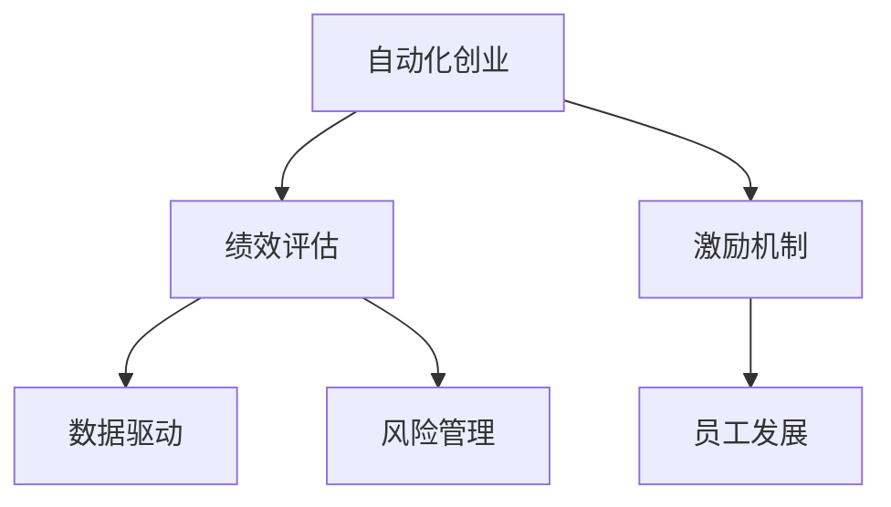

                 

# 自动化创业中的绩效评估与激励

> 关键词：自动化创业, 绩效评估, 绩效指标, 激励机制, 数据驱动, 员工发展, 风险管理, 人工智能

## 1. 背景介绍

### 1.1 问题由来

随着科技的飞速发展，自动化在各行各业中扮演着越来越重要的角色。自动化创业，特别是基于人工智能和机器学习的自动化创业，已成为当前技术风口。然而，成功并非一蹴而就。自动化创业中，如何衡量和激励团队成员的表现，是决定企业成败的关键因素之一。传统的人力资源管理方法难以适应自动化环境，新的绩效评估与激励机制亟需建立。

### 1.2 问题核心关键点

本文聚焦于自动化创业中，如何通过合理的绩效评估和激励机制，最大化员工潜力，提升企业竞争力。核心问题包括：
- 什么是自动化创业中适宜的绩效评估指标？
- 如何设计有效的激励机制以激发员工潜力？
- 如何将数据驱动的方法应用到绩效评估中？
- 如何在自动化创业中平衡风险与激励？

## 2. 核心概念与联系

### 2.1 核心概念概述

在自动化创业中，合理的绩效评估与激励机制对团队成员表现有着重要影响。核心概念包括：

- **自动化创业**：利用先进科技，特别是人工智能和机器学习，实现自动化生产、运营和管理的企业模式。
- **绩效评估**：通过一系列指标和方法，衡量员工在自动化创业中的贡献和表现。
- **激励机制**：设计一系列制度和措施，激励员工充分发挥其潜力和创新能力。
- **数据驱动**：利用大数据和算法，优化绩效评估和激励策略。
- **员工发展**：关注员工技能提升和职业成长，营造持续进步的企业环境。
- **风险管理**：在自动化创业中，通过绩效评估和激励机制，识别并降低潜在风险。

这些概念之间的逻辑关系可以通过以下Mermaid流程图来展示：



这个流程图展示了几者之间的关系：

1. 自动化创业是基础，通过绩效评估和激励机制推动企业发展。
2. 绩效评估通过数据驱动，公平、透明地衡量员工贡献。
3. 激励机制激发员工创新潜力，促进持续进步。
4. 员工发展帮助员工提升技能，保持竞争优势。
5. 风险管理确保企业稳定，减少不确定性。

## 3. 核心算法原理 & 具体操作步骤

### 3.1 算法原理概述

基于自动化创业的绩效评估与激励机制，其核心原理可归纳为以下几个方面：

1. **目标对齐**：设定清晰的企业目标，并确保所有员工的工作都与之对齐。
2. **关键绩效指标(KPIs)**：识别并量化影响业务的关键指标。
3. **行为分析**：利用数据和算法，对员工行为进行深入分析，评估其对业务的影响。
4. **持续反馈**：建立持续的反馈机制，及时调整激励策略。
5. **员工参与**：鼓励员工参与绩效评估和激励策略的设计和实施。
6. **适应性管理**：根据业务发展动态调整绩效评估和激励机制。

### 3.2 算法步骤详解

基于以上原理，绩效评估与激励机制的构建一般包括以下关键步骤：

**Step 1: 设定企业目标和战略**

1. **战略制定**：根据行业趋势和市场竞争，制定企业的长期战略。
2. **目标分解**：将企业目标分解为可操作的短期目标。
3. **对齐机制**：确保所有员工的工作目标与企业战略一致。

**Step 2: 确定关键绩效指标**

1. **业务影响评估**：识别直接影响业务的关键指标。
2. **员工贡献度评估**：量化员工对关键指标的贡献。
3. **KPI设定**：设定明确的KPIs，并与员工沟通确认。

**Step 3: 设计激励机制**

1. **激励类型**：设定奖金、晋升、培训等多种激励方式。
2. **绩效评估周期**：设定定期评估的周期和触发条件。
3. **激励分配**：制定合理的激励分配原则。

**Step 4: 实施数据驱动的绩效评估**

1. **数据收集**：收集员工的日常行为数据，如任务完成率、项目进度、客户满意度等。
2. **分析模型**：建立数据驱动的评估模型，如机器学习、统计分析等。
3. **评估结果**：根据模型评估员工的绩效，并给予反馈。

**Step 5: 持续改进和反馈**

1. **定期反馈**：定期与员工沟通绩效评估结果，并提供改进建议。
2. **调整机制**：根据反馈和业务变化，动态调整KPIs和激励机制。
3. **员工参与**：鼓励员工提出改进建议，共同优化评估和激励策略。

### 3.3 算法优缺点

自动化创业中的绩效评估与激励机制具有以下优点：
1. **客观透明**：数据驱动的评估方式可以消除人为偏见，提高评估的公平性。
2. **激励有效**：明确的目标和合理的激励措施能显著激发员工的积极性。
3. **持续改进**：持续的反馈和调整机制使评估和激励策略更加适应业务需求。
4. **员工成长**：通过绩效评估，员工能够识别自身不足，加速技能提升和职业成长。

同时，该机制也存在一些局限：
1. **数据依赖**：依赖于数据的质量和完整性，数据缺失或不准确会影响评估结果。
2. **复杂度**：设计并实施全面的评估和激励机制需要大量时间和资源。
3. **文化适应**：不同的企业文化可能对激励机制有不同的接受度。
4. **风险管理**：过度的激励可能导致员工行为短期化，忽视长期目标。

尽管有这些局限性，但基于数据驱动的绩效评估与激励机制，在自动化创业中展现出巨大的潜力和价值。

### 3.4 算法应用领域

基于自动化创业的绩效评估与激励机制，已经在多个领域得到应用：

- **软件开发**：通过代码质量和项目进度评估软件开发团队的绩效。
- **制造业**：利用生产效率和质量指标评估工厂生产线的绩效。
- **零售业**：通过销售额和客户满意度评估门店和员工的绩效。
- **金融服务**：利用交易量和客户满意度评估金融服务的绩效。
- **医疗健康**：通过治疗效果和患者满意度评估医疗团队的绩效。

## 4. 数学模型和公式 & 详细讲解 & 举例说明

### 4.1 数学模型构建

在自动化创业中，绩效评估与激励机制的构建可通过以下数学模型进行形式化描述：

设企业目标为 $G$，员工集合为 $E$，关键绩效指标为 $K$，激励措施为 $I$，评估周期为 $T$，则绩效评估与激励机制的构建可表示为：

$$
\max_{G, E, K, I, T} \sum_{t \in T} \sum_{e \in E} f(e, K, I, T)
$$

其中 $f(e, K, I, T)$ 为员工 $e$ 在周期 $T$ 内的绩效函数，包含其在 $K$ 上的贡献度以及 $I$ 下的激励效果。

### 4.2 公式推导过程

以软件开发为例，员工在某个周期内的绩效函数可表示为：

$$
f(e) = \alpha \times \text{代码质量评分} + \beta \times \text{项目进度评分} + \gamma \times \text{客户满意度评分}
$$

其中 $\alpha, \beta, \gamma$ 为权重系数，可根据不同企业需求进行调整。

### 4.3 案例分析与讲解

设某软件开发团队的目标是提升代码质量和项目进度，同时增加客户满意度。通过设定对应的KPIs并分配给每个员工，利用公式计算员工的绩效得分。在每个周期结束时，根据绩效得分进行激励分配。

例如，员工 $e$ 在某周期内的绩效得分 $f(e)$ 为：

$$
f(e) = 0.6 \times \text{代码质量评分} + 0.3 \times \text{项目进度评分} + 0.1 \times \text{客户满意度评分}
$$

设该员工获得 $f(e) = 0.8$ 的绩效得分，公司制定的激励措施为奖金和晋升，则该员工将获得 $10\%$ 的奖金和晋升机会。

## 5. 项目实践：代码实例和详细解释说明

### 5.1 开发环境搭建

在进行绩效评估与激励机制的构建实践前，我们需要准备好开发环境。以下是使用Python进行开发的环境配置流程：

1. 安装Anaconda：从官网下载并安装Anaconda，用于创建独立的Python环境。
2. 创建并激活虚拟环境：
```bash
conda create -n performance-env python=3.8 
conda activate performance-env
```

3. 安装必要的库：
```bash
pip install pandas numpy matplotlib seaborn jupyter notebook scikit-learn
```

完成上述步骤后，即可在`performance-env`环境中开始构建绩效评估与激励机制的实践。

### 5.2 源代码详细实现

下面以软件开发为例，给出使用Python构建绩效评估与激励机制的代码实现。

首先，定义员工数据和绩效指标：

```python
import pandas as pd

# 员工数据
employees = pd.DataFrame({
    'employee_id': ['A001', 'A002', 'A003', 'A004', 'A005'],
    'name': ['Alice', 'Bob', 'Charlie', 'David', 'Eve'],
    'code_quality': [0.7, 0.6, 0.8, 0.5, 0.9],
    'project_progress': [1.2, 1.0, 1.3, 0.9, 1.1],
    'customer_satisfaction': [4.8, 4.6, 4.9, 4.7, 4.5]
})

# 绩效指标权重
weights = {
    'code_quality': 0.6,
    'project_progress': 0.3,
    'customer_satisfaction': 0.1
}

# 计算绩效得分
employees['performance_score'] = employees['code_quality'] * weights['code_quality'] + \
                                 employees['project_progress'] * weights['project_progress'] + \
                                 employees['customer_satisfaction'] * weights['customer_satisfaction']
```

然后，设计激励措施并实现激励分配：

```python
# 激励措施
incentives = {
    'bonus_percentage': 0.1,
    'promotion_percentage': 0.1
}

# 激励分配函数
def distribute_incentives(employees):
    incentives_allocated = {}
    for employee in employees:
        performance_score = employees['performance_score'].loc[employee]
        bonus = performance_score * incentives['bonus_percentage']
        promotion_chance = performance_score * incentives['promotion_percentage']
        incentives_allocated[employee] = {
            'bonus': bonus,
            'promotion': promotion_chance
        }
    return incentives_allocated

# 计算激励分配
incentives_allocated = distribute_incentives(employees)
```

最后，输出激励结果并可视化绩效分布：

```python
# 输出激励结果
for employee, incentive in incentives_allocated.items():
    print(f"Employee {employee}: {incentive['bonus']}, {incentive['promotion']}")
    
# 可视化绩效分布
employees['performance_score'].plot.hist(bins=10, figsize=(8, 6), title='Performance Score Distribution')
```

以上就是使用Python构建绩效评估与激励机制的完整代码实现。可以看到，通过简单的数据处理和算法设计，我们能够快速实现绩效评估和激励分配。

### 5.3 代码解读与分析

让我们再详细解读一下关键代码的实现细节：

**employees数据框**：
- 定义了员工的ID、姓名、代码质量评分、项目进度评分和客户满意度评分，用于计算绩效得分和激励分配。

**weights字典**：
- 定义了绩效指标的权重，用于计算绩效得分。权重系数可根据企业需求进行调整。

**绩效得分计算**：
- 利用员工评分和权重计算绩效得分，公式为 $f(e) = \sum_{k} K_k \times W_k$，其中 $K_k$ 为关键绩效指标，$W_k$ 为对应指标权重。

**激励措施定义**：
- 定义了奖金和晋升两种激励方式，以及对应的百分比。

**激励分配函数**：
- 遍历所有员工，根据绩效得分和激励措施分配奖金和晋升机会，生成激励分配字典。

**激励结果输出**：
- 打印每个员工获得的激励金额和晋升机会。

**绩效分布可视化**：
- 使用matplotlib库绘制绩效得分的分布直方图，展示员工绩效分布情况。

可以看到，通过简单的代码实现，我们能够有效地构建自动化创业中的绩效评估与激励机制。开发者可以将更多精力放在业务逻辑和数据处理上，而不必过多关注底层实现细节。

## 6. 实际应用场景

### 6.1 软件开发团队管理

在软件开发团队管理中，绩效评估与激励机制能够显著提升团队协作和创新能力。通过代码质量和项目进度等关键指标，结合数据驱动的绩效评估，可以公平、透明地衡量每个成员的贡献，并根据绩效结果进行激励分配。例如，针对代码质量高的开发人员，给予更多奖金和晋升机会，鼓励其继续创新和改进。

### 6.2 制造业质量控制

在制造业中，通过生产效率和质量指标评估生产线性能，确保产品质量和生产效率的稳定。例如，利用自动化检测设备和传感器，实时监控生产线上的各项指标，并将数据传入绩效评估系统中。基于评估结果，及时调整生产线操作，提供必要的培训和激励，提升员工的操作技能和生产效率。

### 6.3 零售业销售管理

在零售业中，通过销售额和客户满意度等指标评估门店和员工的绩效，确保客户满意度和业绩提升。例如，利用POS系统和客户反馈系统，实时收集销售数据和客户评价。基于评估结果，优化商品陈列、促销策略和员工培训，提升整体销售业绩和客户满意度。

### 6.4 金融服务风险管理

在金融服务中，通过交易量和客户满意度等指标评估员工绩效，确保服务质量和业务发展。例如，利用交易记录和客户评价，定期评估员工的业绩和客户互动效果。基于评估结果，调整薪酬激励、培训计划和晋升机制，激励员工提升服务质量和业务发展。

## 7. 工具和资源推荐

### 7.1 学习资源推荐

为了帮助开发者系统掌握绩效评估与激励机制的理论基础和实践技巧，这里推荐一些优质的学习资源：

1. 《高性能团队管理》系列书籍：详细介绍了团队绩效评估、激励机制设计和管理策略，适合领导力和人力资源管理者阅读。
2. Coursera《人力资源管理》课程：由知名大学的教授讲授，涵盖绩效评估、薪酬设计、员工激励等核心内容，是系统学习人力资源管理的理想选择。
3. 《数据分析与数据驱动决策》课程：通过实际案例，介绍如何利用数据驱动绩效评估和激励策略，提升企业管理水平。
4. 《机器学习与人力资源管理》书籍：将机器学习技术和人力资源管理相结合，探索数据驱动的绩效评估与激励机制。
5. 《组织行为学》书籍：深入分析员工行为和激励机制的关系，为管理者提供理论支撑。

通过对这些资源的学习实践，相信你一定能够全面掌握绩效评估与激励机制的精髓，并用于解决实际的自动化创业问题。

### 7.2 开发工具推荐

高效的开发离不开优秀的工具支持。以下是几款用于绩效评估与激励机制开发的常用工具：

1. Jupyter Notebook：免费的交互式笔记本环境，支持Python编程和数据可视化，方便开发者快速迭代研究。
2. Matplotlib：强大的数据可视化库，支持绘制图表和图形，展示绩效评估结果。
3. Seaborn：基于Matplotlib的数据可视化库，提供高级统计图表和美观的样式，帮助开发者更直观地理解数据。
4. Pandas：强大的数据处理库，支持数据清洗、转换和分析，是构建绩效评估系统的基石。
5. Scikit-learn：机器学习库，支持各种模型和算法，适用于数据驱动的绩效评估。

合理利用这些工具，可以显著提升绩效评估与激励机制的开发效率，加快创新迭代的步伐。

### 7.3 相关论文推荐

绩效评估与激励机制的发展源于学界的持续研究。以下是几篇奠基性的相关论文，推荐阅读：

1. "Evaluation and Incentive Mechanisms in Software Engineering"：探讨了软件开发中绩效评估和激励机制的设计，提供了具体方法和案例。
2. "Performance Appraisal in Manufacturing: A Review"：回顾了制造业中绩效评估的研究进展，提出了基于数据的绩效评估方法。
3. "Customer Satisfaction and Employee Performance: A Study of Retail Service"：分析了零售业中客户满意度和员工绩效的关系，提供了改进建议。
4. "Performance Measurement in Financial Services: A Review"：综述了金融服务中绩效评估的研究，强调了数据驱动的重要性。
5. "Organizational Behavior and Performance Management: A Review"：探讨了组织行为与绩效管理的关系，为绩效评估提供了理论支持。

这些论文代表了绩效评估与激励机制的研究方向，通过学习这些前沿成果，可以帮助研究者把握学科前进方向，激发更多的创新灵感。

## 8. 总结：未来发展趋势与挑战

### 8.1 总结

本文对自动化创业中，如何通过合理的绩效评估和激励机制，最大化员工潜力，提升企业竞争力进行了全面系统的介绍。首先阐述了自动化创业中绩效评估与激励机制的研究背景和意义，明确了绩效评估在推动企业发展中的核心作用。其次，从原理到实践，详细讲解了绩效评估与激励机制的构建方法，给出了完整的代码实现。同时，本文还广泛探讨了绩效评估与激励机制在多个行业领域的应用前景，展示了其巨大的潜力和价值。

通过本文的系统梳理，可以看到，基于数据驱动的绩效评估与激励机制，在自动化创业中展现出强大的生命力。这些方法不仅能够提升员工潜力，还能为企业的持续进步提供有力保障。未来，随着数据技术的不断发展，绩效评估与激励机制必将迎来更多的创新和突破，进一步推动自动化创业的发展。

### 8.2 未来发展趋势

展望未来，绩效评估与激励机制将呈现以下几个发展趋势：

1. **智能化评估**：利用人工智能和机器学习技术，实现更高效、更精准的绩效评估。例如，通过自然语言处理技术，自动解析员工反馈和绩效数据，生成绩效评估报告。
2. **个性化激励**：根据员工的不同需求和特点，设计个性化的激励措施，提升激励效果。例如，利用大数据分析员工行为，制定个性化的职业发展规划。
3. **动态调整**：实时监测业务变化和员工表现，动态调整绩效评估指标和激励策略，确保机制的适应性。例如，通过持续反馈机制，不断优化绩效评估系统。
4. **多维数据融合**：融合财务、行为、态度等多维数据，进行综合评估和激励。例如，结合员工绩效、客户评价和财务指标，全面衡量员工表现。
5. **透明度提升**：通过可视化工具和报告，提升绩效评估和激励机制的透明度，增强员工的信任和满意度。例如，使用数据仪表盘展示绩效评估结果和激励分配情况。
6. **全球化管理**：针对跨国公司，设计适应不同文化和管理模式的绩效评估与激励机制，确保全球团队的协同和一致性。例如，考虑不同国家和地区的法律和习俗，制定统一的激励标准。

这些趋势凸显了绩效评估与激励机制的广阔前景。这些方向的探索发展，必将进一步提升绩效评估与激励机制的科学性和有效性，为自动化创业提供更坚实的基础。

### 8.3 面临的挑战

尽管绩效评估与激励机制在自动化创业中展现出巨大的潜力和价值，但在迈向更加智能化、普适化应用的过程中，它仍面临着诸多挑战：

1. **数据隐私**：在绩效评估中，如何保护员工隐私，确保数据安全，是一个重要问题。例如，匿名化处理员工数据，防止信息泄露。
2. **数据质量**：绩效评估依赖于数据的准确性和完整性，数据质量不佳将影响评估结果。例如，通过数据清洗和质量控制，提升数据的可靠性。
3. **技术门槛**：构建和实施高性能绩效评估系统需要一定的技术储备，普通企业可能面临技术挑战。例如，培训员工使用数据分析工具，提升数据素养。
4. **文化差异**：不同企业文化对激励机制的接受度和理解程度可能不同，需要灵活调整策略。例如，结合企业特色，设计适合的激励措施。
5. **绩效目标对齐**：员工可能对企业目标不够明确，导致绩效评估与激励机制无法有效对齐。例如，通过培训和沟通，确保所有员工理解和认同企业目标。
6. **动态管理**：绩效评估和激励机制需要不断调整，以适应企业发展变化。例如，定期进行绩效评估和激励策略的审查和优化。

这些挑战需要通过技术创新、文化理解和持续管理来克服。只有在数据、技术和文化等多个维度协同发力，才能确保绩效评估与激励机制的有效性和公正性。

### 8.4 研究展望

面对绩效评估与激励机制所面临的挑战，未来的研究需要在以下几个方面寻求新的突破：

1. **技术融合**：结合人工智能、大数据和区块链技术，提升绩效评估的智能化和透明度。例如，通过区块链技术保障数据安全和隐私。
2. **文化融合**：根据不同文化背景，设计适应性的绩效评估与激励机制。例如，考虑文化差异，制定多元化的激励措施。
3. **多维评估**：综合考虑员工绩效、客户满意度、财务表现等多维指标，进行全面评估和激励。例如，通过机器学习模型，分析多维数据关系。
4. **动态调整**：利用实时数据和持续反馈，动态调整绩效评估和激励策略，保持机制的灵活性。例如，通过自适应学习算法，实时优化激励方案。
5. **透明度提升**：通过可视化工具和报告，提升绩效评估和激励机制的透明度，增强员工的信任和满意度。例如，使用数据仪表盘展示绩效评估结果和激励分配情况。
6. **风险管理**：通过绩效评估和激励机制，识别潜在风险，制定应对措施，确保企业的稳定发展。例如，定期进行风险评估和应急预案演练。

这些研究方向将推动绩效评估与激励机制的不断优化和完善，为自动化创业提供更加全面、科学、公平的管理保障。面向未来，绩效评估与激励机制需要在技术、文化和业务等多个维度协同发力，共同推动企业向更高目标迈进。

## 9. 附录：常见问题与解答

**Q1：如何设定合理的绩效评估指标？**

A: 设定合理的绩效评估指标需要考虑多个因素，包括企业目标、业务特点、员工角色等。一般来说，可以按照以下步骤进行：

1. **明确企业目标**：确保所有指标与企业战略对齐。
2. **业务影响评估**：识别直接影响业务的关键指标。
3. **员工贡献度评估**：量化员工对关键指标的贡献。
4. **指标设定**：结合业务需求和员工表现，设定明确的KPIs。

例如，软件开发中，代码质量、项目进度和客户满意度是关键的评估指标。

**Q2：如何设计有效的激励机制？**

A: 设计有效的激励机制需要考虑多个因素，包括激励类型、激励强度、激励周期等。一般来说，可以按照以下步骤进行：

1. **激励类型**：设定奖金、晋升、培训等多种激励方式。
2. **激励强度**：设定合理的激励比例，根据绩效得分进行动态调整。
3. **激励周期**：设定定期评估的周期和触发条件。
4. **激励分配**：制定明确的激励分配原则，确保公正性和透明度。

例如，软件开发中，代码质量高、项目进度快、客户满意度高的员工可以获得更多的奖金和晋升机会。

**Q3：如何提升数据质量？**

A: 提升数据质量需要从数据收集、数据清洗和数据分析等多个环节入手。一般来说，可以按照以下步骤进行：

1. **数据收集**：确保数据来源可靠、完整，避免数据遗漏或偏差。
2. **数据清洗**：去除异常值、处理缺失值，保证数据的准确性和一致性。
3. **数据分析**：通过统计分析和机器学习等方法，发现数据中的规律和趋势。
4. **质量控制**：建立持续的数据质量监控机制，定期检查和优化数据质量。

例如，通过数据清洗工具，如Pandas库，去除无效数据和重复数据，提升数据的可靠性。

**Q4：如何保护数据隐私？**

A: 保护数据隐私需要从数据收集、数据存储和数据使用等多个环节入手。一般来说，可以按照以下步骤进行：

1. **匿名化处理**：对敏感数据进行匿名化处理，防止信息泄露。例如，去除员工姓名和地址等个人隐私信息。
2. **数据加密**：对数据进行加密处理，确保数据传输和存储的安全性。例如，使用AES加密算法保护数据。
3. **权限控制**：设置数据访问权限，确保只有授权人员可以访问和使用数据。例如，通过RBAC（基于角色的访问控制）管理数据权限。
4. **合规审查**：定期进行数据隐私和安全审查，确保符合相关法律法规和标准。例如，遵守GDPR等数据隐私保护法规。

例如，通过数据加密和权限控制，确保员工绩效数据的安全和隐私。

**Q5：如何设计适应性的绩效评估与激励机制？**

A: 设计适应性的绩效评估与激励机制需要考虑企业文化、员工需求等多个因素。一般来说，可以按照以下步骤进行：

1. **文化调研**：了解企业文化和管理模式，识别激励机制的接受度和理解程度。
2. **员工需求分析**：通过问卷调查、访谈等方法，了解员工对激励措施的需求和期望。
3. **灵活调整**：根据调研结果和业务需求，灵活调整绩效评估和激励策略。
4. **透明沟通**：通过公开透明的沟通渠道，增强员工对机制的理解和认同。
5. **持续优化**：定期收集员工反馈，不断优化绩效评估和激励机制。

例如，结合企业特色，设计适合的多元化激励措施，如员工发展计划、团队奖励等。

通过以上讨论，可以看到，绩效评估与激励机制在自动化创业中具有重要意义。通过合理的设计和实施，不仅能提升员工潜力，还能为企业的持续进步提供有力保障。未来，随着数据技术的不断创新和应用的深入，绩效评估与激励机制必将进一步优化和完善，为自动化创业注入新的动力。

---

作者：禅与计算机程序设计艺术 / Zen and the Art of Computer Programming

