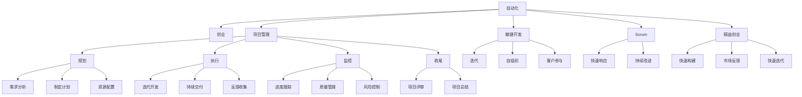

                 

# 自动化创业中的项目管理方法

> 关键词：自动化,创业,项目管理,敏捷开发,Scrum,精益创业

## 1. 背景介绍

### 1.1 问题由来
随着技术的发展，越来越多的创业公司开始尝试利用自动化技术提升运营效率，降低成本，提高竞争力。自动化技术的应用范围涵盖了软件开发、运维管理、市场营销、客服支持等多个领域。然而，自动化项目的成功实施并非易事，缺乏系统的项目管理方法，往往导致项目周期延长，预算超支，甚至项目失败。

### 1.2 问题核心关键点
在自动化创业中，项目管理的核心关键点包括：
- 如何高效规划和管理自动化项目的各个环节，避免资源浪费。
- 如何确保项目交付符合预期，满足客户需求。
- 如何快速响应市场变化，灵活调整项目计划。
- 如何提升团队协作效率，实现快速迭代。
- 如何规避自动化项目实施过程中可能遇到的技术风险和业务风险。

### 1.3 问题研究意义
研究自动化创业中的项目管理方法，对于拓展自动化技术的应用场景，提升创业公司效率，优化资源配置，具有重要意义：

1. 降低成本。利用自动化项目管理方法，可以避免无谓的资源浪费，提高项目实施效率，减少不必要的成本支出。
2. 提高质量。通过系统化的项目管理，确保项目交付符合预期，降低项目失败的风险。
3. 提升灵活性。自动化项目管理能够灵活应对市场变化，快速调整项目计划，满足市场需求。
4. 增强协作。提升团队协作效率，促进多团队、多部门间的协同工作。
5. 规避风险。提前识别并规避项目实施过程中可能遇到的技术风险和业务风险，保障项目顺利推进。

## 2. 核心概念与联系

### 2.1 核心概念概述

为更好地理解自动化创业中的项目管理方法，本节将介绍几个密切相关的核心概念：

- **自动化(Automation)**：利用软件和工具，自动化执行重复性、耗时长的任务，提高生产效率，减少人为错误。
- **创业(Entrepreneurship)**：创建新的企业或事业，通过创新和技术驱动，实现商业价值的增长。
- **项目管理(Project Management)**：规划、执行、监控和收尾项目的一系列过程，确保项目能够按时、按质、按预算完成。
- **敏捷开发(Agile Development)**：一种以快速响应市场需求和反馈为导向的开发方法，强调迭代、自组织和客户参与。
- **Scrum(Scrum Methodology)**：一种敏捷开发的框架，以短周期迭代、小团队自主、透明沟通等特点，支持项目快速交付和灵活调整。
- **精益创业(Lean Startup)**：一种创业方法论，通过快速构建产品原型、收集反馈、快速迭代，降低创业风险，加速创新。

这些核心概念之间的逻辑关系可以通过以下Mermaid流程图来展示：



这个流程图展示了一个自动化创业项目的核心概念及其之间的关联：

1. 自动化技术是创业的基础工具，可以提升生产效率。
2. 项目管理是项目实施的保障，确保项目能够按时、按质、按预算完成。
3. 敏捷开发和Scrum是项目管理的重要方法，支持项目快速交付和灵活调整。
4. 精益创业是创业的战略方法，强调快速验证和迭代，降低创业风险。
5. 这些概念共同构成了自动化创业的管理框架，使得创业公司能够高效实施自动化项目，提升竞争力和市场响应速度。

## 3. 核心算法原理 & 具体操作步骤

### 3.1 算法原理概述

自动化创业中的项目管理方法，本质上是一种系统化的过程管理策略。其核心思想是：通过合理的规划、执行、监控和收尾，确保自动化项目能够按时、按质、按预算完成。

形式化地，假设自动化创业项目为 $P$，其生命周期分为四个阶段：需求分析、规划、执行和收尾，分别由不同的项目管理团队负责。项目管理的优化目标是最小化项目成本和延期风险，即找到最优策略：

$$
\min_{S} (\text{Cost}(S) + \text{Delay}(S))
$$

其中 $S$ 为项目管理策略，$\text{Cost}(S)$ 为项目总成本，$\text{Delay}(S)$ 为项目延期时间。

通过梯度下降等优化算法，项目管理过程不断更新策略 $S$，最小化项目总成本和延期风险，使得项目在预算范围内按时完成。由于自动化项目中存在诸多不确定性和风险，项目管理策略通常需要不断调整和优化，以应对新的市场变化和内部挑战。

### 3.2 算法步骤详解

自动化创业中的项目管理一般包括以下几个关键步骤：

**Step 1: 需求分析**

- 收集自动化项目需求，包括业务需求、技术需求、客户需求等。
- 分析自动化项目对企业运营效率的提升预期。
- 确定项目目标和关键绩效指标(KPIs)。

**Step 2: 制定项目计划**

- 确定项目团队，分配任务和职责。
- 制定详细的项目里程碑和进度计划。
- 分配资源，包括人力、设备、预算等。

**Step 3: 项目管理与执行**

- 使用敏捷开发和Scrum框架，将项目分解为小迭代，快速响应市场变化。
- 通过每日站会、迭代评审等方式，促进团队协作和透明沟通。
- 定期评估项目进度和质量，及时调整计划。

**Step 4: 监控与控制**

- 实时监控项目进度和质量，使用项目管理工具如Jira、Trello等进行任务跟踪和进度管理。
- 收集反馈，识别和处理项目风险。
- 定期与客户沟通，确保项目交付符合预期。

**Step 5: 项目收尾**

- 对项目进行总结和评估，记录项目经验教训。
- 发布项目交付成果，并进行后续支持。
- 准备项目文档，归档存储，以便未来参考。

以上是自动化创业中的项目管理一般流程。在实际应用中，还需要根据项目特点，对项目管理过程的各个环节进行优化设计，如改进需求分析方法，优化项目里程碑划分，引入更多项目管理工具等，以进一步提升项目管理的效率和效果。

### 3.3 算法优缺点

自动化创业中的项目管理方法具有以下优点：
1. 提升效率。通过系统化的项目管理，确保项目按时、按质完成，避免资源浪费。
2. 增强灵活性。敏捷开发和Scrum框架支持快速响应市场需求，灵活调整项目计划。
3. 降低风险。实时监控和风险控制措施，确保项目顺利推进。
4. 提升协作效率。通过敏捷开发和精益创业方法，提升团队协作效率。

同时，该方法也存在一定的局限性：
1. 对项目经理能力要求高。项目管理需要有丰富的经验和方法论，对于不熟悉敏捷开发和Scrum的企业来说，引入项目管理可能存在适应困难。
2. 对团队协作要求高。项目管理需要团队成员具备自组织能力和协作精神，对于传统线性管理的团队可能存在挑战。
3. 依赖外部工具。项目管理需要依赖各种项目管理工具和平台，对于小规模项目可能存在过度管理的问题。
4. 对项目管理成本高。项目管理需要投入额外的时间和资源，对于预算有限的项目可能存在成本压力。

尽管存在这些局限性，但就目前而言，系统化的项目管理方法仍然是自动化创业中不可或缺的组成部分。未来相关研究的重点在于如何进一步降低项目管理的复杂性，提高项目管理效率，同时兼顾资源合理配置和团队协作。

### 3.4 算法应用领域

自动化创业中的项目管理方法，已经在软件开发、运维管理、市场营销、客服支持等多个领域得到了广泛的应用，以下是几个典型的应用场景：

1. **软件开发**

   在软件开发项目中，使用敏捷开发和Scrum框架，将项目拆分为多个小迭代，快速响应客户需求和市场变化。项目经理通过每日站会、迭代评审等方式，实时监控项目进度和质量，及时调整计划。敏捷开发和Scrum框架使得软件项目能够灵活应对技术复杂性和用户需求的不确定性，提升开发效率和质量。

2. **运维管理**

   在运维管理项目中，使用精益创业方法，快速构建和验证运维自动化系统。项目经理通过快速迭代和反馈收集，不断优化自动化系统，提升运维效率和稳定性。精益创业方法使得运维项目能够快速应对技术挑战和业务需求的变化，降低运维成本。

3. **市场营销**

   在市场营销项目中，使用敏捷开发和Scrum框架，快速构建和推广自动化营销工具。项目经理通过迭代开发和客户反馈，不断优化营销工具，提升营销效果和用户满意度。敏捷开发和Scrum框架使得市场营销项目能够快速适应市场变化和客户需求，提升营销效率和市场响应速度。

4. **客服支持**

   在客服支持项目中，使用精益创业方法，快速构建和推广自动化客服系统。项目经理通过快速迭代和客户反馈，不断优化客服系统，提升客户体验和问题解决效率。精益创业方法使得客服支持项目能够快速应对客户需求和技术挑战，提升客户满意度和公司形象。

除了上述这些经典场景外，自动化项目管理方法也被创新性地应用到更多领域中，如供应链管理、客户关系管理、人力资源管理等，为自动化创业公司带来了全新的突破。随着项目管理方法的持续演进，相信自动化项目管理必将在更多行业领域大放异彩。

## 4. 数学模型和公式 & 详细讲解 & 举例说明

### 4.1 数学模型构建

本节将使用数学语言对自动化创业中的项目管理方法进行更加严格的刻画。

记自动化创业项目为 $P$，其生命周期分为四个阶段：需求分析、规划、执行和收尾，分别由不同的项目管理团队负责。项目管理的优化目标是最小化项目成本和延期风险，即找到最优策略：

$$
\min_{S} (\text{Cost}(S) + \text{Delay}(S))
$$

其中 $S$ 为项目管理策略，$\text{Cost}(S)$ 为项目总成本，$\text{Delay}(S)$ 为项目延期时间。

通过梯度下降等优化算法，项目管理过程不断更新策略 $S$，最小化项目总成本和延期风险，使得项目在预算范围内按时完成。由于自动化项目中存在诸多不确定性和风险，项目管理策略通常需要不断调整和优化，以应对新的市场变化和内部挑战。

### 4.2 公式推导过程

以下我们以软件开发项目为例，推导敏捷开发和Scrum框架下的项目管理公式。

假设软件开发项目共包含 $n$ 个功能模块，每个模块的开发周期为 $t$ 天，预算为 $C_i$，实际开发时间为 $T_i$，延期时间为 $D_i$，则项目总成本为：

$$
\text{Cost} = \sum_{i=1}^n C_i + \sum_{i=1}^n (T_i - t_i) \cdot \text{Cost}_{\text{overrun}}
$$

其中 $\text{Cost}_{\text{overrun}}$ 为超支成本系数。

项目总延期时间为：

$$
\text{Delay} = \sum_{i=1}^n D_i
$$

项目管理的目标是最小化项目总成本和延期风险，即：

$$
\min_{S} (\text{Cost}(S) + \text{Delay}(S))
$$

通过优化算法（如梯度下降），更新策略 $S$，使得 $t_i$ 和 $T_i$ 逼近最优值。

在实践中，项目经理需要通过每日站会、迭代评审等方式，实时监控项目进度和质量，及时调整计划。根据每日站会的反馈，调整下一迭代的任务分配和进度计划。通过迭代评审，评估每个迭代的功能模块完成情况，识别和处理延期风险。

### 4.3 案例分析与讲解

以下我们以某软件开发项目为例，展示敏捷开发和Scrum框架下的项目管理过程。

项目需求：开发一个电商平台后台管理系统，包括用户管理、商品管理、订单管理等功能模块。

项目规划：分配4个开发团队，每个团队负责1个模块，每个模块的开发周期为30天，预算为5万元，实际开发时间为28天，延期时间为2天。

项目执行：通过每日站会和迭代评审，实时监控项目进度和质量，及时调整计划。根据每日站会的反馈，调整下一迭代的任务分配和进度计划。通过迭代评审，评估每个迭代的功能模块完成情况，识别和处理延期风险。

项目收尾：对项目进行总结和评估，记录项目经验教训，发布项目交付成果，并进行后续支持。

项目结果：该项目按时完成，交付的后台管理系统满足客户需求，客户反馈良好，项目总体成本控制在预算范围内。

通过这个案例，可以看到，敏捷开发和Scrum框架通过迭代开发和实时监控，使得软件开发项目能够高效推进，灵活应对需求变化和延期风险，提升项目质量和效率。

## 5. 项目实践：代码实例和详细解释说明

### 5.1 开发环境搭建

在进行项目管理实践前，我们需要准备好开发环境。以下是使用JIRA进行敏捷开发的环境配置流程：

1. 安装JIRA：从官网下载并安装JIRA，获取敏捷开发所需的功能和工具。

2. 创建项目：登录JIRA，创建新的项目管理项目，设定项目名称、负责人、团队等信息。

3. 创建迭代：在项目页面中，创建新的迭代，设定迭代周期、任务列表等信息。

4. 分配任务：将项目任务分配给团队成员，设定任务描述、负责人、优先级等信息。

5. 每日站会：在迭代页面，使用每日站会工具，记录团队成员的工作进展和问题，实时更新任务状态。

6. 迭代评审：在迭代结束后，使用迭代评审工具，评估迭代成果和延期风险，生成项目报告。

完成上述步骤后，即可在JIRA环境中开始敏捷开发实践。

### 5.2 源代码详细实现

下面我们以软件开发项目为例，给出使用JIRA进行敏捷开发和Scrum项目管理的具体代码实现。

```python
from jira import JIRA
from jira.issues import Issue
from jira.dvcs import Dvcs
from jira.dvcs.utils import get_default_remote_url

class JiraProjectManager:
    def __init__(self, jira_url, jira_user, jira_password):
        self.jira = JIRA(options={'url': jira_url}, basic_auth=(jira_user, jira_password))

    def create_project(self, project_key, project_name):
        self.jira.create_project(project_key, project_name)

    def create_iteration(self, project_key, iteration_name, iteration_start_date, iteration_end_date):
        iteration = self.jira.create_iteration(project_key, iteration_name, iteration_start_date, iteration_end_date)
        return iteration.self

    def add_task_to_iteration(self, project_key, iteration_id, task_id):
        self.jira.add_to_iteration(iteration_id, task_id)

    def update_task_status(self, task_id, new_status):
        self.jira.update_issue(task_id, fields={'status': new_status})

    def daily_standup(self, iteration_id):
        for issue in self.jira.get_issues_for_iteration(iteration_id):
            # 记录任务进展和问题
            # ...

    def iteration_review(self, iteration_id):
        for issue in self.jira.get_issues_for_iteration(iteration_id):
            # 评估任务完成情况和延期风险
            # ...

    def generate_report(self, project_key):
        report = self.jira.get_release_reports(project_key)
        # 生成项目报告
        # ...
```

### 5.3 代码解读与分析

让我们再详细解读一下关键代码的实现细节：

**JiraProjectManager类**：
- `__init__`方法：初始化JIRA客户端，连接至指定JIRA实例。
- `create_project`方法：创建新的项目管理项目，设定项目名称、负责人、团队等信息。
- `create_iteration`方法：创建新的迭代，设定迭代周期、任务列表等信息。
- `add_task_to_iteration`方法：将项目任务分配给团队成员，设定任务描述、负责人、优先级等信息。
- `update_task_status`方法：更新任务状态，记录每日站会反馈和迭代评审结果。
- `daily_standup`方法：每日站会工具，记录团队成员的工作进展和问题，实时更新任务状态。
- `iteration_review`方法：迭代评审工具，评估迭代成果和延期风险，生成项目报告。

通过JIRA提供的各种工具和API，可以方便地实现敏捷开发和Scrum项目管理。JIRA的强大功能涵盖了需求管理、任务分配、进度跟踪、报告生成等各个环节，极大提高了项目管理的效率和效果。

当然，实际应用中还需要结合具体的项目管理需求，进行针对性的定制开发。例如，可以加入自动化测试、代码审查、缺陷管理等环节，进一步提升项目管理的精细度和自动化程度。

## 6. 实际应用场景
### 6.1 智能制造

在智能制造领域，敏捷开发和Scrum框架被广泛应用于工业互联网平台和智能设备管理。通过敏捷开发，快速响应客户需求和市场变化，提升制造业的自动化水平和生产效率。

在实际应用中，可以收集用户反馈和市场需求，使用敏捷开发方法快速构建和验证工业互联网平台和智能设备管理系统。项目经理通过每日站会和迭代评审，实时监控项目进度和质量，及时调整计划。精益创业方法使得智能制造项目能够快速应对技术挑战和业务需求的变化，提升生产效率和产品质量。

### 6.2 医疗健康

在医疗健康领域，敏捷开发和Scrum框架被广泛应用于医院信息化系统和健康监测设备。通过敏捷开发，快速响应医院和患者的业务需求，提升医疗服务的自动化水平和患者体验。

在实际应用中，可以收集医院和患者的反馈和需求，使用敏捷开发方法快速构建和验证医院信息化系统和健康监测设备。项目经理通过每日站会和迭代评审，实时监控项目进度和质量，及时调整计划。精益创业方法使得医疗健康项目能够快速应对技术挑战和业务需求的变化，提升医疗服务的效率和患者体验。

### 6.3 智能交通

在智能交通领域，敏捷开发和Scrum框架被广泛应用于智能交通管理和智慧城市建设。通过敏捷开发，快速响应交通和城市的业务需求，提升交通管理和城市治理的自动化水平和智能化程度。

在实际应用中，可以收集交通和城市的反馈和需求，使用敏捷开发方法快速构建和验证智能交通管理和智慧城市系统。项目经理通过每日站会和迭代评审，实时监控项目进度和质量，及时调整计划。精益创业方法使得智能交通项目能够快速应对技术挑战和业务需求的变化，提升交通管理和城市治理的效率和智能化程度。

### 6.4 未来应用展望

随着敏捷开发和Scrum框架的持续演进，未来的项目管理将呈现以下几个发展趋势：

1. 自动化程度提升。使用更先进的项目管理工具和自动化技术，进一步提升项目管理的效率和精度。
2. 数据驱动决策。通过数据分析和可视化，支持项目管理决策的科学化和数据化。
3. 跨团队协作。使用更灵活的项目管理工具和方法，支持跨部门、跨团队的协同工作。
4. 持续改进。通过持续改进和反馈机制，不断优化项目管理流程和工具，提升项目管理质量。
5. 生态系统构建。构建更加开放和协同的项目管理生态系统，支持更多的第三方工具和服务。

以上趋势凸显了敏捷开发和Scrum框架的广阔前景。这些方向的探索发展，必将进一步提升项目管理的方法论和技术水平，为自动化创业公司提供更加高效、灵活、可靠的项目管理支持。

## 7. 工具和资源推荐
### 7.1 学习资源推荐

为了帮助开发者系统掌握敏捷开发和Scrum项目管理的方法论，这里推荐一些优质的学习资源：

1. **《敏捷软件开发：原则、模式与实践》**：Eric Feinberg等著作，详细介绍了敏捷开发的基本原则和最佳实践。
2. **《Scrum指南》**：Scrum.org官方文档，介绍了Scrum框架的基本流程和方法论。
3. **Coursera《敏捷开发》课程**：Coursera平台上的课程，由知名软件工程专家授课，涵盖敏捷开发的核心方法和工具。
4. **Atlassian敏捷开发培训**：Atlassian官方提供的敏捷开发培训课程，包括敏捷管理、Scrum实践等详细内容。
5. **Scrum Alliance认证**：Scrum Alliance提供的Scrum认证，帮助认证人员深入掌握Scrum框架的理论和实践。

通过对这些资源的学习实践，相信你一定能够快速掌握敏捷开发和Scrum项目管理的方法论，并将其应用于实际项目中。

### 7.2 开发工具推荐

高效的开发离不开优秀的工具支持。以下是几款用于敏捷开发和Scrum项目管理的常用工具：

1. **JIRA**：Atlassian提供的项目管理工具，支持敏捷开发和Scrum框架，涵盖需求管理、任务分配、进度跟踪、报告生成等各个环节。
2. **Trello**：Atlassian提供的项目管理工具，使用看板式管理方式，支持敏捷开发和Scrum框架，便于任务可视化和团队协作。
3. **Confluence**：Atlassian提供的协作工具，支持文档管理和知识共享，提升团队协作效率。
4. **Slack**：Slack提供的团队协作工具，支持实时通信和任务提醒，便于团队成员的快速沟通和协作。
5. **GitHub**：GitHub提供的版本控制工具，支持敏捷开发和Scrum框架，便于代码管理和版本控制。

合理利用这些工具，可以显著提升敏捷开发和Scrum项目管理的效率和效果，帮助团队实现快速交付和高质量的项目成果。

### 7.3 相关论文推荐

敏捷开发和Scrum框架的发展源于学界的持续研究。以下是几篇奠基性的相关论文，推荐阅读：

1. **《敏捷软件开发：原则、模式与实践》**：Martin Fowler著作，详细介绍了敏捷开发的基本原则和最佳实践。
2. **《Scrum指南》**：Ken Schwaber和Mike Beedle等著作，介绍了Scrum框架的基本流程和方法论。
3. **《精益创业》**：Eric Ries著作，介绍了精益创业的核心方法论和实践技巧。
4. **《敏捷管理》**：James Kerr著作，介绍了敏捷管理的核心方法论和应用技巧。
5. **《Scrum Alliance认证》**：Scrum Alliance提供的Scrum认证，帮助认证人员深入掌握Scrum框架的理论和实践。

这些论文代表了大规模软件开发和项目管理的研究脉络。通过学习这些前沿成果，可以帮助研究者把握学科前进方向，激发更多的创新灵感。

## 8. 总结：未来发展趋势与挑战

### 8.1 总结

本文对自动化创业中的项目管理方法进行了全面系统的介绍。首先阐述了自动化创业项目管理的背景和意义，明确了敏捷开发和Scrum框架在自动化创业中的独特价值。其次，从原理到实践，详细讲解了敏捷开发和Scrum框架的数学模型和关键步骤，给出了敏捷开发和Scrum项目管理的完整代码实例。同时，本文还广泛探讨了敏捷开发和Scrum框架在智能制造、医疗健康、智能交通等多个领域的应用前景，展示了敏捷开发和Scrum框架的广阔应用范围。

通过本文的系统梳理，可以看到，敏捷开发和Scrum框架在自动化创业中扮演了重要的角色，极大地提升了项目管理的效率和效果，降低了创业风险。未来，伴随敏捷开发和Scrum框架的不断演进，相信自动化创业公司的项目管理将更加高效、灵活、可靠，为公司发展带来新的机遇。

### 8.2 未来发展趋势

展望未来，敏捷开发和Scrum框架将呈现以下几个发展趋势：

1. 自动化程度提升。使用更先进的项目管理工具和自动化技术，进一步提升项目管理的效率和精度。
2. 数据驱动决策。通过数据分析和可视化，支持项目管理决策的科学化和数据化。
3. 跨团队协作。使用更灵活的项目管理工具和方法，支持跨部门、跨团队的协同工作。
4. 持续改进。通过持续改进和反馈机制，不断优化项目管理流程和工具，提升项目管理质量。
5. 生态系统构建。构建更加开放和协同的项目管理生态系统，支持更多的第三方工具和服务。

以上趋势凸显了敏捷开发和Scrum框架的广阔前景。这些方向的探索发展，必将进一步提升项目管理的方法论和技术水平，为自动化创业公司提供更加高效、灵活、可靠的项目管理支持。

### 8.3 面临的挑战

尽管敏捷开发和Scrum框架已经取得了瞩目成就，但在迈向更加智能化、普适化应用的过程中，它仍面临着诸多挑战：

1. 对项目管理团队的素质要求高。敏捷开发和Scrum框架需要团队具备较强的自我管理能力和协作精神，对于缺乏经验的企业来说，引入敏捷开发可能存在适应困难。
2. 对团队协作要求高。敏捷开发和Scrum框架需要团队成员具备自组织能力和协作精神，对于传统线性管理的团队可能存在挑战。
3. 依赖外部工具。敏捷开发和Scrum框架需要依赖各种项目管理工具和平台，对于小规模项目可能存在过度管理的问题。
4. 对项目管理成本高。敏捷开发和Scrum框架需要投入额外的时间和资源，对于预算有限的项目可能存在成本压力。

尽管存在这些挑战，但就目前而言，敏捷开发和Scrum框架仍然是自动化创业中不可或缺的组成部分。未来相关研究的重点在于如何进一步降低项目管理的复杂性，提高项目管理效率，同时兼顾资源合理配置和团队协作。

### 8.4 研究展望

面对敏捷开发和Scrum框架所面临的挑战，未来的研究需要在以下几个方面寻求新的突破：

1. 探索无监督和半监督项目管理方法。摆脱对大量项目数据的依赖，利用自监督学习、主动学习等无监督和半监督范式，最大限度利用非结构化数据，实现更加灵活高效的项目管理。
2. 研究参数高效和计算高效的项目管理范式。开发更加参数高效的敏捷开发和Scrum框架，在固定大部分项目管理参数的同时，只更新极少量的任务相关参数。同时优化项目管理算法的计算图，减少前向传播和反向传播的资源消耗，实现更加轻量级、实时性的项目管理。
3. 融合因果分析和博弈论工具。将因果分析方法引入敏捷开发和Scrum框架，识别出项目管理决策的关键特征，增强项目管理输出的因果性和逻辑性。借助博弈论工具刻画项目团队和利益相关者的行为，主动探索并规避项目管理的脆弱点，提高系统稳定性。
4. 纳入伦理道德约束。在项目管理目标中引入伦理导向的评估指标，过滤和惩罚有偏见、有害的输出倾向。同时加强人工干预和审核，建立项目管理行为的监管机制，确保输出符合人类价值观和伦理道德。

这些研究方向的探索，必将引领敏捷开发和Scrum框架迈向更高的台阶，为自动化创业公司提供更加高效、灵活、可靠的项目管理支持。面向未来，敏捷开发和Scrum框架还需要与其他人工智能技术进行更深入的融合，如知识表示、因果推理、强化学习等，多路径协同发力，共同推动项目管理技术的发展。只有勇于创新、敢于突破，才能不断拓展敏捷开发和Scrum框架的边界，让项目管理技术更好地服务自动化创业公司。

## 9. 附录：常见问题与解答

**Q1：敏捷开发和Scrum框架是否适用于所有自动化创业项目？**

A: 敏捷开发和Scrum框架在大多数自动化创业项目上都能取得不错的效果，特别是对于需求多变、市场快速变化的项目。但对于一些特定领域的项目，如工业制造、医疗健康等，敏捷开发和Scrum框架可能存在适应困难。此时需要在项目初期进行评估，选择更加适合的敏捷开发方法或项目管理框架。

**Q2：如何使用敏捷开发和Scrum框架进行项目进度跟踪和监控？**

A: 敏捷开发和Scrum框架通过每日站会和迭代评审，实时监控项目进度和质量，及时调整计划。项目经理通过每日站会的反馈，调整下一迭代的任务分配和进度计划。通过迭代评审，评估每个迭代的功能模块完成情况，识别和处理延期风险。

**Q3：敏捷开发和Scrum框架在自动化创业中如何提高团队协作效率？**

A: 敏捷开发和Scrum框架通过迭代开发和实时沟通，提升团队协作效率。项目经理通过每日站会和迭代评审，实时监控项目进度和质量，及时调整计划。团队成员通过每日站会和迭代评审，实时共享进展和反馈，共同解决项目中的问题。

**Q4：敏捷开发和Scrum框架在自动化创业中如何规避技术风险和业务风险？**

A: 敏捷开发和Scrum框架通过快速迭代和反馈收集，不断优化项目计划和方案，规避技术风险和业务风险。项目经理通过每日站会和迭代评审，实时监控项目进度和质量，及时调整计划。团队成员通过每日站会和迭代评审，实时共享进展和反馈，共同解决项目中的问题。

**Q5：敏捷开发和Scrum框架在自动化创业中如何提升项目管理效率？**

A: 敏捷开发和Scrum框架通过迭代开发和实时监控，提升项目管理效率。项目经理通过每日站会和迭代评审，实时监控项目进度和质量，及时调整计划。团队成员通过每日站会和迭代评审，实时共享进展和反馈，共同解决项目中的问题。

通过本文的系统梳理，可以看到，敏捷开发和Scrum框架在自动化创业中扮演了重要的角色，极大地提升了项目管理的效率和效果，降低了创业风险。未来，伴随敏捷开发和Scrum框架的不断演进，相信自动化创业公司的项目管理将更加高效、灵活、可靠，为公司发展带来新的机遇。总之，敏捷开发和Scrum框架需要开发者根据具体项目，不断迭代和优化管理方法、工具和流程，方能得到理想的效果。

---

作者：禅与计算机程序设计艺术 / Zen and the Art of Computer Programming

