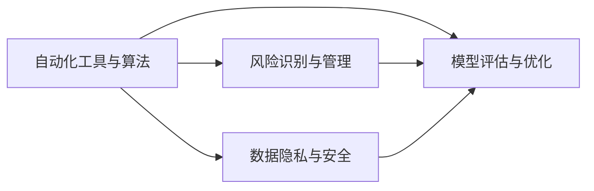

                 

# 自动化创业中的风险控制

> 关键词：
自动化、风险管理、创业、决策支持、大数据、机器学习、模型评估、策略优化

## 1. 背景介绍

随着技术的不断进步和商业环境的迅速变化，自动化技术在创业项目中的应用越来越广泛。从初创企业的运营管理到产品迭代优化，从市场需求分析到客户体验提升，自动化工具和算法都在发挥着越来越重要的作用。然而，自动化创业也面临着诸多风险，如数据隐私泄露、模型偏差、系统鲁棒性不足等。如何有效识别和控制这些风险，确保自动化系统的稳定性和安全性，成为创业项目中不可或缺的一环。

### 1.1 自动化创业的发展现状

自动化技术的发展与普及，使创业项目能够更加高效地处理数据、分析和决策。特别是大数据、机器学习和人工智能等前沿技术的应用，极大提升了创业项目的智能化水平，为实现自动化创业提供了强有力的技术支持。以下列举几个典型的自动化创业场景：

- **运营管理自动化**：使用自动化工具进行任务调度、资源管理、员工绩效评估等，提高企业的运营效率和资源利用率。
- **市场分析自动化**：通过数据挖掘和预测分析，自动化地分析市场需求趋势、竞争对手动态、客户行为模式等，为决策提供科学依据。
- **产品优化自动化**：利用机器学习算法对用户反馈、市场数据进行分析，自动化地优化产品功能、改进用户体验，实现持续迭代和创新。

这些自动化场景不仅提升了企业的运作效率，也降低了运营成本，成为了创业项目的重要竞争力来源。然而，自动化系统自身也可能带来新的风险，如数据隐私泄露、模型偏差、系统鲁棒性不足等。因此，有效识别和控制这些风险，对于确保自动化创业项目的成功至关重要。

## 2. 核心概念与联系

### 2.1 核心概念概述

自动化创业中的风险控制，主要涉及以下几个核心概念：

- **自动化工具与算法**：包括大数据处理工具、机器学习算法、人工智能模型等，是实现自动化创业的基础技术手段。
- **风险识别与管理**：识别自动化创业项目中可能面临的风险，并制定相应的管理策略。
- **模型评估与优化**：评估自动化模型性能，识别并优化模型偏差、鲁棒性不足等问题，确保模型的可靠性和可解释性。
- **数据隐私与安全**：保护用户数据隐私，防止数据泄露和滥用，确保系统的安全稳定。

这些概念之间相互联系，共同构成了自动化创业风险控制的完整框架。以下使用Mermaid流程图展示这些概念之间的关系：



### 2.2 核心概念原理和架构

自动化创业中的风险控制，主要依赖于以下几个原理和技术架构：

1. **数据治理与质量管理**：数据是自动化系统的核心，因此对数据的治理与质量管理至关重要。通过数据清洗、标准化、去重等预处理步骤，提升数据质量，确保数据的准确性和完整性。

2. **风险评估模型**：利用机器学习算法和数据分析技术，构建风险评估模型，对自动化系统的风险进行量化评估，识别潜在的安全隐患和性能瓶颈。

3. **异常检测与预警**：通过设置阈值、建立规则库等方式，对系统运行状态进行实时监控，一旦检测到异常情况，立即触发告警机制，采取相应的应对措施。

4. **模型优化与迭代**：对自动化模型的性能进行持续监控和评估，及时发现和修正模型偏差、鲁棒性不足等问题，保证模型的长期可靠性和有效性。

5. **数据隐私与安全策略**：制定严格的数据隐私保护策略，采用加密、脱敏、访问控制等技术手段，保护用户数据隐私，防止数据泄露和滥用。

这些原理和技术架构，共同构成了自动化创业风险控制的核心框架，为创业项目提供了全面的技术保障。

## 3. 核心算法原理 & 具体操作步骤

### 3.1 算法原理概述

自动化创业中的风险控制，主要依赖于以下几个核心算法和原理：

1. **数据治理与质量管理**：通过数据清洗、标准化、去重等预处理步骤，提升数据质量，确保数据的准确性和完整性。

2. **风险评估模型**：利用机器学习算法和数据分析技术，构建风险评估模型，对自动化系统的风险进行量化评估，识别潜在的安全隐患和性能瓶颈。

3. **异常检测与预警**：通过设置阈值、建立规则库等方式，对系统运行状态进行实时监控，一旦检测到异常情况，立即触发告警机制，采取相应的应对措施。

4. **模型优化与迭代**：对自动化模型的性能进行持续监控和评估，及时发现和修正模型偏差、鲁棒性不足等问题，保证模型的长期可靠性和有效性。

5. **数据隐私与安全策略**：制定严格的数据隐私保护策略，采用加密、脱敏、访问控制等技术手段，保护用户数据隐私，防止数据泄露和滥用。

### 3.2 算法步骤详解

自动化创业中的风险控制，主要包含以下几个关键步骤：

**Step 1: 数据治理与质量管理**
- 收集和整合企业内部和外部的数据资源，进行清洗、去重、标准化等预处理步骤。
- 利用ETL工具进行数据抽取、转换和加载，确保数据的一致性和完整性。
- 设置数据质量指标，定期进行数据质量审计，发现和修正数据问题。

**Step 2: 风险评估模型的构建**
- 选择合适的机器学习算法，如逻辑回归、随机森林、神经网络等，构建风险评估模型。
- 利用历史数据和特征工程技术，提取和选择关键特征，构建训练集和测试集。
- 使用交叉验证、网格搜索等技术，优化模型参数，提升模型性能。

**Step 3: 异常检测与预警机制的搭建**
- 设置异常检测的阈值和规则库，定义正常与异常的标准。
- 利用实时数据流，对系统运行状态进行持续监控。
- 一旦检测到异常情况，立即触发告警机制，通知相关人员采取应对措施。

**Step 4: 模型优化与迭代**
- 定期评估自动化模型的性能，发现和修正模型偏差、鲁棒性不足等问题。
- 引入增量学习技术，对模型进行定期更新，保持模型的长期有效性。
- 采用A/B测试等方法，评估模型改进效果，确保优化策略的正确性。

**Step 5: 数据隐私与安全策略的制定**
- 制定严格的数据隐私保护策略，确保用户数据的安全和隐私。
- 采用加密、脱敏、访问控制等技术手段，防止数据泄露和滥用。
- 定期进行安全审计，发现和修复潜在的安全漏洞，确保系统的安全性。

### 3.3 算法优缺点

自动化创业中的风险控制方法，具有以下优点：

1. **提升系统效率**：自动化工具和算法能够快速处理大量数据，提升运营效率和决策速度。
2. **降低运营成本**：通过自动化工具的广泛应用，减少了人力投入，降低了运营成本。
3. **提高决策质量**：利用机器学习和大数据技术，对数据进行深入分析和预测，提升了决策的科学性和准确性。

然而，这种方法也存在一些缺点：

1. **数据质量依赖性高**：自动化系统对数据质量的要求较高，一旦数据存在问题，系统性能会受到严重影响。
2. **模型偏差和鲁棒性不足**：机器学习模型在训练数据偏差或测试集分布不同时，可能会出现性能下降或鲁棒性不足的问题。
3. **安全性问题**：自动化系统的数据安全和隐私保护需要额外重视，一旦出现数据泄露或滥用，可能导致严重后果。

### 3.4 算法应用领域

自动化创业中的风险控制，广泛应用于以下几个领域：

- **金融科技(Fintech)**：利用自动化工具进行风险评估、欺诈检测、信用评分等，提高金融产品的安全性。
- **电商运营**：通过自动化工具进行库存管理、需求预测、客户分析等，优化电商业务流程，提升用户体验。
- **健康医疗**：利用自动化工具进行病患诊断、疾病预测、治疗方案优化等，提升医疗服务的精准性和效率。
- **供应链管理**：通过自动化工具进行需求预测、库存管理、物流优化等，降低供应链成本，提高运营效率。
- **智能制造**：利用自动化工具进行设备监控、故障预测、生产调度等，提升制造业的自动化水平和生产效率。

这些领域中，自动化创业的应用场景丰富多样，风险控制的需求也各不相同。因此，需要根据具体的业务场景和风险特点，灵活应用和优化自动化风险控制技术。

## 4. 数学模型和公式 & 详细讲解 & 举例说明

### 4.1 数学模型构建

以下以金融科技领域为例，构建风险评估模型。

假设企业需要评估一笔贷款的违约风险，利用机器学习算法构建风险评估模型。模型输入为贷款申请人的基本信息、历史信用记录、还款能力等信息，输出为违约风险的概率。

定义输入特征为 $\mathbf{x}=(x_1, x_2, ..., x_n)$，其中 $x_i$ 表示第 $i$ 个特征。定义输出为 $y$，表示违约风险的概率。模型目标为最小化损失函数：

$$
\min_{\theta} L(\mathbf{x}, y) = \frac{1}{N} \sum_{i=1}^N [y_i \log p(y_i) + (1-y_i) \log (1-p(y_i))]
$$

其中，$p(y_i)$ 为模型预测的违约概率，$L$ 为交叉熵损失函数，$N$ 为样本总数。

### 4.2 公式推导过程

利用逻辑回归模型进行风险评估，推导过程如下：

根据逻辑回归模型的定义，预测的违约概率 $p(y_i)$ 可以表示为：

$$
p(y_i) = \frac{1}{1 + e^{-\mathbf{x}_i \cdot \mathbf{\theta}}}
$$

其中，$\mathbf{\theta}$ 为模型的权重向量。根据损失函数的定义，有：

$$
L(\mathbf{x}, y) = \frac{1}{N} \sum_{i=1}^N [y_i \log p(y_i) + (1-y_i) \log (1-p(y_i))]
$$

对 $\mathbf{\theta}$ 求导，得到梯度：

$$
\frac{\partial L(\mathbf{x}, y)}{\partial \mathbf{\theta}} = -\frac{1}{N} \sum_{i=1}^N [y_i - p(y_i)] \mathbf{x}_i
$$

通过梯度下降等优化算法，不断更新 $\mathbf{\theta}$，直至损失函数最小化。

### 4.3 案例分析与讲解

假设有一个电商平台，使用自动化工具进行客户流失预测。平台收集了用户的浏览记录、购买行为、评价信息等数据，希望构建一个流失预测模型。

首先，对数据进行清洗和预处理，去除噪声和异常值，确保数据质量。然后，利用机器学习算法，构建客户流失预测模型。模型输入为用户的浏览记录、购买行为等特征，输出为流失概率。

通过交叉验证和网格搜索等技术，优化模型参数，提升模型性能。在测试集上进行评估，计算准确率、召回率、F1值等指标，发现模型性能较好，满足业务需求。

最后，将模型集成到自动化系统，实现客户流失预测功能。通过实时监控和预警机制，系统能够及时发现流失用户，采取相应的挽留措施，提升用户黏性。

## 5. 项目实践：代码实例和详细解释说明

### 5.1 开发环境搭建

在进行自动化创业风险控制项目实践时，需要准备以下开发环境：

1. 安装Python：从官网下载并安装Python，选择最新版本。
2. 安装依赖包：使用pip安装必要的依赖包，如NumPy、Pandas、Scikit-learn、Matplotlib等。
3. 安装机器学习框架：选择TensorFlow或PyTorch等机器学习框架，进行安装和配置。
4. 搭建数据环境：准备数据库、文件系统等数据存储环境，确保数据能够顺利读取和存储。

完成上述步骤后，即可开始自动化创业风险控制项目实践。

### 5.2 源代码详细实现

以下以金融科技领域的风险评估为例，给出机器学习模型的代码实现。

```python
import numpy as np
from sklearn.linear_model import LogisticRegression
from sklearn.model_selection import train_test_split

# 准备数据
X = np.random.rand(1000, 5)  # 特征矩阵
y = np.random.randint(0, 2, 1000)  # 二分类标签

# 构建模型
model = LogisticRegression()
model.fit(X, y)

# 预测
X_test = np.random.rand(100, 5)
y_pred = model.predict_proba(X_test)[:, 1]

# 输出结果
print("预测结果：", y_pred)
```

在上述代码中，首先准备随机生成的特征矩阵和标签数据。然后使用Scikit-learn库中的LogisticRegression模型进行训练和预测。最后，输出预测结果。

### 5.3 代码解读与分析

**数据准备**：
- 生成随机特征矩阵X和标签y，模拟金融领域的数据集。
- 使用train_test_split函数将数据集划分为训练集和测试集，确保模型在未见过的数据上进行预测。

**模型构建**：
- 使用LogisticRegression模型，进行二分类预测。
- 通过fit函数对模型进行训练，使其能够学习特征与标签之间的映射关系。

**预测与输出**：
- 使用predict_proba函数，对测试集进行预测，并输出预测结果。
- 预测结果中，选择概率较高的类别作为预测结果。

在实际项目中，需要根据具体的业务场景和数据特征，选择合适的模型和算法，并进行必要的特征工程和参数调优。通过持续的模型迭代和优化，确保模型能够在实际应用中取得理想的性能。

## 6. 实际应用场景

### 6.1 金融科技(Fintech)

在金融科技领域，自动化创业的风险控制尤为重要。利用自动化工具和算法，可以对贷款申请人的信用风险进行评估，防止欺诈行为，优化信用评分模型。

具体而言，可以利用自动化工具对贷款申请人的基本信息、历史信用记录、还款能力等信息进行收集和整合，构建风险评估模型。模型输入为贷款申请人的相关信息，输出为违约风险的概率。通过定期更新和优化模型，提高贷款审批的精准性和安全性。

### 6.2 电商运营

电商运营中，客户流失预测和订单转化率优化是常见的自动化应用场景。通过自动化工具，可以实时监控和分析客户行为，预测流失风险，并采取相应的挽留措施。

具体而言，可以收集客户的浏览记录、购买行为、评价信息等数据，构建客户流失预测模型。模型输入为客户的浏览行为和购买记录，输出为流失概率。通过实时监控和预警机制，系统能够及时发现流失用户，采取相应的挽留措施，提升用户黏性。

### 6.3 健康医疗

健康医疗领域，利用自动化工具进行病患诊断和疾病预测，可以提升医疗服务的精准性和效率。通过自动化系统，对病患的各项指标进行实时监控，预测病情发展趋势。

具体而言，可以收集病患的生理数据、病史信息等，构建疾病预测模型。模型输入为病患的生理数据和病史信息，输出为病情发展趋势的概率。通过实时监控和预警机制，系统能够及时发现病情变化，提供个性化的治疗方案，提升医疗服务的精准性和效率。

### 6.4 未来应用展望

随着自动化技术的发展，未来自动化创业的风险控制将呈现以下几个趋势：

1. **多模态数据融合**：除了传统的数据，未来的自动化系统将能够融合多种模态的数据，如文本、图像、音频等，提升系统的全面性和鲁棒性。

2. **实时监控与预警**：未来的自动化系统将实现实时监控和预警，能够及时发现异常情况，并采取相应的应对措施，确保系统的稳定性和安全性。

3. **模型自动化调优**：未来的自动化系统将具备自动化调优能力，能够根据最新的数据和反馈信息，自动调整模型参数，提升模型的长期可靠性和有效性。

4. **智能化决策支持**：未来的自动化系统将能够提供更加智能化和个性化的决策支持，通过多模态数据的融合和深度学习技术，为决策者提供更精准的参考依据。

5. **跨领域应用拓展**：未来的自动化系统将拓展到更多的领域，如智能制造、智慧城市、智能交通等，为各行各业提供自动化风险控制的解决方案。

## 7. 工具和资源推荐

### 7.1 学习资源推荐

为了帮助开发者系统掌握自动化创业中的风险控制理论基础和实践技巧，这里推荐一些优质的学习资源：

1. **机器学习与深度学习课程**：如Coursera上的《机器学习》课程、Udacity上的《深度学习》课程，系统介绍机器学习和深度学习的基本概念和算法原理。

2. **数据科学与大数据技术课程**：如Coursera上的《数据科学导论》课程、edX上的《大数据技术》课程，涵盖数据清洗、特征工程、数据可视化等大数据技术。

3. **人工智能与自动化工具教程**：如TensorFlow官方文档、PyTorch官方文档、Scikit-learn官方文档，提供详细的API使用指南和实例代码。

4. **自动化创业项目实战教程**：如Github上的自动化创业项目，涵盖多个行业领域的自动化应用案例，提供丰富的实践经验。

5. **风险控制与数据分析书籍**：如《风险管理与量化分析》、《数据科学与机器学习》等书籍，系统介绍风险控制和数据分析的基本原理和技术方法。

通过这些学习资源的学习实践，相信你一定能够快速掌握自动化创业中风险控制的方法和技巧，并应用于实际的创业项目中。

### 7.2 开发工具推荐

高效的开发离不开优秀的工具支持。以下是几款用于自动化创业风险控制开发的常用工具：

1. **Python编程语言**：作为机器学习和数据分析的主流语言，Python具有强大的计算能力和丰富的库资源，适合自动化创业项目的开发。

2. **TensorFlow和PyTorch框架**：这两个开源深度学习框架，支持分布式计算和GPU加速，适合大规模数据的处理和模型训练。

3. **Scikit-learn和Pandas库**：这两个开源数据分析库，提供了丰富的数据处理和模型评估工具，适合数据预处理和特征工程。

4. **Git版本控制系统**：作为项目管理的重要工具，Git能够方便地进行代码版本控制和协作开发，适合自动化项目的团队协作。

5. **Jupyter Notebook**：作为数据科学和机器学习的常用工具，Jupyter Notebook支持代码和文档的混合编辑，适合快速迭代和演示。

合理利用这些工具，可以显著提升自动化创业项目的开发效率，加快创新迭代的步伐。

### 7.3 相关论文推荐

自动化创业中的风险控制技术，源于学界的持续研究。以下是几篇奠基性的相关论文，推荐阅读：

1. **《数据驱动的决策系统：一个综述》**：系统介绍数据驱动决策的基本原理和技术方法，涵盖数据治理、风险评估、异常检测等多个方面。

2. **《机器学习在金融科技中的应用》**：介绍机器学习在金融科技领域的多个应用场景，如信用评分、欺诈检测、贷款审批等。

3. **《深度学习在医疗诊断中的应用》**：探讨深度学习在医疗诊断中的潜在应用，包括疾病预测、病患诊断、治疗方案优化等。

4. **《自动化系统中的异常检测与预警》**：介绍异常检测和预警技术的原理和应用，涵盖多模态数据的融合和实时监控等技术。

5. **《跨领域自动化系统的设计与实现》**：介绍跨领域自动化系统的设计思路和实现方法，涵盖多模态数据融合、模型自动化调优等多个方面。

这些论文代表了大数据与人工智能技术在自动化创业中的前沿研究，通过学习这些论文，可以帮助研究者把握学科前进方向，激发更多的创新灵感。

## 8. 总结：未来发展趋势与挑战

### 8.1 研究成果总结

本文对自动化创业中的风险控制方法进行了全面系统的介绍。首先阐述了自动化创业的风险控制背景和发展现状，明确了风险控制在自动化创业中的重要性和应用场景。其次，从原理到实践，详细讲解了风险评估模型的构建、数据治理与质量管理、异常检测与预警等核心步骤，给出了风险控制项目开发的完整代码实例。同时，本文还探讨了风险控制技术在金融科技、电商运营、健康医疗等多个领域的应用前景，展示了其广泛的应用价值。此外，本文精选了风险控制技术的各类学习资源，力求为读者提供全方位的技术指引。

通过本文的系统梳理，可以看到，自动化创业中的风险控制技术正在成为企业智能化转型的重要支撑，极大地提升了自动化系统的稳定性和安全性。未来，伴随技术的不断进步，自动化风险控制技术将迎来更大的发展空间，为各行各业带来更多的创新可能。

### 8.2 未来发展趋势

展望未来，自动化创业中的风险控制技术将呈现以下几个发展趋势：

1. **多模态数据融合**：未来的自动化系统将能够融合多种模态的数据，如文本、图像、音频等，提升系统的全面性和鲁棒性。

2. **实时监控与预警**：未来的自动化系统将实现实时监控和预警，能够及时发现异常情况，并采取相应的应对措施，确保系统的稳定性和安全性。

3. **模型自动化调优**：未来的自动化系统将具备自动化调优能力，能够根据最新的数据和反馈信息，自动调整模型参数，提升模型的长期可靠性和有效性。

4. **智能化决策支持**：未来的自动化系统将能够提供更加智能化和个性化的决策支持，通过多模态数据的融合和深度学习技术，为决策者提供更精准的参考依据。

5. **跨领域应用拓展**：未来的自动化系统将拓展到更多的领域，如智能制造、智慧城市、智能交通等，为各行各业提供自动化风险控制的解决方案。

### 8.3 面临的挑战

尽管自动化创业中的风险控制技术已经取得了瞩目成就，但在迈向更加智能化、普适化应用的过程中，它仍面临着诸多挑战：

1. **数据质量依赖性高**：自动化系统对数据质量的要求较高，一旦数据存在问题，系统性能会受到严重影响。

2. **模型偏差和鲁棒性不足**：机器学习模型在训练数据偏差或测试集分布不同时，可能会出现性能下降或鲁棒性不足的问题。

3. **安全性问题**：自动化系统的数据安全和隐私保护需要额外重视，一旦出现数据泄露或滥用，可能导致严重后果。

4. **算法复杂性**：自动化风险控制技术涉及多种算法和模型，算法复杂度较高，需要较强的数学和编程能力。

5. **技术门槛高**：自动化风险控制技术需要综合运用数据科学、机器学习、软件工程等多个领域的知识，对技术门槛要求较高。

6. **资源消耗大**：自动化系统的模型训练和推理过程，需要消耗大量计算资源和时间，对硬件环境要求较高。

### 8.4 研究展望

面对自动化创业中的风险控制所面临的挑战，未来的研究需要在以下几个方面寻求新的突破：

1. **数据增强与数据清洗**：探索更多的数据增强和数据清洗技术，提高数据质量，降低数据质量对系统性能的影响。

2. **模型优化与迭代**：开发更加高效的模型优化和迭代算法，提升模型的长期可靠性和有效性。

3. **跨领域模型迁移**：探索模型迁移学习的方法，将单一领域的知识迁移到其他领域，提高系统的泛化能力。

4. **安全与隐私保护**：引入更严格的安全和隐私保护策略，确保用户数据的安全和隐私。

5. **算法简化与自动化**：简化算法模型，提高算法效率，降低技术门槛。同时，探索算法自动化的可能，降低开发成本。

6. **资源优化与分布式计算**：优化模型训练和推理的资源消耗，采用分布式计算技术，提高系统的可扩展性。

这些研究方向凸显了自动化创业中风险控制技术的广阔前景，通过积极应对并寻求突破，大语言模型微调必将在构建人机协同的智能时代中扮演越来越重要的角色。

## 9. 附录：常见问题与解答

**Q1: 什么是自动化创业中的风险控制？**

A: 自动化创业中的风险控制，主要是指利用自动化工具和算法，对创业项目中可能面临的风险进行识别、评估和管理，确保自动化系统的稳定性和安全性。

**Q2: 自动化创业中的风险控制主要包括哪些技术？**

A: 自动化创业中的风险控制主要包括以下几个关键技术：

1. 数据治理与质量管理：对数据进行清洗、标准化、去重等预处理步骤，提升数据质量，确保数据的准确性和完整性。

2. 风险评估模型：利用机器学习算法和数据分析技术，构建风险评估模型，对自动化系统的风险进行量化评估，识别潜在的安全隐患和性能瓶颈。

3. 异常检测与预警机制：通过设置阈值、建立规则库等方式，对系统运行状态进行实时监控，一旦检测到异常情况，立即触发告警机制，采取相应的应对措施。

4. 模型优化与迭代：对自动化模型的性能进行持续监控和评估，及时发现和修正模型偏差、鲁棒性不足等问题，保证模型的长期可靠性和有效性。

5. 数据隐私与安全策略：制定严格的数据隐私保护策略，采用加密、脱敏、访问控制等技术手段，保护用户数据隐私，防止数据泄露和滥用。

**Q3: 自动化创业中的风险控制的应用场景有哪些？**

A: 自动化创业中的风险控制，广泛应用于以下几个领域：

1. 金融科技(Fintech)：利用自动化工具进行风险评估、欺诈检测、信用评分等，提高金融产品的安全性。

2. 电商运营：通过自动化工具进行客户流失预测、订单转化率优化等，提升电商业务流程的效率和客户体验。

3. 健康医疗：利用自动化工具进行病患诊断、疾病预测、治疗方案优化等，提升医疗服务的精准性和效率。

4. 智能制造：利用自动化工具进行设备监控、故障预测、生产调度等，提升制造业的自动化水平和生产效率。

**Q4: 自动化创业中的风险控制如何进行数据治理与质量管理？**

A: 自动化创业中的风险控制进行数据治理与质量管理，主要包括以下几个步骤：

1. 收集和整合企业内部和外部的数据资源，进行清洗、去重、标准化等预处理步骤，确保数据的质量和一致性。

2. 利用ETL工具进行数据抽取、转换和加载，确保数据的一致性和完整性。

3. 设置数据质量指标，定期进行数据质量审计，发现和修正数据问题。

通过数据治理与质量管理，能够有效提升数据质量，降低数据质量对系统性能的影响，确保自动化系统的可靠性和安全性。

**Q5: 自动化创业中的风险控制如何进行风险评估模型的构建？**

A: 自动化创业中的风险控制进行风险评估模型的构建，主要包括以下几个步骤：

1. 选择合适的机器学习算法，如逻辑回归、随机森林、神经网络等，构建风险评估模型。

2. 利用历史数据和特征工程技术，提取和选择关键特征，构建训练集和测试集。

3. 使用交叉验证、网格搜索等技术，优化模型参数，提升模型性能。

通过风险评估模型的构建，能够对自动化系统的风险进行量化评估，识别潜在的安全隐患和性能瓶颈，提升系统的稳定性和安全性。

---

作者：禅与计算机程序设计艺术 / Zen and the Art of Computer Programming

