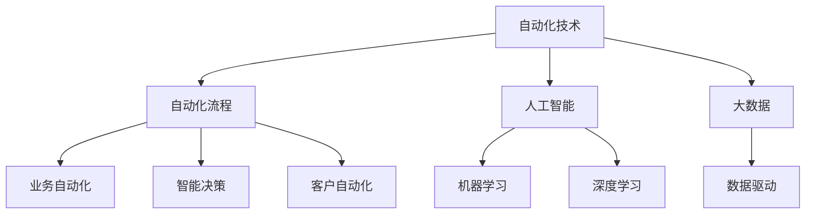

                 

# 自动化创业：未来商业的新范式

## 1. 背景介绍

### 1.1 问题由来
随着科技的飞速发展，自动化技术已经成为推动经济发展和社会进步的重要力量。从工业自动化到家庭自动化，再到服务自动化，自动化技术的渗透无处不在。然而，自动化不仅仅局限于生产流程的自动化，更是一种全新的商业运作模式，即自动化创业。

自动化创业是指通过引入自动化技术，改变传统商业模式和经营方式，实现业务自动化、智能化和高效化，从而降低成本、提升效率、增强竞争力的创业活动。自动化创业不仅涉及到技术创新，更是一种跨学科、跨行业的综合性应用，涉及计算机科学、人工智能、经济学、管理学等多个领域。

### 1.2 问题核心关键点
自动化创业的核心在于通过自动化技术，优化和再造企业的运营流程，提高资源利用效率，提升服务质量和客户满意度，从而实现业务创新和价值提升。自动化创业的核心关键点包括：

1. **技术集成与整合**：将多种自动化技术集成到一个系统中，实现多模态数据的融合和处理。
2. **业务流程优化**：通过分析业务流程，找出瓶颈和冗余，重新设计优化业务流程，提升业务效率。
3. **数据驱动决策**：利用大数据分析和机器学习技术，优化决策过程，提高决策的准确性和效率。
4. **智能客户服务**：通过自动化聊天机器人、智能客服系统等，提供24/7的客户支持，提升客户满意度。
5. **自动化生产与制造**：通过自动化设备和机器人，实现生产过程的自动化和智能化，提高生产效率和产品质量。

### 1.3 问题研究意义
自动化创业不仅是技术革新的产物，更是商业模式的创新。通过自动化创业，企业可以实现转型升级，提升市场竞争力，满足消费者不断变化的需求，同时也能推动经济增长和社会进步。

1. **提升生产效率**：自动化技术能够大大提高生产效率，减少人工操作带来的误差和成本。
2. **优化资源配置**：通过数据分析，优化资源配置，提高资源利用效率。
3. **增强客户体验**：自动化技术能够提供更为精准、个性化的客户服务，提升客户满意度。
4. **降低运营成本**：自动化技术可以替代部分人工，降低人力成本，提高经济效益。
5. **推动技术创新**：自动化创业带动了技术创新，促进了新技术和新产品的研发。

## 2. 核心概念与联系

### 2.1 核心概念概述

自动化创业涉及多个核心概念，这些概念共同构成了自动化创业的框架体系。

- **自动化技术**：指利用自动化设备、系统或软件，代替或辅助人工完成特定任务的技术。
- **自动化流程**：指通过自动化技术，对业务流程进行优化和再造，实现流程自动化和智能化。
- **业务自动化**：指将业务流程、决策和运营等活动自动化，提升效率和准确性。
- **智能决策**：指通过数据分析和机器学习技术，实现自动化决策，提升决策效率和质量。
- **客户自动化**：指通过自动化技术，提供智能化、个性化的客户服务和支持。

这些核心概念之间的逻辑关系可以通过以下Mermaid流程图来展示：



这个流程图展示出自动化创业的核心概念及其之间的关系：

1. 自动化技术是基础，是实现自动化流程和业务自动化的手段。
2. 自动化流程是自动化技术的应用，是对业务流程的优化和再造。
3. 业务自动化和智能决策是自动化流程的两个重要组成部分，分别关注运营和决策。
4. 客户自动化则是自动化流程的重要延伸，关注客户服务和支持。
5. 人工智能、机器学习和深度学习是自动化技术的核心技术，提供算法和算力支持。
6. 大数据和数据驱动是自动化流程的重要数据基础，提供数据支撑。

## 3. 核心算法原理 & 具体操作步骤
### 3.1 算法原理概述

自动化创业的算法原理主要包括业务流程优化、数据驱动决策和智能客户服务等几个方面。

### 3.2 算法步骤详解

#### 3.2.1 业务流程优化
1. **流程分析**：对现有业务流程进行分析，找出瓶颈和冗余，确定优化目标。
2. **流程设计**：根据优化目标，设计新的业务流程。
3. **流程实现**：将新的业务流程转化为可执行的自动化系统，包括软件系统、硬件设备和操作规范等。
4. **流程监控**：对自动化流程进行监控和评估，及时发现问题并进行调整。

#### 3.2.2 数据驱动决策
1. **数据收集**：从业务系统中收集相关的数据，包括生产数据、销售数据、客户数据等。
2. **数据处理**：对收集的数据进行清洗、整理和分析，生成有价值的数据集。
3. **模型训练**：使用机器学习和深度学习模型，对数据集进行训练，得到预测模型。
4. **决策应用**：将训练好的模型应用于实际业务决策中，实现自动化决策。

#### 3.2.3 智能客户服务
1. **需求分析**：对客户需求进行分析，确定自动化客户服务的目标和功能。
2. **系统设计**：设计自动化客户服务系统，包括聊天机器人、智能客服等。
3. **系统实现**：将自动化客户服务系统实现并部署。
4. **用户反馈**：收集用户反馈，对系统进行优化和改进。

### 3.3 算法优缺点

自动化创业的算法具有以下优点：

1. **提高效率**：通过自动化流程，可以大大提高业务效率，减少人工操作带来的误差和成本。
2. **优化决策**：数据驱动决策可以提高决策的准确性和效率，避免主观偏见。
3. **提升服务**：智能客户服务可以提供更为精准、个性化的客户服务，提升客户满意度。
4. **降低成本**：自动化技术可以替代部分人工，降低人力成本，提高经济效益。

但自动化创业的算法也存在一些缺点：

1. **初始成本高**：自动化系统的开发和部署需要较高的初始成本，包括技术开发和硬件设备等。
2. **技术复杂**：自动化系统的实现涉及多种技术和工具，需要专业的技术团队支持。
3. **数据质量要求高**：数据驱动决策需要高质量的数据，数据清洗和预处理的工作量大。
4. **用户适应期长**：部分用户可能对自动化系统存在适应期，需要时间进行培训和引导。

### 3.4 算法应用领域

自动化创业的算法已经在多个领域得到了应用，包括：

- **制造业**：通过自动化生产线和机器人，实现生产过程的自动化和智能化，提高生产效率和产品质量。
- **服务业**：通过自动化客服系统和聊天机器人，提供24/7的客户支持，提升客户满意度。
- **金融业**：通过自动化风险评估和智能投顾系统，优化投资决策，提升服务质量。
- **物流业**：通过自动化仓储和配送系统，优化物流流程，提高配送效率和准确性。
- **医疗健康**：通过自动化诊断和治疗系统，提高医疗服务效率，提升患者满意度。

除了这些领域外，自动化创业的算法还将在更多行业得到应用，为各行各业带来新的发展机遇。

## 4. 数学模型和公式 & 详细讲解
### 4.1 数学模型构建

自动化创业的数学模型主要涉及数据处理、机器学习和深度学习等方面。

以制造业为例，假设有n个生产数据点 $(x_1, y_1), (x_2, y_2), ..., (x_n, y_n)$，其中 $x_i$ 为输入变量，$y_i$ 为输出变量。通过回归分析，建立预测模型：

$$
y = f(x; \theta)
$$

其中 $f(x; \theta)$ 为预测函数，$\theta$ 为模型参数。

### 4.2 公式推导过程

以线性回归模型为例，其预测函数为：

$$
f(x; \theta) = \theta_0 + \theta_1 x_1 + \theta_2 x_2 + ... + \theta_n x_n
$$

给定训练数据集 $D=\{(x_i, y_i)\}_{i=1}^n$，通过最小二乘法求解 $\theta$：

$$
\theta = (X^TX)^{-1}X^Ty
$$

其中 $X = [1, x_1, x_2, ..., x_n]$ 为输入变量矩阵，$y = [y_1, y_2, ..., y_n]$ 为输出变量向量。

### 4.3 案例分析与讲解

以制造业自动化为例，假设某生产线每天生产n个产品，每个产品的质量由多个因素决定，如原材料、加工工艺、设备状态等。通过数据收集和分析，得到如下线性回归模型：

$$
\hat{y} = 1 + 0.2x_1 + 0.3x_2 - 0.5x_3 + 0.1x_4
$$

其中 $x_1, x_2, x_3, x_4$ 分别为原材料、加工工艺、设备状态和生产线状态等变量，$\hat{y}$ 为预测的产品质量。

通过对该模型进行训练和验证，可以优化生产流程，提高产品质量和生产效率。

## 5. 项目实践：代码实例和详细解释说明
### 5.1 开发环境搭建

自动化创业的项目开发环境搭建需要考虑到技术栈的选择和资源配置。以下是使用Python进行自动化创业开发的环境配置流程：

1. **选择编程语言和技术栈**：通常使用Python作为编程语言，搭配TensorFlow、PyTorch、Keras等深度学习框架，以及Pandas、NumPy等数据处理库。
2. **安装Python环境**：使用Anaconda或Miniconda等工具安装Python环境，确保支持最新的深度学习框架和库。
3. **配置环境变量**：设置环境变量，配置好路径、依赖包等。
4. **安装相关库**：使用pip或conda安装所需的Python库，如TensorFlow、Pandas、NumPy等。

### 5.2 源代码详细实现

以下是一个使用TensorFlow实现线性回归模型的Python代码：

```python
import tensorflow as tf
import numpy as np
import pandas as pd

# 准备数据
data = pd.read_csv('data.csv')
X = data.iloc[:, :-1].values
y = data.iloc[:, -1].values

# 划分训练集和测试集
X_train, X_test, y_train, y_test = train_test_split(X, y, test_size=0.2, random_state=42)

# 定义模型
model = tf.keras.Sequential([
    tf.keras.layers.Dense(units=1, input_shape=(X_train.shape[1],))
])

# 编译模型
model.compile(optimizer=tf.keras.optimizers.Adam(learning_rate=0.01), loss='mean_squared_error')

# 训练模型
model.fit(X_train, y_train, epochs=100, batch_size=32, validation_data=(X_test, y_test))

# 测试模型
y_pred = model.predict(X_test)
```

### 5.3 代码解读与分析

以上代码实现了一个简单的线性回归模型，步骤如下：

1. **数据准备**：使用Pandas读取CSV文件，准备训练集和测试集。
2. **模型定义**：使用TensorFlow定义线性回归模型，输入维度为X_train.shape[1]。
3. **模型编译**：使用Adam优化器和均方误差损失函数编译模型。
4. **模型训练**：使用训练集和测试集进行模型训练，设置100个epochs，批大小为32。
5. **模型测试**：使用测试集对模型进行测试，输出预测结果。

## 6. 实际应用场景
### 6.1 智能制造

在智能制造领域，自动化创业已经得到了广泛应用。通过引入自动化技术，制造业实现了生产过程的自动化和智能化，大幅提高了生产效率和产品质量。

以工业机器人为例，通过自动化生产线，实现零件的自动抓取、加工、组装和检测等，提高了生产效率和精确度。同时，通过机器视觉技术，实现对产品质量的实时监测和检测，保证了产品质量。

### 6.2 智慧物流

智慧物流是自动化创业的重要应用领域之一。通过引入自动化技术，物流业实现了仓储和配送过程的自动化和智能化，提升了配送效率和准确性。

以智能仓储系统为例，通过自动化仓储和配送系统，实现了货物自动进出库、货物定位和拣选等，提高了仓储效率和准确性。同时，通过智能调度系统，优化了物流配送路线和运输资源，减少了运输成本和延误。

### 6.3 智能客服

智能客服是自动化创业在服务业的重要应用之一。通过引入自动化技术，服务行业实现了客户服务的自动化和智能化，提升了客户满意度和服务效率。

以智能客服系统为例，通过自动化聊天机器人和智能客服系统，实现24/7的客户支持，提高了客户服务效率和满意度。同时，通过自然语言处理和机器学习技术，实现了智能问答和情感分析，提升了客户互动体验。

### 6.4 未来应用展望

自动化创业的未来应用前景广阔，预计将在更多领域得到广泛应用，带来颠覆性变革：

1. **智能农业**：通过自动化技术，实现农业生产过程的自动化和智能化，提高农业生产效率和产量。
2. **智能医疗**：通过自动化诊断和治疗系统，提升医疗服务效率和质量，提供个性化医疗服务。
3. **智能交通**：通过自动化交通管理系统，实现交通流量的优化和调控，减少交通拥堵和事故。
4. **智能城市**：通过自动化智能城市管理系统，实现城市管理的智能化和高效化，提升城市治理水平。
5. **智能教育**：通过自动化教育系统，实现个性化教育和智能化评估，提升教育质量和学习效率。

## 7. 工具和资源推荐
### 7.1 学习资源推荐

为了帮助开发者掌握自动化创业的相关技术，以下是一些推荐的学习资源：

1. **Coursera《机器学习》课程**：由斯坦福大学开设，深入讲解机器学习和深度学习的基本概念和算法。
2. **edX《人工智能基础》课程**：由麻省理工学院开设，涵盖人工智能的基本原理和应用。
3. **Udacity《深度学习》课程**：由深度学习领域的专家开设，详细讲解深度学习的理论和实践。
4. **《深度学习》书籍**：由Ian Goodfellow等作者编写，全面介绍了深度学习的原理和应用。
5. **《Python深度学习》书籍**：由François Chollet编写，介绍了TensorFlow和Keras的使用方法和实践案例。

### 7.2 开发工具推荐

自动化创业的开发需要依赖多种工具和技术，以下是一些推荐的工具：

1. **Python编程语言**：Python是自动化创业开发的主流编程语言，具有丰富的库和工具支持。
2. **TensorFlow和PyTorch**：TensorFlow和PyTorch是目前最流行的深度学习框架，具有丰富的算法和模型支持。
3. **Pandas和NumPy**：Pandas和NumPy是常用的数据处理库，具有高效的数据处理和分析能力。
4. **Jupyter Notebook**：Jupyter Notebook是一种交互式编程环境，方便开发和调试。
5. **Git和GitHub**：Git和GitHub是版本控制和代码托管工具，方便团队协作和版本管理。

### 7.3 相关论文推荐

自动化创业的研究涉及多个学科，以下是一些推荐的相关论文：

1. **《工业4.0的智能制造》论文**：介绍了智能制造的原理和应用，提出了智能制造的架构和模型。
2. **《智能物流系统的设计与实现》论文**：详细介绍了智能物流系统的设计和实现方法，包括仓储、配送和调度等。
3. **《智能客服系统的设计与实现》论文**：介绍了智能客服系统的设计和实现方法，包括自然语言处理和机器学习技术。
4. **《深度学习在智慧城市中的应用》论文**：介绍了深度学习在智慧城市中的应用，包括交通、医疗和教育等领域。

## 8. 总结：未来发展趋势与挑战

### 8.1 总结

自动化创业是未来商业的新范式，通过引入自动化技术，改变传统商业模式和运营方式，提升业务效率和客户满意度，实现创新和价值提升。自动化创业的核心在于自动化技术的应用和优化，涉及到数据驱动决策和智能客户服务等多个方面。

### 8.2 未来发展趋势

自动化创业的未来发展趋势主要包括以下几个方面：

1. **技术创新**：自动化技术将不断创新，推动自动化创业的进一步发展。
2. **业务转型**：越来越多的企业将采用自动化创业模式，实现业务转型升级。
3. **全球化应用**：自动化创业将扩展到全球市场，推动全球经济增长和社会进步。
4. **融合应用**：自动化创业将与其他技术如物联网、大数据、区块链等进行深度融合，实现跨领域创新。
5. **智能治理**：自动化创业将应用于城市管理、社会治理等多个领域，提升治理水平和效率。

### 8.3 面临的挑战

自动化创业在发展过程中面临诸多挑战：

1. **技术复杂性**：自动化创业涉及多种技术和工具，需要专业团队进行开发和维护。
2. **数据安全**：自动化创业需要大量数据支持，如何保障数据安全和隐私保护是一个重要问题。
3. **成本高昂**：自动化系统的开发和部署需要较高的初始成本，对于一些中小企业可能存在成本压力。
4. **用户适应期**：部分用户可能对自动化系统存在适应期，需要时间进行培训和引导。
5. **法律合规**：自动化创业涉及多个领域，需要遵守不同领域的法律法规，存在一定的合规风险。

### 8.4 研究展望

自动化创业的研究展望主要包括以下几个方向：

1. **技术优化**：开发更加高效、稳定的自动化技术，降低成本，提高用户体验。
2. **应用拓展**：将自动化创业应用于更多领域，推动更多行业的创新和发展。
3. **跨学科融合**：与其他学科如管理学、经济学、社会学等进行深度融合，实现跨领域创新。
4. **智能治理**：通过自动化创业推动智能治理的实现，提升治理水平和效率。
5. **伦理与合规**：在自动化创业的开发和应用过程中，考虑伦理和合规问题，保障社会公平和公正。

总之，自动化创业作为未来商业的新范式，将为各行各业带来颠覆性变革。通过技术创新和业务转型，推动自动化创业的应用和发展，将为人类社会的进步和繁荣贡献力量。

---

作者：禅与计算机程序设计艺术 / Zen and the Art of Computer Programming

