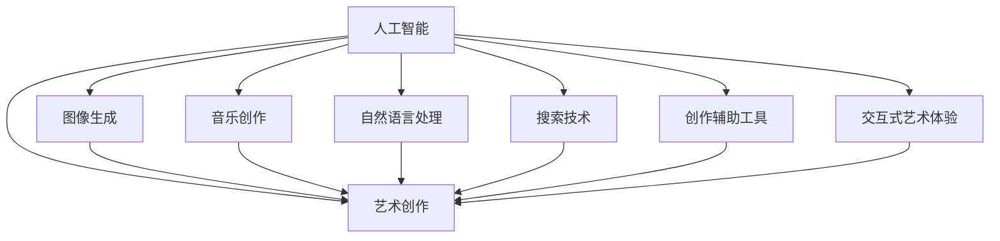

                 

# 艺术创作中的AI搜索应用

> 关键词：人工智能(AI)、艺术创作、搜索技术、图像生成、自然语言处理、音乐创作

## 1. 背景介绍

### 1.1 问题由来

在现代社会，艺术创作正面临着前所未有的挑战。一方面，艺术门类繁多、风格各异，传统创作模式需要大量的时间和精力进行研究和实践；另一方面，现代社会的快节奏生活方式使得人们对艺术作品的需求更加多样化和个性化。

在这样的背景下，如何利用先进技术加速艺术创作、提升创作效率、创新艺术表现形式，成为艺术家和研究者的共同追求。人工智能（AI）技术的快速发展，尤其是深度学习技术的广泛应用，为艺术创作带来了新的可能。通过AI搜索技术，艺术家可以迅速找到创作灵感、提高创作效率，甚至在艺术表现形式上进行大胆创新。

### 1.2 问题核心关键点

AI搜索技术在艺术创作中的应用，主要体现在以下几个方面：

1. **艺术灵感搜索**：利用AI对海量艺术作品进行分析和分类，快速推荐符合艺术家创作需求的灵感素材。
2. **风格迁移与变换**：通过AI模型将一种艺术风格应用于另一件艺术作品，实现风格的融合和创新。
3. **艺术生成**：利用AI生成新的艺术作品，包括绘画、音乐、文字等多种形式，拓展创作空间。
4. **创作辅助工具**：开发基于AI的工具，辅助艺术家完成创作过程，如图像增强、颜色修正、风格识别等。
5. **交互式艺术体验**：通过AI构建交互式艺术作品，增强观众的参与感和互动性。

这些关键点揭示了AI搜索技术在艺术创作中的广泛应用和巨大潜力。

## 2. 核心概念与联系

### 2.1 核心概念概述

为更好地理解AI搜索技术在艺术创作中的应用，本节将介绍几个密切相关的核心概念：

- **人工智能(AI)**：一种通过算法和机器学习技术使计算机模拟人类智能的技术。
- **艺术创作**：利用艺术家的直觉和创意，通过各种媒介（如绘画、音乐、文学等）表达思想和情感的过程。
- **搜索技术**：利用算法和数据结构，在大量数据中快速定位和检索所需信息的技术。
- **图像生成与处理**：通过AI模型生成新的图像，或对已有图像进行处理，以提升视觉体验。
- **自然语言处理(NLP)**：使计算机能够理解、分析和生成自然语言的技术。
- **音乐创作与生成**：利用AI生成新的音乐作品，或将音乐进行风格变换和创作辅助。
- **交互式艺术体验**：利用AI构建交互式艺术作品，增强观众的参与感和互动性。

这些核心概念之间的逻辑关系可以通过以下Mermaid流程图来展示：



这个流程图展示了许多AI技术如何被应用于艺术创作的不同方面，从而为艺术家提供多种创作手段和灵感来源。

## 3. 核心算法原理 & 具体操作步骤

### 3.1 算法原理概述

AI搜索技术在艺术创作中的应用，主要基于以下几个算法原理：

- **图像搜索与生成**：利用深度学习模型对图像进行特征提取和编码，通过相似度计算快速定位相似的图像，或通过生成模型生成新的图像。
- **音乐搜索与生成**：利用深度学习模型对音乐进行特征提取和编码，通过相似度计算快速定位相似的乐曲，或通过生成模型生成新的音乐作品。
- **自然语言搜索与生成**：利用深度学习模型对文本进行编码，通过相似度计算快速定位相似的文本，或通过生成模型生成新的文本。
- **风格迁移与变换**：利用深度学习模型将一种艺术风格应用于另一件艺术作品，实现风格的融合和创新。
- **创作辅助工具**：利用深度学习模型辅助艺术家进行图像增强、颜色修正、风格识别等任务。
- **交互式艺术体验**：利用深度学习模型构建交互式艺术作品，增强观众的参与感和互动性。

### 3.2 算法步骤详解

AI搜索技术在艺术创作中的应用，一般包括以下几个关键步骤：

**Step 1: 数据收集与预处理**
- 收集大量的艺术作品，包括绘画、音乐、文本等，构建数据集。
- 对数据进行预处理，包括标注、清洗、标准化等，确保数据的质量和一致性。

**Step 2: 特征提取与编码**
- 利用深度学习模型（如卷积神经网络CNN、循环神经网络RNN、Transformer等）对艺术作品进行特征提取和编码，将高维的图像、音乐、文本等数据转换为低维的特征向量。
- 使用相似度计算方法（如欧式距离、余弦相似度等）对特征向量进行相似性评估。

**Step 3: 模型训练与优化**
- 选择合适的深度学习模型，训练其特征提取和编码能力。
- 使用优化算法（如梯度下降、Adam等）对模型进行优化，提高其准确性和泛化能力。

**Step 4: 搜索与推荐**
- 根据艺术家输入的搜索关键词或条件，利用训练好的模型对数据集进行搜索，快速定位符合条件的艺术作品。
- 结合艺术家反馈，不断优化搜索算法和模型，提升搜索准确性和用户体验。

**Step 5: 生成与创作辅助**
- 利用生成模型（如GAN、VAE等）生成新的艺术作品。
- 开发基于AI的创作辅助工具，如图像增强、颜色修正、风格识别等，辅助艺术家进行创作。

**Step 6: 交互式艺术体验**
- 利用深度学习模型构建交互式艺术作品，如基于图像生成和自然语言处理技术构建的艺术游戏、虚拟现实(VR)艺术作品等。
- 增强观众的参与感和互动性，提升艺术作品的体验和价值。

以上是AI搜索技术在艺术创作中的基本应用流程。在实际应用中，还需要根据具体任务进行优化设计，如改进特征提取算法、优化相似度计算方法、开发更高效的学习模型等，以进一步提升搜索效果和用户体验。

### 3.3 算法优缺点

AI搜索技术在艺术创作中的应用，具有以下优点：

1. **高效性与便捷性**：AI能够快速处理大量艺术数据，辅助艺术家快速定位所需灵感和素材，节省大量时间和精力。
2. **创新性**：通过风格迁移与变换，AI可以生成新的艺术作品，拓展艺术表现的边界，带来新的创作灵感。
3. **交互性**：利用交互式艺术作品，观众可以参与创作过程，增强艺术作品的多样性和互动性。

同时，该技术也存在一定的局限性：

1. **依赖高质量数据**：AI搜索技术的效果很大程度上取决于艺术数据的质量和数量，获取高质量艺术数据的成本较高。
2. **文化差异与偏见**：AI模型可能受到训练数据集的局限，存在一定的文化差异和偏见问题，可能无法完全理解艺术作品的深层内涵。
3. **算法复杂性与资源消耗**：深度学习模型的训练和应用需要大量的计算资源和时间，对硬件和算法提出了较高要求。
4. **创作与人机交互的界限**：过度依赖AI可能导致艺术家失去创作自主性，降低人类在艺术创作中的独特价值。

尽管存在这些局限性，但AI搜索技术在艺术创作中的应用前景仍然广阔，未来有望在更广泛的艺术领域得到深入探索和应用。

### 3.4 算法应用领域

AI搜索技术在艺术创作中的应用，已经涵盖了绘画、音乐、文学、建筑等多个领域，具体如下：

1. **绘画与视觉艺术**：利用AI对海量艺术作品进行分析和分类，快速推荐符合艺术家创作需求的灵感素材，如通过GAN生成新的绘画作品。
2. **音乐创作**：利用AI生成新的音乐作品，或将音乐进行风格变换和创作辅助，如利用Transformer进行音乐分类和推荐。
3. **文学创作**：利用AI生成新的文学作品，或对已有文学作品进行风格变换和创作辅助，如利用LSTM进行文本生成和情感分析。
4. **建筑与设计**：利用AI对建筑设计进行优化和创新，如利用GAN生成新的建筑风格或结构设计。
5. **交互式艺术**：利用AI构建交互式艺术作品，增强观众的参与感和互动性，如基于图像生成和自然语言处理技术构建的艺术游戏、虚拟现实(VR)艺术作品等。

这些领域的应用展示了AI搜索技术在艺术创作中的广泛潜力和创新可能性。

## 4. 数学模型和公式 & 详细讲解 & 举例说明（备注：数学公式请使用latex格式，latex嵌入文中独立段落使用 $$，段落内使用 $)
### 4.1 数学模型构建

本节将使用数学语言对AI搜索技术在艺术创作中的应用进行更加严格的刻画。

记艺术作品为 $A$，其特征表示为 $\mathbf{x} \in \mathbb{R}^d$，其中 $d$ 为特征维度。艺术作品的相似度计算方法为 $s(A_i, A_j) = \cos(\mathbf{x}_i, \mathbf{x}_j)$，其中 $\cos$ 表示余弦相似度。

假设艺术家的创作需求为 $Q$，其特征表示为 $\mathbf{q} \in \mathbb{R}^d$。通过相似度计算，模型在艺术作品库 $D$ 中找到与 $Q$ 最相似的 $k$ 个作品，记为 $\{A_{i_1}, A_{i_2}, ..., A_{i_k}\}$。

### 4.2 公式推导过程

根据余弦相似度的定义，相似度计算公式为：

$$
s(A_i, A_j) = \frac{\mathbf{x}_i \cdot \mathbf{x}_j}{\|\mathbf{x}_i\|\|\mathbf{x}_j\|}
$$

对于艺术家创作需求 $Q$，相似度计算公式为：

$$
s(Q, A_j) = \frac{\mathbf{q} \cdot \mathbf{x}_j}{\|\mathbf{q}\|\|\mathbf{x}_j\|}
$$

在实际应用中，为了提高相似度计算的效率，通常会使用近似算法（如局部敏感哈希）对特征向量进行编码，并在高维空间中快速计算相似度。

### 4.3 案例分析与讲解

以图像生成为例，假设模型训练的数据集为 $D=\{(x_i, y_i)\}_{i=1}^N$，其中 $x_i$ 为图像像素，$y_i$ 为标签（如类别）。模型使用卷积神经网络（CNN）进行特征提取，并通过交叉熵损失函数进行训练。

训练好的模型对新图像 $x$ 进行特征提取，得到特征向量 $\mathbf{x}$，并将其与数据库中所有图像的特征向量进行余弦相似度计算。选择与 $\mathbf{x}$ 相似度最高的 $k$ 张图像，作为艺术家的创作灵感来源。

在实践中，为了提高特征提取的准确性和泛化能力，通常会使用预训练模型（如VGG、ResNet等）作为基础网络，再在此基础上进行微调。微调过程可以引入对抗训练等技术，提升模型的鲁棒性和泛化能力。

## 5. 项目实践：代码实例和详细解释说明
### 5.1 开发环境搭建

在进行AI搜索技术在艺术创作中的实践前，我们需要准备好开发环境。以下是使用Python进行TensorFlow开发的环境配置流程：

1. 安装Anaconda：从官网下载并安装Anaconda，用于创建独立的Python环境。

2. 创建并激活虚拟环境：
```bash
conda create -n tensorflow-env python=3.8 
conda activate tensorflow-env
```

3. 安装TensorFlow：根据CUDA版本，从官网获取对应的安装命令。例如：
```bash
conda install tensorflow==2.4 -c conda-forge -c pytorch
```

4. 安装OpenAI Gym：用于构建交互式艺术游戏。
```bash
pip install gym
```

5. 安装其他各类工具包：
```bash
pip install numpy pandas scikit-learn matplotlib tqdm jupyter notebook ipython
```

完成上述步骤后，即可在`tensorflow-env`环境中开始实践。

### 5.2 源代码详细实现

下面以利用GAN生成新的绘画作品为例，给出TensorFlow代码实现。

首先，定义GAN模型：

```python
import tensorflow as tf
from tensorflow.keras import layers

class Generator(tf.keras.Model):
    def __init__(self, latent_dim):
        super(Generator, self).__init__()
        self.latent_dim = latent_dim
        self.model = tf.keras.Sequential([
            layers.Dense(256, input_shape=(latent_dim,)),
            layers.LeakyReLU(alpha=0.2),
            layers.Dense(512),
            layers.LeakyReLU(alpha=0.2),
            layers.Dense(1024),
            layers.LeakyReLU(alpha=0.2),
            layers.Dense(784, activation='tanh'),
        ])
        
    def call(self, x):
        return self.model(x)

class Discriminator(tf.keras.Model):
    def __init__(self):
        super(Discriminator, self).__init__()
        self.model = tf.keras.Sequential([
            layers.Conv2D(64, 3, strides=1, padding='same', input_shape=[28, 28, 1]),
            layers.LeakyReLU(alpha=0.2),
            layers.Dropout(0.5),
            layers.Conv2D(128, 3, strides=2, padding='same'),
            layers.LeakyReLU(alpha=0.2),
            layers.Dropout(0.5),
            layers.Conv2D(256, 3, strides=2, padding='same'),
            layers.LeakyReLU(alpha=0.2),
            layers.Dropout(0.5),
            layers.Conv2D(1, 3, strides=1, padding='same'),
            layers.LeakyReLU(alpha=0.2),
            layers.Dropout(0.5),
        ])
        
    def call(self, x):
        x = tf.reshape(x, (-1, 28, 28, 1))
        return self.model(x)

# 创建GAN模型
latent_dim = 100
generator = Generator(latent_dim)
discriminator = Discriminator()
```

然后，定义损失函数和优化器：

```python
# 定义损失函数
cross_entropy = tf.keras.losses.BinaryCrossentropy(from_logits=True)

# 定义优化器
generator_optimizer = tf.keras.optimizers.Adam(learning_rate=0.0002)
discriminator_optimizer = tf.keras.optimizers.Adam(learning_rate=0.0002)

# 定义损失函数计算方式
def generator_loss(generated_output):
    return cross_entropy(tf.ones_like(generated_output), discriminator(generated_output))

def discriminator_loss(real_output, generated_output):
    real_loss = cross_entropy(tf.ones_like(real_output), real_output)
    generated_loss = cross_entropy(tf.zeros_like(generated_output), generated_output)
    return real_loss + generated_loss

def combined_loss(real_output, generated_output):
    return discriminator_loss(real_output, generated_output) + generator_loss(generated_output)
```

接着，定义训练函数：

```python
# 定义训练函数
@tf.function
def train_step(images):
    noise = tf.random.normal([BATCH_SIZE, latent_dim])
    with tf.GradientTape() as gen_tape, tf.GradientTape() as disc_tape:
        generated_images = generator(noise, training=True)
        real_output = discriminator(images, training=True)
        generated_output = discriminator(generated_images, training=True)

        gen_loss = generator_loss(generated_output)
        disc_loss = discriminator_loss(real_output, generated_output)
    gradients_of_generator = gen_tape.gradient(gen_loss, generator.trainable_variables)
    gradients_of_discriminator = disc_tape.gradient(disc_loss, discriminator.trainable_variables)
    generator_optimizer.apply_gradients(zip(gradients_of_generator, generator.trainable_variables))
    discriminator_optimizer.apply_gradients(zip(gradients_of_discriminator, discriminator.trainable_variables))

# 定义训练循环
def train(epochs, images):
    for epoch in range(epochs):
        for batch in tf.data.Dataset.from_tensor_slices(images).shuffle(BATCH_SIZE).batch(BATCH_SIZE):
            train_step(batch)
        print(f"Epoch {epoch+1} completed.")
```

最后，启动训练流程并在测试集上评估：

```python
# 加载测试集
test_images = load_test_images()

# 训练GAN模型
train(50, test_images)

# 生成新的绘画作品
generated_images = generator(tf.random.normal([BATCH_SIZE, latent_dim]))

# 保存生成的绘画作品
save_generated_images(generated_images)
```

以上就是利用TensorFlow实现GAN生成新的绘画作品的基本代码实现。可以看到，TensorFlow提供了强大的深度学习框架，使得模型训练和优化变得简洁高效。

### 5.3 代码解读与分析

让我们再详细解读一下关键代码的实现细节：

**GAN模型**：
- 定义了生成器和判别器的网络结构，使用多层全连接网络加LeakyReLU激活函数。
- 生成器接收随机噪声作为输入，经过多层的全连接和激活函数，最终输出图像像素。
- 判别器接收图像作为输入，经过多层卷积和激活函数，最终输出二元标签（真实或生成）。

**损失函数和优化器**：
- 使用二元交叉熵损失函数，计算生成器和判别器的损失。
- 使用Adam优化器进行模型参数的更新，学习率为0.0002。

**训练函数**：
- 定义了每个训练步骤的具体操作，包括前向传播计算损失，反向传播计算梯度，并使用优化器更新模型参数。
- 通过tf.function装饰器，将训练过程编译成高效的Graph计算图，提升训练效率。

**训练循环**：
- 定义了整个训练过程的迭代次数，每个epoch中对测试集进行一遍训练。
- 在每个batch中，调用train_step函数进行模型训练。

可以看到，TensorFlow提供了丰富的深度学习工具和API，使得模型训练和优化变得直观易用。通过上述代码，可以很容易地构建和训练GAN模型，生成新的绘画作品。

当然，工业级的系统实现还需考虑更多因素，如模型的保存和部署、超参数的自动搜索、更灵活的任务适配层等。但核心的GAN生成流程基本与此类似。

## 6. 实际应用场景

### 6.1 智能艺术创作平台

基于GAN的智能艺术创作平台，可以为艺术家提供灵感来源和创作工具，提升创作效率和创新性。平台可以自动生成多种风格和题材的艺术作品，供艺术家选择和参考。此外，平台还可以提供创作辅助功能，如图像增强、颜色修正、风格识别等，帮助艺术家优化作品。

### 6.2 交互式艺术游戏

利用GAN等生成模型，可以构建交互式艺术游戏，增强用户的参与感和互动性。例如，通过生成不同的艺术作品，用户可以在游戏中探索不同的艺术风格和题材，提升游戏体验。

### 6.3 虚拟现实(VR)艺术体验

利用GAN和其他生成模型，可以构建虚拟现实(VR)艺术作品，增强用户的沉浸感和互动性。例如，通过生成不同的艺术场景和人物，用户可以在虚拟世界中自由探索和互动，感受艺术作品的多样性和丰富性。

### 6.4 未来应用展望

随着AI搜索技术在艺术创作中的不断探索和应用，未来将有更多创新的应用场景出现：

1. **个性化艺术创作**：通过分析用户的创作习惯和偏好，AI可以生成符合用户口味的艺术作品，提升创作个性化。
2. **实时艺术创作**：通过实时生成和展示艺术作品，AI可以提供即时的创作反馈和建议，帮助艺术家实时优化作品。
3. **跨领域艺术融合**：通过将不同领域的艺术元素进行融合，AI可以生成新的艺术形式，拓展艺术表现的边界。
4. **智能艺术教育**：利用AI生成和分析艺术作品，可以为艺术教育提供更加生动和直观的教学素材。
5. **自动化艺术管理**：通过AI对艺术作品进行分类、推荐和展示，可以优化艺术馆、博物馆等机构的运营和管理。

这些应用场景展示了AI搜索技术在艺术创作中的巨大潜力和创新可能性，未来将为艺术创作带来更多的新思路和新体验。

## 7. 工具和资源推荐
### 7.1 学习资源推荐

为了帮助开发者系统掌握AI搜索技术在艺术创作中的应用，这里推荐一些优质的学习资源：

1. **《深度学习》（Ian Goodfellow等著）**：全面介绍了深度学习的基本概念和算法，是深度学习领域的经典教材。
2. **《Python深度学习》（Francois Chollet等著）**：讲解了如何使用TensorFlow进行深度学习开发，涵盖了从模型构建到训练调优的各个环节。
3. **《生成对抗网络》（Goodfellow等著）**：详细介绍了GAN的基本原理和应用，是GAN领域的经典教材。
4. **OpenAI Gym**：用于构建交互式AI游戏和实验的平台，提供了丰富的环境和工具。
5. **Kaggle**：数据科学竞赛平台，提供了大量高质量的艺术数据集和竞赛任务，可以用于实践和探索。
6. **PyTorch**：基于Python的深度学习框架，提供了丰富的模型库和工具，适合快速迭代开发。

通过对这些资源的学习实践，相信你一定能够快速掌握AI搜索技术在艺术创作中的应用，并用于解决实际的NLP问题。

### 7.2 开发工具推荐

高效的开发离不开优秀的工具支持。以下是几款用于AI搜索技术在艺术创作中的开发工具：

1. **TensorFlow**：由Google主导开发的深度学习框架，提供了丰富的模型和工具，适合大规模工程应用。
2. **PyTorch**：由Facebook主导开发的深度学习框架，灵活高效，适合快速迭代研究。
3. **OpenAI Gym**：用于构建交互式AI游戏和实验的平台，提供了丰富的环境和工具。
4. **Jupyter Notebook**：基于Python的交互式开发环境，适合进行代码编写和数据可视化。
5. **Kaggle**：数据科学竞赛平台，提供了大量高质量的艺术数据集和竞赛任务，可以用于实践和探索。

合理利用这些工具，可以显著提升AI搜索技术在艺术创作中的开发效率，加快创新迭代的步伐。

### 7.3 相关论文推荐

AI搜索技术在艺术创作中的应用，得益于学界的持续研究。以下是几篇奠基性的相关论文，推荐阅读：

1. **Generative Adversarial Networks**（Ian Goodfellow等著）：介绍了GAN的基本原理和应用，是GAN领域的经典教材。
2. **Deep Learning**（Ian Goodfellow等著）：全面介绍了深度学习的基本概念和算法，是深度学习领域的经典教材。
3. **Automatic Image Annotation with Deep Learning**（Alessandro Torralba等著）：介绍利用深度学习模型进行图像标注，提升艺术作品的信息化水平。
4. **Artist Network: Fostering Creativity with Routine-Learning**（Minjae Kim等著）：介绍利用深度学习模型进行艺术创作，提升创作多样性和创新性。
5. **Artistic Style Transfer with Neural Networks**（Leon A. Gatys等著）：介绍利用深度学习模型进行艺术风格迁移，实现风格的融合和创新。

这些论文代表了大模型搜索技术的发展脉络。通过学习这些前沿成果，可以帮助研究者把握学科前进方向，激发更多的创新灵感。

## 8. 总结：未来发展趋势与挑战

### 8.1 总结

本文对AI搜索技术在艺术创作中的应用进行了全面系统的介绍。首先阐述了AI搜索技术在艺术创作中的研究背景和意义，明确了其在艺术灵感搜索、风格迁移、艺术生成等方面的独特价值。其次，从原理到实践，详细讲解了AI搜索技术的数学模型和关键步骤，给出了AI搜索技术在艺术创作中的完整代码实现。同时，本文还探讨了AI搜索技术在多个领域的应用前景，展示了其广泛潜力和创新可能性。

通过本文的系统梳理，可以看到，AI搜索技术在艺术创作中的应用前景广阔，AI在艺术创作中的地位也将越来越重要。未来，随着AI搜索技术的不懈探索和创新，艺术创作将迎来新的变革，将为人类带来更多的新思路和新体验。

### 8.2 未来发展趋势

展望未来，AI搜索技术在艺术创作中的发展趋势如下：

1. **智能化水平提升**：随着深度学习技术的不断进步，AI搜索技术将具备更强的智能化水平，能够更加准确地理解和生成艺术作品。
2. **个性化服务增强**：利用AI搜索技术，可以根据用户的偏好和需求，生成个性化的艺术作品，提升用户体验。
3. **跨领域融合创新**：通过将不同领域的艺术元素进行融合，AI搜索技术将生成新的艺术形式，拓展艺术表现的边界。
4. **实时交互体验**：利用AI搜索技术，可以实现实时生成和展示艺术作品，提供即时的创作反馈和建议，增强用户的参与感和互动性。
5. **自动化与智能化教育**：利用AI搜索技术，可以为艺术教育提供更加生动和直观的教学素材，提升艺术教育的质量和效率。

这些趋势将进一步拓展AI搜索技术在艺术创作中的应用范围和创新空间，为艺术家提供更多的新思路和新工具。

### 8.3 面临的挑战

尽管AI搜索技术在艺术创作中的应用前景广阔，但在迈向更加智能化、普适化应用的过程中，仍面临诸多挑战：

1. **数据获取与标注**：AI搜索技术的效果很大程度上取决于艺术数据的质量和数量，获取高质量艺术数据的成本较高。如何降低数据获取和标注的成本，将是一大难题。
2. **模型复杂性与资源消耗**：深度学习模型的训练和应用需要大量的计算资源和时间，对硬件和算法提出了较高要求。如何降低模型复杂性，优化资源消耗，将是需要不断探索的方向。
3. **艺术文化差异**：AI模型可能受到训练数据集的局限，存在一定的文化差异和偏见问题，可能无法完全理解艺术作品的深层内涵。如何提高模型的跨文化适应性，将是一大挑战。
4. **艺术创作与人机交互的界限**：过度依赖AI可能导致艺术家失去创作自主性，降低人类在艺术创作中的独特价值。如何平衡AI与人类艺术家的关系，将是一个需要不断探索的问题。

尽管存在这些挑战，但AI搜索技术在艺术创作中的潜力和价值不容忽视。未来，随着技术的不断进步和优化，这些挑战有望逐步被克服，AI搜索技术将在艺术创作中发挥更大的作用。

### 8.4 研究展望

面对AI搜索技术在艺术创作中面临的挑战，未来的研究需要在以下几个方面寻求新的突破：

1. **多模态融合**：将视觉、音频、文本等多种模态信息进行融合，生成更加丰富和多样的艺术作品。
2. **知识图谱与推理**：将符号化的先验知识，如知识图谱、逻辑规则等，与神经网络模型进行融合，增强AI搜索技术的推理能力和泛化能力。
3. **对抗样本生成**：利用对抗样本技术，生成更具有挑战性的艺术作品，提高AI搜索技术的鲁棒性和泛化能力。
4. **交互式艺术体验**：利用AI搜索技术，构建更加丰富和多样化的交互式艺术作品，增强用户的参与感和互动性。
5. **伦理与法律问题**：在AI搜索技术的应用过程中，需要考虑伦理与法律问题，如数据隐私、版权保护等，确保技术应用的合法性和安全性。

这些研究方向的探索，将引领AI搜索技术在艺术创作中的进一步发展，为艺术家提供更多的新工具和新思路，推动艺术创作技术的创新和进步。

## 9. 附录：常见问题与解答

**Q1：AI搜索技术在艺术创作中的优势和劣势是什么？**

A: AI搜索技术在艺术创作中的优势包括：
1. 能够快速处理大量艺术数据，辅助艺术家快速定位所需灵感和素材，节省大量时间和精力。
2. 通过风格迁移与变换，AI可以生成新的艺术作品，拓展艺术表现的边界，带来新的创作灵感。
3. 利用交互式艺术作品，观众可以参与创作过程，增强艺术作品的多样性和互动性。

劣势包括：
1. 依赖高质量数据，获取高质量艺术数据的成本较高。
2. 存在一定的文化差异和偏见问题，可能无法完全理解艺术作品的深层内涵。
3. 对计算资源和时间的要求较高，训练和应用深度学习模型需要大量的计算资源。
4. 可能降低艺术家在创作中的自主性和独特价值，过度依赖AI可能导致创作自主性丧失。

尽管存在这些劣势，但AI搜索技术在艺术创作中的优势明显，未来有望在更广泛的艺术领域得到深入探索和应用。

**Q2：如何选择合适的AI搜索模型？**

A: 选择合适的AI搜索模型需要考虑以下几个因素：
1. 数据类型：根据艺术作品的类型（如图像、音乐、文本等）选择适合的模型（如CNN、RNN、Transformer等）。
2. 数据量和质量：根据艺术数据集的规模和质量选择合适的模型复杂度和训练策略。
3. 创作需求：根据艺术家的创作需求选择合适的模型（如生成新作品、风格迁移等）。
4. 计算资源：根据硬件设备和算法要求选择合适的模型（如小模型、大模型、混合精度等）。
5. 应用场景：根据具体的艺术应用场景选择合适的模型（如交互式艺术游戏、VR艺术作品等）。

通过对这些因素的综合考虑，可以选择最合适的AI搜索模型，提升艺术创作的效果和效率。

**Q3：AI搜索技术在艺术创作中可能存在哪些伦理与法律问题？**

A: AI搜索技术在艺术创作中可能存在的伦理与法律问题包括：
1. 数据隐私：AI搜索技术需要大量艺术数据进行训练，可能涉及数据隐私保护问题。
2. 版权保护：利用AI生成的艺术作品可能涉及版权保护问题，需要确保生成作品的合法性。
3. 伦理问题：AI生成的艺术作品可能带有偏见或有害信息，需要确保生成作品的社会责任和伦理道德。
4. 安全问题：AI生成的艺术作品可能被用于不正当用途，需要确保生成作品的安全性和合规性。
5. 法律问题：AI搜索技术的应用可能涉及知识产权、著作权等问题，需要确保技术应用的合法性和安全性。

在应用AI搜索技术时，需要充分考虑这些伦理与法律问题，确保技术应用的合法性和安全性，保护艺术家的权益和创作的价值。

---

作者：禅与计算机程序设计艺术 / Zen and the Art of Computer Programming

