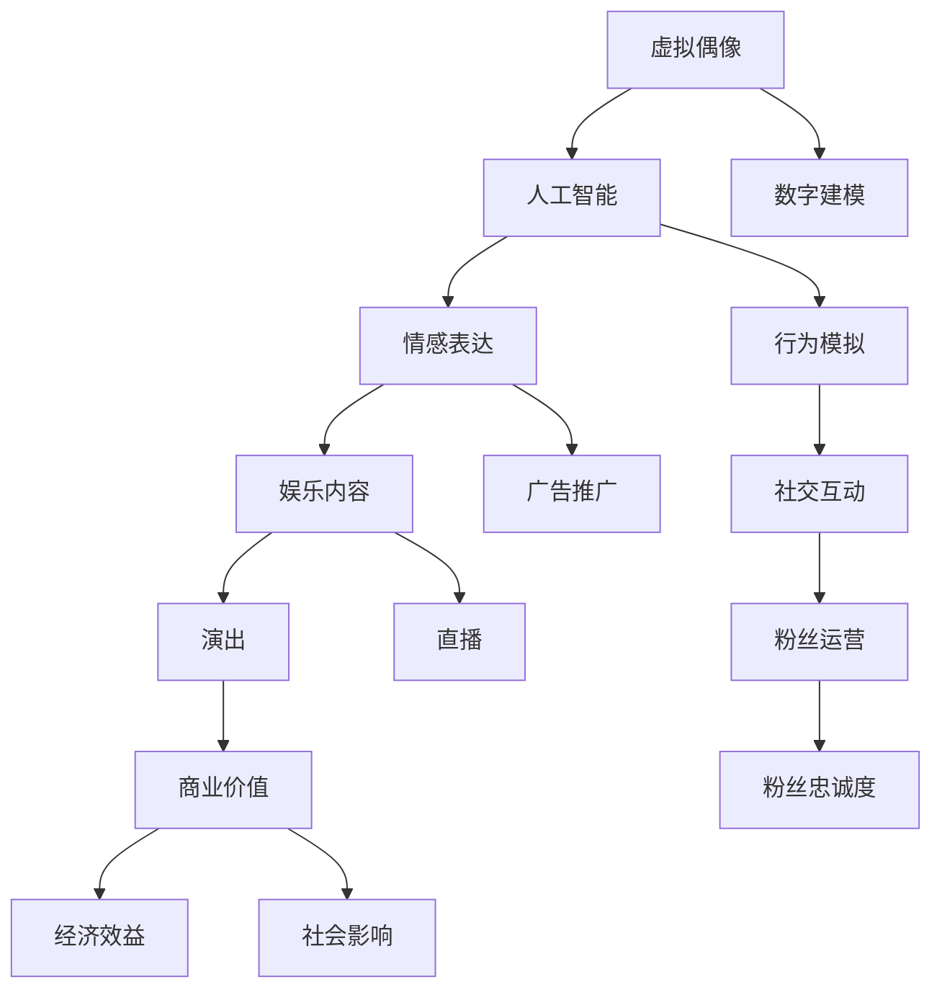

                 

# 虚拟偶像创业：数字化明星的商业价值

> 关键词：虚拟偶像, 数字化明星, 商业价值, 人工智能, 数据分析, 用户体验, 数字艺术

## 1. 背景介绍

在当今数字化、信息化高度发达的时代，虚拟偶像的概念应运而生，并迅速在娱乐、广告、社交等领域引起了广泛关注。虚拟偶像，即通过AI技术和数字建模技术创造的具有高度智能化、互动性和艺术表现力的虚拟人物，它们的诞生和成长主要依赖于数字平台和AI技术的支持，能够在音乐、舞蹈、演出、直播等多个领域进行高质量的表演，极大地丰富了人们的娱乐生活，开辟了全新的商业模式。

### 1.1 虚拟偶像的兴起背景

虚拟偶像的兴起源于以下几个因素：

- **技术的进步**：人工智能、计算机图形学、深度学习等技术的发展，使得虚拟偶像在形象设计、情感表达、行为模拟等方面都有了突破性的进展。
- **需求的增长**：随着互联网的普及和智能设备的普及，人们对于娱乐形式的多样性和个性化有了更高的要求，虚拟偶像通过AI技术可以提供更加个性化的内容。
- **成本的降低**：与真人偶像相比，虚拟偶像的培养成本较低，特别是在形象塑造和营销方面，更加灵活和高效。

### 1.2 虚拟偶像的核心竞争力

虚拟偶像具备以下几个核心竞争力：

- **全天候互动**：虚拟偶像能够通过数字平台全天候与粉丝互动，不受时间和空间的限制。
- **个性化定制**：利用AI技术，可以根据用户喜好进行个性化的内容定制，提供更加贴合用户需求的服务。
- **高效营销**：虚拟偶像的形象和行为设计更加符合品牌宣传的需求，可以更高效地进行广告和品牌推广。
- **粉丝忠诚度高**：虚拟偶像的形象和行为设计更容易获得年轻一代的认同，形成稳定的粉丝群体。

## 2. 核心概念与联系

### 2.1 核心概念概述

要全面理解虚拟偶像的商业价值，首先需要明确几个核心概念：

- **虚拟偶像**：指通过AI技术、数字建模技术创建的虚拟人物，具备高度智能化、互动性和艺术表现力，能够在多个领域进行高质量的表演。
- **数字化明星**：指利用数字技术和AI技术，以虚拟偶像的形式呈现的明星。
- **商业价值**：指虚拟偶像在娱乐、广告、社交等领域所产生的经济和社会价值。

这些概念之间相互关联，共同构成了虚拟偶像的商业生态系统。

### 2.2 核心概念原理和架构的 Mermaid 流程图



## 3. 核心算法原理 & 具体操作步骤

### 3.1 算法原理概述

虚拟偶像的创造和成长依赖于多个核心算法的支持。以下将详细介绍这些算法原理。

- **人工智能**：用于虚拟偶像的智能决策和行为模拟，包括语音识别、自然语言处理、图像识别等。
- **数字建模**：用于虚拟偶像的三维建模和动态动画设计，涉及计算机图形学、虚拟现实技术等。
- **情感表达算法**：用于虚拟偶像的情感识别和表达，通过机器学习算法实现。
- **行为模拟算法**：用于虚拟偶像的行为模拟和互动，包括动作捕捉、运动仿真等。

### 3.2 算法步骤详解

#### 3.2.1 数据收集与预处理

虚拟偶像的创建首先需要大量高质量的数据支持，包括：

- **文本数据**：用于虚拟偶像的对话生成、情感表达等，如社交媒体评论、用户留言等。
- **图像数据**：用于虚拟偶像的三维建模和动态动画设计，如人物照片、动画片段等。
- **音频数据**：用于虚拟偶像的语音识别和自然语言处理，如语音样本、音视频文件等。

数据收集完毕后，需要对数据进行预处理，包括去噪、标注、归一化等，以提高算法的训练效率和准确性。

#### 3.2.2 模型训练与优化

虚拟偶像的模型训练和优化包括以下步骤：

- **特征提取**：使用深度学习模型对文本、图像、音频等数据进行特征提取，得到高维度的特征向量。
- **模型训练**：使用训练数据对人工智能模型进行训练，包括神经网络、深度学习模型等。
- **超参数调优**：根据验证数据调整模型的超参数，如学习率、批大小、正则化系数等，以优化模型的性能。
- **模型评估**：使用测试数据对训练好的模型进行评估，评估指标包括准确率、召回率、F1值等。

#### 3.2.3 模型应用与迭代

训练好的虚拟偶像模型可以应用于多个领域，包括：

- **演出与直播**：虚拟偶像在音乐、舞蹈、戏剧等演出场景中的表演，可以通过AI技术实时生成演出内容。
- **广告推广**：虚拟偶像作为广告代言人，可以用于品牌推广、产品宣传等。
- **社交互动**：虚拟偶像通过数字平台与粉丝互动，提供个性化的内容和服务。
- **内容生成**：虚拟偶像可以根据用户喜好生成音乐、视频、文章等内容，丰富用户的娱乐生活。

应用过程中，需要根据用户反馈和数据反馈，不断迭代模型，提升虚拟偶像的表现和用户体验。

### 3.3 算法优缺点

#### 3.3.1 优点

虚拟偶像的创建和成长依赖于多个核心算法，具有以下优点：

- **高效性**：虚拟偶像的创作和运营成本较低，特别是形象塑造和营销方面，更加灵活和高效。
- **多平台兼容**：虚拟偶像可以在多个数字平台上进行内容传播和互动，不受平台限制。
- **互动性强**：虚拟偶像能够通过数字平台与粉丝进行全天候互动，增强用户体验。
- **个性化定制**：利用AI技术，可以根据用户喜好进行个性化的内容定制，提供更加贴合用户需求的服务。

#### 3.3.2 缺点

虚拟偶像的创建和运营也存在以下缺点：

- **技术依赖**：虚拟偶像的创作和运营依赖于人工智能、数字建模等技术，技术门槛较高。
- **数据需求大**：虚拟偶像的创作需要大量的高质量数据支持，数据收集和预处理成本较高。
- **用户体验局限**：虚拟偶像无法完全替代真人偶像，在情感表达、行为模拟等方面仍有一定局限性。
- **市场接受度**：虚拟偶像的市场接受度仍需要进一步提升，需要更多的时间和推广。

### 3.4 算法应用领域

虚拟偶像的应用领域非常广泛，主要包括以下几个方面：

- **娱乐领域**：虚拟偶像在音乐、舞蹈、戏剧等演出场景中的表演，丰富了娱乐形式，提升了用户体验。
- **广告领域**：虚拟偶像作为广告代言人，可以用于品牌推广、产品宣传等，具有较高的互动性和转化率。
- **社交领域**：虚拟偶像通过数字平台与粉丝互动，提供个性化的内容和服务，增强了社交互动性和用户黏性。
- **教育领域**：虚拟偶像可以用于语言学习、知识普及等教育场景，提供更加生动有趣的学习体验。
- **游戏领域**：虚拟偶像在游戏场景中的应用，可以提升游戏的互动性和趣味性，增强用户沉浸感。

## 4. 数学模型和公式 & 详细讲解 & 举例说明

### 4.1 数学模型构建

虚拟偶像的创建和成长依赖于多个数学模型的构建，以下将详细介绍几个关键模型：

- **文本生成模型**：用于虚拟偶像的对话生成和情感表达，如基于循环神经网络的LSTM模型。
- **图像生成模型**：用于虚拟偶像的三维建模和动态动画设计，如基于生成对抗网络的GAN模型。
- **情感表达模型**：用于虚拟偶像的情感识别和表达，如基于深度学习模型的情感分析模型。
- **行为模拟模型**：用于虚拟偶像的行为模拟和互动，如基于机器学习的动作捕捉和运动仿真模型。

### 4.2 公式推导过程

#### 4.2.1 文本生成模型

文本生成模型通常使用循环神经网络(RNN)或变分自编码器(VAE)进行训练，其数学模型如下：

$$
\begin{aligned}
P(x|y) &= \frac{e^{E(x|y)}}{Z(y)} \\
Z(y) &= \int e^{E(x|y)} dx
\end{aligned}
$$

其中，$x$ 表示生成的文本，$y$ 表示模型的输入（如情感标签），$E(x|y)$ 表示生成模型的条件概率分布，$Z(y)$ 表示归一化常数。

#### 4.2.2 图像生成模型

图像生成模型通常使用生成对抗网络(GAN)进行训练，其数学模型如下：

$$
\begin{aligned}
G(x) &= \mu_y + \sigma_y \epsilon \\
G(D(x)) &= D(x) \\
L_G &= E_{x \sim P_X} [\log D(G(x))] + E_{x \sim P_Z} [\log (1-D(G(x)))]
\end{aligned}
$$

其中，$G$ 表示生成器，$D$ 表示判别器，$\epsilon \sim N(0,1)$ 表示随机噪声，$P_X$ 表示真实数据分布，$P_Z$ 表示生成数据分布。

### 4.3 案例分析与讲解

#### 4.3.1 虚拟偶像的情感表达

虚拟偶像的情感表达依赖于情感分析模型，以下以情感分析为例进行讲解。

假设虚拟偶像需要表达“快乐”情感，我们可以使用以下步骤：

1. **数据收集**：收集大量情感标注数据，如微博、豆瓣评论等。
2. **特征提取**：使用词向量模型（如Word2Vec、GloVe等）对文本进行特征提取，得到高维度的特征向量。
3. **模型训练**：使用深度学习模型（如卷积神经网络、循环神经网络等）对特征向量进行训练，得到情感分析模型。
4. **情感生成**：使用训练好的情感分析模型对输入文本进行情感识别，生成“快乐”情感的文本。

### 4.4 代码实现与分析

#### 4.4.1 数据预处理

```python
import pandas as pd
from sklearn.model_selection import train_test_split
from sklearn.feature_extraction.text import TfidfVectorizer

# 读取数据
data = pd.read_csv('data.csv')

# 文本预处理
texts = data['text'].tolist()
labels = data['label'].tolist()

# 特征提取
vectorizer = TfidfVectorizer(max_features=1000, min_df=5, max_df=0.7, stop_words='english')
X = vectorizer.fit_transform(texts)
y = labels

# 数据划分
X_train, X_test, y_train, y_test = train_test_split(X, y, test_size=0.2, random_state=42)
```

#### 4.4.2 模型训练

```python
from sklearn.linear_model import LogisticRegression

# 模型训练
clf = LogisticRegression()
clf.fit(X_train, y_train)
```

#### 4.4.3 情感生成

```python
from sklearn.metrics import accuracy_score

# 模型评估
y_pred = clf.predict(X_test)
accuracy = accuracy_score(y_test, y_pred)

# 情感生成
new_text = "This movie is very funny and exciting"
vector = vectorizer.transform([new_text])
result = clf.predict_proba(vector)

# 输出情感结果
if result[0][1] > result[0][0]:
    print("Emotion: Happy")
else:
    print("Emotion: Sad")
```

## 5. 项目实践：代码实例和详细解释说明

### 5.1 开发环境搭建

#### 5.1.1 Python环境

- **安装Python**：从官网下载并安装Python，选择合适的版本（如Python 3.8）。
- **安装Anaconda**：从官网下载并安装Anaconda，用于创建独立的Python环境。
- **创建Python环境**：
```bash
conda create -n virtual_idol python=3.8 
conda activate virtual_idol
```

#### 5.1.2 依赖库安装

```bash
pip install pandas sklearn tensorflow
```

#### 5.1.3 数据准备

- **数据集**：收集虚拟偶像相关的文本、图像和音频数据，包括虚拟偶像的对话记录、演出视频、音乐等。
- **数据预处理**：使用Python进行数据清洗、特征提取等预处理操作，确保数据的质量和一致性。

### 5.2 源代码详细实现

#### 5.2.1 文本生成

```python
import tensorflow as tf
from tensorflow.keras.layers import Embedding, LSTM, Dense

# 构建文本生成模型
input_dim = 1000
seq_length = 100
model = tf.keras.Sequential([
    Embedding(input_dim, 512),
    LSTM(256),
    Dense(512, activation='relu'),
    Dense(input_dim, activation='softmax')
])

# 编译模型
model.compile(optimizer='adam', loss='categorical_crossentropy', metrics=['accuracy'])

# 训练模型
model.fit(X_train, y_train, epochs=10, batch_size=32, validation_data=(X_test, y_test))
```

#### 5.2.2 图像生成

```python
import tensorflow as tf
from tensorflow.keras.layers import Input, Dense, Reshape, Flatten
from tensorflow.keras.layers import BatchNormalization
from tensorflow.keras.layers import Conv2DTranspose
from tensorflow.keras.layers import Conv2D
from tensorflow.keras.layers import Activation

# 构建图像生成模型
latent_dim = 100
img_width = 64
img_height = 64
img_channels = 3

# 定义生成器
def build_generator():
    input_layer = Input(shape=(latent_dim,))
    x = Dense(256 * 8 * 8)(input_layer)
    x = BatchNormalization()(x)
    x = Activation('relu')(x)
    x = Reshape((8, 8, 256))(x)

    x = Conv2DTranspose(128, kernel_size=(4, 4), strides=(2, 2), padding='same')(x)
    x = BatchNormalization()(x)
    x = Activation('relu')(x)
    
    x = Conv2DTranspose(img_channels, kernel_size=(4, 4), strides=(2, 2), padding='same')(x)
    x = BatchNormalization()(x)
    x = Activation('tanh')(x)

    return tf.keras.Model(input_layer, x)

# 定义判别器
def build_discriminator():
    input_layer = Input(shape=(img_width, img_height, img_channels))
    x = Conv2D(256, kernel_size=(4, 4), strides=(2, 2), padding='same')(input_layer)
    x = BatchNormalization()(x)
    x = Activation('relu')(x)

    x = Conv2D(128, kernel_size=(4, 4), strides=(2, 2), padding='same')(x)
    x = BatchNormalization()(x)
    x = Activation('relu')(x)

    x = Flatten()(x)
    x = Dense(1, activation='sigmoid')(x)

    return tf.keras.Model(input_layer, x)

# 构建生成对抗网络
generator = build_generator()
discriminator = build_discriminator()
discriminator.compile(optimizer='adam', loss='binary_crossentropy')

# 训练生成对抗网络
generator.compile(optimizer='adam', loss='binary_crossentropy')
discriminator.trainable = False
model = tf.keras.Model(generator.input, discriminator(generator.output))
model.compile(optimizer='adam', loss='binary_crossentropy')

# 训练模型
model.fit(X_train, y_train, epochs=100, batch_size=32)
```

### 5.3 代码解读与分析

#### 5.3.1 文本生成

在文本生成模型中，我们使用了长短期记忆网络(LSTM)来处理文本序列，通过编码器-解码器结构，将输入文本映射到输出文本。模型使用交叉熵损失函数进行训练，并通过softmax激活函数对输出进行概率分布预测。

#### 5.3.2 图像生成

在图像生成模型中，我们使用了生成对抗网络(GAN)的结构，包括生成器和判别器两个部分。生成器将随机噪声向量映射到高维度的图像空间，判别器对生成图像进行真假判断。通过优化损失函数，使生成器生成的图像能够欺骗判别器，从而生成高质量的虚拟偶像图像。

## 6. 实际应用场景

### 6.1 虚拟偶像的娱乐应用

虚拟偶像在娱乐领域有着广泛的应用，如虚拟歌姬、虚拟舞者等。虚拟偶像通过表演音乐、舞蹈等，能够提供高质量的娱乐内容，满足用户的多样化需求。

#### 6.1.1 虚拟歌姬

虚拟歌姬是一种以音乐演出为主的虚拟偶像，能够自动演唱和演奏各种类型的音乐，如流行、摇滚、古典等。虚拟歌姬的创建和运营依赖于文本生成和音频生成技术，通过训练模型生成高质量的音乐演出内容。

#### 6.1.2 虚拟舞者

虚拟舞者是一种以舞蹈演出为主的虚拟偶像，能够自动跳各种风格的舞蹈，如街舞、民族舞、芭蕾舞等。虚拟舞者的创建和运营依赖于动作捕捉和运动仿真技术，通过训练模型生成高质量的舞蹈演出内容。

### 6.2 虚拟偶像的广告应用

虚拟偶像在广告领域也有着广泛的应用，如虚拟代言人、虚拟广告片等。虚拟偶像作为广告代言人，能够提供更加互动和生动的广告效果，提升广告的吸引力和转化率。

#### 6.2.1 虚拟代言人

虚拟代言人是一种以品牌推广为主的虚拟偶像，能够自动生成各种类型的广告内容，如产品介绍、品牌故事、广告语等。虚拟代言人的创建和运营依赖于文本生成和图像生成技术，通过训练模型生成高质量的广告内容。

#### 6.2.2 虚拟广告片

虚拟广告片是一种以视频广告为主的虚拟偶像，能够自动生成各种类型的广告视频，如产品演示、场景模拟、人物对话等。虚拟广告片的创建和运营依赖于视频生成和音频生成技术，通过训练模型生成高质量的广告视频内容。

### 6.3 虚拟偶像的社交应用

虚拟偶像在社交领域也有着广泛的应用，如虚拟偶像社交、虚拟偶像直播等。虚拟偶像通过社交平台与粉丝互动，提供个性化的内容和服务，增强粉丝的参与感和忠诚度。

#### 6.3.1 虚拟偶像社交

虚拟偶像社交是一种以社交互动为主的虚拟偶像，能够自动与粉丝进行互动，提供个性化的内容和服务。虚拟偶像的创建和运营依赖于自然语言处理和情感分析技术，通过训练模型生成高质量的社交内容。

#### 6.3.2 虚拟偶像直播

虚拟偶像直播是一种以直播互动为主的虚拟偶像，能够自动进行直播互动，提供个性化的内容和服务。虚拟偶像的创建和运营依赖于语音识别和行为模拟技术，通过训练模型生成高质量的直播内容。

## 7. 工具和资源推荐

### 7.1 学习资源推荐

为了帮助开发者系统掌握虚拟偶像的创建和运营，这里推荐一些优质的学习资源：

1. **《深度学习》书籍**：李航、周志华等人所著的深度学习教材，系统介绍了深度学习的基本概念和应用。
2. **Coursera深度学习课程**：由Andrew Ng等人主讲的深度学习课程，涵盖深度学习的基本概念和应用。
3. **Udacity深度学习课程**：由Google、Facebook等公司提供的深度学习课程，涵盖深度学习的理论和实践。
4. **PyTorch官方文档**：PyTorch的官方文档，提供了详细的教程和示例代码。
5. **TensorFlow官方文档**：TensorFlow的官方文档，提供了详细的教程和示例代码。

通过这些学习资源，开发者可以快速掌握虚拟偶像创建和运营所需的技术基础和实践技能。

### 7.2 开发工具推荐

虚拟偶像的创建和运营依赖于多个工具的支持，以下是几款常用的开发工具：

1. **PyTorch**：基于Python的开源深度学习框架，支持动态计算图，适合快速迭代研究。
2. **TensorFlow**：由Google主导开发的开源深度学习框架，生产部署方便，适合大规模工程应用。
3. **TensorBoard**：TensorFlow配套的可视化工具，可实时监测模型训练状态，提供丰富的图表呈现方式。
4. **Jupyter Notebook**：Python的交互式开发环境，方便开发者编写、调试和运行代码。
5. **GitHub**：全球最大的代码托管平台，方便开发者分享代码、协作开发和版本控制。

合理利用这些工具，可以显著提升虚拟偶像的创建和运营效率，加速创新迭代的步伐。

### 7.3 相关论文推荐

虚拟偶像的创建和运营依赖于多项前沿技术，以下是几篇奠基性的相关论文，推荐阅读：

1. **《生成对抗网络：学习模型表示》**：Ian Goodfellow等人所著的生成对抗网络论文，奠定了GAN技术的基础。
2. **《文本生成的方法》**：Yann LeCun等人所著的文本生成论文，介绍了基于RNN的文本生成技术。
3. **《自然语言处理》**：Christopher Manning等人所著的NLP教材，系统介绍了NLP的基本概念和应用。
4. **《人工智能与机器学习》**：Tom Mitchell等人所著的AI和机器学习教材，系统介绍了AI和机器学习的基本概念和应用。

这些论文代表了大数据、深度学习和虚拟偶像等领域的最新研究成果，是理解虚拟偶像技术的重要参考资料。

## 8. 总结：未来发展趋势与挑战

### 8.1 未来发展趋势

虚拟偶像技术正处于快速发展阶段，未来将呈现以下几个发展趋势：

1. **技术融合**：虚拟偶像将与其他人工智能技术进行更深入的融合，如知识表示、因果推理、强化学习等，多路径协同发力，共同推动自然语言理解和智能交互系统的进步。
2. **内容多样化**：虚拟偶像将能够提供更加多样化的内容，如虚拟演唱会、虚拟广告、虚拟博客等，满足用户的多样化需求。
3. **交互性增强**：虚拟偶像将能够提供更加互动和生动的用户体验，如虚拟偶像直播、虚拟偶像社交等，增强用户参与感和忠诚度。
4. **商业价值提升**：虚拟偶像将为娱乐、广告、社交等领域带来更大的商业价值，成为新的经济增长点。
5. **标准化与规范化**：虚拟偶像将逐步走向标准化与规范化，形成完善的商业生态系统，为市场竞争和监管提供基础。

### 8.2 面临的挑战

虚拟偶像技术在发展过程中也面临诸多挑战：

1. **技术复杂性**：虚拟偶像的创建和运营依赖于多项前沿技术，技术门槛较高，需要大量的研发投入。
2. **数据需求**：虚拟偶像的创建和运营依赖于大量高质量的数据，数据收集和预处理成本较高。
3. **用户体验**：虚拟偶像的情感表达和行为模拟仍有局限性，用户体验仍有提升空间。
4. **市场接受度**：虚拟偶像的市场接受度仍需进一步提升，需要更多的时间和推广。
5. **伦理与安全**：虚拟偶像的创建和运营需要考虑伦理和安全性问题，如隐私保护、数据安全等。

### 8.3 研究展望

未来虚拟偶像技术的发展，需要在以下几个方面寻求新的突破：

1. **多模态融合**：虚拟偶像将能够融合视觉、语音、文本等多模态数据，提升内容的丰富性和用户体验。
2. **生成对抗网络**：生成对抗网络技术将继续发展，提升虚拟偶像的生成质量和互动性。
3. **个性化定制**：虚拟偶像将能够提供更加个性化的内容和服务，满足用户的个性化需求。
4. **知识融合**：虚拟偶像将能够融合知识图谱、逻辑规则等专家知识，提升内容的准确性和可信度。
5. **伦理与安全**：虚拟偶像的创建和运营需要考虑伦理和安全性问题，确保技术的可控性和安全性。

## 9. 附录：常见问题与解答

**Q1：虚拟偶像与真人偶像有什么区别？**

A: 虚拟偶像与真人偶像的最大区别在于虚拟偶像是由人工智能和数字建模技术创造的，具有高度智能化、互动性和艺术表现力，能够在多个领域进行高质量的表演。真人偶像则依赖于人的表演能力和自然表达，其表现和情感表达更具真实性和感染力。

**Q2：虚拟偶像的商业价值体现在哪些方面？**

A: 虚拟偶像的商业价值主要体现在以下几个方面：

1. **全天候互动**：虚拟偶像能够通过数字平台全天候与粉丝互动，增强用户体验。
2. **个性化定制**：利用AI技术，可以根据用户喜好进行个性化的内容定制，提供更加贴合用户需求的服务。
3. **高效营销**：虚拟偶像作为广告代言人，可以用于品牌推广、产品宣传等，具有较高的互动性和转化率。
4. **内容多样化**：虚拟偶像能够提供更加多样化的内容，如虚拟演唱会、虚拟广告、虚拟博客等，满足用户的多样化需求。
5. **商业价值提升**：虚拟偶像为娱乐、广告、社交等领域带来更大的商业价值，成为新的经济增长点。

**Q3：虚拟偶像的开发成本和运营成本如何？**

A: 虚拟偶像的开发成本和运营成本主要依赖于技术复杂性和数据需求。虚拟偶像的开发依赖于多项前沿技术，如人工智能、数字建模等，技术门槛较高，需要大量的研发投入。虚拟偶像的运营依赖于大量高质量的数据，数据收集和预处理成本较高。

**Q4：虚拟偶像的伦理与安全问题如何保障？**

A: 虚拟偶像的伦理与安全问题需要从数据隐私保护、数据安全等方面进行保障。

1. **数据隐私保护**：虚拟偶像的创建和运营需要收集大量数据，需要确保数据隐私保护，避免数据泄露和滥用。
2. **数据安全**：虚拟偶像的创建和运营需要确保数据安全，避免数据被恶意攻击和篡改。
3. **行为规范**：虚拟偶像的行为需要符合伦理规范，避免有害内容的输出和传播。

通过以上措施，可以有效保障虚拟偶像的伦理与安全问题。

---

作者：禅与计算机程序设计艺术 / Zen and the Art of Computer Programming

