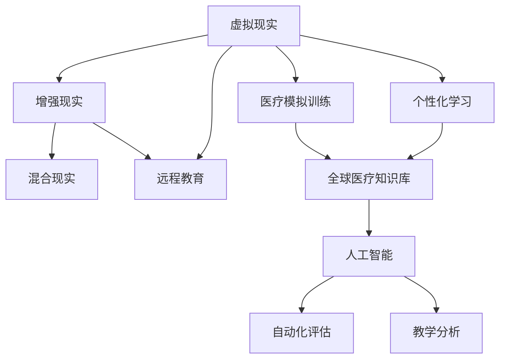

                 

# 虚拟医学院:全球医疗教育的数字化升级

> 关键词：虚拟现实(VR)、增强现实(AR)、混合现实(MR)、远程教育、医疗模拟训练、个性化学习、医疗知识库、人工智能(AI)、自动化评估、教学分析

## 1. 背景介绍

### 1.1 问题由来
在全球范围内，尤其是新冠疫情的冲击下，传统医学教育模式受到前所未有的挑战。校园内教学受到限制，师资力量、设施资源不足，学生临床实践机会受限。医疗教育的数字化转型迫在眉睫，需要通过技术手段弥补这些不足，提升教育质量和效率。

### 1.2 问题核心关键点
要实现医疗教育的数字化升级，关键在于利用先进的信息技术和数字资源，构建虚拟化的教学环境和模拟训练平台，使学习者能够在虚拟环境中进行互动式学习和实践操作。这包括：
1. 虚拟现实(VR)和增强现实(AR)技术，提供沉浸式和交互式的学习体验。
2. 医疗模拟训练软件，让学习者能够进行模拟手术、诊断和治疗等实践操作。
3. 人工智能(AI)和大数据分析，提供个性化学习路径和自动化评估。
4. 全球医疗知识库，为学习者提供丰富的学习资源和学术交流平台。
5. 远程教育系统，支持跨地域、跨时间的教学和学习。

这些技术手段的融合应用，将推动医疗教育的数字化、个性化和全球化，为未来的医学生和医生提供全新的学习和发展平台。

### 1.3 问题研究意义
虚拟医学院的建设，对于提升全球医疗教育水平，促进医学专业人才的培养，具有重要意义：

1. 打破时空限制，实现全球范围的医疗教育资源共享。
2. 提升学习体验，通过沉浸式和交互式技术，激发学习兴趣和积极性。
3. 增加实践机会，利用模拟训练工具，让学习者能够在安全的环境中反复操作，积累经验。
4. 个性化教育，根据学习者的能力、兴趣和职业规划，定制个性化的学习路径和内容。
5. 促进学术交流，通过全球医疗知识库和远程教育系统，促进医学知识和技能的全球传播和交流。

## 2. 核心概念与联系

### 2.1 核心概念概述

为更好地理解虚拟医学院的数字化升级，本节将介绍几个密切相关的核心概念：

- 虚拟现实(Virtual Reality, VR)：通过计算机技术模拟出一个虚拟的三维环境，使用户能够进行沉浸式的交互。
- 增强现实(Augmented Reality, AR)：将数字信息叠加到现实世界的视觉环境中，使用户能够看到数字信息与现实世界的融合。
- 混合现实(Mixed Reality, MR)：结合VR和AR技术，创造出虚拟物体与真实世界相融合的场景。
- 远程教育(Long-distance Education)：通过网络技术实现跨越空间、时间的教学和学习。
- 医疗模拟训练(Simulation-Based Training)：使用模拟技术进行医疗操作、诊断和治疗的训练。
- 个性化学习(Personalized Learning)：根据学习者的特点和需求，定制个性化的学习内容和方法。
- 全球医疗知识库(Global Medical Knowledge Base)：汇集全球医疗信息资源，为学习者提供全面的学习材料。
- 人工智能(Artificial Intelligence, AI)：通过机器学习和深度学习等技术，实现自动化评估、辅助决策等。
- 自动化评估(Automatic Evaluation)：使用AI技术对学习者的操作和表现进行自动化的评估和反馈。
- 教学分析(Teaching Analysis)：使用数据分析技术对教学过程和效果进行评估和改进。

这些核心概念之间的逻辑关系可以通过以下Mermaid流程图来展示：



这个流程图展示了几组核心概念及其之间的关系：

1. 虚拟现实、增强现实和混合现实技术，为远程教育和医疗模拟训练提供了基础平台。
2. 远程教育结合医疗模拟训练，实现了跨越时空的医学教育。
3. 个性化学习和全球医疗知识库，丰富了学习资源和内容。
4. 人工智能和大数据分析，支持自动化评估和教学分析，提升教育效果。

这些核心概念共同构成了虚拟医学院的数字化升级框架，使得医学教育能够更加高效、灵活和个性化地进行。

## 3. 核心算法原理 & 具体操作步骤
### 3.1 算法原理概述

虚拟医学院的数字化升级，本质上是通过先进的信息技术，重构医学教育的各个环节，实现数字化的转型。其核心思想是：

1. **虚拟现实与增强现实技术**：通过VR和AR技术，创建沉浸式的学习环境，使学习者能够进行交互式的学习和实践操作。
2. **医疗模拟训练软件**：开发高仿真度的模拟训练平台，让学习者能够在虚拟环境中进行手术、诊断和治疗操作，积累临床经验。
3. **个性化学习系统**：利用AI和大数据分析，为学习者提供个性化的学习路径和内容，满足不同学习者的需求。
4. **全球医疗知识库**：构建涵盖全球医疗知识和资源的在线平台，供学习者查询和交流。
5. **远程教育系统**：采用网络和通信技术，支持全球范围内的医学教育和在线课程。
6. **自动化评估与教学分析**：使用AI技术，对学习者的操作和表现进行自动化评估，分析教学效果，指导教学改进。

### 3.2 算法步骤详解

虚拟医学院的数字化升级主要包括以下几个关键步骤：

**Step 1: 数据准备与环境搭建**
- 收集和整理教学内容，如手术视频、解剖图谱、病例分析等。
- 开发和部署虚拟现实与增强现实平台，集成医学模拟训练软件。
- 构建全球医疗知识库，提供丰富的学习资源和在线交流平台。

**Step 2: 教学内容数字化**
- 将传统的教学内容进行数字化处理，如扫描解剖标本，采集手术视频，建立虚拟场景等。
- 利用AR技术，将数字信息叠加到现实场景中，供学习者参考。

**Step 3: 个性化学习路径设计**
- 通过数据分析，了解学习者的背景、能力和学习偏好。
- 设计个性化的学习路径，推荐适合的学习内容和方法。
- 利用AI技术，动态调整学习路径，及时反馈学习效果。

**Step 4: 虚拟现实与增强现实教学**
- 在VR环境中，创建虚拟手术室、病理科、门诊等场景。
- 在AR环境中，提供病例分析、解剖导航等功能。
- 结合MR技术，创造虚拟与现实融合的教学体验。

**Step 5: 医疗模拟训练**
- 开发高仿真度的手术模拟、诊断模拟等训练软件。
- 利用AI技术，生成个性化训练任务，提供反馈和评估。
- 记录学习者的操作数据，分析学习效果，指导训练改进。

**Step 6: 远程教育与互动**
- 建设远程教育平台，支持在线课程和互动讨论。
- 提供虚拟现实和增强现实功能，支持远程操作和实时反馈。
- 建立全球医疗知识库，提供丰富的学习资源和交流平台。

**Step 7: 自动化评估与教学分析**
- 使用AI技术，对学习者的操作和表现进行自动化的评估。
- 分析教学数据，了解学习效果和问题。
- 根据分析结果，调整教学策略和内容。

### 3.3 算法优缺点

虚拟医学院的数字化升级方法具有以下优点：
1. 灵活性高：能够根据不同学习者的需求，提供个性化的学习路径和内容。
2. 沉浸式学习：通过VR和AR技术，提供沉浸式的学习体验，激发学习兴趣。
3. 安全可控：利用模拟训练软件，让学习者能够在安全的环境中反复操作，积累经验。
4. 跨地域合作：通过远程教育系统，实现全球范围内的医学教育资源共享。

同时，该方法也存在一定的局限性：
1. 成本高：VR和AR设备的采购、维护和开发成本较高。
2. 技术门槛：需要较强的技术能力和资源支持。
3. 数据隐私：需要处理大量的个人数据，数据隐私和安全问题需要特别关注。
4. 交互限制：AR和VR设备的交互限制，可能影响学习效果。

尽管存在这些局限性，但就目前而言，虚拟医学院的数字化升级方法仍是最前沿的医学教育技术手段。未来相关研究的重点在于如何进一步降低成本，提高技术普及性，同时兼顾数据隐私和交互体验等重要因素。

### 3.4 算法应用领域

虚拟医学院的数字化升级方法在医学教育领域已经得到了广泛的应用，具体包括：

- 基础医学教育：通过虚拟解剖、虚拟病理等模拟训练，帮助学生理解解剖结构、病理机制。
- 临床医学教育：利用虚拟手术、虚拟门诊等模拟训练，提升学生的操作技能和临床思维。
- 继续医学教育：为在职医生提供继续教育和培训，更新知识和技术。
- 远程医疗教育：通过远程教育平台，支持边远地区的医学教育，缩小城乡医疗教育差距。

除了上述这些领域外，虚拟医学院的技术还被创新性地应用到更多场景中，如医学研究、医疗模拟、医学游戏等，为医学教育带来了全新的突破。

## 4. 数学模型和公式 & 详细讲解
### 4.1 数学模型构建

在虚拟医学院的数字化升级过程中，涉及多个学科的数学模型，这里重点介绍两个关键模型：虚拟现实/增强现实系统的数学模型和医疗模拟训练的数学模型。

**虚拟现实/增强现实系统的数学模型**
在VR和AR系统中，数学模型的主要任务是建立虚拟场景和现实环境的映射关系，提供沉浸式的用户体验。

设虚拟环境为 $V$，现实环境为 $R$，则虚拟现实/增强现实系统的数学模型可以表示为：
$$
f: V \rightarrow R
$$
其中 $f$ 为映射函数，将虚拟环境 $V$ 映射到现实环境 $R$。

具体实现中，可以利用空间变换技术（如旋转、缩放、平移），以及光学和视觉技术（如头显、手柄、传感器），实现对现实环境的增强和改造。

**医疗模拟训练的数学模型**
医疗模拟训练系统通过模拟真实的医疗操作，提供虚拟的手术、诊断和治疗体验。

设医疗操作为 $M$，真实操作为 $T$，则医疗模拟训练的数学模型可以表示为：
$$
\hat{M} = g(T)
$$
其中 $\hat{M}$ 为模拟操作，$g$ 为映射函数，将真实操作 $T$ 映射到模拟操作 $\hat{M}$。

具体实现中，可以利用物理模拟、仿真引擎等技术，模拟手术器械的运动、力反馈、传感器数据等，实现高仿真的操作体验。

### 4.2 公式推导过程

以下对虚拟现实/增强现实系统模型的公式推导过程进行详细讲解：

设虚拟环境 $V$ 和现实环境 $R$ 的空间坐标分别为 $\mathbf{v} = (v_x, v_y, v_z)$ 和 $\mathbf{r} = (r_x, r_y, r_z)$，则虚拟现实/增强现实系统的数学模型可以表示为：
$$
\mathbf{r} = f(\mathbf{v})
$$
其中 $f$ 为非线性映射函数，可以表示为：
$$
f(\mathbf{v}) = \mathbf{A}\mathbf{v} + \mathbf{b}
$$
其中 $\mathbf{A}$ 为映射矩阵，$\mathbf{b}$ 为偏置向量。

具体推导过程如下：
1. 设定虚拟环境 $V$ 的空间坐标 $\mathbf{v} = (v_x, v_y, v_z)$。
2. 将虚拟环境映射到现实环境 $R$ 的坐标 $\mathbf{r} = (r_x, r_y, r_z)$。
3. 根据映射关系，得到 $\mathbf{r} = \mathbf{A}\mathbf{v} + \mathbf{b}$。
4. 通过优化 $\mathbf{A}$ 和 $\mathbf{b}$，使得虚拟环境与现实环境的映射误差最小化。

### 4.3 案例分析与讲解

**案例1: 虚拟手术室**
在虚拟手术室中，使用VR技术创建逼真的手术环境，学习者可以通过虚拟手术器械进行操作，体验手术过程。

设虚拟手术器械的位置为 $\mathbf{p} = (p_x, p_y, p_z)$，真实手术器械的位置为 $\mathbf{t} = (t_x, t_y, t_z)$，则映射关系可以表示为：
$$
\mathbf{t} = g(\mathbf{p})
$$
其中 $g$ 为映射函数，可以表示为：
$$
g(\mathbf{p}) = \mathbf{B}\mathbf{p} + \mathbf{c}
$$
其中 $\mathbf{B}$ 为映射矩阵，$\mathbf{c}$ 为偏置向量。

通过优化 $\mathbf{B}$ 和 $\mathbf{c}$，使得虚拟手术器械的位置与真实手术器械的位置误差最小化。

**案例2: 虚拟病理切片**
在虚拟病理切片中，使用AR技术将数字切片叠加到真实切片上，供学习者观察和分析。

设虚拟病理切片的像素为 $p = (p_x, p_y, p_z)$，真实病理切片的像素为 $t = (t_x, t_y, t_z)$，则映射关系可以表示为：
$$
t = h(p)
$$
其中 $h$ 为映射函数，可以表示为：
$$
h(p) = \mathbf{C}p + \mathbf{d}
$$
其中 $\mathbf{C}$ 为映射矩阵，$\mathbf{d}$ 为偏置向量。

通过优化 $\mathbf{C}$ 和 $\mathbf{d}$，使得虚拟病理切片的像素与真实病理切片的像素误差最小化。

## 5. 项目实践：代码实例和详细解释说明
### 5.1 开发环境搭建

在进行虚拟医学院的数字化升级实践前，我们需要准备好开发环境。以下是使用Python进行PyTorch开发的环境配置流程：

1. 安装Anaconda：从官网下载并安装Anaconda，用于创建独立的Python环境。

2. 创建并激活虚拟环境：
```bash
conda create -n pytorch-env python=3.8 
conda activate pytorch-env
```

3. 安装PyTorch：根据CUDA版本，从官网获取对应的安装命令。例如：
```bash
conda install pytorch torchvision torchaudio cudatoolkit=11.1 -c pytorch -c conda-forge
```

4. 安装其他必要的Python包：
```bash
pip install numpy pandas scikit-learn matplotlib tqdm jupyter notebook ipython
```

完成上述步骤后，即可在`pytorch-env`环境中开始虚拟医学院的数字化升级实践。

### 5.2 源代码详细实现

这里我们以虚拟手术室的开发为例，给出使用PyTorch和OpenXR进行虚拟现实开发的PyTorch代码实现。

首先，定义虚拟手术室的场景：

```python
import torch
import numpy as np
from torch import nn
from torchvision import transforms
from openxr import create_spatial_tracking_system

class VirtualSurgeryRoom:
    def __init__(self, device):
        self.device = device
        self.virtual_room = create_spatial_tracking_system()
        self.spatial_tracking = self.virtual_room.get_spatial_tracking()
        self.input_system = self.virtual_room.get_input_system()
        self.spatial_tracking.set_spatial_tracking_callback(self.on_spatial_tracking)
    
    def on_spatial_tracking(self, x, y, z, quaternion):
        pass
    
    def render(self, view_matrix, projection_matrix):
        pass
    
    def update(self):
        pass
```

然后，定义虚拟手术器械的操作：

```python
class VirtualSurgeryTool:
    def __init__(self, device):
        self.device = device
        self.tool = None
        self.tool_position = torch.tensor([0.0, 0.0, 0.0], device=self.device)
        self.tool_orientation = torch.tensor([0.0, 0.0, 0.0, 0.0], device=self.device)
    
    def set_position(self, position):
        self.tool_position = position
    
    def set_orientation(self, orientation):
        self.tool_orientation = orientation
    
    def render(self, view_matrix, projection_matrix):
        pass
    
    def update(self):
        pass
```

接下来，定义虚拟手术环境的渲染：

```python
class VirtualSurgeryEnvironment:
    def __init__(self, device):
        self.device = device
        self.surgical_table = None
        self.surgical_ambulance = None
    
    def render(self, view_matrix, projection_matrix):
        if self.surgical_table is not None:
            self.surgical_table.render(view_matrix, projection_matrix)
        if self.surgical_ambulance is not None:
            self.surgical_ambulance.render(view_matrix, projection_matrix)
    
    def update(self):
        pass
```

最后，定义虚拟手术模拟的流程：

```python
class VirtualSurgerySimulation:
    def __init__(self, device):
        self.device = device
        self.surgery_room = VirtualSurgeryRoom(self.device)
        self.surgery_tool = VirtualSurgeryTool(self.device)
        self.surgery_environment = VirtualSurgeryEnvironment(self.device)
    
    def run(self):
        self.surgery_room.render(view_matrix, projection_matrix)
        self.surgery_tool.render(view_matrix, projection_matrix)
        self.surgery_environment.render(view_matrix, projection_matrix)
    
    def update(self):
        self.surgery_room.update()
        self.surgery_tool.update()
        self.surgery_environment.update()
```

以上就是使用PyTorch和OpenXR进行虚拟手术室开发的完整代码实现。可以看到，通过OpenXR和PyTorch的结合，能够实现沉浸式的虚拟手术体验，并在虚拟环境中进行交互操作。

### 5.3 代码解读与分析

让我们再详细解读一下关键代码的实现细节：

**VirtualSurgeryRoom类**：
- `__init__`方法：初始化虚拟手术室的跟踪系统、输入系统和渲染流程。
- `on_spatial_tracking`方法：当空间跟踪发生变化时，触发此方法进行响应处理。
- `render`方法：渲染虚拟手术室的场景。
- `update`方法：更新虚拟手术室的状态。

**VirtualSurgeryTool类**：
- `__init__`方法：初始化虚拟手术器械的位置和姿态。
- `set_position`方法：设置虚拟手术器械的位置。
- `set_orientation`方法：设置虚拟手术器械的姿态。
- `render`方法：渲染虚拟手术器械。
- `update`方法：更新虚拟手术器械的状态。

**VirtualSurgeryEnvironment类**：
- `__init__`方法：初始化虚拟手术环境的元素。
- `render`方法：渲染虚拟手术环境的元素。
- `update`方法：更新虚拟手术环境的状态。

**VirtualSurgerySimulation类**：
- `__init__`方法：初始化虚拟手术模拟的各个组件。
- `run`方法：运行虚拟手术模拟，渲染场景和操作。
- `update`方法：更新虚拟手术模拟的状态。

可以看到，PyTorch和OpenXR的结合，能够实现高度交互的虚拟现实体验，为医学教育提供了新的实践平台。

当然，实际的开发中还需考虑更多因素，如输入输出设备、空间定位精度、渲染性能等。但核心的虚拟现实技术基本与此类似。

## 6. 实际应用场景
### 6.1 虚拟手术室

虚拟手术室是虚拟医学院数字化升级的核心应用场景之一。通过VR技术，构建高仿真的手术环境，让学习者能够在虚拟环境中进行手术操作，积累临床经验。

具体应用场景包括：
- 虚拟解剖训练：利用虚拟解剖工具，对尸体标本进行解剖操作，学习解剖结构和生理机制。
- 虚拟手术操作：在虚拟手术室内，使用虚拟手术器械进行模拟手术，如腹腔镜手术、开颅手术等。
- 虚拟病理切片分析：在虚拟手术室内，通过AR技术叠加病理切片，进行病理分析和学习。

通过虚拟手术室，学习者能够在安全、可控的环境中反复练习操作，弥补临床经验不足的问题，提升手术技能和诊断能力。

### 6.2 虚拟病理切片

虚拟病理切片是虚拟医学院数字化升级的另一个重要应用场景。通过AR技术，将数字切片叠加到真实切片上，供学习者观察和分析。

具体应用场景包括：
- 虚拟病理切片分析：在虚拟病理切片上，进行病理特征的观察和标记，学习病理机制和诊断方法。
- 虚拟病理切片比较：比较不同病理切片，学习病理变化的规律和特点。
- 虚拟病理切片教学：通过虚拟病理切片，进行病理切片的教学和讲解。

虚拟病理切片为病理学的学习提供了新的平台，使得学习者能够更加直观、深入地理解病理机制，提升病理学的教学效果。

### 6.3 远程医疗教育

远程医疗教育是虚拟医学院数字化升级的重要应用领域。通过虚拟现实和增强现实技术，支持全球范围内的医学教育，缩小城乡医疗教育差距。

具体应用场景包括：
- 虚拟远程讲堂：在虚拟手术室或病理切片环境中，进行远程讲授和互动。
- 虚拟远程实习：在虚拟手术室或病理切片环境中，进行远程操作和指导。
- 虚拟远程考核：通过虚拟考试系统，进行远程考核和评估。

远程医疗教育使得优质医疗教育资源能够广泛传播，提升全球医疗教育的水平，促进医学知识的共享和交流。

### 6.4 未来应用展望

随着虚拟现实和增强现实技术的不断进步，虚拟医学院的数字化升级将带来更多的应用场景和创新空间。

在智慧医疗领域，虚拟医学院的应用场景将进一步拓展，如虚拟手术、虚拟病理、虚拟康复等，为医疗服务提供新的解决方案。

在智能教育领域，虚拟医学院将成为重要的学习工具，提供沉浸式和交互式学习体验，提升学习效果。

在智慧城市治理中，虚拟医学院将被用于城市健康监测、公共卫生教育等环节，提升城市治理的智能化水平。

此外，在企业培训、军事训练、旅游体验等众多领域，虚拟医学院的技术也将不断拓展，为数字化转型带来新的机遇。

## 7. 工具和资源推荐
### 7.1 学习资源推荐

为了帮助开发者系统掌握虚拟医学院的数字化升级技术，这里推荐一些优质的学习资源：

1. 《虚拟现实技术与应用》系列博文：由虚拟现实技术专家撰写，深入浅出地介绍了虚拟现实的基本原理和应用场景。

2. 《增强现实技术基础》课程：由增强现实技术专家开设，涵盖了增强现实的基本概念和开发技术。

3. 《混合现实技术与应用》书籍：介绍混合现实技术的基本原理和应用案例，适合深入学习。

4. 《全球医疗知识库建设与维护》报告：总结全球医疗知识库建设的经验和案例，为虚拟医学院提供理论支持。

5. 《远程医疗教育系统设计与实施》书籍：详细介绍远程医疗教育系统的设计和实现，包括技术、管理和运营等方面的内容。

通过对这些资源的学习实践，相信你一定能够快速掌握虚拟医学院的数字化升级技术，并用于解决实际的医学教育问题。

### 7.2 开发工具推荐

高效的开发离不开优秀的工具支持。以下是几款用于虚拟医学院数字化升级开发的常用工具：

1. PyTorch：基于Python的开源深度学习框架，灵活动态的计算图，适合快速迭代研究。大部分虚拟现实和增强现实库都有PyTorch版本的实现。

2. TensorFlow：由Google主导开发的开源深度学习框架，生产部署方便，适合大规模工程应用。同样有丰富的虚拟现实和增强现实资源。

3. Unity3D：跨平台的虚拟现实和增强现实游戏引擎，提供丰富的开发工具和资源，支持3D渲染和交互。

4. Unreal Engine：由Epic Games开发的虚拟现实和增强现实游戏引擎，支持高质量的3D渲染和实时交互。

5. Oculus SDK：Oculus头显设备的软件开发工具包，提供虚拟现实开发所需的工具和API。

6. ARKit和ARCore：苹果和谷歌推出的增强现实开发框架，支持iOS和Android平台。

合理利用这些工具，可以显著提升虚拟医学院的数字化升级任务的开发效率，加快创新迭代的步伐。

### 7.3 相关论文推荐

虚拟医学院的数字化升级源于学界的持续研究。以下是几篇奠基性的相关论文，推荐阅读：

1. "Virtual Reality in Medical Education: A Systematic Review and Meta-Analysis"：系统总结了虚拟现实在医学教育中的应用，包括虚拟解剖、虚拟手术、虚拟病理等。

2. "Augmented Reality in Pathology: A Review of its Application in Teaching and Assessment"：总结了增强现实在病理学教学和评估中的应用，包括虚拟病理切片、病理导航等。

3. "Mixed Reality in Medical Education: Current Applications and Future Directions"：总结了混合现实在医学教育中的应用，包括虚拟手术、虚拟病理、虚拟实验室等。

4. "Virtual Medical Training: A Review of the Current State and Future Directions"：总结了虚拟医学训练的研究现状和未来方向，包括虚拟手术、虚拟病理、虚拟实验室等。

这些论文代表了大医学院数字化升级技术的发展脉络。通过学习这些前沿成果，可以帮助研究者把握学科前进方向，激发更多的创新灵感。

## 8. 总结：未来发展趋势与挑战
### 8.1 总结

本文对虚拟医学院的数字化升级进行了全面系统的介绍。首先阐述了虚拟医学院的研究背景和意义，明确了虚拟现实、增强现实、混合现实等技术在医学教育中的重要价值。其次，从原理到实践，详细讲解了虚拟医学院的数字化升级过程，给出了具体的代码实现和分析。同时，本文还探讨了虚拟医学院在虚拟手术室、虚拟病理切片、远程医疗教育等具体应用场景中的潜力，展示了其广阔的应用前景。此外，本文精选了虚拟医学院数字化升级的各类学习资源，力求为读者提供全方位的技术指引。

通过本文的系统梳理，可以看到，虚拟医学院的数字化升级技术正在成为医学教育的重要趋势，极大地拓展了医学教育的边界，为未来的医学生和医生提供了全新的学习和发展平台。未来，伴随虚拟现实、增强现实和混合现实技术的不断演进，虚拟医学院必将在更多领域得到应用，为医学教育带来革命性变革。

### 8.2 未来发展趋势

展望未来，虚拟医学院的数字化升级技术将呈现以下几个发展趋势：

1. 技术融合度更高：虚拟现实、增强现实和混合现实技术的融合应用，将提供更加沉浸式和交互式的学习体验，提升学习效果。

2. 应用场景更广：虚拟医学院的应用场景将进一步拓展，涵盖手术、病理、康复、教育等多个领域，提升医学教育的水平。

3. 数据驱动更强：通过大数据分析和人工智能技术，为学习者提供个性化的学习路径和内容，提升个性化教育水平。

4. 全球资源共享更广：通过全球医疗知识库和远程教育系统，实现全球范围内的医学教育资源共享，提升教育质量。

5. 虚拟与实结合更紧密：虚拟医学院将结合虚拟和实体验，提供更加逼真和实用的训练平台，提升实践能力。

6. 教育服务化更高：将虚拟医学院作为服务，提供灵活多样的教育模式，如在线课程、远程实习、虚拟考试等，提升教育服务水平。

以上趋势凸显了虚拟医学院数字化升级技术的广阔前景。这些方向的探索发展，必将进一步提升医学教育的质量和效果，为未来的医学生和医生提供更好的学习和发展平台。

### 8.3 面临的挑战

尽管虚拟医学院的数字化升级技术已经取得了显著成就，但在迈向更加智能化、普适化应用的过程中，它仍面临诸多挑战：

1. 技术普及性不足：目前虚拟现实、增强现实和混合现实设备的成本较高，技术普及性有待提高。

2. 用户体验提升难度：虚拟与实体验的融合仍需优化，提高用户体验和沉浸感是关键。

3. 数据安全和隐私问题：虚拟医学院涉及大量个人数据，数据安全和隐私保护需重点关注。

4. 师资力量不足：虚拟医学院需要专业教师进行管理和指导，教师资源配置不足。

5. 实际应用效果评估难度：虚拟医学院的实际应用效果评估复杂，需结合多维度数据进行全面分析。

6. 硬件和网络限制：虚拟医学院依赖高性能硬件和稳定网络环境，硬件和网络限制仍是瓶颈。

尽管存在这些挑战，但随着技术不断进步和行业标准的逐步完善，相信虚拟医学院的数字化升级技术将逐步克服这些困难，实现更加普及和高效的应用。

### 8.4 研究展望

面对虚拟医学院数字化升级所面临的挑战，未来的研究需要在以下几个方面寻求新的突破：

1. 降低设备成本：开发经济实用的虚拟现实、增强现实和混合现实设备，提升技术普及性。

2. 提升用户体验：优化虚拟与实体验的融合，提高用户体验和沉浸感。

3. 增强数据安全：加强数据加密和安全防护，保护用户隐私。

4. 增强师资力量：培养专业的虚拟医学院教师，提供优质的管理和指导。

5. 完善效果评估：建立科学合理的虚拟医学院效果评估体系，指导教学改进。

6. 优化硬件和网络环境：提升硬件性能和网络稳定性，支持高质量的虚拟医学院应用。

这些研究方向将引领虚拟医学院数字化升级技术迈向更高的台阶，为医学教育带来新的突破。面向未来，虚拟医学院必将在更广泛的应用领域发挥更大的作用，推动医学教育的数字化转型。

## 9. 附录：常见问题与解答

**Q1：虚拟医学院是否适用于所有医学教育领域？**

A: 虚拟医学院在大多数医学教育领域都能取得不错的效果，特别是对于无法进行实际操作的手术和病理等学科。但对于一些需要实际临床经验的应用，如临床实习和社区服务，虚拟医学院需要结合实际操作的模拟训练才能取得理想效果。

**Q2：如何选择合适的虚拟现实/增强现实设备？**

A: 选择合适的虚拟现实/增强现实设备需考虑设备的安全性、舒适性和性能。安全性能是首要考虑因素，设备需符合行业标准和法规要求。舒适性方面，需考虑设备的佩戴舒适度和视听效果。性能方面，需考虑设备的分辨率、刷新率和响应速度等技术指标。

**Q3：虚拟医学院对师资力量的需求是什么？**

A: 虚拟医学院对师资力量的需求主要体现在教学管理和指导方面。虚拟医学院需要专业的教师进行管理和指导，帮助学习者理解虚拟现实和增强现实的技术原理，进行虚拟操作和虚拟病理分析。同时，教师需具备丰富的医学知识和临床经验，能够引导学习者进行科学合理的训练和评估。

**Q4：虚拟医学院的实际应用效果如何评估？**

A: 虚拟医学院的实际应用效果评估需综合考虑学习者的操作技能、诊断能力和学习效果。具体方法包括：
1. 量化评估：通过自动化的评估工具，评估学习者的操作精确度和时长。
2. 定性评估：通过专家评审，评估学习者的诊断准确性和推理能力。
3. 学习效果分析：通过数据分析，评估学习者的学习路径和效果，调整教学策略。

通过综合运用量化评估和定性评估方法，能够全面评估虚拟医学院的实际应用效果，指导教学改进和优化。

---

作者：禅与计算机程序设计艺术 / Zen and the Art of Computer Programming

