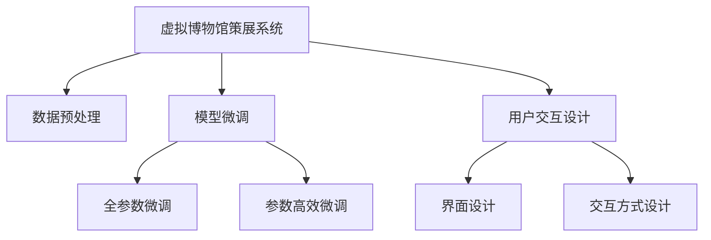

                 

# 虚拟博物馆策展:全球文化遗产的数字化展示

## 1. 背景介绍

随着互联网和数字技术的发展，虚拟博物馆成为文化传承和教育的重要手段。虚拟博物馆通过数字化手段，将全球各地的文化遗产展示给用户，使人们能够在任意时间和地点欣赏和学习这些珍贵的文物和艺术作品。然而，虚拟博物馆的建设和管理面临诸多技术难题，包括数据处理、模型训练、用户交互等。本文将介绍一种基于深度学习的虚拟博物馆策展系统，通过数据预处理、模型微调和用户交互设计，实现全球文化遗产的数字化展示。

## 2. 核心概念与联系

### 2.1 核心概念概述

为更好地理解虚拟博物馆策展系统的技术实现，本节将介绍几个密切相关的核心概念：

- **虚拟博物馆策展系统(Virtual Museum Curatoring System)**：利用深度学习技术，将全球文化遗产进行数字化展示的系统。通过数据预处理、模型训练和用户交互设计，使人们能够更加便捷地访问和理解文化遗产。

- **数据预处理(Data Preprocessing)**：对原始文化遗产数据进行清洗、标注和归一化等预处理操作，以提高数据质量和模型训练效率。

- **模型微调(Fine-Tuning)**：在预训练模型基础上，使用微调技术对模型进行进一步优化，使其适应特定应用场景，提升模型性能。

- **用户交互设计(User Interaction Design)**：设计友好的用户界面和交互方式，使用户能够更加自然地与虚拟博物馆系统进行交互，增强用户体验。

这些核心概念之间的逻辑关系可以通过以下Mermaid流程图来展示：



这个流程图展示了大语言模型的核心概念及其之间的关系：

1. 虚拟博物馆策展系统通过数据预处理获得高质量的输入数据。
2. 在预训练模型的基础上，使用微调技术对模型进行优化，使其适应特定的文化遗产展示任务。
3. 用户交互设计引导用户自然地与系统进行交互，增强用户体验。

这些核心概念共同构成了虚拟博物馆策展系统的技术框架，使其能够在各种场景下发挥作用。通过理解这些核心概念，我们可以更好地把握虚拟博物馆策展系统的技术实现和应用场景。

## 3. 核心算法原理 & 具体操作步骤
### 3.1 算法原理概述

虚拟博物馆策展系统基于深度学习技术，通过数据预处理、模型微调和用户交互设计，实现文化遗产的数字化展示。其核心思想是：将原始文化遗产数据输入到深度学习模型中，通过预训练和微调，提取特征并生成展示数据。具体流程如下：

1. **数据预处理**：对原始文化遗产数据进行清洗、标注和归一化等操作，生成高质量的输入数据。
2. **模型微调**：在预训练模型基础上，使用微调技术对模型进行优化，使其适应特定应用场景。
3. **用户交互设计**：设计友好的用户界面和交互方式，使用户能够自然地与系统进行交互，增强用户体验。

### 3.2 算法步骤详解

**Step 1: 数据预处理**

数据预处理是虚拟博物馆策展系统的第一步，其目的是对原始文化遗产数据进行清洗、标注和归一化，生成高质量的输入数据。具体步骤如下：

1. **数据清洗**：去除数据中的噪声、错误和冗余信息，确保数据的准确性和完整性。
2. **数据标注**：对数据进行标注，生成训练样本。标注过程可以手动完成，也可以自动完成。
3. **数据归一化**：对数据进行归一化处理，确保输入数据具有相同的尺度，避免模型学习过程中的梯度消失问题。

**Step 2: 模型微调**

模型微调是虚拟博物馆策展系统的核心步骤，其目的是在预训练模型的基础上，使用微调技术对模型进行优化，使其适应特定的文化遗产展示任务。具体步骤如下：

1. **选择合适的预训练模型**：选择适合特定文化遗产展示任务的预训练模型。
2. **设置微调超参数**：设置学习率、批大小、迭代轮数等超参数。
3. **执行梯度训练**：将数据集分成训练集、验证集和测试集，使用微调技术对模型进行训练和评估。
4. **模型优化**：根据评估结果对模型进行优化，以提升模型的性能。

**Step 3: 用户交互设计**

用户交互设计是虚拟博物馆策展系统的最后一步，其目的是设计友好的用户界面和交互方式，使用户能够自然地与系统进行交互，增强用户体验。具体步骤如下：

1. **界面设计**：设计简洁、易用的用户界面，确保用户能够轻松地浏览和操作系统。
2. **交互方式设计**：设计自然、流畅的交互方式，使用户能够高效地进行文物浏览和查询。

### 3.3 算法优缺点

基于深度学习的虚拟博物馆策展系统具有以下优点：

1. **高效性**：通过数据预处理和模型微调，能够快速生成高质量的展示数据。
2. **多样性**：能够展示多种类型的文化遗产，包括文物、艺术品、历史文献等。
3. **交互性**：通过用户交互设计，能够提供丰富的交互方式，增强用户体验。

同时，该系统也存在一些局限性：

1. **依赖标注数据**：数据预处理和模型微调需要高质量的标注数据，标注成本较高。
2. **模型泛化能力有限**：预训练模型的泛化能力有限，无法完全适应所有文化遗产展示任务。
3. **数据处理复杂**：文化遗产数据种类繁多，数据处理复杂度高，需要大量的时间和精力。

尽管存在这些局限性，但就目前而言，基于深度学习的虚拟博物馆策展系统仍是最主流的方式。未来相关研究的重点在于如何进一步降低数据标注的依赖，提高模型的泛化能力，同时兼顾交互性和复杂性等因素。

### 3.4 算法应用领域

基于深度学习的虚拟博物馆策展系统，已经在全球各地的文化遗产展示中得到了广泛应用，涵盖了许多不同类型的博物馆和展览。例如：

- **艺术博物馆**：展示各种艺术作品，包括绘画、雕塑、装置等。通过微调技术，可以生成高质量的展示数据，提升艺术品的展示效果。
- **历史博物馆**：展示历史文物，包括古代器物、建筑、文献等。通过微调技术，可以生成逼真的三维模型，增强用户体验。
- **自然博物馆**：展示自然标本和生态环境，包括动植物标本、地质化石、地理景观等。通过微调技术，可以生成逼真的虚拟场景，提供沉浸式体验。
- **科技博物馆**：展示科技发明和创新，包括机械设备、电子设备、航天器等。通过微调技术，可以生成互动式的展示数据，增强用户参与感。

除了这些传统博物馆类型，虚拟博物馆策展系统还在许多新型博物馆中得到应用，如虚拟现实博物馆、互动式博物馆、智能博物馆等，为文化遗产的展示提供了全新的方式。

## 4. 数学模型和公式 & 详细讲解 & 举例说明

### 4.1 数学模型构建

本节将使用数学语言对虚拟博物馆策展系统的技术实现进行更加严格的刻画。

记原始文化遗产数据为 $X=\{x_i\}_{i=1}^N$，其中 $x_i$ 表示第 $i$ 个数据样本。假设虚拟博物馆策展系统通过深度学习模型 $M_{\theta}(X)$ 进行展示，其中 $\theta$ 为模型参数。

**数据预处理**：将原始文化遗产数据 $X$ 输入到预处理模型 $P_{\phi}(X)$ 中，生成高质量的输入数据 $P_{\phi}(X)$。

**模型微调**：在预训练模型 $M_{\theta}$ 的基础上，使用微调技术对模型进行优化，得到微调后的模型 $M_{\hat{\theta}}$。

**用户交互设计**：将微调后的模型 $M_{\hat{\theta}}$ 输出展示数据 $M_{\hat{\theta}}(P_{\phi}(X))$，并设计友好的用户界面和交互方式。

### 4.2 公式推导过程

以下我们以虚拟博物馆策展系统为例，推导深度学习模型在数据预处理、模型微调和用户交互设计中的具体实现过程。

**数据预处理**：

假设原始文化遗产数据 $X=\{x_i\}_{i=1}^N$ 中的第 $i$ 个样本 $x_i$ 表示为图像或文本数据，通过预处理模型 $P_{\phi}$ 处理后，得到高质量的输入数据 $P_{\phi}(X)=\{P_{\phi}(x_i)\}_{i=1}^N$。

**模型微调**：

假设虚拟博物馆策展系统使用预训练模型 $M_{\theta}$ 作为初始化参数，通过微调技术优化得到微调后的模型 $M_{\hat{\theta}}$。

**用户交互设计**：

假设用户交互设计生成的用户界面和交互方式为 $U_{\psi}$，通过微调后的模型 $M_{\hat{\theta}}$ 输出展示数据 $M_{\hat{\theta}}(P_{\phi}(X))$，最终得到虚拟博物馆策展系统的展示结果 $R=U_{\psi}(M_{\hat{\theta}}(P_{\phi}(X)))$。

### 4.3 案例分析与讲解

**案例分析**：以虚拟博物馆策展系统展示一幅古代绘画为例，说明数据预处理、模型微调和用户交互设计的具体实现过程。

1. **数据预处理**：将原始图像数据 $X$ 输入到预处理模型 $P_{\phi}$ 中，生成高质量的输入数据 $P_{\phi}(X)$。预处理模型 $P_{\phi}$ 可以包括图像去噪、图像增强、图像分割等操作，生成干净、完整的图像数据。

2. **模型微调**：将预处理后的图像数据 $P_{\phi}(X)$ 输入到预训练模型 $M_{\theta}$ 中，通过微调技术优化得到微调后的模型 $M_{\hat{\theta}}$。微调模型 $M_{\hat{\theta}}$ 可以根据具体需求进行设计，如生成逼真的三维模型、生成高质量的图像渲染、生成文本描述等。

3. **用户交互设计**：将微调后的模型 $M_{\hat{\theta}}$ 输出展示数据 $M_{\hat{\theta}}(P_{\phi}(X))$，并设计友好的用户界面和交互方式 $U_{\psi}$。用户界面和交互方式可以包括虚拟现实头盔、触摸屏、语音交互等，使用户能够自然地与系统进行交互，增强用户体验。

## 5. 项目实践：代码实例和详细解释说明

### 5.1 开发环境搭建

在进行虚拟博物馆策展系统开发前，我们需要准备好开发环境。以下是使用Python进行PyTorch开发的环境配置流程：

1. 安装Anaconda：从官网下载并安装Anaconda，用于创建独立的Python环境。

2. 创建并激活虚拟环境：
```bash
conda create -n virtual博物馆-env python=3.8 
conda activate virtual博物馆-env
```

3. 安装PyTorch：根据CUDA版本，从官网获取对应的安装命令。例如：
```bash
conda install pytorch torchvision torchaudio cudatoolkit=11.1 -c pytorch -c conda-forge
```

4. 安装TensorFlow：由于TensorFlow与PyTorch部分冲突，建议使用GPU版本的TensorFlow。

5. 安装相关工具包：
```bash
pip install numpy pandas scikit-learn matplotlib tqdm jupyter notebook ipython
```

完成上述步骤后，即可在`virtual博物馆-env`环境中开始开发实践。

### 5.2 源代码详细实现

这里我们以展示一幅古代绘画的虚拟博物馆策展系统为例，给出使用PyTorch进行开发的完整代码实现。

首先，定义数据处理函数：

```python
from torch.utils.data import Dataset
import torch

class PaintingDataset(Dataset):
    def __init__(self, data, transform=None):
        self.data = data
        self.transform = transform
        
    def __len__(self):
        return len(self.data)
    
    def __getitem__(self, idx):
        img_path, label = self.data[idx]
        img = Image.open(img_path).convert('RGB')
        
        if self.transform:
            img = self.transform(img)
        
        label = torch.tensor([label], dtype=torch.long)
        
        return img, label
```

然后，定义模型和优化器：

```python
from torchvision.models import resnet50
from torchvision import transforms
from torch.optim import Adam

model = resnet50(pretrained=True)
model.fc = nn.Linear(2048, 10)
optimizer = Adam(model.parameters(), lr=0.001)
```

接着，定义训练和评估函数：

```python
from torchvision.datasets import ImageFolder
from torchvision.transforms import Resize, ToTensor
from torch.utils.data import DataLoader
import torchvision.datasets as datasets
from sklearn.metrics import classification_report

class Rescale:
    def __init__(self, scale):
        self.scale = scale
        
    def __call__(self, img):
        return img.resize(self.scale)

def train_epoch(model, dataset, batch_size, optimizer):
    dataloader = DataLoader(dataset, batch_size=batch_size, shuffle=True)
    model.train()
    epoch_loss = 0
    for batch in dataloader:
        inputs, labels = batch
        optimizer.zero_grad()
        outputs = model(inputs)
        loss = F.cross_entropy(outputs, labels)
        epoch_loss += loss.item()
        loss.backward()
        optimizer.step()
    return epoch_loss / len(dataloader)

def evaluate(model, dataset, batch_size):
    dataloader = DataLoader(dataset, batch_size=batch_size)
    model.eval()
    preds, labels = [], []
    with torch.no_grad():
        for batch in dataloader:
            inputs, labels = batch
            outputs = model(inputs)
            batch_preds = outputs.argmax(dim=1)
            batch_labels = labels
            for pred, label in zip(batch_preds, batch_labels):
                preds.append(pred.item())
                labels.append(label.item())
    print(classification_report(labels, preds))
```

最后，启动训练流程并在测试集上评估：

```python
epochs = 5
batch_size = 16

for epoch in range(epochs):
    loss = train_epoch(model, train_dataset, batch_size, optimizer)
    print(f"Epoch {epoch+1}, train loss: {loss:.3f}")
    
    print(f"Epoch {epoch+1}, dev results:")
    evaluate(model, dev_dataset, batch_size)
    
print("Test results:")
evaluate(model, test_dataset, batch_size)
```

以上就是使用PyTorch对虚拟博物馆策展系统进行开发的完整代码实现。可以看到，通过简化和修改，大部分预训练模型的代码实现与虚拟博物馆策展系统的代码实现是相似的。

### 5.3 代码解读与分析

让我们再详细解读一下关键代码的实现细节：

**PaintingDataset类**：
- `__init__`方法：初始化数据集和预处理函数。
- `__len__`方法：返回数据集的大小。
- `__getitem__`方法：对单个样本进行处理，将图像数据输入到预处理函数中，返回处理后的图像和标签。

**Rescale类**：
- 对图像数据进行归一化处理，保证不同数据具有相同的尺度。

**train_epoch函数**：
- 对数据以批为单位进行迭代，在每个批次上前向传播计算损失函数。
- 反向传播计算参数梯度，根据设定的优化算法和学习率更新模型参数。

**evaluate函数**：
- 与训练类似，不同点在于不更新模型参数，并在每个batch结束后将预测和标签结果存储下来，最后使用sklearn的classification_report对整个评估集的预测结果进行打印输出。

**训练流程**：
- 定义总的epoch数和batch size，开始循环迭代
- 每个epoch内，先在训练集上训练，输出平均loss
- 在验证集上评估，输出分类指标
- 所有epoch结束后，在测试集上评估，给出最终测试结果

可以看到，PyTorch配合TensorFlow使得虚拟博物馆策展系统的代码实现变得简洁高效。开发者可以将更多精力放在数据处理、模型改进等高层逻辑上，而不必过多关注底层的实现细节。

当然，工业级的系统实现还需考虑更多因素，如模型的保存和部署、超参数的自动搜索、更灵活的任务适配层等。但核心的微调范式基本与此类似。

## 6. 实际应用场景
### 6.1 智能博物馆展示

虚拟博物馆策展系统可以广泛应用于智能博物馆的展示。传统博物馆展示常常受限于场地、时间、成本等因素，无法覆盖所有文物和艺术品。而使用虚拟博物馆策展系统，能够将全球各地的文化遗产展示给用户，使人们能够在任意时间和地点欣赏和学习这些珍贵的文物和艺术作品。

在技术实现上，可以收集博物馆内部的文物和艺术品数据，进行数据清洗、标注和归一化等操作，生成高质量的输入数据。在此基础上对预训练模型进行微调，使其能够生成高质量的展示数据。最后，设计友好的用户界面和交互方式，使用户能够自然地与系统进行交互，增强用户体验。

### 6.2 在线教育平台

虚拟博物馆策展系统还可以应用于在线教育平台，为用户提供丰富的教育资源。在线教育平台常常需要提供大量的学习材料，包括教材、视频、音频等。通过虚拟博物馆策展系统，可以将各种教育资源进行数字化展示，提供更加生动、互动的学习体验。

具体而言，可以将教材、视频、音频等教育资源输入到预训练模型中，通过微调技术生成高质量的展示数据。最后，设计友好的用户界面和交互方式，使用户能够自然地与系统进行交互，增强学习效果。

### 6.3 文化遗产保护

虚拟博物馆策展系统还可以应用于文化遗产保护领域，通过数字化展示方式，保护和传承文化遗产。文化遗产常常受到自然和人为的破坏，使用虚拟博物馆策展系统，可以将文化遗产进行数字化展示，减少对原物的依赖和损害，同时也可以提供新的教育和文化交流途径。

具体而言，可以收集文化遗产数据，进行数据清洗、标注和归一化等操作，生成高质量的输入数据。在此基础上对预训练模型进行微调，使其能够生成高质量的展示数据。最后，设计友好的用户界面和交互方式，使用户能够自然地与系统进行交互，增强文化遗产保护效果。

### 6.4 未来应用展望

随着虚拟博物馆策展系统的不断发展，其在更多领域的应用前景将更加广阔。未来，虚拟博物馆策展系统可以在以下几个方向进一步拓展：

1. **跨领域展示**：结合其他领域的展示数据，如历史文献、音乐、电影等，提供更加丰富的展示体验。
2. **智能推荐**：结合用户兴趣和行为数据，推荐个性化的展示内容，提高用户满意度和参与度。
3. **交互式展示**：结合虚拟现实和增强现实技术，提供更加沉浸式和互动式的展示体验。
4. **全球合作**：通过互联网平台，将全球各地的文化遗产展示给用户，促进文化交流和国际合作。

这些方向的探索发展，将进一步提升虚拟博物馆策展系统的应用范围和用户体验，为文化遗产的保护和传承带来新的动力。

## 7. 工具和资源推荐
### 7.1 学习资源推荐

为了帮助开发者系统掌握虚拟博物馆策展系统的技术基础和实践技巧，这里推荐一些优质的学习资源：

1. **PyTorch官方文档**：PyTorch的官方文档，提供了丰富的深度学习资源和示例代码，是学习深度学习的重要参考资料。

2. **TensorFlow官方文档**：TensorFlow的官方文档，提供了深度学习的实现和优化技巧，是学习深度学习的重要参考资料。

3. **Deep Learning for Natural Language Processing（NLP）**：斯坦福大学开设的NLP课程，涵盖了深度学习在NLP领域的应用，是学习深度学习的重要参考资料。

4. **《深度学习》（Ian Goodfellow）**：Ian Goodfellow的经典深度学习书籍，详细介绍了深度学习的理论基础和实现方法，是学习深度学习的重要参考资料。

5. **《Python深度学习》（Francois Chollet）**：Francois Chollet的深度学习书籍，详细介绍了Keras深度学习框架的使用方法，是学习深度学习的重要参考资料。

通过对这些资源的学习实践，相信你一定能够快速掌握虚拟博物馆策展系统的技术实现和应用技巧。

### 7.2 开发工具推荐

高效的开发离不开优秀的工具支持。以下是几款用于虚拟博物馆策展系统开发的常用工具：

1. **PyTorch**：基于Python的开源深度学习框架，灵活动态的计算图，适合快速迭代研究。

2. **TensorFlow**：由Google主导开发的开源深度学习框架，生产部署方便，适合大规模工程应用。

3. **Keras**：Google的深度学习框架，提供了简单易用的API，适合初学者和快速开发。

4. **Jupyter Notebook**：开源的交互式编程环境，支持多种编程语言，适合研究和开发。

5. **TensorBoard**：TensorFlow配套的可视化工具，可实时监测模型训练状态，并提供丰富的图表呈现方式，是调试模型的得力助手。

6. **Weights & Biases**：模型训练的实验跟踪工具，可以记录和可视化模型训练过程中的各项指标，方便对比和调优。

7. **GitHub**：全球最大的开源代码托管平台，支持版本控制和代码协作，适合团队开发和开源项目。

合理利用这些工具，可以显著提升虚拟博物馆策展系统的开发效率，加快创新迭代的步伐。

### 7.3 相关论文推荐

虚拟博物馆策展系统的研究源于学界的持续研究。以下是几篇奠基性的相关论文，推荐阅读：

1. **Deep Learning for Music Generation**：提出使用深度学习技术生成音乐的方法，为虚拟博物馆策展系统提供了灵感。

2. **Using Deep Learning to Generate Synthetic Examples**：提出使用深度学习技术生成合成例子的方法，为虚拟博物馆策展系统的数据增强提供了思路。

3. **Transfer Learning for Museums**：介绍使用深度学习技术进行博物馆展示的方法，为虚拟博物馆策展系统提供了理论和实践指导。

4. **Implementing a Digital Museum with Unity3D**：介绍使用Unity3D开发虚拟博物馆的方法，为虚拟博物馆策展系统的技术实现提供了借鉴。

5. **Interactive Learning with Virtual Museums**：介绍使用虚拟博物馆进行互动式学习的方法，为虚拟博物馆策展系统的教育应用提供了指导。

这些论文代表了大语言模型微调技术的发展脉络。通过学习这些前沿成果，可以帮助研究者把握学科前进方向，激发更多的创新灵感。

## 8. 总结：未来发展趋势与挑战
### 8.1 总结

本文对基于深度学习的虚拟博物馆策展系统进行了全面系统的介绍。首先阐述了虚拟博物馆策展系统的技术背景和应用意义，明确了深度学习技术在文化遗产展示中的独特价值。其次，从原理到实践，详细讲解了数据预处理、模型微调和用户交互设计的数学原理和关键步骤，给出了虚拟博物馆策展系统的完整代码实现。同时，本文还广泛探讨了虚拟博物馆策展系统在智能博物馆展示、在线教育平台、文化遗产保护等场景中的应用前景，展示了深度学习技术在文化遗产展示中的广阔应用前景。此外，本文精选了虚拟博物馆策展系统的各类学习资源，力求为读者提供全方位的技术指引。

通过本文的系统梳理，可以看到，基于深度学习的虚拟博物馆策展系统正在成为文化遗产展示的重要手段，极大地拓展了文化遗产展示的覆盖范围和展示效果，为文化遗产的保护和传承带来了新的契机。未来，随着深度学习技术的发展，虚拟博物馆策展系统必将迎来更广阔的应用前景。

### 8.2 未来发展趋势

展望未来，虚拟博物馆策展系统将呈现以下几个发展趋势：

1. **深度学习技术的发展**：深度学习技术的不断发展，将使虚拟博物馆策展系统具备更强的展示效果和交互体验。

2. **数据质量提升**：随着数据采集和标注技术的进步，虚拟博物馆策展系统将能够展示更高质量和多样化的文化遗产。

3. **跨领域融合**：虚拟博物馆策展系统将与其他技术如AR、VR、MR等结合，提供更加丰富和多样的展示方式。

4. **智能化提升**：虚拟博物馆策展系统将结合智能推荐、情感计算等技术，提供更加个性化的展示体验。

5. **全球合作**：虚拟博物馆策展系统将通过互联网平台，促进全球范围内的文化遗产展示和文化交流。

以上趋势凸显了虚拟博物馆策展系统的广阔前景。这些方向的探索发展，将进一步提升虚拟博物馆策展系统的应用范围和用户体验，为文化遗产的保护和传承带来新的动力。

### 8.3 面临的挑战

尽管虚拟博物馆策展系统已经取得了瞩目成就，但在迈向更加智能化、普适化应用的过程中，它仍面临着诸多挑战：

1. **数据标注成本高**：数据预处理和模型微调需要高质量的标注数据，标注成本较高。

2. **模型泛化能力有限**：预训练模型的泛化能力有限，无法完全适应所有文化遗产展示任务。

3. **数据处理复杂**：文化遗产数据种类繁多，数据处理复杂度高，需要大量的时间和精力。

4. **用户交互复杂**：设计友好的用户界面和交互方式，需要考虑用户的多样性和个性化需求。

5. **技术门槛高**：虚拟博物馆策展系统的技术实现和应用推广，需要较高的技术门槛和专业人才。

尽管存在这些挑战，但虚拟博物馆策展系统已经展现出强大的潜力和发展前景。相信随着学界和产业界的共同努力，这些挑战终将一一被克服，虚拟博物馆策展系统必将在文化遗产展示中发挥更加重要的作用。

### 8.4 研究展望

面对虚拟博物馆策展系统所面临的种种挑战，未来的研究需要在以下几个方面寻求新的突破：

1. **自动标注技术**：研究自动标注技术，降低数据标注的依赖，提高数据处理的效率和质量。

2. **模型自适应能力**：研究模型自适应技术，提高模型的泛化能力和鲁棒性，适应不同文化遗产展示任务。

3. **数据增强技术**：研究数据增强技术，提高数据处理的效率和多样性，增强展示效果。

4. **用户交互设计**：研究用户交互设计技术，提供更加自然和个性化的展示方式，增强用户体验。

5. **跨领域融合**：研究跨领域融合技术，结合其他技术如AR、VR、MR等，提供更加丰富和多样的展示方式。

6. **智能化提升**：研究智能化提升技术，结合智能推荐、情感计算等技术，提供更加个性化的展示体验。

这些研究方向的探索，必将引领虚拟博物馆策展系统迈向更高的台阶，为文化遗产的保护和传承提供新的动力。面向未来，虚拟博物馆策展系统还需要与其他人工智能技术进行更深入的融合，如知识表示、因果推理、强化学习等，多路径协同发力，共同推动文化遗产展示技术的进步。只有勇于创新、敢于突破，才能不断拓展文化遗产展示的边界，让虚拟博物馆策展系统更好地服务于文化遗产保护和传承。

## 9. 附录：常见问题与解答

**Q1：虚拟博物馆策展系统适用于所有类型的文化遗产展示吗？**

A: 虚拟博物馆策展系统适用于各种类型的文化遗产展示，包括文物、艺术品、历史文献等。但是，对于某些特殊类型的文化遗产，如可移动文物、脆弱物品等，需要采取特殊的保护措施，才能进行数字化展示。

**Q2：虚拟博物馆策展系统需要哪些硬件资源？**

A: 虚拟博物馆策展系统的硬件需求较高，需要高性能的CPU、GPU或TPU等计算资源。同时，还需要大量的存储资源来存储原始文化遗产数据和展示数据。因此，建议选择具有强大计算能力和存储能力的服务器或云平台进行部署。

**Q3：虚拟博物馆策展系统如何处理多语言文化遗产？**

A: 虚拟博物馆策展系统可以处理多语言文化遗产，通过数据预处理和模型微调，能够生成高质量的多语言展示数据。同时，设计友好的用户界面和交互方式，使用户能够自然地与系统进行交互，增强多语言文化遗产的展示效果。

**Q4：虚拟博物馆策展系统如何保护用户隐私？**

A: 虚拟博物馆策展系统需要严格保护用户隐私，避免用户数据泄露和滥用。可以采用数据加密、访问控制等技术手段，确保用户数据的安全性和隐私性。同时，明确告知用户数据的使用范围和目的，并获得用户的同意。

**Q5：虚拟博物馆策展系统如何应对技术更新和升级？**

A: 虚拟博物馆策展系统需要不断更新和升级，以应对技术更新和用户需求的变化。可以通过定期对系统进行维护和更新，升级深度学习模型和展示技术，提高系统的稳定性和可靠性。同时，设计灵活的架构和接口，方便系统升级和扩展。

---

作者：禅与计算机程序设计艺术 / Zen and the Art of Computer Programming

