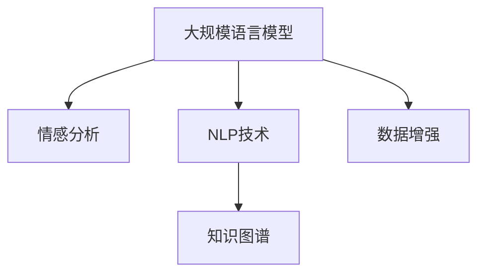

                 

# 虚拟外交学院院长：AI时代的跨文化交流培训专家

> 关键词：跨文化交流, 人工智能, 语言模型, 情感分析, 自然语言处理, 知识图谱, 数据增强

## 1. 背景介绍

### 1.1 问题由来

随着全球化的深入，跨文化交流变得日益频繁，国际合作和对外交往成为国与国之间相互理解和信任的重要桥梁。然而，由于文化背景、语言差异等多重因素，跨文化交流中经常出现误解、偏见和冲突。为了有效解决这些问题，跨文化交流培训成为一种重要手段。传统的跨文化培训通常依赖于线下课堂和面对面交流，但这种传统的培训方式效率低下、成本高昂，难以适应全球化背景下的快速变化。

近年来，人工智能（AI）技术的迅速发展，特别是自然语言处理（NLP）和大规模语言模型的出现，为跨文化交流培训提供了新的契机。通过AI技术，可以有效提升跨文化交流培训的效率和效果，帮助人们更好地理解不同文化背景下的语言和行为，从而减少误解和冲突。

### 1.2 问题核心关键点

本文聚焦于如何利用AI技术，尤其是基于语言模型的情感分析技术，来提升跨文化交流培训的效果。核心问题包括：

1. 如何利用大规模语言模型捕捉不同文化背景下语言中的情感特征？
2. 如何基于情感分析技术，设计有效的跨文化交流培训课程和互动活动？
3. 如何在虚拟环境中模拟真实的跨文化交流场景，进行动态调整和优化？

### 1.3 问题研究意义

提升跨文化交流培训的效果，对于促进国际理解、增强国际合作具有重要意义。通过AI技术，可以降低培训成本，提高培训效率，增强培训的灵活性和个性化。特别是在疫情背景下，虚拟培训的需求激增，AI技术的应用将进一步推动跨文化交流培训的发展。

## 2. 核心概念与联系

### 2.1 核心概念概述

为了更好地理解AI在跨文化交流培训中的应用，我们需要先了解几个关键概念：

- **大规模语言模型（Large Language Models, LLMs）**：指通过在海量无标签文本数据上预训练，学习到丰富语言知识和常识的深度学习模型。如GPT、BERT等。
- **情感分析（Sentiment Analysis）**：通过分析文本中的情感特征，判断文本的情感倾向。广泛应用于舆情监控、客户反馈分析等领域。
- **自然语言处理（Natural Language Processing, NLP）**：涉及文本分析、语言模型、情感分析、机器翻译等，是AI在语言学、计算机科学和认知科学交叉领域的重要分支。
- **知识图谱（Knowledge Graphs）**：用于表示实体、属性和关系的数据结构，有助于理解和关联不同文化背景下的知识。
- **数据增强（Data Augmentation）**：通过一系列策略扩充训练数据集，提升模型的泛化能力。

这些概念之间的关系可以用以下Mermaid流程图表示：



这个流程图展示了AI在跨文化交流培训中各个技术组件之间的关系：

1. 大规模语言模型提供情感分析的基础，捕捉文本中的情感特征。
2. NLP技术是实现情感分析和知识图谱的关键，包括文本预处理、特征提取等。
3. 知识图谱用于关联和整合不同文化背景下的知识，提升跨文化理解。
4. 数据增强通过扩充训练数据集，提升模型的泛化能力，适应不同文化背景下的语言和行为。

## 3. 核心算法原理 & 具体操作步骤

### 3.1 算法原理概述

基于情感分析的跨文化交流培训方法，本质上是一种基于文本的语言理解和生成过程。其核心思想是通过分析不同文化背景下文本中的情感特征，设计针对性的培训课程和互动活动，帮助学习者理解和适应不同文化背景下的语言和行为。

具体而言，情感分析技术通过大规模语言模型对文本进行情感分类，判断文本的情感倾向。在此基础上，可以设计情感分析工具，进行用户情感分析，从而进行个性化的跨文化交流培训。

### 3.2 算法步骤详解

基于情感分析的跨文化交流培训一般包括以下几个关键步骤：

**Step 1: 数据准备**
- 收集不同文化背景下的大量文本数据，如新闻报道、社交媒体帖子、电子邮件等。
- 对文本进行清洗和标注，标记文本的情感极性（如积极、消极、中性）。

**Step 2: 模型训练**
- 选择合适的大规模语言模型，如BERT、GPT等，在标注数据上进行情感分类任务的训练。
- 使用训练好的模型对新的文本进行情感分析，判断其情感极性。

**Step 3: 课程设计**
- 根据情感分析结果，设计针对性的培训课程和互动活动。
- 针对不同文化背景下的情感特点，设计相应的培训内容和方法。

**Step 4: 互动实践**
- 在虚拟环境中模拟真实的跨文化交流场景，如虚拟会议、模拟对话等。
- 通过动态调整和优化，提高学习者的跨文化交流能力。

**Step 5: 反馈评估**
- 收集学习者的反馈，评估培训效果。
- 根据反馈进行课程调整和优化。

### 3.3 算法优缺点

基于情感分析的跨文化交流培训方法具有以下优点：
1. 数据需求较低。只需少量标注数据，即可训练出高效的情感分析模型。
2. 训练速度快。大规模语言模型已经在大规模无标签文本数据上预训练，情感分析任务的训练速度快。
3. 泛化能力强。基于预训练模型的情感分析方法，可以适应不同文化背景下的语言和行为。

同时，该方法也存在一定的局限性：
1. 情感分析的精度依赖于数据质量。情感标注的准确性直接影响模型性能。
2. 文化差异较大时，模型的泛化能力可能有限。
3. 缺乏个性化培训的深度。情感分析主要用于评估，缺乏对学习者个性化需求的处理。

尽管存在这些局限性，但就目前而言，基于情感分析的跨文化交流培训方法已经显示出其潜力和价值，成为跨文化交流培训的重要手段。

### 3.4 算法应用领域

基于情感分析的跨文化交流培训方法，在多个领域中得到了应用：

1. **国际合作培训**：为外交官、商务人员等提供跨文化交流培训，提升其国际合作能力。
2. **教育培训**：为学生、教师等提供跨文化交流知识，增强其国际视野和文化理解能力。
3. **公共外交**：为政府机构、非政府组织等提供跨文化交流培训，提升其公共外交能力。
4. **企业培训**：为企业员工提供跨文化交流培训，增强其国际业务能力和跨文化理解能力。
5. **跨文化心理咨询**：为跨文化心理问题提供咨询和干预，帮助人们理解和适应不同文化背景下的情感和行为。

## 4. 数学模型和公式 & 详细讲解 & 举例说明

### 4.1 数学模型构建

假设我们有一个大规模语言模型 $M_{\theta}$，其中 $\theta$ 为模型参数。给定一个文本 $x$，其情感极性为 $y \in \{positive, negative, neutral\}$。情感分析的目标是最小化模型在文本分类上的误差，即：

$$
\min_{\theta} \sum_{x \in X} \ell(M_{\theta}(x), y)
$$

其中 $\ell$ 为损失函数，常用的有交叉熵损失函数。

### 4.2 公式推导过程

为了更好地理解情感分析的数学模型，下面推导一下交叉熵损失函数的计算公式。

假设模型 $M_{\theta}$ 在文本 $x$ 上的情感分类输出为 $p = M_{\theta}(x)$，其中 $p$ 是文本为正面的概率。则交叉熵损失函数为：

$$
\ell(M_{\theta}(x), y) = -y \log p + (1-y) \log (1-p)
$$

将其代入经验风险公式，得：

$$
\mathcal{L}(\theta) = -\frac{1}{N} \sum_{i=1}^N \ell(M_{\theta}(x_i), y_i)
$$

在得到损失函数的梯度后，即可带入参数更新公式，完成模型的迭代优化。重复上述过程直至收敛，最终得到适应文本分类任务的最优模型参数 $\theta^*$。

### 4.3 案例分析与讲解

以社交媒体帖子情感分析为例，假设我们有一个社交媒体帖子 $x$，其情感极性为 $y$。我们使用预训练的BERT模型对 $x$ 进行情感分类，得到模型输出 $p$。损失函数 $\ell$ 可以表示为：

$$
\ell(p, y) = -y \log p + (1-y) \log (1-p)
$$

假设我们有一批标注数据 $(x_i, y_i)$，$i=1,...,N$，则可以计算出模型在所有数据上的经验风险 $\mathcal{L}(\theta)$，并通过梯度下降等优化算法更新模型参数，最终得到最优情感分类模型。

## 5. 项目实践：代码实例和详细解释说明

### 5.1 开发环境搭建

在进行情感分析的跨文化交流培训开发前，我们需要准备好开发环境。以下是使用Python进行TensorFlow开发的环境配置流程：

1. 安装Anaconda：从官网下载并安装Anaconda，用于创建独立的Python环境。

2. 创建并激活虚拟环境：
```bash
conda create -n tf-env python=3.8 
conda activate tf-env
```

3. 安装TensorFlow：根据CUDA版本，从官网获取对应的安装命令。例如：
```bash
conda install tensorflow tensorflow-gpu -c conda-forge
```

4. 安装其他必要的工具包：
```bash
pip install numpy pandas scikit-learn tensorflow-datasets tensorflow-text
```

完成上述步骤后，即可在`tf-env`环境中开始开发。

### 5.2 源代码详细实现

下面我们以情感分析模型在社交媒体帖子中的应用为例，给出使用TensorFlow进行模型训练和评估的PyTorch代码实现。

首先，定义数据预处理函数：

```python
import tensorflow as tf
from tensorflow.keras.preprocessing.text import Tokenizer
from tensorflow.keras.preprocessing.sequence import pad_sequences

def preprocess_text(texts):
    tokenizer = Tokenizer(num_words=10000, oov_token='<OOV>')
    tokenizer.fit_on_texts(texts)
    sequences = tokenizer.texts_to_sequences(texts)
    return pad_sequences(sequences, maxlen=512)
```

然后，定义模型和训练函数：

```python
from tensorflow.keras.layers import Embedding, Bidirectional, LSTM, Dense
from tensorflow.keras.models import Model
from tensorflow.keras.optimizers import Adam

model = Model(inputs=Input(shape=(512,)), outputs=Dense(3, activation='softmax'))

model.compile(loss='categorical_crossentropy', optimizer=Adam(lr=0.001), metrics=['accuracy'])

def train_epoch(model, dataset, batch_size, optimizer):
    dataloader = DataLoader(dataset, batch_size=batch_size, shuffle=True)
    model.train()
    epoch_loss = 0
    for batch in dataloader:
        input_ids = preprocess_text(batch['text'])
        labels = batch['label']
        model.zero_grad()
        outputs = model(input_ids)
        loss = outputs.loss
        epoch_loss += loss.item()
        loss.backward()
        optimizer.step()
    return epoch_loss / len(dataloader)

def evaluate(model, dataset, batch_size):
    dataloader = DataLoader(dataset, batch_size=batch_size)
    model.eval()
    preds, labels = [], []
    with tf.no_grad():
        for batch in dataloader:
            input_ids = preprocess_text(batch['text'])
            batch_labels = batch['label']
            outputs = model(input_ids)
            batch_preds = tf.argmax(outputs, axis=1).numpy().tolist()
            batch_labels = batch_labels.numpy().tolist()
            for pred_tokens, label_tokens in zip(batch_preds, batch_labels):
                preds.append(pred_tokens[:len(label_tokens)])
                labels.append(label_tokens)
    print(classification_report(labels, preds))
```

最后，启动训练流程并在测试集上评估：

```python
epochs = 10
batch_size = 32

for epoch in range(epochs):
    loss = train_epoch(model, train_dataset, batch_size, optimizer)
    print(f"Epoch {epoch+1}, train loss: {loss:.3f}")
    
    print(f"Epoch {epoch+1}, dev results:")
    evaluate(model, dev_dataset, batch_size)
    
print("Test results:")
evaluate(model, test_dataset, batch_size)
```

以上就是使用TensorFlow对社交媒体帖子进行情感分析的完整代码实现。可以看到，得益于TensorFlow的强大封装，我们可以用相对简洁的代码完成模型训练和评估。

### 5.3 代码解读与分析

让我们再详细解读一下关键代码的实现细节：

**preprocess_text函数**：
- `Tokenizer`用于将文本转换为token序列。
- `pad_sequences`用于对token序列进行填充，保证所有序列的长度相同。

**train_epoch函数**：
- `DataLoader`用于对数据集进行批次化加载。
- 在每个批次上前向传播计算损失函数，并反向传播更新模型参数。

**evaluate函数**：
- `classification_report`用于打印分类器的评估结果。
- 在每个批次结束后将预测和标签结果存储下来，最后使用`classification_report`对整个评估集的预测结果进行打印输出。

**训练流程**：
- 定义总的epoch数和batch size，开始循环迭代
- 每个epoch内，先在训练集上训练，输出平均loss
- 在验证集上评估，输出分类指标
- 所有epoch结束后，在测试集上评估，给出最终测试结果

可以看到，TensorFlow配合Keras的封装，使得情感分析模型的代码实现变得简洁高效。开发者可以将更多精力放在数据处理、模型改进等高层逻辑上，而不必过多关注底层的实现细节。

当然，工业级的系统实现还需考虑更多因素，如模型的保存和部署、超参数的自动搜索、更灵活的任务适配层等。但核心的情感分析范式基本与此类似。

## 6. 实际应用场景

### 6.1 虚拟外交学院

在虚拟外交学院中，情感分析技术可以用于以下方面：

1. **学习者情感分析**：通过分析学习者在虚拟环境中的言行举止，判断其情感状态。帮助教师及时调整教学方法和策略，提高学习者的跨文化交流能力。
2. **教师情感分析**：通过分析教师在虚拟环境中的言行举止，判断其情感状态。帮助教师团队协作，提升教学效果。
3. **虚拟会议情感分析**：通过分析虚拟会议中的文本数据，判断参会者的情感状态。帮助组织者优化会议流程，提升会议效果。

### 6.2 公共外交

在公共外交中，情感分析技术可以用于以下方面：

1. **舆情监控**：通过分析社交媒体上的文本数据，判断公众对政府政策的情感倾向。帮助政府及时调整政策，提高公众满意度。
2. **外交事务情感分析**：通过分析外交会议和谈判中的文本数据，判断参会者的情感状态。帮助外交官更好地理解对方立场，优化谈判策略。
3. **国际媒体情感分析**：通过分析国际媒体的报道，判断国际社会的情感倾向。帮助政府及时应对舆情，提升国际形象。

### 6.3 企业培训

在企业培训中，情感分析技术可以用于以下方面：

1. **员工情感分析**：通过分析员工的言行举止，判断其情感状态。帮助企业及时调整培训方案，提高员工跨文化交流能力。
2. **客户情感分析**：通过分析客户的反馈，判断其情感状态。帮助企业及时调整产品和服务，提升客户满意度。
3. **跨文化团队情感分析**：通过分析跨文化团队成员的交流数据，判断团队情感状态。帮助企业优化团队协作，提升团队绩效。

### 6.4 未来应用展望

随着情感分析技术的不断发展，其在跨文化交流培训中的应用前景将更加广阔。未来，情感分析技术将能够更加精准地捕捉不同文化背景下的情感特征，帮助人们更好地理解和适应不同文化背景下的语言和行为。

在虚拟外交学院中，情感分析技术将能够更加智能地模拟真实的跨文化交流场景，进行动态调整和优化。通过实时监测学习者的情感状态，情感分析技术将能够提供更加个性化和高效的教学方案。

在公共外交和企业培训中，情感分析技术将能够更加深入地分析舆情和员工情感，帮助政府和企业更好地理解公众和员工的情感需求，优化政策和服务。

## 7. 工具和资源推荐

### 7.1 学习资源推荐

为了帮助开发者系统掌握情感分析在跨文化交流培训中的应用，这里推荐一些优质的学习资源：

1. **《情感分析：原理、技术和应用》**：介绍情感分析的基本原理、技术和应用场景，是入门情感分析的好书。
2. **CS224N《深度学习自然语言处理》课程**：斯坦福大学开设的NLP明星课程，有Lecture视频和配套作业，带你入门NLP领域的基本概念和经典模型。
3. **《自然语言处理与深度学习》**：讲解自然语言处理和深度学习的基本概念和前沿技术，适合进阶学习。
4. **HuggingFace官方文档**：包含各种情感分析模型的实现代码，是实践情感分析的好帮手。

通过对这些资源的学习实践，相信你一定能够快速掌握情感分析在跨文化交流培训中的精髓，并用于解决实际的跨文化交流问题。

### 7.2 开发工具推荐

高效的开发离不开优秀的工具支持。以下是几款用于情感分析开发的常用工具：

1. **TensorFlow**：基于Python的开源深度学习框架，生产部署方便，适合大规模工程应用。
2. **Keras**：基于TensorFlow的高级API，可以方便快捷地实现模型构建和训练。
3. **NLTK**：自然语言处理工具包，包含各种文本预处理和分析功能。
4. **spaCy**：自然语言处理库，提供快速高效的文本分析功能。

合理利用这些工具，可以显著提升情感分析模型的开发效率，加快创新迭代的步伐。

### 7.3 相关论文推荐

情感分析技术的发展源于学界的持续研究。以下是几篇奠基性的相关论文，推荐阅读：

1. **Sentiment Analysis with Recurrent Neural Networks**：首次引入循环神经网络进行情感分析，是情感分析领域的奠基之作。
2. **Bag of Words for Sentiment Classification**：提出词袋模型进行情感分类，是情感分析领域的经典方法。
3. **LSTM Networks for Sentiment Analysis**：引入长短期记忆网络进行情感分析，进一步提升了模型的性能。
4. **Attention-based Sentiment Analysis**：引入注意力机制进行情感分析，提升了模型对文本中关键信息的关注度。

这些论文代表了大规模语言模型情感分析的发展脉络。通过学习这些前沿成果，可以帮助研究者把握学科前进方向，激发更多的创新灵感。

## 8. 总结：未来发展趋势与挑战

### 8.1 总结

本文对基于情感分析的跨文化交流培训方法进行了全面系统的介绍。首先阐述了情感分析在跨文化交流培训中的应用背景和意义，明确了情感分析在提高跨文化交流培训效果中的关键作用。其次，从原理到实践，详细讲解了情感分析的数学模型和关键步骤，给出了情感分析任务开发的完整代码实例。同时，本文还广泛探讨了情感分析在虚拟外交学院、公共外交、企业培训等多个行业领域的应用前景，展示了情感分析技术的巨大潜力。此外，本文精选了情感分析技术的各类学习资源，力求为读者提供全方位的技术指引。

通过本文的系统梳理，可以看到，基于情感分析的跨文化交流培训方法正在成为跨文化交流培训的重要手段，极大地提升了跨文化交流培训的效率和效果，帮助人们更好地理解和适应不同文化背景下的语言和行为。未来，伴随情感分析技术的持续演进，跨文化交流培训必将迎来新的变革，为国际理解、国际合作和国际文化交流提供新的技术支持。

### 8.2 未来发展趋势

展望未来，情感分析技术在跨文化交流培训中将呈现以下几个发展趋势：

1. **模型规模持续增大**：随着算力成本的下降和数据规模的扩张，情感分析模型的参数量还将持续增长。超大规模情感分析模型将能够更好地捕捉不同文化背景下的情感特征。
2. **多模态情感分析**：未来情感分析将不仅限于文本数据，还将拓展到图像、视频、语音等多模态数据。多模态信息的融合，将显著提升情感分析模型的泛化能力和性能。
3. **动态情感分析**：情感分析模型将能够动态实时监测和分析情感状态，提高跨文化交流培训的即时性和灵活性。
4. **个性化情感分析**：基于用户行为和历史数据，情感分析模型将能够提供更加个性化和精准的情感分析结果。
5. **情感驱动的跨文化培训**：情感分析技术将能够更好地模拟真实的跨文化交流场景，提供更加个性化和互动的跨文化培训方案。

以上趋势凸显了情感分析技术在跨文化交流培训中的广阔前景。这些方向的探索发展，必将进一步提升跨文化交流培训的效果，为国际理解、国际合作和国际文化交流提供新的技术支持。

### 8.3 面临的挑战

尽管情感分析技术已经取得了瞩目成就，但在迈向更加智能化、普适化应用的过程中，它仍面临着诸多挑战：

1. **情感标注的困难**：情感标注需要大量人工参与，标注成本高昂，且标注质量难以保证。
2. **跨文化情感差异**：不同文化背景下，情感表达方式和理解方式存在较大差异，情感分析模型可能难以准确捕捉这些差异。
3. **模型泛化能力不足**：情感分析模型在面对域外数据时，泛化性能往往大打折扣。对于测试样本的微小扰动，模型容易发生波动。
4. **数据隐私问题**：情感分析涉及大量个人信息，如何保护用户隐私成为重要问题。
5. **公平性问题**：情感分析模型可能存在性别、种族等偏见，导致不公平的情感分析结果。

尽管存在这些挑战，但未来情感分析技术的发展将逐步克服这些难题，提供更加精准、普适的情感分析服务。

### 8.4 研究展望

面对情感分析面临的这些挑战，未来的研究需要在以下几个方面寻求新的突破：

1. **自动化情感标注**：利用自动化技术，如深度学习、自然语言处理等，自动化标注情感数据，降低人工标注成本。
2. **多模态情感分析**：拓展情感分析模型到多模态数据，提升情感分析模型的泛化能力和性能。
3. **跨文化情感词典**：建立跨文化情感词典，提升情感分析模型在不同文化背景下的情感理解能力。
4. **公平性优化**：引入公平性约束，优化情感分析模型，消除性别、种族等偏见，提升模型的公平性。
5. **情感驱动的跨文化培训**：结合情感分析和虚拟外交学院，设计更加智能化和个性化的跨文化培训方案。

这些研究方向的探索，必将引领情感分析技术迈向更高的台阶，为国际理解、国际合作和国际文化交流提供新的技术支持。

## 9. 附录：常见问题与解答

**Q1：情感分析是否适用于所有文本数据？**

A: 情感分析主要适用于文本数据的情感分类任务，如社交媒体帖子、评论、新闻报道等。对于图片、视频、音频等非文本数据，需要引入其他感知模型进行情感分析。

**Q2：如何缓解情感分析中的标注成本问题？**

A: 利用自动化标注技术，如无监督学习和半监督学习，可以在一定程度上缓解情感标注的高成本问题。同时，可以引入迁移学习，在相似任务的数据上进行预训练，减少标注需求。

**Q3：情感分析的泛化能力如何提升？**

A: 可以通过多模态融合、数据增强、迁移学习等方法提升情感分析模型的泛化能力。同时，选择合适的损失函数和优化器，合理设置超参数，也可以提升模型的泛化性能。

**Q4：情感分析的公平性如何保证？**

A: 引入公平性约束，如对抗样本生成、公平性审计等，可以有效消除情感分析模型中的偏见。同时，引入公平性评估指标，如性别公平、种族公平等，实时监控模型公平性。

**Q5：情感分析在跨文化交流培训中如何应用？**

A: 通过情感分析，可以设计个性化的跨文化交流培训方案，实时监测学习者的情感状态，提供更加智能化和互动的培训体验。同时，结合虚拟外交学院，可以更好地模拟真实的跨文化交流场景，提升培训效果。

总之，情感分析在跨文化交流培训中具有重要的应用价值。未来，随着情感分析技术的不断进步，必将为国际理解、国际合作和国际文化交流提供更加精准、普适和智能化的技术支持。

