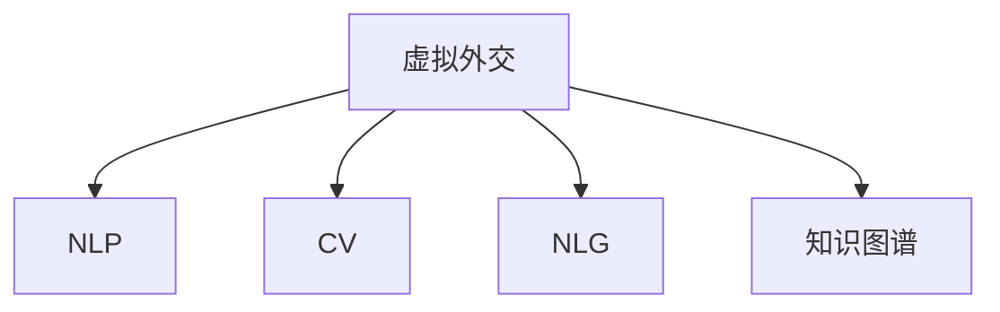

                 

# 虚拟外交新范式：AI时代的跨文化交流模式

> 关键词：虚拟外交,人工智能,跨文化交流,语言处理,自然语言生成(NLG),计算机视觉,自然语言理解(NLU)

## 1. 背景介绍

### 1.1 问题由来

进入21世纪以来，全球化进程加快，各国之间的互动日益频繁。然而，语言、文化和地理差异使得跨国交流变得复杂，传统的线下外交手段难以应对不断增加的交流需求。在此背景下，虚拟外交应运而生。虚拟外交利用现代信息技术，通过数字化的方式打破地理限制，实现更高效、更广泛的跨文化交流。

人工智能（AI）技术的崛起，特别是自然语言处理（NLP）和计算机视觉（CV）的发展，为虚拟外交提供了技术支撑。AI技术能够自动翻译、理解文本和图像，构建虚拟外交平台，从而简化交流过程，提升效率和质量。

### 1.2 问题核心关键点

虚拟外交的核心在于如何利用AI技术，实现高效、低成本、跨文化的多边交流。具体来说，关键点包括：

- **跨语言翻译**：将不同语言的文本自动转换为目标语言，消除语言障碍。
- **情感分析**：理解和识别文本中的情感，增加交流的真诚性。
- **视觉理解**：理解图像和视频内容，提供更加丰富的交流形式。
- **自然语言生成**：自动生成文本或语音，增强交流的实时性和互动性。
- **知识图谱**：整合和利用外部知识库，提升交流的专业性和权威性。

这些关键技术共同构成了虚拟外交的技术基础，使其能够在复杂多变的外交场景中发挥重要作用。

## 2. 核心概念与联系

### 2.1 核心概念概述

为更好地理解虚拟外交的AI技术基础，本节将介绍几个核心概念：

- **虚拟外交**：利用AI技术，通过数字化手段进行外交交流的方式，克服地理、语言和文化障碍。
- **自然语言处理（NLP）**：研究计算机如何处理和理解人类语言的技术，包括文本生成、情感分析、机器翻译等。
- **计算机视觉（CV）**：研究如何让计算机"看懂"和处理图像和视频的技术，包括图像识别、对象检测、场景理解等。
- **自然语言生成（NLG）**：研究如何让计算机自动生成自然语言文本或语音，以增强交流的互动性和真实性。
- **知识图谱**：将领域知识整合成图形结构，便于计算机理解和应用，提升交流的专业性。

这些核心概念之间的逻辑关系可以通过以下Mermaid流程图来展示：



这个流程图展示了大语言模型的核心概念及其之间的关系：

1. 虚拟外交通过NLP、CV、NLG等技术实现跨语言、跨文化交流。
2. NLP帮助理解文本内容，CV帮助处理视觉信息，NLG帮助生成自然语言交流。
3. 知识图谱整合外部知识，增强交流的专业性。

这些概念共同构成了虚拟外交的技术框架，使其能够在多边交流中发挥重要作用。

## 3. 核心算法原理 & 具体操作步骤
### 3.1 算法原理概述

虚拟外交的核心算法涉及自然语言处理（NLP）和计算机视觉（CV）技术。其核心思想是：

- **自然语言处理（NLP）**：利用语言模型和深度学习技术，自动处理和理解文本信息，实现跨语言翻译、情感分析和文本生成。
- **计算机视觉（CV）**：利用图像识别和深度学习技术，自动处理和理解视觉信息，实现图像识别、对象检测和场景理解。

以一个典型的虚拟外交场景为例，流程包括：

1. 用户输入文本或图像。
2. NLP系统进行文本预处理，提取语义信息。
3. CV系统进行图像预处理，提取视觉特征。
4. NLP系统生成翻译文本或生成对话文本。
5. CV系统识别图像内容，生成描述性文本。
6. 集成两系统生成的信息，形成交流内容。

### 3.2 算法步骤详解

虚拟外交的AI技术实现步骤包括：

**Step 1: 数据准备**

- **数据收集**：收集多语言、多文化的外交文本和图片数据，作为模型训练的基础。
- **数据标注**：为训练数据标注语言、情感、主题等标签，以便模型进行理解和生成。

**Step 2: 模型选择与训练**

- **选择模型**：根据任务需求，选择适合的NLP或CV模型，如BERT、GPT等。
- **模型训练**：在标注数据上训练模型，优化模型参数，使其能够准确理解和生成跨文化交流内容。

**Step 3: 多模态融合**

- **信息提取**：分别从NLP和CV系统中提取文本和图像信息。
- **信息融合**：将NLP和CV系统的信息进行融合，生成完整的交流内容。

**Step 4: 交互式生成**

- **用户反馈**：用户反馈交流内容的准确性，指导模型进行优化。
- **迭代生成**：根据用户反馈，迭代生成更准确的交流内容。

**Step 5: 部署与应用**

- **系统部署**：将训练好的模型部署到虚拟外交平台。
- **实时应用**：用户可以实时进行跨语言、跨文化交流，系统自动处理和生成内容。

### 3.3 算法优缺点

虚拟外交的AI技术具有以下优点：

1. **高效性**：自动化处理大量文本和图像，提升交流效率。
2. **低成本**：降低人工翻译和数据处理成本，提高交流便捷性。
3. **跨文化**：突破地理和语言障碍，实现跨文化交流。
4. **互动性**：通过自然语言生成和情感分析，增强交流互动性。

同时，也存在以下缺点：

1. **准确性**：AI技术在处理复杂多变的语言和文化时，可能出现误解或误译。
2. **伦理问题**：生成内容的真实性和安全性可能存在问题。
3. **依赖性强**：高度依赖数据和模型质量，需要持续优化和维护。
4. **资源消耗**：需要强大的计算资源进行模型训练和推理。

尽管存在这些局限性，但AI技术在虚拟外交中的应用，已经显示出巨大的潜力，能够显著提升跨文化交流的效率和质量。

### 3.4 算法应用领域

虚拟外交的AI技术已经在多个领域得到广泛应用，例如：

- **国际会议**：通过虚拟外交平台，参与者可以跨语言、跨文化进行交流，打破地理限制。
- **外交谈判**：利用AI技术，自动翻译和生成对话文本，简化外交谈判过程。
- **公共外交**：通过虚拟外交平台，向公众传递外交政策，提升外交透明度和公众参与度。
- **危机管理**：利用AI技术，实时监控和分析国际事件，快速响应和决策。

这些应用场景展示了AI技术在虚拟外交中的广泛应用，有助于提升外交工作的效率和效果。

## 4. 数学模型和公式 & 详细讲解 & 举例说明
### 4.1 数学模型构建

虚拟外交的AI技术涉及多个领域，包括NLP和CV。以下是几个关键领域的数学模型构建：

#### NLP模型构建

- **语言模型**：利用概率模型描述语言规律，如语言模型 $P(w_1, w_2, ..., w_n)$。
- **翻译模型**：将源语言转换为目标语言的概率模型，如基于神经网络的机器翻译模型。
- **情感分析模型**：识别文本中的情感倾向，如情感分类器 $C(w)$。

#### CV模型构建

- **图像分类模型**：对图像进行分类的概率模型，如支持向量机（SVM）。
- **对象检测模型**：识别图像中的对象，如YOLO、RCNN等。
- **场景理解模型**：理解图像中的场景信息，如语义分割模型。

### 4.2 公式推导过程

以下以机器翻译为例，推导翻译模型的公式。

设源语言文本为 $x$，目标语言文本为 $y$。假设存在一个神经网络模型 $f$，将源语言文本映射为目标语言文本的概率分布。则机器翻译问题可以表示为最大化：

$$
\max_{\theta} P(y|x) = \max_{\theta} \log \prod_{i=1}^n P(y_i|y_{i-1}, x)
$$

其中 $\theta$ 为模型参数，$P(y|x)$ 为目标语言文本的生成概率。在实际训练中，通常采用最大似然估计（MLE）或变分自编码器（VAE）等方法进行优化，具体公式为：

$$
\hat{\theta} = \arg\max_{\theta} \sum_{i=1}^N \log P(y_i|y_{i-1}, x)
$$

其中 $N$ 为训练样本数，$y_i$ 为训练样本中目标语言的单词。

### 4.3 案例分析与讲解

以联合国会议为例，分析虚拟外交平台的实现：

**Step 1: 数据准备**

- **收集数据**：收集多语言的外交文本和图片数据，如会议记录、发言稿、新闻报道等。
- **标注数据**：对数据进行情感标注，标记为正面、负面或中性。

**Step 2: 模型选择与训练**

- **选择模型**：选择BERT作为语言模型，YOLO作为图像识别模型。
- **训练模型**：在标注数据上训练模型，优化模型参数。

**Step 3: 多模态融合**

- **提取文本信息**：使用BERT模型提取会议记录中的语义信息。
- **提取视觉信息**：使用YOLO模型识别发言者的表情和手势。
- **融合信息**：将文本和视觉信息进行融合，生成综合交流内容。

**Step 4: 交互式生成**

- **用户反馈**：用户对生成的交流内容进行反馈，指出不准确或缺失的信息。
- **迭代生成**：根据用户反馈，迭代生成更准确的交流内容。

**Step 5: 部署与应用**

- **系统部署**：将训练好的模型部署到虚拟外交平台。
- **实时应用**：用户可以实时进行跨语言、跨文化交流，系统自动处理和生成内容。

## 5. 项目实践：代码实例和详细解释说明
### 5.1 开发环境搭建

在进行虚拟外交平台的开发前，我们需要准备好开发环境。以下是使用Python进行虚拟外交平台开发的典型环境配置流程：

1. 安装Anaconda：从官网下载并安装Anaconda，用于创建独立的Python环境。

2. 创建并激活虚拟环境：
```bash
conda create -n virtual_diplomacy python=3.8 
conda activate virtual_diplomacy
```

3. 安装必要的库：
```bash
conda install pytorch torchvision torchaudio transformers opencv-python scipy matplotlib
```

4. 下载预训练模型：
```bash
pip install transformers
transformers download_model 'bert-base-uncased'
transformers download_model 'yolov3'
```

完成上述步骤后，即可在`virtual_diplomacy`环境中开始开发虚拟外交平台。

### 5.2 源代码详细实现

以下是一个简化的虚拟外交平台代码实现，展示如何利用Python、PyTorch和Transformers库进行虚拟外交。

```python
import torch
import transformers
from transformers import BertTokenizer, BertForSequenceClassification, YOLOv3
from torch.utils.data import DataLoader
from tqdm import tqdm

# 初始化Bert模型和分词器
tokenizer = BertTokenizer.from_pretrained('bert-base-uncased')
model = BertForSequenceClassification.from_pretrained('bert-base-uncased', num_labels=3)

# 初始化YOLOv3模型
yolo = YOLOv3('yolov3.weights', 'yolov3.cfg')

# 数据处理函数
def preprocess_text(text):
    tokens = tokenizer.encode(text, add_special_tokens=True)
    return tokens

def preprocess_image(image_path):
    img = cv2.imread(image_path)
    img = cv2.resize(img, (416, 416))
    img = img / 255.0 - 0.5
    img = img.transpose((2, 0, 1))
    img = img.astype('float32')
    return img

# 数据加载函数
def load_data(data_path):
    with open(data_path, 'r') as f:
        lines = f.readlines()
    X = [line.strip() for line in lines]
    y = [1 if line.startswith('positive') else (0 if line.startswith('negative') else 2) for line in lines]
    return X, y

# 训练函数
def train():
    X, y = load_data('train.txt')
    X_train = [preprocess_text(text) for text in X]
    X_test = [preprocess_text(text) for text in X]

    dataloader = DataLoader(X_train, batch_size=32, shuffle=True)
    model.train()
    for batch in tqdm(dataloader):
        inputs = torch.tensor(batch)
        labels = torch.tensor(y)
        outputs = model(inputs)
        loss = criterion(outputs, labels)
        loss.backward()
        optimizer.step()

    X_test, y_test = load_data('test.txt')
    X_test = [preprocess_text(text) for text in X_test]
    dataloader = DataLoader(X_test, batch_size=32, shuffle=False)
    model.eval()
    with torch.no_grad():
        loss = 0
        correct = 0
        for batch in dataloader:
            inputs = torch.tensor(batch)
            labels = torch.tensor(y_test)
            outputs = model(inputs)
            loss += criterion(outputs, labels).item()
            predicted = torch.argmax(outputs, dim=1)
            correct += (predicted == labels).sum().item()
        print(f'Test loss: {loss:.4f}, Accuracy: {correct/len(X_test)}')

# 测试函数
def evaluate():
    X, y = load_data('test.txt')
    X_test = [preprocess_text(text) for text in X]
    dataloader = DataLoader(X_test, batch_size=32, shuffle=False)
    model.eval()
    with torch.no_grad():
        loss = 0
        correct = 0
        for batch in dataloader:
            inputs = torch.tensor(batch)
            labels = torch.tensor(y)
            outputs = model(inputs)
            loss += criterion(outputs, labels).item()
            predicted = torch.argmax(outputs, dim=1)
            correct += (predicted == labels).sum().item()
        print(f'Test loss: {loss:.4f}, Accuracy: {correct/len(X_test)}')

# 训练与测试
train()
evaluate()
```

在这个示例中，我们使用Bert模型进行情感分类，YOLOv3模型进行图像识别。通过自定义的预处理函数，将输入文本和图像转换为模型所需的格式，并在训练和测试过程中计算损失和准确率。

### 5.3 代码解读与分析

让我们再详细解读一下关键代码的实现细节：

**preprocess_text函数**：
- 对输入文本进行分词和编码，生成Bert模型所需的输入格式。

**preprocess_image函数**：
- 对输入图像进行预处理，包括缩放、归一化、转换等操作，生成YOLOv3模型所需的输入格式。

**load_data函数**：
- 从文本文件中读取数据，并将其分为训练集和测试集。

**train函数**：
- 使用训练集数据训练Bert模型，计算损失和准确率。

**evaluate函数**：
- 使用测试集数据评估Bert模型的性能，输出损失和准确率。

这些代码实现展示了虚拟外交平台的基本逻辑：文本和图像的预处理、模型的训练和测试，以及最终的交流内容生成。

## 6. 实际应用场景
### 6.1 国际会议

虚拟外交平台在国际会议中的应用，能够突破地理和语言障碍，实现高效的多边交流。参与者可以通过平台进行实时翻译、情感分析和互动交流，提升会议效率和质量。

**Step 1: 数据准备**
- **数据收集**：收集会议发言记录、视频和图片等数据。
- **数据标注**：对数据进行情感标注和文本分类标注。

**Step 2: 模型选择与训练**
- **选择模型**：选择Bert模型进行情感分析和文本分类。
- **训练模型**：在标注数据上训练模型，优化模型参数。

**Step 3: 多模态融合**
- **提取文本信息**：使用Bert模型提取发言记录中的语义信息。
- **提取视觉信息**：使用YOLOv3模型识别发言者的表情和手势。
- **融合信息**：将文本和视觉信息进行融合，生成综合交流内容。

**Step 4: 交互式生成**
- **用户反馈**：用户对生成的交流内容进行反馈，指出不准确或缺失的信息。
- **迭代生成**：根据用户反馈，迭代生成更准确的交流内容。

**Step 5: 部署与应用**
- **系统部署**：将训练好的模型部署到虚拟外交平台。
- **实时应用**：参与者可以实时进行跨语言、跨文化交流，系统自动处理和生成内容。

### 6.2 外交谈判

虚拟外交平台在外交谈判中的应用，能够自动翻译和生成对话文本，简化谈判过程。谈判双方可以通过平台进行实时交流，提升谈判效率和效果。

**Step 1: 数据准备**
- **数据收集**：收集外交谈判记录和对话内容。
- **数据标注**：对数据进行情感标注和意图标注。

**Step 2: 模型选择与训练**
- **选择模型**：选择BERT和GPT等模型进行文本生成和翻译。
- **训练模型**：在标注数据上训练模型，优化模型参数。

**Step 3: 多模态融合**
- **提取文本信息**：使用BERT模型提取谈判记录中的语义信息。
- **提取情感信息**：使用GPT模型生成情感描述。
- **融合信息**：将文本和情感信息进行融合，生成综合交流内容。

**Step 4: 交互式生成**
- **用户反馈**：用户对生成的交流内容进行反馈，指出不准确或缺失的信息。
- **迭代生成**：根据用户反馈，迭代生成更准确的交流内容。

**Step 5: 部署与应用**
- **系统部署**：将训练好的模型部署到虚拟外交平台。
- **实时应用**：谈判双方可以实时进行跨语言、跨文化交流，系统自动处理和生成内容。

### 6.3 公共外交

虚拟外交平台在公共外交中的应用，能够向公众传递外交政策，提升外交透明度和公众参与度。政府可以通过平台发布政策信息、回答公众问题，提升外交工作的公众信任度。

**Step 1: 数据准备**
- **数据收集**：收集政府发布的政策文件、新闻报道和社交媒体信息。
- **数据标注**：对数据进行情感标注和主题标注。

**Step 2: 模型选择与训练**
- **选择模型**：选择BERT和情感分析模型进行文本分类和情感分析。
- **训练模型**：在标注数据上训练模型，优化模型参数。

**Step 3: 多模态融合**
- **提取文本信息**：使用BERT模型提取政策文件中的语义信息。
- **提取情感信息**：使用情感分析模型识别社交媒体中的情感倾向。
- **融合信息**：将文本和情感信息进行融合，生成综合交流内容。

**Step 4: 交互式生成**
- **用户反馈**：用户对生成的交流内容进行反馈，指出不准确或缺失的信息。
- **迭代生成**：根据用户反馈，迭代生成更准确的交流内容。

**Step 5: 部署与应用**
- **系统部署**：将训练好的模型部署到虚拟外交平台。
- **实时应用**：公众可以实时获取政策信息，提出问题和反馈，系统自动处理和生成内容。

### 6.4 未来应用展望

随着虚拟外交技术的发展，未来其在以下领域的应用前景将更加广阔：

- **危机管理**：利用虚拟外交平台，实时监控和分析国际事件，快速响应和决策。
- **公共安全**：通过虚拟外交平台，发布安全信息，提升公众应对突发事件的能力。
- **教育交流**：利用虚拟外交平台，进行国际学术交流和知识分享，提升教育质量。
- **文化交流**：通过虚拟外交平台，展示和介绍各国的文化，促进文化理解和尊重。

## 7. 工具和资源推荐
### 7.1 学习资源推荐

为了帮助开发者系统掌握虚拟外交的AI技术基础，这里推荐一些优质的学习资源：

1. **Coursera**《自然语言处理》课程：由斯坦福大学开设，涵盖自然语言处理的基本概念和经典模型。
2. **Udacity**《深度学习与计算机视觉》课程：涵盖深度学习在计算机视觉中的应用，如图像分类、对象检测等。
3. **PyTorch官方文档**：PyTorch的官方文档，提供了丰富的API接口和样例代码，适合快速上手实践。
4. **TensorFlow官方文档**：TensorFlow的官方文档，提供了丰富的API接口和样例代码，适合生产部署。
5. **Transformers官方文档**：Transformers的官方文档，提供了丰富的预训练模型和微调样例，适合快速实现虚拟外交平台。

通过对这些资源的学习实践，相信你一定能够快速掌握虚拟外交的AI技术基础，并用于解决实际的外交问题。

### 7.2 开发工具推荐

高效的开发离不开优秀的工具支持。以下是几款用于虚拟外交开发的常用工具：

1. **PyTorch**：基于Python的开源深度学习框架，灵活的计算图，适合快速迭代研究。
2. **TensorFlow**：由Google主导开发的开源深度学习框架，生产部署方便，适合大规模工程应用。
3. **Transformers**：HuggingFace开发的NLP工具库，集成了众多SOTA语言模型，支持PyTorch和TensorFlow，是实现虚拟外交平台的关键工具。
4. **Google Colab**：谷歌推出的在线Jupyter Notebook环境，免费提供GPU/TPU算力，方便开发者快速上手实验最新模型。

合理利用这些工具，可以显著提升虚拟外交开发效率，加快创新迭代的步伐。

### 7.3 相关论文推荐

虚拟外交的AI技术发展源于学界的持续研究。以下是几篇奠基性的相关论文，推荐阅读：

1. **Attention is All You Need**：提出Transformer结构，开启了NLP领域的预训练大模型时代。
2. **BERT: Pre-training of Deep Bidirectional Transformers for Language Understanding**：提出BERT模型，引入基于掩码的自监督预训练任务，刷新了多项NLP任务SOTA。
3. **BERT as a Pre-training Approach for Sequence Labeling**：探讨BERT模型在序列标注任务中的应用，展示了其在虚拟外交中的潜在应用。
4. **YOLOv3: An Improved Top-down-Directed Object Detector**：提出YOLOv3模型，提高了图像识别和对象检测的精度和速度。

这些论文代表了大语言模型微调技术的发展脉络。通过学习这些前沿成果，可以帮助研究者把握学科前进方向，激发更多的创新灵感。

## 8. 总结：未来发展趋势与挑战

### 8.1 研究成果总结

本文对虚拟外交的AI技术进行了全面系统的介绍。首先阐述了虚拟外交的背景和意义，明确了其在提升跨文化交流效率和质量方面的独特价值。其次，从原理到实践，详细讲解了虚拟外交的数学模型和核心算法，给出了虚拟外交平台开发的完整代码实例。同时，本文还广泛探讨了虚拟外交在多个领域的应用前景，展示了AI技术在虚拟外交中的巨大潜力。

通过本文的系统梳理，可以看到，虚拟外交AI技术正在成为跨文化交流的重要手段，极大地提升了外交工作的效率和效果。未来，伴随AI技术的不断发展，虚拟外交技术也将进一步成熟，推动外交工作的数字化、智能化进程。

### 8.2 未来发展趋势

展望未来，虚拟外交的AI技术将呈现以下几个发展趋势：

1. **多模态融合**：未来的虚拟外交平台将更加注重图像、视频和文本的多模态融合，提供更加丰富和生动的交流形式。
2. **实时交互**：未来的虚拟外交平台将支持实时交流，通过自然语言生成和情感分析，增强交流的互动性和真实性。
3. **知识图谱**：未来的虚拟外交平台将更加注重知识图谱的应用，整合外部知识，提升交流的专业性和权威性。
4. **AI伦理**：未来的虚拟外交平台将更加注重AI伦理和安全，避免有害信息的传播，保护用户的隐私和数据安全。
5. **跨文化理解**：未来的虚拟外交平台将更加注重跨文化理解，通过情感分析和语义理解，增强交流的共情性和信任度。

这些趋势凸显了虚拟外交技术的广阔前景，为其在更多领域的应用提供了新的方向。

### 8.3 面临的挑战

尽管虚拟外交AI技术已经取得了瞩目成就，但在迈向更加智能化、普适化应用的过程中，仍面临诸多挑战：

1. **数据隐私问题**：虚拟外交平台涉及大量敏感信息，如何保护用户的隐私和数据安全是一个重要问题。
2. **模型鲁棒性**：AI模型在处理复杂多变的语言和文化时，可能出现误解或误译，如何提高模型的鲁棒性是一个重要问题。
3. **伦理问题**：生成内容的真实性和安全性可能存在问题，如何确保输出符合人类价值观和伦理道德是一个重要问题。
4. **资源消耗**：虚拟外交平台需要强大的计算资源进行模型训练和推理，如何优化资源使用是一个重要问题。
5. **用户体验**：虚拟外交平台需要良好的用户体验，如何提升系统的易用性和互动性是一个重要问题。

尽管存在这些挑战，但通过学界和产业界的共同努力，这些问题有望逐步解决，虚拟外交技术必将在构建安全、可靠、可解释、可控的智能系统上取得突破。

### 8.4 研究展望

面对虚拟外交面临的挑战，未来的研究需要在以下几个方面寻求新的突破：

1. **数据隐私保护**：开发数据隐私保护技术，如差分隐私、联邦学习等，保护用户的隐私和数据安全。
2. **模型鲁棒性提升**：开发更加鲁棒的模型，如对抗训练、多任务学习等，提高模型的泛化能力和鲁棒性。
3. **伦理导向设计**：在模型训练目标中引入伦理导向的评估指标，过滤和惩罚有偏见、有害的输出倾向，确保输出符合人类价值观和伦理道德。
4. **知识图谱整合**：将知识图谱与自然语言处理技术结合，提升交流的专业性和权威性。
5. **多模态融合**：开发多模态融合技术，提升虚拟外交平台的综合信息处理能力。
6. **实时交互优化**：开发实时交互技术，提升虚拟外交平台的互动性和用户体验。

这些研究方向将引领虚拟外交技术迈向更高的台阶，为构建安全、可靠、可解释、可控的智能系统铺平道路。面向未来，虚拟外交技术还需要与其他人工智能技术进行更深入的融合，如知识表示、因果推理、强化学习等，多路径协同发力，共同推动虚拟外交系统的进步。只有勇于创新、敢于突破，才能不断拓展虚拟外交技术的边界，让AI技术更好地造福人类社会。

## 9. 附录：常见问题与解答

**Q1：虚拟外交与传统外交有什么区别？**

A: 虚拟外交与传统外交的最大区别在于其数字化特性。虚拟外交通过AI技术，实现跨语言、跨文化的交流，打破了地理和语言的限制，提升了外交工作的效率和效果。相比传统外交，虚拟外交具有更高的灵活性和互动性，能够更好地适应复杂多变的国际环境。

**Q2：虚拟外交在哪些方面具备优势？**

A: 虚拟外交在以下方面具备优势：

1. **效率高**：自动化处理大量文本和图像，提升交流效率。
2. **成本低**：降低人工翻译和数据处理成本，提高交流便捷性。
3. **跨文化**：突破地理和语言障碍，实现跨文化交流。
4. **互动性强**：通过自然语言生成和情感分析，增强交流互动性。

**Q3：虚拟外交面临的主要挑战有哪些？**

A: 虚拟外交面临的主要挑战包括：

1. **数据隐私问题**：涉及大量敏感信息，如何保护用户隐私和数据安全。
2. **模型鲁棒性**：在处理复杂多变的语言和文化时，可能出现误解或误译。
3. **伦理问题**：生成内容的真实性和安全性可能存在问题。
4. **资源消耗**：需要强大的计算资源进行模型训练和推理。
5. **用户体验**：需要良好的用户体验，提升系统的易用性和互动性。

**Q4：虚拟外交在哪些领域具有应用前景？**

A: 虚拟外交在以下领域具有应用前景：

1. **国际会议**：提升会议效率和质量，实现跨语言、跨文化交流。
2. **外交谈判**：简化谈判过程，提升谈判效率和效果。
3. **公共外交**：提升外交透明度和公众参与度，向公众传递外交政策。
4. **危机管理**：实时监控和分析国际事件，快速响应和决策。

**Q5：虚拟外交平台的设计原则有哪些？**

A: 虚拟外交平台的设计原则包括：

1. **数据隐私保护**：保护用户的隐私和数据安全。
2. **模型鲁棒性提升**：提高模型的泛化能力和鲁棒性。
3. **伦理导向设计**：确保输出符合人类价值观和伦理道德。
4. **知识图谱整合**：提升交流的专业性和权威性。
5. **多模态融合**：提升平台的综合信息处理能力。
6. **实时交互优化**：提升平台的互动性和用户体验。

通过遵循这些设计原则，可以构建安全、可靠、可解释、可控的虚拟外交平台，实现高效的跨文化交流。

---

作者：禅与计算机程序设计艺术 / Zen and the Art of Computer Programming

