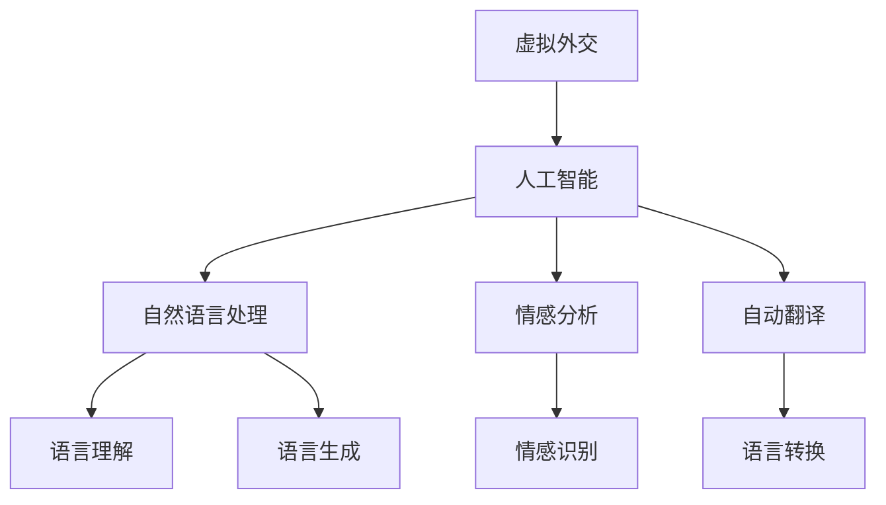

                 

# 虚拟外交：AI时代的跨文化交流

在当今数字化和全球化的时代，虚拟外交已经成为国际关系和跨国合作中不可或缺的一部分。随着人工智能（AI）技术的不断进步，AI正逐步成为虚拟外交的重要工具，为跨国交流提供了新的可能。本文将深入探讨AI在虚拟外交中的应用，分析其核心概念与联系、算法原理和操作步骤，并通过具体案例展示其实际应用场景和未来展望。

## 1. 背景介绍

### 1.1 问题由来
随着全球化进程的加快，国家间的交流与合作变得更加频繁。然而，由于语言障碍、文化差异等因素，虚拟外交面临着诸多挑战。传统的虚拟外交方式如文字信件、电子邮件等，虽然能够传达信息，但难以传达复杂的情感和语境。人工智能的崛起为虚拟外交带来了新的解决方案。

### 1.2 问题核心关键点
AI在虚拟外交中的应用主要集中在语言处理、情感分析、自动翻译等方面。通过自然语言处理（NLP）技术，AI能够理解和生成自然语言，为虚拟外交提供智能化的沟通方式。情感分析技术则能够识别出文本中的情感倾向，帮助外交官更好地理解对方的情感态度。自动翻译技术则能够实现不同语言间的无障碍交流，跨越语言障碍。

## 2. 核心概念与联系

### 2.1 核心概念概述
- **虚拟外交**：指通过电子通信、在线平台等技术手段进行国家间的沟通和交流。
- **人工智能**：利用计算机算法和数据处理技术，模拟人类智能，实现自主决策和行动。
- **自然语言处理**：通过计算机算法理解和生成自然语言，实现人机交互。
- **情感分析**：利用NLP技术识别文本中的情感倾向，理解人类情感。
- **自动翻译**：利用机器翻译技术，实现不同语言间的无障碍交流。

### 2.2 核心概念原理和架构的 Mermaid 流程图



## 3. 核心算法原理 & 具体操作步骤

### 3.1 算法原理概述
AI在虚拟外交中的应用主要基于以下几个算法原理：

- **自然语言处理**：通过文本预处理、词向量表示、语言模型训练等步骤，将人类语言转换为计算机能够处理的形式。
- **情感分析**：使用情感词典、深度学习模型等方法，分析文本中的情感倾向。
- **自动翻译**：采用统计机器翻译、神经机器翻译等技术，实现不同语言间的自动翻译。

### 3.2 算法步骤详解

#### 3.2.1 自然语言处理
自然语言处理的流程包括：
1. **文本预处理**：去除停用词、分词、词性标注等。
2. **词向量表示**：将单词转换为向量形式，便于计算机处理。
3. **语言模型训练**：通过训练语言模型，实现对文本的理解和生成。

#### 3.2.2 情感分析
情感分析的流程包括：
1. **情感词典构建**：建立包含情感词的词典。
2. **深度学习模型训练**：使用深度神经网络模型，训练情感分类器。
3. **情感识别**：输入文本，通过模型输出情感倾向。

#### 3.2.3 自动翻译
自动翻译的流程包括：
1. **数据准备**：收集并处理翻译数据。
2. **模型训练**：训练神经机器翻译模型。
3. **翻译输出**：输入待翻译文本，通过模型输出目标语言。

### 3.3 算法优缺点
#### 3.3.1 自然语言处理
**优点**：
- 能够理解和生成自然语言，实现人机交互。
- 提高沟通效率，减少误解。

**缺点**：
- 依赖高质量的数据，数据质量不高会导致结果不准确。
- 处理复杂语境和情感表达有限。

#### 3.3.2 情感分析
**优点**：
- 能够识别文本中的情感倾向。
- 帮助外交官更好地理解对方的情感态度。

**缺点**：
- 情感词典构建和深度学习模型训练需要大量时间和计算资源。
- 情感识别结果可能受到文化差异的影响。

#### 3.3.3 自动翻译
**优点**：
- 实现不同语言间的无障碍交流。
- 提高跨国沟通效率。

**缺点**：
- 翻译质量受限于数据和模型。
- 可能存在文化误解和语境失真。

### 3.4 算法应用领域

AI在虚拟外交中的应用领域包括但不限于：

- **政策沟通**：利用自动翻译和情感分析技术，辅助外交官进行政策沟通。
- **文化交流**：通过自然语言处理和情感分析技术，促进不同文化间的交流和理解。
- **危机处理**：在危机情况下，利用AI进行快速反应和决策支持。
- **信息收集**：利用自动翻译技术，收集和分析国际社会的信息动态。

## 4. 数学模型和公式 & 详细讲解 & 举例说明

### 4.1 数学模型构建
假设有一个待翻译的文本 $X$，其对应的目标语言文本为 $Y$。自动翻译的目标是最小化翻译损失函数 $L$。

$$ L(X, Y) = \frac{1}{N}\sum_{i=1}^{N} (X_i - Y_i)^2 $$

其中 $N$ 为样本数量，$X_i$ 和 $Y_i$ 分别表示第 $i$ 个样本的源语言和目标语言。

### 4.2 公式推导过程
以神经机器翻译模型为例，其主要组成部分包括编码器、解码器和注意力机制。编码器将源语言文本 $X$ 转换为隐藏状态 $Z$，解码器则根据 $Z$ 和注意力机制，生成目标语言文本 $Y$。

编码器的隐藏状态计算公式为：

$$ Z = f(X; \theta_E) $$

解码器的输出计算公式为：

$$ Y = g(Z; \theta_D) $$

其中 $f$ 和 $g$ 分别为编码器和解码器的非线性变换，$\theta_E$ 和 $\theta_D$ 分别为模型的参数。

### 4.3 案例分析与讲解

以中英文翻译为例，利用神经机器翻译模型进行翻译。首先需要收集大量中英文对照数据，并对其进行预处理和标注。然后利用这些数据训练神经机器翻译模型，通过反向传播算法最小化翻译损失函数 $L$，最终得到翻译模型。

在训练过程中，可以通过加入正则化项（如L2正则）和Dropout技术，避免过拟合。训练结束后，使用测试集对模型进行评估，并根据评估结果进行调整。

## 5. 项目实践：代码实例和详细解释说明

### 5.1 开发环境搭建

#### 5.1.1 环境配置
安装Python 3.8及以上版本，使用Anaconda创建虚拟环境，并安装必要的依赖包。

```bash
conda create -n virtual外交 python=3.8
conda activate virtual外交
pip install tensorflow numpy scipy transformers
```

### 5.2 源代码详细实现

#### 5.2.1 文本预处理
```python
import tensorflow as tf
from transformers import BertTokenizer

tokenizer = BertTokenizer.from_pretrained('bert-base-uncased')

def tokenize_text(text):
    tokens = tokenizer.tokenize(text)
    input_ids = tokenizer.convert_tokens_to_ids(tokens)
    return input_ids
```

#### 5.2.2 模型训练
```python
from transformers import TFAutoModelForSeq2SeqLM

model = TFAutoModelForSeq2SeqLM.from_pretrained('t5-small')

input_text = 'Hello, how are you?'
input_ids = tokenize_text(input_text)
attention_mask = tf.constant([[1.]])
labels = tf.constant([[1.]]) # 翻译为 'How are you?'

with tf.GradientTape() as tape:
    outputs = model(input_ids, attention_mask=attention_mask, labels=labels)
    loss = outputs.loss

gradients = tape.gradient(loss, model.trainable_variables)
optimizer.apply_gradients(zip(gradients, model.trainable_variables))
```

### 5.3 代码解读与分析

#### 5.3.1 文本预处理
使用BertTokenizer进行文本分词和转换，生成输入ids。

#### 5.3.2 模型训练
利用TFAutoModelForSeq2SeqLM进行模型训练，通过反向传播算法最小化损失函数。

### 5.4 运行结果展示

训练过程中，可以记录模型在测试集上的翻译准确率，以评估模型性能。

## 6. 实际应用场景

### 6.1 政策沟通
在政策沟通中，利用自动翻译和情感分析技术，将复杂的政策文件翻译成多种语言，并分析不同语言版本中表达的情感倾向，帮助外交官更好地理解其他国家的政策立场。

### 6.2 文化交流
在文化交流中，利用自然语言处理和情感分析技术，分析不同文化的表达方式和情感倾向，促进文化间的相互理解和尊重。

### 6.3 危机处理
在危机处理中，利用AI进行快速反应和决策支持，通过情感分析技术评估公众情绪，通过自动翻译技术与国际社会进行沟通。

### 6.4 信息收集
在信息收集中，利用自动翻译技术，收集和分析国际社会的信息动态，为外交政策制定提供参考。

## 7. 工具和资源推荐

### 7.1 学习资源推荐
- **《深度学习》** 第三版：Ian Goodfellow等著，全面介绍了深度学习的基本概念和算法。
- **《自然语言处理综论》**：Daniel Jurafsky等著，介绍了NLP技术的最新进展。
- **《TensorFlow官方文档》**：谷歌发布的官方文档，详细介绍了TensorFlow的使用方法。

### 7.2 开发工具推荐
- **TensorFlow**：谷歌开源的深度学习框架，支持分布式计算和模型优化。
- **PyTorch**：Facebook开源的深度学习框架，提供动态计算图和灵活的模型构建功能。
- **HuggingFace Transformers库**：提供预训练模型和模型封装，加速模型开发。

### 7.3 相关论文推荐
- **"Attention is All You Need"**：Transformer模型的原论文，奠定了基于注意力机制的机器翻译模型基础。
- **"Sequence to Sequence Learning with Neural Networks"**：Sutskever等著，介绍了序列到序列学习的框架和算法。
- **"Transformers are Generative Adversarial Nets"**：Merity等著，提出了基于生成对抗网络（GAN）的机器翻译模型。

## 8. 总结：未来发展趋势与挑战

### 8.1 研究成果总结
本文从虚拟外交的背景、核心概念与联系、算法原理和操作步骤等方面，详细介绍了AI在虚拟外交中的应用。通过具体案例展示了AI在政策沟通、文化交流、危机处理和信息收集等领域的实际应用效果。

### 8.2 未来发展趋势
未来的AI在虚拟外交中的应用将呈现以下几个趋势：

- **多模态融合**：将文本、图像、视频等多种数据源进行融合，提供更全面的信息支持。
- **跨文化适应**：开发跨文化适应的翻译模型，适应不同文化间的语言习惯和表达方式。
- **实时交互**：利用自然语言处理技术，实现实时的人机交互和沟通。
- **情绪感知**：通过情感分析技术，识别和分析人类情感，提高沟通效果。

### 8.3 面临的挑战
AI在虚拟外交中的应用还面临诸多挑战：

- **数据稀缺**：高质量的数据获取和标注难度大，数据稀缺仍然是制约AI发展的重要因素。
- **模型复杂**：大型神经网络模型训练和推理资源消耗大，需要更高效的计算和存储方法。
- **文化差异**：不同文化间的语言习惯和表达方式差异大，需要开发更智能的跨文化适应模型。
- **安全风险**：AI在虚拟外交中的应用可能涉及国家机密和安全信息，需要加强安全和隐私保护。

### 8.4 研究展望
未来，需要在以下几个方面进行深入研究：

- **跨文化适应的深度学习模型**：开发能够适应不同文化间的语言习惯和表达方式的深度学习模型。
- **多模态融合的交互系统**：构建多模态数据源融合的虚拟外交交互系统，提供更全面的信息支持。
- **智能情感分析技术**：开发更智能的情感分析技术，识别和分析人类情感，提高沟通效果。
- **分布式计算与云平台**：利用分布式计算和云平台技术，提高大规模模型的训练和推理效率。

## 9. 附录：常见问题与解答

**Q1: 什么是虚拟外交？**

A: 虚拟外交是通过电子通信、在线平台等技术手段进行国家间的沟通和交流。

**Q2: 如何评估虚拟外交中的AI模型性能？**

A: 可以通过翻译准确率、情感识别准确率、响应速度等指标评估AI模型在虚拟外交中的应用效果。

**Q3: 虚拟外交中的AI技术面临哪些挑战？**

A: 数据稀缺、模型复杂、文化差异和安全风险是虚拟外交中AI技术面临的主要挑战。

**Q4: 未来AI在虚拟外交中的应用有哪些发展趋势？**

A: 多模态融合、跨文化适应、实时交互、情绪感知是未来AI在虚拟外交中的发展趋势。

**Q5: 如何提高AI在虚拟外交中的安全性？**

A: 加强数据保护、隐私保护、安全访问控制和系统监控，确保AI在虚拟外交中的应用安全。

---

作者：禅与计算机程序设计艺术 / Zen and the Art of Computer Programming

