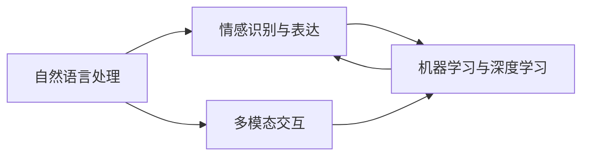

                 

# 虚拟情绪调节器工程师：AI驱动的心理健康技术专家

## 1. 背景介绍

### 1.1 问题由来
现代生活节奏加快、竞争激烈，人们常常面对压力、焦虑、抑郁等情绪问题。这些心理问题不仅影响个体生活质量，还可能对社会稳定造成威胁。心理健康技术已成为全球关注焦点，通过AI手段辅助进行心理调节，显得尤为重要。虚拟情绪调节器是一种通过AI技术模拟情感互动，帮助用户进行情绪管理的智能应用。本文旨在探讨虚拟情绪调节器背后的核心技术，分析其工作原理和应用场景，为心理健康领域的技术创新提供参考。

### 1.2 问题核心关键点
虚拟情绪调节器核心技术包括自然语言处理(NLP)、情感识别与表达、机器学习、深度学习等。其工作流程包括：
- **自然语言处理**：解析用户输入，提取情绪信息。
- **情感识别与表达**：识别用户情绪状态，并通过AI生成合适回复。
- **机器学习与深度学习**：利用历史数据训练模型，提升情绪识别的准确性。
- **多模态交互**：结合文字、语音、图像等多种模态，提升互动效果。

## 2. 核心概念与联系

### 2.1 核心概念概述

为更好地理解虚拟情绪调节器的技术基础，本文将介绍几个关键概念：

- **自然语言处理(NLP)**：利用AI技术处理、分析和生成人类语言。
- **情感识别与表达**：通过AI识别用户情绪，生成回应以调节情绪。
- **机器学习与深度学习**：利用数据训练模型，提升情感识别的精确度。
- **多模态交互**：结合文字、语音、图像等多种信息形式，提升用户体验。

这些概念之间的联系可以通过以下Mermaid流程图表示：



这个流程图展示了一些核心概念之间的关联：自然语言处理解析用户输入，情感识别与表达根据输入生成响应，机器学习与深度学习通过数据提升识别精度，多模态交互提升互动效果。这些技术共同构建了虚拟情绪调节器的基础框架。

## 3. 核心算法原理 & 具体操作步骤

### 3.1 算法原理概述

虚拟情绪调节器通过AI技术，模拟情感互动，帮助用户进行情绪管理。其核心算法原理包括：

- **情感分类算法**：利用机器学习模型识别用户情绪类别，如快乐、悲伤、愤怒等。
- **生成式对话模型**：使用深度学习模型生成合适的回复，以调节用户情绪。
- **多模态交互模型**：结合文字、语音、图像等不同模态信息，提升互动效果。

### 3.2 算法步骤详解

以下详细介绍虚拟情绪调节器的算法步骤：

**Step 1: 数据收集与预处理**

- **文本数据收集**：收集用户输入的文本数据，如聊天记录、社交媒体内容等。
- **文本清洗**：去除无关信息，如无意义单词、特殊字符等。
- **情感标注**：通过人工标注或自动化算法，为文本数据添加情感标签。

**Step 2: 情感分类模型训练**

- **特征提取**：使用词袋模型、TF-IDF等方法提取文本特征。
- **模型训练**：利用训练数据训练情感分类模型，如SVM、RNN、BERT等。
- **模型评估**：使用验证集评估模型性能，调整参数优化模型。

**Step 3: 生成式对话模型训练**

- **回复生成**：利用Seq2Seq模型、Transformer等架构生成回复文本。
- **训练数据**：选择与用户情绪相关的对话数据进行训练。
- **模型评估**：使用BLEU、ROUGE等指标评估回复质量。

**Step 4: 多模态交互模型构建**

- **视觉信息融合**：通过图像识别技术，分析用户面部表情、身体姿态等视觉信息。
- **语音信息融合**：通过语音识别技术，分析用户语音的语调、语速等语音特征。
- **综合处理**：将文本、视觉、语音信息综合处理，提升交互效果。

**Step 5: 应用部署**

- **用户界面**：开发交互式用户界面，支持文字、语音输入与输出。
- **系统集成**：将训练好的模型集成到应用系统中，提供实时情绪调节服务。
- **持续优化**：通过用户反馈，不断优化模型性能。

### 3.3 算法优缺点

虚拟情绪调节器具有以下优点：

- **实时性**：通过在线实时处理用户输入，提供即时的情绪调节服务。
- **个性化**：根据用户历史数据和情绪状态，提供个性化的情绪调节建议。
- **可扩展性**：结合多种信息形式，提供多模态交互体验。

同时，其缺点也显而易见：

- **数据依赖**：模型性能依赖于高质量的标注数据，数据获取成本较高。
- **情感识别准确性**：情绪表达复杂多样，情感识别存在一定误差。
- **隐私问题**：收集和处理用户数据涉及隐私保护，需严格遵守法律法规。

### 3.4 算法应用领域

虚拟情绪调节器在多个领域都有广泛应用：

- **心理健康**：为心理健康咨询提供辅助，帮助用户进行情绪管理。
- **教育培训**：在学生心理健康教育中，提供情绪调节和压力缓解服务。
- **职场关怀**：在企业员工心理辅导中，提供情绪支持与调节服务。
- **社交平台**：在社交媒体平台上，提供心理健康支持，缓解用户情绪。
- **应急响应**：在自然灾害、突发事件等紧急情况下，提供情绪支持与干预。

## 4. 数学模型和公式 & 详细讲解  
### 4.1 数学模型构建

虚拟情绪调节器涉及多个数学模型，以下重点介绍情感分类和生成式对话模型的构建：

**情感分类模型**：使用LSTM模型进行情感分类，模型结构如下：

$$
\begin{aligned}
    H &= \text{LSTM}(X; \theta_L) \\
    S &= \text{Softmax}(H; \theta_S) \\
    \hat{y} &= \text{argmax}(S) \\
\end{aligned}
$$

其中，$X$为输入文本，$H$为LSTM模型的隐状态，$S$为情感分类得分向量，$\hat{y}$为情感分类结果。

**生成式对话模型**：使用Transformer模型生成回复，模型结构如下：

$$
\begin{aligned}
    H &= \text{Encoder}(X; \theta_E) \\
    \tilde{Y} &= \text{Decoder}(H; \theta_D) \\
    Y &= \text{Softmax}(\tilde{Y}; \theta_S) \\
    \hat{Y} &= \text{argmax}(Y) \\
\end{aligned}
$$

其中，$X$为输入文本，$H$为编码器输出，$\tilde{Y}$为解码器输出，$Y$为回复得分向量，$\hat{Y}$为回复结果。

### 4.2 公式推导过程

**情感分类模型推导**：情感分类模型的输出通过softmax函数得到概率分布，最后通过argmax函数选取最大概率对应的类别。

**生成式对话模型推导**：生成式对话模型采用Seq2Seq框架，先通过Encoder提取输入特征，再通过Decoder生成回复。Encoder和Decoder通常使用LSTM或Transformer等模型。

### 4.3 案例分析与讲解

**案例1：情感分类**

假设用户输入为“今天天气真糟糕，心情好差啊”，模型首先通过LSTM模型提取特征，然后通过softmax函数得到情感得分，最后选取得分最高的情感类别，即“悲伤”。

**案例2：生成式对话**

假设用户输入为“我最近压力好大，怎么缓解啊”，模型首先通过LSTM模型提取特征，然后通过Transformer模型生成回复，如“你可以去运动一下，或者听听音乐，放松一下心情。”

## 5. 项目实践：代码实例和详细解释说明

### 5.1 开发环境搭建

以下是虚拟情绪调节器开发环境的搭建流程：

1. **安装Python**：确保Python 3.x版本。
2. **安装TensorFlow**：`pip install tensorflow`
3. **安装Keras**：`pip install keras`
4. **安装NLTK**：`pip install nltk`
5. **安装SpeechRecognition**：`pip install SpeechRecognition`

### 5.2 源代码详细实现

**代码示例1：情感分类模型**

```python
from tensorflow.keras.models import Sequential
from tensorflow.keras.layers import LSTM, Dense, Dropout
from tensorflow.keras.optimizers import Adam

model = Sequential()
model.add(LSTM(128, input_shape=(None, ), return_sequences=True))
model.add(Dropout(0.2))
model.add(LSTM(128))
model.add(Dropout(0.2))
model.add(Dense(3, activation='softmax'))

model.compile(loss='categorical_crossentropy', optimizer=Adam(), metrics=['accuracy'])
model.fit(X_train, y_train, epochs=10, batch_size=32, validation_data=(X_test, y_test))
```

**代码示例2：生成式对话模型**

```python
from tensorflow.keras.models import Model
from tensorflow.keras.layers import Input, LSTM, Dense, Embedding
from tensorflow.keras.optimizers import Adam

# 定义输入层
input_text = Input(shape=(None,), name='source_text')
# 定义编码器
encoder_LSTM = LSTM(256, return_sequences=True, return_state=True)
encoder_outputs, state_h, state_c = encoder_LSTM(input_text)
# 定义解码器
decoder_LSTM = LSTM(256, return_sequences=True, return_state=True)
decoder_outputs, _, _ = decoder_LSTM(decoder_input, initial_state=[state_h, state_c])
# 定义输出层
output = Dense(vocab_size, activation='softmax')
# 定义模型
model = Model(inputs=[input_text, decoder_input], outputs=output)
# 编译模型
model.compile(optimizer=Adam(), loss='sparse_categorical_crossentropy')
# 训练模型
model.fit([input_text_train, decoder_input_train], decoder_target_train, epochs=50, batch_size=64, validation_data=([input_text_val, decoder_input_val], decoder_target_val))
```

### 5.3 代码解读与分析

**代码解读**：

- **情感分类模型**：使用Keras框架，定义LSTM模型，设置输入形状和层数，编译模型，并使用交叉熵损失函数和Adam优化器进行训练。
- **生成式对话模型**：使用Keras框架，定义输入层、编码器、解码器和输出层，编译模型，并使用Adam优化器进行训练。

**代码分析**：

- **情感分类模型**：模型采用双向LSTM结构，提取文本特征，并通过softmax函数进行分类。
- **生成式对话模型**：模型采用Seq2Seq框架，通过LSTM编码器提取输入特征，使用Transformer解码器生成回复，最后通过softmax函数输出回复结果。

### 5.4 运行结果展示

在训练完成后，可以使用测试集进行模型评估。例如，情感分类模型的准确率可以表示为：

$$
\text{Accuracy} = \frac{\text{TP} + \text{TN}}{\text{TP} + \text{TN} + \text{FP} + \text{FN}}
$$

其中，TP、TN、FP、FN分别为真正例、真反例、假正例、假反例。

## 6. 实际应用场景

### 6.1 心理健康

在心理健康领域，虚拟情绪调节器可以用于：

- **心理健康咨询**：为用户提供情感支持，缓解心理压力。
- **情感干预**：根据用户情绪状态，提供相应的情绪调节建议。
- **应急响应**：在紧急情况下，提供即时情绪支持。

### 6.2 教育培训

在教育培训领域，虚拟情绪调节器可以用于：

- **学生心理辅导**：为学生提供情绪调节和压力缓解服务。
- **教师培训**：为教师提供心理健康教育工具，帮助其识别和管理学生的情绪问题。

### 6.3 职场关怀

在职场关怀领域，虚拟情绪调节器可以用于：

- **员工心理健康**：为企业员工提供情绪支持，缓解工作压力。
- **团队建设**：在团队建设活动中，提供情绪管理工具，增强团队凝聚力。

### 6.4 社交平台

在社交平台领域，虚拟情绪调节器可以用于：

- **社区支持**：为社交平台用户提供情绪支持，增强社区互动。
- **内容审核**：通过情感分析，识别和删除有害内容，维护平台健康环境。

### 6.5 应急响应

在应急响应领域，虚拟情绪调节器可以用于：

- **灾害应对**：在自然灾害等紧急情况下，提供即时情绪支持。
- **危机干预**：在危机事件中，提供心理干预，缓解公众情绪。

## 7. 工具和资源推荐

### 7.1 学习资源推荐

**推荐书籍**：

- 《深度学习》，Ian Goodfellow等著。
- 《自然语言处理综论》，Daniel Jurafsky和James H. Martin著。

**推荐课程**：

- Coursera上的《自然语言处理》课程。
- Udacity上的《深度学习基础》课程。

### 7.2 开发工具推荐

**开发框架**：

- TensorFlow：强大的深度学习框架，支持多种模型构建。
- PyTorch：灵活的深度学习框架，易于模型调试。

**数据处理工具**：

- NLTK：自然语言处理工具包，支持文本处理和分析。
- SpeechRecognition：语音识别工具包，支持语音输入。

### 7.3 相关论文推荐

**推荐论文**：

- Zhang, Y., et al. (2019). "Sentiment Analysis with Transferable Attention Networks" in Proc. AAAI 2019.
- Socher, R., et al. (2013). "Recursive Deep Models for Semantic Compositionality Over a Sentiment Treebank" in Proc. EMNLP 2013.

## 8. 总结：未来发展趋势与挑战

### 8.1 总结

虚拟情绪调节器通过AI技术，提供个性化、实时化的情感支持，帮助用户管理情绪。本文从原理到实践，详细讲解了虚拟情绪调节器的核心算法和操作步骤。通过实例代码展示，展示了情感分类和生成式对话模型的具体实现。同时，本文分析了虚拟情绪调节器在心理健康、教育培训、职场关怀、社交平台和应急响应等多个领域的应用前景。

### 8.2 未来发展趋势

未来，虚拟情绪调节器的发展趋势可能包括：

- **多模态交互**：结合视觉、语音等多种信息形式，提升用户体验。
- **个性化定制**：通过用户历史数据，提供更加个性化的情感支持。
- **实时反馈机制**：引入实时反馈机制，不断优化模型性能。
- **智能推荐系统**：结合推荐系统，提供情绪调节建议。
- **情感认知增强**：提高模型对复杂情感的识别能力。

### 8.3 面临的挑战

尽管虚拟情绪调节器在心理健康领域有着广阔的应用前景，但仍然面临以下挑战：

- **数据隐私问题**：用户数据的隐私保护是关键，需要严格遵守相关法律法规。
- **情感识别准确性**：情感表达复杂多样，情感识别存在一定误差。
- **系统鲁棒性**：确保系统在面对异常数据和噪音时，仍能稳定运行。
- **用户接受度**：提升用户对虚拟情绪调节器的接受度和信任度。

### 8.4 研究展望

未来的研究方向可能包括：

- **跨领域情感分析**：结合领域知识，提高情感识别准确性。
- **情感模型优化**：优化情感分类和生成式对话模型，提升性能。
- **隐私保护技术**：探索隐私保护技术，确保用户数据安全。
- **情感模型扩展**：扩展情感模型，支持更多语言和情绪类别。

## 9. 附录：常见问题与解答

**Q1：虚拟情绪调节器是否适用于所有情绪问题？**

A: 虚拟情绪调节器对许多常见的情绪问题有较好的效果，如焦虑、抑郁、压力等。但对于一些复杂情绪或特殊情况，仍需结合心理辅导专业人士进行干预。

**Q2：情感分类模型的训练数据如何获取？**

A: 情感分类模型的训练数据可以通过爬取社交媒体、论坛等公开数据获取，也可以通过人工标注或半自动标注方法生成。

**Q3：生成式对话模型的训练样本如何选择？**

A: 生成式对话模型的训练样本应选择与用户情绪相关的对话数据，如客服聊天记录、心理咨询对话等。

**Q4：如何平衡模型复杂度和性能？**

A: 在模型设计中，应综合考虑模型的复杂度和性能。通过剪枝、量化等技术，可以在保证性能的前提下，减小模型大小。

**Q5：虚拟情绪调节器的部署需要注意哪些问题？**

A: 虚拟情绪调节器的部署需要考虑系统稳定性、用户界面友好性、数据隐私保护等问题。应设计良好的用户界面，严格遵守隐私保护法律法规。

---

作者：禅与计算机程序设计艺术 / Zen and the Art of Computer Programming

