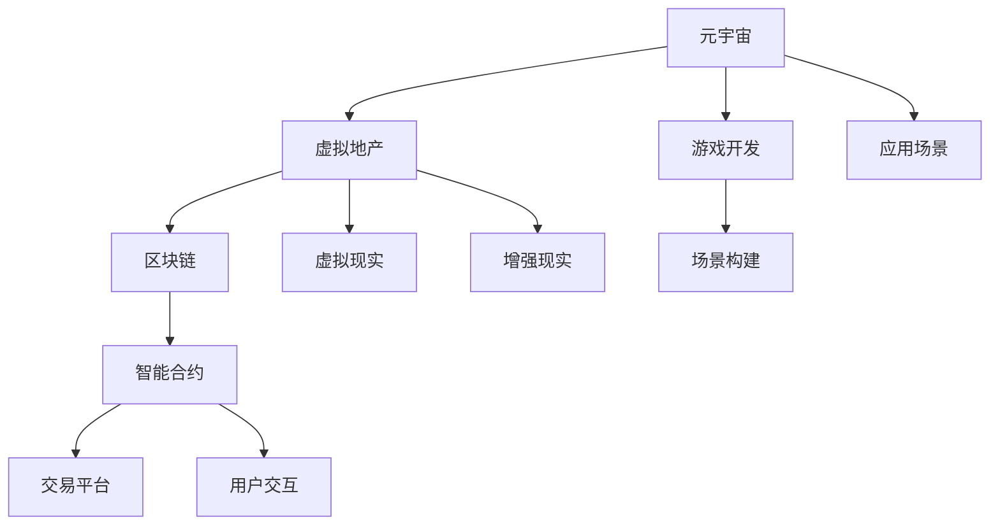

                 

# 虚拟房地产创业：元宇宙中的地产投资

> 关键词：元宇宙,地产投资,虚拟现实,区块链,游戏开发

## 1. 背景介绍

### 1.1 问题由来
随着数字技术的快速发展，元宇宙（Metaverse）这一新兴概念逐渐成为各界关注的焦点。虚拟世界不仅仅局限于游戏，而是朝着更加广泛的应用场景发展，其中包括虚拟地产和投资领域。在元宇宙中，虚拟地产为投资者提供了一种全新的资产增值途径。虚拟房地产创业成为了数字时代的热门话题，吸引了众多企业、创业者以及投资者加入其中。

### 1.2 问题核心关键点
虚拟房地产创业的核心在于如何将现实世界的地产投资理念、技术和商业模式映射到虚拟空间中。元宇宙的虚拟地产投资不仅包括土地购买、建设和运营，还涉及区块链技术、虚拟现实（VR）和增强现实（AR）等多种前沿技术的应用。此外，虚拟房地产创业还需要考虑虚拟货币、智能合约、数字版权等新的法律和商业规则。

### 1.3 问题研究意义
探索虚拟房地产创业在元宇宙中的投资机会，对于推动元宇宙技术的应用和发展，以及为传统地产行业带来新的增长点和创新空间具有重要意义。通过研究虚拟房地产创业，不仅可以揭示元宇宙经济体系的形成机制，还能为投资者提供有关虚拟地产投资的风险评估和收益预测，从而助力元宇宙经济的健康发展。

## 2. 核心概念与联系

### 2.1 核心概念概述

为更好地理解虚拟房地产创业，本节将介绍几个核心概念及其相互关系：

- 元宇宙（Metaverse）：由虚拟世界构成的3D网络空间，用户可以自由互动、创建和体验虚拟环境，具有丰富的社交、商业和经济活动。
- 虚拟地产（Virtual Real Estate）：在元宇宙中，利用虚拟现实技术模拟现实世界地产的概念，包括土地、建筑和资产等。
- 区块链（Blockchain）：一种分布式账本技术，支持透明、安全和去中心化的交易记录，广泛应用于虚拟货币和智能合约。
- 虚拟现实（Virtual Reality, VR）：通过头戴设备等技术，将用户带入虚拟环境中，提供沉浸式的体验。
- 增强现实（Augmented Reality, AR）：将虚拟信息与现实世界相结合，增强用户的感知体验。
- 智能合约（Smart Contracts）：基于区块链技术，自动执行预设条件下的合约条款，减少人为干预，提高交易效率。
- 游戏开发（Game Development）：虚拟房地产项目开发中常用到的一种技术手段，通过游戏引擎和开发工具，创建和管理虚拟空间。

这些核心概念共同构成了虚拟房地产创业的基础框架，其中区块链技术尤为关键，提供了虚拟地产交易的安全保障和透明度。

### 2.2 核心概念原理和架构的 Mermaid 流程图



这个流程图展示了元宇宙、虚拟地产与其他核心概念之间的关系：

1. 元宇宙为虚拟地产提供了一个基础平台，支持各种虚拟地产项目的创建和运行。
2. 虚拟现实和增强现实技术为虚拟地产提供了沉浸式和增强现实体验。
3. 区块链技术保障了虚拟地产交易的安全性和透明度。
4. 智能合约为虚拟地产交易提供了自动化的执行机制。
5. 游戏开发技术用于创建和管理虚拟地产项目。
6. 虚拟地产作为应用场景，与元宇宙、区块链等技术深度结合。

## 3. 核心算法原理 & 具体操作步骤

### 3.1 算法原理概述

虚拟房地产创业的核心算法原理主要涉及以下几个方面：

- **区块链技术**：为虚拟地产交易提供安全、透明和去中心化的交易记录。
- **虚拟现实和增强现实技术**：模拟现实世界的地产体验，增强用户的沉浸感。
- **智能合约**：自动执行虚拟地产交易的条款，减少人为干预，提高效率。
- **游戏开发技术**：利用游戏引擎和工具创建和管理虚拟地产项目。

### 3.2 算法步骤详解

虚拟房地产创业的算法步骤主要包括以下几个方面：

**Step 1: 准备开发环境**
- 安装和配置虚拟现实头戴设备和配套软件。
- 配置区块链平台，选择适合的虚拟货币和智能合约框架。
- 选择游戏引擎和开发工具，准备虚拟地产项目的开发。

**Step 2: 设计虚拟地产项目**
- 确定虚拟地产项目的主题和规模。
- 设计虚拟地产的地理位置、建筑风格和环境布局。
- 确定虚拟地产的交易机制和收益模式。

**Step 3: 创建虚拟地产**
- 使用游戏引擎和开发工具，创建虚拟土地和建筑。
- 集成虚拟现实和增强现实技术，增强用户的沉浸感。
- 利用区块链技术，实现虚拟地产的交易和管理。

**Step 4: 营销和推广**
- 在元宇宙平台进行虚拟地产的展示和推广。
- 利用社交媒体和线上线下活动，吸引潜在投资者。
- 提供虚拟地产的试用和体验，增加用户粘性。

**Step 5: 运营和维护**
- 定期更新和维护虚拟地产项目，保持其新鲜感和吸引力。
- 监控虚拟地产的交易情况，分析用户反馈和市场趋势。
- 调整虚拟地产的策略和模式，以应对市场变化。

### 3.3 算法优缺点

虚拟房地产创业的算法具有以下优点：

- **沉浸式体验**：通过虚拟现实和增强现实技术，提供高度沉浸的地产体验。
- **透明交易**：区块链技术保障了虚拟地产交易的透明性和安全性。
- **高效管理**：智能合约提高了虚拟地产交易和管理的自动化程度。
- **广泛应用**：虚拟房地产创业可以应用于多种场景，如地产投资、旅游、商业地产等。

同时，也存在一些缺点：

- **技术门槛高**：虚拟房地产创业需要具备多种技术，包括游戏开发、虚拟现实、区块链等。
- **高投入风险**：虚拟地产项目开发和运营成本较高，风险也相对较大。
- **市场接受度**：虚拟地产项目对用户的接受度尚未完全明确，需要进一步市场验证。

### 3.4 算法应用领域

虚拟房地产创业在多个领域具有广泛的应用前景：

- **游戏和娱乐**：虚拟地产项目可以作为游戏场景的一部分，提供娱乐体验。
- **地产投资**：投资者可以在虚拟地产中进行地产投资，获取租金和增值收益。
- **商业地产**：企业可以在虚拟地产中开设虚拟店铺和办公场所。
- **旅游和观光**：虚拟地产可以提供虚拟旅游和观光体验，吸引游客。
- **房地产展示**：虚拟地产可以作为房地产开发商的展示平台，吸引潜在客户。

## 4. 数学模型和公式 & 详细讲解 & 举例说明

### 4.1 数学模型构建

本节将使用数学语言对虚拟房地产创业进行更加严格的刻画。

记虚拟地产项目为 $P$，其中 $P$ 的特征向量为 $x = (x_1, x_2, \cdots, x_n)$，包括地理位置、建筑风格、交易机制等。记用户 $U$ 的需求向量为 $y = (y_1, y_2, \cdots, y_m)$，包括投资偏好、地理位置偏好等。则虚拟地产交易模型为：

$$
f(P, U) = \min_{\theta} \left\{ \mathcal{L}(\theta; P, U) \right\}
$$

其中 $\mathcal{L}(\theta; P, U)$ 为损失函数，衡量模型预测与实际交易的差异。

### 4.2 公式推导过程

假设用户 $U$ 的需求向量 $y = (y_1, y_2, \cdots, y_m)$ 通过softmax函数转化为概率分布 $p = (p_1, p_2, \cdots, p_m)$，则损失函数 $\mathcal{L}(\theta; P, U)$ 可以表示为：

$$
\mathcal{L}(\theta; P, U) = -\frac{1}{N} \sum_{i=1}^N \sum_{j=1}^m p_j \log f_j(P_i)
$$

其中 $P_i$ 为虚拟地产项目 $i$ 的特征向量，$f_j(P_i)$ 为模型预测用户 $i$ 对虚拟地产项目 $P_i$ 的偏好概率。

通过梯度下降等优化算法，虚拟地产交易模型的参数 $\theta$ 不断更新，最小化损失函数 $\mathcal{L}(\theta; P, U)$，使得模型预测与实际交易逐渐一致。

### 4.3 案例分析与讲解

假设某虚拟地产项目 $P$ 的地理位置和建筑风格分别为 $(x_1, x_2)$，用户 $U$ 的需求偏好为 $(y_1, y_2)$，其中 $y_1$ 表示地理位置偏好，$y_2$ 表示建筑风格偏好。则模型预测用户 $U$ 对虚拟地产项目 $P$ 的偏好概率为：

$$
f(P, U) = \sigma\left( \sum_{k=1}^n w_k x_k + b \right)
$$

其中 $\sigma$ 为激活函数，$w$ 和 $b$ 为模型的权重和偏置。通过调整 $w$ 和 $b$，最小化损失函数，使得模型的预测与实际交易一致。

## 5. 项目实践：代码实例和详细解释说明

### 5.1 开发环境搭建

在进行虚拟房地产创业的开发实践中，需要搭建一个全面的开发环境。以下是使用Unity引擎和Ethereum区块链平台的搭建流程：

1. 安装Unity引擎和配套开发工具。
2. 安装Ethereum客户端和智能合约开发工具，如Remix。
3. 配置虚拟现实头戴设备和配套软件，如Oculus Rift。
4. 选择适合的虚拟地产开发模板和插件。

### 5.2 源代码详细实现

这里我们以Unity引擎和C#语言为例，给出虚拟地产项目的代码实现。

**Unity场景创建**

```csharp
using UnityEngine;
using UnityEngine.UI;

public class PropertyScene : MonoBehaviour
{
    public GameObject propertyPrefab;
    public Transform position;

    void Start()
    {
        // 创建虚拟土地和建筑
        for (int i = 0; i < 10; i++)
        {
            GameObject newProperty = Instantiate(propertyPrefab, position.position, Quaternion.identity);
            newProperty.transform.Translate(new Vector3(i, 0, 0));
        }
    }
}
```

**智能合约实现**

```solidity
pragma solidity ^0.8.0;

contract PropertyContract
{
    address payable owner;
    uint256 price;

    constructor(address payable _owner, uint256 _price) public
    {
        owner = _owner;
        price = _price;
    }

    function buyProperty() public payable
    {
        if(msg.value >= price)
        {
            owner.send(msg.value);
            owner = msg.sender;
            price = 0;
        }
    }
}
```

### 5.3 代码解读与分析

**Unity场景创建**

- `PropertyScene` 类：用于创建虚拟地产项目。
- `propertyPrefab`：虚拟地产的预制件，包括土地和建筑。
- `position`：虚拟土地和建筑的位置。
- `Start` 方法：在场景加载时，创建10个虚拟地产项目。

**智能合约实现**

- `PropertyContract` 合约：定义虚拟地产的交易机制。
- `owner`：虚拟地产的所有者地址。
- `price`：虚拟地产的售价。
- `constructor`：合约的初始化函数，设置所有者和售价。
- `buyProperty` 函数：用户购买虚拟地产的函数，判断支付金额是否足够，并转移所有权。

### 5.4 运行结果展示

运行Unity场景后，可以看到虚拟土地和建筑被成功创建，并可以在虚拟现实头戴设备上进行交互和体验。此外，智能合约实现了虚拟地产的购买和交易功能，确保了交易的安全和透明。

## 6. 实际应用场景

### 6.1 智能旅游

虚拟房地产创业可以应用于智能旅游领域，提供虚拟旅游体验。用户可以在虚拟现实中游览虚拟世界中的名胜古迹，体验不同的文化氛围。此外，虚拟地产可以成为虚拟旅游的展示平台，吸引更多的游客。

**案例**：某虚拟旅游平台开发了虚拟颐和园，用户可以通过虚拟现实头戴设备游览颐和园，并进行虚拟地产的投资和交易。

### 6.2 房地产展示

虚拟房地产创业还可以应用于房地产展示领域，提供虚拟地产的展示和体验。房地产开发商可以通过虚拟地产展示平台，向潜在客户展示项目特点，吸引客户关注。

**案例**：某房地产开发商在虚拟现实平台中开发了虚拟小区，用户可以通过虚拟现实设备查看小区环境和建筑，并进行虚拟地产的购买和投资。

### 6.3 商业地产

虚拟房地产创业在商业地产领域也有广泛的应用。企业可以在虚拟地产中开设虚拟店铺和办公场所，提升商业活动的多样性和便捷性。

**案例**：某电商平台在虚拟现实中开设了虚拟商店，用户可以在虚拟商店中浏览和购买商品。

### 6.4 未来应用展望

虚拟房地产创业的未来应用展望主要集中在以下几个方面：

- **元宇宙经济的崛起**：随着元宇宙技术的发展，虚拟房地产将成为元宇宙经济的重要组成部分，吸引更多的投资和消费。
- **虚拟货币和区块链技术的应用**：虚拟地产的买卖和交易将更广泛地应用虚拟货币和智能合约，提升交易的便捷性和安全性。
- **虚拟现实和增强现实技术的进步**：随着虚拟现实和增强现实技术的不断提升，虚拟地产的沉浸式体验将更加丰富和逼真。
- **智能合约和去中心化平台的发展**：智能合约和去中心化平台的应用，将进一步推动虚拟地产交易的自动化和去中心化。

## 7. 工具和资源推荐

### 7.1 学习资源推荐

为了帮助开发者系统掌握虚拟房地产创业的理论基础和实践技巧，这里推荐一些优质的学习资源：

1. 《Unity游戏开发手册》：系统介绍了Unity引擎的开发技巧和工具使用，适用于虚拟地产开发的学习。
2. 《区块链开发指南》：介绍了区块链技术的基础知识和应用场景，帮助理解虚拟地产交易的安全保障。
3. 《虚拟现实技术与应用》：介绍了虚拟现实技术的原理和应用，帮助理解虚拟地产的沉浸式体验。
4. 《智能合约实战指南》：介绍了智能合约的开发和应用，帮助理解虚拟地产交易的自动化机制。
5. 《元宇宙：虚拟世界的崛起》：介绍了元宇宙的概念和应用，帮助理解虚拟房地产创业的宏观背景。

通过这些资源的学习实践，相信你一定能够快速掌握虚拟房地产创业的精髓，并用于解决实际的NLP问题。

### 7.2 开发工具推荐

高效的开发离不开优秀的工具支持。以下是几款用于虚拟房地产创业开发的常用工具：

1. Unity引擎：Unity是领先的3D游戏开发引擎，支持多种平台和设备，适合开发虚拟地产项目。
2. Ethereum平台：Ethereum是最流行的区块链平台之一，支持智能合约开发，适用于虚拟地产交易的安全保障。
3. Oculus Rift头戴设备：Oculus Rift是虚拟现实技术的代表之一，支持高质量的虚拟现实体验。
4. Remix智能合约编辑器：Remix是Ethereum官方的智能合约编辑器，支持智能合约的开发和调试。
5. Maya游戏引擎：Maya是另一款流行的游戏开发引擎，支持多种图形和物理效果，适合虚拟地产项目开发。

合理利用这些工具，可以显著提升虚拟房地产创业的开发效率，加快创新迭代的步伐。

### 7.3 相关论文推荐

虚拟房地产创业领域的研究还不够成熟，以下是几篇相关论文，推荐阅读：

1. "Virtual Real Estate in the Metaverse: A Survey"：介绍了虚拟地产在元宇宙中的发展现状和应用前景。
2. "Blockchain Applications in Virtual Real Estate"：探讨了区块链技术在虚拟地产交易中的应用和安全保障。
3. "Virtual Reality and Virtual Property Development"：介绍了虚拟现实技术在虚拟地产开发中的应用。
4. "Smart Contracts for Virtual Property Transactions"：研究了智能合约在虚拟地产交易中的应用和优化。

这些论文代表了大语言模型微调技术的发展脉络。通过学习这些前沿成果，可以帮助研究者把握学科前进方向，激发更多的创新灵感。

## 8. 总结：未来发展趋势与挑战

### 8.1 总结

本文对虚拟房地产创业在元宇宙中的投资机会进行了全面系统的介绍。首先阐述了虚拟房地产创业的背景和意义，明确了虚拟地产和区块链技术的应用方向。其次，从原理到实践，详细讲解了虚拟地产开发的核心算法和具体操作步骤，给出了虚拟地产项目的代码实现。同时，本文还探讨了虚拟房地产创业在智能旅游、房地产展示、商业地产等领域的实际应用，展示了虚拟地产创业的广阔前景。

通过本文的系统梳理，可以看到，虚拟房地产创业在元宇宙中具有巨大的潜力和应用价值，为数字时代的地产投资带来了新的机遇和挑战。未来，伴随元宇宙技术的发展，虚拟地产投资有望成为数字经济的重要组成部分，推动数字经济的进一步发展。

### 8.2 未来发展趋势

展望未来，虚拟房地产创业在元宇宙中的发展趋势主要集中在以下几个方面：

- **技术创新**：随着虚拟现实、增强现实和区块链技术的不断进步，虚拟地产的体验和交易将更加丰富和便捷。
- **经济生态**：虚拟地产将成为元宇宙经济的重要组成部分，形成完整的虚拟地产生态链。
- **多元化应用**：虚拟地产的应用场景将更加多样化，涵盖旅游、商业、地产展示等多个领域。
- **跨平台交互**：虚拟地产项目将实现跨平台交互，用户可以在不同设备上体验虚拟地产项目。
- **社区和治理**：虚拟地产社区和治理机制将逐渐完善，提高虚拟地产项目的稳定性和可持续发展。

### 8.3 面临的挑战

尽管虚拟房地产创业在元宇宙中具有广阔的前景，但也面临以下挑战：

- **技术成熟度**：虚拟地产技术尚未完全成熟，存在诸多技术瓶颈。
- **市场接受度**：用户对虚拟地产的接受度尚需验证，需要进一步市场推广。
- **法规和伦理**：虚拟地产涉及众多法律和伦理问题，需要相应的监管和规范。
- **投资风险**：虚拟地产项目开发和运营成本较高，投资风险较大。

### 8.4 研究展望

面对虚拟房地产创业在元宇宙中面临的挑战，未来的研究需要在以下几个方面寻求新的突破：

- **技术优化**：进一步优化虚拟现实、增强现实和区块链技术，提升虚拟地产的体验和交易效率。
- **市场验证**：进行市场推广和验证，提升用户对虚拟地产的接受度和认可度。
- **法规和伦理**：制定相关法规和伦理规范，确保虚拟地产项目的合法性和公平性。
- **风险管理**：建立风险评估和管理机制，降低虚拟地产投资的风险。

这些研究方向的探索，必将引领虚拟房地产创业在元宇宙中的进一步发展，为数字时代的地产投资带来新的机遇和挑战。

## 9. 附录：常见问题与解答

**Q1：虚拟地产是否具备法律效力？**

A: 在现有法律体系下，虚拟地产尚未被广泛认可。虽然部分地区开始尝试立法保护虚拟地产权益，但整体法律规范和市场接受度仍需进一步完善。

**Q2：虚拟地产项目开发需要哪些技术和资源？**

A: 虚拟地产项目开发需要游戏开发、虚拟现实、增强现实和区块链等多项技术。此外，还需要高水平的开发团队、丰富的开发经验和充足的资金支持。

**Q3：虚拟地产投资的风险和收益如何？**

A: 虚拟地产投资的风险和收益主要取决于市场接受度和技术成熟度。在初期阶段，用户对虚拟地产的接受度较低，投资回报可能较低。但随着技术的不断成熟和市场的逐步认可，虚拟地产有望成为高收益的投资项目。

**Q4：虚拟地产与传统地产有何不同？**

A: 虚拟地产与传统地产的主要区别在于其虚拟性和数字化特性。虚拟地产不受地理位置限制，支持跨平台交互，具有更高的灵活性和便捷性。但虚拟地产的资产价值和保值性仍需进一步验证。

**Q5：虚拟地产的未来发展前景如何？**

A: 虚拟地产的未来发展前景广阔，有望成为元宇宙经济的重要组成部分。随着技术的不断进步和市场认可度的提升，虚拟地产将逐渐被更多投资者接受，成为数字经济的新兴增长点。

---
作者：禅与计算机程序设计艺术 / Zen and the Art of Computer Programming

