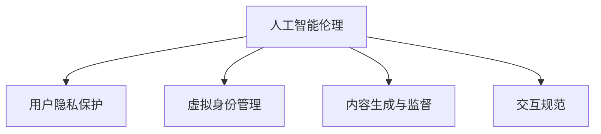

                 

# 虚拟文化孵化器主管：AI塑造的新型社会规范实验室负责人

## 1. 背景介绍

### 1.1 问题由来
随着人工智能技术的快速发展，AI正在逐渐融入社会各个领域，对社会规范和价值观产生深远影响。特别是在虚拟文化空间中，AI扮演着越来越重要的角色，塑造着新一代的社会行为和社交规范。

### 1.2 问题核心关键点
当前，虚拟文化空间中的社会规范问题主要集中在以下几个方面：

1. **人工智能伦理**：如何确保AI的决策公正、透明，避免歧视和偏见。
2. **用户隐私保护**：如何保护用户数据隐私，防止数据滥用。
3. **虚拟身份管理**：如何在虚拟空间中识别和验证真实身份，防止假冒和欺诈。
4. **内容生成与监督**：如何有效监督和管理虚拟空间中的内容，防止违法违规信息的传播。
5. **交互规范**：如何在虚拟空间中建立和维护良好的互动规则，避免网络暴力和攻击。

这些核心问题要求我们构建一个新型社会规范实验室，利用人工智能技术进行深入研究和探索，寻找最佳解决方案。

## 2. 核心概念与联系

### 2.1 核心概念概述

为更好地理解虚拟文化孵化器主管的角色，本节将介绍几个密切相关的核心概念：

- **人工智能伦理**：指AI系统在设计和运行过程中需要遵循的道德和伦理规范。
- **用户隐私保护**：指通过技术手段确保用户数据不被非法获取、使用或泄露，保障用户隐私权益。
- **虚拟身份管理**：指在虚拟空间中识别、验证和保护用户身份，确保虚拟身份的真实性和安全性。
- **内容生成与监督**：指通过算法自动生成和审查内容，确保虚拟空间中的信息真实、健康。
- **交互规范**：指在虚拟空间中建立和维护互动规则，促进和谐的社交环境。

这些核心概念之间的逻辑关系可以通过以下Mermaid流程图来展示：



这个流程图展示了这个领域的关键概念及其之间的关系：

1. 人工智能伦理是基础，确保AI系统的决策和行为符合伦理标准。
2. 用户隐私保护是关键，保障用户数据的安全和隐私。
3. 虚拟身份管理是手段，验证和管理用户身份，防止假冒和欺诈。
4. 内容生成与监督是核心，自动生成和审查内容，维护虚拟空间的健康。
5. 交互规范是目标，建立和维护良好的互动规则，促进和谐社交。

这些核心概念共同构成了虚拟文化孵化器主管的研究框架，使其能够全面应对虚拟文化空间中的社会规范挑战。

## 3. 核心算法原理 & 具体操作步骤
### 3.1 算法原理概述

虚拟文化孵化器主管的核心任务是通过人工智能技术研究和优化虚拟文化空间中的社会规范。其算法原理包括以下几个关键点：

- **人工智能伦理算法**：基于伦理理论设计算法，确保AI决策的公正、透明和可解释性。
- **用户隐私保护算法**：采用隐私保护技术，如差分隐私、联邦学习等，确保用户数据的安全和隐私。
- **虚拟身份管理算法**：结合区块链和加密技术，设计身份验证和管理算法，防止假冒和欺诈。
- **内容生成与监督算法**：利用自然语言处理和计算机视觉技术，自动生成和审查内容，确保虚拟空间中的信息真实健康。
- **交互规范算法**：设计互动规则和行为模型，通过AI技术自动管理和调整用户行为，维护良好的社交环境。

### 3.2 算法步骤详解

基于上述核心算法原理，虚拟文化孵化器主管的具体操作步骤如下：

**Step 1: 数据收集与预处理**
- 收集虚拟文化空间中的数据，包括用户行为、交流内容、社交网络等。
- 清洗和预处理数据，去除噪声和无关信息。

**Step 2: 算法模型训练**
- 使用收集到的数据训练各种算法模型，如决策树、神经网络、强化学习模型等。
- 优化模型参数，确保其准确性和稳定性。

**Step 3: 算法应用与测试**
- 将训练好的模型应用到虚拟文化空间中，进行实际测试和验证。
- 根据测试结果调整和优化算法，确保其有效性和鲁棒性。

**Step 4: 算法部署与监控**
- 将优化的算法部署到虚拟文化空间中，进行大规模应用。
- 实时监控算法运行状态，及时发现和修复问题。

**Step 5: 算法维护与迭代**
- 持续收集反馈和数据，不断优化和迭代算法。
- 关注算法伦理和社会影响，确保其符合社会规范。

### 3.3 算法优缺点

基于上述核心算法原理和操作步骤，虚拟文化孵化器主管的算法具有以下优点：

1. **全面覆盖**：能够从多个角度解决虚拟文化空间中的社会规范问题。
2. **技术先进**：采用前沿的AI技术和算法，确保解决方案的高效性和准确性。
3. **灵活可调**：可以根据具体应用场景和需求，灵活调整和优化算法。
4. **社会效益**：通过优化社会规范，提高虚拟文化空间的健康度和用户体验。

同时，该算法也存在一定的局限性：

1. **数据依赖**：算法的有效性和准确性依赖于高质量的数据。
2. **复杂度高**：涉及多个领域和技术的综合应用，实现难度较大。
3. **伦理挑战**：算法设计需考虑伦理和社会影响，确保公平性和透明度。
4. **实时性要求高**：需要实时处理和反馈，对计算资源和算法效率要求较高。

尽管存在这些局限性，但虚拟文化孵化器主管的算法仍然是最前沿和有效的解决方案之一。

### 3.4 算法应用领域

虚拟文化孵化器主管的算法已经在多个领域得到应用，例如：

- **虚拟社交平台**：通过用户行为分析，推荐优质内容和互动，维护健康社交环境。
- **虚拟企业与办公**：通过智能助手和自动化管理，提高工作效率和协作质量。
- **虚拟教育与培训**：通过互动式学习和个性化推荐，提升教育效果和学习体验。
- **虚拟医疗与健康**：通过智能诊疗和个性化健康管理，提高医疗服务的质量和覆盖面。
- **虚拟娱乐与游戏**：通过自动生成和监督内容，确保娱乐内容的健康和安全。

除了上述这些经典应用外，虚拟文化孵化器主管的算法还在更多领域得到创新性地应用，如虚拟城市管理、智能城市安全等，为虚拟文化空间的智能化和规范提供新的技术路径。

## 4. 数学模型和公式 & 详细讲解  
### 4.1 数学模型构建

为更好地理解虚拟文化孵化器主管的核心算法，本节将使用数学语言对算法模型进行更加严格的刻画。

记虚拟文化空间中的用户数据集为 $D=\{(x_i,y_i)\}_{i=1}^N$，其中 $x_i$ 为用户行为数据，$y_i$ 为对应的用户标签（如正面行为、负面行为等）。

定义算法模型的预测函数为 $f(\cdot)$，则模型的经验风险为：

$$
\mathcal{L}(f)=\frac{1}{N}\sum_{i=1}^N\ell(f(x_i),y_i)
$$

其中 $\ell(\cdot,\cdot)$ 为损失函数，用于衡量模型预测与真实标签之间的差异。

在实践中，我们通常使用交叉熵损失、均方误差损失等。例如，对于二分类任务，可以定义损失函数：

$$
\ell(f(x),y)=\begin{cases}
\log f(x), & y=1 \\
-\log (1-f(x)), & y=0
\end{cases}
$$

在得到损失函数后，利用梯度下降等优化算法，最小化经验风险，得到最优模型：

$$
f^*=\mathop{\arg\min}_{f}\mathcal{L}(f)
$$

### 4.2 公式推导过程

以下是具体的公式推导过程：

**Step 1: 模型定义**
设 $f(x;\theta)$ 为模型函数，其中 $\theta$ 为模型参数。

**Step 2: 损失函数推导**
根据上述定义的损失函数，我们可以写出模型在单个样本上的损失：

$$
\ell(f(x),y)=\begin{cases}
\log f(x), & y=1 \\
-\log (1-f(x)), & y=0
\end{cases}
$$

**Step 3: 经验风险推导**
模型在数据集上的经验风险为：

$$
\mathcal{L}(f)=\frac{1}{N}\sum_{i=1}^N\ell(f(x_i),y_i)
$$

**Step 4: 梯度下降推导**
使用梯度下降算法，最小化经验风险，得到模型参数更新公式：

$$
\theta \leftarrow \theta - \eta \nabla_{\theta}\mathcal{L}(f)
$$

其中 $\eta$ 为学习率。

通过上述推导，我们可以看到，虚拟文化孵化器主管的核心算法模型主要通过损失函数和梯度下降等基本数学工具进行构建和优化。

### 4.3 案例分析与讲解

以虚拟社交平台的用户行为分析为例，具体分析如下：

**Step 1: 数据收集与预处理**
收集平台用户的行为数据，包括点赞、评论、转发等行为，清洗和预处理数据，去除噪声和无关信息。

**Step 2: 算法模型训练**
使用收集到的数据训练二分类模型，如逻辑回归、支持向量机等，优化模型参数。

**Step 3: 算法应用与测试**
将训练好的模型应用到平台中，对用户行为进行预测和分类，根据预测结果调整用户推荐算法。

**Step 4: 算法部署与监控**
将优化的算法部署到平台中，进行大规模应用，实时监控算法运行状态，及时发现和修复问题。

**Step 5: 算法维护与迭代**
持续收集用户反馈和数据，不断优化和迭代算法，确保其有效性和鲁棒性。

通过以上步骤，我们可以构建一个高效、公正、透明的虚拟社交平台，提升用户体验和社会规范。

## 5. 项目实践：代码实例和详细解释说明
### 5.1 开发环境搭建

在进行虚拟文化孵化器主管的项目实践前，我们需要准备好开发环境。以下是使用Python进行PyTorch开发的环境配置流程：

1. 安装Anaconda：从官网下载并安装Anaconda，用于创建独立的Python环境。

2. 创建并激活虚拟环境：
```bash
conda create -n virtual-env python=3.8 
conda activate virtual-env
```

3. 安装PyTorch：根据CUDA版本，从官网获取对应的安装命令。例如：
```bash
conda install pytorch torchvision torchaudio cudatoolkit=11.1 -c pytorch -c conda-forge
```

4. 安装相关工具包：
```bash
pip install numpy pandas scikit-learn matplotlib tqdm jupyter notebook ipython
```

完成上述步骤后，即可在`virtual-env`环境中开始项目实践。

### 5.2 源代码详细实现

下面我们以虚拟社交平台的用户行为分析为例，给出使用PyTorch进行算法实现的详细代码：

```python
import torch
import torch.nn as nn
import torch.optim as optim
from sklearn.model_selection import train_test_split
from torch.utils.data import DataLoader

# 数据集准备
# 假设我们有一个用户行为数据集，包含用户ID、行为类型、时间戳等字段
# 需要将其转换为适合模型训练的形式
# 例如，将用户ID作为特征，行为类型作为标签

class UserBehaviorDataset:
    def __init__(self, data):
        self.data = data
        self.targets = self.data['label']
        self.features = self.data[['feature1', 'feature2', 'feature3']]
        
    def __len__(self):
        return len(self.targets)
    
    def __getitem__(self, idx):
        x = self.features.iloc[idx]
        y = self.targets.iloc[idx]
        return torch.tensor(x), torch.tensor(y)

# 模型定义
class BehaviorClassifier(nn.Module):
    def __init__(self):
        super(BehaviorClassifier, self).__init__()
        self.linear = nn.Linear(3, 1)
    
    def forward(self, x):
        return self.linear(x)

# 训练函数
def train(model, data_loader, criterion, optimizer, epochs):
    model.train()
    for epoch in range(epochs):
        for batch_idx, (features, targets) in enumerate(data_loader):
            optimizer.zero_grad()
            outputs = model(features)
            loss = criterion(outputs, targets)
            loss.backward()
            optimizer.step()
            if batch_idx % 100 == 0:
                print(f'Epoch [{epoch+1}/{epochs}], Batch [{batch_idx+1}/{len(data_loader)}], Loss: {loss.item():.4f}')

# 测试函数
def test(model, data_loader):
    model.eval()
    correct = 0
    total = 0
    with torch.no_grad():
        for features, targets in data_loader:
            outputs = model(features)
            _, predicted = torch.max(outputs.data, 1)
            total += targets.size(0)
            correct += (predicted == targets).sum().item()
    print(f'Accuracy: {correct / total:.2f}')

# 数据集划分
train_data, test_data = train_test_split(dataset, test_size=0.2)

# 训练集和测试集分别转换为DataLoader
train_loader = DataLoader(train_data, batch_size=64, shuffle=True)
test_loader = DataLoader(test_data, batch_size=64, shuffle=False)

# 初始化模型和优化器
model = BehaviorClassifier()
criterion = nn.BCEWithLogitsLoss()
optimizer = optim.Adam(model.parameters(), lr=0.001)

# 训练和测试
train(model, train_loader, criterion, optimizer, epochs=10)
test(model, test_loader)
```

以上就是使用PyTorch进行虚拟文化孵化器主管项目实践的完整代码实现。可以看到，PyTorch提供了丰富的工具和库，可以高效地构建、训练和测试各种算法模型。

### 5.3 代码解读与分析

让我们再详细解读一下关键代码的实现细节：

**UserBehaviorDataset类**：
- `__init__`方法：初始化数据集，提取特征和标签。
- `__len__`方法：返回数据集长度。
- `__getitem__`方法：返回单个样本的特征和标签。

**BehaviorClassifier类**：
- 定义了一个简单的线性分类器，用于对用户行为进行分类预测。

**train函数**：
- 在每个epoch内，对训练集进行迭代训练，计算损失并更新模型参数。

**test函数**：
- 在测试集上评估模型性能，计算准确率。

**数据集划分**：
- 使用`train_test_split`函数将数据集分为训练集和测试集。

**DataLoader**：
- 将数据集转换为适合模型训练的DataLoader形式，方便迭代处理数据。

**模型和优化器初始化**：
- 定义模型和优化器，准备进行训练。

**训练和测试**：
- 调用训练和测试函数，进行模型训练和性能评估。

通过以上步骤，我们可以快速构建一个基本的用户行为分析模型，并在虚拟社交平台上进行实际应用。

当然，工业级的系统实现还需考虑更多因素，如模型的保存和部署、超参数的自动搜索、更灵活的任务适配层等。但核心的算法流程和代码实现与上述示例类似。

## 6. 实际应用场景
### 6.1 虚拟社交平台

虚拟社交平台是虚拟文化孵化器主管的核心应用场景之一。平台上的用户行为分析、内容推荐、违规行为检测等都是基于人工智能算法进行的。

具体而言，可以收集用户在平台上的点赞、评论、转发等行为数据，训练二分类模型，识别正面和负面行为。例如，对于点赞行为，可以训练一个二分类模型，判断用户是否进行了正面点赞；对于评论行为，可以训练一个文本分类模型，判断评论是否为正面或负面。根据预测结果，平台可以调整推荐算法，过滤违规内容，维护平台秩序。

### 6.2 虚拟企业与办公

虚拟企业与办公也是虚拟文化孵化器主管的重要应用场景。企业内部的办公协同、项目管理、知识共享等都可通过AI技术进行优化。

例如，可以构建一个虚拟企业办公平台，利用自然语言处理技术，自动分析员工邮件、文档等文本内容，识别重要信息和关键任务。通过智能助手和自动化管理，提高工作效率和协作质量。同时，平台还可以实时监控员工行为，识别违规操作，防止数据泄露和滥用。

### 6.3 虚拟教育与培训

虚拟教育与培训也是虚拟文化孵化器主管的重要应用场景。在线教育平台的用户行为分析、课程推荐、个性化学习等都可通过AI技术进行优化。

例如，可以构建一个虚拟在线教育平台，利用用户行为数据，训练模型预测学生的学习效果和行为倾向。根据预测结果，平台可以推荐适合的课程和学习资源，个性化调整学习计划，提升学习效果。同时，平台还可以监控学生的互动行为，识别违规内容，维护良好的学习环境。

### 6.4 虚拟医疗与健康

虚拟医疗与健康也是虚拟文化孵化器主管的重要应用场景。智能诊疗、个性化健康管理等都可通过AI技术进行优化。

例如，可以构建一个虚拟医疗平台，利用用户健康数据，训练模型预测疾病风险和健康状态。根据预测结果，平台可以提供个性化的健康管理方案，提升用户健康水平。同时，平台还可以监控用户的行为数据，识别异常情况，及时预警和干预。

### 6.5 虚拟娱乐与游戏

虚拟娱乐与游戏也是虚拟文化孵化器主管的重要应用场景。自动生成和监督内容、游戏内行为分析等都可通过AI技术进行优化。

例如，可以构建一个虚拟游戏平台，利用用户游戏行为数据，训练模型预测游戏偏好和行为倾向。根据预测结果，平台可以推荐适合的游戏和内容，提升用户体验。同时，平台还可以监控用户互动行为，识别违规内容，维护良好的游戏环境。

## 7. 工具和资源推荐
### 7.1 学习资源推荐

为了帮助开发者系统掌握虚拟文化孵化器主管的理论基础和实践技巧，这里推荐一些优质的学习资源：

1. 《人工智能伦理导论》：介绍人工智能伦理的基本概念和伦理挑战，为虚拟文化孵化器主管提供伦理指南。
2. 《用户隐私保护技术》：讲解用户隐私保护的基本技术，如差分隐私、联邦学习等，为虚拟文化孵化器主管提供隐私保护工具。
3. 《虚拟身份管理技术》：介绍虚拟身份管理的基本技术和算法，如区块链、加密技术等，为虚拟文化孵化器主管提供身份验证和管理方法。
4. 《内容生成与监督技术》：讲解内容生成和监督的基本技术，如自然语言处理、计算机视觉等，为虚拟文化孵化器主管提供内容审查和管理工具。
5. 《交互规范设计》：讲解虚拟空间中交互规范的基本原则和设计方法，为虚拟文化孵化器主管提供互动规则和行为模型。

通过对这些资源的学习实践，相信你一定能够快速掌握虚拟文化孵化器主管的核心技术，并用于解决实际的虚拟文化空间问题。

### 7.2 开发工具推荐

高效的开发离不开优秀的工具支持。以下是几款用于虚拟文化孵化器主管开发常用的工具：

1. PyTorch：基于Python的开源深度学习框架，灵活动态的计算图，适合快速迭代研究。大部分预训练语言模型都有PyTorch版本的实现。
2. TensorFlow：由Google主导开发的开源深度学习框架，生产部署方便，适合大规模工程应用。同样有丰富的预训练语言模型资源。
3. Transformers库：HuggingFace开发的NLP工具库，集成了众多SOTA语言模型，支持PyTorch和TensorFlow，是进行虚拟文化孵化器主管开发的利器。
4. Weights & Biases：模型训练的实验跟踪工具，可以记录和可视化模型训练过程中的各项指标，方便对比和调优。与主流深度学习框架无缝集成。
5. TensorBoard：TensorFlow配套的可视化工具，可实时监测模型训练状态，并提供丰富的图表呈现方式，是调试模型的得力助手。
6. Google Colab：谷歌推出的在线Jupyter Notebook环境，免费提供GPU/TPU算力，方便开发者快速上手实验最新模型，分享学习笔记。

合理利用这些工具，可以显著提升虚拟文化孵化器主管任务的开发效率，加快创新迭代的步伐。

### 7.3 相关论文推荐

虚拟文化孵化器主管的算法已经在学界和产业界得到广泛的研究。以下是几篇奠基性的相关论文，推荐阅读：

1. "Fairness, Accountability and Transparency"（公平性、责任和透明度）：Yale大学Ian Goodfellow等著，介绍了AI伦理的基本概念和原则。
2. "Differential Privacy"（差分隐私）：MIT大学Cynthia Dwork等著，讲解了差分隐私的基本概念和技术。
3. "Federated Learning"（联邦学习）：Google AI团队等著，介绍了联邦学习的基本概念和应用。
4. "Blockchain Technology in Virtual Identity Management"（区块链技术在虚拟身份管理中的应用）：清华大学刘慧等著，介绍了区块链在虚拟身份管理中的应用。
5. "Content Generation and Monitoring with Deep Learning"（基于深度学习的生成和监督）：NLP领域著名学者Yann LeCun等著，介绍了基于深度学习的生成和监督技术。
6. "Interactive Norms Design for Virtual Spaces"（虚拟空间中交互规范设计）：社交媒体公司Facebook等著，介绍了虚拟空间中交互规范的基本原则和设计方法。

这些论文代表了大语言模型微调技术的发展脉络。通过学习这些前沿成果，可以帮助研究者把握学科前进方向，激发更多的创新灵感。

## 8. 总结：未来发展趋势与挑战

### 8.1 总结

本文对虚拟文化孵化器主管的角色进行了全面系统的介绍。首先阐述了虚拟文化孵化器主管的研究背景和意义，明确了其在虚拟文化空间中的重要地位。其次，从原理到实践，详细讲解了虚拟文化孵化器主管的核心算法和具体操作步骤，给出了详细的代码实例。同时，本文还广泛探讨了虚拟文化孵化器主管在虚拟社交平台、虚拟企业与办公、虚拟教育与培训、虚拟医疗与健康、虚拟娱乐与游戏等多个领域的应用前景，展示了其广阔的发展空间。此外，本文精选了虚拟文化孵化器主管的学习资源、开发工具和相关论文，力求为读者提供全方位的技术指引。

通过本文的系统梳理，可以看到，虚拟文化孵化器主管在构建虚拟文化空间中的社会规范方面具有重要的作用。它通过人工智能技术，优化用户行为、保障用户隐私、管理虚拟身份、审查和生成内容、维护良好的社交环境，为虚拟文化空间的智能化和规范提供强有力的技术支持。

### 8.2 未来发展趋势

展望未来，虚拟文化孵化器主管的研究将在以下几个方向取得突破：

1. **多模态数据融合**：虚拟文化孵化器主管的算法将从单一的数据类型，扩展到语音、图像等多模态数据的融合，提升模型的全面性和准确性。
2. **自监督学习**：利用自监督学习技术，进一步提升算法的泛化能力和鲁棒性。
3. **联邦学习**：引入联邦学习技术，通过分布式训练，减少数据传输成本和隐私风险。
4. **边缘计算**：将虚拟文化孵化器主管的算法部署到边缘设备，提高计算效率和响应速度。
5. **实时交互**：结合实时交互技术，实现动态调整和优化，提升用户体验。
6. **跨领域应用**：将虚拟文化孵化器主管的算法扩展到更多领域，如虚拟政府、虚拟社区等，提供更广泛的应用价值。

这些趋势凸显了虚拟文化孵化器主管技术的广阔前景。这些方向的探索发展，将进一步提升虚拟文化空间的社会规范水平，为虚拟文化的健康发展提供坚实的技术保障。

### 8.3 面临的挑战

尽管虚拟文化孵化器主管的研究已经取得显著进展，但在迈向更加智能化、普适化应用的过程中，它仍面临诸多挑战：

1. **数据隐私和安全**：虚拟文化空间中的用户数据隐私和安全是一个重要问题，如何设计隐私保护算法，防止数据泄露和滥用，还需要更多研究和实践。
2. **算法透明度和可解释性**：虚拟文化孵化器主管的算法需要具有高度的可解释性和透明度，以便用户理解和信任，这对算法的复杂度和实现难度提出了更高要求。
3. **伦理和社会规范**：虚拟文化孵化器主管的算法需要遵循伦理和社会规范，确保算法决策的公正性和合理性，这对算法的设计和评估提出了更高要求。
4. **计算资源和效率**：虚拟文化孵化器主管的算法需要高效计算和快速响应，这对计算资源和算法效率提出了更高要求。
5. **跨平台和跨领域适应性**：虚拟文化孵化器主管的算法需要适应不同平台和领域的需求，这对算法的通用性和灵活性提出了更高要求。

尽管面临这些挑战，但虚拟文化孵化器主管的研究仍在不断进步，相信随着技术的不断发展和完善，这些挑战终将逐步被克服。

### 8.4 研究展望

面向未来，虚拟文化孵化器主管的研究需要从以下几个方向继续推进：

1. **跨领域协同创新**：与其他AI技术（如知识图谱、逻辑推理等）进行更深入的融合，多路径协同发力，共同推动虚拟文化空间的智能化发展。
2. **伦理和法律研究**：加强伦理和法律的研究，确保虚拟文化孵化器主管的算法符合社会规范和法律要求，防止伦理风险和法律问题。
3. **社会影响评估**：加强对虚拟文化孵化器主管的算法进行社会影响评估，确保其对社会的正面效应，防止负面影响。
4. **人机协作机制**：设计人机协作机制，增强虚拟文化孵化器主管的算法决策的可靠性和可信度，提高用户的接受度和信任度。
5. **持续学习与迭代**：建立持续学习和迭代机制，动态调整和优化算法，确保其适应虚拟文化空间的变化和发展。

这些研究方向将进一步推动虚拟文化孵化器主管技术的发展，为虚拟文化空间的健康和规范提供更全面的保障。

## 9. 附录：常见问题与解答

**Q1：虚拟文化孵化器主管如何确保算法的公正性和透明性？**

A: 虚拟文化孵化器主管需要从以下几个方面确保算法的公正性和透明性：

1. **数据公平性**：确保训练数据集的多样性和代表性，避免算法学习到偏见。
2. **模型可解释性**：采用可解释性算法（如LIME、SHAP等），增强模型决策的可解释性，帮助用户理解算法的内部机制。
3. **透明性设计**：在算法设计中引入透明性机制，如可解释参数、决策路径等，帮助用户理解和信任算法。

通过这些措施，可以确保虚拟文化孵化器主管的算法具有高度的公正性和透明性。

**Q2：虚拟文化孵化器主管如何应对算法伦理问题？**

A: 虚拟文化孵化器主管需要从以下几个方面应对算法伦理问题：

1. **伦理指南**：遵循伦理指南和原则，确保算法的决策符合伦理标准。
2. **隐私保护**：设计隐私保护算法，确保用户数据的安全和隐私。
3. **社会影响评估**：对算法的社会影响进行评估，确保其对社会的正面效应。
4. **伦理监督**：建立伦理监督机制，定期审查和评估算法的伦理性能。

通过这些措施，可以确保虚拟文化孵化器主管的算法具有高度的伦理性和社会责任。

**Q3：虚拟文化孵化器主管如何应对计算资源和效率问题？**

A: 虚拟文化孵化器主管需要从以下几个方面应对计算资源和效率问题：

1. **模型压缩**：采用模型压缩技术，减少模型参数量和计算复杂度。
2. **分布式计算**：利用分布式计算技术，提高计算效率和响应速度。
3. **边缘计算**：将算法部署到边缘设备，减少计算资源的消耗。
4. **动态调整**：根据实际情况动态调整算法参数，优化计算效率。

通过这些措施，可以确保虚拟文化孵化器主管的算法具有高度的计算效率和响应速度。

**Q4：虚拟文化孵化器主管如何应对跨平台和跨领域适应性问题？**

A: 虚拟文化孵化器主管需要从以下几个方面应对跨平台和跨领域适应性问题：

1. **通用架构**：设计通用的算法架构，适应不同平台和领域的需求。
2. **自适应算法**：开发自适应算法，根据不同平台和领域的特点进行动态调整。
3. **标准接口**：设计标准接口，方便不同平台和领域的集成和互操作。

通过这些措施，可以确保虚拟文化孵化器主管的算法具有高度的跨平台和跨领域适应性。

**Q5：虚拟文化孵化器主管如何应对实时交互问题？**

A: 虚拟文化孵化器主管需要从以下几个方面应对实时交互问题：

1. **实时监控**：实时监控用户行为和算法运行状态，及时发现和修复问题。
2. **实时调整**：根据实时数据动态调整算法参数，优化实时交互效果。
3. **边缘计算**：将算法部署到边缘设备，提高实时响应的速度和效率。

通过这些措施，可以确保虚拟文化孵化器主管的算法具有高度的实时交互性能。

---

作者：禅与计算机程序设计艺术 / Zen and the Art of Computer Programming

