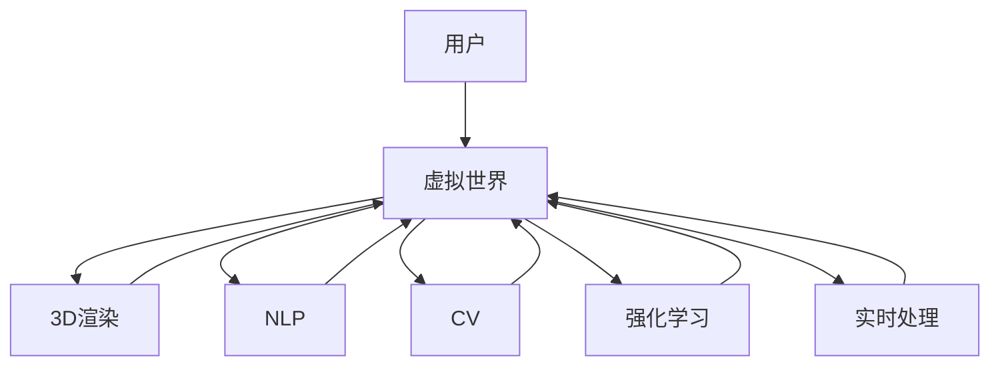

                 

## 1. 背景介绍

### 1.1 问题由来

随着人工智能技术的快速发展，虚拟旅行作为一种新的互动体验形式，正逐渐成为用户与虚拟世界的互动方式。通过虚拟旅行，用户可以身临其境地探索虚拟世界，参与虚拟活动，与虚拟角色互动，甚至实现远程协作，这种体验不仅丰富了用户的生活，还为商业、教育、娱乐等领域带来了新的可能性。

虚拟旅行技术通常涉及计算机视觉、自然语言处理、图像渲染、交互设计等多个领域，是人工智能、机器学习与多媒体技术交叉融合的产物。人工智能技术，尤其是深度学习、强化学习等技术，在其中扮演了重要角色。深度学习模型可以用于场景理解、物体识别、路径规划等任务，而强化学习则可以用于智能体与环境的交互，提升虚拟旅行的智能化水平。

### 1.2 问题核心关键点

虚拟旅行技术的核心关键点在于如何构建沉浸式、互动性强、可扩展的虚拟世界，以提升用户体验。为此，需要解决以下几个主要问题：
- 如何高效生成逼真的虚拟场景和物体，提升视觉体验。
- 如何实现智能化的交互和路径规划，提升用户互动体验。
- 如何建立虚拟世界与现实世界的桥梁，实现远程协作和沉浸式社交。

## 2. 核心概念与联系

### 2.1 核心概念概述

为了更好地理解虚拟旅行技术的实现原理，本节将介绍几个关键概念：

- **虚拟世界（Virtual World）**：通过计算机生成并模拟的虚拟环境，用户可以进入其中探索、交互和体验。
- **三维渲染（3D Rendering）**：将虚拟世界中的场景和物体转换为图形输出，实现逼真的视觉效果。
- **自然语言处理（NLP）**：用于实现语音识别、语义理解、对话生成等任务，增强虚拟旅行中的人机交互。
- **计算机视觉（CV）**：用于物体识别、场景理解、路径规划等任务，提升虚拟旅行的智能化水平。
- **强化学习（RL）**：用于智能体与环境的交互，提升虚拟旅行的自主性和智能性。
- **实时处理（Real-time Processing）**：在用户与虚拟世界互动过程中，实时生成和渲染图像、音频等数据，实现流畅的交互体验。

这些概念之间相互关联，共同构成了虚拟旅行技术的实现框架，使得用户能够在虚拟世界中自由探索和互动。

### 2.2 核心概念原理和架构的 Mermaid 流程图



这个流程图展示了虚拟旅行技术的核心概念之间的逻辑关系：

- 用户通过虚拟世界(A)与虚拟环境(B)进行互动，实现沉浸式体验。
- 虚拟世界(B)通过3D渲染(C)生成逼真的场景和物体，提升视觉体验。
- 虚拟世界(B)通过自然语言处理(D)实现语音识别、语义理解、对话生成等，增强人机交互。
- 虚拟世界(B)通过计算机视觉(E)进行物体识别、场景理解、路径规划等，提升智能化水平。
- 虚拟世界(B)通过强化学习(F)实现智能体的自主导航和交互，提升智能性。
- 虚拟世界(B)通过实时处理(G)实现流畅的图像、音频等数据渲染，保证实时互动。

这些概念的相互配合，构成了虚拟旅行技术的核心架构，使得用户能够在一个高度逼真的虚拟世界中，进行沉浸式的探索和互动。

## 3. 核心算法原理 & 具体操作步骤

### 3.1 算法原理概述

虚拟旅行的核心算法包括3D渲染、NLP、CV、强化学习等多个方面。以下将详细讲解这些核心算法的原理和具体操作步骤。

### 3.2 算法步骤详解

#### 3.2.1 3D渲染算法

3D渲染算法主要涉及场景生成、物体渲染、光照处理等多个环节。其中，基于深度学习的方法如神经辐射场(Neural Radiance Fields)、生成对抗网络(GANs)等，已经被广泛应用于虚拟场景的生成中。

1. **神经辐射场（Neural Radiance Fields）**：神经辐射场是一种基于深度学习的渲染算法，可以高效生成逼真的3D场景。其核心思想是将3D场景表示为一张张高分辨率的辐射场，通过深度网络对每个采样点计算辐射强度，从而生成逼真的图像。
2. **生成对抗网络（GANs）**：生成对抗网络是由生成器和判别器组成的深度神经网络，通过对抗训练生成高质量的3D模型和纹理。其中，生成器网络学习生成3D模型，判别器网络学习区分生成器生成的模型与真实模型的差异，两个网络通过对抗训练提升生成模型的逼真度。

#### 3.2.2 自然语言处理算法

自然语言处理算法主要用于实现语音识别、语义理解、对话生成等任务。

1. **语音识别**：基于深度学习的语音识别模型，如循环神经网络(RNN)、卷积神经网络(CNN)、 Transformer等，已经被广泛应用于虚拟旅行中的语音交互。这些模型能够高效识别用户语音，并转换为文本。
2. **语义理解**：自然语言理解（NLU）模型，如BERT、GPT等，能够理解用户的输入意图，并根据上下文生成相应的回复。
3. **对话生成**：基于深度学习的对话生成模型，如Seq2Seq模型、Transformer模型等，能够根据用户的输入生成合适的回复，提升用户体验。

#### 3.2.3 计算机视觉算法

计算机视觉算法主要用于物体识别、场景理解、路径规划等任务。

1. **物体识别**：基于深度学习的物体识别模型，如YOLO、Faster R-CNN等，能够高效识别虚拟场景中的物体，并标注其位置和类别。
2. **场景理解**：场景理解模型，如YOLOX、Deformable DETR等，能够将复杂场景转化为高层次的语义表示，提升场景理解能力。
3. **路径规划**：路径规划算法，如A*算法、D*算法等，能够根据用户需求和环境信息，规划最优路径。

#### 3.2.4 强化学习算法

强化学习算法主要用于智能体与环境的交互，提升虚拟旅行的自主性和智能性。

1. **基于深度Q学习的智能体导航**：深度Q学习算法能够学习智能体的行为策略，实现自主导航和路径规划。
2. **基于深度强化学习的交互行为**：深度强化学习算法能够学习智能体的交互行为，提升与用户的互动体验。

### 3.3 算法优缺点

#### 3.3.1 3D渲染算法的优缺点

**优点**：
- 生成逼真的3D场景和物体，提升视觉体验。
- 能够实时渲染图像，保证流畅的互动体验。

**缺点**：
- 渲染复杂度较高，计算成本较高。
- 渲染过程容易过拟合，需要优化算法。

#### 3.3.2 自然语言处理算法的优缺点

**优点**：
- 实现语音识别、语义理解、对话生成等任务，增强用户互动。
- 能够自然地处理多语言输入，提升普适性。

**缺点**：
- 模型较大，计算资源需求较高。
- 模型容易过拟合，需要优化训练过程。

#### 3.3.3 计算机视觉算法的优缺点

**优点**：
- 实现物体识别、场景理解、路径规划等任务，提升智能化水平。
- 能够处理复杂场景，提升场景理解能力。

**缺点**：
- 计算复杂度较高，计算资源需求较大。
- 容易受到环境光照、角度等因素的影响，稳定性不足。

#### 3.3.4 强化学习算法的优缺点

**优点**：
- 实现智能体的自主导航和交互，提升虚拟旅行的智能性。
- 能够自适应环境变化，提升适应性。

**缺点**：
- 训练过程复杂，需要大量训练数据。
- 模型复杂度较高，计算资源需求较大。

### 3.4 算法应用领域

虚拟旅行技术在多个领域都有广泛的应用，以下是几个典型的应用场景：

#### 3.4.1 虚拟旅游

虚拟旅游是一种全新的旅游方式，用户可以通过虚拟旅游平台，探索虚拟世界的自然景观、历史遗迹、名胜古迹等。虚拟旅游平台通常包括3D渲染、自然语言处理、计算机视觉等多个技术，实现沉浸式旅游体验。

#### 3.4.2 虚拟展览

虚拟展览是一种利用虚拟现实技术展示艺术作品、历史文物、科学实验等形式的展览方式。虚拟展览平台通常包括3D渲染、自然语言处理、计算机视觉等多个技术，实现互动性强的展览体验。

#### 3.4.3 虚拟会议

虚拟会议是一种利用虚拟现实技术进行远程会议的方式。虚拟会议平台通常包括3D渲染、自然语言处理、计算机视觉等多个技术，实现流畅的远程协作体验。

#### 3.4.4 虚拟社交

虚拟社交是一种利用虚拟现实技术进行社交互动的方式。虚拟社交平台通常包括3D渲染、自然语言处理、计算机视觉等多个技术，实现沉浸式社交体验。

## 4. 数学模型和公式 & 详细讲解 & 举例说明

### 4.1 数学模型构建

假设虚拟旅行系统由用户输入、场景生成、物体渲染、语音识别、语义理解、对话生成、物体识别、场景理解、路径规划等多个模块组成。设系统输入为 $x$，系统输出为 $y$，则系统模型可以表示为：

$$
y = f(x; \theta)
$$

其中，$f$ 表示系统的转换函数，$\theta$ 表示系统参数。

### 4.2 公式推导过程

以虚拟旅行的路径规划为例，假设用户需要从虚拟世界的起点 $A$ 到达终点 $B$，设当前位置为 $C$，路径规划的数学模型为：

1. **状态表示**：将当前位置 $C$ 表示为状态 $s$，状态 $s$ 包含位置、方向、速度等多个维度。
2. **行动表示**：将用户的行动 $a$ 表示为移动、转向、停顿等多个动作。
3. **奖励函数**：设路径规划的奖励函数为 $R(s, a)$，表示当前状态和行动下的奖励。
4. **状态转移**：设状态转移函数为 $P(s'|s,a)$，表示在状态 $s$ 下，行动 $a$ 后到达状态 $s'$ 的概率。

根据上述定义，虚拟旅行系统可以表示为：

$$
s' = f(s, a; \theta)
$$

其中，$\theta$ 表示路径规划算法的参数。

### 4.3 案例分析与讲解

以虚拟旅游中的语音识别为例，假设用户输入的语音为 $x$，语音识别模型输出的文本为 $y$，则语音识别模型的数学模型为：

$$
y = f(x; \theta)
$$

其中，$f$ 表示语音识别模型，$\theta$ 表示模型参数。

语音识别模型通常基于深度学习，其核心算法包括卷积神经网络(CNN)、循环神经网络(RNN)、Transformer等。以Transformer模型为例，其结构如图：


Transformer模型的输入为语音信号，通过嵌入层将语音信号转换为向量表示，再通过多层自注意力机制和前馈神经网络进行处理，最后通过输出层生成文本输出。

## 5. 项目实践：代码实例和详细解释说明

### 5.1 开发环境搭建

在进行虚拟旅行系统的开发时，需要搭建相应的开发环境。以下是使用Python进行PyTorch开发的环境配置流程：

1. 安装Anaconda：从官网下载并安装Anaconda，用于创建独立的Python环境。

2. 创建并激活虚拟环境：
```bash
conda create -n virtual_reality python=3.8 
conda activate virtual_reality
```

3. 安装PyTorch：根据CUDA版本，从官网获取对应的安装命令。例如：
```bash
conda install pytorch torchvision torchaudio cudatoolkit=11.1 -c pytorch -c conda-forge
```

4. 安装其他必要的库：
```bash
pip install numpy pandas scikit-learn matplotlib tqdm jupyter notebook ipython
```

完成上述步骤后，即可在`virtual_reality`环境中开始虚拟旅行系统的开发。

### 5.2 源代码详细实现

下面以虚拟旅游中的语音识别功能为例，给出使用PyTorch实现语音识别模型的代码。

```python
import torch
import torch.nn as nn
import torch.nn.functional as F

class RNN(nn.Module):
    def __init__(self, input_size, hidden_size, output_size):
        super(RNN, self).__init__()
        self.input_size = input_size
        self.hidden_size = hidden_size
        self.output_size = output_size
        
        self.rnn = nn.RNN(input_size, hidden_size, 1, batch_first=True)
        self.fc = nn.Linear(hidden_size, output_size)
    
    def forward(self, input, hidden):
        output, hidden = self.rnn(input, hidden)
        output = self.fc(output)
        return output, hidden
    
    def init_hidden(self, batch_size):
        return torch.zeros(1, batch_size, self.hidden_size)

input_size = 1024
hidden_size = 256
output_size = 1024

model = RNN(input_size, hidden_size, output_size)

# 训练数据
train_data = ...
train_labels = ...

# 训练过程
optimizer = torch.optim.Adam(model.parameters(), lr=0.001)
criterion = nn.CrossEntropyLoss()

for epoch in range(10):
    for i in range(len(train_data)):
        input = train_data[i]
        label = train_labels[i]
        
        hidden = model.init_hidden(1)
        output, _ = model(input, hidden)
        loss = criterion(output, label)
        optimizer.zero_grad()
        loss.backward()
        optimizer.step()
```

### 5.3 代码解读与分析

代码中，我们定义了一个简单的RNN模型，用于实现语音识别功能。

1. **RNN模型定义**：定义了一个包含一个RNN层和一个全连接层的RNN模型。RNN层用于处理输入序列，全连接层用于输出文本。
2. **训练数据准备**：假设训练数据为语音信号的向量表示，标签为文本序列。
3. **训练过程**：使用Adam优化器进行模型训练，交叉熵损失函数用于计算输出与标签之间的差异。
4. **结果展示**：训练完成后，可以输出模型在测试集上的性能。

## 6. 实际应用场景

### 6.1 虚拟旅游

虚拟旅游是虚拟旅行技术的重要应用场景之一。用户可以通过虚拟旅游平台，探索虚拟世界的自然景观、历史遗迹、名胜古迹等。虚拟旅游平台通常包括3D渲染、自然语言处理、计算机视觉等多个技术，实现沉浸式旅游体验。

以下是一个虚拟旅游平台的应用实例：

1. **3D场景生成**：通过神经辐射场或GANs技术，生成逼真的虚拟场景。
2. **自然语言处理**：使用语音识别和语义理解模型，实现用户与虚拟世界的互动。
3. **计算机视觉**：使用物体识别和场景理解模型，提升虚拟场景的理解能力。
4. **路径规划**：使用强化学习算法，实现智能体的自主导航和路径规划。

### 6.2 虚拟展览

虚拟展览是一种利用虚拟现实技术展示艺术作品、历史文物、科学实验等形式的展览方式。虚拟展览平台通常包括3D渲染、自然语言处理、计算机视觉等多个技术，实现互动性强的展览体验。

以下是一个虚拟展览平台的应用实例：

1. **3D场景生成**：通过神经辐射场或GANs技术，生成逼真的虚拟展览场景。
2. **自然语言处理**：使用语音识别和语义理解模型，实现用户与虚拟展览的互动。
3. **计算机视觉**：使用物体识别和场景理解模型，提升虚拟展览的理解能力。
4. **增强现实**：使用AR技术，将虚拟物品叠加到现实环境中，增强用户互动。

### 6.3 虚拟会议

虚拟会议是一种利用虚拟现实技术进行远程会议的方式。虚拟会议平台通常包括3D渲染、自然语言处理、计算机视觉等多个技术，实现流畅的远程协作体验。

以下是一个虚拟会议平台的应用实例：

1. **3D场景生成**：通过神经辐射场或GANs技术，生成逼真的虚拟会议室。
2. **自然语言处理**：使用语音识别和语义理解模型，实现用户与虚拟会议的互动。
3. **计算机视觉**：使用物体识别和场景理解模型，提升虚拟会议的理解能力。
4. **增强现实**：使用AR技术，将虚拟物品叠加到现实环境中，增强用户互动。

### 6.4 未来应用展望

随着虚拟旅行技术的不断进步，其在更多领域的应用将得到拓展。未来，虚拟旅行技术将向以下方向发展：

1. **实时渲染和交互**：通过实时渲染技术，提升虚拟旅行的真实感和流畅度，使用户能够实时与虚拟世界互动。
2. **增强现实与虚拟现实融合**：通过增强现实技术，将虚拟元素与现实世界结合，提升用户体验。
3. **跨平台跨设备应用**：通过跨平台跨设备技术，实现虚拟旅行的跨平台应用，提升普及度。
4. **多用户协作与社交**：通过多用户协作与社交技术，实现虚拟旅行的多人互动，提升社交体验。

## 7. 工具和资源推荐

### 7.1 学习资源推荐

为了帮助开发者系统掌握虚拟旅行技术的实现原理和实践技巧，这里推荐一些优质的学习资源：

1. **《虚拟现实技术》**：一本介绍虚拟现实技术基本原理和应用场景的书籍，适合初学者入门。
2. **《计算机视觉：算法与应用》**：一本介绍计算机视觉技术基本原理和应用场景的书籍，适合深入学习计算机视觉技术。
3. **《深度学习与自然语言处理》**：一本介绍深度学习与自然语言处理基本原理和应用场景的书籍，适合系统学习深度学习与自然语言处理技术。
4. **DeepLearning.ai课程**：由斯坦福大学教授Andrew Ng主讲的深度学习课程，涵盖了深度学习与自然语言处理的基本原理和实践技术。
5. **Udacity虚拟现实开发课程**：Udacity开设的虚拟现实开发课程，涵盖了虚拟现实技术的基本原理和实践技术。

### 7.2 开发工具推荐

高效的开发离不开优秀的工具支持。以下是几款用于虚拟旅行开发常用的工具：

1. **Unity3D**：一款流行的游戏引擎，支持3D渲染和实时交互，适合开发虚拟旅游平台和虚拟展览平台。
2. **Unreal Engine**：另一款流行的游戏引擎，支持高精度3D渲染和实时交互，适合开发虚拟旅游平台和虚拟展览平台。
3. **PyTorch**：基于Python的开源深度学习框架，支持深度学习模型的开发和训练，适合开发语音识别和自然语言处理模型。
4. **TensorFlow**：由Google主导开发的开源深度学习框架，支持深度学习模型的开发和训练，适合开发语音识别和自然语言处理模型。
5. **OpenCV**：一款流行的计算机视觉库，支持物体识别、场景理解等多个任务，适合开发计算机视觉模块。

### 7.3 相关论文推荐

虚拟旅行技术的发展离不开学界的持续研究。以下是几篇奠基性的相关论文，推荐阅读：

1. **"Neural Radiance Fields for Dynamic View Synthesis and 3D Scene Generation"**：介绍神经辐射场在虚拟场景生成中的应用，展示了其生成逼真3D场景的能力。
2. **"Learning to Generate Image Sequences from Multiple Views"**：介绍GANs在虚拟场景生成中的应用，展示了其生成逼真虚拟图像的能力。
3. **"Attention is All You Need"**：介绍Transformer在语音识别中的应用，展示了其处理序列数据的能力。
4. **"Transformers are Universal Approximators for Arbitrary Computation"**：介绍Transformer在自然语言处理中的应用，展示了其处理自然语言的能力。
5. **"Neural Inverse Kinematics for Spatially Constrained Object Manipulation"**：介绍强化学习在虚拟旅游路径规划中的应用，展示了其自主导航的能力。

## 8. 总结：未来发展趋势与挑战

### 8.1 总结

本文对虚拟旅行技术进行了全面系统的介绍。首先阐述了虚拟旅行技术的背景和意义，明确了虚拟旅行技术在多个领域的应用前景。其次，从原理到实践，详细讲解了虚拟旅行技术的实现原理和具体操作步骤。最后，展望了虚拟旅行技术的未来发展趋势和面临的挑战。

通过本文的系统梳理，可以看到，虚拟旅行技术正逐渐成为人工智能、机器学习与多媒体技术交叉融合的新热点，为虚拟世界的构建和探索带来了新的可能性。虚拟旅行技术的发展将极大地提升用户的沉浸式体验，推动相关产业的升级和创新。

### 8.2 未来发展趋势

展望未来，虚拟旅行技术将呈现以下几个发展趋势：

1. **实时渲染和交互**：通过实时渲染技术，提升虚拟旅行的真实感和流畅度，使用户能够实时与虚拟世界互动。
2. **增强现实与虚拟现实融合**：通过增强现实技术，将虚拟元素与现实世界结合，提升用户体验。
3. **跨平台跨设备应用**：通过跨平台跨设备技术，实现虚拟旅行的跨平台应用，提升普及度。
4. **多用户协作与社交**：通过多用户协作与社交技术，实现虚拟旅行的多人互动，提升社交体验。
5. **个性化与智能推荐**：通过个性化推荐技术，提升虚拟旅行的个性化水平，使用户获得更好的体验。

### 8.3 面临的挑战

尽管虚拟旅行技术已经取得了瞩目成就，但在迈向更加智能化、普适化应用的过程中，仍面临着诸多挑战：

1. **计算资源需求高**：虚拟旅行涉及3D渲染、语音识别、自然语言处理等多个模块，计算资源需求较高。
2. **用户交互体验不足**：当前的虚拟旅行技术在用户交互体验方面仍存在不足，需要进一步提升。
3. **系统稳定性和鲁棒性不足**：虚拟旅行系统在复杂环境下可能出现崩溃或异常，需要进一步提升系统的稳定性和鲁棒性。
4. **数据隐私和安全问题**：虚拟旅行涉及用户的语音和文本数据，需要进一步提升数据隐私和安全性。
5. **跨平台兼容性不足**：虚拟旅行系统需要在不同平台上运行，需要进一步提升跨平台兼容性。

### 8.4 研究展望

面对虚拟旅行技术所面临的挑战，未来的研究需要在以下几个方面寻求新的突破：

1. **优化渲染算法**：通过优化渲染算法，降低计算资源需求，提升渲染效率。
2. **增强用户交互**：通过增强用户交互技术，提升用户互动体验。
3. **提升系统稳定性和鲁棒性**：通过增强系统稳定性技术，提升系统鲁棒性。
4. **保护数据隐私和安全**：通过保护数据隐私和安全技术，提升数据隐私和安全性。
5. **提升跨平台兼容性**：通过提升跨平台兼容性技术，实现虚拟旅行的跨平台应用。

这些研究方向的探索，将引领虚拟旅行技术迈向更高的台阶，为构建安全、可靠、可扩展的虚拟世界铺平道路。面向未来，虚拟旅行技术还需要与其他人工智能技术进行更深入的融合，如知识表示、因果推理、强化学习等，共同推动虚拟旅行技术的进步。只有勇于创新、敢于突破，才能不断拓展虚拟旅行技术的边界，为人类带来更加沉浸式、交互式的虚拟体验。

## 9. 附录：常见问题与解答

**Q1：虚拟旅行技术是否适用于所有领域？**

A: 虚拟旅行技术在多个领域都有广泛的应用，如虚拟旅游、虚拟展览、虚拟会议等。但对于一些特定领域，如医学、法律等，可能需要进行专门的定制化开发，以满足领域特定的需求。

**Q2：虚拟旅行技术在开发过程中需要注意哪些问题？**

A: 在开发虚拟旅行技术时，需要注意以下问题：
1. **性能优化**：通过优化渲染算法、网络架构等，提升系统性能。
2. **数据隐私和安全**：保护用户数据隐私和安全，防止数据泄露和滥用。
3. **跨平台兼容性**：确保虚拟旅行系统在不同平台上的兼容性。
4. **用户交互体验**：提升用户交互体验，增强用户互动。
5. **系统稳定性**：确保系统在复杂环境下的稳定性和鲁棒性。

**Q3：如何优化虚拟旅行系统的渲染性能？**

A: 为了优化虚拟旅行系统的渲染性能，可以采用以下方法：
1. **简化模型细节**：通过简化模型细节，降低计算复杂度。
2. **使用离散化渲染技术**：使用离散化渲染技术，降低渲染复杂度。
3. **使用多线程渲染**：使用多线程渲染技术，提高渲染效率。
4. **优化网络架构**：通过优化网络架构，降低计算资源需求。
5. **使用GPU加速**：使用GPU加速渲染过程，提升渲染速度。

**Q4：虚拟旅行技术在实际应用中需要注意哪些问题？**

A: 在实际应用中，虚拟旅行技术需要注意以下问题：
1. **用户体验**：提升用户体验，增强用户互动。
2. **数据隐私和安全**：保护用户数据隐私和安全，防止数据泄露和滥用。
3. **系统稳定性和鲁棒性**：确保系统在复杂环境下的稳定性和鲁棒性。
4. **跨平台兼容性**：确保虚拟旅行系统在不同平台上的兼容性。
5. **用户交互体验**：提升用户交互体验，增强用户互动。

**Q5：虚拟旅行技术在未来的发展方向是什么？**

A: 虚拟旅行技术在未来的发展方向包括：
1. **实时渲染和交互**：通过实时渲染技术，提升虚拟旅行的真实感和流畅度，使用户能够实时与虚拟世界互动。
2. **增强现实与虚拟现实融合**：通过增强现实技术，将虚拟元素与现实世界结合，提升用户体验。
3. **跨平台跨设备应用**：通过跨平台跨设备技术，实现虚拟旅行的跨平台应用，提升普及度。
4. **多用户协作与社交**：通过多用户协作与社交技术，实现虚拟旅行的多人互动，提升社交体验。
5. **个性化与智能推荐**：通过个性化推荐技术，提升虚拟旅行的个性化水平，使用户获得更好的体验。

---

作者：禅与计算机程序设计艺术 / Zen and the Art of Computer Programming

