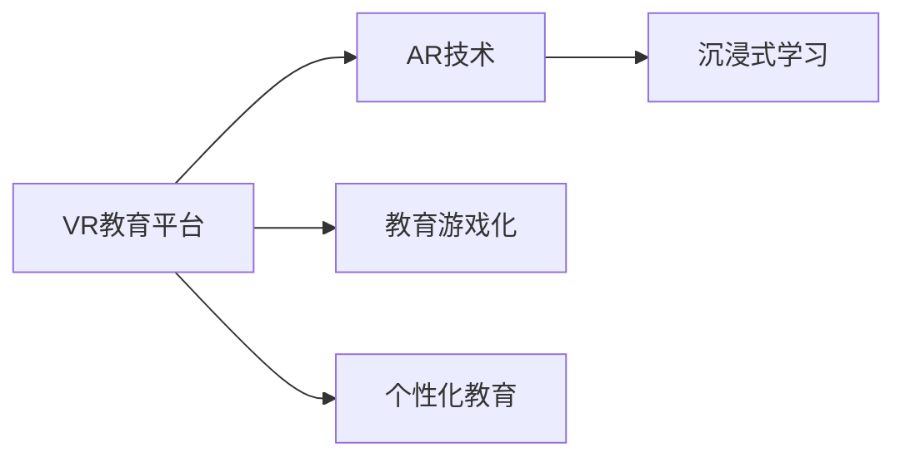

                 

# 虚拟现实儿童教育创业：寓教于乐的沉浸式学习

## 1. 背景介绍

在信息爆炸的互联网时代，传统学习模式已经不能满足社会对教育创新的需求。科技的进步为教育方式带来了新的变革，特别是虚拟现实（VR）技术的应用，为儿童教育提供了全新的解决方案。通过沉浸式的学习体验，孩子们可以在虚拟世界中探索、实践，享受学习的过程。本文将探讨虚拟现实儿童教育创业的现状与挑战，分析其核心概念与联系，并介绍其算法原理、具体操作步骤及应用领域。

## 2. 核心概念与联系

### 2.1 核心概念概述

为了更好地理解虚拟现实儿童教育创业，需要了解以下核心概念：

- **虚拟现实（Virtual Reality, VR）**：通过计算机生成的模拟环境，让用户通过特定的硬件设备进入一个虚拟的三维空间，从而实现沉浸式的体验。

- **增强现实（Augmented Reality, AR）**：在现实世界的基础上，叠加数字信息，通过智能设备提供增强的视听体验。

- **虚拟教育（Virtual Education）**：利用VR、AR技术，为学生提供沉浸式的学习环境，使教育更加生动有趣。

- **沉浸式学习（Immersive Learning）**：通过VR、AR等技术，使学习者完全沉浸在虚拟环境中，从而提高学习效果。

- **教育游戏化（Gamification in Education）**：通过游戏元素，如积分、等级、奖励等，激励学习者主动学习。

- **个性化教育（Personalized Education）**：根据每个学习者的兴趣、能力、学习风格等特征，提供量身定制的学习方案。

这些概念之间存在密切联系，共同构成了虚拟现实儿童教育创业的基础。通过VR、AR技术，教育游戏化和个性化教育得以实现，从而提供沉浸式的学习体验。

### 2.2 核心概念原理和架构的 Mermaid 流程图



## 3. 核心算法原理 & 具体操作步骤

### 3.1 算法原理概述

虚拟现实儿童教育创业的核心算法主要涉及以下几个方面：

- **三维重建算法**：用于将现实世界的三维模型重构为虚拟世界中的场景，是实现沉浸式学习的基础。

- **动作捕捉和交互技术**：通过传感器捕捉学习者的动作，实现与虚拟环境的互动。

- **自然语言处理（NLP）**：通过分析学习者的问题和回答，提供个性化的反馈和建议。

- **机器学习（ML）**：用于个性化推荐学习内容和评估学习效果，以持续优化学习体验。

### 3.2 算法步骤详解

1. **平台搭建**：选择合适的VR、AR开发平台和硬件设备，如Oculus Rift、HTC Vive等。

2. **三维重建**：使用三维建模软件创建虚拟学习场景，导入到VR平台中。

3. **内容开发**：设计教育内容，包括教材、游戏、实验等，使用三维建模工具将其转换为虚拟对象。

4. **交互设计**：定义学习者的交互方式，如点击、拖拽、手势等，实现与虚拟环境的互动。

5. **NLP应用**：开发聊天机器人或虚拟助手，分析学习者的问题和回答，提供个性化反馈和建议。

6. **ML应用**：利用机器学习算法，分析学习者的学习数据，评估学习效果，个性化推荐学习内容和进度。

### 3.3 算法优缺点

#### 优点

- **沉浸式学习**：通过虚拟现实技术，使学习者完全沉浸在虚拟环境中，激发学习兴趣，提高学习效果。

- **个性化教育**：通过数据分析，提供个性化的学习方案，适应不同学习者的需求。

- **互动性强**：通过交互技术，使学习者与虚拟环境互动，增强学习的参与感和实践性。

#### 缺点

- **硬件成本高**：VR、AR硬件设备价格较高，普及性受限。

- **内容制作复杂**：制作高质量的教育内容需要专业技能，制作周期较长。

- **技术依赖性强**：需要持续的技术支持，以保障系统的稳定性和安全性。

### 3.4 算法应用领域

虚拟现实儿童教育创业涉及多个领域，包括但不限于：

- **学前教育**：通过互动游戏和虚拟实验，激发儿童的学习兴趣，培养基本认知和技能。

- **K-12教育**：利用虚拟实验室和虚拟场景，进行科学、历史、地理等学科的教学。

- **职业培训**：为青少年提供虚拟工作环境，进行职业技能培训，如医疗、工程、艺术等。

- **心理健康教育**：通过虚拟心理辅导室和模拟情景，帮助儿童解决心理问题，提升心理健康水平。

## 4. 数学模型和公式 & 详细讲解 & 举例说明

### 4.1 数学模型构建

假设一个简单的虚拟现实教育系统，包含学习者、虚拟环境、交互行为和反馈四个主要元素。数学模型可以表示为：

$$
S = (L, V, I, F)
$$

其中，$L$ 表示学习者，$V$ 表示虚拟环境，$I$ 表示交互行为，$F$ 表示反馈机制。

### 4.2 公式推导过程

对于交互行为，可以定义如下公式：

$$
I = \begin{cases}
\text{Click} & \text{当学习者点击虚拟对象时} \\
\text{Drag} & \text{当学习者拖拽虚拟对象时} \\
\text{Gesture} & \text{当学习者做出手势时}
\end{cases}
$$

对于反馈机制，可以定义如下公式：

$$
F = \begin{cases}
\text{Positive} & \text{当学习者回答正确时} \\
\text{Negative} & \text{当学习者回答错误时} \\
\text{Neutral} & \text{当学习者回答中等时}
\end{cases}
$$

### 4.3 案例分析与讲解

以一个简单的虚拟物理实验为例，学习者需要调整某个物体的姿态，使其稳定。当学习者点击物体时，系统会根据其调整的方向和角度，给出正负反馈。如果物体稳定，系统反馈为“Positive”；否则，反馈为“Negative”。学习者根据反馈信息，不断调整姿态，直到物体稳定。

## 5. 项目实践：代码实例和详细解释说明

### 5.1 开发环境搭建

- **平台选择**：选择Unity3D作为开发平台，支持VR、AR开发。
- **硬件设备**：使用Oculus Rift或HTC Vive等VR设备。
- **开发工具**：安装Unity3D编辑器，安装相应的VR插件和开发工具。

### 5.2 源代码详细实现

```csharp
using UnityEngine;
using UnityEngine.XR.Interaction.Toolkit;

public class VRLearningSystem : MonoBehaviour
{
    public GameObject virtualObject;
    public Transform interactionHand;

    private VRInputHand hand;
    private Ray ray;

    void Start()
    {
        hand = interactionHand.GetComponent<VRInputHand>();
    }

    void Update()
    {
        if (hand.inputAvailable && hand.inputPointer.currentRay.intersection.intersected && interactionHand.childCount > 0)
        {
            ray = hand.inputPointer.currentRay;
            interactionHand.position = ray.origin + ray.direction * interactionHand.localPosition;
        }
    }

    void RaycastEvent(RaycastHit hit)
    {
        if (hit.rigidbody && hit.rigidbody.velocity == Vector3.zero)
        {
            VirtualObjectController controller = hit.rigidbody.GetComponent<VirtualObjectController>();
            if (controller != null)
            {
                controller.OnObjectInteract();
            }
        }
    }
}
```

### 5.3 代码解读与分析

该代码实现了一个简单的虚拟物理实验，学习者可以通过VR手套点击物体，调整其姿态。

- **VRInputHand类**：用于捕捉学习者的手势和位置信息。
- **RaycastEvent方法**：当学习者点击物体时，通过射线检测，获取物体的位置，并调用OnObjectInteract方法。
- **VirtualObjectController类**：用于控制虚拟物体的姿态，当学习者点击时，调整物体姿态。

### 5.4 运行结果展示

通过运行上述代码，学习者可以在虚拟环境中点击物体，调整其姿态。系统的正负反馈将指导学习者不断优化操作，直到物体稳定。

## 6. 实际应用场景

### 6.1 学前教育

学前教育是虚拟现实儿童教育创业的一个重要方向。通过虚拟现实技术，可以为儿童提供互动游戏、虚拟实验室等学习环境，激发其学习兴趣，培养基本认知和技能。例如，虚拟现实版的《冰雪奇缘》，通过互动游戏，让儿童学习音乐、舞蹈等。

### 6.2 K-12教育

在K-12教育中，虚拟现实技术可以用于科学、历史、地理等学科的教学。例如，虚拟现实版的《宇宙大爆炸》，通过虚拟宇宙探索，帮助学生理解天体运动和物理定律。

### 6.3 职业培训

虚拟现实技术可以为青少年提供虚拟工作环境，进行职业技能培训。例如，虚拟现实版的《外科手术模拟器》，通过模拟手术操作，培训医学生的临床技能。

### 6.4 心理健康教育

通过虚拟现实技术，可以为儿童提供虚拟心理辅导室和模拟情景，帮助其解决心理问题。例如，虚拟现实版的《压力缓解游戏》，通过虚拟环境中的挑战和奖励，帮助儿童缓解压力。

## 7. 工具和资源推荐

### 7.1 学习资源推荐

- **《虚拟现实技术入门》**：介绍虚拟现实的基本概念、技术原理和应用场景，适合初学者。
- **《虚拟现实编程指南》**：详细讲解虚拟现实开发工具和技术的实际应用，提供大量案例和项目。
- **《虚拟现实教育应用》**：探讨虚拟现实在教育领域的具体应用，提供大量教育案例和设计思路。

### 7.2 开发工具推荐

- **Unity3D**：提供丰富的VR、AR开发工具和资源，适合初学者和专业开发者。
- **Unreal Engine**：提供强大的渲染能力和扩展性，适合需要高性能渲染和复杂场景的项目。
- **Vuforia**：提供AR开发工具和插件，支持图像识别和增强现实。

### 7.3 相关论文推荐

- **《虚拟现实在教育中的应用研究》**：探讨虚拟现实在教育中的潜在价值和应用场景，适合教育领域的研究人员。
- **《虚拟现实技术的发展现状与未来趋势》**：分析虚拟现实技术的现状和未来发展方向，适合技术研究者。
- **《虚拟现实与增强现实技术在教育中的融合应用》**：探讨虚拟现实和增强现实技术的结合，提供新的教育应用思路。

## 8. 总结：未来发展趋势与挑战

### 8.1 研究成果总结

虚拟现实儿童教育创业作为教育技术的创新方向，已经在多个领域取得了显著成效。通过虚拟现实技术，学习者可以进入沉浸式学习环境，提高学习效果。通过交互技术，学习者可以与虚拟环境互动，增强学习体验。

### 8.2 未来发展趋势

1. **技术成熟度提高**：随着虚拟现实技术的不断成熟，硬件成本将逐渐降低，普及性将进一步提高。
2. **内容多样化**：虚拟现实教育内容将更加丰富，涵盖更多学科和领域。
3. **个性化教育普及**：通过大数据和人工智能，提供更加个性化的学习方案，适应不同学习者的需求。
4. **多模态融合**：将虚拟现实与AR、AI等技术结合，实现多模态融合，提供更加生动的学习体验。
5. **全球化教育**：虚拟现实教育将打破地域限制，为全球儿童提供高质量的教育资源。

### 8.3 面临的挑战

1. **硬件普及性**：虚拟现实硬件设备价格较高，普及性受限。
2. **内容制作复杂**：高质量的教育内容制作需要专业技能，制作周期较长。
3. **技术依赖性强**：需要持续的技术支持，以保障系统的稳定性和安全性。
4. **学习效果评估**：如何科学评估虚拟现实教育的效果，需要更多的研究和实践。
5. **伦理和安全问题**：虚拟现实教育涉及用户隐私和数据安全，需要建立完善的伦理和安全保障机制。

### 8.4 研究展望

未来，虚拟现实儿童教育创业需要更多的技术创新和实践探索，以解决当前的挑战。同时，需要建立完善的伦理和安全保障机制，确保虚拟现实教育的健康发展。通过多学科、多领域的合作，虚拟现实儿童教育创业将为教育领域带来更加美好的未来。

## 9. 附录：常见问题与解答

**Q1：虚拟现实儿童教育创业的主要挑战是什么？**

A: 虚拟现实儿童教育创业的主要挑战包括硬件成本高、内容制作复杂、技术依赖性强、学习效果评估困难和伦理安全问题。

**Q2：虚拟现实儿童教育创业的核心算法涉及哪些方面？**

A: 虚拟现实儿童教育创业的核心算法涉及三维重建算法、动作捕捉和交互技术、自然语言处理（NLP）和机器学习（ML）。

**Q3：如何科学评估虚拟现实教育的效果？**

A: 科学评估虚拟现实教育的效果，可以通过学习者行为数据、学习者反馈、学习效果测试等方法进行综合评估。

**Q4：虚拟现实儿童教育创业的未来发展趋势是什么？**

A: 虚拟现实儿童教育创业的未来发展趋势包括技术成熟度提高、内容多样化、个性化教育普及、多模态融合和全球化教育。

**Q5：虚拟现实儿童教育创业面临哪些伦理和安全问题？**

A: 虚拟现实儿童教育创业面临的主要伦理和安全问题包括用户隐私和数据安全、学习内容的适宜性和安全性、虚拟环境的伦理规范等。

---

作者：禅与计算机程序设计艺术 / Zen and the Art of Computer Programming

