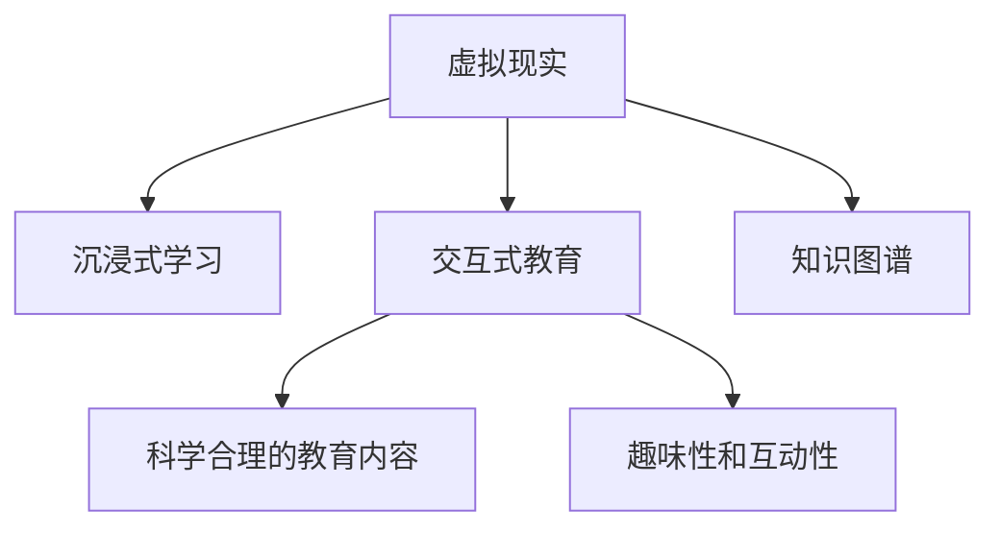

                 

# 虚拟现实儿童教育创业：寓教于乐的沉浸式学习

## 1. 背景介绍

### 1.1 问题由来
在过去十年间，儿童教育领域经历了翻天覆地的变化。随着技术的进步，教育不再局限于传统的课堂教学，而是拓展到了家庭、社区乃至虚拟空间。特别是虚拟现实(VR)技术的发展，为儿童教育带来了全新的可能性。VR技术的沉浸式体验，使得儿童在学习过程中不仅可以获得知识，还能感受真实世界的生动和趣味。

在虚拟现实中，孩子能够以第一人称视角参与到互动式场景中，与虚拟角色互动，完成各种任务和挑战。这样的体验不仅能够提高儿童的学习兴趣，还能激发他们的创新思维和问题解决能力。这种寓教于乐的教育模式，越来越受到家长和教育机构的青睐。

### 1.2 问题核心关键点
VR儿童教育的核心关键点在于如何设计科学合理的教学场景，充分利用VR技术的沉浸式体验，以及如何保证教育内容的科学性和趣味性。为此，本文将详细探讨以下核心问题：

1. 虚拟现实技术在儿童教育中的应用场景有哪些？
2. 如何设计科学合理的教学场景？
3. 如何在虚拟现实中呈现科学合理的教育内容？
4. 如何保证VR儿童教育的趣味性和互动性？
5. 未来VR儿童教育的发展趋势和挑战有哪些？

## 2. 核心概念与联系

### 2.1 核心概念概述

为更好地理解VR儿童教育的核心概念，本节将介绍几个关键概念及其相互联系：

- **虚拟现实(Virtual Reality, VR)**：一种通过计算机生成的三维虚拟环境，用户可以通过头戴设备进入该环境，获得沉浸式的感官体验。

- **儿童教育**：指对0至18岁的儿童进行的知识、技能、情感、价值观等方面的教育和培养。

- **沉浸式学习(Immersive Learning)**：利用虚拟现实技术，创造一个高度沉浸的环境，使得学习者能够全身心投入到学习过程中，增强学习效果。

- **交互式教育(Interactive Education)**：通过交互式手段，如虚拟角色、互动场景等，引导儿童积极参与学习活动，激发学习兴趣。

- **知识图谱(Knowledge Graph)**：一种语义化的知识表示方法，用于描述实体、关系及其之间的层次结构，辅助教学内容的组织和呈现。

这些概念之间的逻辑关系可以通过以下Mermaid流程图来展示：



这个流程图展示了VR技术与沉浸式学习、交互式教育、知识图谱等概念之间的联系：

1. 虚拟现实技术为沉浸式学习提供了必要的技术支持。
2. 通过交互式教育，可以保证科学合理的教育内容得到有效传递。
3. 知识图谱为教育内容的组织和呈现提供了语义化的结构支持。
4. 趣味性和互动性是保证儿童学习兴趣的关键，需要精心设计。

## 3. 核心算法原理 & 具体操作步骤

### 3.1 算法原理概述

VR儿童教育的算法原理主要涉及以下几个方面：

1. **虚拟场景生成**：利用3D建模技术，根据教学目标和内容设计虚拟场景。
2. **交互行为设计**：通过行为树或脚本语言实现用户与虚拟场景之间的互动。
3. **教育内容嵌入**：将科学合理的教育内容以自然、有趣的方式嵌入到虚拟场景中。
4. **数据驱动分析**：利用数据分析技术，实时监测学习效果，调整教学策略。

这些原理构成了VR儿童教育的核心算法框架，确保了沉浸式学习的效果和教育内容的科学性。

### 3.2 算法步骤详解

VR儿童教育的主要算法步骤包括以下几个关键环节：

**Step 1: 确定教学目标和内容**
- 明确教学目标，例如认字、数学计算、科学探索等。
- 收集并整理相关的教育内容，包括知识点、技能点、问题点等。

**Step 2: 设计虚拟场景**
- 使用3D建模工具设计虚拟环境，确保其符合教学目标和内容。
- 设定虚拟角色的动作、行为和交互逻辑，确保其与教学内容一致。

**Step 3: 嵌入教育内容**
- 将教育内容以自然、有趣的方式嵌入到虚拟场景中，例如通过角色对话、任务提示、互动游戏等。
- 利用知识图谱技术，实现教育内容的层次化、结构化展示。

**Step 4: 实现交互行为**
- 利用行为树或脚本语言，实现用户与虚拟角色、物品之间的互动。
- 设计合理的奖励和惩罚机制，激励用户积极参与学习。

**Step 5: 数据驱动分析**
- 使用数据分析工具，实时监测用户的学习行为、任务完成情况和反馈。
- 根据分析结果，调整教学策略，优化虚拟场景和教育内容。

### 3.3 算法优缺点

VR儿童教育的主要算法具有以下优点：

1. **沉浸式体验**：通过虚拟现实技术，创造高度沉浸的环境，增强学习效果。
2. **趣味性和互动性**：通过交互式设计和自然语言处理，增加学习的趣味性和互动性。
3. **个性化学习**：根据用户的学习行为和反馈，动态调整教学内容，提供个性化的学习体验。
4. **数据驱动优化**：通过数据分析，实时优化教学策略，提高教学效果。

同时，这些算法也存在一些局限性：

1. **技术门槛高**：需要具备3D建模、行为树设计等技术能力，对开发人员的要求较高。
2. **成本高**：开发和维护虚拟现实项目需要大量的资金投入。
3. **内容更新慢**：教育内容的更新和迭代速度较慢，难以跟上最新的知识发展。
4. **依赖设备**：需要特定的头戴设备或VR体验室，限制了应用的普及范围。

### 3.4 算法应用领域

VR儿童教育在多个领域都具有广泛的应用前景，例如：

- **学前教育**：通过虚拟现实技术，为幼儿提供寓教于乐的互动式学习环境。
- **基础教育**：辅助小学生进行数学、科学等学科的学习，增强学习兴趣和理解深度。
- **特殊教育**：为有学习障碍的儿童提供个性化的教育方案，促进其社会融合。
- **职业教育**：通过虚拟现实模拟真实的职业场景，为青少年提供职业体验和技能培训。
- **心理健康**：利用虚拟现实技术，为儿童提供心理健康教育和干预。

## 4. 数学模型和公式 & 详细讲解

### 4.1 数学模型构建

为了更好地描述VR儿童教育的算法原理，本节将使用数学语言进行更加严格的刻画。

假设教育目标为 $T$，教育内容为 $C$，虚拟场景为 $S$，用户行为为 $B$，教学策略为 $T$。则VR儿童教育的数学模型可以表示为：

$$
\begin{aligned}
&\text{Model} = f(T, C, S, B, T) \\
&f(T, C, S, B, T) = \begin{cases}
&S = f_{3D}(C) \\
&B = f_{inter}(S, T) \\
&C = f_{content}(B, T) \\
&T = f_{strategy}(C, B)
\end{cases}
\end{aligned}
$$

其中：
- $f_{3D}(C)$：将教育内容 $C$ 转换为3D模型 $S$。
- $f_{inter}(S, T)$：设计用户与虚拟场景 $S$ 的交互行为 $B$。
- $f_{content}(B, T)$：根据用户行为 $B$ 和教学策略 $T$，生成教育内容 $C$。
- $f_{strategy}(C, B)$：根据教育内容 $C$ 和用户行为 $B$，调整教学策略 $T$。

### 4.2 公式推导过程

以数学计算为例，描述VR儿童教育的核心算法流程：

**Step 1: 确定教育目标和内容**
- 假设教育目标为 $T$，教育内容为 $C$。

**Step 2: 设计虚拟场景**
- 将教育内容 $C$ 转换为3D模型 $S$：
$$
S = f_{3D}(C)
$$

**Step 3: 嵌入教育内容**
- 根据用户行为 $B$ 和教学策略 $T$，生成教育内容 $C$：
$$
C = f_{content}(B, T)
$$

**Step 4: 实现交互行为**
- 设计用户与虚拟场景 $S$ 的交互行为 $B$：
$$
B = f_{inter}(S, T)
$$

**Step 5: 数据驱动分析**
- 实时监测用户的学习行为 $B$，根据分析结果调整教学策略 $T$：
$$
T = f_{strategy}(C, B)
$$

### 4.3 案例分析与讲解

以数学教育为例，描述VR儿童教育的实现过程：

**Step 1: 确定教育目标和内容**
- 假设教育目标为“认识数字1-10”，教育内容为数字的图像、语音、解释等。

**Step 2: 设计虚拟场景**
- 将数字图像和语音生成3D模型 $S$：
$$
S = f_{3D}(C)
$$

**Step 3: 嵌入教育内容**
- 根据用户行为 $B$ 和教学策略 $T$，生成数字的解释内容 $C$：
$$
C = f_{content}(B, T)
$$

**Step 4: 实现交互行为**
- 设计用户与数字模型的互动行为 $B$：
$$
B = f_{inter}(S, T)
$$

**Step 5: 数据驱动分析**
- 实时监测用户的行为 $B$，根据分析结果调整教学策略 $T$：
$$
T = f_{strategy}(C, B)
$$

## 5. 项目实践：代码实例和详细解释说明

### 5.1 开发环境搭建

在进行VR儿童教育项目开发前，我们需要准备好开发环境。以下是使用Unity 3D和C#进行VR项目开发的环境配置流程：

1. 安装Unity 3D：从官网下载并安装Unity 3D，用于创建虚拟现实项目。
2. 安装VR SDK：根据头戴设备或平台选择相应的VR SDK，如Oculus SDK、SteamVR等。
3. 安装C#开发工具：安装Visual Studio或JetBrains等C#开发环境，支持Unity 3D插件和脚本编写。

完成上述步骤后，即可在Unity 3D中开始开发VR项目。

### 5.2 源代码详细实现

下面我们以数学教育为例，给出使用Unity 3D和C#对VR儿童教育项目进行开发的完整代码实现。

**Step 1: 创建3D场景和角色**
- 使用Unity 3D的3D建模工具，创建数字模型和数字解释内容的3D场景。
- 设计数字模型的交互逻辑和动作。

```csharp
using UnityEngine;
using UnityEngine.AI;

public class MathObject : MonoBehaviour
{
    public int number;
    public AudioClip numberAudio;

    void Update()
    {
        if (number > 0)
        {
            number--;
            numberAudio.Play();
        }
    }
}
```

**Step 2: 嵌入教育内容**
- 设计数字解释内容的3D场景和互动逻辑。
- 使用行为树或脚本语言实现用户与数字模型的互动。

```csharp
using UnityEngine;
using UnityEngine.AI;

public class MathText : MonoBehaviour
{
    public Text text;
    public AudioClip answerAudio;

    void Update()
    {
        if (text.text != "")
        {
            text.text = "";
            answerAudio.Play();
        }
    }
}
```

**Step 3: 实现交互行为**
- 设计用户与数字模型的互动行为。
- 根据用户行为和教学策略，动态调整数字模型的行为和动作。

```csharp
using UnityEngine;
using UnityEngine.AI;

public class MathInteraction : MonoBehaviour
{
    public MathObject mathObject;
    public MathText mathText;

    void Update()
    {
        if (Input.GetMouseButtonDown(0))
        {
            mathObject.number = mathObject.number + 1;
            mathText.text = "请回答" + mathObject.number.ToString() + "是什么？";
        }
    }
}
```

**Step 4: 数据驱动分析**
- 使用Unity 3D的分析工具，实时监测用户的行为和反馈。
- 根据分析结果，调整教学策略和数字模型的行为。

```csharp
using UnityEngine;
using UnityEngine.AI;

public class MathAnalysis : MonoBehaviour
{
    public Text text;
    public MathObject mathObject;

    void Update()
    {
        if (text.text != "")
        {
            text.text = "";
            mathObject.number = mathObject.number + 1;
        }
    }
}
```

### 5.3 代码解读与分析

让我们再详细解读一下关键代码的实现细节：

**MathObject类**
- 定义数字模型及其行为逻辑。
- 数字模型在更新过程中，数量递减并播放音频提示。

**MathText类**
- 定义数字解释内容的3D场景及其行为逻辑。
- 数字解释内容在更新过程中，清空文本并播放音频提示。

**MathInteraction类**
- 定义用户与数字模型的互动行为逻辑。
- 用户点击鼠标时，数字模型数量增加，数字解释内容显示提示。

**MathAnalysis类**
- 使用Unity 3D的分析工具，实时监测用户的行为和反馈。
- 根据用户行为和反馈，调整数字模型的行为和数量。

这些代码实现展示了VR儿童教育的核心算法流程，即通过3D建模技术创建虚拟场景和角色，嵌入教育内容，实现用户与数字模型的互动，以及数据驱动的教学策略调整。

### 5.4 运行结果展示

运行上述代码，可以观察到以下效果：

- 用户与数字模型进行互动，完成数学计算任务。
- 数字模型根据用户行为实时更新数量和解释内容。
- 通过数据驱动分析，调整教学策略和数字模型行为。

这些效果展示了VR儿童教育项目的完整流程，即通过虚拟现实技术创造沉浸式学习环境，嵌入科学合理的教育内容，实现用户与虚拟角色的互动，以及数据驱动的教学优化。

## 6. 实际应用场景

### 6.1 学前教育

在学前教育中，VR儿童教育可以提供丰富多样的学习体验，帮助儿童进行感官刺激和认知发展。例如，通过虚拟现实技术，儿童可以在游戏中认识数字、字母、颜色等基础知识，完成简单的数学计算和逻辑推理。

**应用场景**：
- 虚拟字母游戏：儿童通过与虚拟角色的互动，认识26个字母。
- 数字认知挑战：儿童通过与数字模型的互动，进行简单的数学计算和逻辑推理。

**效果评估**：
- 游戏化学习：通过互动和游戏化的方式，提高儿童的学习兴趣和参与度。
- 认知发展：通过感官刺激和认知训练，促进儿童的认知发展和思维能力的提升。

### 6.2 基础教育

在基础教育中，VR儿童教育可以辅助传统的课堂教学，增强学习的趣味性和互动性。例如，通过虚拟现实技术，学生可以在虚拟环境中进行科学实验、历史探险、文学赏析等活动。

**应用场景**：
- 科学实验模拟：学生通过虚拟现实技术进行化学、物理、生物等科学实验。
- 历史探险游戏：学生通过虚拟现实技术进行历史事件的模拟和探险。
- 文学赏析互动：学生通过虚拟现实技术进行文学作品的赏析和互动。

**效果评估**：
- 增强学习兴趣：通过沉浸式体验和互动，增强学生对学习内容的兴趣和理解深度。
- 提升学习效果：通过虚拟实验和互动，提升学生的科学素养和探索能力。

### 6.3 特殊教育

在特殊教育中，VR儿童教育可以为有学习障碍的儿童提供个性化的教育方案，促进其社会融合和技能提升。例如，通过虚拟现实技术，儿童可以在虚拟环境中进行语言训练、数学计算、音乐欣赏等活动。

**应用场景**：
- 语言训练模拟：儿童通过虚拟现实技术进行语言发音、听力、阅读等训练。
- 数学计算游戏：儿童通过虚拟现实技术进行数学计算和逻辑推理训练。
- 音乐欣赏互动：儿童通过虚拟现实技术进行音乐欣赏和创作。

**效果评估**：
- 个性化教育：通过虚拟现实技术提供个性化的教育方案，促进有学习障碍儿童的社会融合和技能提升。
- 提升学习效果：通过虚拟训练和互动，提升儿童的语言、数学和音乐能力。

### 6.4 职业教育

在职业教育中，VR儿童教育可以为青少年提供职业体验和技能培训，帮助他们提前了解职业世界。例如，通过虚拟现实技术，学生可以在虚拟环境中进行虚拟职业体验、职业模拟和技能训练。

**应用场景**：
- 职业体验模拟：学生通过虚拟现实技术进行各种职业的体验和模拟。
- 职业技能训练：学生通过虚拟现实技术进行职业技能的培训和练习。
- 职业知识传授：学生通过虚拟现实技术学习职业知识和发展历程。

**效果评估**：
- 职业体验：通过虚拟现实技术提供职业体验，帮助学生了解职业世界，激发职业兴趣。
- 技能提升：通过虚拟训练和互动，提升学生的职业技能和实践能力。

### 6.5 心理健康

在心理健康中，VR儿童教育可以为儿童提供心理健康教育和干预，帮助他们应对心理问题和学习压力。例如，通过虚拟现实技术，儿童可以在虚拟环境中进行心理疏导、情绪调节、压力缓解等活动。

**应用场景**：
- 心理疏导游戏：儿童通过虚拟现实技术进行心理疏导和情绪调节。
- 压力缓解训练：儿童通过虚拟现实技术进行压力缓解和放松训练。
- 情感支持互动：儿童通过虚拟现实技术进行情感支持和互动。

**效果评估**：
- 心理健康：通过虚拟现实技术提供心理健康教育和干预，帮助儿童应对心理问题和学习压力。
- 提升情绪调节能力：通过虚拟训练和互动，提升儿童的情绪调节能力和心理韧性。

## 7. 工具和资源推荐

### 7.1 学习资源推荐

为了帮助开发者系统掌握VR儿童教育的技术基础和实践技巧，这里推荐一些优质的学习资源：

1. Unity 3D官方文档：Unity 3D的官方文档，提供了丰富的3D建模、VR开发、行为树设计等教程，是VR项目开发的基础资源。
2. C#编程指南：C#编程语言的学习资源，包括基础语法、面向对象编程、Unity 3D插件开发等。
3. VR开发社区：如Unity 3D社区、SteamVR社区等，提供丰富的项目案例、代码分享和开发交流。
4. VR教育项目案例：收集和分析已有的VR教育项目案例，学习成功的实践经验和不足之处。
5. VR教育研究论文：查阅相关的VR教育研究论文，了解最新的教育理论和应用技术。

通过对这些资源的学习实践，相信你一定能够快速掌握VR儿童教育的核心技术，并用于解决实际的NLP问题。

### 7.2 开发工具推荐

高效的开发离不开优秀的工具支持。以下是几款用于VR儿童教育开发的常用工具：

1. Unity 3D：一款功能强大的游戏引擎，支持3D建模、VR开发和行为树设计。
2. Oculus SDK：Oculus头戴设备的SDK，提供了丰富的VR开发资源和工具。
3. SteamVR：Steam平台上的VR开发框架，支持多平台VR设备。
4. Unity 3D插件库：丰富的Unity 3D插件，涵盖3D建模、VR开发、行为树设计等。
5. Visual Studio：微软开发的C#开发环境，支持Unity 3D插件和脚本编写。

合理利用这些工具，可以显著提升VR儿童教育项目的开发效率，加快创新迭代的步伐。

### 7.3 相关论文推荐

VR儿童教育在多个领域都具有广泛的研究价值，以下是几篇奠基性的相关论文，推荐阅读：

1. "Virtual Reality in Education: A Review and Analysis"：总结了VR技术在教育领域的应用，分析了其优缺点和未来发展方向。
2. "Virtual Reality in Special Education: An Overview"：介绍了VR技术在特殊教育中的应用，包括语言训练、数学计算、职业体验等。
3. "Virtual Reality in Science Education: Challenges and Opportunities"：探讨了VR技术在科学教育中的应用，包括虚拟实验、科学探究等。
4. "Virtual Reality in Language Education: A Review"：总结了VR技术在语言教育中的应用，包括发音训练、听力训练、阅读训练等。
5. "Virtual Reality in Mental Health Education: A Review"：介绍了VR技术在心理健康教育中的应用，包括心理疏导、情绪调节、压力缓解等。

这些论文代表了大语言模型微调技术的发展脉络。通过学习这些前沿成果，可以帮助研究者把握学科前进方向，激发更多的创新灵感。

## 8. 总结：未来发展趋势与挑战

### 8.1 总结

本文对VR儿童教育的技术原理和实践过程进行了全面系统的介绍。首先，阐述了VR技术在儿童教育中的应用场景和核心概念，明确了VR教育的独特价值和应用前景。其次，从原理到实践，详细讲解了VR儿童教育的算法原理和实现步骤，给出了VR项目开发的完整代码实例。同时，本文还广泛探讨了VR儿童教育在多个领域的应用前景，展示了VR教育的广阔前景。

通过本文的系统梳理，可以看到，VR儿童教育正在成为教育领域的重要范式，极大地拓展了儿童学习的多样性和趣味性。未来，伴随VR技术的不断进步和优化，VR儿童教育必将在更多领域得到应用，为儿童提供更加丰富和多样化的学习体验。

### 8.2 未来发展趋势

展望未来，VR儿童教育将呈现以下几个发展趋势：

1. **技术进步**：VR设备的性能和舒适度将不断提升，用户接受度将提高。
2. **内容丰富**：VR教育内容将更加丰富多样，涵盖基础教育、特殊教育、职业教育等各个领域。
3. **个性化学习**：根据用户的学习行为和反馈，实时调整教学策略，提供个性化的学习体验。
4. **数据驱动优化**：利用数据分析技术，实时监测学习效果，优化教学策略和内容。
5. **跨平台合作**：VR教育将与其他教育平台和技术合作，实现跨平台的学习体验。
6. **社会支持**：政府和社会组织将加大对VR教育的投入和支持，推动VR教育的普及和应用。

这些趋势凸显了VR儿童教育技术的广阔前景。这些方向的探索发展，必将进一步提升VR教育的效果和应用范围，为儿童提供更加丰富和多样化的学习体验。

### 8.3 面临的挑战

尽管VR儿童教育技术已经取得了瞩目成就，但在迈向更加智能化、普适化应用的过程中，它仍面临着诸多挑战：

1. **技术门槛高**：需要具备3D建模、行为树设计等技术能力，对开发人员的要求较高。
2. **成本高**：开发和维护VR项目需要大量的资金投入。
3. **内容更新慢**：教育内容的更新和迭代速度较慢，难以跟上最新的知识发展。
4. **依赖设备**：需要特定的头戴设备或VR体验室，限制了应用的普及范围。
5. **用户接受度**：部分家长和学生对VR技术的接受度不高，需要进一步推广和宣传。
6. **数据隐私**：需要保护用户的隐私和数据安全，防止数据泄露和滥用。

正视VR儿童教育面临的这些挑战，积极应对并寻求突破，将是大语言模型微调走向成熟的必由之路。相信随着学界和产业界的共同努力，这些挑战终将一一被克服，VR儿童教育必将在构建人机协同的智能时代中扮演越来越重要的角色。

### 8.4 研究展望

面对VR儿童教育所面临的种种挑战，未来的研究需要在以下几个方面寻求新的突破：

1. **技术进步**：进一步提升VR设备的性能和舒适度，降低技术门槛。
2. **内容创新**：开发更多丰富多样、科学合理的教育内容，适应不同年龄段和背景的学生。
3. **个性化学习**：开发更加智能化的个性化学习系统，根据学生的需求和反馈，实时调整教学策略。
4. **跨平台合作**：探索与其他教育平台和技术的合作，实现跨平台的学习体验。
5. **社会支持**：加强政府和社会组织的支持力度，推动VR教育的普及和应用。
6. **数据隐私保护**：建立完善的数据隐私保护机制，保护学生的隐私和数据安全。

这些研究方向的研究，必将引领VR儿童教育技术迈向更高的台阶，为构建安全、可靠、可解释、可控的智能系统铺平道路。面向未来，VR儿童教育技术还需要与其他人工智能技术进行更深入的融合，如知识表示、因果推理、强化学习等，多路径协同发力，共同推动自然语言理解和智能交互系统的进步。只有勇于创新、敢于突破，才能不断拓展VR儿童教育技术的边界，让智能技术更好地造福人类社会。

## 9. 附录：常见问题与解答

**Q1：VR儿童教育如何平衡趣味性和教育内容？**

A: 在VR儿童教育中，平衡趣味性和教育内容是一个关键问题。一方面，需要设计有趣且互动性强的虚拟场景和角色，吸引儿童的注意力；另一方面，需要嵌入科学合理的教育内容，确保儿童能够学到有用的知识。为此，可以通过以下方法实现：

1. **游戏化设计**：将教育内容融入游戏中，通过角色互动和任务挑战，使学习过程变得有趣。
2. **情感化设计**：通过虚拟角色的情感表达和互动，增强儿童的情感共鸣，提升学习兴趣。
3. **场景化设计**：将教育内容嵌入到虚拟场景中，通过情境化的方式，使学习过程更具沉浸感。
4. **多样化设计**：根据儿童的年龄和兴趣，提供多样化的学习内容，适应不同年龄段的需求。

通过以上方法，可以在保持趣味性的同时，确保教育内容的科学性和实用性。

**Q2：VR儿童教育在技术实现上存在哪些挑战？**

A: VR儿童教育在技术实现上存在以下挑战：

1. **技术门槛高**：需要具备3D建模、行为树设计等技术能力，对开发人员的要求较高。
2. **成本高**：开发和维护VR项目需要大量的资金投入。
3. **内容更新慢**：教育内容的更新和迭代速度较慢，难以跟上最新的知识发展。
4. **依赖设备**：需要特定的头戴设备或VR体验室，限制了应用的普及范围。
5. **用户接受度**：部分家长和学生对VR技术的接受度不高，需要进一步推广和宣传。
6. **数据隐私**：需要保护用户的隐私和数据安全，防止数据泄露和滥用。

这些挑战需要开发者和教育机构共同努力，通过技术进步、内容创新、社会支持等多方面协同解决。

**Q3：VR儿童教育在教育效果上存在哪些优势？**

A: VR儿童教育在教育效果上存在以下优势：

1. **沉浸式体验**：通过虚拟现实技术，创造高度沉浸的环境，增强学习效果。
2. **趣味性和互动性**：通过交互式设计和自然语言处理，增加学习的趣味性和互动性。
3. **个性化学习**：根据用户的学习行为和反馈，动态调整教学策略，提供个性化的学习体验。
4. **数据驱动优化**：通过数据分析，实时优化教学策略，提高教学效果。
5. **跨平台合作**：与其他教育平台和技术的合作，实现跨平台的学习体验。

这些优势使得VR儿童教育在多个领域都具有广泛的应用前景，为儿童提供更加丰富和多样化的学习体验。

**Q4：VR儿童教育在社会接受度上存在哪些挑战？**

A: VR儿童教育在社会接受度上存在以下挑战：

1. **技术门槛高**：需要具备3D建模、行为树设计等技术能力，对开发人员的要求较高。
2. **成本高**：开发和维护VR项目需要大量的资金投入。
3. **内容更新慢**：教育内容的更新和迭代速度较慢，难以跟上最新的知识发展。
4. **依赖设备**：需要特定的头戴设备或VR体验室，限制了应用的普及范围。
5. **用户接受度**：部分家长和学生对VR技术的接受度不高，需要进一步推广和宣传。
6. **数据隐私**：需要保护用户的隐私和数据安全，防止数据泄露和滥用。

这些挑战需要开发者和教育机构共同努力，通过技术进步、内容创新、社会支持等多方面协同解决。

**Q5：VR儿童教育在数据驱动分析中需要注意哪些问题？**

A: 在VR儿童教育的数据驱动分析中，需要注意以下问题：

1. **数据质量**：确保采集到的数据准确、全面，能够反映儿童的真实学习行为和反馈。
2. **数据隐私**：保护儿童的隐私和数据安全，防止数据泄露和滥用。
3. **数据驱动策略**：根据数据分析结果，及时调整教学策略和内容，提升教育效果。
4. **数据可视化**：将数据分析结果可视化，帮助教育者理解儿童的学习情况和行为模式。
5. **数据反馈机制**：建立有效的数据反馈机制，及时获取儿童和家长对教学策略的反馈。

通过以上方法，可以更好地利用数据驱动分析技术，优化VR儿童教育的教学策略和内容。

**Q6：VR儿童教育在教育内容嵌入上需要注意哪些问题？**

A: 在VR儿童教育的教育内容嵌入上，需要注意以下问题：

1. **科学合理性**：确保教育内容的科学性和准确性，避免误导儿童。
2. **趣味性设计**：将教育内容融入游戏中，通过角色互动和任务挑战，使学习过程变得有趣。
3. **多样化设计**：根据儿童的年龄和兴趣，提供多样化的学习内容，适应不同年龄段的需求。
4. **知识图谱支持**：利用知识图谱技术，实现教育内容的层次化、结构化展示，帮助儿童更好地理解和掌握知识。
5. **动态更新**：根据儿童的学习情况和反馈，动态更新教育内容，适应儿童的学习进度和需求。

通过以上方法，可以在保证教育内容科学性的同时，确保趣味性和多样性，提升儿童的学习效果。

---

作者：禅与计算机程序设计艺术 / Zen and the Art of Computer Programming

