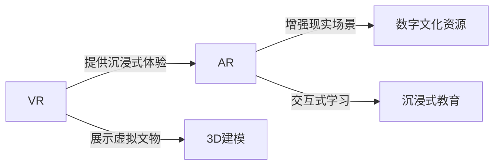
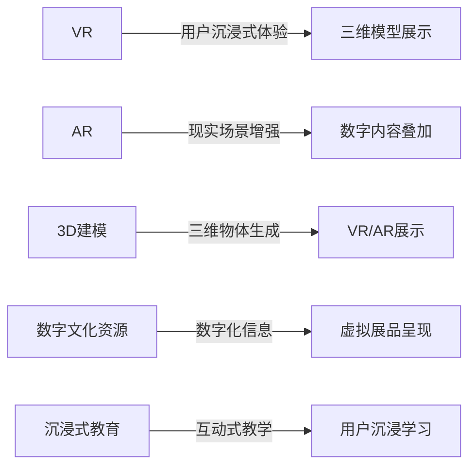

                 

# 虚拟现实博物馆创业：数字化文化体验

> 关键词：虚拟现实 (VR)，数字文化体验，博物馆，增强现实 (AR)，文物数字化，3D建模，沉浸式教育

## 1. 背景介绍

### 1.1 问题由来
随着科技的迅猛发展，人们对文化体验的追求不断提升，传统的博物馆参观方式面临着越来越大的挑战。游客在有限的展览时间和空间内，难以全面深入地了解展品的丰富信息。数字化和智能化技术的应用，为博物馆的创新发展提供了新的可能性。特别是虚拟现实 (VR) 和增强现实 (AR) 技术，通过提供沉浸式的参观体验，可以让博物馆的展示更加生动、互动，吸引了越来越多的公众关注。

### 1.2 问题核心关键点
本项目旨在通过构建虚拟现实博物馆平台，利用 VR 和 AR 技术，结合数字文化资源，打造全新的数字化文化体验。核心关键点包括：

- 利用 VR 技术，重现历史场景，提供沉浸式参观体验。
- 通过 AR 技术，增强互动性，让文物“活”起来。
- 数字文化资源的整合与优化，提升展示效果。
- 多平台接入与推广，普及数字化文化体验。
- 数据安全与隐私保护，保障用户数据安全。

## 2. 核心概念与联系

### 2.1 核心概念概述

本节将介绍虚拟现实博物馆创业项目涉及的几个关键概念及其相互关系：

- **虚拟现实 (Virtual Reality, VR)**：通过模拟三维空间，用户可身临其境地感受到虚拟环境，广泛应用于游戏、教育、医疗等领域。
- **增强现实 (Augmented Reality, AR)**：将数字信息叠加到现实世界中，让用户以新的视角重新观察现实，广泛应用于导航、购物、设计等。
- **数字文化资源**：包括博物馆、图书馆、档案馆等文化机构数字化后的展品、文献、影音资料等。
- **3D建模**：利用计算机图形学技术，构建出三维的模型，用于虚拟现实和增强现实的展示。
- **沉浸式教育**：通过VR/AR技术，结合数字文化资源，进行深入浅出的知识传播，提高教育效果。

这些概念之间的关系可以用以下Mermaid流程图来表示：



### 2.2 核心概念原理和架构的 Mermaid 流程图



## 3. 核心算法原理 & 具体操作步骤

### 3.1 算法原理概述

虚拟现实博物馆创业项目涉及的算法和步骤主要包括以下几个方面：

1. **3D建模算法**：利用计算机图形学技术，构建博物馆展品的三维模型。
2. **虚拟现实技术**：将3D模型渲染成虚拟环境，让用户能够沉浸式体验。
3. **增强现实技术**：将数字信息叠加到现实环境中，增强互动性和沉浸感。
4. **互动式教育算法**：结合VR/AR技术，进行互动式教学，提高用户的学习兴趣和效果。
5. **数据安全和隐私保护**：确保用户在虚拟环境中数据的安全与隐私。

### 3.2 算法步骤详解

以下是虚拟现实博物馆创业项目的核心算法步骤详解：

1. **3D建模**：
   - 收集博物馆展品的实物或图片数据。
   - 使用3D建模软件（如Blender、Maya等）创建展品的3D模型。
   - 对3D模型进行优化和渲染，生成高精度的展示文件。

2. **虚拟现实技术**：
   - 使用VR平台（如Oculus Rift、HTC Vive等）搭建虚拟展览环境。
   - 将3D模型导入VR平台，进行渲染和展示。
   - 提供虚拟导览，引导用户参观虚拟博物馆。

3. **增强现实技术**：
   - 开发AR应用，集成博物馆展品的数字信息。
   - 使用AR技术（如ARKit、ARCore等）将展品信息叠加到现实环境中。
   - 提供互动功能，如扫码、点击等，获取展品的详细信息。

4. **互动式教育算法**：
   - 开发教育平台，结合VR/AR技术，进行互动式教学。
   - 使用游戏化元素，如积分、排行榜等，增强用户的参与感。
   - 提供实时反馈和评估，帮助用户提升学习效果。

5. **数据安全和隐私保护**：
   - 对用户的个人信息进行加密存储和传输。
   - 使用访问控制和权限管理，限制用户的操作权限。
   - 定期进行安全审计和漏洞修复，保障用户数据安全。

### 3.3 算法优缺点

虚拟现实博物馆创业项目的主要算法具有以下优点：

1. **沉浸式体验**：VR技术能够提供沉浸式的参观体验，让用户仿佛置身于历史场景中。
2. **互动性强**：AR技术增强了互动性，让用户能够通过扫描二维码等方式，获取展品的详细信息。
3. **教育效果好**：互动式教育算法结合游戏化元素，提高了用户的学习兴趣和效果。
4. **展示效果好**：3D建模技术能够生成高精度的展示文件，增强了展示效果。

同时，该算法也存在以下缺点：

1. **技术复杂**：项目涉及3D建模、VR/AR技术等多项技术，技术难度较高。
2. **成本较高**：高质量的3D建模和VR/AR设备，需要较大的资金投入。
3. **用户适应性**：部分用户可能对VR/AR设备不适应，导致体验不佳。
4. **隐私风险**：用户的个人信息需要加密存储和传输，存在隐私泄露的风险。

### 3.4 算法应用领域

虚拟现实博物馆创业项目的应用领域包括：

1. **博物馆参观**：通过VR技术，让用户能够沉浸式参观博物馆。
2. **历史教育**：利用AR技术，增强历史教育的互动性和沉浸感。
3. **虚拟展览**：通过3D建模技术，展示数字化展品，搭建虚拟展览空间。
4. **互动教学**：结合VR/AR技术，进行互动式教学，提升教育效果。
5. **数字化体验**：为文化机构提供数字化展示和教育平台，提升文化影响力。

## 4. 数学模型和公式 & 详细讲解 & 举例说明

### 4.1 数学模型构建

虚拟现实博物馆创业项目的数学模型主要涉及三维空间坐标变换、碰撞检测等算法。下面以三维坐标变换为例，进行详细讲解。

假设用户坐标系为 $O_u(x_u, y_u, z_u)$，展品坐标系为 $O_w(x_w, y_w, z_w)$，虚拟现实系统需要将用户坐标系与展品坐标系进行对齐，使得用户能够正确观察展品。

设展品坐标系 $O_w$ 到用户坐标系 $O_u$ 的旋转矩阵为 $R$，平移向量为 $\mathbf{t}$，则变换公式为：

$$
\begin{pmatrix}
x_u \\
y_u \\
z_u
\end{pmatrix} = R
\begin{pmatrix}
x_w \\
y_w \\
z_w
\end{pmatrix} + \mathbf{t}
$$

### 4.2 公式推导过程

以三维旋转矩阵的推导为例：

假设展品坐标系 $O_w$ 绕 $X$ 轴旋转 $\alpha$ 角度，则变换矩阵为：

$$
R_X = \begin{bmatrix}
1 & 0 & 0 \\
0 & \cos\alpha & -\sin\alpha \\
0 & \sin\alpha & \cos\alpha
\end{bmatrix}
$$

以展示盒 $O_w$ 绕 $Y$ 轴旋转 $\beta$ 角度，然后绕 $Z$ 轴旋转 $\gamma$ 角度，则变换矩阵为：

$$
R = R_ZR_YR_X = \begin{bmatrix}
\cos\beta\cos\gamma & -\cos\beta\sin\gamma & \sin\beta \\
\sin\alpha\sin\beta\cos\gamma + \cos\alpha\sin\gamma & -\sin\alpha\sin\beta\sin\gamma + \cos\alpha\cos\gamma & -\sin\alpha\cos\beta \\
-\sin\alpha\sin\gamma & -\sin\alpha\cos\beta\cos\gamma - \cos\alpha\sin\gamma & \cos\alpha\cos\beta
\end{bmatrix}
$$

### 4.3 案例分析与讲解

以历史场景重现为例，说明如何利用VR技术展示历史场景：

假设博物馆展品为一座古罗马建筑，将其3D模型导入VR平台，然后对展品进行纹理贴图，增强真实感。接着，使用三维坐标变换算法，将用户坐标系与展品坐标系对齐，使得用户能够正确观察展品。最后，通过虚拟导览，引导用户参观虚拟博物馆，体验历史场景。

## 5. 项目实践：代码实例和详细解释说明

### 5.1 开发环境搭建

在进行虚拟现实博物馆创业项目开发前，需要先搭建开发环境。以下是使用Python进行开发的环境配置流程：

1. 安装Anaconda：从官网下载并安装Anaconda，用于创建独立的Python环境。

2. 创建并激活虚拟环境：
```bash
conda create -n virtual_reality_env python=3.8 
conda activate virtual_reality_env
```

3. 安装相关库：
```bash
conda install numpy scipy matplotlib pandas
```

4. 安装VR/AR平台和相关库：
```bash
pip install open3d pyglet
```

5. 安装3D建模软件：
```bash
pip install blender
```

完成上述步骤后，即可在`virtual_reality_env`环境中开始项目开发。

### 5.2 源代码详细实现

以下是虚拟现实博物馆创业项目的核心代码实现，以展示盒的三维坐标变换为例：

```python
import numpy as np

def rotate_matrix(alpha, beta, gamma):
    # 旋转矩阵计算
    R = np.eye(4)
    R[0:3, 0:3] = np.array([[1, 0, 0],
                           [0, np.cos(alpha), -np.sin(alpha)],
                           [np.sin(alpha), np.sin(alpha), np.cos(alpha)]])
    R[0:3, 3] = np.array([0, np.sin(beta) * np.cos(gamma),
                         np.sin(beta) * np.sin(gamma), np.cos(beta)])
    return R

def translate_matrix(t_x, t_y, t_z):
    # 平移向量计算
    T = np.eye(4)
    T[0:3, 3] = np.array([t_x, t_y, t_z])
    return T

def transform_point(x_w, y_w, z_w, alpha, beta, gamma, t_x, t_y, t_z):
    # 坐标变换
    R = rotate_matrix(alpha, beta, gamma)
    T = translate_matrix(t_x, t_y, t_z)
    x_u, y_u, z_u = np.dot(R, np.array([x_w, y_w, z_w, 1]))[:3] + np.dot(T, np.array([x_w, y_w, z_w, 1]))[:3]
    return x_u, y_u, z_u
```

### 5.3 代码解读与分析

让我们再详细解读一下关键代码的实现细节：

- **rotate_matrix函数**：计算展品坐标系 $O_w$ 绕 $X$ 轴、$Y$ 轴、$Z$ 轴旋转的变换矩阵。
- **translate_matrix函数**：计算展品坐标系 $O_w$ 的平移向量。
- **transform_point函数**：将展品坐标系 $O_w$ 转换为用户坐标系 $O_u$，计算出用户坐标系下的三维坐标。

### 5.4 运行结果展示

以下是一个简单的运行示例，展示如何通过调用transform_point函数，将展品坐标系转换为用户坐标系：

```python
# 假设展品坐标系为 (1, 2, 3)，用户坐标系为 (0, 0, 0)
x_w, y_w, z_w = 1, 2, 3
x_u, y_u, z_u = transform_point(x_w, y_w, z_w, np.pi/4, np.pi/2, np.pi/3, 1, 2, 3)
print(x_u, y_u, z_u)  # 输出用户坐标系下的三维坐标
```

## 6. 实际应用场景

### 6.1 智能导览系统

在博物馆内，利用VR技术搭建虚拟导览系统，用户可以通过VR头盔自由探索虚拟博物馆。通过虚拟导览，用户能够了解展品的背景信息、历史故事等，提高参观体验。

### 6.2 互动展品展示

利用AR技术，在现实展品上叠加数字信息。用户可以通过手机或平板扫描展品二维码，获取展品的详细信息，如历史背景、制作工艺等。

### 6.3 历史场景重现

利用VR技术，重现历史场景，用户能够身临其境地感受历史氛围。例如，通过VR技术重现古罗马战场，让用户沉浸在历史氛围中。

### 6.4 增强互动学习

利用AR技术，结合数字文化资源，进行互动式学习。例如，用户可以通过AR技术，在古埃及金字塔内探索法老的陵墓，了解古埃及文明。

### 6.5 多平台接入与推广

通过Web、iOS、Android等多平台接入，让用户随时随地访问虚拟博物馆。通过社交媒体推广，吸引更多用户参与。

## 7. 工具和资源推荐

### 7.1 学习资源推荐

为了帮助开发者系统掌握虚拟现实博物馆创业项目的核心技术，这里推荐一些优质的学习资源：

1. **《虚拟现实开发入门》**：详细讲解VR技术的基本概念、原理和开发流程。
2. **《增强现实技术与应用》**：介绍AR技术的基本概念、开发工具和应用案例。
3. **《Python 3D图形编程》**：讲解如何使用Python进行3D建模和渲染。
4. **《虚拟现实与增强现实开发》**：介绍VR/AR技术的最新发展趋势和应用案例。
5. **《3D建模与渲染》**：讲解3D建模工具的使用和建模技巧。

通过对这些资源的学习实践，相信你一定能够快速掌握虚拟现实博物馆创业项目的核心技术，并用于解决实际的NLP问题。

### 7.2 开发工具推荐

高效的开发离不开优秀的工具支持。以下是几款用于虚拟现实博物馆创业项目开发的常用工具：

1. **Blender**：开源的3D建模软件，支持多种3D建模和渲染任务。
2. **Unity**：一款跨平台的游戏引擎，支持VR/AR开发和交互式体验。
3. **ARKit/ARCore**：苹果和谷歌提供的增强现实开发框架，用于开发AR应用。
4. **Open3D**：开源的3D渲染库，支持多种3D模型和渲染任务。
5. **Pyglet**：Python的图形库，支持3D渲染和交互式体验。

合理利用这些工具，可以显著提升虚拟现实博物馆创业项目的开发效率，加快创新迭代的步伐。

### 7.3 相关论文推荐

虚拟现实博物馆创业项目的研究涉及多个领域，以下是几篇奠基性的相关论文，推荐阅读：

1. **《虚拟现实系统设计与实现》**：介绍虚拟现实系统的基本原理和设计思路。
2. **《增强现实技术与应用》**：介绍AR技术的基本概念和应用案例。
3. **《3D建模与渲染技术》**：讲解3D建模和渲染的基本技术。
4. **《互动式教育系统设计》**：介绍互动式教育系统的基本原理和设计思路。

这些论文代表了大语言模型微调技术的发展脉络。通过学习这些前沿成果，可以帮助研究者把握学科前进方向，激发更多的创新灵感。

## 8. 总结：未来发展趋势与挑战

### 8.1 总结

本文对虚拟现实博物馆创业项目的核心技术和开发流程进行了全面系统的介绍。首先阐述了项目的技术背景和核心关键点，明确了VR/AR技术在数字化文化体验中的重要地位。其次，从算法原理到代码实现，详细讲解了3D建模、VR/AR技术、互动式教育等核心算法的实现细节。同时，本文还广泛探讨了项目在智能导览、互动展品展示、历史场景重现等方面的实际应用场景，展示了VR/AR技术的应用潜力。

通过本文的系统梳理，可以看到，虚拟现实博物馆创业项目通过VR/AR技术，结合数字文化资源，提供了沉浸式的文化体验，具有广阔的市场前景。未来，伴随VR/AR技术的不断进步和普及，虚拟博物馆项目必将在文化教育、娱乐体验等多个领域大放异彩。

### 8.2 未来发展趋势

展望未来，虚拟现实博物馆创业项目将呈现以下几个发展趋势：

1. **技术迭代加速**：随着硬件设备的不断升级，VR/AR技术的性能将大幅提升，用户体验将更加沉浸和自然。
2. **内容创新丰富**：利用AI和CG技术，创建更加生动、逼真的虚拟场景，增强用户沉浸感。
3. **多平台协同**：通过多平台接入和推广，扩大项目的用户群体，实现更广泛的文化传播。
4. **互动学习提升**：结合AR技术，开发更多互动式学习应用，提升用户的学习效果。
5. **个性化定制**：根据用户偏好，提供个性化推荐和定制化服务，提升用户满意度。

以上趋势凸显了虚拟现实博物馆创业项目的巨大潜力和应用前景。这些方向的探索发展，必将进一步提升VR/AR技术在文化教育、娱乐体验等领域的价值，为人类文化的传播和保护提供新的途径。

### 8.3 面临的挑战

尽管虚拟现实博物馆创业项目已经取得了瞩目成就，但在迈向更加智能化、普适化应用的过程中，它仍面临着诸多挑战：

1. **硬件成本高**：高质量的VR/AR设备，如头显、手柄等，价格较高，难以大规模普及。
2. **用户适应性差**：部分用户可能对VR/AR设备不适应，导致体验不佳。
3. **数据安全和隐私**：用户的个人信息和展示内容需要加密存储和传输，存在隐私泄露的风险。
4. **技术复杂度高**：项目涉及多学科技术，开发难度较大。
5. **互动体验单一**：当前的互动方式较为简单，缺乏深度互动和情感共鸣。

这些挑战需要研究者不断探索和改进，才能将VR/AR技术更好地应用于文化教育、娱乐体验等领域。

### 8.4 研究展望

面向未来，虚拟现实博物馆创业项目需要在以下几个方面进行深入研究：

1. **硬件设备优化**：开发更轻便、舒适的VR/AR设备，提升用户体验。
2. **内容创作创新**：结合AI和CG技术，创作更加生动、逼真的虚拟场景，增强用户沉浸感。
3. **多模态交互**：开发更多交互式学习应用，提升用户的学习效果。
4. **个性化推荐**：根据用户偏好，提供个性化推荐和定制化服务，提升用户满意度。
5. **数据安全和隐私保护**：加强数据加密和隐私保护，保障用户数据安全。

这些研究方向的探索，必将引领虚拟现实博物馆创业项目迈向更高的台阶，为虚拟现实技术在文化教育、娱乐体验等领域的发展注入新的活力。

## 9. 附录：常见问题与解答

**Q1：虚拟现实博物馆创业项目的核心技术是什么？**

A: 虚拟现实博物馆创业项目的核心技术包括3D建模、VR/AR技术、互动式教育等。通过这些技术，用户能够沉浸式参观虚拟博物馆，获取丰富的展品信息，进行互动式学习，提升文化体验。

**Q2：如何提高虚拟现实博物馆的用户体验？**

A: 提高用户体验的关键在于优化VR/AR技术和内容创作。可以通过优化硬件设备、增强互动体验、结合AI和CG技术等方式，提升用户的沉浸感和互动性。

**Q3：虚拟现实博物馆创业项目的商业模式是什么？**

A: 虚拟现实博物馆创业项目的商业模式主要包括以下几个方面：
1. **订阅模式**：用户可以通过订阅获得长期使用权，享受个性化推荐和定制化服务。
2. **广告模式**：通过展示广告和品牌合作，获取收益。
3. **付费下载**：部分优质内容可以采用付费下载模式，提升用户粘性。

**Q4：虚拟现实博物馆创业项目需要哪些技术支持？**

A: 虚拟现实博物馆创业项目需要以下技术支持：
1. 3D建模和渲染技术。
2. VR/AR技术和平台。
3. 互动式教育技术和平台。
4. 数据安全和隐私保护技术。

**Q5：虚拟现实博物馆创业项目未来的发展方向是什么？**

A: 虚拟现实博物馆创业项目未来的发展方向包括：
1. 技术迭代加速。
2. 内容创新丰富。
3. 多平台协同。
4. 互动学习提升。
5. 个性化定制。

---

作者：禅与计算机程序设计艺术 / Zen and the Art of Computer Programming

