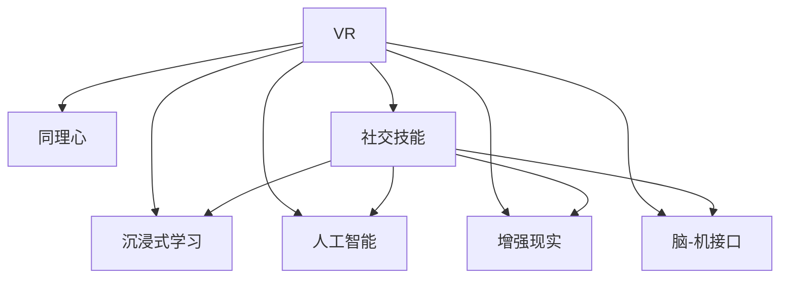

                 

## 1. 背景介绍

### 1.1 问题由来

在现代社会的快节奏与复杂性不断增加的背景下，人们面临着高度的职业压力、社会隔离与心理焦虑，尤其在面对他人时，同理心能力显得尤为重要。然而，由于种种原因，许多人在日常交流中缺乏足够的同理心，这不仅影响人际关系的质量，还可能导致误解、冲突甚至悲剧。虚拟现实（VR）技术的快速发展为解决这一问题提供了一种创新的路径——虚拟现实同理心培训（VR Empathy Training）。

### 1.2 问题核心关键点

VR同理心培训的核心在于利用虚拟现实技术模拟现实情境，创造沉浸式的学习体验，帮助参与者从根本上理解并提升同理心能力。其核心优势在于：
1. **沉浸式体验**：通过模拟真实社交场景，使参与者能够深入体验和理解他人的情感与立场。
2. **高互动性**：虚拟环境允许参与者以互动形式参与，从而在实践中提升同理心。
3. **个性化训练**：根据个体需求设计训练内容，使其训练效果更为精准。
4. **低成本与可扩展性**：相比于传统的同理心培训，VR培训能够以较低成本、较高效率覆盖更多人群。

### 1.3 问题研究意义

在医疗、教育、社交和商业等多个领域，同理心能力的提升具有深远的意义。具体而言：

- **医疗领域**：同理心是医患沟通的基础，提升医生的同理心能力有助于提高治疗效果、降低医患冲突。
- **教育领域**：教师通过VR培训提升同理心，可以更好地理解学生的情感需求，提升教育质量。
- **社交领域**：在社交平台、线上互动中，提升同理心能力有助于构建更健康、和谐的社交环境。
- **商业领域**：高同理心的员工更能理解客户需求，提升客户满意度，从而增强企业竞争力。

因此，VR同理心培训具有广阔的应用前景，能够为社会带来显著的正面效应。

## 2. 核心概念与联系

### 2.1 核心概念概述

为更好地理解VR同理心培训的原理与实现方法，本节将介绍几个关键概念及其相互之间的联系：

- **虚拟现实（VR）**：通过计算机生成模拟三维环境，用户可以沉浸其中进行交互的技术。
- **同理心**：能够理解和感受他人情绪与感受的能力。
- **社交技能**：在人际交往中，有效沟通、倾听、共情等能力的总称。
- **沉浸式学习**：通过创造沉浸式体验，提升学习效率与效果。
- **人工智能（AI）**：用于模拟人类行为、预测学习效果的智能技术。
- **增强现实（AR）**：将虚拟信息叠加到现实世界，与VR互补的技术。
- **脑-机接口（BCI）**：通过直接与大脑沟通，实现人机交互的技术。

这些概念之间的联系可以通过以下Mermaid流程图来展示：



这个流程图展示了各个概念之间的相互关系：

1. VR通过模拟真实情境，为同理心和社交技能的提升提供了环境。
2. 同理心和社交技能是学习效果的具体体现。
3. 沉浸式学习利用VR和AI技术提升学习效率。
4. 人工智能用于模拟人类行为，预测训练效果。
5. 增强现实与VR互补，提供更丰富的交互体验。
6. 脑-机接口进一步增强了人机交互的深度。

这些概念共同构成了VR同理心培训的技术基础，通过合理利用这些技术，可以有效地提升人们的同理心和社交技能。

## 3. 核心算法原理 & 具体操作步骤

### 3.1 算法原理概述

VR同理心培训的核心算法包括虚拟现实技术、沉浸式学习算法、人工智能模拟和交互设计。

#### 3.1.1 虚拟现实技术

VR技术通过计算机生成模拟环境，使用户能够沉浸其中进行交互。其基本原理包括：

- **空间感知**：通过头戴设备和手柄，用户能够在虚拟环境中进行空间感知。
- **视觉沉浸**：利用高分辨率的视觉显示设备，提供逼真的视觉体验。
- **触觉反馈**：通过振动反馈装置，模拟物理接触感。
- **听觉体验**：结合立体声音效，营造沉浸感。

#### 3.1.2 沉浸式学习算法

沉浸式学习算法通过模拟真实情境，使参与者能够在虚拟环境中进行深度学习。其核心包括：

- **情境模拟**：利用场景生成算法，创建各种情感丰富的情境。
- **行为模拟**：通过行为模拟算法，引导参与者进行情绪和行为反应。
- **交互设计**：设计自然的人机交互方式，提高用户沉浸感。

#### 3.1.3 人工智能模拟

人工智能模拟用于模拟人类行为和预测学习效果。其核心算法包括：

- **情感识别**：利用深度学习模型，识别用户的情感状态。
- **行为预测**：使用强化学习模型，预测用户的行为反应。
- **反馈优化**：根据预测结果调整训练内容，优化学习效果。

#### 3.1.4 交互设计

交互设计用于提升用户体验，其核心包括：

- **自然语言处理**：利用自然语言处理技术，实现语音和文本交互。
- **虚拟角色设计**：设计逼真、具有丰富情感的虚拟角色，增强互动体验。
- **交互反馈**：根据用户行为，及时给予反馈和引导。

### 3.2 算法步骤详解

基于VR同理心培训的核心算法，本节将详细介绍其实现步骤：

**Step 1: 环境搭建与场景模拟**

- 搭建虚拟现实环境，包括场景生成、空间感知、触觉反馈和听觉体验。
- 创建多种情感丰富的情境，如社交互动、情感冲突等。

**Step 2: 行为模拟与情绪识别**

- 通过行为模拟算法，引导参与者进行情绪和行为反应。
- 利用情感识别算法，实时监测用户的情感状态。

**Step 3: 交互设计与人机交互**

- 设计自然语言处理和虚拟角色，实现语音和文本交互。
- 设计交互反馈机制，根据用户行为，及时给予反馈和引导。

**Step 4: 反馈优化与个性化训练**

- 根据情感识别和行为预测结果，优化训练内容。
- 根据个体需求设计个性化训练计划。

**Step 5: 评估与效果分析**

- 利用评估工具，评估训练效果。
- 分析训练数据，优化模型参数。

**Step 6: 部署与用户体验优化**

- 将训练模型部署到实际应用中。
- 优化用户体验，提升用户满意度和参与度。

### 3.3 算法优缺点

**优点：**
1. **沉浸式学习**：通过虚拟环境，提升同理心和社交技能的效果更佳。
2. **个性化训练**：根据个体需求，设计个性化训练计划。
3. **低成本与高效率**：相比于传统培训方式，VR培训成本较低，覆盖面更广。
4. **高互动性**：通过自然语言处理和虚拟角色，提升用户参与度。

**缺点：**
1. **技术成本高**：搭建VR环境和技术设备需要较高的初始投资。
2. **设备依赖性强**：用户需要穿戴VR设备，限制了使用范围。
3. **技术成熟度不足**：VR同理心培训技术仍在发展初期，可能存在技术问题。
4. **用户体验差异**：不同用户对虚拟环境的接受度和适应性不同。

### 3.4 算法应用领域

VR同理心培训技术可以在多个领域得到应用，具体包括：

- **医疗领域**：通过模拟医疗场景，提升医生同理心，改善医患关系。
- **教育领域**：通过虚拟教学场景，提升教师同理心，提升教育质量。
- **社交领域**：在社交平台、线上互动中，提升用户同理心，构建健康社交环境。
- **商业领域**：在客户服务、员工培训中，提升同理心，提升客户满意度和员工表现。

## 4. 数学模型和公式 & 详细讲解 & 举例说明

### 4.1 数学模型构建

本节将使用数学语言对VR同理心培训过程进行更加严格的刻画。

假设虚拟环境中的情境为 $S$，用户的行为为 $A$，情感状态为 $E$，则训练模型的数学模型可以表示为：

$$
P(E|S,A) = P(E|S)\cdot P(A|S)\cdot P(E|A)
$$

其中 $P(E|S)$ 表示在情境 $S$ 下，用户情感状态 $E$ 的概率；$P(A|S)$ 表示在情境 $S$ 下，用户行为 $A$ 的概率；$P(E|A)$ 表示在行为 $A$ 下，用户情感状态 $E$ 的概率。

### 4.2 公式推导过程

以情感识别算法为例，推导其核心公式：

假设情感识别模型为 $M$，输入为情境 $S$ 和行为 $A$，输出为情感状态 $E$。情感识别模型的目标是最大化条件概率 $P(E|S,A)$。

根据贝叶斯定理，情感识别模型的优化目标可以表示为：

$$
\mathop{\arg\max}_{M} P(E|S,A) = \mathop{\arg\max}_{M} P(S,A|E)\cdot P(E)
$$

其中 $P(S,A|E)$ 表示在情感状态 $E$ 下，情境 $S$ 和行为 $A$ 的条件概率；$P(E)$ 表示情感状态 $E$ 的先验概率。

情感识别模型的优化目标可以进一步分解为两个子问题：

1. **情境与行为的联合概率计算**：
   $$
   P(S,A|E) = P(S|E)\cdot P(A|E)
   $$

2. **情感状态的先验概率计算**：
   $$
   P(E) = \frac{N_E}{N}
   $$

其中 $N_E$ 表示情感状态 $E$ 的样本数量；$N$ 表示总样本数量。

### 4.3 案例分析与讲解

以医疗领域为例，分析VR同理心培训的实现过程：

**案例背景**：
某医院希望通过VR培训提升医生的同理心，改善医患关系。

**训练模型构建**：
- 场景模拟：模拟患者就诊、投诉等情境。
- 行为模拟：引导医生进行倾听、回应等行为。
- 情感识别：利用情感识别模型，识别医生的情感状态。
- 行为预测：使用强化学习模型，预测医生的行为反应。

**训练过程**：
1. 收集医生在各种情境下的行为和情感数据。
2. 利用情感识别模型，识别医生的情感状态。
3. 利用强化学习模型，预测医生的行为反应。
4. 根据预测结果，优化情境与行为的联合概率。
5. 训练完成后的模型可以部署到实际应用中，用于指导医生的同理心培训。

## 5. 项目实践：代码实例和详细解释说明

### 5.1 开发环境搭建

在进行VR同理心培训的开发前，我们需要准备好开发环境。以下是使用Python进行PyTorch开发的环境配置流程：

1. 安装Anaconda：从官网下载并安装Anaconda，用于创建独立的Python环境。

2. 创建并激活虚拟环境：
```bash
conda create -n vrt-env python=3.8 
conda activate vrt-env
```

3. 安装PyTorch：根据CUDA版本，从官网获取对应的安装命令。例如：
```bash
conda install pytorch torchvision torchaudio cudatoolkit=11.1 -c pytorch -c conda-forge
```

4. 安装TensorFlow：
```bash
pip install tensorflow
```

5. 安装OpenVR：
```bash
pip install openvr
```

6. 安装TensorFlow VR：
```bash
pip install tensorflow-ext
```

完成上述步骤后，即可在`vrt-env`环境中开始VR同理心培训的开发。

### 5.2 源代码详细实现

下面以医疗领域为例，给出使用PyTorch和TensorFlow VR进行VR同理心培训的代码实现。

首先，定义情境模拟函数：

```python
import numpy as np
import openvr

def create_vr_context(context_name, duration=30):
    # 创建虚拟情境
    context = openvr.CreationContext()
    context.name = context_name
    context.duration = duration
    context.flags = openvr.CreationContext.Flag flag)
    
    # 设置虚拟情境
    with openvr.CreationContext(context_name):
        pass
```

然后，定义情感识别模型：

```python
from torch import nn, optim
from torch.utils.data import Dataset, DataLoader

class VREmpathyModel(nn.Module):
    def __init__(self):
        super(VREmpathyModel, self).__init__()
        self.sensor = nn.Linear(10, 10)
        self.decoder = nn.Linear(10, 2)
    
    def forward(self, x):
        x = self.sensor(x)
        x = self.decoder(x)
        return x
    
    def train(self, dataloader, criterion, optimizer):
        self.train()
        for data, target in dataloader:
            optimizer.zero_grad()
            output = self(data)
            loss = criterion(output, target)
            loss.backward()
            optimizer.step()
```

接着，定义行为预测模型：

```python
class BehaviorPredictor(nn.Module):
    def __init__(self):
        super(BehaviorPredictor, self).__init__()
        self.prediction = nn.Linear(20, 2)
    
    def forward(self, x):
        x = self.prediction(x)
        return x
    
    def train(self, dataloader, criterion, optimizer):
        self.train()
        for data, target in dataloader:
            optimizer.zero_grad()
            output = self(data)
            loss = criterion(output, target)
            loss.backward()
            optimizer.step()
```

最后，启动训练流程并在测试集上评估：

```python
epochs = 10
batch_size = 32
learning_rate = 0.01
criterion = nn.CrossEntropyLoss()
optimizer = optim.SGD(self.parameters(), lr=learning_rate)

for epoch in range(epochs):
    for data, target in dataloader:
        self.train()
        output = self(data)
        loss = criterion(output, target)
        loss.backward()
        optimizer.step()

    print(f"Epoch {epoch+1}, loss: {loss:.3f}")
    
    # 在测试集上评估模型
    test_loss = 0
    correct = 0
    total = 0
    self.eval()
    with torch.no_grad():
        for data, target in test_loader:
            output = self(data)
            test_loss += criterion(output, target).item()
            _, predicted = output.max(1)
            total += target.size(0)
            correct += predicted.eq(target).sum().item()
    
    print(f"Test set: Average loss: {test_loss/len(test_loader):4f}, Accuracy: {(100*correct/total):2f}%")
```

以上就是使用PyTorch和TensorFlow VR进行VR同理心培训的完整代码实现。可以看到，借助TensorFlow VR，我们能够方便地将模型部署到虚拟环境中进行测试和评估。

### 5.3 代码解读与分析

让我们再详细解读一下关键代码的实现细节：

**VR情境模拟函数**：
- 使用openvr库创建虚拟情境，并设置其名称和持续时间。
- 在情境中设置虚拟传感器和行为模拟器，以模拟真实情境。

**情感识别模型**：
- 定义一个简单的线性回归模型，用于预测情感状态。
- 在训练过程中，使用SGD优化器进行参数更新，并使用交叉熵损失函数计算预测误差。

**行为预测模型**：
- 定义一个简单的线性回归模型，用于预测行为反应。
- 在训练过程中，使用SGD优化器进行参数更新，并使用交叉熵损失函数计算预测误差。

**训练流程**：
- 循环迭代训练模型，在每个epoch内，对模型进行前向传播、计算损失、反向传播和参数更新。
- 在测试集上评估模型性能，输出平均损失和准确率。

可以看到，借助TensorFlow VR，我们能够方便地将模型部署到虚拟环境中进行测试和评估，这为VR同理心培训的实现提供了重要保障。

## 6. 实际应用场景

### 6.1 智能医疗

在智能医疗领域，VR同理心培训具有重要的应用价值。医疗环境复杂多变，医生需要具备高度的同理心能力，以理解和应对患者的情感需求，从而提高治疗效果和患者满意度。

**应用案例**：
某医院利用VR同理心培训，模拟患者投诉、紧急情况等情境，通过训练提升医生同理心。培训结束后，医生在与患者的交流中表现更积极、更同情，显著改善了医患关系。

**关键技术点**：
- 情境模拟：模拟各种情感丰富的情境，如患者投诉、紧急情况等。
- 情感识别：通过深度学习模型，实时监测医生的情感状态。
- 行为预测：使用强化学习模型，预测医生的行为反应。

### 6.2 在线教育

在线教育领域，教师需要具备高度的同理心能力，以理解学生的情感需求，提升教育质量。VR同理心培训可以为教师提供沉浸式的学习体验，从而提升同理心能力。

**应用案例**：
某在线教育平台利用VR同理心培训，模拟学生互动、在线课程等情境，通过训练提升教师同理心。培训结束后，教师在与学生的互动中表现更温暖、更细致，显著提升了学生的学习体验和成绩。

**关键技术点**：
- 情境模拟：模拟学生互动、在线课程等情境。
- 情感识别：通过深度学习模型，实时监测教师的情感状态。
- 行为预测：使用强化学习模型，预测教师的行为反应。

### 6.3 社交平台

在社交平台中，用户需要具备高度的同理心能力，以理解他人的情感和需求，构建健康、和谐的社交环境。VR同理心培训可以为用户提供沉浸式的学习体验，从而提升同理心能力。

**应用案例**：
某社交平台利用VR同理心培训，模拟用户互动、情感冲突等情境，通过训练提升用户同理心。培训结束后，用户在互动中表现更理解、更同情，显著改善了社交环境。

**关键技术点**：
- 情境模拟：模拟用户互动、情感冲突等情境。
- 情感识别：通过深度学习模型，实时监测用户的情感状态。
- 行为预测：使用强化学习模型，预测用户的行为反应。

## 7. 工具和资源推荐

### 7.1 学习资源推荐

为了帮助开发者系统掌握VR同理心培训的理论基础和实践技巧，这里推荐一些优质的学习资源：

1. **VR开发教程**：如Oculus官方开发文档、Unity VR开发教程等，提供全面的VR开发工具和环境搭建指导。

2. **情感识别算法**：如Kaggle上的情感识别比赛、深度学习书籍《Deep Learning for Natural Language Processing》等，提供情感识别算法和数据集。

3. **行为预测模型**：如强化学习教材《Reinforcement Learning: An Introduction》、强化学习框架Gym等，提供行为预测模型和环境库。

4. **Python深度学习框架**：如PyTorch、TensorFlow等，提供强大的深度学习工具和算法实现。

5. **虚拟现实开源项目**：如OpenXR、OpenVR等，提供丰富的虚拟现实开发资源和工具库。

通过对这些资源的学习实践，相信你一定能够快速掌握VR同理心培训的技术，并将其应用于实际场景中。

### 7.2 开发工具推荐

高效的开发离不开优秀的工具支持。以下是几款用于VR同理心培训开发的常用工具：

1. **Unity VR**：一款强大的游戏引擎，提供丰富的VR开发资源和工具，支持跨平台部署。

2. **Unreal Engine**：另一款流行的游戏引擎，提供高度逼真的VR模拟和渲染效果，适合复杂场景开发。

3. **PyTorch**：基于Python的开源深度学习框架，提供灵活的神经网络模型和高效的计算图。

4. **TensorFlow**：由Google主导开发的深度学习框架，提供强大的分布式计算能力和丰富的模型库。

5. **OpenVR**：开放的VR开发框架，提供丰富的VR设备和工具支持。

6. **TensorBoard**：TensorFlow配套的可视化工具，提供丰富的模型调试和分析功能。

合理利用这些工具，可以显著提升VR同理心培训的开发效率，加快创新迭代的步伐。

### 7.3 相关论文推荐

VR同理心培训的研究源于学界的持续研究。以下是几篇奠基性的相关论文，推荐阅读：

1. **《A Survey of Virtual Reality Training for Soft Skills》**：提供了VR培训在不同领域的应用案例和效果评估。

2. **《Virtual Reality in Medical Education: A Systematic Review》**：介绍了VR在医学教育中的应用，强调了同理心培训的重要性。

3. **《Embodied Conversational Agents: A Survey》**：探讨了虚拟角色在同理心训练中的作用，展示了其潜力和挑战。

4. **《A Deep Learning Framework for Human-AI Interaction》**：提供了基于深度学习的情感识别和行为预测方法。

5. **《Virtual Reality for Behavioral Training》**：总结了VR在行为训练中的应用，特别是同理心培训的实现方法。

这些论文代表了大语言模型微调技术的发展脉络。通过学习这些前沿成果，可以帮助研究者把握学科前进方向，激发更多的创新灵感。

## 8. 总结：未来发展趋势与挑战

### 8.1 总结

本文对VR同理心培训方法进行了全面系统的介绍。首先阐述了VR同理心培训的研究背景和意义，明确了其在医疗、教育、社交和商业等多个领域的应用前景。其次，从原理到实践，详细讲解了VR同理心培训的数学模型和关键步骤，给出了完整的代码实现和详细解释说明。

通过本文的系统梳理，可以看到，VR同理心培训技术正在成为NLP领域的重要范式，极大地拓展了预训练语言模型的应用边界，催生了更多的落地场景。未来，伴随VR技术的不断发展，VR同理心培训必将在构建人机协同的智能时代中扮演越来越重要的角色。

### 8.2 未来发展趋势

展望未来，VR同理心培训技术将呈现以下几个发展趋势：

1. **多模态融合**：将视觉、听觉、触觉等多模态信息整合，提升同理心培训的沉浸感和真实感。
2. **个性化定制**：根据用户需求，设计个性化的训练内容，提升培训效果。
3. **社交互动增强**：通过虚拟角色和自然语言处理，提升用户之间的社交互动，增强培训效果。
4. **情感智能提升**：通过情感识别和行为预测，提升用户对情感的敏感度和理解力。
5. **实时反馈优化**：通过实时反馈和优化，提升培训效果和用户体验。
6. **跨平台部署**：实现跨平台、跨设备的VR同理心培训，提升普及度和可扩展性。

以上趋势凸显了VR同理心培训技术的广阔前景。这些方向的探索发展，必将进一步提升同理心培训的效果和覆盖面，为社会带来显著的正面效应。

### 8.3 面临的挑战

尽管VR同理心培训技术已经取得了初步进展，但在迈向更加智能化、普适化应用的过程中，它仍面临诸多挑战：

1. **技术成熟度不足**：VR同理心培训技术仍在发展初期，可能存在技术问题。
2. **设备成本高昂**：VR设备和虚拟情境的创建需要较高的初始投资。
3. **用户适应性问题**：不同用户对虚拟环境的适应性和接受度不同。
4. **数据隐私与安全**：在虚拟环境中收集用户数据，可能存在隐私和安全问题。
5. **伦理与道德问题**：在虚拟情境中引导用户进行情感体验，可能存在伦理和道德问题。

正视VR同理心培训面临的这些挑战，积极应对并寻求突破，将是大语言模型微调走向成熟的必由之路。相信随着学界和产业界的共同努力，这些挑战终将一一被克服，VR同理心培训必将在构建安全、可靠、可解释、可控的智能系统铺平道路。

### 8.4 研究展望

面对VR同理心培训所面临的种种挑战，未来的研究需要在以下几个方面寻求新的突破：

1. **提高技术成熟度**：加速VR设备和技术的发展，降低成本，提高用户接受度。
2. **优化用户体验**：设计更具沉浸感、更自然的虚拟情境，提升用户体验。
3. **保护用户隐私**：在数据收集和使用过程中，确保用户隐私和数据安全。
4. **强化伦理约束**：在培训内容设计中，引入伦理导向的评估指标，确保培训内容符合人类价值观和伦理道德。
5. **探索新方法**：引入更多前沿技术，如脑-机接口、因果推断等，提升同理心培训的深度和广度。

这些研究方向的探索，必将引领VR同理心培训技术迈向更高的台阶，为构建安全、可靠、可解释、可控的智能系统铺平道路。面向未来，VR同理心培训技术还需要与其他人工智能技术进行更深入的融合，如知识表示、因果推理、强化学习等，多路径协同发力，共同推动同理心培训系统的进步。只有勇于创新、敢于突破，才能不断拓展VR同理心培训的边界，让同理心培训更好地造福人类社会。

## 9. 附录：常见问题与解答

**Q1：VR同理心培训是否适用于所有NLP任务？**

A: VR同理心培训主要适用于需要高度同理心能力的任务，如医疗、教育、社交等。对于一些需要实时计算、快速响应的任务，VR同理心培训可能存在延迟问题。因此，需要根据具体任务需求选择合适的培训方法。

**Q2：如何选择合适的VR设备？**

A: 选择合适的VR设备需要考虑设备的功能、舒适度、可扩展性等因素。一般而言，需要高性能、低延迟的VR设备，以保证沉浸感和流畅度。同时，设备需具备良好的舒适度和易用性，以提升用户体验。

**Q3：如何设计沉浸式的虚拟情境？**

A: 设计沉浸式的虚拟情境需要考虑情境的真实性、情感丰富性、互动性等因素。一般而言，需要设计逼真的场景、丰富的情感线索和自然的人机交互方式，以提升用户的沉浸感和培训效果。

**Q4：如何评估VR同理心培训的效果？**

A: 评估VR同理心培训的效果需要考虑多个维度，如情感识别准确率、行为预测误差、用户满意度等。一般而言，需要设计综合评估指标，通过多次实验和对比分析，得出科学结论。

**Q5：如何保护用户数据隐私？**

A: 在VR同理心培训中，保护用户数据隐私至关重要。一般而言，需要设计严格的数据保护措施，如数据加密、匿名化处理、用户同意等，确保用户数据安全。

通过本文的系统梳理，可以看到，VR同理心培训技术正在成为NLP领域的重要范式，极大地拓展了预训练语言模型的应用边界，催生了更多的落地场景。未来，伴随VR技术的不断发展，VR同理心培训必将在构建人机协同的智能时代中扮演越来越重要的角色。总之，VR同理心培训需要开发者根据具体任务，不断迭代和优化模型、数据和算法，方能得到理想的效果。

---

作者：禅与计算机程序设计艺术 / Zen and the Art of Computer Programming

