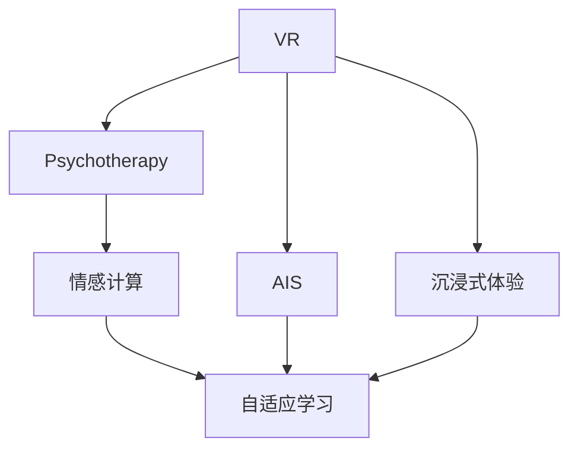

                 

# 虚拟现实疗法：AI辅助的心理治疗

> 关键词：虚拟现实(VR), 人工智能(AI), 心理治疗, 心理健康, 自适应学习, 沉浸式体验, 情感计算

## 1. 背景介绍

### 1.1 问题由来
随着社会的快速发展，人们面对的压力日益增大，心理疾病的发病率逐年上升。心理治疗已成为许多人心声的求助途径，但传统的面对面心理治疗存在许多限制，如地理空间限制、时间成本、治疗费用等。此外，心理治疗的效果受诸多因素影响，如患者的个性、治疗师的水平、治疗环境等。

虚拟现实(VR)技术以其高度的沉浸性和互动性，为心理治疗提供了一种新的可能性。AI技术的飞速发展，尤其是自然语言处理、机器学习和情感计算等方面，使得VR与AI技术相结合，成为一种创新的心理治疗方式。

### 1.2 问题核心关键点
虚拟现实疗法（VR Psychotherapy）通过结合VR技术和AI技术，提供一种更加个性化、沉浸式和高效的心理治疗方式。核心关键点包括：

- **沉浸式环境**：利用VR技术创建高度沉浸式的治疗场景，增强患者的参与感和代入感。
- **个性化治疗**：通过AI技术根据患者的具体情况，定制个性化的治疗方案。
- **实时反馈与优化**：AI系统实时监测患者的情绪和生理反应，及时调整治疗策略。
- **数据驱动的决策**：基于大量患者的治疗数据，AI系统不断学习和优化，提升治疗效果。

## 2. 核心概念与联系

### 2.1 核心概念概述

为更好地理解虚拟现实疗法（VR Psychotherapy）的原理和架构，本节将介绍几个密切相关的核心概念：

- **虚拟现实（Virtual Reality, VR）**：通过计算机生成的3D图像和声音，创建一个模拟的环境，使患者在视觉、听觉和触觉上得到沉浸式的体验。
- **人工智能（Artificial Intelligence, AI）**：利用算法和机器学习技术，使计算机具备模拟人类智能行为的能力。
- **心理治疗（Psychotherapy）**：通过心理咨询、心理疏导等方法，帮助患者解决心理问题，提升心理健康。
- **情感计算（Affective Computing）**：研究如何通过计算手段获取、识别、模拟和处理人类情感的技术。
- **自适应学习（Adaptive Learning）**：根据学习者的表现和反馈，动态调整学习内容和策略，以提高学习效果。
- **沉浸式体验（Immersive Experience）**：利用VR等技术，使学习者深度投入到虚拟环境中，增强学习效果。

这些核心概念之间的逻辑关系可以通过以下Mermaid流程图来展示：



这个流程图展示了几大核心概念之间的联系：

1. VR技术为心理治疗提供了沉浸式的环境。
2. AI技术通过情感计算和自适应学习，提升了心理治疗的个性化和实时性。
3. 沉浸式体验增强了患者的参与感和治疗效果。

## 3. 核心算法原理 & 具体操作步骤
### 3.1 算法原理概述

虚拟现实疗法（VR Psychotherapy）的核心算法原理可以概括为：

- **环境创建**：利用VR技术创建逼真的治疗环境，包括虚拟角色、场景、物品等，提供沉浸式体验。
- **数据收集**：通过传感器、摄像头、麦克风等设备收集患者的生理和心理数据，如心率、皮肤电、表情、语音等。
- **情感识别**：使用机器学习模型分析患者的生理和心理数据，识别其情绪状态，如焦虑、抑郁、压力等。
- **治疗方案生成**：根据患者的情绪状态和个性化信息，生成定制化的治疗方案。
- **实时反馈与调整**：根据实时反馈数据，AI系统动态调整治疗方案，提升治疗效果。
- **数据驱动优化**：基于大量治疗数据，不断优化模型和算法，提高治疗效果。

### 3.2 算法步骤详解

以下是虚拟现实疗法（VR Psychotherapy）的核心算法步骤：

1. **环境创建**：
   - 收集治疗场景的3D模型和材质数据。
   - 利用VR引擎（如Unity, Unreal Engine等）创建虚拟治疗环境。
   - 添加虚拟角色、道具、场景等，增强沉浸感。

2. **数据收集**：
   - 使用传感器（如心率传感器、皮肤电传感器）收集患者的生理数据。
   - 使用摄像头、麦克风等设备收集患者的面部表情、语音和手势数据。
   - 使用眼球追踪技术收集患者眼球运动数据。

3. **情感识别**：
   - 利用深度学习模型（如卷积神经网络、循环神经网络）对生理和心理数据进行特征提取和分类。
   - 使用情感计算技术（如情绪分类、表情识别）分析患者情绪状态。

4. **治疗方案生成**：
   - 根据情感识别结果，选择适合的虚拟角色和场景。
   - 生成个性化的治疗任务，如虚拟角色对话、虚拟环境互动等。
   - 动态调整任务难度和频率，适应患者的情绪状态。

5. **实时反馈与调整**：
   - 实时监测患者的生理和心理数据，评估治疗效果。
   - 根据反馈数据，动态调整治疗方案和环境，提升治疗效果。
   - 使用强化学习技术优化治疗策略，提高治疗效率。

6. **数据驱动优化**：
   - 收集大量治疗数据，使用机器学习技术进行模型训练和参数优化。
   - 定期更新治疗方案和环境，提升治疗效果。

### 3.3 算法优缺点

虚拟现实疗法（VR Psychotherapy）具有以下优点：

- **沉浸式体验**：通过VR技术，提供高度沉浸式的治疗环境，增强患者的参与感和代入感。
- **个性化治疗**：根据患者的情绪和心理特征，生成定制化的治疗方案，提升治疗效果。
- **实时反馈与调整**：通过实时监测和反馈，动态调整治疗方案，提高治疗的针对性和有效性。
- **数据驱动优化**：基于大量治疗数据，不断优化模型和算法，提升治疗效果。

同时，该方法也存在一定的局限性：

- **设备成本高**：VR设备和相关传感器的成本较高，增加了治疗成本。
- **技术复杂性**：需要较高的技术水平和设备维护能力，可能影响推广应用。
- **数据隐私问题**：大量个人生理和心理数据需要收集和存储，存在隐私和数据安全问题。
- **操作难度大**：需要患者具备一定的操作能力，可能影响使用体验。

## 4. 数学模型和公式 & 详细讲解 & 举例说明

### 4.1 数学模型构建

在虚拟现实疗法（VR Psychotherapy）中，情感识别和自适应学习是其核心技术。我们以情感识别为例，介绍其中的数学模型。

假设有一组患者的生理和心理数据，分别为 $X = \{x_1, x_2, ..., x_N\}$，其中每个 $x_i$ 是一个 $d$ 维特征向量。目标是训练一个情感识别模型 $f$，使其能够将数据 $X$ 映射到情绪标签 $Y = \{y_1, y_2, ..., y_N\}$。

一种常用的情感识别方法是使用支持向量机（SVM），其数学模型为：

$$
\min_{\omega, b, \lambda} \frac{1}{2}\omega^T\omega + \lambda\sum_{i=1}^N (1-y_i f(x_i; \omega, b))^2
$$

其中 $\omega$ 为模型权重，$b$ 为偏置项，$\lambda$ 为正则化参数，$f(x; \omega, b) = \omega^T\phi(x) + b$ 为分类器，$\phi(x)$ 为特征映射函数。

### 4.2 公式推导过程

对于支持向量机，其分类边界可以通过求解优化问题得到。具体推导如下：

1. **构建优化问题**：
   - 目标函数为：$\min_{\omega, b} \frac{1}{2}\omega^T\omega + C\sum_{i=1}^N (1-y_i f(x_i; \omega, b))^2$
   - 约束条件为：$y_i (f(x_i; \omega, b) - 1) \geq 0$

2. **求解优化问题**：
   - 引入拉格朗日乘子 $\alpha$，构造拉格朗日函数：$L(\omega, b, \alpha) = \frac{1}{2}\omega^T\omega + C\sum_{i=1}^N \alpha_i (1 - y_i f(x_i; \omega, b))$
   - 对 $\omega$ 和 $b$ 求导，并令导数等于0，解得：$\omega = \sum_{i=1}^N \alpha_i y_i \phi(x_i)$
   - 求解 $\alpha$，使用SMO（Sequential Minimal Optimization）算法求解，得到最优分类超平面。

3. **情感分类**：
   - 将新数据 $x$ 代入分类器 $f(x; \omega, b)$，得到情感分类结果。

### 4.3 案例分析与讲解

假设我们收集了一组患者的生理和心理数据，其中每个数据包含心率、皮肤电、面部表情和语音等信息。使用支持向量机进行情感分类，具体步骤如下：

1. **数据预处理**：将数据标准化，去除噪声和缺失值。
2. **特征提取**：提取生理和心理数据的关键特征，如心率、皮肤电变化、面部表情等。
3. **模型训练**：使用SMO算法训练支持向量机模型。
4. **情感分类**：将新数据代入模型，得到情感分类结果。

在实际应用中，情感分类模型的训练数据需要大量标注数据，可通过专家标注和半监督学习等方法获取。情感分类结果可以用于生成个性化的治疗方案，提升治疗效果。

## 5. 项目实践：代码实例和详细解释说明

### 5.1 开发环境搭建

在进行虚拟现实疗法（VR Psychotherapy）项目开发前，我们需要准备好开发环境。以下是使用Python进行PyTorch开发的环境配置流程：

1. 安装Anaconda：从官网下载并安装Anaconda，用于创建独立的Python环境。
2. 创建并激活虚拟环境：
```bash
conda create -n pytorch-env python=3.8 
conda activate pytorch-env
```

3. 安装PyTorch：根据CUDA版本，从官网获取对应的安装命令。例如：
```bash
conda install pytorch torchvision torchaudio cudatoolkit=11.1 -c pytorch -c conda-forge
```

4. 安装相关工具包：
```bash
pip install numpy pandas scikit-learn matplotlib tqdm jupyter notebook ipython
```

完成上述步骤后，即可在`pytorch-env`环境中开始项目开发。

### 5.2 源代码详细实现

下面以支持向量机（SVM）为例，给出情感识别任务的PyTorch代码实现。

首先，定义情感识别任务的数据处理函数：

```python
import torch
from torch.utils.data import Dataset
import numpy as np

class EmotionDataset(Dataset):
    def __init__(self, features, labels):
        self.features = features
        self.labels = labels
        
    def __len__(self):
        return len(self.features)
    
    def __getitem__(self, item):
        x = torch.tensor(self.features[item, :], dtype=torch.float32)
        y = torch.tensor(self.labels[item], dtype=torch.int64)
        return x, y
```

然后，定义模型和优化器：

```python
from sklearn.svm import SVC
from sklearn.model_selection import train_test_split
from sklearn.metrics import accuracy_score

# 加载数据
X = np.load('features.npy')
y = np.load('labels.npy')

# 数据分割
X_train, X_test, y_train, y_test = train_test_split(X, y, test_size=0.2, random_state=42)

# 创建数据集
train_dataset = EmotionDataset(X_train, y_train)
test_dataset = EmotionDataset(X_test, y_test)

# 定义模型和优化器
model = SVC(kernel='rbf', C=1.0, gamma=0.1)
optimizer = torch.optim.SGD(model.coef_, lr=0.01, momentum=0.9)
```

接着，定义训练和评估函数：

```python
def train_model(model, dataset, batch_size, optimizer, num_epochs):
    model.train()
    for epoch in range(num_epochs):
        for i, (x, y) in enumerate(tqdm(dataset)):
            optimizer.zero_grad()
            y_pred = model(x)
            loss = torch.nn.functional.cross_entropy(y_pred, y)
            loss.backward()
            optimizer.step()
            if i % 100 == 0:
                print(f'Epoch {epoch+1}, loss: {loss.item()}')
```

最后，启动训练流程并在测试集上评估：

```python
num_epochs = 100
batch_size = 64

train_model(model, train_dataset, batch_size, optimizer, num_epochs)

# 在测试集上评估模型性能
model.eval()
with torch.no_grad():
    test_loss = 0
    correct = 0
    for x, y in test_dataset:
        y_pred = model(x)
        test_loss += torch.nn.functional.cross_entropy(y_pred, y).item()
        correct += (y_pred.argmax(dim=1) == y).sum().item()
    
    print(f'Test Loss: {test_loss/len(test_dataset)}')
    print(f'Test Accuracy: {correct/len(test_dataset)}')
```

以上就是使用PyTorch进行情感识别的完整代码实现。可以看到，得益于Scikit-learn库的强大封装，我们可以用相对简洁的代码完成情感识别模型的训练和评估。

### 5.3 代码解读与分析

让我们再详细解读一下关键代码的实现细节：

**EmotionDataset类**：
- `__init__`方法：初始化特征和标签数据。
- `__len__`方法：返回数据集的样本数量。
- `__getitem__`方法：对单个样本进行处理，返回模型所需的输入和标签。

**SVC模型和SGD优化器**：
- 使用Scikit-learn库的SVC模型进行情感分类，设置参数包括核函数（kernel）、正则化参数（C）和核函数参数（gamma）。
- 使用PyTorch的SGD优化器进行模型参数的优化，设置学习率和动量。

**训练函数**：
- 在每个epoch内，对数据集进行批次迭代，计算模型输出和损失函数，使用SGD优化器更新模型参数，并在每100个批次输出一次训练损失。

**评估函数**：
- 使用PyTorch的`eval`模式，对模型进行测试，计算模型在测试集上的损失和准确率，并打印输出。

**训练流程**：
- 定义总的epoch数和batch size，开始循环迭代
- 每个epoch内，在训练集上训练，输出训练损失
- 在测试集上评估，输出测试损失和准确率

可以看到，PyTorch配合Scikit-learn库使得情感识别的代码实现变得简洁高效。开发者可以将更多精力放在数据处理、模型改进等高层逻辑上，而不必过多关注底层的实现细节。

当然，工业级的系统实现还需考虑更多因素，如模型的保存和部署、超参数的自动搜索、更灵活的任务适配层等。但核心的情感识别范式基本与此类似。

## 6. 实际应用场景

### 6.1 心理辅导
虚拟现实疗法（VR Psychotherapy）在心理辅导中的应用非常广泛。传统心理辅导需要心理医生与患者面对面交流，受时间和空间限制较大。而使用VR技术，可以在虚拟环境中与患者进行交互，提供更加个性化和沉浸式的治疗体验。

例如，可以在虚拟治疗环境中模拟真实的心理咨询场景，如虚拟心理咨询室、虚拟治疗师等。通过AI技术，实时监测患者的情绪和生理反应，动态调整治疗方案，提高治疗效果。这种虚拟心理辅导方式可以覆盖更广泛的用户群体，降低治疗成本。

### 6.2 心理评估
虚拟现实疗法（VR Psychotherapy）还可以用于心理评估。通过创建虚拟情境，让受测者在特定情境中进行测试，可以更全面地评估其心理状态和行为模式。

例如，可以设计虚拟情境，模拟面试、公众演讲等场景，评估受测者的紧张程度、情绪反应和应对能力。通过AI技术分析受测者的生理和心理数据，生成评估报告，帮助受测者了解自身情况，并进行相应的心理调整。这种评估方式更加自然、无压力，可以提高评估结果的准确性和可靠性。

### 6.3 心理干预
虚拟现实疗法（VR Psychotherapy）还可以用于心理干预，帮助患者缓解心理压力，提升心理健康。

例如，在虚拟环境中模拟放松训练、呼吸训练等，帮助患者放松身心。通过AI技术监测患者的生理和心理数据，动态调整训练强度和节奏，提升训练效果。这种心理干预方式可以随时随地进行，不需要专业设备，便于患者自主使用。

### 6.4 未来应用展望

随着虚拟现实技术（VR）和人工智能技术（AI）的不断发展，虚拟现实疗法（VR Psychotherapy）在未来将有更广泛的应用前景。具体包括：

1. **个性化治疗**：通过虚拟现实技术，提供高度个性化的治疗方案，提升治疗效果。
2. **实时监测与调整**：利用AI技术实时监测患者的生理和心理数据，动态调整治疗策略，提高治疗的针对性和有效性。
3. **多模态融合**：结合视觉、听觉、触觉等多种感官数据，提升治疗效果。
4. **全球普及**：借助互联网和云计算技术，实现虚拟现实疗法（VR Psychotherapy）的全球普及，降低治疗成本。
5. **跨领域应用**：拓展应用领域，如教育、军事、娱乐等，创造更多的商业价值。

## 7. 工具和资源推荐

### 7.1 学习资源推荐

为了帮助开发者系统掌握虚拟现实疗法（VR Psychotherapy）的理论基础和实践技巧，这里推荐一些优质的学习资源：

1. **虚拟现实（VR）开发教程**：如Unity官方文档、Unreal Engine教程等，可以帮助开发者快速上手VR开发。
2. **Python深度学习教程**：如《Deep Learning with Python》、《Hands-On Machine Learning with Scikit-Learn》等，可以帮助开发者学习深度学习模型的实现。
3. **情感计算（Affective Computing）课程**：如MIT《Affective Computing and Sentiment Analysis》课程，可以帮助开发者深入理解情感计算技术。
4. **虚拟现实疗法（VR Psychotherapy）论文**：如《A Comparative Study of Virtual Reality for Psychotherapy》、《Virtual Reality Therapy for PTSD: A Review of the Evidence》等，可以帮助开发者了解虚拟现实疗法（VR Psychotherapy）的研究进展。

通过对这些资源的学习实践，相信你一定能够快速掌握虚拟现实疗法（VR Psychotherapy）的精髓，并用于解决实际的心理健康问题。

### 7.2 开发工具推荐

高效的开发离不开优秀的工具支持。以下是几款用于虚拟现实疗法（VR Psychotherapy）开发的常用工具：

1. **Unity**：领先的跨平台游戏引擎，支持虚拟现实开发，提供了丰富的3D渲染和物理模拟功能。
2. **Unreal Engine**：流行的游戏引擎，支持虚拟现实开发，提供了强大的实时渲染和物理引擎。
3. **PyTorch**：基于Python的开源深度学习框架，灵活动态的计算图，适合快速迭代研究。
4. **TensorFlow**：由Google主导开发的开源深度学习框架，生产部署方便，适合大规模工程应用。
5. **Keras**：高层次的神经网络API，易于上手，适合初学者使用。
6. **OpenCV**：开源计算机视觉库，提供了丰富的图像处理和视频分析功能。

合理利用这些工具，可以显著提升虚拟现实疗法（VR Psychotherapy）的开发效率，加快创新迭代的步伐。

### 7.3 相关论文推荐

虚拟现实疗法（VR Psychotherapy）的研究源于学界的持续研究。以下是几篇奠基性的相关论文，推荐阅读：

1. **《A Virtual Reality-Based Training System for PTSD: A Randomized Controlled Trial》**：研究了虚拟现实技术在治疗创伤后应激障碍（PTSD）中的效果。
2. **《Virtual Reality Therapy for Depression: A Systematic Review and Meta-Analysis of Randomized Controlled Trials》**：系统综述了虚拟现实技术在治疗抑郁症中的效果。
3. **《A Virtual Reality Approach to Anxiety Disorders》**：研究了虚拟现实技术在治疗焦虑症中的应用。
4. **《A Pilot Study of Virtual Reality Therapy for Chronic Pain》**：研究了虚拟现实技术在治疗慢性疼痛中的效果。
5. **《Virtual Reality Therapy for Posttraumatic Stress Disorder: A Systematic Review and Meta-Analysis》**：系统综述了虚拟现实技术在治疗创伤后应激障碍（PTSD）中的应用效果。

这些论文代表了大语言模型微调技术的发展脉络。通过学习这些前沿成果，可以帮助研究者把握学科前进方向，激发更多的创新灵感。

## 8. 总结：未来发展趋势与挑战

### 8.1 研究成果总结

本文对虚拟现实疗法（VR Psychotherapy）进行了全面系统的介绍。首先阐述了虚拟现实疗法（VR Psychotherapy）的研究背景和意义，明确了其在心理治疗中的独特价值。其次，从原理到实践，详细讲解了虚拟现实疗法（VR Psychotherapy）的数学模型和核心算法步骤，给出了具体代码实现。同时，本文还广泛探讨了虚拟现实疗法（VR Psychotherapy）在心理辅导、心理评估、心理干预等多个领域的应用前景，展示了虚拟现实疗法（VR Psychotherapy）的广泛应用潜力。此外，本文精选了虚拟现实疗法（VR Psychotherapy）的学习资源和开发工具，力求为读者提供全方位的技术指引。

通过本文的系统梳理，可以看到，虚拟现实疗法（VR Psychotherapy）通过结合VR技术和AI技术，提供了一种更加个性化、沉浸式和高效的心理治疗方式。得益于虚拟现实技术的沉浸感和AI技术的个性化，虚拟现实疗法（VR Psychotherapy）有望成为未来心理治疗的重要手段，为心理疾病的治疗和预防带来新的突破。

### 8.2 未来发展趋势

展望未来，虚拟现实疗法（VR Psychotherapy）将呈现以下几个发展趋势：

1. **多模态融合**：结合视觉、听觉、触觉等多种感官数据，提升治疗效果。
2. **实时监测与优化**：利用AI技术实时监测患者的生理和心理数据，动态调整治疗方案。
3. **个性化治疗**：通过虚拟现实技术，提供高度个性化的治疗方案。
4. **全球普及**：借助互联网和云计算技术，实现虚拟现实疗法（VR Psychotherapy）的全球普及，降低治疗成本。
5. **跨领域应用**：拓展应用领域，如教育、军事、娱乐等，创造更多的商业价值。
6. **深度学习与增强学习**：结合深度学习和增强学习技术，提升虚拟现实疗法（VR Psychotherapy）的效果和可解释性。

以上趋势凸显了虚拟现实疗法（VR Psychotherapy）的广阔前景。这些方向的探索发展，必将进一步提升虚拟现实疗法（VR Psychotherapy）的治疗效果和应用范围，为心理健康领域带来新的突破。

### 8.3 面临的挑战

尽管虚拟现实疗法（VR Psychotherapy）已经取得了瞩目成就，但在迈向更加智能化、普适化应用的过程中，它仍面临着诸多挑战：

1. **设备成本高**：虚拟现实设备和相关传感器的成本较高，增加了治疗成本。
2. **技术复杂性**：需要较高的技术水平和设备维护能力，可能影响推广应用。
3. **数据隐私问题**：大量个人生理和心理数据需要收集和存储，存在隐私和数据安全问题。
4. **操作难度大**：需要患者具备一定的操作能力，可能影响使用体验。
5. **心理依从性**：患者对虚拟现实疗法的依从性可能较低，影响治疗效果。

正视虚拟现实疗法（VR Psychotherapy）面临的这些挑战，积极应对并寻求突破，将是大语言模型微调走向成熟的必由之路。

### 8.4 研究展望

面对虚拟现实疗法（VR Psychotherapy）所面临的种种挑战，未来的研究需要在以下几个方面寻求新的突破：

1. **降低设备成本**：开发更经济实惠的虚拟现实设备和传感器，降低治疗成本。
2. **简化技术复杂性**：开发更易用的虚拟现实平台和工具，降低技术门槛。
3. **保护数据隐私**：开发数据加密和安全存储技术，保障患者隐私。
4. **提升操作体验**：开发更友好、更直观的虚拟现实界面，提高用户操作体验。
5. **增强心理依从性**：设计更有吸引力的虚拟现实场景，提升患者依从性。

这些研究方向的探索，必将引领虚拟现实疗法（VR Psychotherapy）技术迈向更高的台阶，为心理健康领域带来新的突破。面向未来，虚拟现实疗法（VR Psychotherapy）还需要与其他人工智能技术进行更深入的融合，如知识表示、因果推理、强化学习等，多路径协同发力，共同推动心理健康技术的进步。只有勇于创新、敢于突破，才能不断拓展虚拟现实疗法（VR Psychotherapy）的边界，让智能技术更好地造福人类社会。

## 9. 附录：常见问题与解答

**Q1：虚拟现实疗法（VR Psychotherapy）是否适用于所有心理疾病？**

A: 虚拟现实疗法（VR Psychotherapy）在大多数心理疾病上都有一定的效果，特别是对于那些因特定情境引起的心理问题。但对于某些复杂、严重的心理疾病，如精神分裂症、重度抑郁症等，虚拟现实疗法（VR Psychotherapy）可能还需要与其他治疗方法结合使用。

**Q2：虚拟现实疗法（VR Psychotherapy）是否具有普遍适用性？**

A: 虚拟现实疗法（VR Psychotherapy）在特定情境下具有广泛适用性，如创伤后应激障碍（PTSD）、社交恐惧症、焦虑症等。但对于一些需要深度情感交流的心理问题，如重度抑郁症、精神分裂症等，虚拟现实疗法（VR Psychotherapy）可能还需结合专业心理医生的指导。

**Q3：虚拟现实疗法（VR Psychotherapy）是否能够替代传统的心理治疗？**

A: 虚拟现实疗法（VR Psychotherapy）可以作为一种补充手段，辅助传统的心理治疗。虚拟现实疗法（VR Psychotherapy）可以提供更加个性化、沉浸式的治疗体验，有助于提升治疗效果。但虚拟现实疗法（VR Psychotherapy）无法完全替代传统的心理治疗，特别是在需要深度情感交流和专业指导的情况下。

**Q4：虚拟现实疗法（VR Psychotherapy）是否需要专业的心理医生？**

A: 虚拟现实疗法（VR Psychotherapy）可以在专业心理医生的指导下进行，特别是在治疗复杂、严重的心理问题时。专业的心理医生可以提供更具针对性的治疗方案，并对虚拟现实疗法（VR Psychotherapy）的效果进行评估和调整。

**Q5：虚拟现实疗法（VR Psychotherapy）是否能够实现自动化？**

A: 虚拟现实疗法（VR Psychotherapy）可以通过AI技术实现一定的自动化，如情感识别、治疗方案生成等。但复杂的心理问题需要专业心理医生的指导，虚拟现实疗法（VR Psychotherapy）还需要与专业的心理医生结合使用。

综上所述，虚拟现实疗法（VR Psychotherapy）通过结合VR技术和AI技术，提供了一种更加个性化、沉浸式和高效的心理治疗方式。虽然虚拟现实疗法（VR Psychotherapy）面临一些挑战，但通过不断的技术改进和应用优化，必将在心理健康领域发挥越来越重要的作用。

