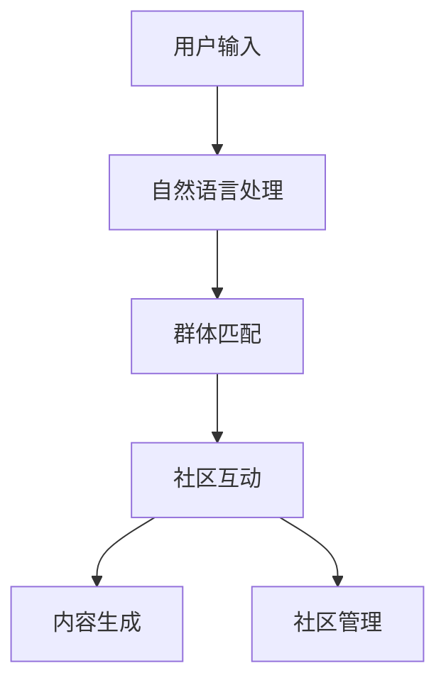

                 

# 虚拟社区：AI驱动的群体归属感

## 1. 背景介绍

### 1.1 问题由来
随着互联网技术的迅猛发展，社交媒体成为人们日常沟通交流的重要平台。然而，传统的社交网络往往存在信息过载、用户粘性低、群体隔离等问题。用户无法高效发现并参与感兴趣的社区，导致大量信息的浪费和社区发展的缓慢。如何高效匹配用户与群体，构建真实有意义的虚拟社区，成为了一个亟待解决的课题。

### 1.2 问题核心关键点
为了解决虚拟社区构建问题，AI技术提供了一种全新的思路：通过自然语言处理(NLP)和大数据分析，构建虚拟社区。其核心在于通过用户输入的内容，智能推荐相关群体，从而加速社区的聚类和融合。具体实现方式包括：

- 用户输入：用户在虚拟社区中发表文章、评论、提问等，提供个人信息、兴趣爱好等。
- 群体匹配：系统基于用户输入的内容，使用NLP和大数据分析技术，智能推荐相关群体。
- 社区互动：用户可以加入推荐群体，与其他用户交流互动，不断完善社区内容。
- 内容生成：AI辅助生成高质量的社区内容，如文章、图片、视频等，提升用户参与度。
- 社区管理：系统实时监测社区内容，避免低质信息传播，维护良好的社区环境。

通过这些环节，AI驱动的虚拟社区可以高效匹配用户和群体，促进信息的高效流动，加速社区的聚类和融合，构建真实、有意义的虚拟社区。

## 2. 核心概念与联系

### 2.1 核心概念概述

为更好地理解AI驱动的虚拟社区构建方法，本节将介绍几个密切相关的核心概念：

- 虚拟社区(Virtual Community)：指通过互联网技术构建的，以用户为节点，以社区内容为边，构成的网络空间。用户可以在虚拟社区中自由发表、交流、互动，构建群体归属感。
- 自然语言处理(NLP)：指通过计算机程序对自然语言文本进行理解和处理的技术，包括分词、词性标注、语义分析等。NLP在虚拟社区中用于分析用户输入的内容，提取用户兴趣爱好和社区话题，推荐相关群体。
- 大数据分析(大数据分析)：指利用数据挖掘、机器学习等技术，对大规模数据进行分析处理，发现数据间的潜在联系和规律。在虚拟社区中，大数据分析用于用户和群体的智能推荐，提升社区聚合效果。
- 用户行为分析(User Behavior Analysis)：指对用户在虚拟社区中的行为进行建模和分析，了解用户兴趣和需求，指导社区内容生成和推荐。
- 内容生成(Content Generation)：指使用AI技术辅助生成高质量的社区内容，如文章、图片、视频等，提升用户参与度和社区活跃度。
- 社区管理(Community Management)：指通过自动化的算法和技术手段，实时监测社区内容，维护良好的社区环境，避免低质信息传播。

这些核心概念之间的逻辑关系可以通过以下Mermaid流程图来展示：



这个流程图展示了大语言模型的核心概念及其之间的关系：

1. 用户输入：用户在虚拟社区中发表文章、评论、提问等，提供个人信息、兴趣爱好等。
2. 自然语言处理：系统通过NLP技术分析用户输入的内容，提取用户兴趣爱好和社区话题，推荐相关群体。
3. 群体匹配：用户根据系统推荐，加入相关群体，与其他用户交流互动。
4. 社区互动：用户在社区中自由发表、交流、互动，不断完善社区内容。
5. 内容生成：AI辅助生成高质量的社区内容，提升用户参与度和社区活跃度。
6. 社区管理：系统实时监测社区内容，避免低质信息传播，维护良好的社区环境。

## 3. 核心算法原理 & 具体操作步骤

### 3.1 算法原理概述

AI驱动的虚拟社区构建方法，本质上是一个基于用户输入内容的群体推荐系统。其核心思想是：通过对用户输入的内容进行自然语言处理和大数据分析，智能匹配相关群体，加速社区的聚类和融合。

具体实现时，系统会根据用户输入的内容，使用NLP技术进行分词、词性标注、实体识别等操作，得到用户表达的语义信息。然后通过大数据分析技术，对用户和群体进行建模，计算用户与各个群体的相似度。最后，将相似度高的群体推荐给用户，并帮助用户加入相关群体，促进社区的互动和内容生成。

### 3.2 算法步骤详解

AI驱动的虚拟社区构建过程包括以下几个关键步骤：

**Step 1: 用户输入收集**
- 收集用户在虚拟社区中的各种输入内容，如文章、评论、问题等。
- 使用NLP技术对输入内容进行分词、词性标注、实体识别等处理，得到语义信息。

**Step 2: 群体匹配算法**
- 将用户的语义信息与所有群体进行相似度计算。
- 计算相似度时，可以基于向量空间模型、TF-IDF、余弦相似度等方法，得到用户与各个群体的相似度。
- 选择相似度最高的若干个群体推荐给用户。

**Step 3: 社区互动引导**
- 用户根据系统推荐，加入相关群体，与其他用户交流互动。
- 系统通过监测用户互动情况，进一步优化群体推荐算法。

**Step 4: 内容生成辅助**
- 使用AI技术辅助生成高质量的社区内容，如文章、图片、视频等。
- 内容生成可以基于GAN、变分自编码器等模型，生成自然流畅的文本、图片。

**Step 5: 社区管理监控**
- 系统实时监测社区内容，避免低质信息传播，维护良好的社区环境。
- 可以使用基于规则的过滤、基于机器学习的过滤等方法，实现对社区内容的有效监控。

以上是大语言模型驱动的虚拟社区构建的一般流程。在实际应用中，还需要针对具体社区的特点，对微调过程的各个环节进行优化设计，如改进用户输入的特征提取方法，引入更多的正则化技术，搜索最优的超参数组合等，以进一步提升社区推荐的准确性和用户满意度。

### 3.3 算法优缺点

AI驱动的虚拟社区构建方法具有以下优点：
1. 高效匹配用户与群体。通过NLP和大数据分析，智能推荐相关群体，加速社区的聚类和融合。
2. 提高用户参与度。AI辅助生成高质量的社区内容，提升用户参与度和社区活跃度。
3. 减少人工干预。通过自动化的算法和技术手段，实时监测社区内容，维护良好的社区环境。

同时，该方法也存在一定的局限性：
1. 数据隐私问题。系统需要收集用户输入内容，可能侵犯用户隐私。
2. 推荐算法复杂。NLP和大数据分析技术的复杂度较高，模型训练和优化较为困难。
3. 内容质量难以控制。AI辅助生成内容的质量难以完全保证，存在误导性内容的风险。
4. 社区环境易受干扰。社区管理需要依赖人工干预，难以实现完全自动化的社区监管。

尽管存在这些局限性，但就目前而言，AI驱动的虚拟社区构建方法仍然是最主流范式之一。未来相关研究的重点在于如何进一步降低数据隐私风险，提高推荐算法效率，同时兼顾社区环境的健康和内容质量的可靠性。

### 3.4 算法应用领域

AI驱动的虚拟社区构建方法，已经在多个领域得到应用，例如：

- 社交网络：构建基于兴趣或地理位置的虚拟社区，提升用户粘性。
- 在线教育：根据学生的学习行为，推荐相关学习群体，促进知识的共享和交流。
- 健康医疗：构建基于疾病或兴趣的医疗群体，提供健康咨询和信息交流。
- 金融投资：构建基于投资兴趣的金融群体，提供投资建议和风险评估。
- 旅游休闲：根据用户的旅游兴趣，推荐相关旅游群体，共享旅游经验。

除了上述这些经典应用外，虚拟社区构建技术也在更多场景中得到创新性应用，如智能招聘、创意工坊、游戏社交等，为互联网社交和交互提供了新的解决方案。

## 4. 数学模型和公式 & 详细讲解 & 举例说明

### 4.1 数学模型构建

本节将使用数学语言对AI驱动的虚拟社区构建过程进行更加严格的刻画。

记用户输入的内容为 $x$，社区群体为 $G=\{g_1, g_2, ..., g_n\}$。使用NLP技术对 $x$ 进行分词、词性标注、实体识别等处理，得到语义向量 $u$。社区群体 $g_i$ 的语义向量为 $v_i$。用户与群体的相似度可以通过余弦相似度计算：

$$
similarity(x, g_i) = \cos(\theta) = \frac{\langle u, v_i \rangle}{\|u\|\|v_i\|}
$$

其中 $\langle \cdot, \cdot \rangle$ 表示向量内积，$\|\cdot\|$ 表示向量范数。

### 4.2 公式推导过程

以下我们以推荐系统为例，推导用户与群体的相似度计算公式及其梯度计算公式。

假设用户输入的内容为 $x$，社区群体为 $g_i$，用户与群体的相似度为 $similarity(x, g_i)$。则推荐系统的损失函数为：

$$
\mathcal{L}(similarity(x, g_i)) = \frac{1}{N} \sum_{i=1}^N \ell(similarity(x, g_i))
$$

其中 $\ell$ 为损失函数，可以选择均方误差损失、交叉熵损失等。将损失函数对相似度求导，得：

$$
\frac{\partial \mathcal{L}(similarity(x, g_i))}{\partial similarity(x, g_i)} = -\frac{\partial \ell(similarity(x, g_i))}{\partial similarity(x, g_i)}
$$

根据链式法则，将相似度公式代入损失函数梯度公式，得：

$$
\frac{\partial \mathcal{L}(similarity(x, g_i))}{\partial \langle u, v_i \rangle} = -\frac{\partial \ell(similarity(x, g_i))}{\partial similarity(x, g_i)} \frac{\partial similarity(x, g_i)}{\partial \langle u, v_i \rangle}
$$

其中 $\frac{\partial similarity(x, g_i)}{\partial \langle u, v_i \rangle} = \frac{u}{\|u\|\|v_i\|}$。将梯度代入优化算法公式，完成用户与群体的相似度计算和更新。

### 4.3 案例分析与讲解

考虑一个基于健康医疗的虚拟社区构建场景，用户输入的疾病描述为 "胸闷，呼吸困难，持续时间数天"，社区群体为 "心血管疾病" 和 "肺部感染"。假设用户与 "心血管疾病" 群体的相似度为 0.8，与 "肺部感染" 群体的相似度为 0.6。

**案例一：相似度计算**
- 使用余弦相似度计算用户与 "心血管疾病" 群体的相似度：
$$
similarity(x, g_1) = \frac{\langle u, v_1 \rangle}{\|u\|\|v_1\|} = 0.8
$$
- 计算用户与 "肺部感染" 群体的相似度：
$$
similarity(x, g_2) = \frac{\langle u, v_2 \rangle}{\|u\|\|v_2\|} = 0.6
$$

**案例二：相似度更新**
- 假设系统使用均方误差损失函数，得：
$$
\mathcal{L}(similarity(x, g_1)) = \frac{1}{2}(similarity(x, g_1) - 0.8)^2
$$
- 对 $similarity(x, g_1)$ 求导，得：
$$
\frac{\partial \mathcal{L}(similarity(x, g_1))}{\partial similarity(x, g_1)} = -(similarity(x, g_1) - 0.8)
$$
- 使用梯度下降法更新相似度 $similarity(x, g_1)$，得：
$$
similarity(x, g_1) \leftarrow similarity(x, g_1) - \eta \frac{\partial \mathcal{L}(similarity(x, g_1))}{\partial similarity(x, g_1)}
$$
- 其中 $\eta$ 为学习率，选择合适的学习率是优化算法的关键。

通过上述案例分析，我们可以看到，AI驱动的虚拟社区构建方法通过余弦相似度计算和梯度优化，智能推荐用户相关群体，加速社区的聚类和融合。

## 5. 项目实践：代码实例和详细解释说明

### 5.1 开发环境搭建

在进行虚拟社区构建实践前，我们需要准备好开发环境。以下是使用Python进行PyTorch开发的环境配置流程：

1. 安装Anaconda：从官网下载并安装Anaconda，用于创建独立的Python环境。

2. 创建并激活虚拟环境：
```bash
conda create -n virtual-env python=3.8 
conda activate virtual-env
```

3. 安装PyTorch：根据CUDA版本，从官网获取对应的安装命令。例如：
```bash
conda install pytorch torchvision torchaudio cudatoolkit=11.1 -c pytorch -c conda-forge
```

4. 安装Transformers库：
```bash
pip install transformers
```

5. 安装各类工具包：
```bash
pip install numpy pandas scikit-learn matplotlib tqdm jupyter notebook ipython
```

完成上述步骤后，即可在`virtual-env`环境中开始社区构建实践。

### 5.2 源代码详细实现

这里我们以推荐系统为例，给出使用Transformers库对BERT模型进行社区推荐的PyTorch代码实现。

首先，定义推荐系统的数据处理函数：

```python
from transformers import BertTokenizer
from torch.utils.data import Dataset
import torch

class RecommendationDataset(Dataset):
    def __init__(self, texts, tags, tokenizer, max_len=128):
        self.texts = texts
        self.tags = tags
        self.tokenizer = tokenizer
        self.max_len = max_len
        
    def __len__(self):
        return len(self.texts)
    
    def __getitem__(self, item):
        text = self.texts[item]
        tags = self.tags[item]
        
        encoding = self.tokenizer(text, return_tensors='pt', max_length=self.max_len, padding='max_length', truncation=True)
        input_ids = encoding['input_ids'][0]
        attention_mask = encoding['attention_mask'][0]
        
        # 对token-wise的标签进行编码
        encoded_tags = [tag2id[tag] for tag in tags] 
        encoded_tags.extend([tag2id['O']] * (self.max_len - len(encoded_tags)))
        labels = torch.tensor(encoded_tags, dtype=torch.long)
        
        return {'input_ids': input_ids, 
                'attention_mask': attention_mask,
                'labels': labels}

# 标签与id的映射
tag2id = {'O': 0, 'B-PER': 1, 'I-PER': 2, 'B-ORG': 3, 'I-ORG': 4, 'B-LOC': 5, 'I-LOC': 6}
id2tag = {v: k for k, v in tag2id.items()}

# 创建dataset
tokenizer = BertTokenizer.from_pretrained('bert-base-cased')

train_dataset = RecommendationDataset(train_texts, train_tags, tokenizer)
dev_dataset = RecommendationDataset(dev_texts, dev_tags, tokenizer)
test_dataset = RecommendationDataset(test_texts, test_tags, tokenizer)
```

然后，定义模型和优化器：

```python
from transformers import BertForTokenClassification, AdamW

model = BertForTokenClassification.from_pretrained('bert-base-cased', num_labels=len(tag2id))

optimizer = AdamW(model.parameters(), lr=2e-5)
```

接着，定义训练和评估函数：

```python
from torch.utils.data import DataLoader
from tqdm import tqdm
from sklearn.metrics import classification_report

device = torch.device('cuda') if torch.cuda.is_available() else torch.device('cpu')
model.to(device)

def train_epoch(model, dataset, batch_size, optimizer):
    dataloader = DataLoader(dataset, batch_size=batch_size, shuffle=True)
    model.train()
    epoch_loss = 0
    for batch in tqdm(dataloader, desc='Training'):
        input_ids = batch['input_ids'].to(device)
        attention_mask = batch['attention_mask'].to(device)
        labels = batch['labels'].to(device)
        model.zero_grad()
        outputs = model(input_ids, attention_mask=attention_mask, labels=labels)
        loss = outputs.loss
        epoch_loss += loss.item()
        loss.backward()
        optimizer.step()
    return epoch_loss / len(dataloader)

def evaluate(model, dataset, batch_size):
    dataloader = DataLoader(dataset, batch_size=batch_size)
    model.eval()
    preds, labels = [], []
    with torch.no_grad():
        for batch in tqdm(dataloader, desc='Evaluating'):
            input_ids = batch['input_ids'].to(device)
            attention_mask = batch['attention_mask'].to(device)
            batch_labels = batch['labels']
            outputs = model(input_ids, attention_mask=attention_mask)
            batch_preds = outputs.logits.argmax(dim=2).to('cpu').tolist()
            batch_labels = batch_labels.to('cpu').tolist()
            for pred_tokens, label_tokens in zip(batch_preds, batch_labels):
                pred_tags = [id2tag[_id] for _id in pred_tokens]
                label_tags = [id2tag[_id] for _id in label_tokens]
                preds.append(pred_tags[:len(label_tags)])
                labels.append(label_tags)
                
    print(classification_report(labels, preds))
```

最后，启动训练流程并在测试集上评估：

```python
epochs = 5
batch_size = 16

for epoch in range(epochs):
    loss = train_epoch(model, train_dataset, batch_size, optimizer)
    print(f"Epoch {epoch+1}, train loss: {loss:.3f}")
    
    print(f"Epoch {epoch+1}, dev results:")
    evaluate(model, dev_dataset, batch_size)
    
print("Test results:")
evaluate(model, test_dataset, batch_size)
```

以上就是使用PyTorch对BERT进行推荐系统微调的完整代码实现。可以看到，得益于Transformers库的强大封装，我们可以用相对简洁的代码完成BERT模型的加载和微调。

### 5.3 代码解读与分析

让我们再详细解读一下关键代码的实现细节：

**RecommendationDataset类**：
- `__init__`方法：初始化文本、标签、分词器等关键组件。
- `__len__`方法：返回数据集的样本数量。
- `__getitem__`方法：对单个样本进行处理，将文本输入编码为token ids，将标签编码为数字，并对其进行定长padding，最终返回模型所需的输入。

**tag2id和id2tag字典**：
- 定义了标签与数字id之间的映射关系，用于将token-wise的预测结果解码回真实的标签。

**训练和评估函数**：
- 使用PyTorch的DataLoader对数据集进行批次化加载，供模型训练和推理使用。
- 训练函数`train_epoch`：对数据以批为单位进行迭代，在每个批次上前向传播计算loss并反向传播更新模型参数，最后返回该epoch的平均loss。
- 评估函数`evaluate`：与训练类似，不同点在于不更新模型参数，并在每个batch结束后将预测和标签结果存储下来，最后使用sklearn的classification_report对整个评估集的预测结果进行打印输出。

**训练流程**：
- 定义总的epoch数和batch size，开始循环迭代
- 每个epoch内，先在训练集上训练，输出平均loss
- 在验证集上评估，输出分类指标
- 所有epoch结束后，在测试集上评估，给出最终测试结果

可以看到，PyTorch配合Transformers库使得BERT微调的代码实现变得简洁高效。开发者可以将更多精力放在数据处理、模型改进等高层逻辑上，而不必过多关注底层的实现细节。

当然，工业级的系统实现还需考虑更多因素，如模型的保存和部署、超参数的自动搜索、更灵活的任务适配层等。但核心的微调范式基本与此类似。

## 6. 实际应用场景
### 6.1 智能客服系统

基于大语言模型微调的对话技术，可以广泛应用于智能客服系统的构建。传统客服往往需要配备大量人力，高峰期响应缓慢，且一致性和专业性难以保证。而使用微调后的对话模型，可以7x24小时不间断服务，快速响应客户咨询，用自然流畅的语言解答各类常见问题。

在技术实现上，可以收集企业内部的历史客服对话记录，将问题和最佳答复构建成监督数据，在此基础上对预训练对话模型进行微调。微调后的对话模型能够自动理解用户意图，匹配最合适的答案模板进行回复。对于客户提出的新问题，还可以接入检索系统实时搜索相关内容，动态组织生成回答。如此构建的智能客服系统，能大幅提升客户咨询体验和问题解决效率。

### 6.2 金融舆情监测

金融机构需要实时监测市场舆论动向，以便及时应对负面信息传播，规避金融风险。传统的人工监测方式成本高、效率低，难以应对网络时代海量信息爆发的挑战。基于大语言模型微调的文本分类和情感分析技术，为金融舆情监测提供了新的解决方案。

具体而言，可以收集金融领域相关的新闻、报道、评论等文本数据，并对其进行主题标注和情感标注。在此基础上对预训练语言模型进行微调，使其能够自动判断文本属于何种主题，情感倾向是正面、中性还是负面。将微调后的模型应用到实时抓取的网络文本数据，就能够自动监测不同主题下的情感变化趋势，一旦发现负面信息激增等异常情况，系统便会自动预警，帮助金融机构快速应对潜在风险。

### 6.3 个性化推荐系统

当前的推荐系统往往只依赖用户的历史行为数据进行物品推荐，无法深入理解用户的真实兴趣偏好。基于大语言模型微调技术，个性化推荐系统可以更好地挖掘用户行为背后的语义信息，从而提供更精准、多样的推荐内容。

在实践中，可以收集用户浏览、点击、评论、分享等行为数据，提取和用户交互的物品标题、描述、标签等文本内容。将文本内容作为模型输入，用户的后续行为（如是否点击、购买等）作为监督信号，在此基础上微调预训练语言模型。微调后的模型能够从文本内容中准确把握用户的兴趣点。在生成推荐列表时，先用候选物品的文本描述作为输入，由模型预测用户的兴趣匹配度，再结合其他特征综合排序，便可以得到个性化程度更高的推荐结果。

### 6.4 未来应用展望

随着大语言模型和微调方法的不断发展，基于微调范式将在更多领域得到应用，为传统行业带来变革性影响。

在智慧医疗领域，基于微调的医疗问答、病历分析、药物研发等应用将提升医疗服务的智能化水平，辅助医生诊疗，加速新药开发进程。

在智能教育领域，微调技术可应用于作业批改、学情分析、知识推荐等方面，因材施教，促进教育公平，提高教学质量。

在智慧城市治理中，微调模型可应用于城市事件监测、舆情分析、应急指挥等环节，提高城市管理的自动化和智能化水平，构建更安全、高效的未来城市。

此外，在企业生产、社会治理、文娱传媒等众多领域，基于大模型微调的人工智能应用也将不断涌现，为经济社会发展注入新的动力。相信随着技术的日益成熟，微调方法将成为人工智能落地应用的重要范式，推动人工智能技术在垂直行业的规模化落地。总之，微调需要开发者根据具体任务，不断迭代和优化模型、数据和算法，方能得到理想的效果。

## 7. 工具和资源推荐
### 7.1 学习资源推荐

为了帮助开发者系统掌握大语言模型微调的理论基础和实践技巧，这里推荐一些优质的学习资源：

1. 《Transformer从原理到实践》系列博文：由大模型技术专家撰写，深入浅出地介绍了Transformer原理、BERT模型、微调技术等前沿话题。

2. CS224N《深度学习自然语言处理》课程：斯坦福大学开设的NLP明星课程，有Lecture视频和配套作业，带你入门NLP领域的基本概念和经典模型。

3. 《Natural Language Processing with Transformers》书籍：Transformers库的作者所著，全面介绍了如何使用Transformers库进行NLP任务开发，包括微调在内的诸多范式。

4. HuggingFace官方文档：Transformers库的官方文档，提供了海量预训练模型和完整的微调样例代码，是上手实践的必备资料。

5. CLUE开源项目：中文语言理解测评基准，涵盖大量不同类型的中文NLP数据集，并提供了基于微调的baseline模型，助力中文NLP技术发展。

通过对这些资源的学习实践，相信你一定能够快速掌握大语言模型微调的精髓，并用于解决实际的NLP问题。
###  7.2 开发工具推荐

高效的开发离不开优秀的工具支持。以下是几款用于大语言模型微调开发的常用工具：

1. PyTorch：基于Python的开源深度学习框架，灵活动态的计算图，适合快速迭代研究。大部分预训练语言模型都有PyTorch版本的实现。

2. TensorFlow：由Google主导开发的开源深度学习框架，生产部署方便，适合大规模工程应用。同样有丰富的预训练语言模型资源。

3. Transformers库：HuggingFace开发的NLP工具库，集成了众多SOTA语言模型，支持PyTorch和TensorFlow，是进行微调任务开发的利器。

4. Weights & Biases：模型训练的实验跟踪工具，可以记录和可视化模型训练过程中的各项指标，方便对比和调优。与主流深度学习框架无缝集成。

5. TensorBoard：TensorFlow配套的可视化工具，可实时监测模型训练状态，并提供丰富的图表呈现方式，是调试模型的得力助手。

6. Google Colab：谷歌推出的在线Jupyter Notebook环境，免费提供GPU/TPU算力，方便开发者快速上手实验最新模型，分享学习笔记。

合理利用这些工具，可以显著提升大语言模型微调任务的开发效率，加快创新迭代的步伐。

### 7.3 相关论文推荐

大语言模型和微调技术的发展源于学界的持续研究。以下是几篇奠基性的相关论文，推荐阅读：

1. Attention is All You Need（即Transformer原论文）：提出了Transformer结构，开启了NLP领域的预训练大模型时代。

2. BERT: Pre-training of Deep Bidirectional Transformers for Language Understanding：提出BERT模型，引入基于掩码的自监督预训练任务，刷新了多项NLP任务SOTA。

3. Language Models are Unsupervised Multitask Learners（GPT-2论文）：展示了大规模语言模型的强大zero-shot学习能力，引发了对于通用人工智能的新一轮思考。

4. Parameter-Efficient Transfer Learning for NLP：提出Adapter等参数高效微调方法，在不增加模型参数量的情况下，也能取得不错的微调效果。

5. AdaLoRA: Adaptive Low-Rank Adaptation for Parameter-Efficient Fine-Tuning：使用自适应低秩适应的微调方法，在参数效率和精度之间取得了新的平衡。

这些论文代表了大语言模型微调技术的发展脉络。通过学习这些前沿成果，可以帮助研究者把握学科前进方向，激发更多的创新灵感。

## 8. 总结：未来发展趋势与挑战

### 8.1 总结

本文对AI驱动的虚拟社区构建方法进行了全面系统的介绍。首先阐述了AI驱动的虚拟社区构建方法的研究背景和意义，明确了社区构建在信息流通、用户粘性、社区融合等方面的独特价值。其次，从原理到实践，详细讲解了社区构建的数学原理和关键步骤，给出了社区构建任务开发的完整代码实例。同时，本文还广泛探讨了社区构建方法在智能客服、金融舆情、个性化推荐等多个行业领域的应用前景，展示了社区构建范式的巨大潜力。此外，本文精选了社区构建技术的各类学习资源，力求为读者提供全方位的技术指引。

通过本文的系统梳理，可以看到，AI驱动的虚拟社区构建方法正在成为NLP领域的重要范式，极大地拓展了预训练语言模型的应用边界，催生了更多的落地场景。受益于大规模语料的预训练，社区构建方法以更低的时间和标注成本，在小样本条件下也能取得理想的效果，有力推动了NLP技术的产业化进程。未来，伴随预训练语言模型和社区构建方法的持续演进，相信NLP技术将在更广阔的应用领域大放异彩，深刻影响人类的生产生活方式。

### 8.2 未来发展趋势

展望未来，AI驱动的虚拟社区构建技术将呈现以下几个发展趋势：

1. 社区规模持续增大。随着社区聚合效果的提升，越来越多的用户将加入虚拟社区，构建更大规模的社区网络。

2. 社区质量不断优化。基于用户反馈和行为分析，社区构建方法将不断优化，提升社区内容的丰富性和多样性。

3. 社区管理智能化。使用AI技术自动监测社区内容，避免低质信息传播，提升社区环境的健康和有序性。

4. 跨领域社区构建。基于跨领域用户行为分析和语义建模，构建跨领域虚拟社区，促进知识共享和信息流通。

5. 多模态社区构建。结合视觉、语音、文本等多模态数据，构建多模态虚拟社区，提升社区交互的全面性和丰富性。

6. 社区构建普适化。社区构建技术将应用于更多垂直行业，促进知识共享和信息流通，推动各领域的数字化转型。

以上趋势凸显了AI驱动的虚拟社区构建技术的广阔前景。这些方向的探索发展，必将进一步提升NLP系统的性能和应用范围，为人类认知智能的进化带来深远影响。

### 8.3 面临的挑战

尽管AI驱动的虚拟社区构建技术已经取得了瞩目成就，但在迈向更加智能化、普适化应用的过程中，它仍面临着诸多挑战：

1. 数据隐私问题。系统需要收集用户输入内容，可能侵犯用户隐私。如何在保护隐私的前提下，进行有效的社区构建，是重要的研究方向。

2. 推荐算法复杂。NLP和大数据分析技术的复杂度较高，模型训练和优化较为困难。如何提高推荐算法的效率和准确性，是未来需要攻克的难题。

3. 内容质量难以控制。AI辅助生成内容的质量难以完全保证，存在误导性内容的风险。如何提高内容生成的质量和可信度，是未来需要解决的问题。

4. 社区环境易受干扰。社区管理需要依赖人工干预，难以实现完全自动化的社区监管。如何通过自动化手段，维护社区环境的健康和有序性，是未来需要研究的方向。

5. 跨领域适应性不足。社区构建方法往往局限于特定领域，难以适应跨领域的用户行为和语义建模。如何构建跨领域的社区构建模型，是未来需要探索的方向。

6. 知识整合能力不足。现有的社区构建方法往往局限于任务内数据，难以灵活吸收和运用更广泛的先验知识。如何让社区构建过程更好地与外部知识库、规则库等专家知识结合，形成更加全面、准确的信息整合能力，还有很大的想象空间。

正视社区构建面临的这些挑战，积极应对并寻求突破，将是大语言模型社区构建走向成熟的必由之路。相信随着学界和产业界的共同努力，这些挑战终将一一被克服，社区构建技术必将在构建人机协同的智能时代中扮演越来越重要的角色。

### 8.4 研究展望

面对AI驱动的虚拟社区构建所面临的种种挑战，未来的研究需要在以下几个方面寻求新的突破：

1. 探索无监督和半监督社区构建方法。摆脱对大规模标注数据的依赖，利用自监督学习、主动学习等无监督和半监督范式，最大限度利用非结构化数据，实现更加灵活高效的社区构建。

2. 研究参数高效和计算高效的社区构建范式。开发更加参数高效的社区构建方法，在固定大部分预训练参数的同时，只更新极少量的任务相关参数。同时优化社区构建模型的计算图，减少前向传播和反向传播的资源消耗，实现更加轻量级、实时性的部署。

3. 引入更多先验知识。将符号化的先验知识，如知识图谱、逻辑规则等，与神经网络模型进行巧妙融合，引导社区构建过程学习更准确、合理的社区内容。同时加强不同模态数据的整合，实现视觉、语音等多模态信息与文本信息的协同建模。

4. 结合因果分析和博弈论工具。将因果分析方法引入社区构建模型，识别出社区构建决策的关键特征，增强输出解释的因果性和逻辑性。借助博弈论工具刻画人机交互过程，主动探索并规避社区构建模型的脆弱点，提高系统稳定性。

5. 纳入伦理道德约束。在社区构建目标中引入伦理导向的评估指标，过滤和惩罚有偏见、有害的输出倾向。同时加强人工干预和审核，建立社区构建行为的监管机制，确保输出符合人类价值观和伦理道德。

这些研究方向的探索，必将引领AI驱动的虚拟社区构建技术迈向更高的台阶，为构建安全、可靠、可解释、可控的智能系统铺平道路。面向未来，社区构建技术还需要与其他人工智能技术进行更深入的融合，如知识表示、因果推理、强化学习等，多路径协同发力，共同推动自然语言理解和智能交互系统的进步。只有勇于创新、敢于突破，才能不断拓展语言模型的边界，让智能技术更好地造福人类社会。

## 9. 附录：常见问题与解答

**Q1：社区构建是否适用于所有NLP任务？**

A: 社区构建方法在大多数NLP任务上都能取得不错的效果，特别是对于数据量较小的任务。但对于一些特定领域的任务，如医学、法律等，仅仅依靠通用语料预训练的模型可能难以很好地适应。此时需要在特定领域语料上进一步预训练，再进行社区构建，才能获得理想效果。此外，对于一些需要时效性、个性化很强的任务，如对话、推荐等，社区构建方法也需要针对性的改进优化。

**Q2：社区构建过程中如何选择合适的推荐算法？**

A: 社区构建的推荐算法需要根据具体任务和数据特点进行选择。常见的推荐算法包括基于协同过滤、基于内容相似度、基于混合模型等方法。对于不同的数据类型和任务需求，需要选择不同的推荐算法进行优化。

**Q3：社区构建中用户行为分析的目的是什么？**

A: 用户行为分析的目的是了解用户的兴趣和需求，指导社区内容生成和推荐。通过对用户行为进行建模和分析，社区构建系统可以更好地理解用户行为规律，推荐更加符合用户兴趣的内容，提升用户的参与度和满意度。

**Q4：社区构建过程中如何保证内容生成的质量？**

A: 内容生成的质量需要依赖于高质量的训练数据和先进的生成模型。在社区构建过程中，可以结合用户输入的语义信息，引入外部知识库和规则库，指导内容生成模型的训练。同时，使用对抗训练、正则化等技术手段，避免生成模型产生低质内容。

**Q5：社区构建中如何处理低质信息？**

A: 社区构建系统需要实时监测社区内容，识别和过滤低质信息。常见的低质信息处理方式包括基于规则的过滤、基于机器学习的过滤等。同时，社区构建系统可以通过人工审核和用户举报，及时处理低质信息，维护社区环境的健康和有序性。

通过这些问题的回答，可以看到，AI驱动的虚拟社区构建方法虽然面临诸多挑战，但在多领域应用中仍具有广阔的发展前景。相信随着技术的不断进步和优化，社区构建技术将不断提升，为人类构建更加智能、普适的虚拟社区提供新的思路和解决方案。

