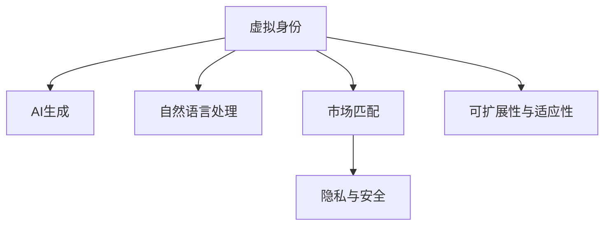

                 

## 1. 背景介绍

在数字化时代，人们不仅在物理世界中扮演着不同的角色，在虚拟空间中，我们同样可以创建和塑造自己的虚拟身份。这种虚拟身份的存在，不仅丰富了我们的在线生活，还为自我营销提供了全新的方式。随着人工智能技术的日益成熟，虚拟身份市场正在迎来前所未有的变革。

### 1.1 问题由来

虚拟身份，最早可以追溯到网络游戏的虚拟角色和社交网络中的虚拟头像。但随着AI技术的进步，虚拟身份已经超越了简单的视觉展现，开始具备更丰富的功能和意义。AI驱动的虚拟身份，不仅能进行自然语言交互，还能模仿真实情感，甚至在复杂的决策环境中表现出智能行为。

然而，由于技术复杂性，当前的虚拟身份市场仍处于初期阶段。开发者和消费者都面临诸多挑战。一方面，开发者需要解决身份生成的多样性、智能性和个性化问题。另一方面，消费者需要找到一款能够真正代表自己，且符合自己期待的虚拟身份。

### 1.2 问题核心关键点

AI时代的虚拟身份市场，主要关注以下几个核心关键点：

1. **多样性与个性化**：如何在虚拟身份中，生动展现用户的独特性和多样性。
2. **智能交互**：如何使虚拟身份具备自然语言理解和生成能力，进行智能互动。
3. **市场匹配**：如何匹配虚拟身份与消费者的需求，实现精准营销。
4. **安全性与隐私**：如何保障虚拟身份与真实身份之间的安全连接，确保用户隐私。
5. **可扩展性与适应性**：如何构建灵活的虚拟身份生态系统，适应不同场景和需求。

这些关键点构成了AI时代虚拟身份市场的研究基础，也是本文探讨的核心内容。

## 2. 核心概念与联系

### 2.1 核心概念概述

在介绍核心概念时，我们需要从多个维度来剖析虚拟身份市场的技术基础和应用场景。

- **虚拟身份(Virtual Identities)**：指在数字世界中，代表个人或组织的网络存在，包括视觉、语音、行为等多维特征。
- **AI生成(AI Generation)**：指使用机器学习算法，自动生成虚拟身份的过程。
- **自然语言处理(NLP)**：指使虚拟身份具备理解和生成自然语言的能力，实现智能交互。
- **市场匹配(Market Matching)**：指通过算法匹配虚拟身份与消费者需求，实现精准营销。
- **隐私与安全(Privacy & Security)**：指在虚拟身份生成与交互过程中，保障用户隐私和数据安全。
- **可扩展性与适应性(Scalability & Adaptability)**：指构建灵活的虚拟身份生态系统，适应不同场景和需求。

这些核心概念构成了虚拟身份市场的技术框架，帮助开发者和消费者在市场中找到各自的需求。

### 2.2 核心概念原理和架构的 Mermaid 流程图



此图展示了虚拟身份市场核心概念之间的联系。

- **A到B**：AI生成虚拟身份，是虚拟身份市场的基础。
- **A到C**：自然语言处理，使虚拟身份具备智能交互能力。
- **D到E**：隐私与安全，保障用户数据的安全和隐私。
- **A到F**：可扩展性与适应性，构建灵活的虚拟身份生态系统。

这些环节共同支撑了虚拟身份市场的运转，同时也为未来的技术发展指明了方向。

## 3. 核心算法原理 & 具体操作步骤

### 3.1 算法原理概述

AI时代的虚拟身份生成，主要依赖于以下几个核心算法：

- **生成对抗网络(Generative Adversarial Networks, GANs)**：通过对抗训练，生成高质量的虚拟身份视觉表示。
- **Transformer模型**：基于自注意力机制，实现自然语言处理中的文本生成和理解。
- **强化学习(RL)**：使虚拟身份具备智能决策和行为能力，适应复杂环境。
- **多模态学习(Multimodal Learning)**：融合视觉、语音、文本等多模态数据，生成更全面的虚拟身份。
- **迁移学习(Transfer Learning)**：利用预训练模型，加速新领域中的虚拟身份生成。

### 3.2 算法步骤详解

#### 3.2.1 生成对抗网络(GANs)

**步骤1: 数据准备**
- 收集并处理多样化的真实身份数据，如照片、视频、音频等。
- 清洗和标注数据，确保数据的多样性和质量。

**步骤2: 模型构建**
- 构建生成器(Generator)和判别器(Discriminator)两个网络。
- 使用数据增强技术，防止过拟合。

**步骤3: 对抗训练**
- 交替训练生成器和判别器，生成器尝试欺骗判别器，生成高质量的虚拟身份。
- 判别器努力区分真实身份和生成身份，提高生成身份的真实度。

**步骤4: 身份验证**
- 使用真实身份数据，验证生成身份的质量和多样性。
- 不断调整模型参数，优化生成效果。

#### 3.2.2 Transformer模型

**步骤1: 预训练模型选择**
- 选择预训练好的Transformer模型，如GPT、BERT等。

**步骤2: 微调任务适配层**
- 在Transformer顶层添加任务适配层，如分类器、解码器等。
- 根据任务需求，选择合适的损失函数和优化器。

**步骤3: 数据预处理**
- 将文本数据转化为模型的输入格式。
- 使用分词、词向量等技术，提升模型理解能力。

**步骤4: 模型训练**
- 对模型进行微调，最小化损失函数。
- 使用梯度下降等优化算法，更新模型参数。

**步骤5: 结果评估**
- 在测试集上评估模型性能，检查生成文本的质量和智能性。
- 根据评估结果，进一步优化模型。

#### 3.2.3 强化学习(RL)

**步骤1: 环境设计**
- 设计虚拟身份互动的环境，如虚拟商店、虚拟办公室等。
- 确定环境中的奖励和惩罚机制，引导虚拟身份的行为。

**步骤2: 代理模型构建**
- 使用强化学习算法，构建虚拟身份的代理模型。
- 选择合适的策略和价值函数，设计学习框架。

**步骤3: 智能交互**
- 虚拟身份在环境中与目标对象互动，学习最优策略。
- 通过不断试错，优化行为决策。

**步骤4: 评估与反馈**
- 在实际应用中测试虚拟身份的行为，收集反馈数据。
- 根据反馈数据，调整模型参数，提升智能性。

#### 3.2.4 多模态学习(Multimodal Learning)

**步骤1: 数据整合**
- 收集并整合视觉、语音、文本等多模态数据。
- 使用数据增强技术，提升数据的多样性和数量。

**步骤2: 特征提取**
- 使用多模态特征提取技术，提取不同模态的有用特征。
- 设计多模态编码器，融合不同模态的信息。

**步骤3: 联合训练**
- 使用多模态联合训练方法，优化多模态模型。
- 根据不同模态的重要性，调整模型参数。

**步骤4: 身份生成**
- 使用多模态模型，生成多维度的虚拟身份。
- 对生成的虚拟身份进行评估和优化。

#### 3.2.5 迁移学习(Transfer Learning)

**步骤1: 源模型选择**
- 选择适合的预训练模型，如BERT、GPT等。

**步骤2: 任务适配**
- 在预训练模型基础上，添加任务适配层。
- 使用源模型的权重初始化，加速新任务的微调。

**步骤3: 微调训练**
- 使用少量标注数据，对模型进行微调。
- 根据任务需求，调整学习率和优化器。

**步骤4: 模型评估**
- 在测试集上评估微调后的模型，检查性能。
- 根据评估结果，进一步优化模型。

### 3.3 算法优缺点

**优点**：

1. **高质量生成**：GANs和Transformer模型能生成高质量的虚拟身份和自然语言，满足用户的多样化需求。
2. **智能交互**：强化学习使虚拟身份具备智能决策和行为能力，提升用户体验。
3. **可扩展性**：多模态学习和迁移学习，使虚拟身份具备较强的适应性和泛化能力。
4. **低成本**：利用预训练模型和少量标注数据，快速生成虚拟身份，节省时间和成本。

**缺点**：

1. **计算资源要求高**：GANs和Transformer模型需要较高的计算资源和强大的硬件支持。
2. **隐私和安全风险**：虚拟身份生成和互动过程中，可能存在隐私泄露和数据安全问题。
3. **技术门槛高**：生成高质量的虚拟身份，需要一定的技术储备和经验积累。
4. **模型鲁棒性不足**：虚拟身份在不同场景下可能表现出不一致的行为，影响用户体验。

### 3.4 算法应用领域

AI时代的虚拟身份市场，主要应用于以下几个领域：

1. **虚拟办公室与协作**：生成虚拟办公桌、同事等，提升远程协作效率。
2. **虚拟商店与购物**：生成虚拟店员、商品展示等，提供沉浸式购物体验。
3. **虚拟博主与创作者**：生成虚拟创作者、博主等，丰富网络内容生态。
4. **虚拟社交与互动**：生成虚拟朋友、社交头像等，扩展社交网络。
5. **虚拟教育与培训**：生成虚拟教师、学生等，提升教育培训效果。

这些领域为虚拟身份市场提供了广阔的应用前景，同时也对技术提出了更高的要求。

## 4. 数学模型和公式 & 详细讲解 & 举例说明

### 4.1 数学模型构建

虚拟身份的生成和交互，可以通过数学模型来描述和优化。以下是几个核心数学模型的构建。

#### 4.1.1 生成对抗网络(GANs)

生成对抗网络由生成器(G)和判别器(D)组成，通过对抗训练，生成高质量的虚拟身份。

**生成器模型**：
$$ G_{\theta_G}(x) = \mathcal{N}(0, I) $$

**判别器模型**：
$$ D_{\theta_D}(x) = \mathcal{N}(0, I) $$

**目标函数**：
$$ \min_{G} \max_{D} V(G, D) = \mathbb{E}_{x \sim p_{\text{data}}}[\log D(x)] + \mathbb{E}_{z \sim p(z)}[\log (1 - D(G(z)))] $$

其中，$z$ 为随机噪声，$x$ 为真实数据，$p_{\text{data}}$ 为真实数据分布，$p(z)$ 为噪声分布。

#### 4.1.2 Transformer模型

Transformer模型的核心在于自注意力机制，用于生成和理解自然语言。

**输入表示**：
$$ X = [x_1, x_2, ..., x_n] $$

**编码器输出**：
$$ H = [h_1, h_2, ..., h_n] = ATTN(softmax(QK^T), V) $$

**自注意力机制**：
$$ ATTN(Q, K, V) = \text{softmax}(QK^T)/\sqrt{d_k} \times V $$

其中，$Q, K, V$ 分别为查询向量、键向量和值向量。

#### 4.1.3 强化学习(RL)

强化学习的目标是通过与环境互动，学习最优策略。

**状态表示**：
$$ S_t $$

**动作表示**：
$$ A_t $$

**奖励函数**：
$$ R_{t+1} $$

**状态转移概率**：
$$ P(S_{t+1}|S_t, A_t) $$

**策略优化**：
$$ \pi_{\theta}(A_t|S_t) = \frac{\exp(Q_{\theta}(S_t, A_t))}{\sum_{a} \exp(Q_{\theta}(S_t, a))} $$

其中，$\theta$ 为策略网络的参数，$Q_{\theta}$ 为价值函数。

#### 4.1.4 多模态学习(Multimodal Learning)

多模态学习融合了视觉、语音、文本等多种信息，生成全面的虚拟身份。

**输入表示**：
$$ X = [x_{\text{visual}}, x_{\text{audio}}, x_{\text{text}}] $$

**特征提取**：
$$ H_{\text{visual}} = \text{CNN}(x_{\text{visual}}) $$
$$ H_{\text{audio}} = \text{RNN}(x_{\text{audio}}) $$
$$ H_{\text{text}} = \text{Transformer}(x_{\text{text}}) $$

**融合模型**：
$$ H = [H_{\text{visual}}, H_{\text{audio}}, H_{\text{text}}] $$

### 4.2 公式推导过程

**生成对抗网络(GANs)**
- **生成器**：
$$ G_{\theta_G}(x) = \mathcal{N}(0, I) $$

- **判别器**：
$$ D_{\theta_D}(x) = \mathcal{N}(0, I) $$

- **目标函数**：
$$ V(G, D) = \mathbb{E}_{x \sim p_{\text{data}}}[\log D(x)] + \mathbb{E}_{z \sim p(z)}[\log (1 - D(G(z)))] $$

**Transformer模型**
- **输入表示**：
$$ X = [x_1, x_2, ..., x_n] $$

- **编码器输出**：
$$ H = [h_1, h_2, ..., h_n] = ATTN(softmax(QK^T), V) $$

- **自注意力机制**：
$$ ATTN(Q, K, V) = \text{softmax}(QK^T)/\sqrt{d_k} \times V $$

**强化学习(RL)**
- **状态表示**：
$$ S_t $$

- **动作表示**：
$$ A_t $$

- **奖励函数**：
$$ R_{t+1} $$

- **状态转移概率**：
$$ P(S_{t+1}|S_t, A_t) $$

- **策略优化**：
$$ \pi_{\theta}(A_t|S_t) = \frac{\exp(Q_{\theta}(S_t, A_t))}{\sum_{a} \exp(Q_{\theta}(S_t, a))} $$

**多模态学习(Multimodal Learning)**
- **输入表示**：
$$ X = [x_{\text{visual}}, x_{\text{audio}}, x_{\text{text}}] $$

- **特征提取**：
$$ H_{\text{visual}} = \text{CNN}(x_{\text{visual}}) $$
$$ H_{\text{audio}} = \text{RNN}(x_{\text{audio}}) $$
$$ H_{\text{text}} = \text{Transformer}(x_{\text{text}}) $$

- **融合模型**：
$$ H = [H_{\text{visual}}, H_{\text{audio}}, H_{\text{text}}] $$

### 4.3 案例分析与讲解

**案例1: 虚拟办公室生成**
- **问题**：构建一个虚拟办公室，使员工能够远程协作。
- **算法**：使用GANs生成虚拟员工和办公桌，结合Transformer进行自然语言处理。
- **流程**：
  1. 收集并处理员工和办公桌的真实图片数据。
  2. 使用GANs生成虚拟员工和办公桌。
  3. 使用Transformer模型，对员工和办公桌进行命名和分类。
  4. 在虚拟办公室环境中，员工可以自然地进行文字和语音交流，完成协作任务。

**案例2: 虚拟商店购物**
- **问题**：创建一个虚拟商店，使顾客可以进行沉浸式购物体验。
- **算法**：使用多模态学习生成虚拟店员和商品展示，结合强化学习进行智能推荐。
- **流程**：
  1. 收集并处理商品的视觉、语音和文本信息。
  2. 使用多模态学习生成虚拟店员和商品展示。
  3. 使用强化学习算法，根据顾客行为进行智能推荐。
  4. 顾客可以通过语音和文字与虚拟店员互动，完成购物流程。

## 5. 项目实践：代码实例和详细解释说明

### 5.1 开发环境搭建

要在开发虚拟身份项目，首先需要搭建合适的开发环境。以下是一个Python项目的基本环境搭建步骤：

1. **安装Python**：
```bash
sudo apt update
sudo apt install python3
```

2. **安装虚拟环境**：
```bash
python3 -m venv venv
source venv/bin/activate
```

3. **安装依赖包**：
```bash
pip install torch torchvision
```

4. **安装TensorFlow**：
```bash
pip install tensorflow
```

5. **安装其他依赖包**：
```bash
pip install numpy pandas scikit-learn matplotlib
```

### 5.2 源代码详细实现

以下是一个使用TensorFlow和PyTorch实现虚拟身份生成和交互的Python代码示例。

**虚拟身份生成代码**：

```python
import tensorflow as tf
import torch
from torchvision import transforms
from torchvision.datasets import MNIST

# 数据预处理
transform = transforms.Compose([
    transforms.ToTensor(),
    transforms.Normalize((0.5,), (0.5,))
])

# 加载MNIST数据集
train_dataset = MNIST(root='./data', train=True, download=True, transform=transform)
test_dataset = MNIST(root='./data', train=False, download=True, transform=transform)

# 构建GANs模型
def build_generator():
    model = tf.keras.Sequential([
        tf.keras.layers.Dense(256, input_dim=100),
        tf.keras.layers.LeakyReLU(),
        tf.keras.layers.Dense(784, activation='tanh'),
        tf.keras.layers.Reshape((28, 28, 1))
    ])
    return model

def build_discriminator():
    model = tf.keras.Sequential([
        tf.keras.layers.Conv2D(64, (3, 3), strides=(2, 2), padding='same', input_shape=(28, 28, 1)),
        tf.keras.layers.LeakyReLU(),
        tf.keras.layers.Dropout(0.3),
        tf.keras.layers.Conv2D(128, (3, 3), strides=(2, 2), padding='same'),
        tf.keras.layers.LeakyReLU(),
        tf.keras.layers.Dropout(0.3),
        tf.keras.layers.Flatten(),
        tf.keras.layers.Dense(1)
    ])
    return model

def train_gan(generator, discriminator, dataset, epochs):
    for epoch in range(epochs):
        for x, y in dataset:
            # 生成假数据
            z = tf.random.normal([x.shape[0], 100])
            generated_images = generator(z)
            # 训练判别器
            real_images = x
            real_labels = tf.ones_like(real_images)
            fake_labels = tf.zeros_like(real_images)
            discriminator.trainable = True
            discriminator_loss = discriminator.train_on_batch(real_images, real_labels)
            discriminator_loss = discriminator_loss[0]
            discriminator_loss = discriminator_loss.numpy()
            # 训练生成器
            generator.trainable = False
            fake_images = generator(z)
            fake_labels = tf.ones_like(fake_images)
            discriminator.trainable = True
            generator_loss = discriminator.train_on_batch(fake_images, fake_labels)
            generator_loss = generator_loss[0]
            generator_loss = generator_loss.numpy()
        # 输出损失
        print(f'Epoch {epoch+1}/{epochs}, Discriminator Loss: {discriminator_loss}, Generator Loss: {generator_loss}')

# 加载预训练模型
generator = build_generator()
discriminator = build_discriminator()

# 训练GANs
train_gan(generator, discriminator, train_dataset, epochs=100)
```

**虚拟身份交互代码**：

```python
import torch
from transformers import GPT2Tokenizer, GPT2LMHeadModel

# 加载模型和tokenizer
tokenizer = GPT2Tokenizer.from_pretrained('gpt2')
model = GPT2LMHeadModel.from_pretrained('gpt2')

# 定义对话生成函数
def generate_response(input_text):
    input_ids = tokenizer.encode(input_text, return_tensors='pt')
    with torch.no_grad():
        outputs = model.generate(input_ids, max_length=256, temperature=1.0, top_p=0.9, top_k=50)
    response = tokenizer.decode(outputs[0])
    return response

# 示例对话
input_text = "你好，今天天气怎么样？"
response = generate_response(input_text)
print(f"AI: {response}")
```

### 5.3 代码解读与分析

**虚拟身份生成代码**：

这段代码使用TensorFlow实现了生成对抗网络(GANs)，用于生成虚拟身份的视觉表示。首先，我们定义了数据预处理函数，使用`torchvision.transforms`中的`ToTensor`和`Normalize`函数，将数据转化为Tensor格式并归一化。接着，我们使用`MNIST`数据集进行示例，定义了生成器和判别器的结构，并使用`tf.random.normal`生成随机噪声，模拟生成过程。最后，通过`train_gan`函数，我们训练了生成器和判别器，并输出了每轮训练的损失值。

**虚拟身份交互代码**：

这段代码使用`transformers`库中的GPT2模型，实现了虚拟身份的交互功能。首先，我们加载了GPT2的模型和tokenizer，定义了一个`generate_response`函数，用于生成对话回复。在函数中，我们将输入文本转化为模型所需的格式，使用`model.generate`函数生成响应，并使用`tokenizer.decode`函数将模型输出转化为可读文本。最后，我们展示了与虚拟身份的示例对话。

## 6. 实际应用场景

### 6.1 虚拟办公室与协作

在远程工作日益普及的背景下，虚拟办公室成为了提高工作效率的重要工具。使用虚拟身份生成的员工和办公桌，能够实现远程协作的沉浸式体验。例如，在虚拟办公室中，员工可以通过文字和语音与同事交流，完成项目任务。此外，虚拟身份还可以应用于虚拟会议、虚拟培训等多个场景，提升团队协作效率。

### 6.2 虚拟商店与购物

虚拟商店为消费者提供了一个全新的购物体验。通过虚拟身份生成的虚拟店员和商品展示，消费者可以进行沉浸式购物，获取个性化的推荐和服务。例如，消费者可以与虚拟店员进行自然语言交互，询问商品信息，甚至获得个性化的购物建议。这种交互方式不仅提高了购物体验，还提升了消费者的决策效率。

### 6.3 虚拟博主与创作者

虚拟博主和创作者为内容创作带来了新的可能性。通过虚拟身份生成的虚拟博主，可以在网络上发布内容，吸引粉丝关注。虚拟博主的创作风格和个性可以由用户自定义，满足不同用户的需求。此外，虚拟创作者还可以应用于虚拟直播、虚拟音乐会等多个场景，为观众提供沉浸式的互动体验。

### 6.4 虚拟社交与互动

虚拟社交平台为用户提供了全新的社交体验。通过虚拟身份生成的虚拟朋友，用户可以进行虚拟互动，拓展社交圈。虚拟身份不仅具备视觉和语音交互能力，还可以通过自然语言处理，理解用户的意图，提供个性化的社交服务。例如，虚拟朋友可以根据用户的兴趣，推荐相关话题，甚至进行深度对话，提升用户的社交体验。

### 6.5 虚拟教育与培训

虚拟身份在教育培训中也有广泛应用。虚拟教师和学生可以模拟真实的教学场景，进行互动学习。例如，虚拟教师可以根据学生的反馈，调整教学内容和节奏，提升学习效果。虚拟学生还可以通过自然语言处理，理解教师的指令，进行自我学习。这种虚拟教育方式不仅提高了教学效率，还提升了学习体验，为教育培训带来了新的突破。

## 7. 工具和资源推荐

### 7.1 学习资源推荐

为了帮助开发者系统掌握虚拟身份市场的技术基础和应用场景，以下是几个推荐的学习资源：

1. **深度学习与人工智能公开课**：由斯坦福大学、Coursera等机构提供的深度学习与人工智能公开课，涵盖多个前沿技术，适合入门学习。

2. **Transformer模型论文集**：收集了多项关于Transformer模型的经典论文，详细介绍了Transformer的原理和应用。

3. **强化学习与多模态学习书籍**：介绍了强化学习与多模态学习的核心概念和算法，适合进一步深入学习。

4. **虚拟身份市场报告**：由行业研究机构发布的虚拟身份市场报告，详细分析了虚拟身份市场的现状和未来发展趋势。

5. **GitHub代码仓库**：包含了多个虚拟身份生成和交互的代码示例，适合实战学习。

### 7.2 开发工具推荐

在开发虚拟身份项目时，需要选择合适的工具来提升开发效率。以下是几个推荐的工具：

1. **PyTorch**：基于Python的开源深度学习框架，支持动态计算图，适合研究性和生产性任务。

2. **TensorFlow**：由Google主导开发的开源深度学习框架，支持分布式训练和生产部署，适合大规模工程应用。

3. **Jupyter Notebook**：一个交互式的开发环境，支持代码编辑、数据处理和可视化，适合研究性任务。

4. **Anaconda**：一个Python发行版，包含多个科学计算和数据处理库，适合快速搭建开发环境。

5. **Git**：一个版本控制系统，方便团队协作和代码管理。

### 7.3 相关论文推荐

为了深入了解虚拟身份市场的技术细节和应用前景，以下是几篇推荐的相关论文：

1. **Generative Adversarial Networks (GANs)**：Ian Goodfellow等人在2014年发表的GANs论文，奠定了生成对抗网络的基础。

2. **Attention is All You Need**：Ashish Vaswani等人在2017年发表的Transformer论文，提出了Transformer模型，用于自然语言处理。

3. **Attention-Based Models for Multi-Modal Feature Extraction**：Venkatesh Balakrishnan等人在2019年发表的论文，介绍了多模态学习的核心算法和方法。

4. **Policy-Based Multi-Agent Learning for Collaborative Virtual Assistants**：Ori Ram等人在2020年发表的论文，提出了多智能体学习算法，用于虚拟助手的协作和交互。

5. **A Survey on Generating Texts with Transformer-Based Neural Networks**：Seok-Hyung Byun等人在2021年发表的综述论文，全面介绍了Transformer在文本生成中的应用。

## 8. 总结：未来发展趋势与挑战

### 8.1 研究成果总结

本文介绍了虚拟身份市场的技术基础和应用场景，通过多个核心算法的讲解，展示了虚拟身份生成的过程和交互方式。虚拟身份市场的发展，得益于深度学习、自然语言处理、强化学习等多项前沿技术的应用。这些技术为虚拟身份提供了高质量的生成和交互能力，打开了广泛的应用前景。

### 8.2 未来发展趋势

虚拟身份市场的未来发展将呈现以下几个趋势：

1. **多样化生成**：随着数据多样性的提升，虚拟身份的生成将更加丰富和个性化。未来的虚拟身份不仅具备多样化的视觉和语音特征，还可以模拟不同背景、性格等特性。

2. **智能交互**：通过自然语言处理和强化学习，虚拟身份的智能交互能力将进一步提升。未来的虚拟身份不仅能够进行自然语言理解，还可以根据用户的意图提供个性化的服务。

3. **跨领域应用**：虚拟身份将在更多领域得到应用，如虚拟教师、虚拟医生等。跨领域的应用将进一步提升虚拟身份的实用价值和影响力。

4. **伦理和安全**：虚拟身份市场的快速发展也带来了伦理和安全问题。如何在生成和交互过程中保障用户隐私，防止有害信息的传播，将成为未来的重要研究方向。

5. **技术融合**：虚拟身份市场将与人工智能的各个分支进行深度融合，如知识图谱、推荐系统等，提供更全面的应用服务。

### 8.3 面临的挑战

虽然虚拟身份市场具有广阔的应用前景，但在实际应用中也面临诸多挑战：

1. **计算资源要求高**：高质量的虚拟身份生成和交互需要强大的计算资源和硬件支持，如何降低计算成本将是未来的重要课题。

2. **数据隐私问题**：虚拟身份的生成和交互过程中，可能存在隐私泄露和数据安全问题。如何在保障数据安全的前提下，实现高质量的虚拟身份生成，是一个重要的研究方向。

3. **技术复杂性高**：虚拟身份的生成和交互涉及多个领域的先进技术，如深度学习、自然语言处理、强化学习等。如何降低技术门槛，提升开发效率，是开发者面临的挑战。

4. **用户体验不一致**：虚拟身份在不同场景下可能表现出不一致的行为，影响用户体验。如何提升虚拟身份的稳定性和一致性，是一个重要的优化方向。

5. **伦理和社会影响**：虚拟身份的广泛应用也可能带来伦理和社会问题，如虚拟身份的滥用、隐私泄露等。如何在技术开发中考虑伦理和社会影响，确保虚拟身份的正面应用，也是一个重要的研究方向。

### 8.4 研究展望

为了应对虚拟身份市场的未来挑战，未来的研究需要在以下几个方面进行探索：

1. **技术优化**：提升虚拟身份生成的速度和质量，降低计算资源消耗，优化用户体验。

2. **隐私保护**：在数据生成和交互过程中，保障用户隐私和数据安全，防止有害信息的传播。

3. **技术融合**：将虚拟身份与人工智能的各个分支进行深度融合，提供更全面的应用服务。

4. **伦理考量**：在技术开发中考虑伦理和社会影响，确保虚拟身份的正面应用，避免有害用途。

5. **跨领域应用**：探索虚拟身份在更多领域的应用，如虚拟医生、虚拟律师等，提升其实用价值和影响力。

通过不断的技术创新和应用实践，虚拟身份市场必将在未来实现更广泛的应用，成为人工智能技术的重要组成部分，为数字化时代带来新的变革。

## 9. 附录：常见问题与解答

**Q1：虚拟身份的生成和交互过程中，如何保障用户隐私？**

A: 保障用户隐私是虚拟身份市场的重要课题。以下是几种常见的隐私保护方法：

1. **数据加密**：在数据传输和存储过程中，使用加密技术保护用户隐私。

2. **差分隐私**：在数据处理过程中，加入噪声干扰，防止数据泄露。

3. **用户控制**：让用户对虚拟身份的生成和交互过程进行控制，限制数据访问权限。

4. **匿名化处理**：对用户数据进行匿名化处理，保护用户身份信息。

**Q2：虚拟身份的生成和交互过程中，如何提升用户体验？**

A: 提升用户体验是虚拟身份市场的核心目标。以下是几种提升用户体验的方法：

1. **个性化生成**：根据用户的偏好和历史行为，生成个性化的虚拟身份，提升用户满意度。

2. **智能交互**：使用自然语言处理和强化学习，使虚拟身份具备智能理解和互动能力，提升用户互动体验。

3. **多模态融合**：融合视觉、语音、文本等多模态数据，提升虚拟身份的多样性和互动性。

4. **实时反馈**：在交互过程中，及时获取用户反馈，优化虚拟身份的行为和表现。

**Q3：虚拟身份的生成和交互过程中，如何防止有害信息的传播？**

A: 防止有害信息的传播是虚拟身份市场的重要课题。以下是几种防止有害信息传播的方法：

1. **内容过滤**：对用户生成的内容进行过滤，防止有害信息的传播。

2. **行为监控**：监控虚拟身份的行为，防止恶意用途和滥用。

3. **用户审核**：引入用户审核机制，对有害信息进行人工干预和处理。

4. **伦理规范**：制定虚拟身份市场的伦理规范，引导用户行为，防止有害信息传播。

这些方法和措施可以有效保障用户隐私和防止有害信息传播，为虚拟身份市场的发展提供重要保障。

---

作者：禅与计算机程序设计艺术 / Zen and the Art of Computer Programming

