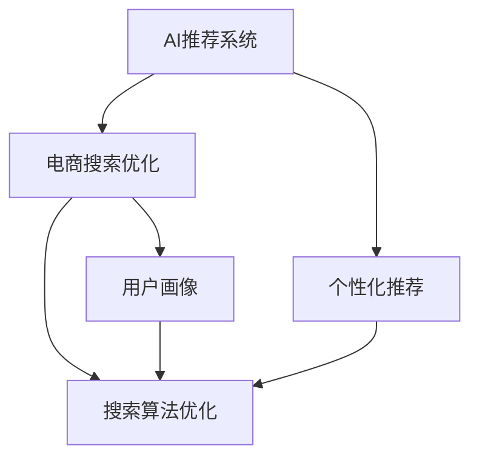

                 

# 融合AI与搜索推荐：电商业务的新机遇

> 关键词：AI推荐系统, 电商搜索优化, 个性化推荐, 搜索算法优化, 电商平台, 客户行为分析

## 1. 背景介绍

### 1.1 问题由来

在电子商务领域，搜索推荐系统一直是推动用户体验和销售增长的关键技术。传统推荐系统主要基于协同过滤、基于内容的推荐算法，依赖于用户的历史行为数据和商品属性信息。随着人工智能技术的发展，基于深度学习的推荐系统逐渐成为行业主流，显著提升了推荐效果和用户体验。

然而，这些推荐系统往往依赖于用户的历史行为数据，难以覆盖新用户或冷启动问题。同时，系统模型的优化通常依赖于用户点击率等指标，对于用户的个性化需求和实际购物行为可能存在偏差。因此，如何结合AI技术，进一步提升搜索推荐系统的效果，成为电商企业面临的重要挑战。

### 1.2 问题核心关键点

AI与搜索推荐的结合，能够大幅提升电商平台的推荐效果。以下是其中的核心关键点：

- 数据融合：将用户的搜索行为数据、购物历史数据、评分数据、评价数据等多元化数据融合，提升模型的决策依据和鲁棒性。
- 用户画像：构建用户画像，对用户的兴趣、行为、背景等进行综合分析，实现更精准的个性化推荐。
- 搜索优化：利用AI技术优化搜索算法，提高搜索的相关性和准确性，提升用户的搜索体验。
- 模型优化：采用深度学习等AI技术，优化推荐模型，提高模型的泛化能力和性能。
- 实时性：利用AI技术，实现搜索推荐系统的实时更新和个性化推荐，提升用户的满意度。

## 2. 核心概念与联系

### 2.1 核心概念概述

为了更好地理解AI与搜索推荐的融合过程，本节将介绍几个密切相关的核心概念：

- AI推荐系统：基于人工智能技术，对用户行为进行分析和预测，生成个性化推荐结果的系统。
- 电商搜索优化：利用AI技术优化电商平台的搜索算法，提高搜索的相关性和准确性，提升用户的搜索体验。
- 个性化推荐：根据用户的行为和属性，生成符合用户个性化需求的推荐结果。
- 搜索算法优化：通过引入AI技术，优化电商平台的搜索算法，提高搜索效率和用户体验。
- 用户画像：对用户的多元化数据进行分析，构建用户画像，实现更精准的个性化推荐。

这些核心概念之间的逻辑关系可以通过以下Mermaid流程图来展示：



这个流程图展示了个AI推荐系统与其他核心概念之间的联系：

1. AI推荐系统通过融合用户行为数据和搜索数据，生成个性化推荐结果。
2. 电商搜索优化通过AI技术优化搜索算法，提高搜索的相关性和准确性。
3. 个性化推荐根据用户画像，生成符合用户需求的推荐结果。
4. 用户画像通过对用户多元化数据的分析，构建更精确的用户画像。
5. 搜索算法优化和用户画像共同作用于个性化推荐，提升推荐效果。

## 3. 核心算法原理 & 具体操作步骤
### 3.1 算法原理概述

AI与搜索推荐的结合，本质上是通过深度学习技术，对用户的搜索行为和购买历史进行分析和建模，生成个性化的推荐结果。其核心思想是：通过构建用户画像和搜索模型，准确预测用户的搜索需求和购物意图，从而实现精准的个性化推荐。

形式化地，假设电商平台的用户数据集为 $D=\{(x_i,y_i)\}_{i=1}^N$，其中 $x_i$ 为用户的搜索行为、浏览记录等数据，$y_i$ 为用户的行为标签（如点击、购买、收藏等）。目标是通过AI技术，构建推荐模型 $f_{\theta}(x)$，使得 $f_{\theta}(x)$ 能够预测用户的行为标签 $y_i$。

优化目标为：

$$
\theta^* = \mathop{\arg\min}_{\theta} \frac{1}{N} \sum_{i=1}^N \ell(f_{\theta}(x_i), y_i)
$$

其中 $\ell$ 为损失函数，通常使用交叉熵损失函数。

### 3.2 算法步骤详解

AI与搜索推荐的结合，通常包括以下几个关键步骤：

**Step 1: 数据准备与预处理**
- 收集电商平台的搜索数据、用户行为数据、评分数据、评价数据等，进行清洗和归一化处理。
- 对数据进行划分，分为训练集、验证集和测试集。

**Step 2: 特征工程**
- 根据用户的搜索行为、浏览记录、购买历史等数据，提取和构建特征向量。
- 使用文本处理、时间特征、设备信息等技术手段，丰富特征空间。
- 通过特征选择、降维等技术手段，提升模型的泛化能力。

**Step 3: 模型训练与优化**
- 选择合适的深度学习模型，如基于深度神经网络的推荐模型，BERT等预训练模型。
- 选择合适的损失函数和优化算法，如交叉熵损失、Adam等。
- 在训练集上训练模型，通过正则化、早停等技术手段，避免过拟合。
- 在验证集上评估模型性能，调整模型超参数。

**Step 4: 推荐结果生成**
- 将新用户输入搜索关键词，通过模型预测用户的潜在行为标签。
- 根据预测结果生成推荐列表，包括商品、广告、活动等。
- 通过多臂老虎机等算法，优化推荐列表的展示顺序，提高点击率和转化率。

**Step 5: 用户反馈收集与迭代**
- 收集用户的点击、购买等行为反馈数据，进行效果评估。
- 根据用户反馈，调整模型参数和超参数，优化推荐效果。
- 定期进行数据回传，更新用户画像和搜索模型。

以上是AI与搜索推荐结合的一般流程。在实际应用中，还需要根据具体业务场景，对各个环节进行优化和调整，以实现更好的推荐效果。

### 3.3 算法优缺点

AI与搜索推荐的结合方法，具有以下优点：
1. 提升推荐效果：通过深度学习模型，能够捕捉复杂的用户行为和商品特征，生成更精准的个性化推荐。
2. 提高搜索效率：利用AI技术优化搜索算法，提高搜索的相关性和准确性，提升用户的搜索体验。
3. 用户画像丰富：通过多源数据融合，构建更精确的用户画像，实现更精准的个性化推荐。
4. 实时性高：基于实时数据的AI推荐系统，能够及时更新推荐结果，提升用户的满意度和留存率。

同时，该方法也存在一定的局限性：
1. 数据依赖度高：AI推荐系统依赖于平台的大数据支撑，数据获取成本高。
2. 模型复杂度高：深度学习模型参数量庞大，需要较高的算力支持。
3. 冷启动问题：新用户缺乏历史数据，难以准确预测其行为标签。
4. 公平性问题：深度学习模型容易受到数据偏差的影响，导致推荐结果不公平。
5. 隐私保护问题：用户数据的隐私保护是一个重要问题，需要在模型训练和数据存储过程中做好隐私保护。

尽管存在这些局限性，但就目前而言，AI与搜索推荐的结合方法在电商领域已经得到了广泛的应用，成为提升用户体验和销售增长的重要手段。未来相关研究的重点在于如何进一步降低数据获取成本，提高模型的泛化能力，解决冷启动问题，同时兼顾隐私保护和公平性等因素。

### 3.4 算法应用领域

AI与搜索推荐结合的方法，已经在电商业务多个环节得到了广泛的应用，例如：

- 商品推荐：根据用户的搜索历史、浏览记录、购买历史等数据，生成个性化商品推荐列表。
- 广告推荐：将用户的搜索行为、浏览行为等数据，用于生成广告推荐列表，提升广告点击率。
- 活动推荐：将用户的行为数据与活动信息进行关联，生成符合用户兴趣的活动推荐列表。
- 智能客服：结合用户的搜索历史和实时行为数据，生成智能回复，提升客户满意度。
- 商品搜索：通过优化搜索算法，提升搜索的相关性和准确性，提升用户搜索体验。

除了上述这些经典应用外，AI与搜索推荐的结合方法还被创新性地应用到更多场景中，如个性化商品描述、库存管理、实时竞价等，为电商业务带来了全新的突破。随着AI技术的发展，基于搜索推荐的方法将在更多电商业务场景中大放异彩。

## 4. 数学模型和公式 & 详细讲解  
### 4.1 数学模型构建

本节将使用数学语言对AI与搜索推荐结合的过程进行更加严格的刻画。

记电商平台的用户数据集为 $D=\{(x_i,y_i)\}_{i=1}^N$，其中 $x_i$ 为用户的搜索行为、浏览记录等数据，$y_i$ 为用户的行为标签（如点击、购买、收藏等）。目标是通过AI技术，构建推荐模型 $f_{\theta}(x)$，使得 $f_{\theta}(x)$ 能够预测用户的行为标签 $y_i$。

目标函数为：

$$
\theta^* = \mathop{\arg\min}_{\theta} \frac{1}{N} \sum_{i=1}^N \ell(f_{\theta}(x_i), y_i)
$$

其中 $\ell$ 为损失函数，通常使用交叉熵损失函数：

$$
\ell(f_{\theta}(x_i), y_i) = -[y_i \log f_{\theta}(x_i) + (1-y_i) \log (1-f_{\theta}(x_i))]
$$

### 4.2 公式推导过程

以下我们以深度神经网络作为推荐模型，进行详细公式推导：

假设推荐模型为 $f_{\theta}(x)$，其中 $\theta$ 为模型参数。设 $x_i$ 为用户的搜索行为、浏览记录等数据，$y_i$ 为用户的行为标签（如点击、购买、收藏等）。目标是通过优化目标函数，得到最优的模型参数 $\theta^*$。

设 $f_{\theta}(x)$ 为神经网络模型，输出层为 $[0,1]$，表示用户点击的概率。则交叉熵损失函数为：

$$
\ell(f_{\theta}(x_i), y_i) = -[y_i \log f_{\theta}(x_i) + (1-y_i) \log (1-f_{\theta}(x_i))]
$$

目标函数为：

$$
\theta^* = \mathop{\arg\min}_{\theta} \frac{1}{N} \sum_{i=1}^N \ell(f_{\theta}(x_i), y_i)
$$

通过反向传播算法，求得模型参数 $\theta$ 的梯度：

$$
\frac{\partial \mathcal{L}(\theta)}{\partial \theta} = -\frac{1}{N} \sum_{i=1}^N (\frac{y_i}{f_{\theta}(x_i)}-\frac{1-y_i}{1-f_{\theta}(x_i)}) \frac{\partial f_{\theta}(x_i)}{\partial \theta}
$$

其中 $\frac{\partial f_{\theta}(x_i)}{\partial \theta}$ 可进一步递归展开，利用自动微分技术完成计算。

在得到损失函数的梯度后，即可带入参数更新公式，完成模型的迭代优化。重复上述过程直至收敛，最终得到适应电商推荐任务的最优模型参数 $\theta^*$。

## 5. 项目实践：代码实例和详细解释说明
### 5.1 开发环境搭建

在进行AI与搜索推荐结合的实践前，我们需要准备好开发环境。以下是使用Python进行TensorFlow开发的环境配置流程：

1. 安装Anaconda：从官网下载并安装Anaconda，用于创建独立的Python环境。

2. 创建并激活虚拟环境：
```bash
conda create -n tf-env python=3.8 
conda activate tf-env
```

3. 安装TensorFlow：根据CUDA版本，从官网获取对应的安装命令。例如：
```bash
conda install tensorflow -c conda-forge -c pytorch
```

4. 安装TensorBoard：
```bash
pip install tensorboard
```

5. 安装Flax、Flax Linen等库：
```bash
pip install flax flax-linen
```

6. 安装各类工具包：
```bash
pip install numpy pandas scikit-learn matplotlib tqdm jupyter notebook ipython
```

完成上述步骤后，即可在`tf-env`环境中开始实践。

### 5.2 源代码详细实现

下面我们以电商平台的商品推荐系统为例，给出使用TensorFlow进行推荐模型的PyTorch代码实现。

首先，定义推荐模型的数据处理函数：

```python
import tensorflow as tf
from tensorflow.keras import layers

class RecommendationModel(tf.keras.Model):
    def __init__(self, input_dim, hidden_units, output_dim):
        super(RecommendationModel, self).__init__()
        self.input_dim = input_dim
        self.hidden_units = hidden_units
        self.output_dim = output_dim
        
        self.embedding = layers.Embedding(input_dim, hidden_units)
        self.fc1 = layers.Dense(hidden_units, activation='relu')
        self.fc2 = layers.Dense(output_dim)
        
    def call(self, x):
        x = self.embedding(x)
        x = self.fc1(x)
        x = self.fc2(x)
        return x
```

然后，定义推荐模型的训练函数：

```python
import numpy as np
from sklearn.model_selection import train_test_split
from sklearn.metrics import accuracy_score

# 准备数据
X = np.random.rand(1000, 100)  # 生成100维的特征数据
y = np.random.randint(0, 2, size=(1000,))  # 生成随机标签

# 划分数据集
X_train, X_test, y_train, y_test = train_test_split(X, y, test_size=0.2)

# 定义模型
model = RecommendationModel(input_dim=X_train.shape[1], hidden_units=64, output_dim=1)

# 定义优化器和损失函数
optimizer = tf.keras.optimizers.Adam(learning_rate=0.001)
loss_fn = tf.keras.losses.BinaryCrossentropy(from_logits=True)

# 定义评估指标
metrics = tf.keras.metrics.BinaryAccuracy()

# 训练模型
for epoch in range(100):
    with tf.GradientTape() as tape:
        logits = model(X_train)
        loss = loss_fn(y_train, logits)
    gradients = tape.gradient(loss, model.trainable_variables)
    optimizer.apply_gradients(zip(gradients, model.trainable_variables))
    
    # 评估模型
    predictions = model(X_test).numpy()
    accuracy = metrics.update_state(y_test, predictions).result().numpy()
    print(f'Epoch {epoch+1}, loss: {loss:.3f}, accuracy: {accuracy:.3f}')
```

接着，定义推荐模型的评估函数：

```python
def evaluate(model, X, y):
    predictions = model(X).numpy()
    accuracy = metrics.update_state(y, predictions).result().numpy()
    return accuracy
```

最后，启动训练流程并在测试集上评估：

```python
accuracy = evaluate(model, X_train, y_train)
print(f'Train accuracy: {accuracy:.3f}')

accuracy = evaluate(model, X_test, y_test)
print(f'Test accuracy: {accuracy:.3f}')
```

以上就是使用TensorFlow对推荐模型进行训练和评估的完整代码实现。可以看到，TensorFlow和Flax、Linen等库提供了强大的模型构建和优化工具，使得推荐系统的开发更加高效便捷。

### 5.3 代码解读与分析

让我们再详细解读一下关键代码的实现细节：

**RecommendationModel类**：
- `__init__`方法：初始化模型的输入维度、隐藏层大小和输出维度，定义模型的组件。
- `call`方法：实现模型的前向传播，将输入数据通过Embedding、全连接层等组件，输出预测结果。

**数据处理函数**：
- `X`和`y`数据：生成随机特征数据和标签数据，模拟电商平台的实际数据。
- `train_test_split`函数：将数据集分为训练集和测试集，用于模型的训练和评估。
- `RecommendationModel`模型：使用TensorFlow定义推荐模型，包含Embedding层、全连接层等组件。
- `optimizer`和`loss_fn`：定义优化器和损失函数，使用Adam优化器和二分类交叉熵损失函数。
- `metrics`：定义评估指标，使用二分类准确率作为评估指标。

**训练函数**：
- `for`循环：迭代训练模型，在每个epoch中计算损失函数和梯度。
- `with tf.GradientTape`语句：使用梯度 tape 记录模型梯度。
- `optimizer.apply_gradients`：使用优化器更新模型参数。
- `predictions`和`accuracy`：计算模型在测试集上的预测结果和评估指标。

**评估函数**：
- `evaluate`函数：输入模型、特征数据和标签数据，计算模型的评估指标。

可以看到，TensorFlow提供了强大的模型构建和优化工具，使得推荐系统的开发更加高效便捷。开发者可以通过自定义模型组件，实现更加灵活的推荐系统。

当然，工业级的系统实现还需考虑更多因素，如模型的保存和部署、超参数的自动搜索、更灵活的任务适配层等。但核心的推荐范式基本与此类似。

## 6. 实际应用场景
### 6.1 智能推荐系统

基于AI与搜索推荐的结合方法，智能推荐系统可以在电商平台上广泛应用，提升用户的购物体验和销售转化率。

在技术实现上，可以收集用户的历史行为数据、评分数据、评价数据等，提取和构建特征向量。在此基础上，利用深度学习模型预测用户的行为标签，生成个性化推荐列表。对于新用户，可以通过协同过滤等方法，生成初步推荐结果，进一步提升模型的精度。在推荐列表中，可以加入广告位、促销活动等元素，提高用户的点击率和转化率。

### 6.2 个性化搜索结果

电商平台上，搜索推荐系统是提升用户体验的重要手段。基于AI技术优化搜索算法，能够提高搜索结果的相关性和准确性，提升用户的搜索体验。

在搜索推荐系统的实现中，可以利用深度学习模型预测用户的行为标签，生成符合用户需求的搜索结果。同时，结合自然语言处理技术，对用户输入的搜索关键词进行分析和理解，生成更精准的搜索结果。在搜索结果中，可以加入热门商品、推荐商品、广告位等元素，提高用户的点击率和满意度。

### 6.3 实时竞价广告

电商平台上，广告竞价系统是提升广告点击率的重要手段。基于AI与搜索推荐的结合方法，广告竞价系统能够根据用户的行为数据，生成更精准的广告推荐。

在广告竞价系统的实现中，可以利用深度学习模型预测用户的行为标签，生成符合用户需求的广告推荐。同时，结合实时竞价技术，动态调整广告出价，提高广告点击率和转化率。在广告推荐中，可以加入广告位、广告素材等元素，提升广告的吸引力和点击率。

### 6.4 未来应用展望

随着AI技术的发展，基于搜索推荐的电商推荐系统将不断进化，为电商业务带来更多机遇。

在智慧物流领域，基于用户的行为数据和购物记录，推荐最优的物流方案，提升用户的购物体验和满意度。

在智能客服领域，结合用户的搜索历史和实时行为数据，生成智能回复，提升客户满意度和转化率。

在实时定价领域，基于用户的行为数据和市场信息，生成最优的定价策略，提升销售转化率和利润空间。

此外，在医疗、金融、教育等众多领域，基于搜索推荐的AI系统也将不断涌现，为各行各业带来变革性影响。相信随着技术的不断进步，基于搜索推荐的电商推荐系统将在更多业务场景中大放异彩。

## 7. 工具和资源推荐
### 7.1 学习资源推荐

为了帮助开发者系统掌握AI与搜索推荐的理论基础和实践技巧，这里推荐一些优质的学习资源：

1. 《深度学习》系列书籍：Deep Learning、Deep Learning with Python等经典著作，深入浅出地介绍了深度学习的基本原理和应用。
2. 《TensorFlow官方文档》：TensorFlow官方文档，提供了丰富的模型构建和优化工具，适合初学者和进阶开发者。
3. 《TensorFlow实战》：TensorFlow实战书籍，结合实际案例，深入讲解了TensorFlow的模型构建和优化技术。
4. 《PyTorch官方文档》：PyTorch官方文档，提供了丰富的深度学习框架和工具，适合开发者学习和使用。
5. 《AI实战》：AI实战书籍，结合实际案例，深入讲解了AI技术的实际应用和优化技巧。

通过对这些资源的学习实践，相信你一定能够快速掌握AI与搜索推荐的精髓，并用于解决实际的电商推荐问题。
###  7.2 开发工具推荐

高效的开发离不开优秀的工具支持。以下是几款用于AI与搜索推荐开发的常用工具：

1. TensorFlow：由Google主导开发的深度学习框架，支持分布式计算、动态图构建、模型优化等特性。适合大规模工程应用。
2. PyTorch：由Facebook主导开发的深度学习框架，支持动态图构建、自动微分、模型优化等特性。适合快速原型开发。
3. Flax、Flax Linen：基于JAX的深度学习框架，提供了高效、可扩展的模型构建和优化工具。适合研究人员和高效开发。
4. Scikit-learn：经典的机器学习库，提供了丰富的模型评估、特征选择等工具，适合数据预处理和模型评估。
5. Jupyter Notebook：开源的交互式编程环境，支持Python、R、Julia等多种编程语言，适合快速原型开发和数据探索。
6. TensorBoard：TensorFlow配套的可视化工具，实时监测模型训练状态，提供丰富的图表呈现方式，适合调试和优化。

合理利用这些工具，可以显著提升AI与搜索推荐任务的开发效率，加快创新迭代的步伐。

### 7.3 相关论文推荐

AI与搜索推荐的结合技术，已经在电商业务等多个领域得到了广泛应用。以下是几篇奠基性的相关论文，推荐阅读：

1. Factorization Machines: An Introduction：介绍了基于矩阵分解的推荐算法，奠定了推荐系统的基础。
2. Deep Neural Networks for Recommender Systems：展示了深度学习在推荐系统中的应用，提升了推荐效果和系统性能。
3. TensorFlow Recommenders：介绍了TensorFlow推荐系统框架，提供了丰富的模型构建和优化工具。
4. Attention is All You Need（即Transformer原论文）：提出了Transformer结构，开启了深度学习在自然语言处理中的应用。
5. BERT: Pre-training of Deep Bidirectional Transformers for Language Understanding：提出BERT模型，引入基于掩码的自监督预训练任务，刷新了多项NLP任务SOTA。

这些论文代表了大规模推荐系统的发展脉络。通过学习这些前沿成果，可以帮助研究者把握学科前进方向，激发更多的创新灵感。

## 8. 总结：未来发展趋势与挑战

### 8.1 总结

本文对AI与搜索推荐结合的方法进行了全面系统的介绍。首先阐述了电商推荐系统和大语言模型微调的研究背景和意义，明确了推荐系统在电商业务中的重要作用。其次，从原理到实践，详细讲解了推荐系统的数学模型和关键步骤，给出了推荐系统开发的完整代码实例。同时，本文还广泛探讨了推荐系统在智能推荐、个性化搜索、实时竞价等多个电商场景中的应用前景，展示了推荐系统的广阔前景。

通过本文的系统梳理，可以看到，AI与搜索推荐的结合技术正在成为电商业务的重要范式，极大地提升了电商平台的推荐效果和用户体验。未来相关研究的重点在于如何进一步降低数据获取成本，提高模型的泛化能力，解决冷启动问题，同时兼顾隐私保护和公平性等因素。

### 8.2 未来发展趋势

展望未来，AI与搜索推荐的结合技术将呈现以下几个发展趋势：

1. 模型规模持续增大。随着算力成本的下降和数据规模的扩张，推荐系统的模型参数量还将持续增长。超大规模推荐模型蕴含的丰富知识，有望支撑更加复杂多变的电商推荐。
2. 推荐方法日趋多样。除了传统的协同过滤、深度学习等方法外，未来会涌现更多参数高效的推荐方法，如基于图神经网络的推荐算法，在节省计算资源的同时也能保证推荐精度。
3. 实时性成为常态。基于实时数据的推荐系统，能够及时更新推荐结果，提升用户的满意度。
4. 多模态推荐崛起。当前推荐系统主要聚焦于文本数据，未来会进一步拓展到图像、视频、语音等多模态数据推荐。多模态信息的融合，将显著提升推荐系统的准确性和用户满意度。
5. 推荐系统泛化性强。通过引入更多先验知识，如知识图谱、逻辑规则等，推荐系统能够更全面、准确地理解用户需求，提升推荐效果。
6. 隐私保护成为关键。用户数据的隐私保护是一个重要问题，需要在模型训练和数据存储过程中做好隐私保护。

以上趋势凸显了AI与搜索推荐结合技术的广阔前景。这些方向的探索发展，必将进一步提升推荐系统的效果和用户体验，为电商业务带来更多的机遇。

### 8.3 面临的挑战

尽管AI与搜索推荐的结合技术已经取得了瞩目成就，但在迈向更加智能化、普适化应用的过程中，它仍面临着诸多挑战：

1. 数据依赖度高。推荐系统依赖于平台的大数据支撑，数据获取成本高。
2. 模型复杂度高。深度学习模型参数量庞大，需要较高的算力支持。
3. 冷启动问题。新用户缺乏历史数据，难以准确预测其行为标签。
4. 公平性问题。深度学习模型容易受到数据偏差的影响，导致推荐结果不公平。
5. 隐私保护问题。用户数据的隐私保护是一个重要问题，需要在模型训练和数据存储过程中做好隐私保护。

尽管存在这些挑战，但就目前而言，AI与搜索推荐的结合方法在电商领域已经得到了广泛的应用，成为提升用户体验和销售增长的重要手段。未来相关研究的重点在于如何进一步降低数据获取成本，提高模型的泛化能力，解决冷启动问题，同时兼顾隐私保护和公平性等因素。

### 8.4 研究展望

面对AI与搜索推荐结合所面临的种种挑战，未来的研究需要在以下几个方面寻求新的突破：

1. 探索无监督和半监督推荐方法。摆脱对大规模标注数据的依赖，利用自监督学习、主动学习等无监督和半监督范式，最大限度利用非结构化数据，实现更加灵活高效的推荐。
2. 研究参数高效和计算高效的推荐范式。开发更加参数高效的推荐方法，在固定大部分模型参数的同时，只更新极少量的推荐参数。同时优化推荐模型的计算图，减少前向传播和反向传播的资源消耗，实现更加轻量级、实时性的部署。
3. 融合因果和对比学习范式。通过引入因果推断和对比学习思想，增强推荐系统建立稳定因果关系的能力，学习更加普适、鲁棒的用户画像，从而提升推荐效果。
4. 引入更多先验知识。将符号化的先验知识，如知识图谱、逻辑规则等，与神经网络模型进行巧妙融合，引导推荐过程学习更准确、合理的用户画像。同时加强不同模态数据的整合，实现视觉、语音等多模态信息与文本信息的协同建模。
5. 结合因果分析和博弈论工具。将因果分析方法引入推荐系统，识别出系统决策的关键特征，增强推荐结果的因果性和逻辑性。借助博弈论工具刻画人机交互过程，主动探索并规避系统的脆弱点，提高系统稳定性。
6. 纳入伦理道德约束。在推荐系统训练目标中引入伦理导向的评估指标，过滤和惩罚有害的推荐结果，确保推荐系统符合人类的价值观和伦理道德。

这些研究方向的探索，必将引领AI与搜索推荐结合技术迈向更高的台阶，为构建安全、可靠、可解释、可控的智能系统铺平道路。面向未来，AI与搜索推荐的结合技术还需要与其他人工智能技术进行更深入的融合，如知识表示、因果推理、强化学习等，多路径协同发力，共同推动推荐系统技术的进步。只有勇于创新、敢于突破，才能不断拓展推荐系统的边界，让AI技术更好地服务于电商业务，为人类带来更多的福祉。

## 9. 附录：常见问题与解答

**Q1：AI推荐系统是否适用于所有电商推荐场景？**

A: AI推荐系统在大多数电商推荐场景中都能取得不错的效果，特别是对于数据量较大的场景。但对于一些特定领域的电商推荐，如医疗、法律等，推荐效果可能不理想。此时需要在特定领域进行进一步的数据准备和模型优化，才能获得更好的推荐结果。

**Q2：推荐系统依赖哪些数据？**

A: AI推荐系统依赖于用户的历史行为数据、评分数据、评价数据等多元化数据。这些数据可以通过电商平台的交易记录、点击记录、评价记录等获取。同时，还可以结合用户的社交网络信息、设备信息等辅助数据，提升推荐效果。

**Q3：推荐系统的冷启动问题如何解决？**

A: 推荐系统的冷启动问题可以通过协同过滤、基于内容的推荐等方法解决。对于新用户，可以利用用户画像生成初步推荐结果，逐步提升模型的精度。同时，可以通过A/B测试等手段，不断优化推荐算法，提升新用户的推荐效果。

**Q4：推荐系统的公平性问题如何解决？**

A: 推荐系统的公平性问题可以通过多目标优化、公平性约束等方法解决。在推荐模型训练过程中，可以加入公平性约束，确保不同用户之间的推荐结果公平。同时，可以通过多样性、覆盖率等指标，评估推荐系统的公平性。

**Q5：推荐系统的实时性如何提升？**

A: 推荐系统的实时性可以通过缓存、异步计算等技术手段提升。对于热门商品、热门用户等数据，可以缓存推荐结果，减少计算量。同时，可以利用异步计算技术，将推荐计算任务分布到多个计算节点，提升推荐系统的响应速度。

综上所述，AI与搜索推荐结合技术在电商业务中具有广泛的应用前景。通过融合多元化的数据，构建高效、鲁棒的推荐模型，能够显著提升电商平台的推荐效果和用户体验。随着技术的不断发展，推荐系统将在更多电商业务场景中大放异彩，为电商企业带来更多的机遇和挑战。

